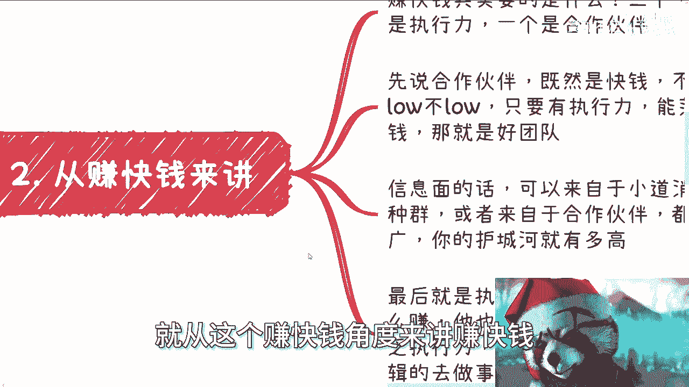

# 课程：什么是护城河？如何建立？ - P1 🏰

在本节课中，我们将探讨“护城河”这一概念在个人职业与发展中的含义，并分析在不同场景下建立护城河的具体方法。我们将从卷工作、赚快钱、获取高性价比收入以及提升个人认知四个维度进行拆解。

---

## 概述 📋

“护城河”通常比喻为保护自身优势、抵御竞争的核心能力或资源。对于绝大多数普通人而言，真正的护城河并非来自学历或技术，而是来自人际关系、信息获取、执行力等更实际的维度。本教程将撇开先天优势或极端情况，聚焦于普通人在社会中可以主动构建的护城河。

---

## 一、 卷工作中的护城河 💼

上一节我们概述了护城河的概念，本节中我们来看看在传统职场竞争中，什么才是有效的护城河。

许多人认为学校、学历和专业是护城河。这个观点在职业生涯初期是正确的。但工作三到五年后，这些优势对大多数人而言会消失殆尽。工作十年后，这些优势基本毫无用处。绝大多数人掌握的技术和专业能力并不突出，都属于人群中95%到98%的普通部分。

因此，在卷工作的角度，护城河有两点核心。

以下是卷工作中护城河的两个核心要素：

1.  **与领导的关系**：能否很好地维护与上级、乃至上级的上级的关系。在普通职场环境中，你掌握的技能别人也可能掌握，此时维护关系的能力就成为了关键护城河。公式可以表示为：**职场护城河 ≈ f(关系维护能力)**。
2.  **行业内的社交面**：工作年限增长后，许多工作机会并非来自公开招聘，而是来自人际关系网络。广泛的行业社交面是重要的护城河。

如果依然认为仅靠努力工作和学历就能构建护城河，那么未来的发展将面临挑战。每个人的生活由自己决定。

---

## 二、 赚快钱中的护城河 💰

上一节我们探讨了职场中的护城河，本节我们将视角转向如何快速获取收益，并分析其中的关键。

赚快钱的核心在于迅速抓住机会并落地。在此过程中，护城河体现在三个方面。

以下是赚快钱中护城河的三个核心要素：

1.  **合作伙伴**：快钱项目不追求高大上的背景，关键在于找到有执行力、能落地、并有过成功合作经验的团队。好的团队是快钱项目的基石。代码可以表示为：`good_team = (has_execution_power && has_landing_ability && has_cooperation_experience)`。
2.  **信息面**：广泛的信息来源是发现机会的前提。信息可以来自小道消息、付费社群或合作伙伴。虽然获取信息的过程可能需要交“学费”，但最终积累的多元信息渠道构成了护城河。信息面越广，护城河越高。
3.  **执行力**：许多人即使知道方法也因顾虑过多而无法行动。强大的执行力体现在能抓住重点、分清主次、并有逻辑地推进事情。执行力是将信息转化为结果的关键护城河。

---

## 三、 高性价比/税后收入中的护城河 📈

上一节我们讨论了赚快钱的要素，本节我们来看看如何建立更稳定、高效的收入来源，即高性价比或税后收入的护城河。

这类收入的护城河可以概括为“一上一下”。

以下是构建稳定收入护城河的两个核心：

1.  **关系（上）**：核心是硬实且广泛的关系链。收入来源于项目，项目来源于人，而人则来源于你的关系网络。这种关系可以通过后天合作逐步积累，并非完全依赖先天条件。许多有价值的项目（年收入几十万到几百万）并非只有“二代”才能接触。
2.  **合作伙伴（下）**：要实现高效率或税后收入，单打独斗或单一企业很难完成。需要多个个人或企业抱团配合，各自负责擅长的环节，最终共同达成目标。这种稳定的合作网络本身就是一个强大的护城河。

具备以上两点后，你的收入稳定性将远高于普通打工者或公务员。你可以主动控制赚钱的节奏，经济好坏只影响赚多赚少，而不会面临突然失业的风险。

---

## 四、 人生维度中的护城河 🧠

前面几节我们分别从工作、赚钱等具体场景分析了护城河，本节我们将视角提升到整个人生发展的层面。

从人活着的角度，护城河在于不断提升和拓宽自己的认知。个人的认知范围决定了其应对变化和寻找出路的能力。

如果认知仅局限于学校教育和书本知识，对外面的社会、商业、政治运作一无所知，那么当面临挫折、年龄增长或竞争失败时，将缺乏变通的能力，容易怨天尤人。其护城河非常薄弱。

护城河的建立方式在于，在学生时期或职业生涯早期，就要有意识地参与社会化的活动、商业运作甚至政治运作（如项目评审）。可以尝试接触国内外、面向用户、企业或政府的各种业务。

参与越多，认知越广，护城河就越牢固。总是等待他人给出解决方案，缺乏自主搜索信息和探索的能力，这本身就体现了认知的局限和教育在某种程度上的失败。

---

## 总结 🎯

本节课中我们一起学习了“护城河”在个人发展中的多元内涵及其构建方法。

我们得出核心结论：**除非你在某个尖端技术或学术领域是绝对的顶尖人才（Top），否则对绝大多数人而言，学历和技术不会成为持久的护城河。**

真正的护城河在于：
*   **职场中**：与领导的关系和行业社交面。
*   **赚快钱中**：靠谱的合作伙伴、广泛的信息面和强大的执行力。
*   **稳定收入中**：硬实的关系链和稳定的合作网络。
*   **人生发展中**：不断拓宽的社会认知与实践经验。

护城河的建立是一个主动积累和实践的过程，关键在于跳出单一维度的竞争思维，在更广阔的社会网络中构建属于自己的独特优势。