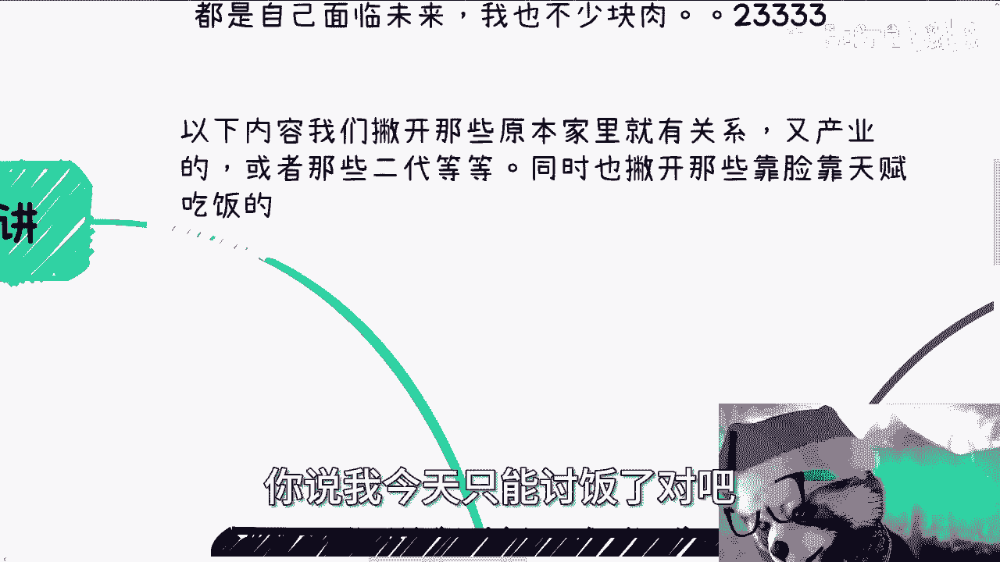

# 所谓的护城河是什么？又如何建立 - P1 - 赏味不足 - BV1Pv42127Ek

啊大家好啊，今天我忙了一天了。

前两天好多小伙伴问我这个护城河是什么。

是如何建立呃，我大概列了一下啊。

首先啊先说这样啊，这个最近一些主题呢，看到了很多象牙塔里的人啊，这个三观受到了冲击啊，我很是开心啊，呃并且他们拒绝接受真相啊，我觉得也很不错啊，为什么呢，因为接受不接受随便啊，这个接受不接受。

反正这个未来也都是自己面对的啊，你接受也好，不接受也罢，我也不少块肉，我也不，我也不多块肉是吧啊，首先这第一个第二个呢以下内容啊，我们撇开那些原本家里就有关系啊，或者有产业啊，或者说那些二代。

同时也撇撇开那些靠脸靠身材啊，靠颜值对吧，靠天赋吃饭的啊，我们先撇开这些很牛逼的人，然后也撇开那些就是说实在是不行的，你说我今天只能讨饭了吧。

去头去尾，我得把话说清楚。

首先先从卷工作来讲啊，你的学校你的学历，很多人觉得是你的护城河对吧，这没有错啊，我还是那句话，你们去问问看上过班的人啊，你的学校你的学历跟你的专业，在你工作三到5年左右之后，就你的优势早就消失殆尽了。

当然有一些可能有区别，比如说医学对吧，比如说，有一些特别的这个光刻机啊，芯片啊啊可能是的啊，可能是有些区别，但是我觉得大部分的人啊，你们手上拥有的技术跟你们的所谓的那些学历。

跟你们的专业并没有非常突出啊，也我说的突出，就是说并不会在工作上特别突出，你们跟我跟其他人一样，我们只是在其中去头去尾的那95%，或者97%甚至98%啊，那么你们的这些优势，会在三到5年左右就消失殆尽。

就这么简单一件事啊，那么工作10年以后，基本上我可以跟你讲，没有任何卵用了，很清楚的事情，当然你现在可以不在乎啊，但是还是那句话，每个人时间都是往后走的啊，你不可能跟我说，你20多岁毕业了。

30多岁财务自由，你除了这么说以外，你后面面临的问题你该解决还是要解决的，对啊，如果你让我从卷工作角度来讲，我觉得护城河是有的。

有两点，第一你跟领导的关系，你是不是能很好地跪舔你的领导，千万千万千万你们不要再来跟我说什么技术啊，什么一技之长，什么什么技术上的护城河有吗啊有吗，多少人有啊，我告诉你们，你们没有，我也没有。

我们就不是这种人啊，好吧，你能不能很好的跪舔你领导，你的上级，你的上级的上级，我跟你讲，这就是你的护城河，这就是普通人在企业里的护城河，还能有谁啊啊，你会的东西别人也会，那那那只能期待你舔的技术。

别人不会了对吧，第二就是你在行业里面的社交面广不广，因为年纪稍微上去一点的人，他自然会明白，就是他的工作不是靠面试来的，不是靠什么boss直聘啊，啊谁他妈的时间长了还靠这种玩意儿。

他都是靠关系找的工作啊，啊真的懂得都懂啊，对吧，当然啊，如果还有那种什么都认为啊，好好工作对吧啊，努力就有结果的，好好读书吧，弄个学历出来就有护城河的，那我告诉你们，你就自生自灭啊，就这个样子了对吧。

人就一辈子，你自己的生活自己决定嗯，你要你要觉得你20多岁。

30多岁，40多岁一辈子去卷难，那你去卷吧，无所谓啊。

我们这个救不了所有人，对吧啊，然后第二呢就从这个赚快钱角度来讲。

赚快钱，咳咳其实我觉得三个，一个是信息面，一个是执行力，一个是合作伙伴，先说合作伙伴啊，既然是快钱，也就是说你根本就不用去管他的背书，管他他妈的高不高大上，low不low，无所谓，他只要有执行力。

能落地，能跟你一起赚过钱，先不说赚多少钱啊，能跟你赚过钱，那他妈就是好团队啊，你别管这么多，你都快钱了，你管这么多干嘛对吧，第二信息面，你的信息面可以来自于小道消息，也可以来自于各种付费社群。

也可以来自于合作伙伴啊，当然这个地方你该交的学费还是会交的啊，不能说你一分钱不亏啊，但是你最终积累下来，我们从结果导向来讲，就是你会有不同的消息来源啊，至于怎么来啊，随便你啊都可以啊，你的消息面多广。

你的护城河就有多高啊，然后最后一个就是执行力，其实很多人我跟你讲啊，你就算告诉他快钱怎么赚，他也不会转，因为他怕这个怕那个他思前想后，他会跟你说半天啊，我担心这个，我担心担心那个，然后呢给你抠细节啊。

本质上这些都是缺乏行动力的一个怎么说呢，一个原因啊，一个体现，或者说啊那么抓得住重点，我我只抓得住重点，就是说他明白哪些是应该他去想的，哪些根本就不用去关心的啊，同时又有逻辑性的去做事情。

那么很强的执行力，往下做这件事情就是护城河。

好吧好。

对好，然后第三就从高性价比或者税后收入来讲对吧。

咳咳我大概看了一下这玩意的护城河呢就两个，我们称之为一上一下啊，上就是最重要的就是关系，你想啊我们曾经讲过钱从哪来，钱从项目中来，项目从哪来，项目从人来，人从哪来，就看你的关系链硬不硬。

你的关系链撒的多广对吧，我顺便提一点啊，这种关系是可以通过合作，一步一步积累出来的啊，并不是说什么爱都靠天生都靠父母，靠投胎对吧，靠家庭，我跟你讲这种话，说出来就PUA打架没什么意义的啊。

就是我们不是都知道要来赚那什么，一个11年几个亿的项目，不是啊，卧槽那么一年几10万，一年几百万的项目多了啊，富二代都在做吗，不是啊，我也可以明确告诉你们，他妈别人根本就看不上好吗对吧，那当然啊。

我觉得跟我们一样的，这些人里面也有很多人眼高手低，看不上那拉倒对吧，我觉得还是那句话，你们别管别人怎么想，先关注自己啊，第二点就是你需要多个合作伙伴，或者来说在你执行过程落地过程当中。

需要抱团的合作伙伴，为什么，因为你但凡要高效率的或者要税后收入，你无论是一个人还是一个企业，你做不到的，我跟你讲不可能的，绝对不可能啊，你一定是多个人或者多个企业，他才能搞定的，因为大家要打配合。

你跟所有人都是负责某一块，到最终造成的是要最最终一个结果，就是说是你跟这些所有人都可以有，高效率的赚钱方式或者税后的方式，如果你们散开来就都没有啊，这个是第二点，第三没有第三点，这两点有了之后。

基本上我觉得你就会很稳定了，至少在中国这个国家很稳定，因为你比那些打工的公务员，做牛马的不知道稳定多少，因为你所有的赚钱的东西，你是可以主动去控制的，关系是你的合作，也是你的赚，你经济好也好。

经济差也好，对你来讲就是赚多赚少，你不可能面临着说啊，我工作没有啦，我第二天什么什么让你走人，赔你多少，我们不关心这些跟我们有什么关系，对不对，那那是什么呢，那是哪哪哪。

那这边的人去关心的跟我们没有关系啊，咳咳那么最后一个从人活着角度来讲，我觉得人活着的角度，他需要不停的提升自己的认知啊，最早的时候，为什么要提倡更多的这个思想运动对吧，为什么要提升整个全民，包括农民啊。

包括工农商对吧，各种各样的一些认知，因为什么，因为你认知多高，认知多广，你对这个社会，对这个国家，对历史了解多少，对全全国全球，因为你在就像我们以前说的，你个人往外对吧，是企业，你企业往外有行业。

行业往外有有有有有产业对吧，你产业往外有政府，政府往外有国家，国家网外还有全球对吧，你对全局要有了解，那么或你对全局了解越多，那么你的护城河也就越高啊，如果你仅仅依靠读书，依靠9年制跟高等教育无。

我不管你最终应试教育学得好不好，你的认知里面只有学校里面给你的东西，你没有外面任何东西，你什么都不知道对吧，就像就像我跟你讲，很搞笑的，就像很多人会跟我说，他说什么，哎陈老师这个人很牛逼的对吧。

我那个之前还有评论区跟我说，什么院士不院士的院士就牛逼了，他妈搞笑了，真的你们出去做做商业做做赚赚钱，看看院士是什么概念啊，院士不就是他妈在外面站台赚钱的概念吗，啊院士不就是拉过来当工具人的概念吗。

院士很牛逼，我也我也不太明白对吧，当然啊你们要有很多人觉得就是说那个什么，有些人什么学术做的很好或者怎么样子的，还是那句话好不好都是相对的啊，你们觉得中国某些地方好的，你放到全球去看看对吧啊。

那么当你我觉得当这些人碰到一些挫折，或者年龄大了对吧，碰到一些自然淘汰的规律，或者说竞争不过别人的时候，那他自然那他自然就没有了更多的方式去变通，为什么，因为他没有认知啊，你让他怎么变通呢对吧。

他只会怨天尤人，他只会把这个东西抱怨给环境对吧，然后就是就是见不得别人好，这就是现在很多人的现状对吧，甚至还有很多人就是说非常的怎么说呢，就是说哼就是他明明知道什么东西是不好的。

但是他为了让更多的人不好，他要去扭曲事实对吧，那么为什么，因为这些人的认知仅限于学校，那么就没有没有护城河对吧，你我觉得这个东西怎么建立，就是你需要在高校里的时候啊，就是在自己还没有毕业的时候。

你要有意识地去参加社会化的活动，你要有意识地去参加社会化的商业运作，你要有意识地去参加，甚至政治运作都可以呀，参加一些项目评审啊，叫什么东西都可以呀，对吧，我还是那句话，不要老是对自己说。

这些东西好像我们做不了，我只是个学生，我告诉你，你但凡是这种想法，我只能说明你不行，你知道吗，你不够浪啊，那包括国内国外的各种业务，你不是不能做，有什么不能做，大一大二大三我见过做的人多了对吧。

我们在海外见过人做做多了，而且也都是华人，对吧啊，你包括to用户的to高效的，to企业的，to政府的每条线，它里面细节都不一样对吧，越多越好，因为只有越来越多，你的认识才会越来越广了。

你护城河才会起来呀，哎否则是什么，否则就是一天到晚就在评论区问我，那邵老师，你说呀，我们我们你跟我说这个学校对吧，学历没用，那我还要怎么办，我没录了呀，但你告诉我怎么办对吧，然后就不停的问我。

你告诉我怎么办，有意思了。

没有意义的呀对吧，就是唉就我跟你讲啊，没有自己的搜索信息的能力啊，老是问别人怎么办，这其实已经体现出来，我教育的失败就是这个样子，就就我觉得很多人你们你你们看看评论区对吧，就是你们不觉得。

就是说哦在一个网络上对着一个免费的视频，然后里面的人在问诶，那你告诉我怎么办呢，而且还是个所谓的高材生，荒唐真是荒唐，哎呀。

所以我觉得护城河就是这些东西嗯，所以我最后补充一点，除非你是一个在学术研究，或者在某些特别的领域里面，你是非常优秀的，就非常非常优秀的，那么你的护城河可以是技术啊，可以是我们说的那些就是说设计啊。

开发啊啊这个这个这个这个做芯片啊，或者算法啊，可以的，只要你不是top，只要你不是非常突出的，这些东西在未来都不会成为你的护城河，没有用的啊，好就这么着吧，好吧。

