# 手把手给大学生的建议 - P1 - 赏味不足 - BV1cV4y1k781

好啊大家好啊，这个最近啊哈哈最近最近都在塞尔达是吧啊。

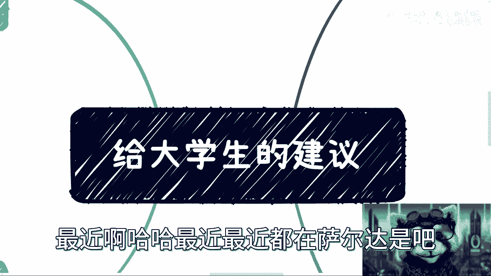

这个答应大家的东西啊，还好我也我也没玩几天是吧，就刚刚那个开完新手村，拿了那个滑翔伞，现在在外面开图。

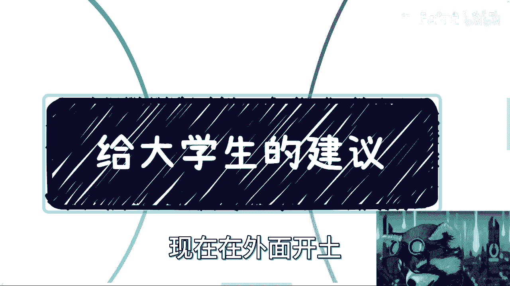

啊对之前有说那个给大学生建议啊，我这边大概列了几个，我想了一下呢，其实是这样子的，呃因为本身大学生的。

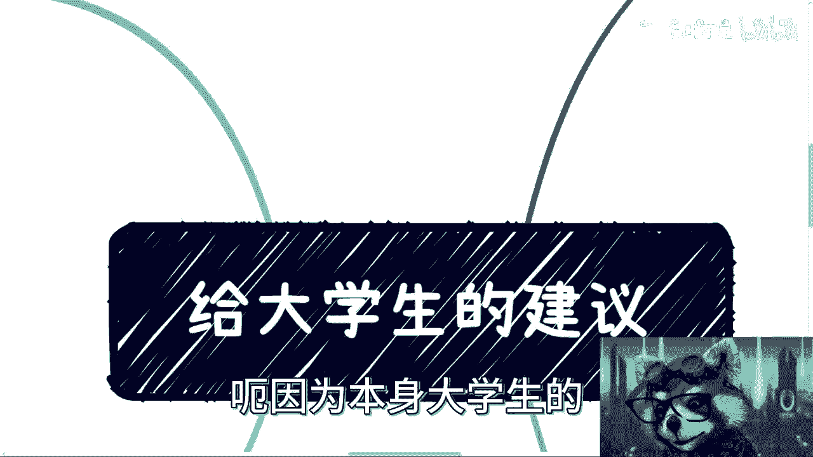

就现在大学生啊，很多时候呢也比较忙对吧，呃。

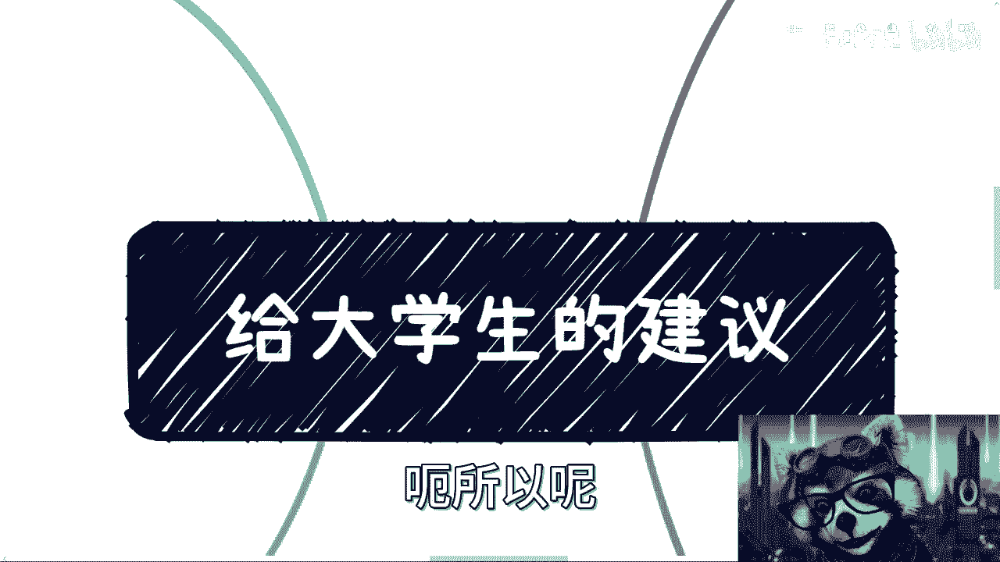

所以呢，我觉得就是剩余的时间也不见得那么多啊，我大概就列了一些，大家可以看一下。

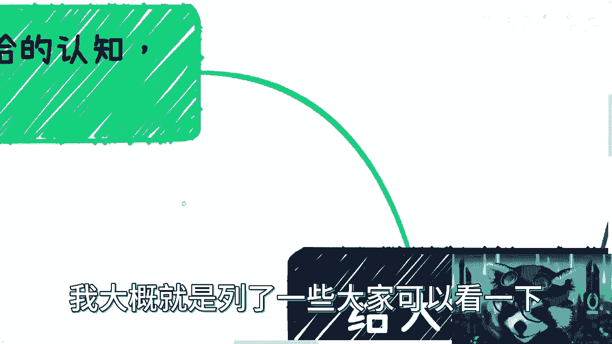

首先第一点是什么呢，是保留啊，我这边不是说放弃，我觉得放弃没有意义啊，保留所有学校跟家长给予的认知，时刻保持空杯心态啊，这个是最重要的，因为现在我觉得学校里面很多东西啊，我不说大家也知道对吧。

就是学校里面很多东西对，和社会上面跟企业里面是脱节的，而且这件事情呢，短时间内也不可能说有有很大的改变啊，那这个事儿呢。

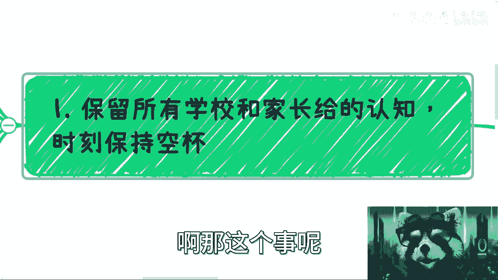

就是在这个地方我必须得强调对吧，那么比如说呢有哪些呢，比如说他说啊，你一定要去卷学历对吧，那我觉得这个不是真的不是非常必要的事情，说实话你要是跟我说，你现在是个高中的，那我当然是希望你去卷对吧。

那你告诉我你已经是一个不错的本科对吧，你非要去卷研究生，我觉得就没有太大意义，对不对啊，这个这是第一个，第二个呢就是比如说学校里面教导的一切，包括学科啊，包括就是学科上的一些学习。

包括市场上行情方向等等，这些东西呢，就是说你们就淡就姑且就当听一下啊，别去当真啊，所有东西呢你们都得自己去了解啊，就就靠这些是没有用的哦，那么那么同样的还有什么呢，比如说找一个什么工作吧。

比如说找什么方式，找什么样的工作稳定对吧，或者怎么样的这些呢你也直播且一听啊，别太去就说像就是我还那句话，就不是说你们不要相信他。

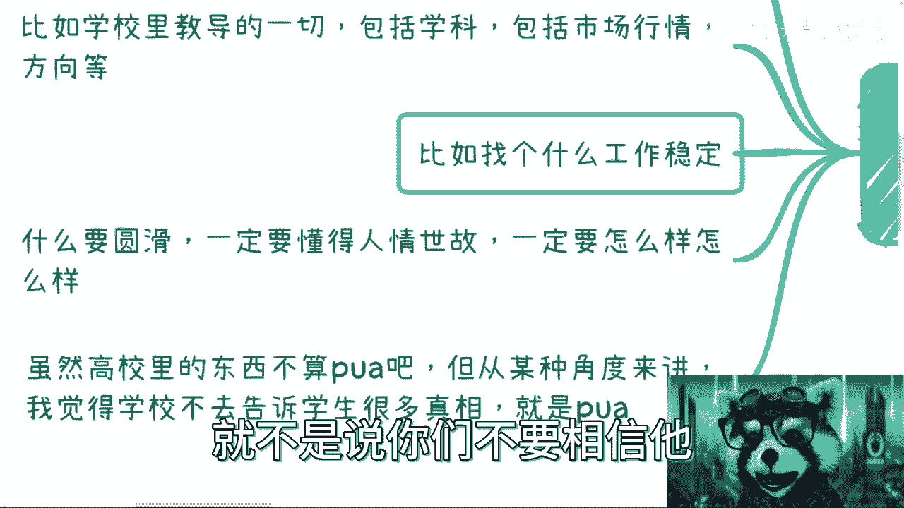

是说你们保留意见啊，剩下的呢你们就是要去时刻保持这个空杯心态。

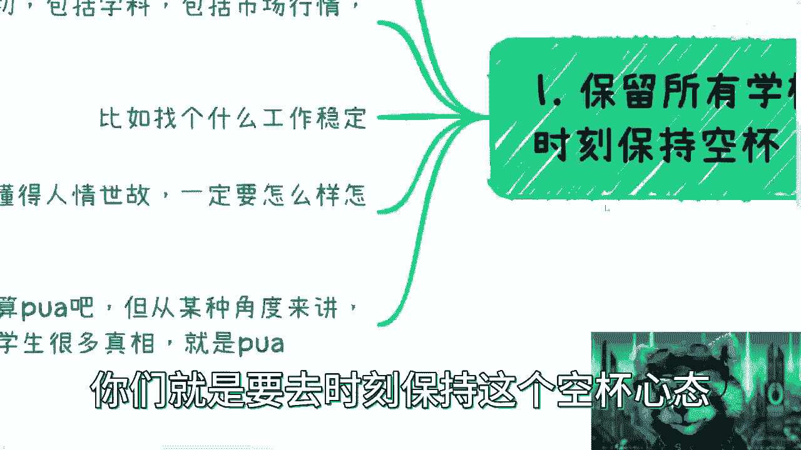

然后自己去了解啊，然后还有什么呢，就是什么一定要圆滑了，以后要懂得神情世故了，一定要怎么样怎么样了，在我认为啊，世界总要改变的啊，任何东西总要改变，就跟我之前说的喝酒文化是一样的，很多东西总是要改变的。

那么这些改变就是要从你我他开始做起的，就是要一步步去改的对吧，你要告诉所有的人说啊，你不能有棱角啊，你要圆滑，你要懂得人性世故，那你告诉我很多的劣劣根性，很多的这种叫做市场上非常嗯。

垃圾人的这种情况怎么改变哦，你不停的在PUA这些年轻人告诉他们，你们也像也要像那些垃圾一样学习，那怎么改变，对不对，那当然我不是说你不要懂得这些，你要懂，但是你得保持住你的三观。

而不是说你要你就最终变成了他们这样子，那么没救了对吧，那么同样的呃，高虽然高校里面的很多教的东西呢不算PUA，但是呢从某种角度角度来讲，我觉得学校的老师也好，教授也好，很多人也好，他其实不是不知道。

但是他不去告诉学生很多的真相。

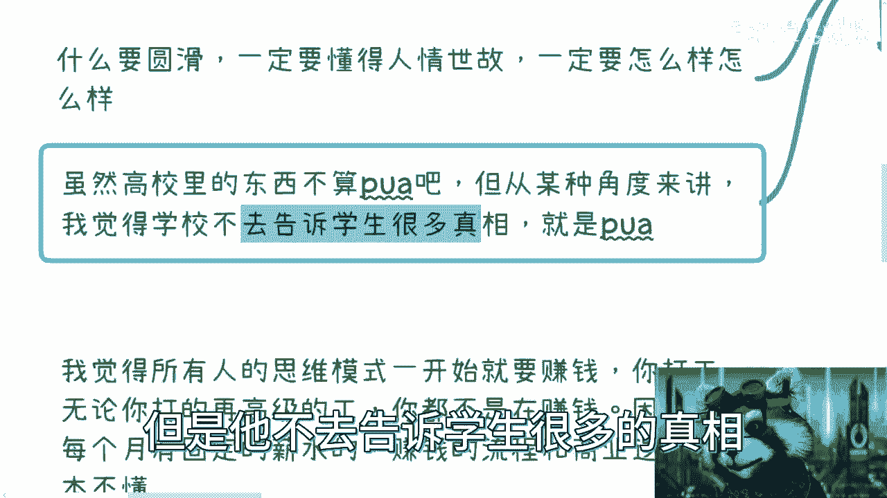

那么在我看来这就是PUA没什么区别的啊，没有什么区别的，那首先是第一点啊。

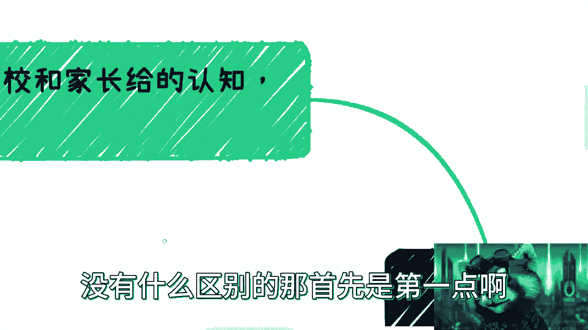

第二点我觉得从大一开始呢，你就要走出学校。

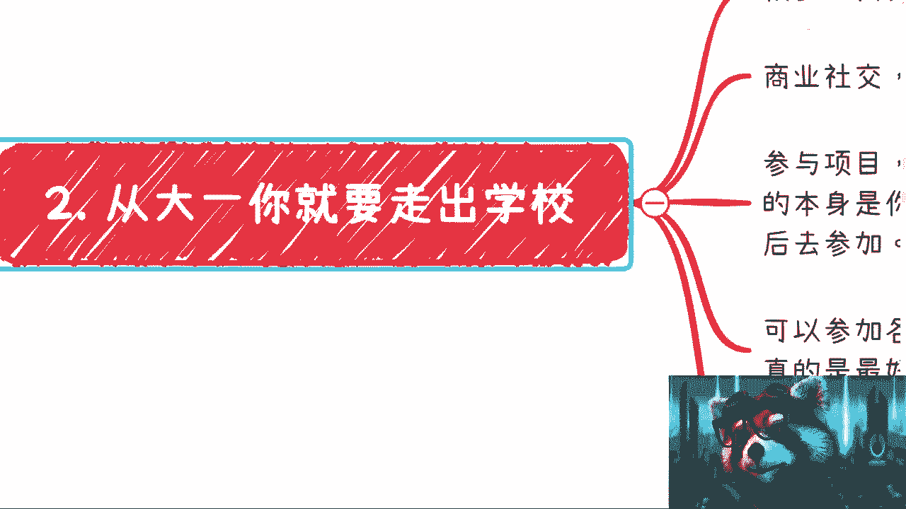

当然这个地方就是也有很多人说了啊，这个陈老师，你说大学生对吧，那我现在读个职校。

技校，读个大专算不算算了，就统称嘛高等教育嘛对吧，统称嘛啊。

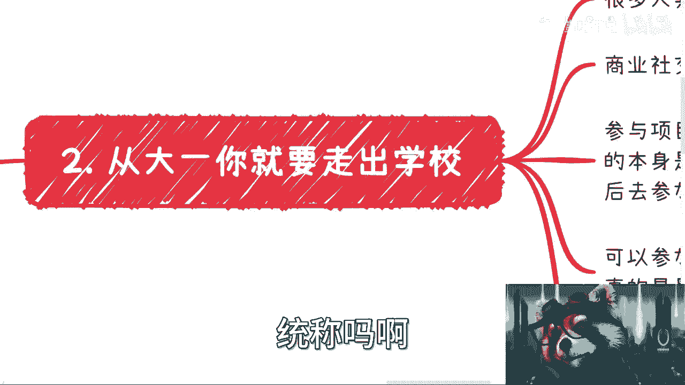

那么第一呢就是你得走出学校，因为呃当然很多人呢在这个地方，他说我不是很理解什么叫走出学校啊，第一呢就是说你得去做商业社交，你有大把的时间去试错，你明白吧，你如果现在已经是大三，要去找实习了。

大学要毕业了，你其实时间很紧张很紧张，你千万不要去浪费你之前的读书时间，首先是第一点，第二点呢就是说你要去参与项目，但是呢我跟你们讲啊，有很多人就是方式不对，他非要说什么，他说哎你看啊。

这个我我不要钱对吧，你要么让我参与一下对吧，参与的过程当中，我就学习学习，我跟你讲啊，所有有价值的项目，不管是开源的，不开源的，不管是你兼职还是还是嗯，比如说顾问还是怎么个方参与方式啊。

参与本身前提是你要有一定的竞争力，也就是说你有一定的这个这个价值啊，就我们说啊商业价值，你也有一定的这个这个这个叫什么能力，那么你才会被别人去合作对吧，你没有的话，我跟你讲，你就去学，你不能说啊。

我既然我既什么又不会对吧，又要参与，那不可能的对吧，你就有很多人会跟我说，他说陈老师你回头去政府啊，去哪里啊，你是不是带我一起去对吧，然后就我也学习学习，我就问啊，不是说我真的不能带去，我带去。

我跟领导那边说话也就一句话的事情，但是问题是你要想明白，我带你去干嘛，对吧啊，你要是跟我说啊，你去了对吧，就是免费的，就是就是那个学习一下，或者说你甚至给我笔钱学习一下，那其实这件事情可复制性太强了。

那照这种说法，世界上每个人都给我一笔钱，我每个人都带去，但这个事情可能了不可能呀，对不对，你得找到你的核心竞争力在什么地方，是不是，那我觉得这是第二点，第三点呢，就是说你也可以参加各种各样的活动啊。

也可以自己组织活动，我跟你讲啊，你还是学生的时候，真的你就是最好的身份，因为我告诉你们，你们一旦毕业了，一旦去了很多的公司，你们是很受限制的，你别不当一回事，我跟你们说哦，你去过很多公司。

你做很多事情真的就是就是到处都有人举报你，到处都有人背后穿，给你穿小鞋，你是学生，其实在学校以学生的身份做什么事情都无所谓，关系不大的，你不会跟别的企业什么做那个产生冲突，但是你一旦毕业了。

很多时候你真的身不由己，你知道吧，那么还有呢就是这个地方，就是你们需要静下心来去研读各个咨询公司，四大的报告啊，你不可，当然你不可能我跟你讲啊，这些报告都是数据说话的，你是不可能看不懂的。

因为这种报告本来就是给普罗大众看的，他不可能里面引用引用非常大段的，这种专业术语和专业的这种内容，不现实的，这些报告呢能够让你对全国甚至全球，你能够有一个足够的认知，你明白吗。

因为这些报告有的是产业报告，有的是技术报告，有的是商业报告，有的是融资报告，你可以慢慢去看。

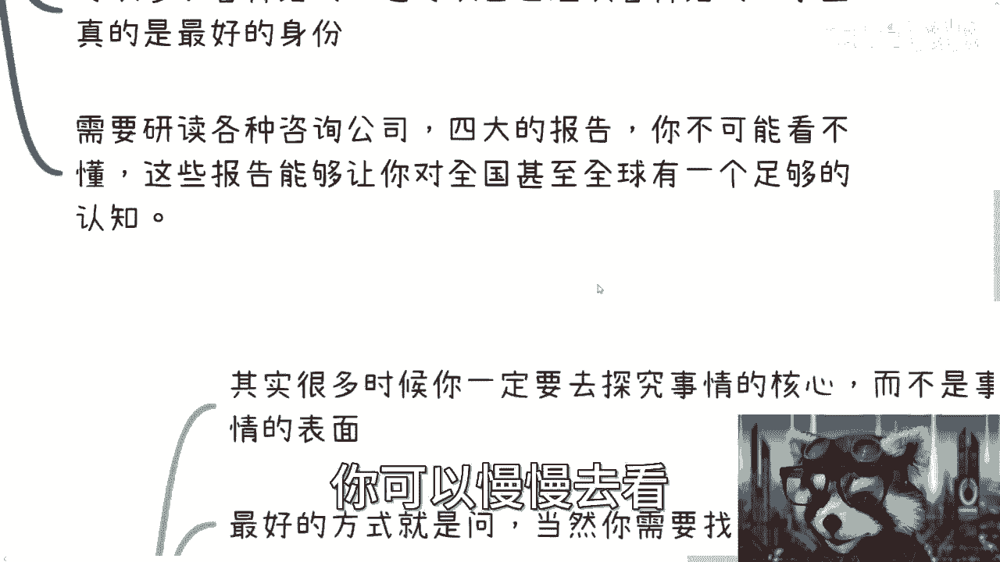

那么这样的话你对整个面会非常了解啊，你知道吗，好那么这是第二点。

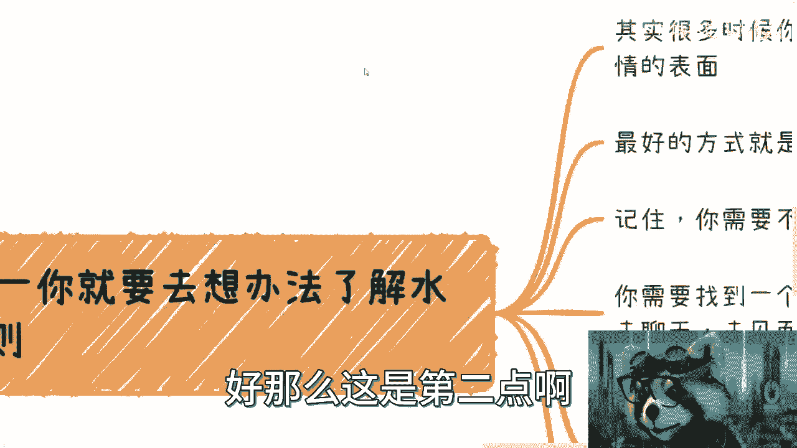

第三点呢就是从大一开始呢，你就要去想办法了解水下的规则。

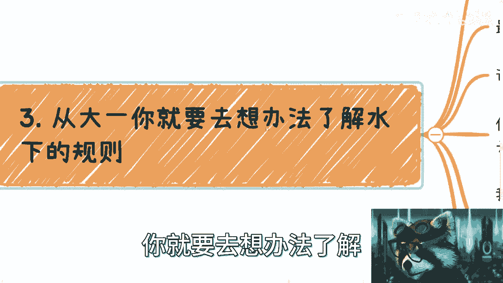

那这个地方我也写了，其实首先呢很多事情，你要去探究的是事情的核心，而不是事情的表面，因为这件事情很多大学生不懂很多，就是毕业了可能工作了十多年的人都不懂，你知道吗，首先这是第一点。

第二点呢我有很多人也说嘛，他说那什么方式对不对，我跟你讲最好的方式就是去问啊，当然你要找到合适的人啊，然后呢在这个地方我跟你们讲啊，因为最近咨询我的人，我发现有一个问题，我真的哎呦。

我我真的是不想说说的，我真的是就不要开骂，你知道吗，就是你记住你需要不停的试错，你明白什么意思吧，就是说有很多人在评论区还有自信用的时候，会问什么，他就说诶那我这个今天合作的话，那比如说他说陈老师。

你说这个东西呃，那个做中介对吧，介绍他说有人跳单怎么办，对啊，这是第一个问题啊，第二个问题呢他就说哎但我只认识很多人，那这些人对我根本就没价值嘛对吧，这些人都都是些什么什么做做微商的，做什么的对吧。

哎呀哥哥们姐姐们啊，老爷老老爷们姥姥们啊，我跟你们说，世界上做事情就是要不停的试错的，你别想你就那种就是你别想着说，我今天买十张彩票就能中奖，我买十张彩票就能中中一个亿，可能的啦。

可能问了你们想想看对吧，你们这种选就是问法，就好像说哎我为什么活在这个世界上，疫情一直要踩坑，不停的要跌倒，那请问谁不跌倒了，对不了，所以说你这种事情是正常的呀，你要跟我说，你今天找了一个人。

这个人就直接给了你个单子也好，这个单子就赚一个亿，我反而觉得这不正常，对不对，然后你今天跟我说，你今天撮合了一个生意，然后这声音当中哎呀大家都很自觉的对吧，人家也没也没卡你油对吧，也没占你便宜对吧。

也不跳单，我反而觉得不正常，因为这不是一个资本市场啊，社会规则就不是这样子的对吧，那同样的你我跟你讲啊，你其实在过程当中呢，需要找到一个人或一个组织，你需要固定的时间去找他们聊天，去见面去付出。

什么意思啊，我跟你们说啊，很简单，不是说你一定要付给他钱啊，我给你们举个例子，就比如说我以前去找一个人对吧，就我刚笔的时候，我就认识一个大概四四十八九岁的一个大佬吧，对吧，我每次就视频啊。

就是我我没有什么固定的想法了，我就是想过去跟他聊聊，同时我也就是可能问问他，就他最近的一些想法，但是呢我每次去真的我可以说无一例外，我每次去都是左边水果，右边吃的，左边水果右边吃的。

就可能价格也不是说非常贵吧，我可能每次买个200多块钱对吧，这样子对吧，那那你过程当中你真的得要去了解的，你单纯靠，我刚刚跟你们讲的一跟二其实也是不够的，你知道吧啊那么比如呢比如说这个水下的事呢。

我给你们举个例子，比如说你说今天学校开了一个新的专业，对不对，好，新的选修课对不对好，那我跟你讲，你作为一个学生，你你应该去目的，你应该去探究什么事情呢，就是说这个专业它的目的是什么，谁来做这个专业。

学校是什么角色，教育局又是什么角色，商业里面的公司又是什么角色对吧，这些专业的内容是谁来提供的，巴拉巴拉巴拉巴拉，对不对，那有的人又要说了，他说陈老师，我作为一个学生，我并不是很清楚你里面说的这些。

就是我可能都不清楚到底里面有哪些角色对吧，比如说你说教育局我可能也不知道啊，商业公司我肯定不知道，是的呀，是不知道的呀，所以你才要去了解，你知道吗，为什么我花了如此多的时间跟你说，你要去走出去了解。

你要找找找找人去了解对吧，你要找找这种固定的人去了解，为什么你就是为了去让你那个叫什么，就是啊这个拓展你的知识面呀对吧，否则你想怎么样呢，我就想问你们，你们想怎么样，你们想是说啊。

有我这么一个人来给你们讲，那请问你们付钱吗啊付钱付多少钱，这个东西是你们付500，我就会跟你们讲的吗，唉这么莫名其妙的，你说是不是对吧，还是说你们指望着某个时间，学校里面有个人跟你讲。

还是说指望着你去BAT去阿里巴巴去百度，有领导跟你讲，不好意思，你们除了无尽的被PUA被利用以外，没有任何别的价值，你不要指望别人来跟你讲，你只能靠你自己，你明白啊，然后最后一点是什么呢。

就是你看啊所有东西都一样的，就比如说我之前说办大会对吧，你们可能去参加学术会议，有技术会议，如果你去参加了，你需要去思考的是什么呢，就这个大会到底怎么赚钱呢，大会的商业模式是什么。

大会本身成本有多少利润，有多少利润又哪来的，谁在付钱呢，哪些有金主爸爸对吧，然后有些大会里面可能会包含培训，有些大会里面可能会包含一些颁奖。

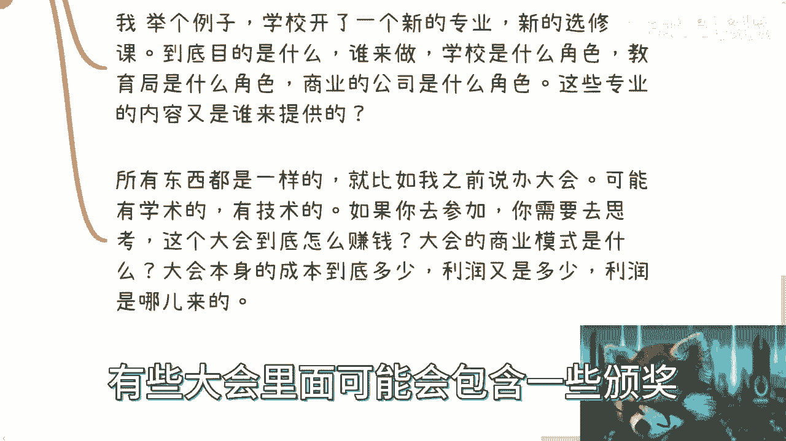

为什么你要去探究这些，而不是说哦这个会议啊，这个topic不错，那个topic不错对吧，我知道的很多大学生，这个这个或者技术人员都这么想的，哎呀这个top的水啊，这个topic不错。

哎这个topic有有有听的，有听的这个想法的对吧。

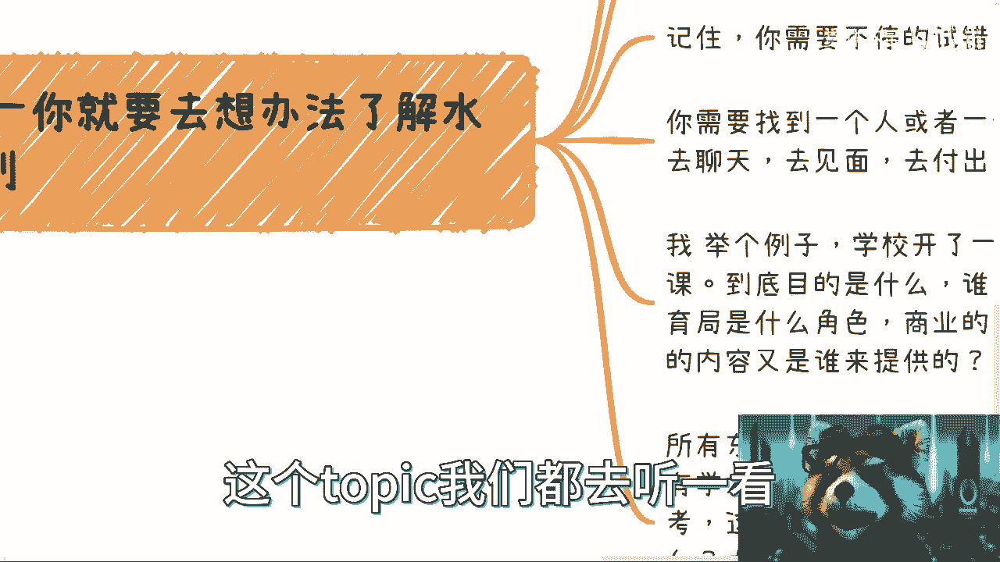

这个我们都去听听看有卵用啊，唉真的是是吧。

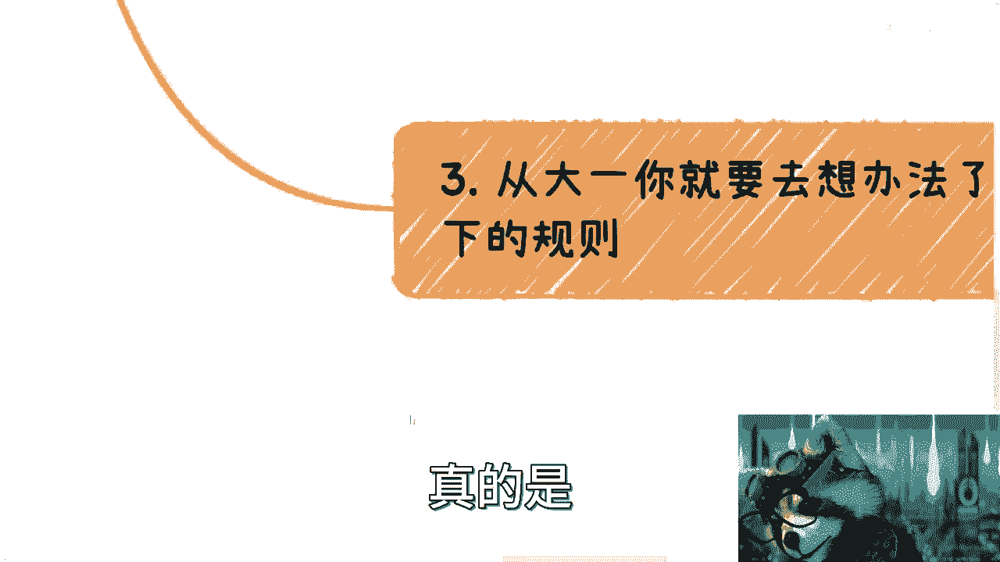

第四也是最核心的，你从一开始你就要想好自己到底怎么赚钱，也就是说你自己的能力如何变现。

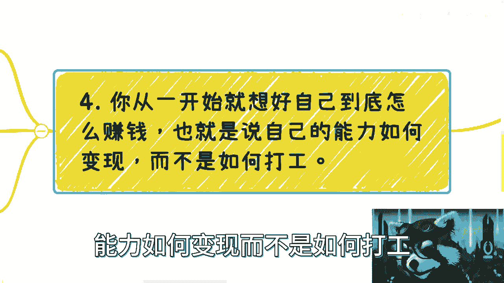

而不是如何打工，人明白这句意思，这句话意思吧，比如说什么意思啊，就是说我跟你们讲，我觉得所有人的思维模式一开始就是要赚钱好，就是要赚钱，什么意思呢，就是说你打工，无论你打的是再高级的工资。

你都不是在赚钱，因为你每个月有固定的薪水，你根本就不清楚所有的赚钱逻辑跟商业逻辑，因为你不再赚钱，你懂吗啊，那不懂的话，我给你举个例子啊，比如说啊，比如说你今天是一个这个程序员对吧。

你今天说哎我会夹到会C加加会够啊，我是一个很牛逼的人，然后呢你比如说你会你是个会计，你是个律师，你是个设计，你牛，你能力也很牛逼啊，比如说你在外面得过奖，怎么样好，没问题啊，没问题好，我就问你。

请问你这些技能怎么赚钱，我就问你们怎么赚钱，你别告诉我去打工人，你别告诉我去一个什么外企，去过什么地方，这不叫打，这不叫赚钱，这只是教你的能力，别人会给你分钱，但是这件事情完全不在你的掌控当中。

因为明天会说让你滚，你就可以滚了，那么这件事情我就问你，你手上能力能赚钱吗，不能对吧，但是你这些能力能不能转，我跟你讲可以赚，但是你得自己去挖掘，你这个能力，就是相当于今天这件事情是A对吧。

是自己的能力啊，然后呢到到这里，比如说能赚钱能赚钱对吧，好，这件事情当中你会发现，其实也会有很多的商业逻辑和商业闭环，以及商业资源，这些都是你的知识盲区，包括你要去做一件事情，你看啊。

你要去接受这件事情，你你可以是个体工商户对吧，你也必须大一部分情况，你是必须要有企业的，对不对，那我就问你嘛，企业对吧，我随便举个例子，比如说你你股东架构应该是什么样子的对吧，股权架构怎么样子的。

VIE架构怎么样子的，你比如说国企业这边，央企这边你要找别人合作混，露骨也好，怎么个露露骨法对吧，比如说有很多人融资，那是不是找人领头，还是还是说找人站台。

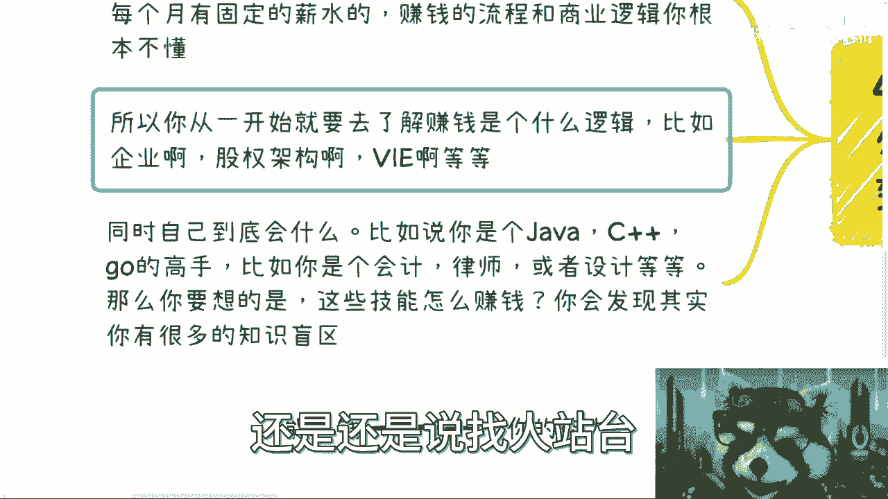

你对这些东西一无所知，那我请问你怎么赚钱，你知道吗。

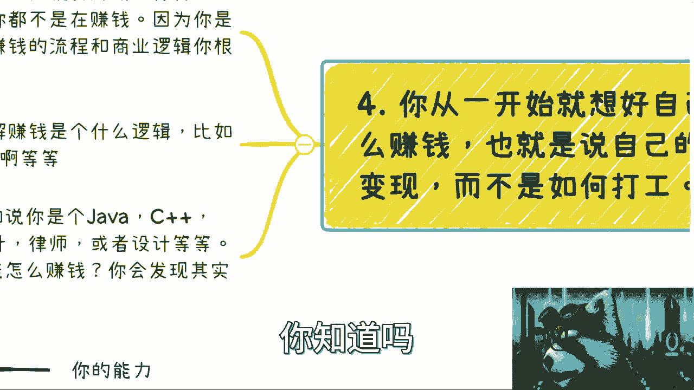

就是说我觉得很多人一开始思维就不对，因为你一开始就不知道，你手上这个技能该怎么赚钱，就像很多人来私信我跟我说什么，他说哎陈老师我做的是什么项目对吧，或者我学的是什么方向，我我又有什么能力，然后就问我。

他说有什么前景比较好的，我就问你们有意义了，没有意义的，因为你们这些技能是不无法变现的，懂吗啊。

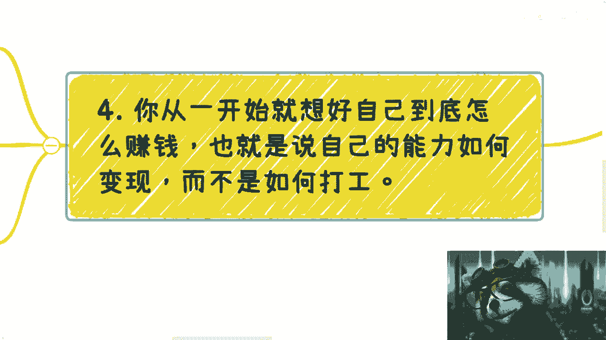

你们自己自己好好想想看对吧，所以呢我觉得就是说大学里面对吧，你的优先级最高时间还是读书，这是毫无疑问的，你还是要把你的学历也好，学位也好对吧，这个东西也好，你都得该有的，有学生也好，都得有。

但是其实你我就说啊，你空下来时间啊，说多不多说少，说少不少的，你该去做的事情。

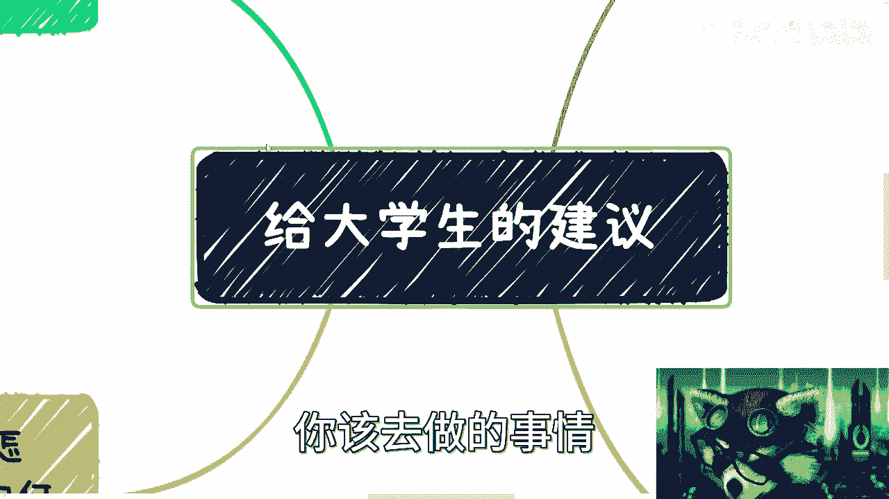

就我这边写的，你该去做的事情就要去做了，你知道吗，就我跟真的跟你们讲，就是一旦到了大三实习，到大四要出来找工作了，我就是唉就可能说的不好听点，就你们真的就后悔莫及，因为真的你们在大学里面。

时间是最最最最最最宝贵的啊。

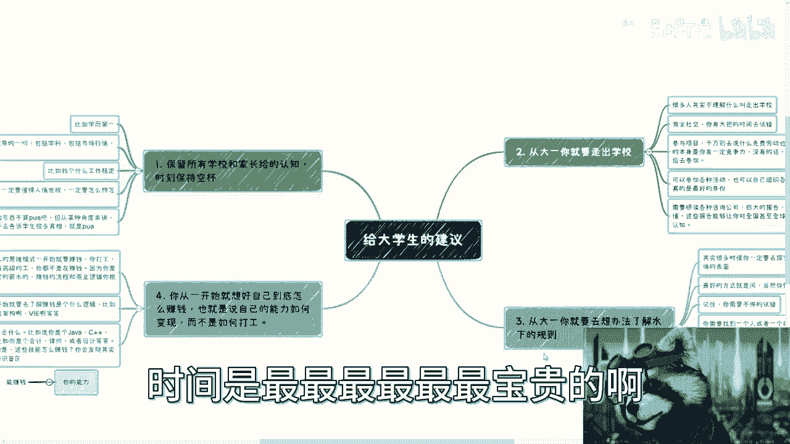

然后这种就是你只有这么去做了，你才是真正的领先别人，而不是说啊什么我有很高的积分，我有很高的学历，或者我有我，我相对来讲怎么样，我跟你们说没有用的，因为一两年34年的理领先相对你一辈子来讲。

根本不值不值一提，你知道吗，行那这个就先这么着吧好吧，然后大家反正有任何职业上的规划，兼职也好，全职也好对吧，商业合作也好啊，各个东西反正期待大家整理好问题好吧，然后可以走私信的咨询呃，我还是那句话啊。

不是说我一定要去想赚大家是笔钱，但是呢就是说我可以说到今天为止，咨询的起码几百个都有了哦，我相信每一个人都能寻找到在我这边，他们自己的价值，而不是一个千篇一律的什么什么，我今天给你们录这门课对吧。

然后告诉你们什么199299，一个人没有用的啊。

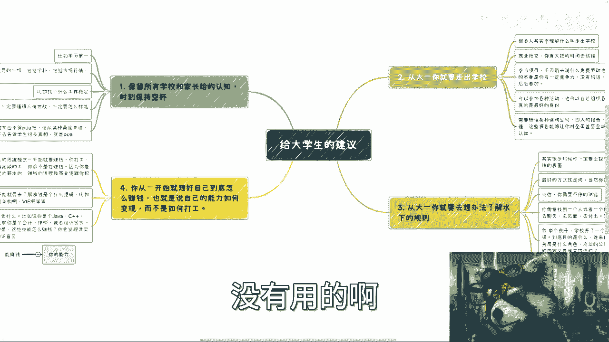

没有用的，因为每个人情况都不一样。