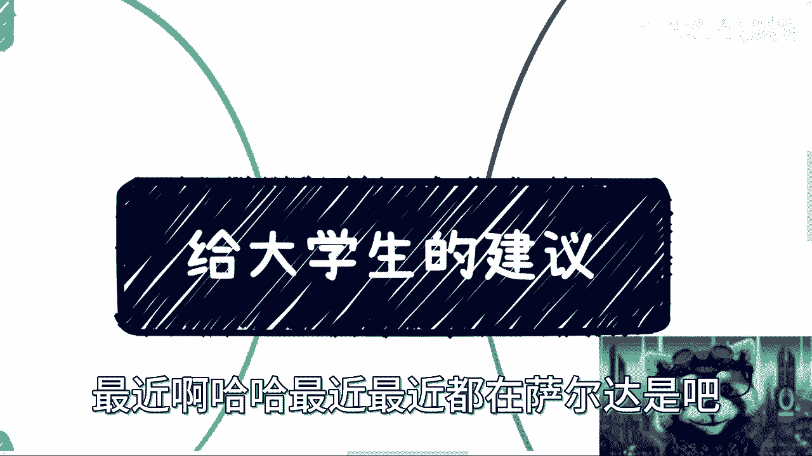

# 手把手给大学生的建议 - P1 - 赏味不足 - BV1cV4y1k781 🎓

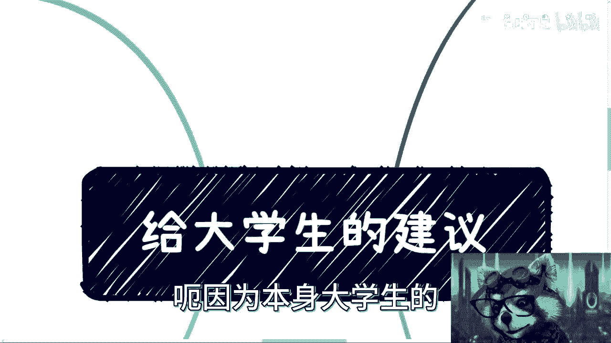

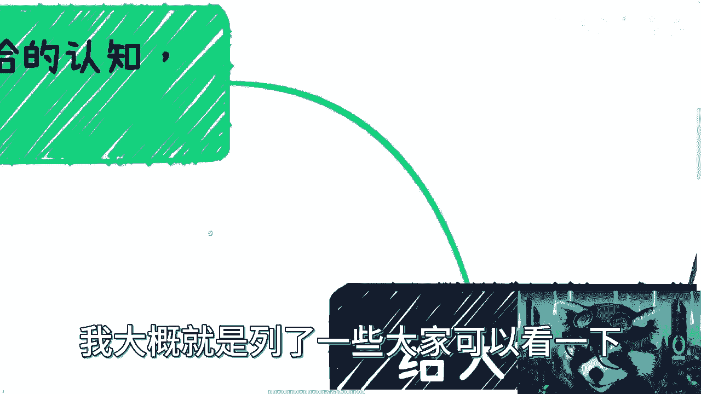

在本节课中，我们将学习面向大学生的四点核心建议。这些建议旨在帮助你在大学期间，不仅完成学业，更能为未来的职业生涯和人生发展打下坚实基础。我们将探讨如何调整心态、拓展视野、理解社会规则以及规划个人发展。

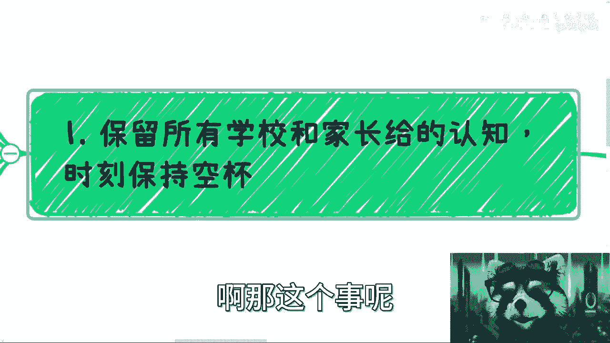

## 第一点：保持空杯心态，审慎对待既有认知 🧠

上一节我们介绍了课程概述，本节中我们来看看第一点建议：保持空杯心态。核心在于保留学校和家长给予的认知，但不要全盘接受，而是时刻保持一种“空杯”状态，准备装入新的、经过自己验证的知识。

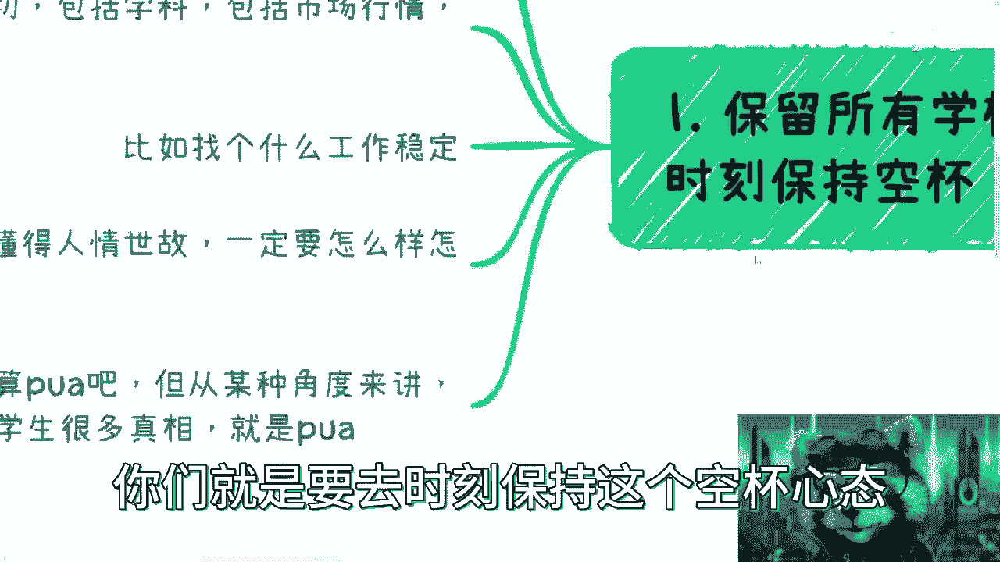

学校传授的许多知识与现实社会、企业需求存在脱节，且短期内难以改变。因此，你需要对这些信息保持审慎。

以下是需要你审慎对待的几个方面：

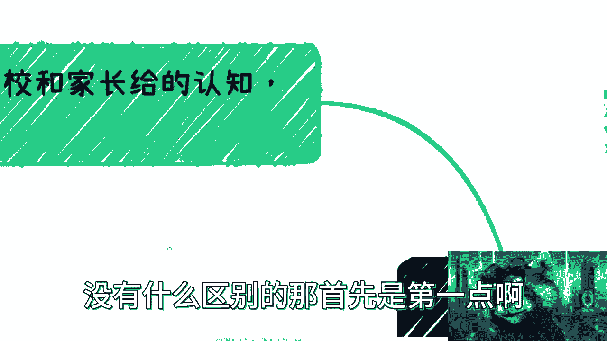

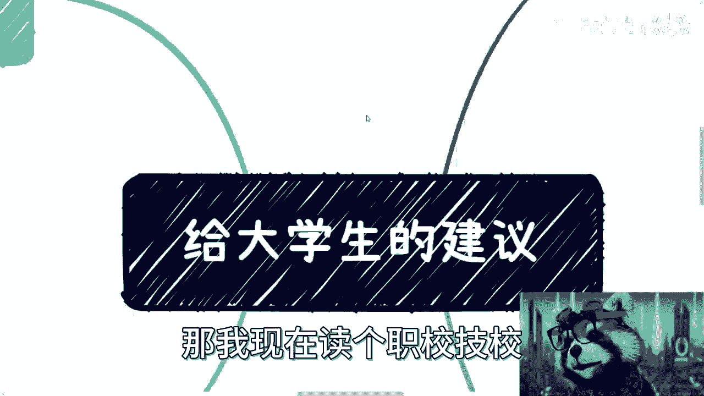

*   **盲目追求高学历**：如果你已拥有不错的本科学历，盲目追求研究生学历可能并非必要。关键在于评估学历提升对你个人发展的实际价值。
*   **学科知识与市场行情**：对于学校教授的学科内容和市场方向分析，应将其视为参考，而非绝对真理。所有信息都需要你亲自去了解和验证。
*   **对“稳定工作”的定义**：关于什么是“稳定”或“好工作”的建议，也应持保留态度。社会在变化，传统的“稳定”观念可能已不适用。
*   **关于“圆滑”与“人情世故”**：社会确实需要改变一些不良风气。你应当了解这些规则，但更重要的是保持自己的原则和三观，而不是被同化。高校中的某些教导，虽然不一定是PUA，但若有意不告知学生全部真相，其效果并无二致。

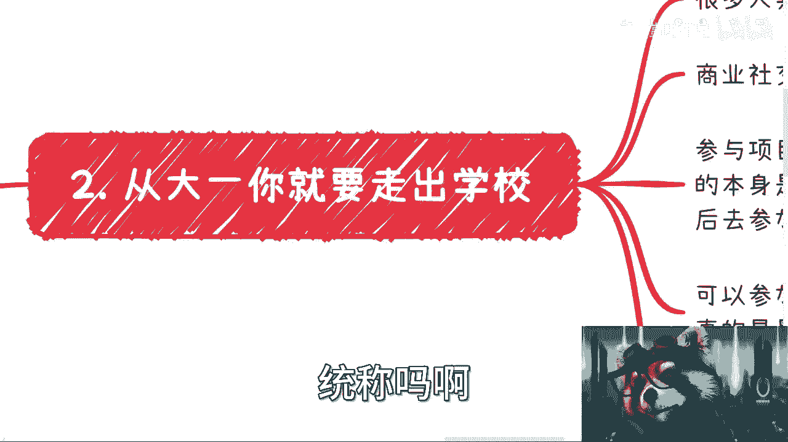

## 第二点：尽早走出校园，积极拓展实践 🌍

上一节我们讨论了心态调整，本节中我们来看看如何行动。从大一开始，你就应有意识地“走出”校园。这里的“走出”不仅指物理空间，更指思维和社交圈层。

对于高职、技校、大专的学生，此建议同样适用。高等教育阶段是试错的黄金时期，等到大三、大四面临实习和就业时，时间会非常紧张。

以下是“走出校园”的几个具体方向：

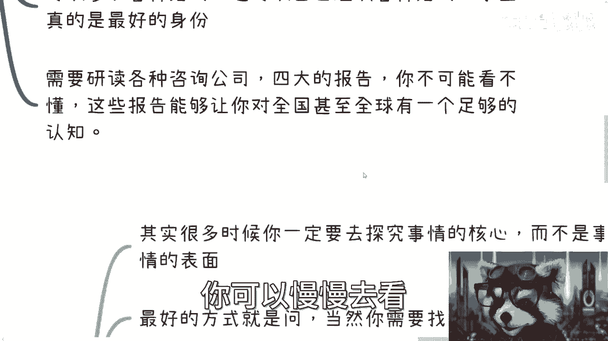

*   **进行商业社交**：利用学生身份，积极尝试与人建立商业联系。学生时期试错成本相对较低。
*   **参与有价值的项目**：参与项目的前提是**你具备一定的竞争力或价值**。不要指望通过“免费学习”的方式加入核心项目，你需要先提升自己的能力。
*   **组织或参加各类活动**：以学生身份组织或参加活动限制较少，是锻炼组织能力和拓展人脉的好机会。毕业后，在职场上可能会受到诸多限制。
*   **研读专业报告**：静下心来阅读知名咨询公司（如四大会计师事务所）发布的行业、技术、商业或融资报告。这些报告**数据详实、面向大众**，能帮助你建立对全国乃至全球市场的宏观认知。

## 第三点：探究水下规则，理解事物本质 🔍

上一节我们讲了如何拓展实践，本节中我们深入一步，探讨如何理解表象之下的规则。从大一开始，你应有意识地去了解那些不写在明面上的“水下规则”。

核心在于探究事物的本质，而非停留于表面。许多工作多年的人也未必懂得这一点。

以下是探究“水下规则”的方法与示例：

*   **核心方法：主动询问与持续试错**：找到合适的人（如行业前辈）去请教。同时，必须接受“**试错是必然过程**”这一事实。不要幻想一蹴而就，遇到问题（如合作跳单、人脉价值低）是正常的，这正是了解真实规则的过程。
*   **建立深度连接**：尝试与一两位值得信赖的前辈建立固定联系。定期交流，并在过程中真诚付出（不一定是金钱，可以是心意或实际行动），从而获得更深入的指导。
*   **探究案例一：新设专业**：当学校开设新专业或选修课时，不应只关注课程内容，而应探究：**开设目的？学校、教育局、相关企业各自扮演什么角色？课程内容由谁提供？** 要回答这些问题，正需要你运用前两点建议去主动了解和社交。
*   **探究案例二：学术/技术大会**：参加大会时，不要只关注议题内容。应思考：**大会如何盈利？商业模式是什么？成本与利润如何？谁在付费（金主）？** 理解这些，远比听几个热门话题更有价值。

## 第四点：思考能力变现，而非仅仅打工 💡

上一节我们学习了如何洞察规则，本节我们来到最核心的一点：转变思维模式。从一开始，你就要思考如何将自己的能力直接变现，而不仅仅是如何找到一份工作（打工）。

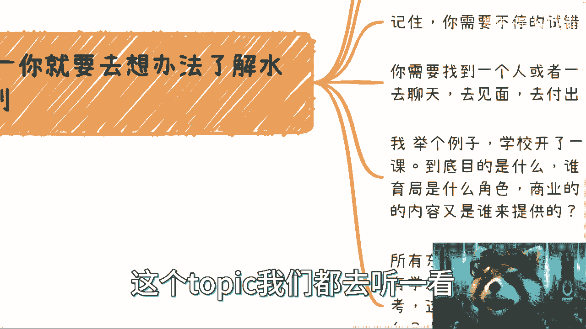

**打工 ≠ 赚钱**。即使领取高薪，你也可能并不真正理解赚钱的逻辑和商业闭环，因为你的收入完全依赖于雇主。

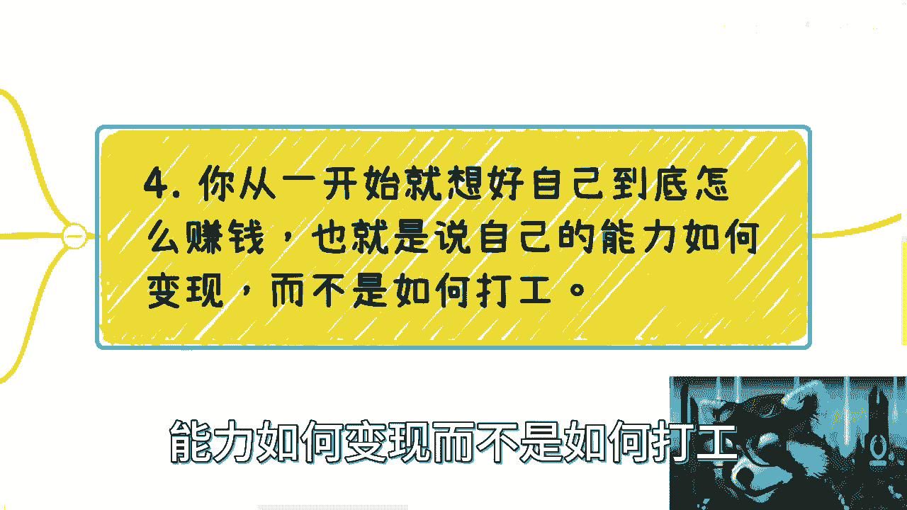

请思考这个公式：
**你的专业技能 (A) -> 商业闭环与资源 (B) -> 最终变现 (C)**
许多人只拥有A，对B一无所知。

例如，你是一名优秀的程序员、会计师或设计师。但你是否知道：
*   如何用这项技能独立接单或创业？
*   成立公司需要怎样的**股权架构**？
*   如何寻找合作伙伴或融资？

如果你对这些商业知识一无所知，那么你的技能就很难直接转化为可持续的收入。很多人咨询“XX专业前景如何”意义不大，因为问题的关键不在于技能本身，而在于**你能否找到该技能的变现路径**。

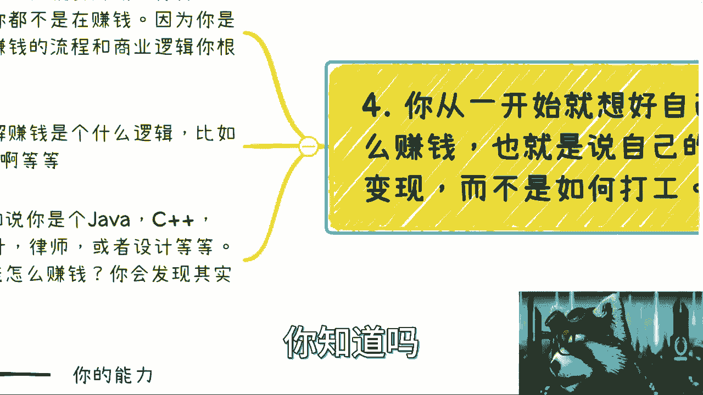

大学期间，学业无疑是首要任务，你必须确保顺利毕业。然而，你的课余时间同样宝贵。按照以上四点建议去行动，你获得的将是贯穿一生的领先优势，这远比一两年学业上的领先重要得多。一旦进入大三大四，时间将变得非常紧迫。

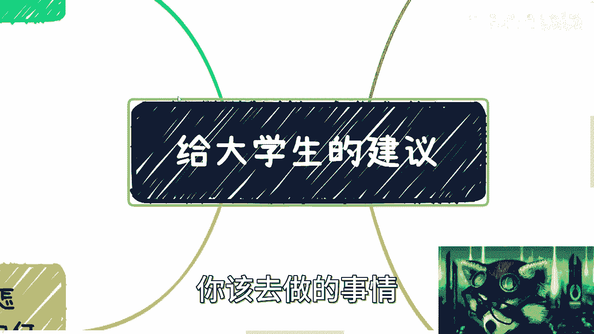

## 总结 📝

本节课中我们一起学习了给大学生的四点核心建议：
1.  **保持空杯心态**：审慎对待既有认知，保持独立思考。
2.  **尽早走出校园**：积极进行商业社交与实践，拓展视野。
3.  **探究水下规则**：主动了解社会运行的本质，而非停留表面。
4.  **思考能力变现**：从“如何打工”转向“如何用自己的技能赚钱”，学习商业逻辑。

大学时光是探索和准备的黄金期。行动起来，利用好这段时间，为你未来的职业生涯奠定坚实而独特的基础。