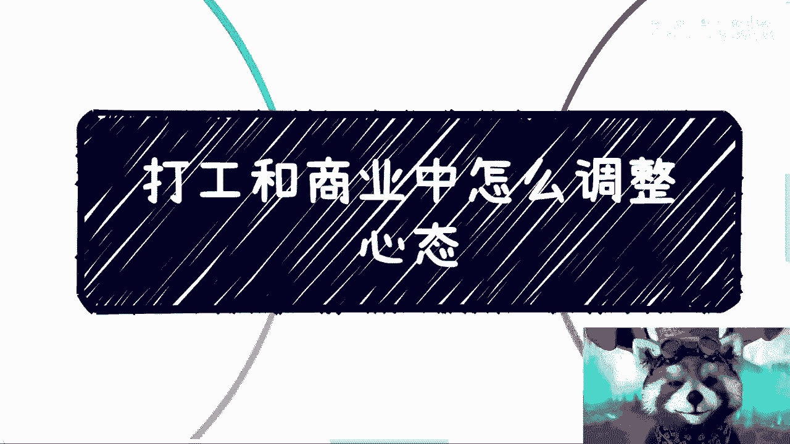
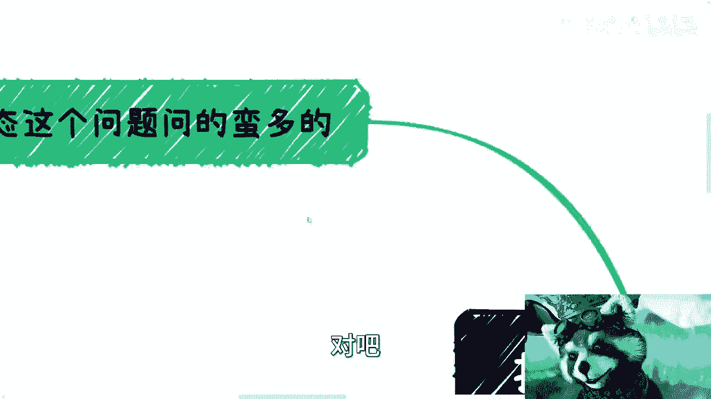
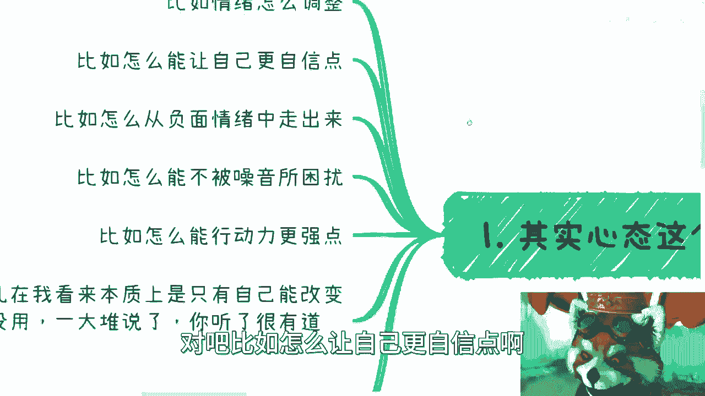
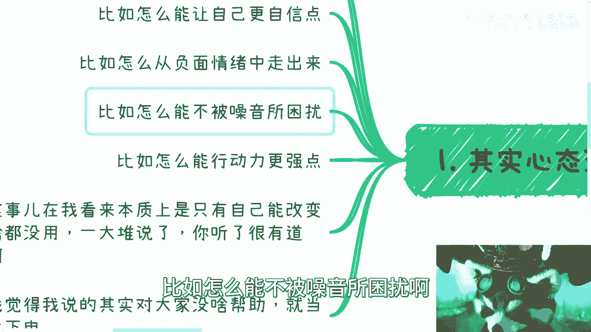
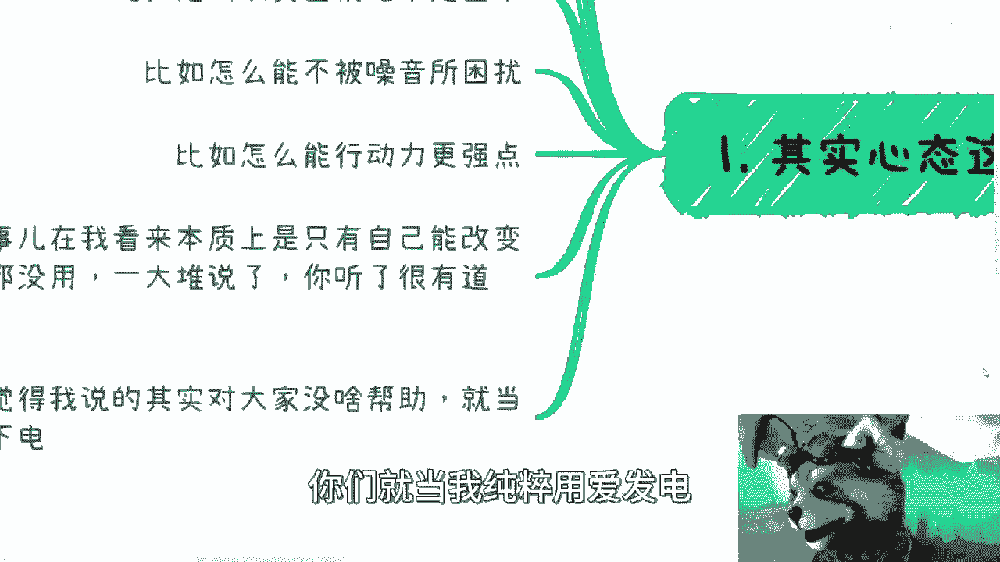
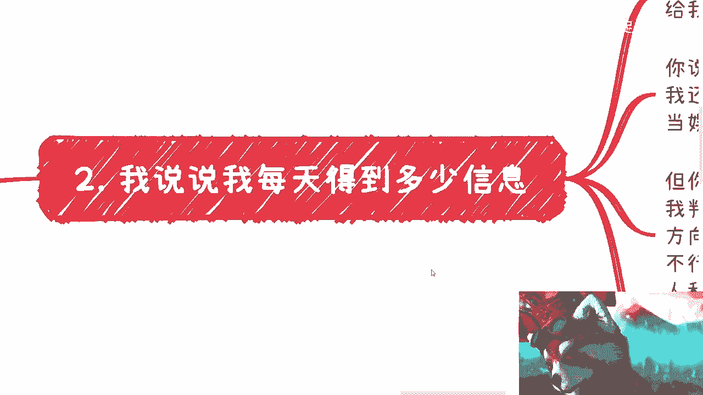

# 打工和商业中怎么调整心态 - P1 - 赏味不足 - BV1zC4y1E7ao

好好前两天小伙伴给我提了个问题啊。

他说关于这个打工跟商业中的心态怎么调整，说实话呢这个话题我不是很想讲，因为妈的我直接连我都他妈觉得太湿了。

你说是吧，这个怎么讲法对吧。

嗯嗯首先啊其实整个咨询到现在呢，心态问题是蛮多的，你看啊，比如情绪怎么调整啊对吧，比如怎么让自己更自信一点啊对吧。

比如怎么从负面情绪走出来啊，比如怎么能不被噪音所困扰啊。

比如怎么能执行力更强一点啊，对吧好，有一说一啊，这事在我看来本质上基本上就只能自己改变，别人说啥没有用啊，对吧，你你你每天看很多视频，每天去看很多东西，一大堆说的，你发现阿婆说婆有理。

公说公有理有什么用呢，没有用的，改变不了解，对不对，这种事情我跟你讲，我以前老做了对吧，你一天到晚吃什么，这个大会那个大会，然后听了这个讲的有道理嗯，那个有道理吗，有卵用啊，对不对，就人家还是牛逼。

我还是，那怎么办呢，所以接下来呢我觉得呢，其实我说的对大家没什么帮助啊，你们就当我纯粹用爱发电。

反正免费的视频嘛无所谓啊，对不对啊。

呃首先呢你看啊，我先说我自己吧。

我每天你看啊，8000个联系人，差不多现在七千七千九吧，7900个，780个群啊，每天还有无数人单独给我发消息，那当然什么人都有对吧，你说有的人呢是我以前合作伙伴，有的人呢就莫名其妙的对吧。

你说啊这些消息我是听呢还是不听呢对吧，包括朋友圈，我是看呢还是不看呢对吧，包括八卦，你说我是实在我是看了之后，我是我是把它吸收进来呢，还是说是是是怎么怎么地对吧，因为你会发现啊，看呢还是要看的对吧。

我还是很八卦的人，活着要娱乐，你说什么我来balance，对不对，那你balance你白呀，你倒是对不对啊，很多的消息就是当娱乐消息看的啊，那么你说呃听不听对吧，其实这个并不重要，因为听不听呢。

我觉得不会影响我判断，你听不听又怎么样呢对吧，因为你比如说我要去做一个事情对吧，你说我要改变某个战术或者某个战略，我肯定有我的信息渠道去判断对吧，你说某些什么东西，你说啊我要不要做这个。

或者我要不要换个行业吧，或者我要不要现在比如说高校不好做对吧，是不是做企业还是做什么商业，还做什么东西，对不对，而且大方向从来不会改，因为你想啊，你每时每刻你说我这个这么多年走过来。

每时每刻都有很多人跟我说，哎呀区块链不行，元宇宙不行对吧，国内不行，你要去海外做的吧，怎么样怎么样子，说的人多了啊，各种各样的逻辑，各种各样的依据，各种各样的呃，这摆事实讲道理对不对，就其实蛮好的。

我觉得没什么不好的都不行呗，对吧，反正就是没人也没人跟我竞争，我不要太开心，你就不行就不行呗，对不对，但是我不会因为说哦这个说不行了，我在那边纠结哎呀，这个东西不行了，我要不要继续做，我纠结它干嘛呢。

哦那照这么个说法，我跟你讲，就像我们说跳槽一样的，你觉得哎呀这公司不行啊，这公司太他妈垃圾了对吧，这公司没有balance是吧，这公司怎么样怎么样怎么样，那那我跟你说，你跳到另外一家公司也一样的呀。

就是你会有一定时间的新鲜感，但是本质上不解决这个问题，为什么，因为你没有自己的判断，你你你只是觉得不行，但是为什么不行呢，你也不知道对吧，那那我就反过来了，反过来问你哦，你都说不行。

那为什么这行业里面有的人行呢对吧，就你要知道我们都是渺小的，行业也好，渠道也好对吧，包括就是说呃领域也好，都是我们围绕别人去赚的，哪里有别人围绕我们转的，没有的呀，对不对啊，那你说朋友圈。

微博B站抖音小红书对吧，你每天无数的消息涌入对吧，但无所谓，因为本专这些消息就从我的认知来讲，对于我来讲都不是什么重要的消息啊。

能有什么重要的消息呢对吧，而且我还是那句话，能有重要消息。

我基本上也都是线下沟通出来的，线上有点逼数的人。

他不会讲什么东西的呀，对不啦，那你第二点，那有小伙伴要说了。

那总有机会的呀，错过了怎么办呢，对不对，好你要这么说，对吧好，那我就说了，那你出去总有意外发生的，你出去干嘛呢，你在房子里面，那他妈房子还能塌了，你在房子里面干什么呢，对不对，没有意义的呀。

就是我我你说你要如果把某些东西，你非要寄希望于这种东西上面没有意义的，因为你本身逻辑就不通啊，这就像什么，这就像我以前跟跟那个上海这边人社部，有一些人领导当时讲那个什么，讲数字人民币也是的，他们就问我。

他说那万一以后停电了呢，对他说，以后万一整个整个什么手机都不能充电对吧，整个数字化的东西都不能用呢，那怎么办呢，我说都不能用了，那你还谈什么东西了，你整个经济都崩了，你国家都崩了。

你还谈你跟你这问题问的有什么意义了，对对啦，那首先啊我本身我只相信我能做的事情，我有把握的事情，我有积累的事情，以及我信得过的那些朋友，或者合作伙伴所提供的信息，别的我一律不信对吧，而且别的就算是真的。

就算真的有机会，那跟我有什么关系呢对吧，那说白了每个人都是术业有专攻的，我承认他就算是对的，他就算是真的，他能赚一个亿，OK啊，无所谓啊，我没这个命啊，我也没这个本事啊，那我去操心这个事情干嘛。

我去我去纠结这事情干嘛对吧，这就让很多人问我，哎呀我我我有个什么呃这个红利期对吧，有个什么未来很好的行业，很好的这个风口，我没赶上怎么办，你没赶上，就说明你没这个人脉关系，你没赶上。

就是没有这个本事去赚这个钱就结束了，你去想他干嘛呢，对不对，对，你说真的也好，假的也好，我从来不信我有这运气去赚这种莫名其妙的钱，就这么简单吗对吧，那错过了又如何呢。

这就好像比如说我脚下我有自己的十条路，我有十条业务，也许这十条业务现在都不赚钱对吧，但是你说我只要看好，我需要走走好就可以了，你每个人有每个人的目标吗，对吧，你至于别的分支，我错过就错过了呀。

因为本身跟我也没太大关系，更何况我们又如何定义错过呢，比如说这个东西本来它其实就不属于我们，那何谈错过呢对吧，就这种思想其实在我看来也是一种PUA啊啊，所以我觉得核心是什么，核心在这个地方。

核心是在于每个人有没有自己的明确目标，你没有，你就去找对吧，你要不想找，那你拉倒那有什么不好呢对吧，你像我跟很多人也说了，你不找你就躺平，有什么不好的，怎么活不是活啊，对不对，有没有定义。

一定要怎么活对吧，无所谓的呀，你只要没我跟你讲，你只要没有目标，你就容易摇摆，你摇摆了自然就容易被各种信息影响，你但凡没有目标，你又不愿意找，你，还要抱怨说怎么怎么改变，那他妈改变个屁啊，对吧好。

另外你有了目标之后，你需要给自己设立的时间节点，就是我们说的这个task和mouse stone对吧，你比如说多少多少时间做什么事情，如果没有结果，那你需要进入下一个阶段，或者说你可能要换一种模式对吧。

怎么样怎么样怎么样，那你自己定，我跟你们讲啊，有本书叫乌合之众，对不对啊，我跟你讲就是我以前说的乌合之众，什么叫乌合之众，他就是从众心理对吧，你你说的好听点，要做从众，不好听点就人来疯对吧。

你比如说每天就有人说，每天我几乎都能看到有评论区说哎呀，我月薪就5000，我月薪就7000，这些跟我有什么关系呢，然后很多人看到这个心里也会想对啊，他妈的跟我有什么关系呢，对吧。

我就这点钱跟我有什么关系呢，是我一直跟你们说，我你要觉得没关系，那就永远没关系，你要觉得有关系，你就往这方面去努力，这都是自己的事情，你没关系，那就没关系了，有关系就有关，跟我有什么关系呢对吧。

但本质上你要明白，你今天看到我这个视频，你明天看到别人的视频，这些东西不重要啊，就是你每天可以看到无数个东西都不重要啊，因为你看100个视频，跟你看1万个视频，但凡你不做改变，有软关系啊。

没有任何关系的呀，对不对，你你总不能说哦，我我我看了马云100个视频哦，我今天感觉跟马云平起平坐了，可能吧啦吧啦，就是你所有的东西都是你去改变，别人说什么没有意义的呀，啊你你你说你说我听那个叫什么呃。

罗振宇对吧，哦得到对吧，哦我每天早上听我他妈听10年啊，我感觉我的这个知识面特别广啊，这个上通天文，下通地理对吧，怎么样怎么样，那怎么样难用，我请问你改变了没有，你拥有多少东西，对不对，就是你只要不变。

只要没有围绕你自己建立一个一个一个关系网，或者一个生态圈，没有用的呀，世界又不是围着我们转的，我们永远是围着生态转的，我们永远是围着经济转的，我们永远是围着资本家赚的，对不对，没有办法的呀对吧。

所以说我们在我们再反过头回过头来想想看，你说你在那边很多人就在那边说哎呀，这个东西跟我之前有什么关系啊，跟我母亲有什么关系，是你正规的逻辑是什么，就是我就5000，我就几千，那跟我没有关系。

那你就别留言对吧，你就不要去误导大众，不要去，就是就是就是就是要有这种叫什么秀优越感，你要说优越感是有存在感，何必呢对吧，那反过来说就是说你可能觉得你可能不会留言，但是呢你也不要看到这种东西就从众。

就觉得哦他说的蛮对的对吧，那我觉得我好像跟他也差不多，那跟我也没什么关系，没有意义的，所有的眼光你只要关注到你自己就好了，你每天就24小时，你关注来关注去关注这么多东西，跟自己没有关系。

没永远不会有改变的对吧，你回过头来我们看啊，你情绪怎么调整，你只要关注你的业务怎么发展，你只要关注你的关系，关系怎么建立，别的东西影响你情绪了，不影响呀，如果影响你情绪，那就代表着你的修行还不够。

对不对，怎么更自信一点，我跟你说，你正常的商业逻辑是什么，我早就说过了，你自不自信有意义了，没有意义的呀，因为只有你的甲方爸爸认可你，你才是自信的，你再自信，你跑到那边，卧槽老子牛逼，你牛逼好了。

没人给你钱，你牛逼好了，没有用的呀，所以不要去往这方面去去纠结，或者去去去想，对不对，你要想的就是说我怎么让对方，我怎么满足对方的要求，我怎么让对方能够信任我，我怎么让对方能够合作起来。

这就是你想的就如何更自信一点，这种东西太抽象了，你知道吗，你就是我跟你们讲，我就发现很多人他其实嘴上说就说哎呀，我们不要假大空，我们不要宏观，我们要很实很接地气的，但是他思考问题的时候。

他从来不思考接地气的，他反而会跟你说，卧槽不能一切从钱出发，哎呀你不能老是说钱，我那你想怎么滴对吧。

那我只想说你想怎么滴，话都被你说了，那那怎么办呢，哦别人欠你的啊，非要跟你说，哎呀求求你改变，不改变不改变，我感觉他妈的我好像我好像就是过意不去啊，欠你的，你有毛病吧，这不是是不是真的，我还是那句话啊。

嗯你们要看就看不看拉倒，尤其是这一期对吧，我都我都觉得虚，行啊就这么着吧，好吧嗯，快年底了啊。

快年底了，这个大家反正都总结总结吧啊要改变。