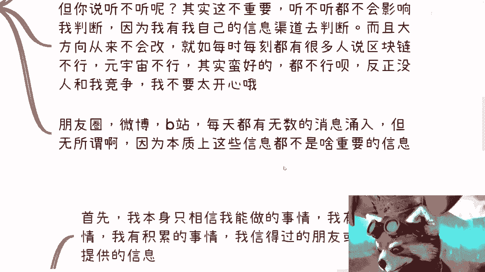
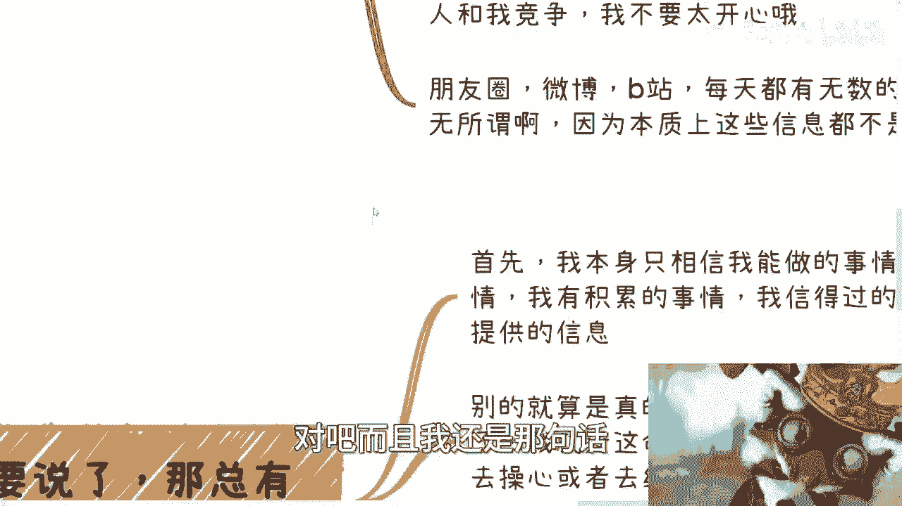
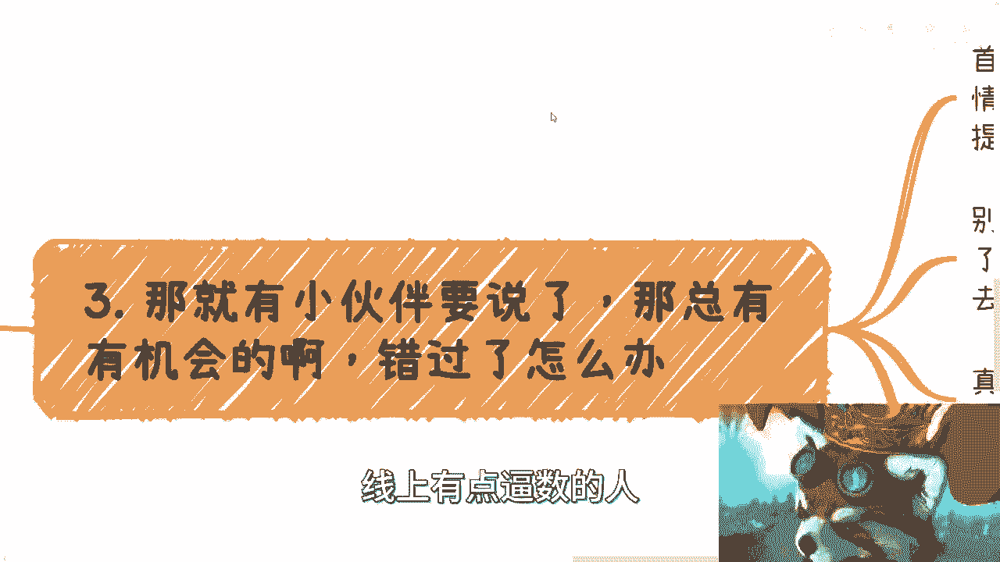
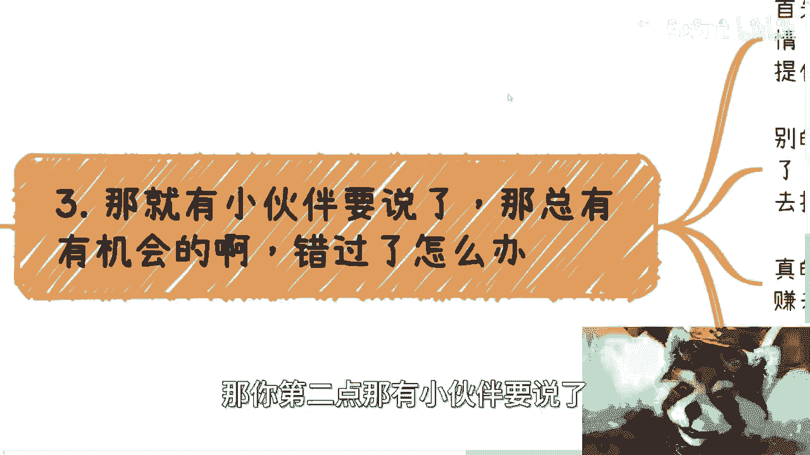
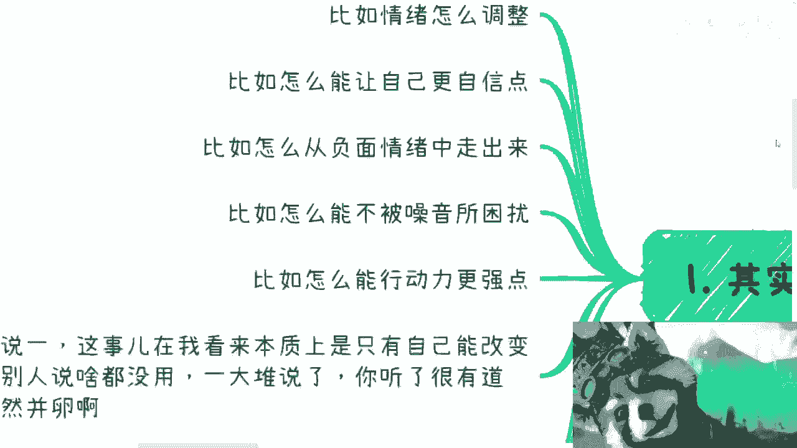

# 课程名称：打工与商业心态调整指南 - P1 🧠

在本节课中，我们将要学习如何在打工和商业环境中调整心态。心态问题常常困扰着许多人，例如情绪波动、缺乏自信、执行力不足等。我们将探讨如何建立自己的判断体系，减少外界噪音的干扰，并专注于个人目标的实现。

---

上一节我们提到了心态问题的普遍性，本节中我们来看看如何建立自己的信息筛选机制。

我每天有近8000个联系人和数百个群聊，会收到无数消息。这些消息包括合作伙伴的沟通、陌生人的咨询以及各种八卦信息。看或不看这些信息，其实并不重要。因为重要的决策信息通常来自我信任的线下渠道和核心人脉。线上大量的信息，多数可视为娱乐内容，它们不会影响我的核心判断与战略方向。

---

上一节我们讨论了信息筛选，本节中我们来看看如何应对外界的否定与噪音。

多年来，总有人告诉我某些行业或方向不行，例如区块链、元宇宙或出海业务。他们提供了各种逻辑和依据。我的态度是：如果大多数人都说不行，那反而意味着竞争少，机会可能存在。我不会因为他人的否定而纠结是否要继续。这类似于职场跳槽：如果你因为觉得公司不好而离开，但又不清楚具体原因，那么跳到新公司后，类似问题可能依然存在。关键在于，你需要有自己的独立判断，而不是被外界声音左右。

---

上一节我们探讨了应对外界否定，本节中我们来看看如何定义“错过”与“机会”。

常有人担心错过某些机会或红利。我的观点是：如果某个机会你没能抓住，说明你当下不具备相应的人脉、能力或运气。这很正常。每个人都有自己的赛道和业务路径。我专注于自己看好的十条业务线，即使它们目前不赚钱。至于其他分支，错过了也无妨，因为它们本质上可能就不属于我。这种“害怕错过”的心态，有时也是一种自我消耗。

---

上一节我们分析了机会与错过的本质，本节中我们来看看心态稳定的核心是什么。

心态稳定的核心在于**拥有明确的目标**。如果没有目标，人就容易摇摆，被各种信息影响。如果不想设立目标，选择“躺平”也是一种合理的生活方式，只要自己能接受。一旦有了目标，就需要设定时间节点和里程碑（**Task & Milestone**）。例如，在多长时间内达到什么结果，如果未达成，则需调整策略或进入下一阶段。

---

上一节我们强调了目标的重要性，本节中我们来看看如何避免“从众心理”的影响。

《乌合之众》一书阐述了从众心理。在网络上，常看到有人评论“我月薪5000，这跟我有什么关系”。这种言论容易引发共鸣，但无助于任何改变。关键在于，你是否将注意力放在与自己目标相关的行动上。看100个或1万个视频，如果不采取行动，就不会有任何改变。真正的成长来自于围绕自己构建关系网和行动，而不是围观他人的生活。

---

上一节我们讨论了避免从众，本节中我们来看看如何将心态调整落到实处。

以下是针对常见心态问题的具体思考方式：

*   **情绪调整**：只要专注于业务发展和关系建设，其他事情就难以影响你的情绪。如果仍被影响，说明需要继续修炼专注力。
*   **建立自信**：自信与否本身没有意义。商业中的自信来源于甲方或合作伙伴的认可。思考的重点应是：**如何满足对方需求、建立信任并促成合作**，而不是抽象地追求“自信感”。
*   **对抗空想**：很多人声称讨厌“假大空”，但思考时却脱离实际，回避谈论金钱等具体目标。改变需要从思考具体、可执行的问题开始。

---

本节课中我们一起学习了如何在打工和商业中调整心态。我们探讨了建立信息筛选机制、应对外界否定、理性看待机会与错过、设定明确目标、避免从众心理，以及将心态问题转化为具体行动。核心在于，**世界不围绕我们旋转，我们必须围绕自己的目标构建行动体系**。减少噪音干扰，专注个人发展路径，是心态稳定的基础。