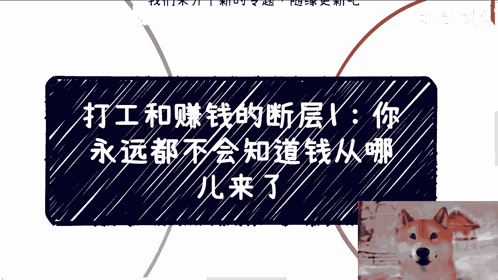
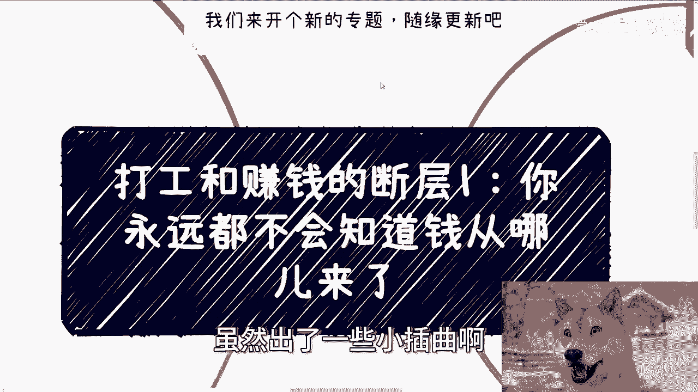
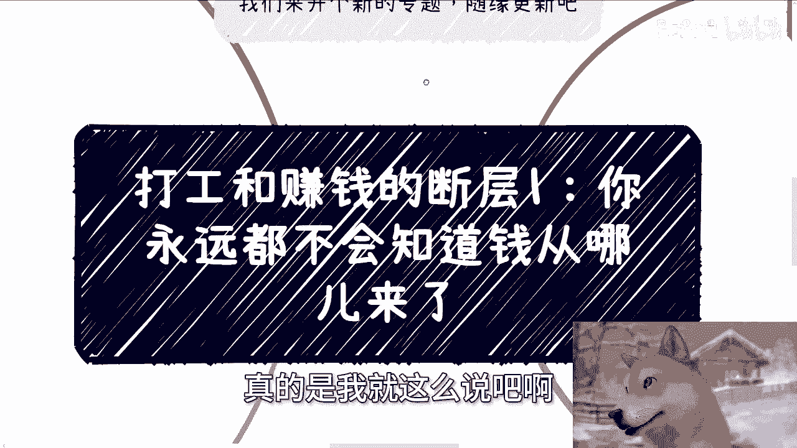
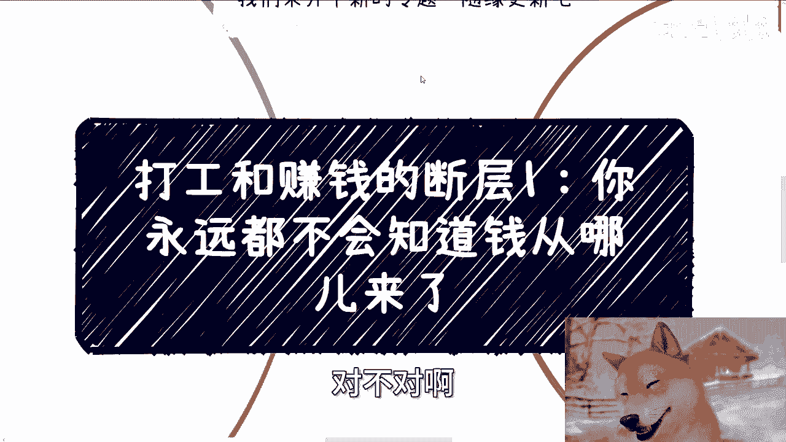
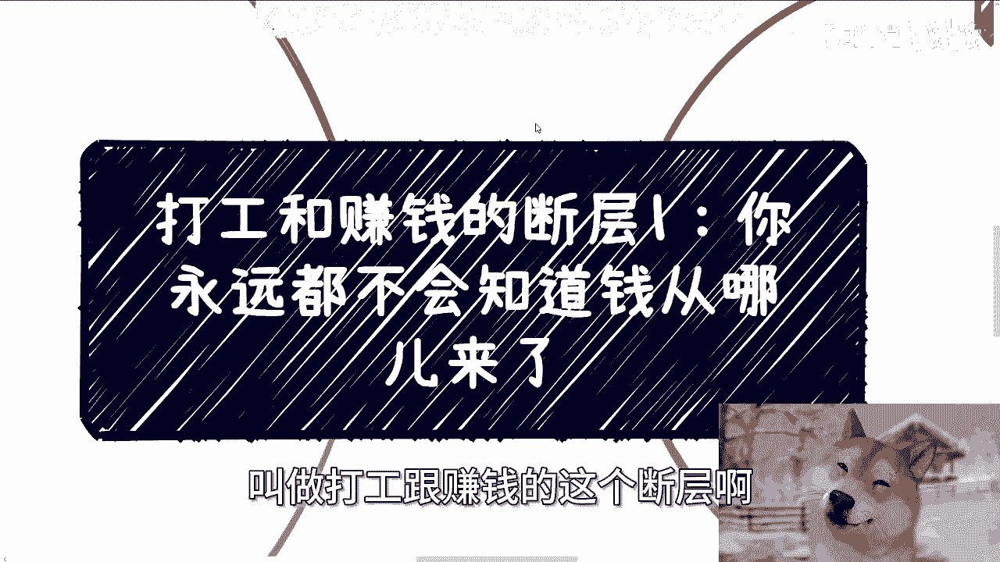
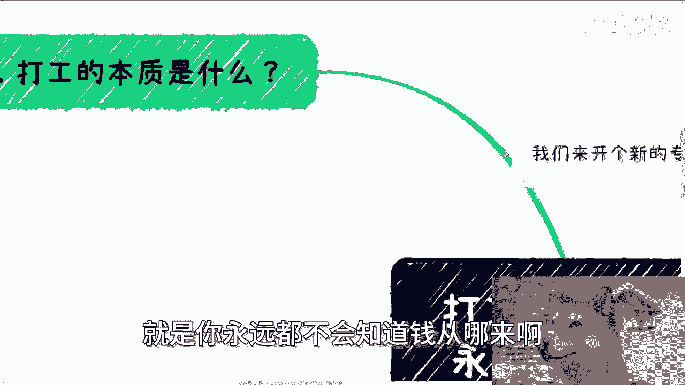
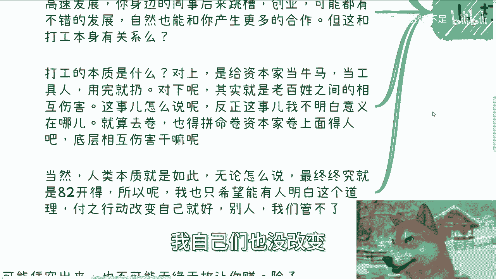
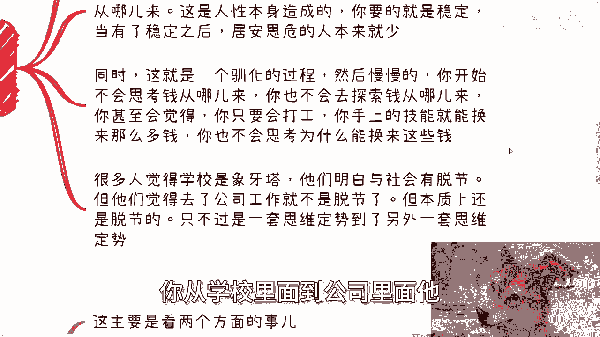
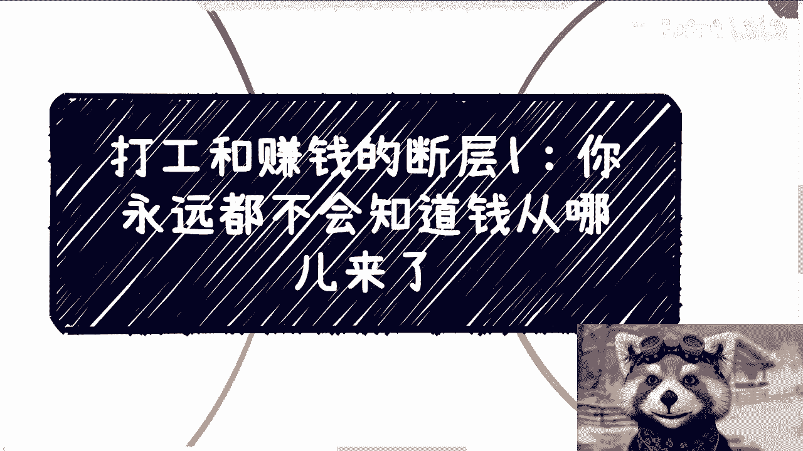

# 打工和赚钱的断层1-永远都不会知道钱从哪儿来---P1---赏味不足---BV1Q2421P7ZH_

在本节课中，我们将探讨一个核心问题：为什么长期打工的人往往不清楚财富的真正来源。我们将剖析打工的本质，并揭示“赚钱”与“打工”之间的认知断层。

## 打工的本质：工具与内卷

上一节我们介绍了本课程的主题，本节中我们来看看打工的真实面目。许多人认为打工能赚钱、积累人脉或经验。从结果看，这些可能成立，但其原因与“打工”这一行为本身并无必然联系。

以下是关于打工本质的几个关键点：

*   **时代红利与打工无关**：在某些高速发展的时代，员工可能通过期权、股票变现，或因为同事创业成功而获得“人脉”。但这主要得益于时代和环境，而非打工本身。将此逻辑平移到现在并不成立。
*   **打工的双重角色**：对上，打工者是资本的工具，具有可替代性。对下，在晋升通道中竞争，本质上是劳动者之间的相互内卷。真正的竞争应向上看，而非伤害同仁。
*   **社会的固有结构**：无论社会如何发展，资源分配大致遵循**二八定律**，这是人性与系统共同作用的结果。个人能做的就是认清现实并付诸行动改变自身，而非空想改变环境。

## 为何不知钱从何来？

理解了打工的本质后，我们进入核心问题：为什么打工者会失去对财富来源的洞察力？这主要源于职场环境的“驯化”与思维定式。

以下是导致认知断层的几个原因：

*   **KPI的误导与稳定幻觉**：企业内大量KPI（关键绩效指标）的核心目的常是促进内部竞争（卷），而非真正决定企业生死。这使人沉浸于完成任务的循环，不再思考**钱 = f(项目, 价值)** 这个根本等式。打工提供了稳定感，让人误以为现有技能永远能兑换等值报酬，忽视了个人市场价值会随时间波动。
*   **从象牙塔到新牢笼**：许多人认为学校与社会脱节，却觉得公司是“真实社会”。实际上，这不过是从一种思维定式（学生）切换到另一种思维定式（员工），同样处于信息茧房之中，并未真正接触商业全貌。
*   **信息获取的局限性**：即使是销售、市场等前台岗位，接触的信息也常是碎片化的、基于自身职位的“豆腐块”。你能了解局部，但难以窥见完整的**商业闭环**。且职场关系大多依附于公司平台，离职后价值存疑。

## 财富的唯一媒介：项目

既然钱不会凭空产生，那么对普通人而言，财富的具体载体是什么？答案是：项目。

*   **项目是钱的流通理由**：在社会经济活动中，项目是让资金得以流动和汇聚的核心媒介。无论是B端还是C端业务，最终都体现为具体的项目。
*   **打工与项目的隔离**：长期打工者，无论职位高低，通常不接触项目的**起源、谈判、架构设计、资源整合**等核心环节。因此，即使工作多年，对“项目从哪里来、为何能成立、需要哪些要素”依然陌生。
*   **觉醒后的困境**：当有一天你想摆脱打工，自己掌控财富时，会发现手头并没有可控的赚钱方式。过去的“工作经验”在创业或独立赚钱面前，传承性很低。如果不主动改变，20岁的迷茫到30岁、40岁依然存在，**迷茫 = 持续状态** 将成为既定未来。

## 总结与行动指南

本节课我们一起学习了打工与赚钱之间的深刻断层。我们明确了打工的本质是提供劳动以换取稳定报酬，但它系统地隔离了你对财富源头——项目——的认知。KPI和职场环境会驯化思维，让你安于现状，失去探索商业本质的动力。

真正的职业发展或财富积累，绝非“顺其自然”地跳槽和晋升，那很可能最终通向成为系统“燃料”的路径。它需要你**主动突破信息茧房**，去理解项目如何产生、资金如何流动。

道理易懂，难在行动。改变始于意识到问题，并主动寻求连接“项目世界”的桥梁。如果你对自己的职业发展、商业方向感到迷茫，并希望结合当下经济环境进行梳理，建议系统整理你的背景与具体问题，这是迈向改变的第一步。