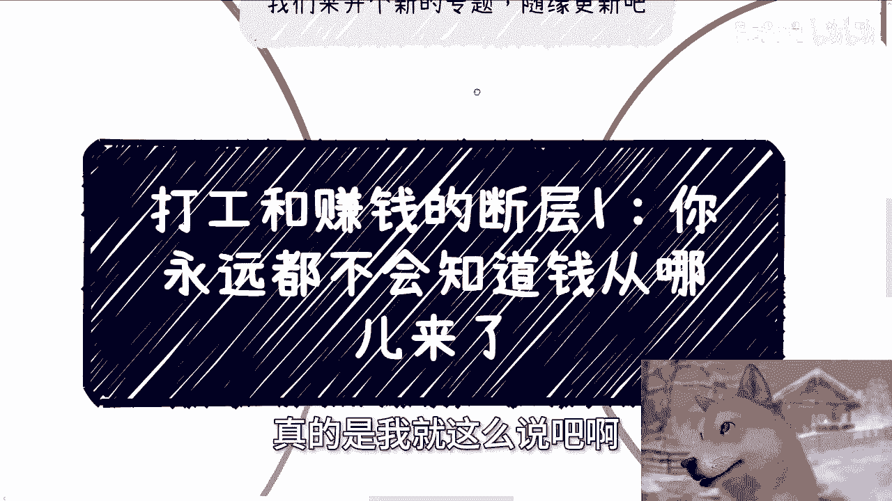
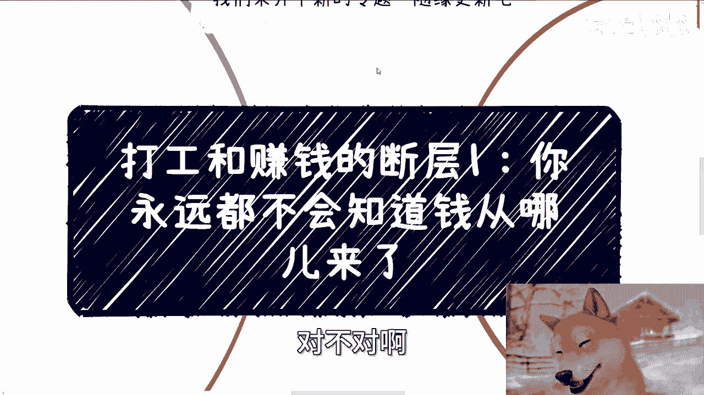
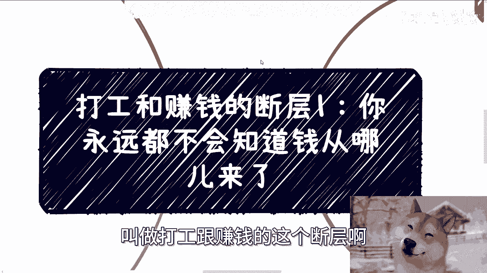
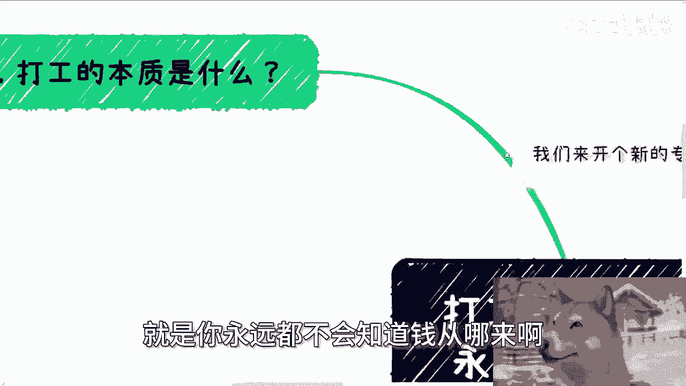
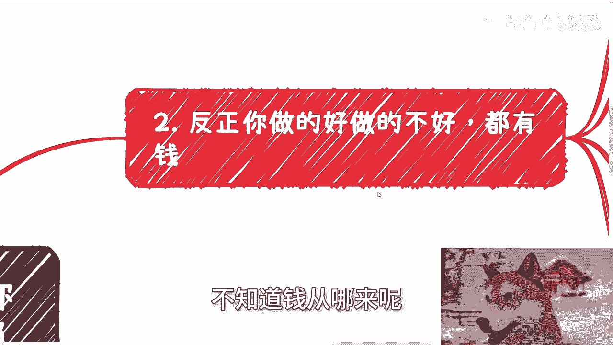
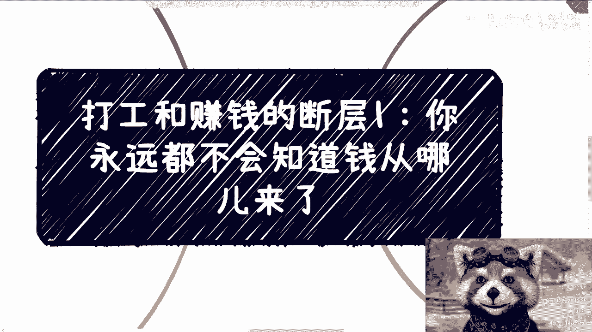

# 打工和赚钱的断层1：永远都不会知道钱从哪儿来 - P1 - 赏味不足 - BV1Q2421P7ZH

好啊大家好啊。

昨天上海活动还是不错的啊，还是不错的，虽然出了一些小插曲啊。

我这哎真的是我就这么说吧，啊这个现场还有人企图在我这打硬广啊。

嗯我不反对打硬广，但我反对的是你不给我钱打硬广，对不对啊。

好那么我们今天看一个新的这个专题啊，然后随缘我也没想好后面怎么写啊，呃今天讲的这个呢，叫做打工跟赚钱的这个断层啊。

然后主题一啊，就是你永远都不会知道钱从哪来啊。

呃我们先来说打工的本质啊，打工的本质，有的人觉得打工能赚到钱，有的人觉得打工能认识人脉啊，能够自由啊，能够积累所谓的经验呃，这个话对不对啊，你说这些人说的话对不对啊，结果呢是对的啊，就是你从结果来讲。

这个是对的，但是这个原因啊，就是它的这个音原因跟打工有关吗，其实没有关系，为什么，因为你比如说在某些时代天时地利人和的时候，打工的人跟公司跟整个产业都有发展，它都是上升期。

那么他们呢可以通过期权或者股票去变现啊，然后呢就是说期权股票变现能赚到点钱，但是问题是你想想看，这件事情跟打工本身有关系吗，没有对吧，它只是跟时代有关系，跟整个环境有关系，你能把它平移到现在吗。

那不行吧对吧，你说哦因为这么一件事情，我所以我得出了打工能赚钱这个逻辑，这得不出来啊，第二就是说你说能认识人脉关系，对吧好，那么什么叫人脉关系，就跟我刚刚说的一样，因为当时有一部分的一个时代。

他可能都在发展，而且都是高速发展期，那么呃你身边的同事后来去跳槽创业，他们可能因为天时地利人和都有不错的发展，他自然就能跟你产生更多的合作，或者说他们对你来讲就有更多的价值。

或者说慢慢慢慢变成别人口中的人脉，那就跟刚刚一样的这个事情跟打工有关系吗，那还他妈还是他妈没关系对吧，那么嗯这两天我跟这个小小伙伴啊咨询的时候，我也跟他们说，我说打工的本质是什么，打工的本质就是对上啊。

是给资本家去当牛马，当工具人，用完就被扔掉对吧，对象呢其实就是老百姓之间的相互伤害，那为什么，因为你去打工不就是另外一种卷吗，啊就是你卷不卷，你是不是主动卷，这不重要，因为你去打工本身。

你如果要去就是啊怎么说呢，就是说你如果要在打工这个层面，想要拼出一定名堂，那么其实你会你就这么想吧，就是你真的往上走，你也拼不过人家那些亲戚，或者拼不过那些血缘关系，或者说人家可能发小。

或者人家可能就是同学或者怎么样，但是你真的在这里面不停的去啊，输出，不停的去卷的话，那么你对上本质上你还是个牛马，但是对下呢你其实就是在伤害老百姓，就伤害你的同仁对吧，那么你单纯从这件事情来讲。

我觉得打工本身大家都是要温饱的，你不可能不打工，但是你打工本身的意义如果要去卷的话，那我就不明白这个意义在什么地方对吧，而且我觉得你就算去卷，你也得拼命去卷资本家，卷上面的人啊，你卷底层伤害干嘛呢。

我不明白啊，那么当然啊这个事情呢，也就是说人类本质就是如此，无论怎么说啊，就是我这么跟你们讲，无论整个社会未来是怎么发展的啊，也无论人人类社会怎么发展的，他最终最终最终肯定都是八二开。

因为这个是人本性本质造成的，所以说呢你你说我们自己看问题，跟我们别人看问题都是一样的，我也只希望能有人啊能明白这个道理，然后呢付之于行动，他改变自己就好了啊，不要想着就是说啊我自己也没改变。

我还想着改变周围的人不可能啊，那么第二啊，反正就是说嗯，为什么我们说跟这个不知道钱从哪来呢。

也就是说你做的好不好啊，都有钱，你想啊企业里面是什么，企业里面说的是KPI，KPI是什么，KPI其实是为了让大家卷起来的一种手段啊，因为说白了你想想看啊，企业哪他妈这么多KPI。

或者说企业哪有这么多KPI，是真正影响企业大局的哦，这KPI做完了哦，我们就生存了，这个KPI做不好对吧，我们就就就滚蛋了，就准备倒闭了，没有啊对吧，你说有有有没有KPI会影响会。

但是哪他妈这么多KPI，会影响由基本上八九十%的KPI，95的KPI他根本就不影响核心，无非就是为了让大家卷啊，所有打工的人，咱们就这么说，无论摸鱼不摸鱼，其实他都不会再去思考钱从哪来。

因为这个人人的本性造成的，你要的就是稳定，当然有了稳定之后，居安思危的人本来就少对吧，同时就说这就是个驯化的过程啊，你你你在里面慢慢慢慢的，你开始不会去思考钱从哪来，你也不会去探索钱从哪来。

你甚至会觉得只要你打工，你手上的技能就能换来这么多钱，就像我曾经跟你们说过的，很多人，他现在可能年薪五六十万七八十万，但是他付出的这个就是付出的时间，它产出的价价值产出的这么一个东西。

我不管它产出什么啊，它产出这么一个东西的一个产物的价值，真的值七八十万吗，啊这不是在搞笑吗，对吧，但是同样的，如果来说，你不去考虑，不去思考这些问题，那么你的价值在社会当中随着时间的发展，总归会减少。

那么等到你未来拿不到七八十万，拿不到五六十万，拿不到434 100000的时候，你怎么办呢，你总不可能跑出去跟资本家说，哎因为老子以前是五六十万，你必须给我五六十万，这不搞笑吗对吧。

所以说所以说啊很多人觉得学校是象牙塔，为什么呢，因为他们觉得学校跟社会是脱节的，那么为什么他们又会觉得去工作，公司里面工作就不是脱节呢，因为他们觉得公公司可能是在社会里的，他去打工啊。

他去工作就已经跟学校不在一个水平线上面了，但本质上还是脱节的，你你你你从学校里面到公司里面。

他只不过是从一个思维定式，到了另外一个思维定式有什么区别呢，对吧嗯，那么第三嗯嗯相对前台的这个工作，他是不是有点优势啊，我觉得这事得看两个方面，第一个就是说前台的工作，能不能了解了解这些信息呢。

能啊我觉得能但不多，你能看到多少，这个是要看整体环境，整体的业务好坏，还要看天时地利人和，当然啊你说你相比一些永远坐办公室的岗位，就是所谓的那些后台岗位有没有区别，那当然有，但我觉得区别不大啊。

另外一方面就是说你还是需要自己主动去探索，你得知道怎么在不影响自己的，这个这个入职的公司里面，这个身份情况下面去了解更多全局信息，我给你们打个比方，前两天有个咨询的小伙伴啊，他当时也也蛮好玩的。

他跟我说啊，他说他有个他想拉一个大佬进来，那个大佬呢能够利用啊，那我就不点名了啊，他说能够利用某些大厂的资源，我说那大厂是你们大佬开的啊，我说那那那大佬是马云，是马化腾啊，是是是张一鸣，那我不明白了。

我说公司如果不是他开的，你跟我说，你拉了一个大佬进来，然后你说这个大佬能够用这个公司来背书，那我不懂呀，我说他又不是董事会，他又不是他又不是股东，他又他甚至不是创始人。

他凭什么拿公司的背书出去做事情对吧，我说这没有逻辑性的呀，那我跟他说，我说照你这么说吧，我录制google啊，我就拿google出去可以可以签合同了，我的牢底坐穿啊，毕竟呃然后那个前台的工作呢。

我觉得很多时候啊，我为什么说大差不差，是因为前台的工作你就算去做商务，做销售，做市场呃，往往也是顶对顶的，就是说你个人也有信息差，因为你接触的其实也是豆腐，豆腐块大小的一个信息，你也是螺丝钉啊。

然后对接就完事了，很多信息对你来讲就是碎片化的哦，你说这些信息能不能让你有这个啊，能不能让你了解这个叫什么商业闭环，能但是能了解多少呢，对吧，你说这些对接的人能否在你离职之后，就是你因为你现在在职吗。

你代表是你公司吗，人家跟你对接吗，那你说对接这些人能否在你离职之后再帮助你，在你的事业上跟业务上做点什么呢，你也不知道对吧好，那我们还有一点就是关于说这个钱从哪来啊，你看啊。

首先钱他不可能凭空变出来对吧，那你在社会上去赚钱，你也不可能无缘无故让你赚，我们就说啊除了C端的啊，那些割韭菜也好，或者正经的这个做C端的业务以外啊，因为C端的业务你其实本质上还是卖服务嘛，对吧。

呃除了C端的业务以外，钱这个东西唯一的来源是什么，就是项目，就是对普通人，对老百姓来讲就是项目，为什么你你你否则钱哪来，我就不奇怪啊，不明白了，钱从哪来，你总归是有个项目来承接了对吧。

那你们可以理解为项目就是个媒介，是一个能够让钱进行流通的这么一个理由啊，那么你仔细想想看，无论你打工打多久，你能知道项目从哪来吗，就是今天就我我们拿项目跟钱一样，说你项目也不能从天上掉下来，对不对。

那你知道项目从哪来吗，你能知道项目为什么你来承接吗，或者说你能知道，你承接一个项目的核心是什么吗，你知道承接一个项目，你需要具体哪些东西吗，你不知道你打工20年十年更多时间，你也不知道。

因为你打工内容跟这些东西，他没有任何的就是交集啊，那么如果有一天你想自己赚钱了，你觉得打工啊，如果某一天啊，比如说你觉醒了对吧，你想自己赚钱，你觉得打工就是被你的leader，你的mental。

你的manager，对你的hr，你的老板对吧，等各种各样的这些人去呃控制去压榨，那么你到那个时候可能就在那边想，哎呀我我诶诶等一下为什么它不动了啊，什么情况这么垃圾的吗，嘿诶我刚刚是不是按了什么。

你们知道吗，那个软件上现在是识别的出来的，但是他现在不动了，我要不换一个试试，奇怪的，诶他不动，算了算了，我觉得卡住了吧，随便他就这样吧，然后那个我们还要来说，你除了被你们的老板领导压榨以外。

你想想看你手上有哪些可控的赚钱方式吗，没有对吧，那么不到某一天，你想自己手上有可控赚钱方式，无论你年纪多大，也无论你有多么多的这个工作经验，其实你还是非常迷茫的，就是你当下20多岁面临问题。

到你30多岁还是那个问题，我跟你们讲，这就是既定的未来，如果你不改变，这就是既定的未来，因为经验不可能相通啊，没有传承性的啊，那么然后很多人啊觉得打工跟未来发展方向呃，还有那个所谓的职业规划。

还有赚钱是顺其自然的，就是比如说哎我工作过两三年对吧，我跳几次槽，我可能后面也就知道怎么发展了，我跟你讲，你说的是对的，你的确知道怎么发展，你也知道怎么顺其自然，顺其自然，最终发展是什么。

就是你只能变成炮灰和燃料，没了尸体呀，没错呀，你能还能变成什么对吧哦，你要说我顺其自然发展，未来就能赚到钱，那中国今天会这样吗，啊人人人均收入只有2万多会吗啊，人均年收入只有2万多。

只有2万8到3万2会吗，可能吗，对不对。

我觉得大部分的时候啊，真的我就跟他们说，我说道理呢，大家都懂，缺的是什么呢，缺的就是行动力，然后呢你懂的时候呢，还要说自己呢可能大脑有保护机制吧，或者大家自己PUA啊，或者就是偷懒对吧。

就自己还告诫自己，觉得哎呀哎呀，这个也不一定就一定要这么这么这么极端对吧，也不一定一定要怎么样子啊，过两年过两年对，当下可以先happy对吧，或者怎么样，哎呀一样的啊，我跟你们说一样的。

就你未来到底想过怎样的生活，取决于你们现在，好行，那这个就这么着吧，然后那个呃职业我们说的这个职业发展啊，商业发展啊，股权啊，融资对吧，然后你们觉得有哪些啊，这个你们想做的方向啊。

或者说你们想你们想发展方向，想结合当下的这些啊，经济情况，全国的一些情况，全球一些情况，想要就说看看我，我帮你们更好的去梳理一个，未来的一个发展方向的话，你们可以整理好啊，对应的这个背景跟问题好吧。

然后我们再来做咨询啊。

