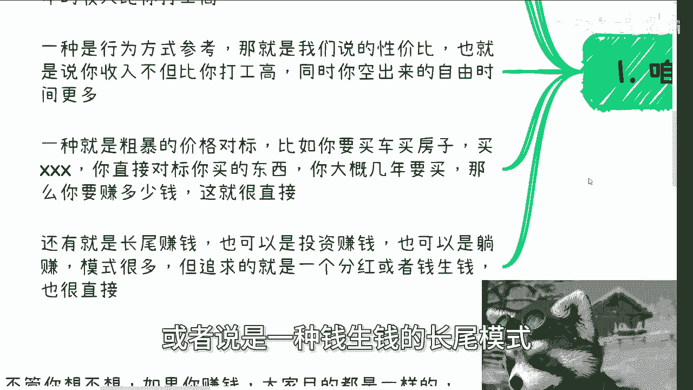
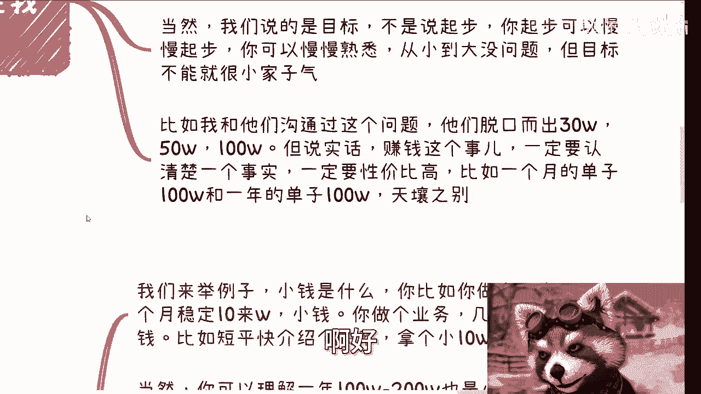
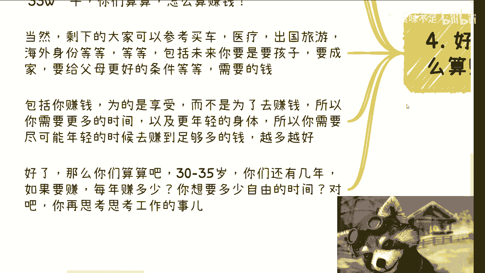

# 打工与赚钱的断层 2：如何定义“赚钱”？💰 - P1

在本节课中，我们将探讨一个核心问题：对于打工人而言，究竟赚到多少钱才算是真正的“赚钱”？我们将通过建立清晰的参考系，帮助你摆脱模糊的认知，明确自己的财务目标。

---

## 📅 课程与活动通知

午饭时间活动已定于5月12日下午01:30至05:30举行，场地也已确定。详细内容将在近日确定。

如需报名，请私信联系。

---

## 🤔 建立“赚钱”的参考系

上一节我们提到了打工与赚钱之间的认知断层。本节中，我们来看看如何具体地定义“赚钱”。这本身是一个主观话题，因此我们需要一个或多个客观的参照物来进行衡量。

以下是三种主要的参考方式：

1.  **与打工对标**
    以你当前的打工状态（通常默认是996模式）为基准。计算你一年的总收入与付出的总时间。如果你从事的其他事情，其年均收入不能显著高于打工收入，那就谈不上“赚钱”。

    **公式参考**：`新事业年均收入 > 打工年均收入`

2.  **行为参考（性价比）**
    这要求你的收入不仅要高于打工，还必须能空出大量的自由时间。核心在于提升单位时间内的赚钱效率。

    **公式参考**：`（新事业收入 / 投入时间） > （打工收入 / 996时间）`

3.  **粗暴的价格对标**
    直接对标你想要的物质与生活条件。例如，计划购买的房子、车子，期望的医疗水平、保险、给家人的生活保障，乃至海外身份等。计算出实现这些目标所需的总资金，再倒推每年需要赚多少钱。

此外，还有**长尾赚钱**模式，即通过投资实现“钱生钱”或获得持续分红，这属于更高级的财务阶段。

你可以根据自身情况，选择以上参照物进行对标。

---

## 🎯 目标不应受城市限制

在设定了参考系后，我们需要明确目标的高度。许多人会将目标与所在城市的消费水平绑定，但这是一种自我设限。

赚钱是一个绝对目标，不应因城市不同而降低。降低目标的往往是你自己的认知，你将自己框定在了“某线城市居民”的身份里。例如，在三线城市觉得年入百万足够，是因为你只参考了当地的物价。

但你需要考虑的是：
*   **医疗**：去一线城市看病，医院不会因为来自四线城市而给你打折。
*   **体验**：出国旅行、海外身份、更广阔的人生体验。
*   **抗风险能力**：应对未来不确定性的储备金。

如果真心想赚钱，就应该从更广阔的世界视角去设定目标。**起步**可以从本地和小规模开始，但**目标**绝不能“小家子气”。例如，脱口而出“年入30万、50万”之前，需要仔细衡量其性价比（比如是一个月赚100万还是一年赚100万，天差地别）。

---

## 💨 小钱靠努力，大钱靠大风

明确了目标的高度，我们还需理解赚钱的层次。这里有一条核心原则：

**“小钱靠努力，大钱靠大风（机缘）。“**

我们来具体解释：

*   **什么是“小钱”？**
    *   指通过个人努力能够稳定或周期性获得的收入，但其年收入存在明显的天花板。
    *   例如：电商月入十几万、接单项目每笔几万到几十万。即使年入一两百万，如果无法保证未来十年的稳定性，且无法突破上限，也属于这个范畴。
    *   **特点**：这是普通人通过努力能够触及的上限。你会发现，无论单笔金额是10万还是30万，你一年的总收入总会趋于一个上限值，因为高单价往往意味着低频率。

*   **什么是“大钱”？**
    *   指借助“大风”（即机缘巧合），在投入不变或略增的情况下，利润呈数量级增长。
    *   例如：一个大型项目的巨额差价、一级市场遇到超高回报率的投资、一个关键机遇极大扩展了业务线或合作规模。
    *   **特点**：这不是单纯通过努力就能实现的直接因果，但离不开日常的积累。它可能直接带来巨额现金，也可能通过扩大公司规模、业务范围间接带来持续高利润。

赚过钱的人会明白，努力有上限，而突破上限需要机缘。将某项业务“带飞”的，往往是这样的“大风”。

---

## 🧮 重新计算：怎样才算“赚钱”？

现在，让我们回到最根本的问题，结合现实进行计算。赚钱的普遍目的包括：改善生活、改变自身与家庭境遇、追求健康、以及增强抗风险能力。

以上海为例进行粗略测算：
*   二手房均价约15-17万/平，老房子约80-90平，总价约1200-1500万。
*   高端住宅均价仍在30万/平以上。
*   此外，还需考虑停车费、家庭保险、其他资产配置、医疗、旅游、子女教育、父母赡养等持续支出。

假设我们将“一套像样的房产”作为综合消费目标的代表，取值1500万。如果你从20岁到35岁有15年时间积累，那么：

**`年均需储蓄 = 15,000,000 / 15 = 1,000,000 元`**

这尚未计算期间所有的生活开销。也就是说，在不花钱的情况下，每年需净存100万。这显然极具挑战。

这个计算并非要求每个人都以此为标准，而是说明：**若想实现生活质量的飞跃和真正的抗风险能力，你对“赚钱”的数额预期必须足够高，且要追求在更年轻时、用更少时间达成。**

请认真计算你理想生活所需的资金，并倒推你每年需要赚多少钱，同时希望拥有多少自由时间。然后再回头审视打工或当前业务的价值。

---

## 💎 核心要点总结

本节课我们一起学习了如何定义“赚钱”，并建立了清晰的思考框架：

1.  **建立参考系**：通过**与打工对标**、**衡量性价比**和**价格直接对标**三种方式，客观评估何为“赚钱”。
2.  **打破城市局限**：赚钱目标不应被所在城市束缚，应以更广阔的人生需求为导向。
3.  **理解赚钱层次**：牢记 **“小钱靠努力，大钱靠大风（机缘）”** 。努力有上限，突破上限需要积累加机缘。
4.  **进行现实测算**：根据你想的生活，倒推所需的资金总额和年度目标，你会发现常规收入远远不够。

普通人确实有天花板，但这天花板并非不可触及。大部分成功者起点都是“老百姓”，关键在于是否愿意付出努力，并保持开放心态捕捉机缘。思考赚钱时，核心两点：
*   一，目标数额不要“小家子气”。
*   二，计算达成目标所需的时间，追求高性价比（即更少时间赚更多钱）。

每个人的追求不同，但思路可以借鉴。如果你希望更系统地梳理自身资源（手中的牌），进行职业规划、商业规划或探讨股权融资等议题，可以整理好你的情况，通过私信进行进一步咨询。

---
**武汉线下活动报名进行中，详情请私信。**