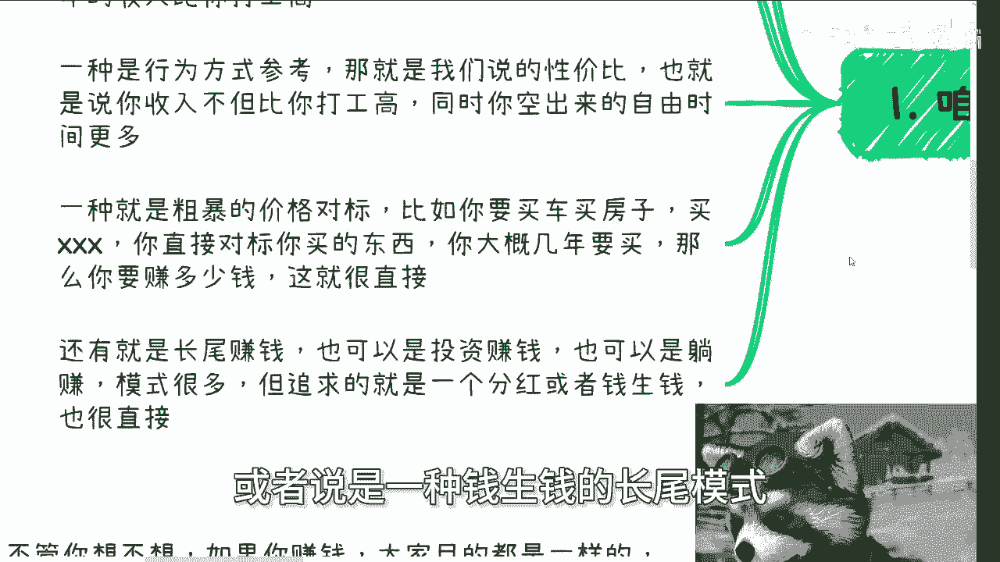
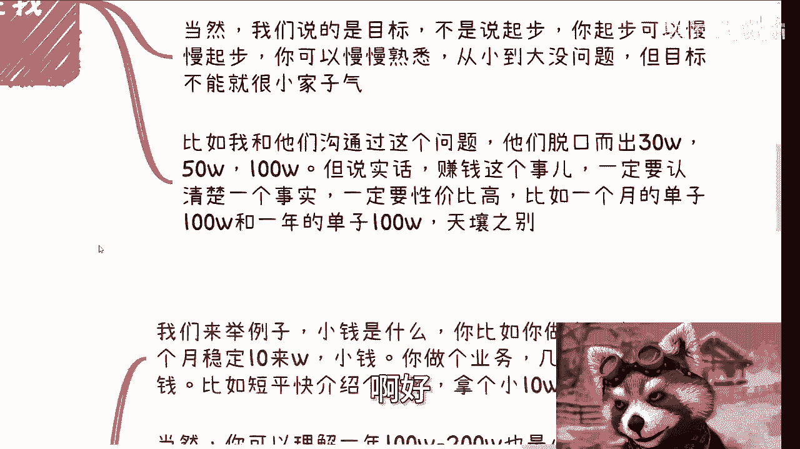

# 打工和赚钱的断层2：打工人分不清楚多少算赚钱 - P1 - 赏味不足 - BV1hD421T7JQ

啊大家好，我们来讲这个打工跟赚钱的断层二，打工人根本分不清楚什么叫赚钱啊。

首先这样子的啊，午饭时间我已经定好了啊，5月12号下午01：30到05：30好吧，场地我也定好了啊，详细内容我还没定呢，我这两天定定好吧。

然后你们要报名的可以私信我啊，可以私信我啊，那么第一啊咱们先说怎么思考这个事情啊。

我原本以为大家是明白的，我后来发现好像他妈的并不明白啊，那还是我自作多情了啊，首先赚钱不赚钱呢，这是个非常主观的话题啊，所以我们需要一个或者一系列参照物对吧啊，一种方式是跟你打工去做参考。

比如说你打工我们默认是996对吧，一年多少钱，然后你付出了多少时间，然后你做了某件事情，你平均下来一年的收入要比你打工高对吧，那那你你打工你打工的，那还赚个屁钱，对不对啊，那这是第一种参考方式对吧。

第二种呢叫做行为参考啊，行为参考就是说我们说的性价比，那也就是说你收入呢不但比你打工高，同时呢你还得空出来很多自由的时间啊，也就是说你单位时间的赚钱，这个这个这个单位时间赚钱的这个量变大了啊。

那么第三种就是粗暴的价格对标，比如说你要买房子，买车子，买各种各样的东西啊，你直接对标你要买的东西，你大概几年也要买，那么你要赚多少钱，那就很直接啊，当然这里不单单是你要买的东西，包括你的保险。

包括你想要的医疗条件，包括你想要的生活条件对吧等等等等等，包括你想给你爸妈，给你这个家庭啊要的所有东西你可以去想啊，还有就是长尾赚钱，那也就是说所谓的投资赚钱也可以认为是躺赚，那么这种模式很多。

但是追求的呢也就是说是一种分红，或者说是一种钱生钱的长尾模式。

也很简单啊，也很简单，无非就这几种啊，你们可以自己去对标啊，自己去对标，首先是第一类，第二类我们这么说啊，我觉得不管你在几线城市。

只要有追求去赚钱的，在我看来其实都一样，你不要去看你几线城市，因为你赚钱是一个目标，总不可能说你在不同的城市目标就降低了吧，那你目标降低了，你妈赚个屁钱对吧，而且其实降低你目标的不是你所在城市。

而是你自己，你你是你自己的认知，跟你自己把你自己框在了一个所在的城市里面，对吧，这就好像比如说有些人是吧，他说我在三线城市，他说我觉得一年100万就够了，对吧是啊，你为什么觉得100万够。

是因为你框在你所在城市，那你困在你所在城市是这样子的，但问题是你要明白你做很多的事情，如果你要把自己的格局放大对吧，那么你说你的医疗条件啊，包括你想追求的东西啊，你人活在世上，你想体验的东西啊对吧。

包括就是说你说出国啊，包括其他各个方面，包括你未来的一些海外身份对吧等等等，你那点钱够吗，够抗风险吗，够去叫什么，就是改善生活或者怎么样嘛，其实不够，你哪怕觉得放在那个自己所在城市够。

但其实你从未来来讲也不够对吧，我们就这么说吧，未来你我们以前说过这个问题吗，就是说你去一个医院，你不可能跟那个医院说啊，因为我四线城市来的，所以你给我这个医疗价格打四折会了，不会的呀，你该面临什么问题。

你还是什么问题啊，明白吧，哦那么在我看来啊，没人不让你出来，如果要赚钱了，他为啥不出来呢，为什么不从更广阔的世界去看呢，对吧，你但凡要去赚钱，你不可能拘泥于一个城市的不现实的啊，当然啊。

你说我要能做到一个类垄断，或者怎么样子也行的，但这个事情好像跟我们没什么太大关系吧，那当然我们说的是目标，不是起步，你起步可以慢慢起步，那有很多人说了，那他妈的你让我直接去一线城市不可能，对不对。

是不可能啊，但是你起步是可以慢慢起步，你可以慢慢熟悉，从小到大没问题，但是目标你不可能很小家子气，那否则什么叫什么赚钱对吧，你比如说我跟他们沟通一个问题啊，他们脱口而出30万，50万100万。

但说实话你要这么认为啊，赚钱这个事一定要认清一个事实，就是一定要性价比高啊，比如说你一个月一个月能赚到100万，跟你一年赚到100万，这他妈有天壤之别，对不对，好那么这是第二点。

第三点记住啊，一定要记住，这就是名言啊。

小钱靠努力，大大钱靠大风，你懂吗，就是我们来举个例子，什么意思啊，小钱是什么，你比如说你做个电商，一个月稳定十来万小钱啊，你做个业务几千几万块钱小钱啊，比如短平快介绍了一个关系。

拿了个介绍费10万小钱对吧，当然你也可以理解为一，就是说你你你从上面我这个数据啊，你得出来说哦啊可能一年100万也算小钱，你也可以理解一年100万到200万也是小钱，因为什么，因为它不稳定。

你能保证你10年都是一一百万200万吗，能吗，不能对不对，那么只要他不是稳定的，我跟你讲，在这种级别里面都算小钱，你要说不稳定，你一年能赚一个亿，那大钱没问题对，为什么，因为你要去参考现在一线的物价。

一线的房价，一线的各种各样的东西，包括你想要的东西，这算啥，这什么都不算，你更别说抗风险能力啊，当然有的人要说了，那么再高一点呢啊那我们继续说啊，一个单子三五十万，我跟你讲还是小钱，为什么，一方面。

三五十万是普通人能够通过努力得到的level，我可以跟你们讲，这可能是个上限啊，这可能是个天花板，是一个能够通过努力得到的label，另外一方面，你会发现你一年能赚到的钱其实是有个上限的，什么意思呢。

也就是说你如果单笔是10万，你一年100万，你单笔30万，你一年可能也是100万，为什么，因为你单笔10万，你的这种单子可能门槛低压，可能好做啊，可能量大啊，那你单笔30万可能量少啊，门槛稍微高一点。

你一年就接不了几个，所以说你会发现你一年的上每个人来讲，他一年都是有上限的，你懂吗啊，那么什么叫大钱，大钱就是比如说突然一个大项目的差价，或者一个大项目的一级二级市场，或者说一个很大的机会。

你的投入还是原本投入，但是在这个项目里面利润高了好多倍，这些都叫大钱啊，那么这里的大风不是说真的大风刮来，而是需要机缘巧合，你可以认为这个机缘是直接带来钱，就像我刚刚说的，比如说你原本一个一级市场。

可能就是一个十百%分之20，你现在突然给你来了个1000%，2000%，这叫什么，这叫大钱，你懂吗，他可能不见得就不见得那个值多大啊，你明白吧，不是说那个值多大啊啊另外一方面呢，就是说呃。

呃这个机缘也有可能是扩大了你的业务线，也有可能扩大你的合作方，也可能是扩大了你的公司规模，这就好像我们说你做一家公企，一家公司是靠努力的，但是你家公司能不能做大，这是要靠机缘的，你想想看，你明白吧。

就是说你把一家公司做大，你说我想做到1000人，做到几万人，这是要机缘，这不是靠你努力能得来的，你得不来的啊，那么这些机缘，这些大风很有可能扩大了你的合作方，扩大你的业务线，扩大你的公司规模。

然后通过扩大了这些东西来带来的利润啊，但是不管怎么样，大风带来的钱绝对不是靠努力，能够直接因果关系得来的，但是和日常的积累是分不开的，就这么简单啊，所以说我跟你们这么说，你如果赚到过钱，你一定会明白。

你通过努力，你一年一定是有上限的，你知道吧，而且这个上限你心里是清楚的，但是你也知道怎么突破这个上限，就是一定需要某个机缘，将里面的某个业务直接带飞，其实就这么个逻辑啊。

那么好，我们回到核心上，怎么算赚钱，你们想想看啊，不管你们想不想，如果你赚钱，我跟你讲，所有人的目的都是一样的，改善生活，改变自己，家庭跟跟自己，尽量让自己活得更健康，然后就是抗风险，对不对，那当然啊。

我不能再往外扩了，抗风险抗什么风险，你们自己去想啊，那么你就拿我这边来讲，二手房普遍在15到17万1平，老房子基本上是在80平左右啊，上下啊，100平可能少啊，一呃80~90平左右，稍微新一点的。

也就是2000年左右的房子，都是120平，150平起步的多少钱，你们自己算对吧，然后高端的住宅现在每平跌完了两到3万，差不多还要31万到33万1平，那我就问你怎么算赚钱，你不要跟我说什么。

一年30万大哥，你一年30万1瓶都买不了，有意义吧啊是不是你自己思考一下啊，包括日常的停车费，包括日常的家人的保险对吧，包括你要是但凡有些别的资产，你想想看对吧，你一年莫名其妙得花出前一堆得有多少。

那当然啊剩下的大家可以参考买车医疗，出国旅游，海外身份等等等等等啊，包括未来你要你要有孩子，孩子的教育啊，给父母更好的条件去等等等，需要的钱你自己去算，我不用，我觉得你不用算太仔细，你大概算一下。

你自己想想看是吧，包括你赚钱了，你为的是什么，为的是享受，不是为了再去赚钱啊，你明白吗，你赚钱了，为的是享受，不是啊，当然是为了赚钱，为了再去赚钱，但是你不是为了让自己在亲生，在那边付出时间去赚钱了。

你一定要让利滚利嘛，对不对，那么所以你需要更多的时间，以及更年轻的身体去enjoy对吧，所以你需要尽可能在年轻的时候，就赚到足够多的钱，而且是越多越好，那么好了，到现在你们仔细算一算。

我算你们所有人认为你们的一个年轻的值，在30岁到35岁，那我就问你们还有几年，如果要赚，每年赚多少，你然后每年赚多少，你想有多少自由的时间，你思考思考，你再去回头想想工作的事情好，我给你们随便算笔账啊。

随便算笔账，我印象当中，现在我这边二手房平均应该在1000万啊，然后一手啊，二手房的新房，差不多是在1500万到2000万之间，新房肯定2000万以上对吧好，那我们取个中间值，比如说1500万啊。

1500万好，这是单纯房子的事情啊，所有的医疗啊，日常啊，生孩子啊，包括其他各个保险啊，包括孩子教育什么我都不算啊，都不算，假设都不算啊，我就单说房子啊，你们也可以认为是一个。

你们未来消费的一个综合值对吧好，1500万，我算你们现在20岁到35岁，15年1500万，每一年100万，你觉得呢吃猪吃呃，衣食住行，所有的开销都不算，你存100万，你觉得现实吗，不现实不现实。

你不要来跟我说你本硕博，你也不要来跟我说，你什么学校，你不管本硕博是什么学校，都不可能就这么简单，有什么好说的，对不对，那当然了，就是说我觉得这个可能是一个有一定追求的，对吧，你说我可能追求没这么高。

行不行也行，但是你追求没这么高，我跟你讲，你去赚钱也是一样的，你不是只是为了改善生活的，你为了抗风险，为了各种各样，你依然还是要把钱越赚越多的，那不会停的。

我跟你讲啊，然后呢我们我们同样的，我们就来说这个事情，就是说你很多人就会说了，他觉得这件事情跟普通人没什么关系，但是我就这么跟你们讲，普通人是有天花板的啊，一定有天花板的，但这个天花板不是没有什么关系。

你一定是能赚得到的，但是你到底能不能有，就是能不能赚到，或者说怎么样，是要看你的努力，再加你的机缘的，但是现在大部分人还没有拼到机缘的地步了，他努力都没有努力啊，他上来就是说好跟我没关系。

那怎么办呢对吧，那你你其实一样的，谁你放到谁身上，放到10年前，15年前，谁不是老百姓啊，大部分人我可以说我包括我身边，其实大部分人都是老百姓，他一一穷二白，什么都没有的，哪个人不是拼出来的对吧。

那你上来就跟我说啊，我不行啊，我自己打退堂鼓啊，这跟我没什么关系，那那那那就没法说了，对不对，所以说我跟你们讲，你们去考虑赚钱这个事情，核心还是2。1呢，你得考虑赚每一年赚钱到底赚多少钱。

不要小家子气啊，不要什么什么动不动就是50万100万，他妈太小家子气啊，第二就是说你一定要去考虑，就是说我赚这50万100万200万，我到底花多久啊，千万不要到最后跟我说，二创的时候我做一个业务对吧。

做梦做一年对吧，然后我虽然不坐班，但是投入时间跟坐班差不多长啊，然后一年能产出个50万100万大哥，那你还不如去打工，真的打工还不累一点，何必呢啊你累啊，你你你做一些事情，你做一些业务。

你到商业上一定是累的，你累就要有对应的报，就是对应的这个报酬对你，否则你对吧，累了干嘛呢啊你说我累不累，我也就追求二二十万，我累我也追求20万，那我就不明白为什么对嗯行吧。

反正这个你们在想自己思考吧，因为每个人都有每个人追求，我只是说我的想法对吧，那大家反正以此类推嘛，啊嗯不是说一定要这样子对吧，那那你们自己看吧，嗯嗯OK然后那个武汉这边的时间我定了，反正你们要找我报名。

我报名，我会把那个流程可能再写详细写一下，然后那个叫什么，就是职业规划，商业规划啊，然后股权融资啊，合同啊啊，然后包括那个呃哎呀，你们觉得你们手上什么牌啊，希望通过我的视角能够帮你们更好的。

能够规划一下的啊，你们也可以整理好，然后私信我们再走咨询好吧。

