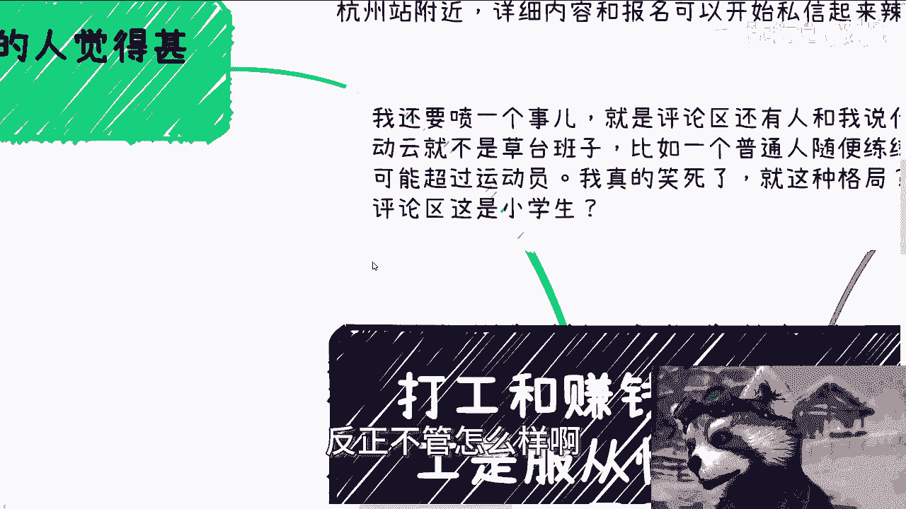
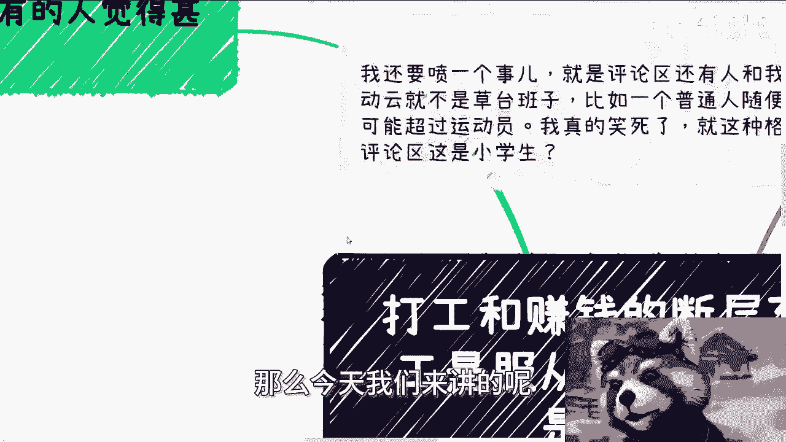
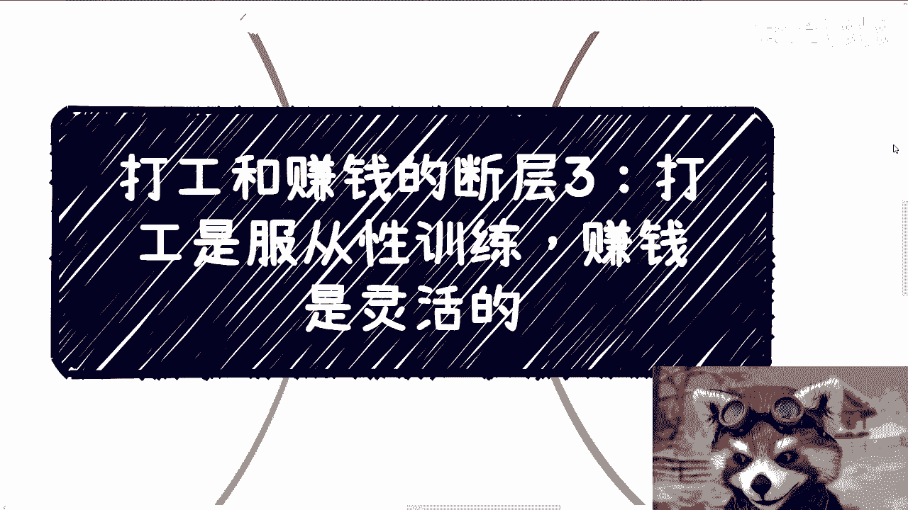
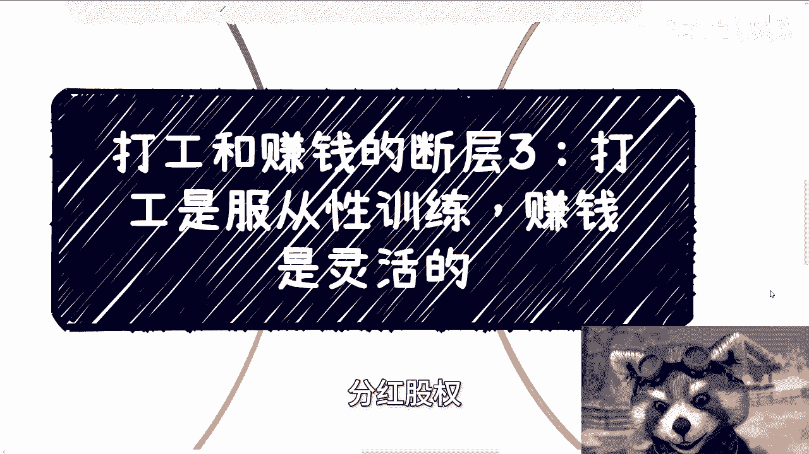

# 课程名称：打工与赚钱的断层（三）—— 打工是服从性训练，赚钱是极其灵活的 💡

在本节课中，我们将探讨打工与赚钱在思维模式上的核心差异。我们将分析为何从“打工者”转向“赚钱者”如此困难，并揭示束缚我们的往往不是外部环境，而是内在的“服从性惯性”。通过学习，你将理解赚钱的本质是**灵活性**，并学会如何打破自我设限的框架。

---

## 活动通知 📢

活动已确定于5月25日下午在杭州举行，地点位于杭州站附近。详细内容与报名请私信联系。

---

## 破除思维误区：何为“草台班子”？

在开始今天的内容前，需要澄清一个概念。评论区有人以“运动员”为例，反驳“草台班子”理论，认为普通人无法通过简单训练超越运动员。

这种理解是错误的。“草台班子”模式的本质是：利用庞大的基数（普通百姓）进行筛选，最终只标榜冠军和亚军，而完全无视过程中大多数人的牺牲与死活。这种模式广泛存在于各个领域，并得到媒体宣扬。这才是“草台班子”的真正含义。

请停止以这种单一、固化的方式思考问题。

---

## 核心断层：服从性训练 vs. 灵活性实践

上一节我们讨论了思维模式的差异，本节我们来看看这种差异的具体表现：打工是**服从性训练**，而赚钱是**极其灵活的**。

许多人可能认为相反，觉得打工灵活、赚钱死板。这恰恰是长期服从性训练导致思维难以转变的结果。

### 我们为何被“训练”？

从小到大，无论有意无意，我们接受的多是服从性教育。职场更是如此，无论是PUA还是常规工作，本质都是**服从性训练**。

一个理想的领导应根据下属的不同情况、性格、技能，为其规划合适的团队角色与发展路径。这才是领导力。

然而现实中，更多领导只是24小时安排任务、催促加班。前者将人视为**人**，后者将人视为**工具**。虽然前者依然存在，但已属少数。

### 束缚感的来源：惯性恐惧

在我接受的咨询中，最常见的问题是寻求一个“正确答案”。但问题在于，**哪来的标准答案**？

许多人感到束手束脚、找不到方向。但当你追问：“到底是什么束缚了你？”——是家庭、社会、父母、伴侣，还是法律？往往无人能给出具体答案。这只是一种模糊的**感觉**。

中式教育常回避对错讨论，因为“上面”说的总是对的。这成为一种生存策略：当个人没有目标时，最安全的选择就是服从，活着就好。

但当经济下行或个人被迫寻求出路时，人们试图跳出“服从性框架”，却立刻陷入迷茫与恐惧，不知从何下手。

**关键点在于**：社会本身并没有那么多框架束缚你。束缚你的，是你内心**服从性惯性**所构建的牢笼。

### 自我恐吓：想象出来的障碍

绝大多数时候（99.99%），阻碍你的都是**自己吓自己**。你的恐惧源于臆想，而非现实。

在服从性惯性下，独自决策会引发巨大恐惧。人们会提出各种假设性问题：
*   做活动有人砸场怎么办？
*   被人举报怎么办？
*   没有相关资质怎么办？
*   是否有法律风险，会不会坐牢？

从宏观讲，**任何赚钱行为都伴随风险**。不存在“零风险高收益”的事情。

然而，上述具体问题大多不是真问题：
*   **砸场/举报**：有多少小型沙龙活动会专门请保安或提前报备？极少。你可以直接询问场地提供方相关规定。
*   **资质**：观察你的同行，多少人拥有全部资质？多数活动也并未完全正规报备。你应该做的是**实地了解**，而非空想。
*   **法律风险**：只要仔细审阅合同，不涉足金融、期货、证券等强监管领域，不存心欺诈，风险是可控的。心存欺诈，则迟早面临后果。

### 社会的真实规则：行动与失败的自由

在社会上做事，究竟有什么束缚？没有地方禁止你去，也没有规定完全阻止你做事。

有人认为某些机构（如商会、协会）高高在上，百姓难以接触。但需明白：**没有法律禁止你接触**，而且这些机构本应服务于人民。

做事情的方法很直接：
*   活动没人来？**多做几次**，复盘改进，主动邀约。
*   没有合作反馈？**多包装自己**，继续洽谈。
*   寻找合作？**多渠道主动联系**。

社会允许你做的，除了成功，就是**失败**。失败是被允许的，没有人会因为你尝试而让你“滚出去”。

### 灵活应对：合作与谈判

遇到具体障碍，解决方案是灵活的：
*   **缺乏资质**？那就寻找有资质的伙伴**合作**。无非是合作条件与分润的谈判。
*   **不懂合同与分润**？核心是**先去谈**。没有一次“标准的”谈判或“固定的”合同。一切取决于合作内容、双方关系、服务细节等具体情境。

如果你觉得存在“固定流程”，那正是**服从性训练**的后遗症。赚钱的世界里，**一切皆是灵活的**。

你可以为获取基础知识而咨询，但涉及具体细节，必须有具体的项目背景，才能获得有针对性的建议。

---

## 总结与行动建议 🎯

本节课我们一起学习了打工与赚钱的第三层断层思维。

**核心结论**：打工培养的是**服从性**，而赚钱要求**极高的灵活性**。阻碍我们赚钱的，往往不是外部枷锁，而是内心因长期服从训练而产生的**惯性恐惧**和**自我设限**。

**行动指南**：
1.  **识别恐惧**：当感到束缚时，追问具体来源，通常会发现是臆想。
2.  **实地验证**：代替空想，直接向相关方（如场地、潜在合作伙伴）询问规则与可能性。
3.  **接受失败**：将失败视为被允许的、正常的学习过程。
4.  **灵活合作**：用合作解决资源/资质短板，在谈判中动态调整方案。
5.  **付诸行动**：所有问题都在行动中浮现，也在行动中解决。**先开始，再优化**。

记住公式：**赚钱 = 灵活性 - (自我恐吓 + 服从惯性)**

---

## 咨询服务 🤝

如果你在职业规划、商业规划、合同分润、股权设计或商业计划书等方面遇到具体问题，可以整理好你的现状与问题，通过咨询进行探讨。我能帮助你分析手中的牌，并以更广阔的视角提供规划建议。

**杭州活动报名及详细咨询，请私信联系。**