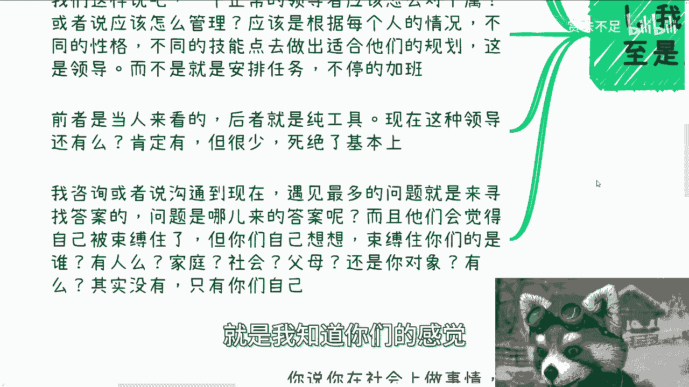
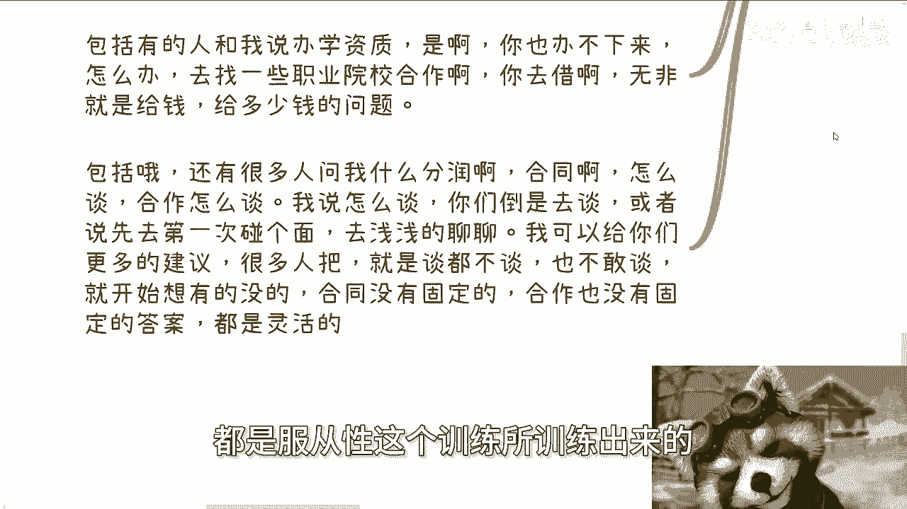

# 打工和赚钱的断层3：打工是服从性训练，赚钱则是极其灵活的 - P1 - 赏味不足 - BV1vz421Y7eK

啊大家好啊，这个今天一直在弄咨询，所以就比较晚，我纠结了一下，我想了一下，还是今天，反正只要不睡都算今天啊，就今天还是再来说一下呃，首先这个活动已经定了，5月25号下午在杭州好吧。

然后活动地点在杭州站附近，详细内容跟报名可以私信我啊，然后呢就今天在讲这个内容之前，我必须要喷一个事情，就是评论区哼很搞笑的啊，跟我说什么什么呃，运运动员我打错了，运动员啊，不是草台班子啊。

比如说什么一个普通人随便练练，就不可能超过运动员对吧，我跟你讲啊，跟你跟着我读，啊，为什么啊，你这种跟我谈草台班子，你你懂什么叫草台班子吗，草台班子的意思就是说利用非常多的人，非常多的老百姓去筛选。

然后就去仅仅标榜冠军，仅仅标榜那些，比如说冠亚军对吧，然后不管后面那些人的牺牲，也不管那些人的死活啊，然后在各地方都是这种模式对吧，各个情况下面，包括媒体的宣扬等各方面，这他妈叫草台班子，懂吗啊。

就这种格局，评论区他妈的是小学生吗，啊我表示我不理解啊，我真的不理解啊，反正不管怎么样啊。

不要你们，我跟你们讲啊，你们思考问题方式都是一样的啊，不要再用这种方式去思考了，妈的这种有什么好说的对吧，那么今天我们来讲的呢。

是打工跟赚钱的断层三啊，赚钱呢是灵活的，我跟你讲啊，可能很多人甚至觉得是相反啊，嗯首先啊打工是灵活的啊，赚钱是死板的，我跟你讲，笑死了，还真有人这么想啊，我跟你们讲，我只能说啊，就是服从性的训练。

可能真的接触太多，一下子呃这个改变不过来，我们这样说啊，大家从小到大，不管有意识无意识的接受的都是服从性的教育，当然到了职场上就更是了啊，职场上的PUA啊，正常工作也罢啊，其实都是服从性的训练呃。

一个正常的领导应该怎么对下属啊，或者说应该怎么管理的呃，理论上来讲应该是根据每个人不同的情况，不同的性格在团队里面担担任不同的这个岗位，不同的技能点去做出适合他们的规划，这就叫领导啊。

而不是说他妈的每天就24小时安排任务，然后不停的加班，嗯当然啊前者是当人来看诊，后者呢就是纯工具，现在这种领导我跟你讲，还有吗，有肯定有的，我也是认识的，但他们很少死绝了啊，呃我咨询或者沟通到现在呢。

遇到最多的问题就是来寻找答案的，呃问题是哪来的答案啊，还是我们前两天说的那个问题，哪来的答答案，而且呢最神奇的你知道一点是什么，他们会这么跟我讲，他说陈老师，我觉得我们就是束手束脚啊。

我们好像就说找不到方向，我们好像怎么样啊，但问题是你仔细想想看，你说你自己被束缚住了，那束缚住你们的是谁呢，有人束缚住吗，还是家庭束缚住，还是你告诉我，社会束缚住，父母，束缚住，束缚住对吧。

还有你对象束缚住，就是你真的问他们，你说哎到底什么东西束缚住还是法律束缚住了，没有呀，有没啦，你说的出来吗，就是我知道你们的感觉。

可能觉得你束缚住了，但是我就问你们到底是什么呢，你说的出来吗，对吧啊，我跟你讲，中国式的教育就是不能讨论没有对错，因为上面说的都是对的，父母说的，老师说的，然后领导说的都是对的，错的也是对的。

那是因为至少这样能生存嘛对吧，那我觉得没毛病嘛对吧，他自己没有目标，自己不知道要什么，那么最好选择就是顺其自然，顺其其服从啊，那么反正活着就好了，这就是大部分人大部分人的想法，但问题是什么呢。

现在可能经济不好或者一些别的原因，大大家想自己开始做点事情，那当然这个不是大家想自己开始做点事情，可能更多的是因为被迫无奈想做点事情，对吧啊好，那么咱先不说赚钱多还是赚钱少。

当大家要跳出服从性框架的时候，你就会发现完了啊，打出GG就什么都不知道，而且你不但什么都不知道，而且你还很恐惧，然后还不知道怎么下手对吧，但是恰恰相反的是什么呢，你会发现你有非常多的框架。

但是社会上没有所谓的框架，也没有所谓的束缚对吧，那为什么这么多人做不了事情呢，因为自己束缚住了自己，你跳不出这个服务中心的惯性啊，那么第三点我们说的自己吓自己，我跟你们不这么说啊。

大部分大部分大部分大部分大部分的时候啊，99。99的时候，你都是自己吓自己，因为因为你你不管是做事情，还是在你自己吓唬自己的时候，你会发现你都是没有依据的，你的依据都是你脑子里面意淫出来的。

就是我们说的YY出来的对吧，因为服从性的那个那个那个叫什么，就是惯性，让大家对于所有的事情都是有恐惧的，因为当你自己要做一件事情的时候，你就不知道该怎么做，而且你到现在为止啊，什么问题都是问过的啊。

什么问题都有问过，比如说啊做活动有人来场呃，砸场子怎么办，如果有人举报怎么办，如果没有人来怎么办，做某些业务，然后问我哎，陈老师没有资质怎么办，有人揭穿我怎么办，我跟你讲比比皆是，而且最离谱的是什么。

最离谱的，还有就是说什么法律风险的问题，说是不是会被抓啊，是不是进去做几年了对吧等等等，我跟你这么说啊，首先我们从宏观角度来讲，最大的这个这个层面来讲，你只要去赚钱，一定都有风险对吧，你总不可能跟我说。

哎陈老师，我今天想赚钱啊，我我赚钱性价比比我打工高啊，然而呢我没有任何风险，要命嘞，有吗啊，你跟我说有吗，没有吧对吧，首先这是第一点啊，那么基于这个宏观层面，我们来说啊。

上面我们刚刚说的什么什么有没有举报啊，有没有什么什么资质啊，对吧等等各种问题根本不是问题，为什么有人来砸砸场场子，那我就这么问，你看到过多少沙龙，什么20个人，30个人，50个人沙龙，有他妈请保安的。

有不啦，有吗对吧，举报没人来资质等等，我就这么说，你们去看看同行，看看别的活动，看看别人做事情能有几个人有资质的，哎我他妈奇了怪了啊，能有几场活动有报备的啊，我就问你们。

你们去看看他们跟场地方有几方是正规的，去做报备的，有的啦，你不要自己吓自己，你就直接去了解，你去问呀，对不对，而且我说实话你们不应该来问我，你知道为什么，因为我说的真的假的，你们不知道。

你们真的要去问的，就应该问场地方，你们我跟你们这么说，随便找一个酒店，你就去问酒店的那个负责人，就说哎我比如说我今天在这边定一个场地哦，我要不要报备，他会告诉你的，他告诉你的一定是真的呀，对不对，好。

那么关于法律问题，我跟你讲就更他妈更别谈了，因为我就这么说啊，你但凡合同看仔细一点，不要去对吧，折腾那些所谓跟金融有关，跟期货有关，跟证券有关的东西一般不会存在什么风险，或者我退1万步来讲。

你只要不是存心的去骗老百姓，你担心这干嘛呢，对吧，我而且反话又说回来，你要存心骗老百姓，就活该，对不对，你也不用担心，你早晚得进去，对不对，好那么第四点回到社会上啊，你说你在社会上做事情有啥束缚呢对吧。

是有什么地方不让你去呢，还是规定你不能做呢，还是怎么样呢，没有呀对吧，你就像很多人跟我说，创伤啊，那些协会那些什么东西，是不是我我们老百姓不太好接触，我说大哥有法律规定吗啊，而且我说你难道不明白吗。

他们是谁啊，他们应该是为人民服务啊，我们是人民啊，哥哥们，你们不要搞反啦啊，对不对，而且你说任何事情做活动没人，那就多做几个，然后复盘改进去找人聊，没有反馈，那就多包装自己再去聊，去合作。

那就正常的寻找商务或者别的链接去多做一点，你除了失败，还有别的什么不允许的呢，对吧，你你说有什么别的不允许不存在的，你你最多就是失败，有什么有什么东西是说哎你不能进来啊，你你给我滚会不啦，对不对。

你说资质简单，比如说你做某个证书缺乏资质，你也拿不到资质，对吧对的，那你就去找有资质的合作呗，最多就是人家不跟你合作，怎么了呢对吧，你包括有人跟我说办学资质，我说对呀，你是办不下来的呀，那没关系啊。

你可以找一些职业院校，找一些民办学校有办学资质的去合作呀，那无非就是给钱给多少钱的问题嘛，对不啦，你包括我跟你讲最离谱的还有什么，你包括还有很多人问我什么怎么分润啊对吧，合同怎么谈啊。

我说我说是这样子的，你怎么弹，你倒是先去谈呐，对不对，就或者说你第一次碰面得碰啊，就是浅浅的你要聊一下啊对吧，那么你跟我讲你们分别做什么，那么我可以根据你们的内容给出更多的建议，你知道吧。

就很多人我跟你讲谈都不谈，然后他又活在他自己脑子所歪，歪出来的世界当中，然后也不敢谈，然后开始想有的没的，然后就就就就就问我哎，合同怎么聊啊，合租怎么聊啊，大哥合同没有固定的合同，合作也没有固定的。

任何东西都没有固定的啊，都是灵活的，你们但凡觉得有任何固定的，都是服从性这个训练所训练出来的。

这个问题，你明白吗啊就就不存在，今天你说哦，我们跟企业方聊哦，应该怎么聊哦，我们跟高校聊应该怎么聊，没有应该的，你懂吗，就是你到底是聊什么服务，你到底跟对方怎么合作，你到底是怎么跟对方认识的。

你各个层面的因素都会决定你最终怎么去聊，对吧，你单纯问我陈老师这天怎么聊，那怎么聊呢，我怎么知道怎么聊啊，对不对，就说你要今天问我了解一些，就是你是从一个科普程度，你聊问我没问题，我可以跟你讲。

但是你但凡说你要想了解细节，你肯定得要有些具体的东西对吧，然后你说哦大概怎么样子，那我可以告告诉你说哦大概接下来怎么做对吧，大概你们怎么分润对吧，怎么样子比较合理对吧，就这样子去聊的呀，啊好吧啊行。

那就这么着吧啊那个杭州活动好吧，而是25号下午继续报名，然后呢那个这个在杭州站附近啊，然后呢就是说呃职业规划，商业规划啊，合同分润分红，股权商业计划书。

你们但凡有碰到任何问题的，你们都可以来找我啊，让我帮你们一起来看，当然我们走走咨询啊，然后就说你们手上有什么牌，或者你们手上没有什么牌啊，你们也希望通过跟我沟通啊，希望通过我的视野。

能够给你们带来更好的一些规划的话，那么你们整理好问题，我们再来做咨询。