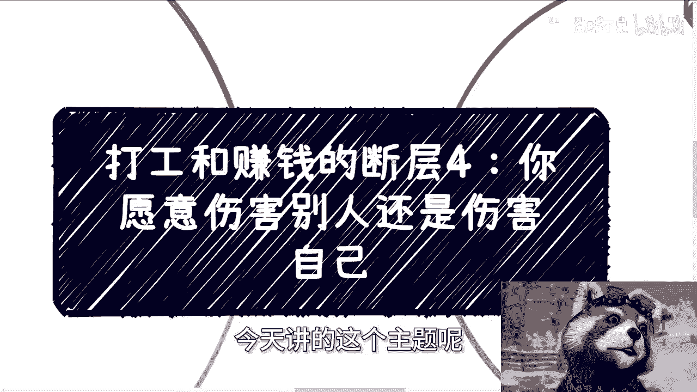
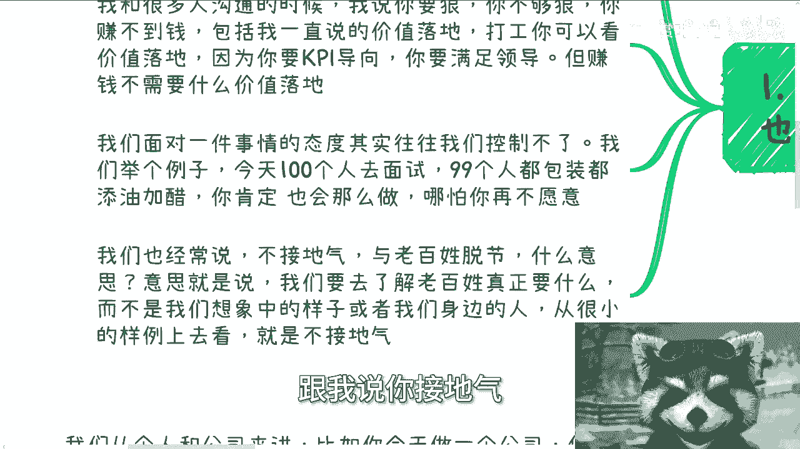
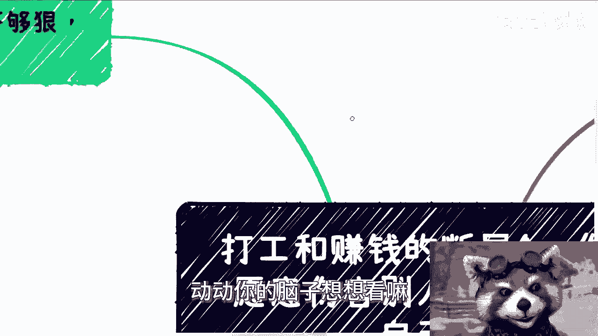
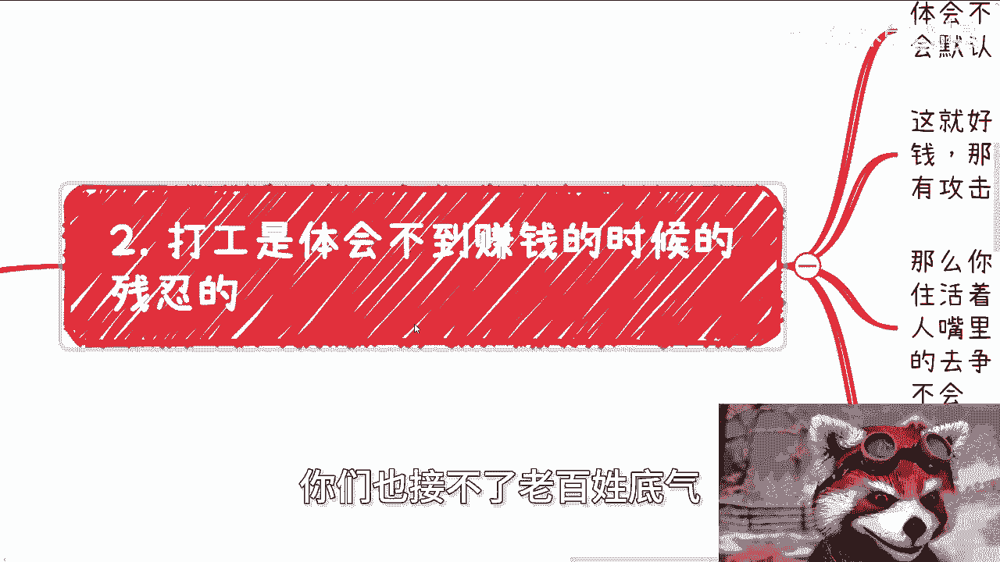
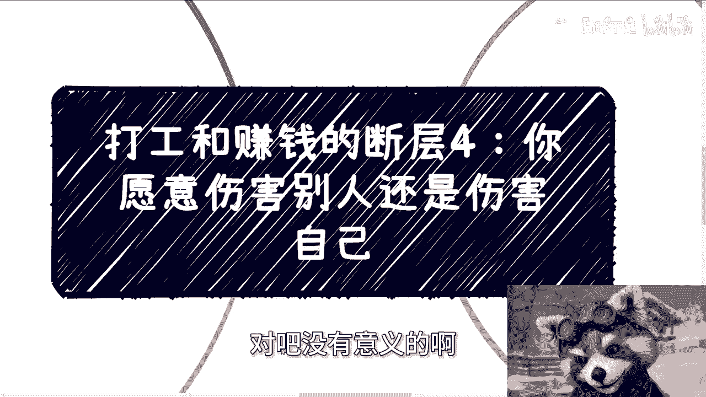
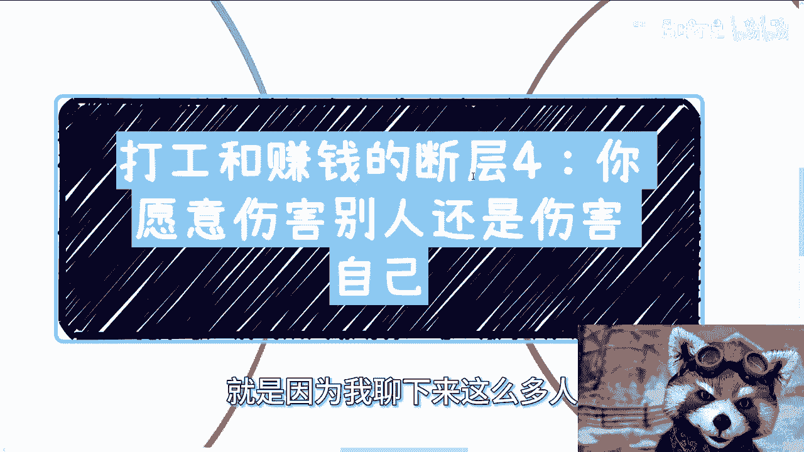
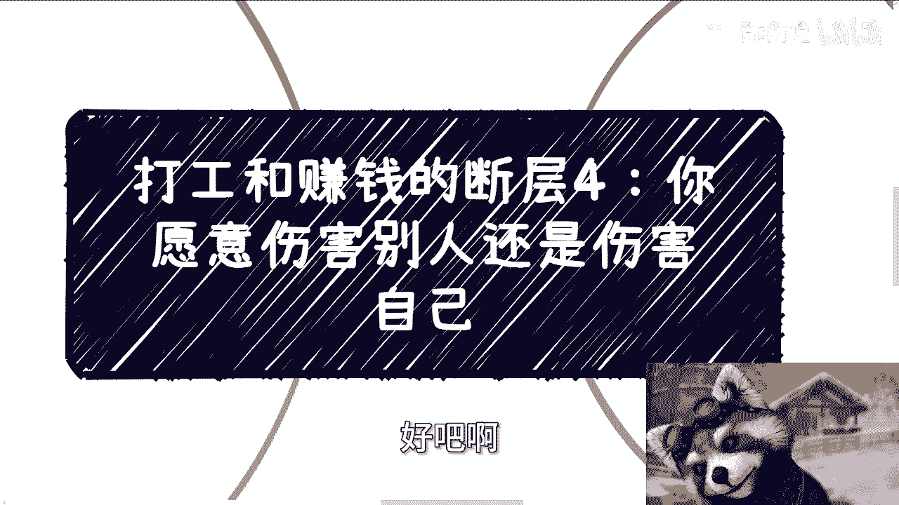

# 打工和赚钱的断层4：你愿意伤害别人还是自己 - P1 - 赏味不足 - BV17E421F745

好大家好，今天讲的这个主题呢。

是我们说打工跟赚钱的断层四啊，但今天这个主题，你们看这个主题就知道就很抽象啊，我其实在写的时候，我也有点不知道怎么个写法，让大家能够更明白这件事情，怎么说呢，就是说表面可能能明白。

就是我们说啊商业上很残忍对吧，社会上很很怎么样子，但是你单纯知道这个东西没卵用，你知道吗，哦那我我我还试试图试讲一下啊，第一个呢就是说你打工跟赚钱，你打工的时候呢，其实你不够狠。

或者说你也没有这个场景给你狠，也就是说这事很简单，因为无论发生什么事情，无论打工层面发生什么事情，他跟你的利益是毫无绑定的对吧，就我们以前也说过，那么打工他不叫赚钱，为什么呢。

因为你不会去考虑钱是从哪里来的，你就是每个月拿工资嘛对吧，那么同时你在打工的时候呢，赚钱的欲望其实是不大的，因为打工模式你也大不起来啊，就是你说不好听的，你说我大了，我怎么个大法呢，对吧哦。

你说我每个月比如说2万块钱，那你说我欲望很大，你怎么办，对吧啊，那么我跟很多人沟通的时候呢，我说你要狠啊，你不够狠，你赚不到钱，你包括我一直说这个价值落地对吧，打工你可以看价值落地，因为你要做东西。

你要你要满足领导，你要满足那个呃呃公司对吧，你要满足整个的KPI啊，但是赚钱的时候你就不要来跟我谈价值落地了，因为赚钱时候来衡量的标准只有一个东西，那就是赚钱对吧，那就是赚钱。

你你跟我说价值落地有有什么用呢对吧，关键就是有什么用呢，哦那么我们面对一件事情的时候呢，态度往往是我们控制不了的，就是我举个例子啊，比如说今天啊100个人去面试，99个人都包装都添油加醋。

你肯定也会这么做，为什么，因为因为你没办法，你不这么做，你就会被筛掉，你不要来告你，不要来跟我说什么，哎呀我很诚实对吧，我我很真诚，哎就是童话故事你可以去听，但是你不要当真，对不对，就社会就是这个样子。

你告诉我，你在社会上看到过哪个地方，什么100个人去面试，99个人都包装添油加醋的，然后录取你的，有不啦，我不说，我不相信他，我绝对不相信他对吧，就是所以到时候你肯定也会这么做，哪怕你再不愿意啊。

我们也经常说不接地气，与老百姓脱节，是什么意思，意思就是说我们要去真正明白什么是老百姓，我们要真正明白老百姓的这个基础，现在什么地方啊，就是说就很简单，你比如说你学历很高，你自己想想看。

中国学历高的能占百分之多少对吧，比如说你收入很高，那么你想想看你收入很高占百分之多少对吧，比如说你很年轻，比如说你又是985211的，那么啊不是9851，就是说你你你又比如说是做计算机的对吧。

做一些高科技的高高精尖行业的，那你再想想看中国老百姓，这这个做高精尖行业能百分之多少，对不对，就是你永远以你身边，比如说你永远以你想象中的样子，或者你身边的人这样去看，你跟我说你接地气。

你怎么接地气人呢，就是如我们就你反过来想看，如果今天中国老百姓都是高精尖行业，都是他妈的呃本硕博对吧，都是他妈的年纪很轻的，你说接地气，我也就信了，对不对，你你你多用用你脑子想想看嘛就知道了。

你怎么个接地气法呢，就是我跟你讲，很多人很好玩的，在北上广深对吧，或者说在一些准一线1。5线，然后自己呢又是个不错的学历，甚至还还跟高校合作，或者读了一些NBA，然后跟我说，他接地气，你接什么地气。

你跟我讲，对不对，我知道我，我跟你们说，我很直接的，就是你们既接不了，接不了上面，你们既接不了正规的地契，你们也接不了老百姓的地气。

这他妈就叫上不上，下不下，啊不要来跟我讲接地气，你们没有接过地气啊，第二打工是体会不到赚钱时候的残忍的。

为什么，因为体会因有因为什么，我刚一已经说过了对吧，那么你体会不到，所以你根本不会有能力去思考或者去想，就是说你默认通过打工的思逻辑去思考，接下来赚钱的事情，这条路是走不通的。

这就好像我们常常沟通的时候就会谈到，只要你想赚钱，那么你必然就会触碰到别人的利益，对不对，因为你整个你你你你不管，是把它想象成一个天平也好，假想象成一个蓄水池也好，他总量是等量的。

你除非就说中国一天到晚在那边印钞，那就另外一件事情了对吧，你任何一个市场，你无论它再大，它总有个总量的，就是你多他少，就这么简单嘛对吧，你今天想赚钱，我还是那句话，比如说你可能一个月就赚了几千几万。

那无所谓，你要是说一年已经到百万级别了，你一定触不到别人的利益对吧，你你什么叫触碰利益啊，触碰利益就是别人会受伤，就是你在间接的攻击，别人就会有厮杀你，你不要来跟我谈什么，白额就是非常傻白甜的。

怎么可能傻白甜呢对吧，那么你怎么办，我就问你，比如说别人背后捅你一刀对吧，或者说通过一些商业的手段来攻击你，你怎么办，我跟你讲，你就两种选择嘛，要么你选择忍忍着对吧，但是你忍着没问题。

忍着的前提是你要有能力活下去啊，那么赚钱这条路上怎么算活下去呢，就是不停的从别人嘴里抢蛋糕，然后你要不停的营销，不停的去争取，不停的拓展人脉，这就叫活下去，你打工你会吗，你不会的呀。

你打工你会做这些行为吗，你不会的呀对吧，而而且这个事情你在社会上没有办法，这就是这个规则，怎么样怎么办呢，你之前很多人还跟我说呢，唉雷军就很好对吧，雷军怎么样怎么样，我说大哥哎，你呢也是搞笑的。

第一我跟你这么说，没有谁是好不好的，好，活不到现在的哦，你跟我说他妈现在一个好人哦，就是大善人对吧，怎么样子，能够在商业如此艰难扭曲的商业环境下，活到现在，搞笑吗，你不是在对吧，这是第一点。

第二点是哪家大公司里面没有猝死，哪家大公司里面没有什么各种大病，那各种就是呃呃下面的老百姓，你跟我说他好人好在什么地方对吧，我早就跟你们讲过了，你们就是我们不能因为说以前杀过人对吧。

然后再说他以后面救过人，捐过款，就是他大善人，这我就我就我跟你们讲，就是你们大部分人看问题非常的单一，非常的二极管哦，然后那你这样子的话，我跟你讲，只会害了你们自己，就这么简单，因为社会是复杂性的。

如果这么单一，今天也不会这样子的，那那么我们回过头来说，那么这个是呃，我们说忍着对吧，那同样的你不忍，那么你选择在对方之前干死对方对吧，那么你可以正常的反击，你也可以通过一些别的商业手段，那随便你。

但是你不可能坐以待毙，但是还是那句话，以上所有的这些想法，你不可能在打工的时候萌萌生出来，就算你萌生出来也无非都是一些过家家的逻辑，对吧好，那么第三之前朋友问我，我有没有主动伤害别人。

哎我跟你讲这个问题很好玩啊，我跟你讲这个问题就非常的奥妙啊，我是这么跟他讲的，我说这个问题我很难回答你，为什么，因为首先第一点怎么叫主动，怎么叫伤害对吧，我说我但凡能活到现在，大家还能看到我，这就证明。

我肯定直接间接的伤害到了一些人的利益，并且我同时我胜利了，那你你说这叫不叫伤害呢，这叫不叫主动呢，我没法去判断对吧，而且怎么算主动呢，哦我可以说我主观上没有主动过啊，你也不知道。

而且我可以说我主观上的确没有主动过，但是我潜意识里面去攻击过别人，那又怎么定义呢，你你你就是就是我的意思是什么呢，我的意思就是说你们所有人去思考这些问题，没有意义，你明白吗，就不要来去谈说啊。

我们是这个对哲学很感兴趣，我们对什么东西很感兴趣，然后呢你能赚到钱吗，不能不能，你谈个屁，对不对，那伤害不伤害就更没法说了，我当时是这么说的，我说所有的非物理上的伤害，就是非肉体上的伤害。

其实都是情感上的，你想对不对对吧，但是如果都是情感伤的话，总不能说因为对方伤心了，对方难过了，对方没有赚到钱，所以代表是我伤害了，这他妈两者没有因果关系吧对吧，或者说哦因为我赚到钱了，我切了他的蛋糕。

损对方损失了一部分收入，就说我伤害了这他妈也没有因果关系吗对吧，所以说本质上我跟你讲，商业上也好，社会上也罢，没有这种逻辑，你非要去思考这种东西，我跟你讲，我控制不了你们对吧。

别人也改变不了你们，你们谁但凡要去思考这种东西，你就好好过家家，你懂吗。

你就好好过家家，不要去想这些东西啊，哦同样的你也不要来找我讨论，找找我讨论没有什么太大的意义，对不对啊，好那么第四点，你们有没有发现啊，如果你们想做什么，但又没法狠心去做。

最终其实是伤害的，但伤害的是你们自己，你们仔细想想看啊，我们从一个我们从个体和公司这两个角度来讲，首先比如说你现在做一个公司，但你又没法很好的管理，或者说没法用正常的商业运作去做。

公司都是他妈的感情用事对吧，称兄道弟对，都是这个朋友那个朋友啊，这个朋友们帮我那个那个朋友们帮我那个，我跟你讲，你去看看中国哪家公司，或者全球哪家公司是这样做下来的，有吗，没有的。

你只要做CEEO做创始人，做股东都是狠心的，我跟你讲，你们都去公司里面去，就是多待待你们就知道了，你们就知道资本家对下面员工是多么狠心，多么残忍，因为他不残忍，他做不下去啊对吧，你最后我跟你讲。

这公司做不下去，你既伤害你的朋友，也伤害自己，还觉得冤枉你，冤枉个屁，我跟你讲啊，那么第二如果你是个个体，那么你不狠心做一件事情，我跟你讲啊，你我不管你是用爱发电还是去赚钱，那么你最终只会内耗。

因为你会去想的是，明明我用心做了，也做的很有价值，为什么流量不多，或者为为什么赚不到钱，对吧，你肯定会去想啊，那我就问了一个人活着为了啥，我就问一个人为活着为了啥，你不要来跟我说。

你有你的使命或者多做别的东西，没有用的，我跟你讲，你在当下的这种2024年的社会，你就做一件事情是什么，就是先赚钱，因为你不赚钱，你谈什么理想，你谈什么目标没有的对吧。

你现在就相当于是为了达到自己的目标，要先赚钱，但是你现在甚至连赚钱这个目的都不直接，那我那我问你，就是你还不是间接的伤害你自己嘛对吧，那我就不理解了，真的我不理解了你，你你你连自己的目标都不直接去达成。

那你要干嘛呢，对不对啊，其实社会上商业上都是这个逻辑，就是如果我今天比如说如果我今天赚钱了，我还要去想，卧槽我他妈切了谁的蛋糕哦，那那那那他妈的谁因为我这个东西伤心了，卧槽那我还赚什么钱。

那按照你们这个逻辑，今天阿里巴巴啊，ba at对吧，字节京东拼多多，不要有咧，没有咧，人家做什么东西啊，人家在他妈的一个月赚1000块钱的时候，就在那边开始开始每天抑郁了，哎呀我不行，我他妈赚别人钱。

我他妈我是，对不啦，你们不是在搞笑吗，啊而且而且我就这么个人给你们举个例子，这就好小像你今天主股票，你今天赚钱了，你难道说你是非要全球去找哪个人，因为你股票赚钱而跳楼吗，你会吗，我就问你，你会吗。

你看到哪个人会的，那当然啊，有些人可能在想呢，哎股票这个案例可能我们没有太大感觉，因为你就算赚钱了，你今天在股票上赚钱了，你没有看到过谁在股票上赚钱，因为可能想到别人有有。

因为他自己赚钱而别人亏钱的而抑郁的，你看到过没啦，没有的呀，或者说就算有就极少部分极少部分，但是大哥你有没有想过为什么，因为这个逻辑就好像你今天雇了人去伤害别人，但是你没有直接动手，所以你没感觉啊。

但但但问题是你伤害了不来，你伤害了呀，对不对，你只是在逃避啊，这他妈就是标准的双标啊。

对吧就是说就是说什么意思呢，就是说你今天要么就不要圣母，你今天要是在一个地方圣母，那你有本事在所有地方都圣母，对不对，有意义吗，没有意义啊啊所以我早就说过了，就是说你要去当菩萨，你要去当圣母。

你有本事先赚到钱，先强大自己，你不要现在是什么都没有，就在他们他们那边，圣母那叫什么，那叫自我感动，那叫狂妄的，那叫那那叫盲目的狂妄对吧，你再说的不好听点，那叫无能狂怒对吧，没有意义的啊。

所以我今天这个为什么会出到这个主题，就是因为我聊下来这么多人。

很少人是有能赚到钱的，但是他他们共同大部分特点都是在打工，那你跟他聊的时候，你就会发发现他们不是，就他们并不是软性技能上面，和硬性技能上面有缺陷，他们是他妈的思想上面从根源就有缺陷，啊好吧行。

就这么着啊，嗯好吧，职业规划好吧，商业规划，然后股权啊，分红啊啊丰润啊对吧，商业计划书啊对吧，白皮书啊啊或者你们就是手上有什么牌，或者你们没有牌啊，你们也希望呃通过跟我的沟通。

或者通过我的一些视角或者视野，能够跟你们带给你们一些更贴近于这个社会，当下发展的这个规划的话，那么你们可以整理好问题，我们再来做咨询。

