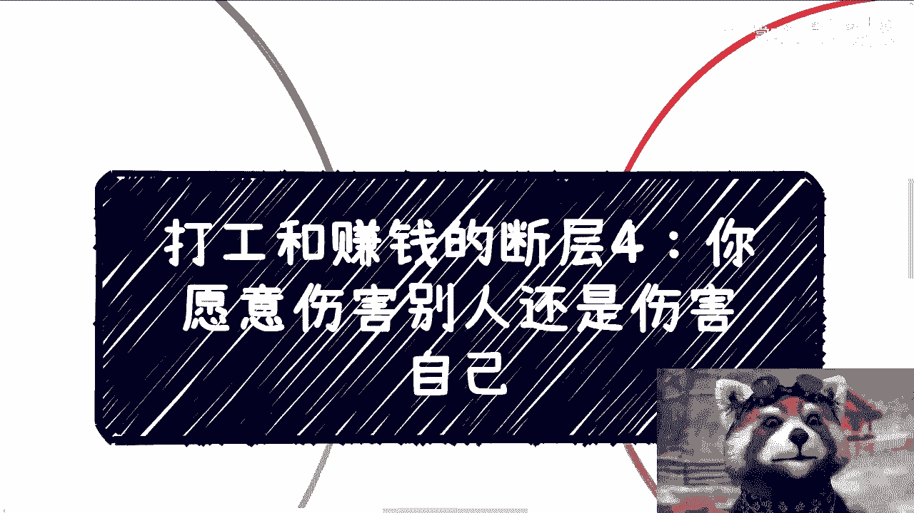

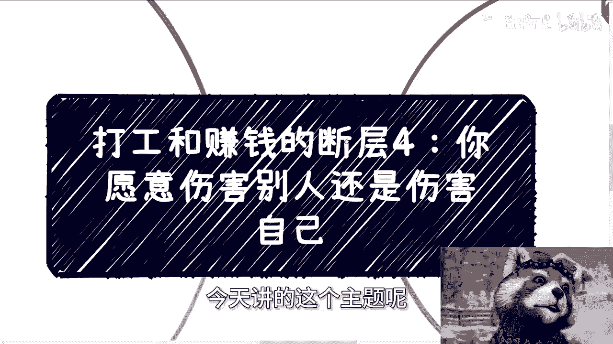

# 课程04：打工与赚钱的断层（四）—— 你愿意伤害别人还是自己？🤔

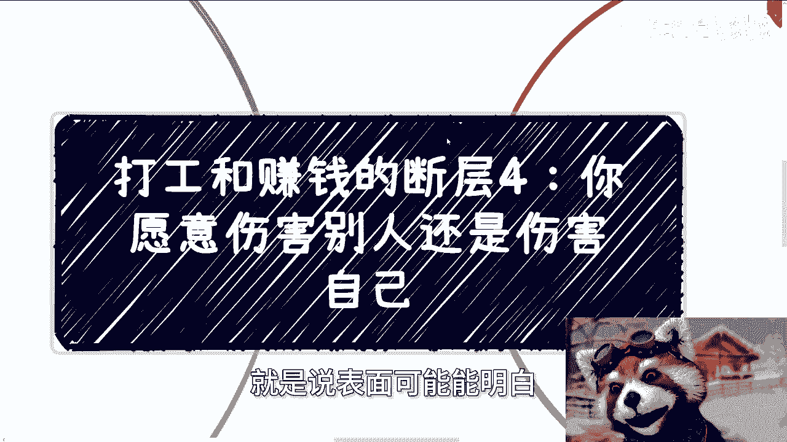

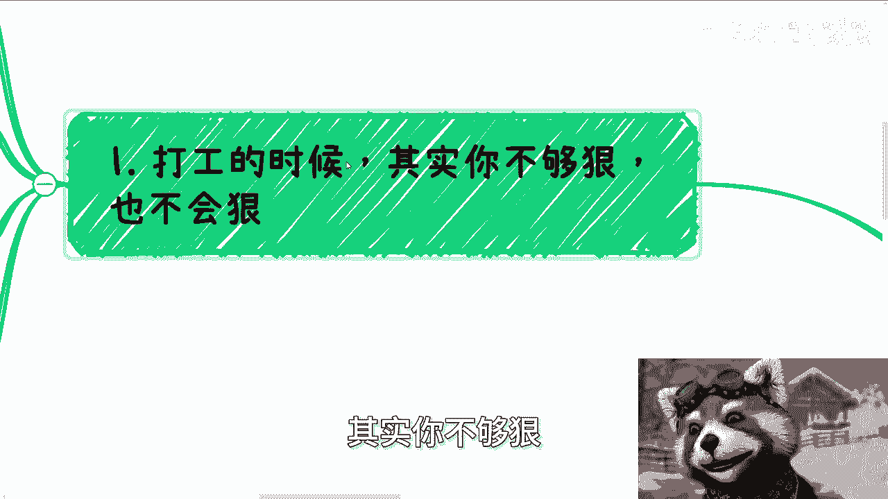

在本节课中，我们将探讨一个在从打工者思维转向赚钱者思维过程中，至关重要却常被忽视的核心问题：商业世界中的“狠心”与利益冲突。理解这一点，是跨越思维断层的关键。

## 概述：为何“狠心”是赚钱的必修课？

上一节我们讨论了思维模式的差异，本节我们将深入一个更具体的矛盾点。打工与赚钱的本质区别之一，在于对“利益冲突”的感知和处理方式。打工时，你的利益与公司绑定有限，无需直面残酷的竞争。而赚钱，本质上是一个资源再分配的过程，必然会触及他人的利益。

## 一、打工环境无法培养“赚钱所需的狠劲”💼

在打工模式下，你缺乏“狠心”的动机和场景。你的收入是固定的工资，与项目的最终利润或市场竞争结果没有强绑定关系。因此，你无需思考“钱从哪里来”、“如何从别人那里争夺市场”这类问题。

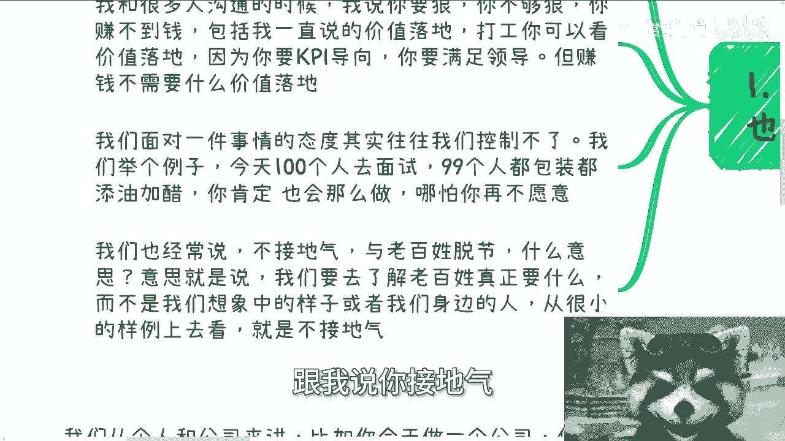

你的核心任务是“价值落地”，即完成上级指派的工作，满足KPI。但赚钱时，唯一的衡量标准就是 **`能否赚钱`**。此时若仍套用打工的“价值落地”思维，往往行不通。

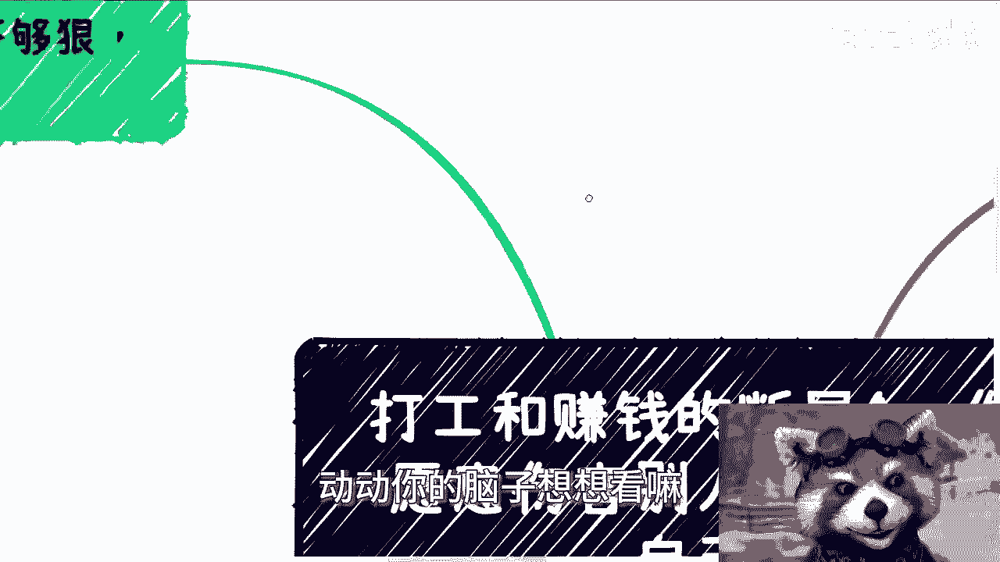

**过渡**：理解了打工环境的局限性，我们来看看当进入真实商业竞争时，人们为何会陷入两难。

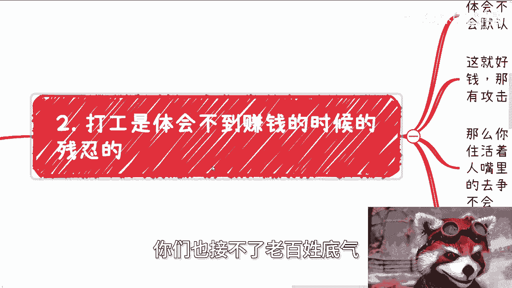

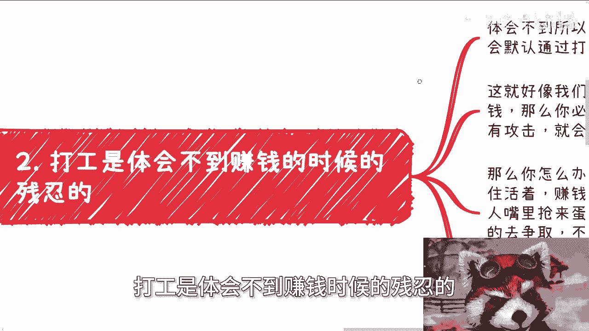

## 二、商业竞争的本质：你必然触及他人利益 ⚔️

只要你想赚钱，就必然会触碰到别人的利益。市场总量在一定时期内是相对固定的，这就像一个公式：

**`市场总收益 ≈ 常数`**

因此，**`你的收益增加 ≈ 他人的收益减少`**。当你赚取的金额达到一定量级（例如年入百万），这种利益冲突将变得非常明显。竞争意味着有人会“受伤”，商业厮杀是常态。

面对竞争，你通常只有两种选择：
1.  **忍让**：但前提是你要有能力在持续的竞争中“活下去”。赚钱路上的“活下去”，意味着你必须持续营销、拓展人脉、争夺客户。
2.  **反击**：在对方攻击你之前或之后，通过商业手段进行正当防卫。

关键在于，以上这些关于竞争、厮杀、生存的思维和策略，在打工的温室里几乎无法萌生，即使有，也多是“过家家”般的想象。

**过渡**：既然冲突不可避免，一个常见的道德困境就出现了：我们是否“主动伤害”了别人？

## 三、关于“伤害”的无意义辩论 🚫

很多人纠结于“我有没有主动伤害别人”这个问题。但在商业语境下，这种思考往往没有意义。

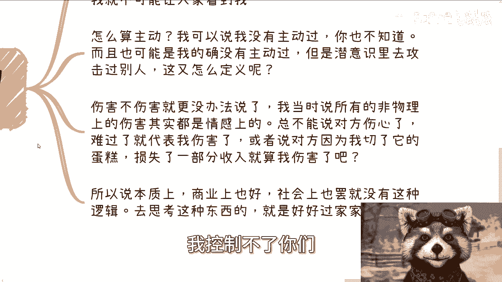

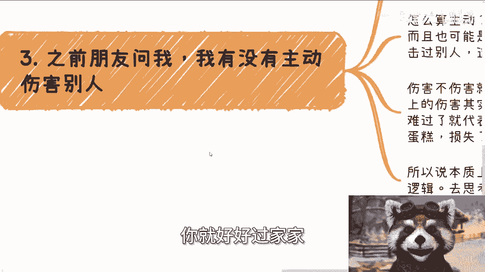

首先，“主动”和“伤害”难以界定。只要你在商业上取得成功，就意味着你直接或间接地影响了竞争对手的利益。这算伤害吗？其次，商业伤害大多是非物理的、情感或利益上的。不能因为对方“难过”或“赚少了”，就简单归因为被你“伤害”了。这之间没有必然的因果关系。

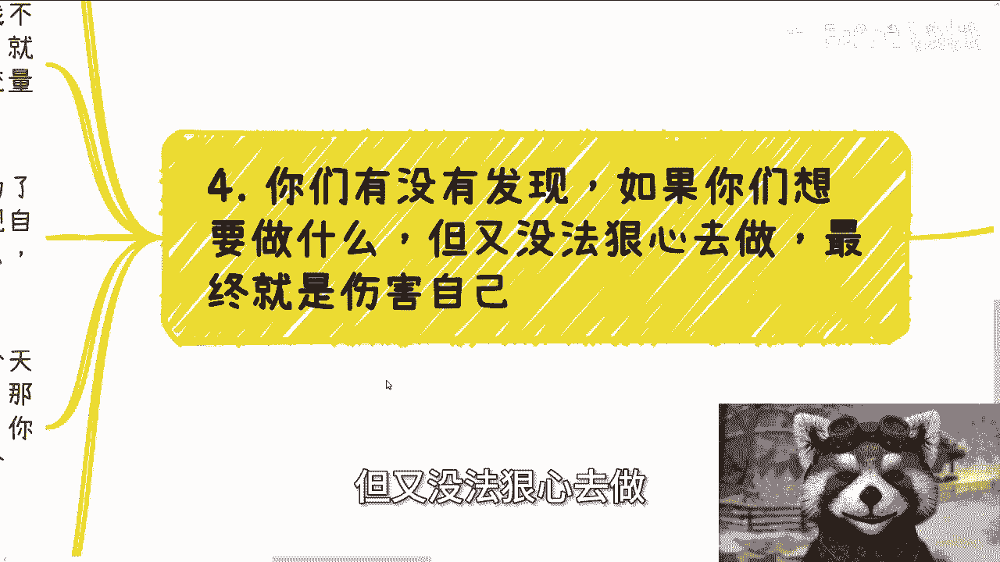

商业社会遵循的是另一套逻辑，沉迷于哲学式的道德辩论，只会让你脱离现实，无法在商业世界中行动。

**过渡**：与其纠结于是否伤害他人，一个更值得关注的现实是：不果断行动，最终伤害的往往是自己。

## 四、不狠心的最大代价：自我伤害 😔

如果你想做一件事（无论是创业还是个人发展），却因无法“狠心”而犹豫不决，最终伤害的其实是自己。我们可以从两个角度看：

以下是两种常见的“不狠心”场景及其后果：

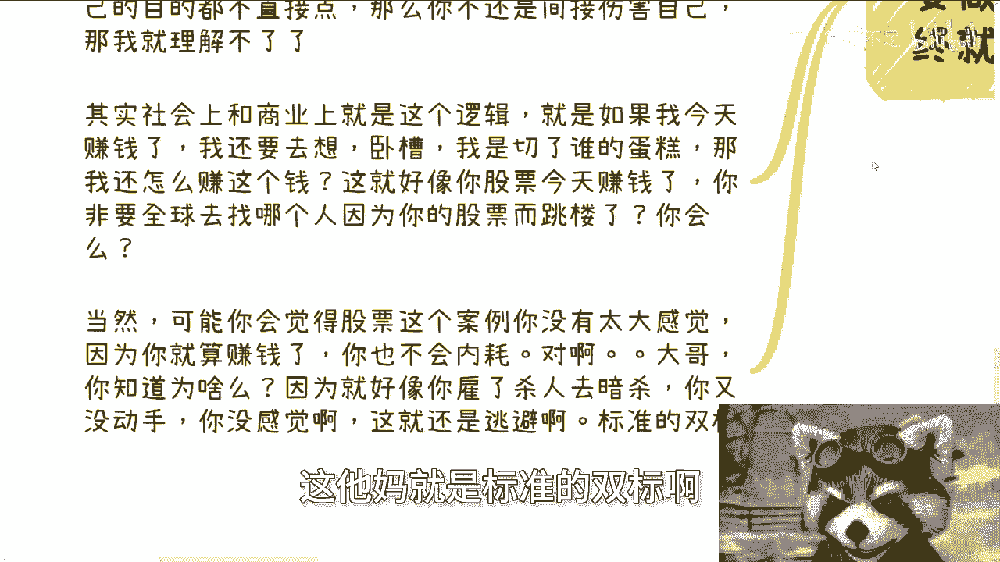

1.  **经营公司时感情用事**：如果管理公司时称兄道弟、处处讲人情，无法按商业规则做出艰难决定（如裁员、绩效评估），公司最终难以生存。这会伤害所有跟随你的朋友，更伤害你自己。
2.  **个体做事时回避竞争**：如果你个人做事（如做自媒体、自由职业）时，害怕竞争、不愿营销、只想“用爱发电”，结果往往是陷入内耗。你会不断纠结：“我做得这么用心、有价值，为什么没有流量/赚不到钱？”

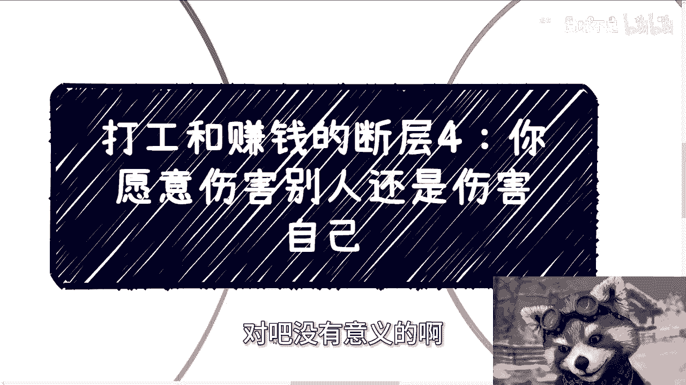

在当下的社会环境中，一个人首先要解决生存和发展问题，核心就是赚钱。这不是拜金，而是实现任何其他理想的基础。间接地回避赚钱这个直接目标，就是一种对自我的伤害。

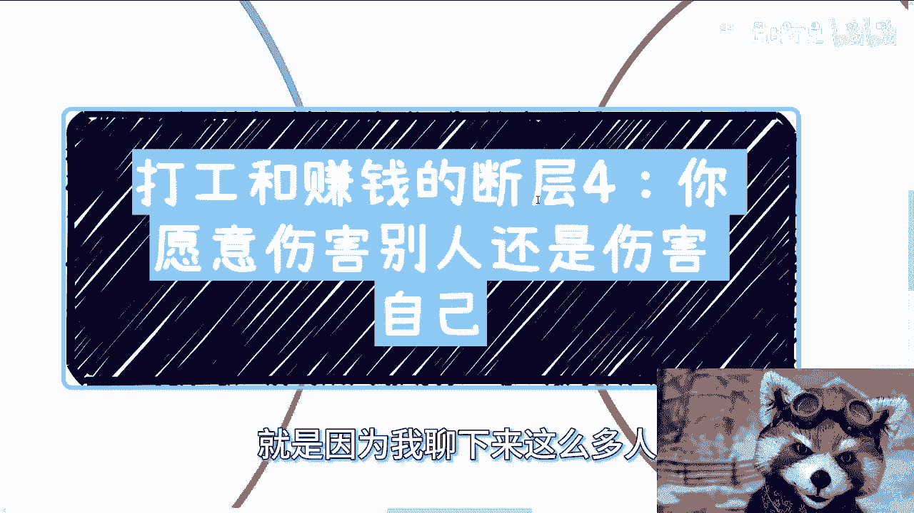

**总结**：本节课我们一起学习了从打工思维转向赚钱思维必须面对的一课：接受商业竞争的残酷性。我们分析了打工环境为何无法培养竞争意识，揭示了赚钱必然触及他人利益的本质，辨析了关于“伤害”的无意义争论，并最终指出，无法在商业世界中果断行动，最大的代价是自我伤害。要跨越这个断层，必须从思想上认清现实，培养在遵守规则的前提下，为达成目标而必需的果断和“狠劲”。

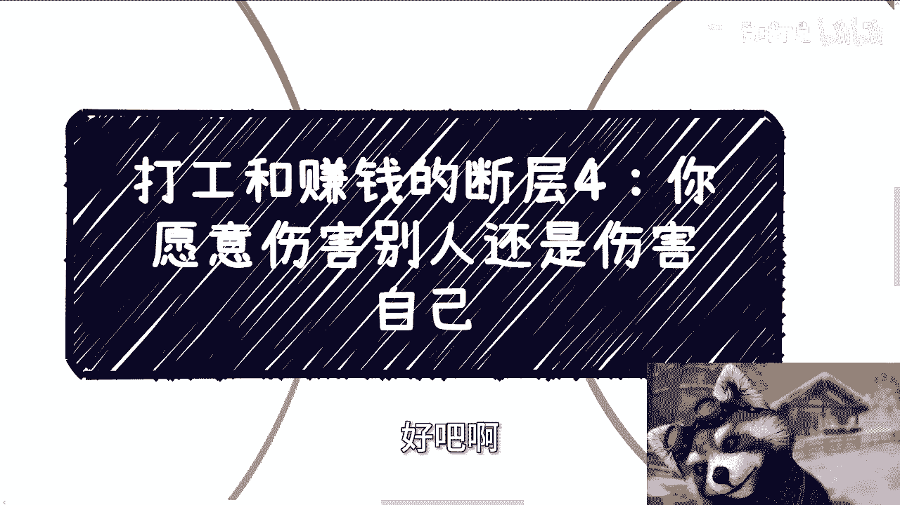

---
**注**：如需在职业规划、商业策略、股权设计等方面获得更贴近社会现实的分析与建议，可整理具体问题后进行咨询。