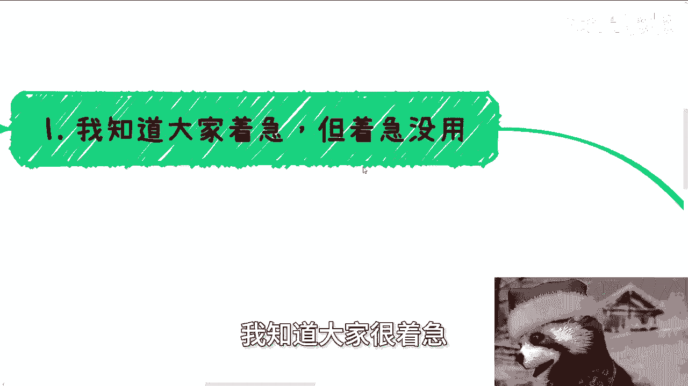
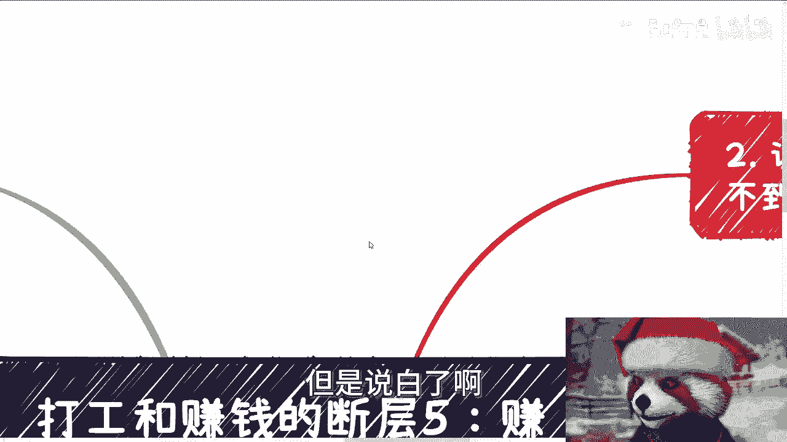
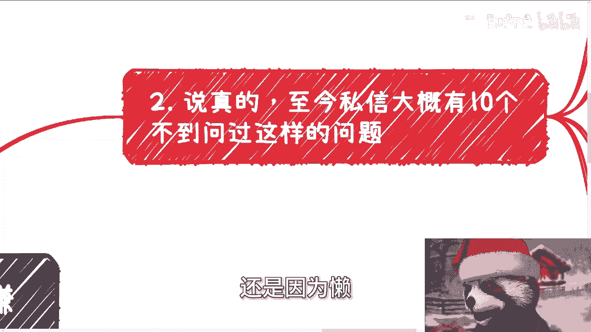
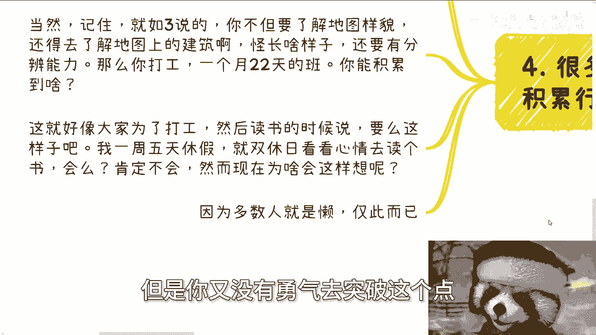

# 打工与赚钱的断层 第五课：赚钱所需的沉淀与积累远超打工 🏗️

在本节课中，我们将深入探讨一个核心观点：赚钱所需的沉淀与积累，其深度和广度远超打工。我们将分析为何人们对此存在误解，并梳理出清晰的学习路径。

---

## 概述：理解“难”的本质

许多人从字面上理解“赚钱需要更多沉淀”，但对其背后的深层含义并不清晰。首先，必须认识到：在2024年，任何领域都不容易。自主赚钱是所有路径中最具挑战性的一项。

相比之下，读书和打工是大多数人经历过且相对“容易”的路径。人们为打工准备了十几年，却误以为赚钱的积累可以在一两年、甚至一两个月内完成。这种认知偏差从何而来？

---

## 第一点：急躁与“懒”是主要障碍

我知道大家很着急，但着急没有用。最近沟通中有一个普遍现象：大家都觉得现在很难，赚钱、积累、社交都很难。

但请思考两个问题：
1.  到了2024年，有什么事情是容易的？无论是否在你的专业领域，比如电子工程、土木建筑，每个行业都难。**自主赚钱，自然是所有逻辑中最难的**。
2.  大家觉得容易的是什么？回顾对我们有影响的事情，最容易的是**读书**，其次是**打工**。

打工真的有很高门槛吗？其实没有。觉得门槛高，往往是因为与自身预期不符。那么问题来了：你们为打工准备了多少年？从几岁就开始为此铺垫？

既然都觉得打工难，为什么会错误地认为赚钱这件事，可以在一两年、三四年，甚至一两个月、一两次尝试中就完成沉淀和积累？这种误解从何而来？

我认为部分人其实明白，但觉得时间紧迫，无法像以前读书那样去积累。但说穿了，很多人为自己找借口的核心原因还是：**因为懒**。

---

## 第二点：关于“读书”的辩证思考

至今，有不到十个人私信问我：要不要读书或读大学？

放在以前，这没有争议，肯定要读。但现在，我很难回答。对我们这些已经浪费了时间的人来说，不希望别人再浪费时间。我们的时间回不去了，但他们还有未来。

我难以给出结论的原因是：
*   如果说“读吧”，怕他们又走我们的老路，浪费时间。
*   如果说“不读吧”，在当下环境、家庭和中学教育的灌输下，又怕他们更浪费时间。因为他们年龄还小，无法理解“不读”二字背后的含义。

有人会说可以解释。但仔细想想，跟18岁到40岁的人都解释不通，跟更年轻的人又如何解释得通？

其实，读不读大学，真的看自己的决心和驱动力。不读无所谓，但如果你没有正确利用这四年去积累——即**你不知道应该积累什么**——那还不如去读。

---

## 第三点：社会是一张需要探索的“黑暗地图”

核心在于，在社会上的积累和沉淀之所以难，是因为大部分人在大学毕业时，对于“社会”这张地图的探知是**0%**。

探索社会地图，你至少需要知道地图上有什么建筑、资源、野怪。对大部分人而言，社会地图是全黑的。他们知道要“沉淀和积累”，但**积累什么东西？不知道**。因为地图是黑的。

所以他们讲出来的话都是模棱两可的：“要积累关系”——什么关系？不知道。“要积累资源”——什么资源？不知道。提到甲方乙方，具体是什么？也不知道。

地图上有友好的生物，也有危险的生物。我可以描述一些危险生物的特征（如画饼、PUA），但它们都披着人皮，你如何分辨？唯一的学习过程就是：**不停地去实践**。

你需要与友好的NPC沟通，通过完成不同的任务来了解地图的运作逻辑与规则，然后才“可能”赚钱——注意，只是“可能”，因为这没有绝对的因果关系。

这需要多久？这就好像大家在读书之前，甚至不知道有“读书”这条路，需要长时间摸索才明白。这么做难吗？难。那我们所有人不都是这么过来的吗？

我说读书相对容易，是因为对大部分人（非天才）而言，读书是“死”的东西。你知道做哪些事会得到什么结果，问题只在于你有没有能力做到。但在社会上，**你连“应该做什么”都不知道**，一切都是宏观和模糊的概念。

---

## 第四点：破除“既要又要”的幻想

很多人问我：一边打工一边积累，行不行？

行。在我看来都行。说难听点，这本来就是一件小概率的、为自己拼搏的事。很多人不愿冒风险，又想积累，这种“既要又要”的心态，你问我行不行，我能说什么？我说不行，你听吗？你不会听。所以我只能说行。

但记住，正如第三点所说，你不仅要了解地图样貌，还要了解建筑、每种怪物的特性，并培养自己的分辨能力。那么想想看，打工一个月上22天班，你能积累到什么？

类比一下：你们为了打工，需要会读书。那么，你有没有可能从大一开始，就一周休假五天，双休日看心情才读点书？你不会。那你为什么现在（对于赚钱）这么想？

原因就是：**因为你懒，以及你是被PUA出来的**。你认为读书和打工是人生唯一的出路，但不好意思，并不是。只是你没有勇气去突破这一点。

---

## 总结与行动指南

本节课我们一起剖析了赚钱需要远超打工的沉淀与积累。关键点在于：
1.  认清“万事皆难”，自主赚钱最难，需破除急于求成的幻想。
2.  理解“懒”是深层障碍，真正的积累无法速成。
3.  关于教育路径，选择取决于你能否利用时间进行**有效积累**，而非形式。
4.  将社会视为一张**黑暗地图**，积累的前提是主动探索、实践与试错，明确 `积累对象 = 探索(社会地图)`。
5.  摒弃“一边打工一边轻松积累”的幻想，这如同 `学习效果 = 时间 × 专注度`，极低的时间与专注度无法带来质变。

人活着，就要不停突破，了解社会与本质，而非循规蹈矩。不要用“先活下去”自我设限。人终有一死，也终会变老，是探索有价值，还是像僵尸一样循规蹈矩有价值？想明白这一点，就能停止自我PUA。“既要又要”最终只会原地打转。

---

**职业规划、商业规划、股权设计、商业计划书、合同审阅，或梳理自身资源与短板**，若你希望结合我的视角与认知，获得更贴近社会发展的具体建议，可以整理好问题进一步沟通。