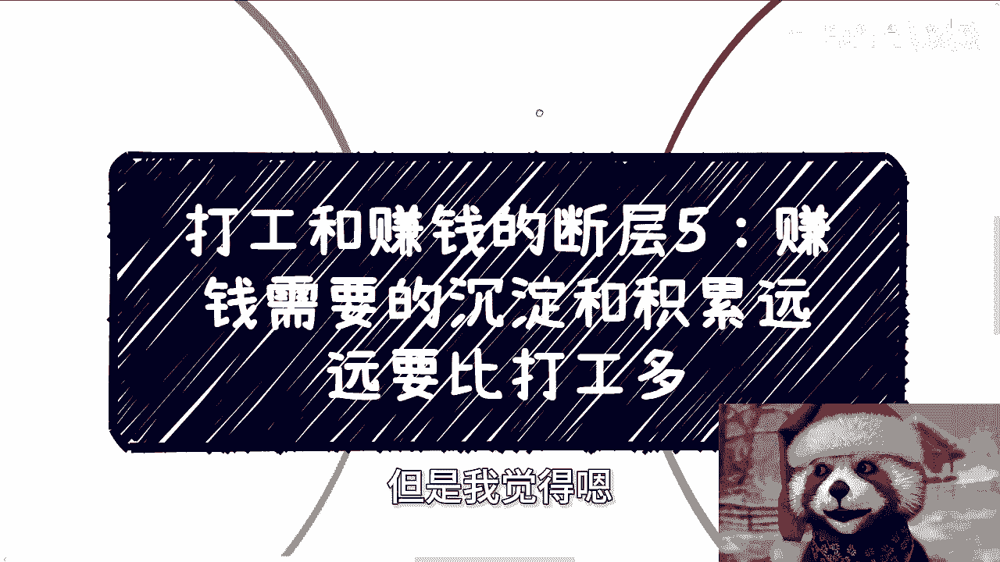
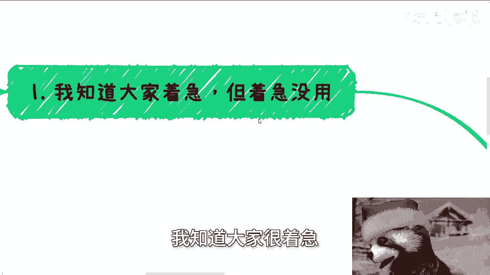
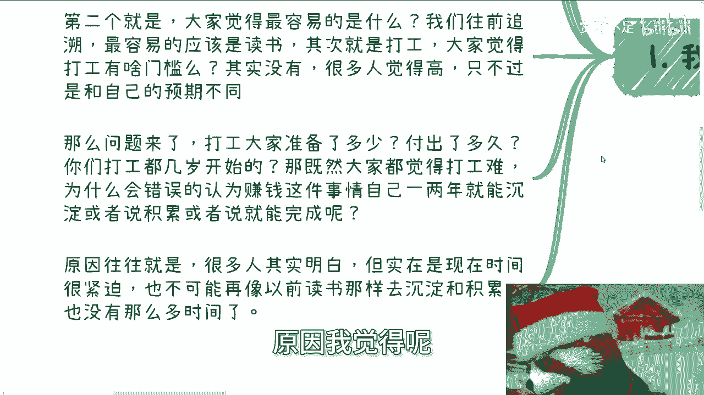
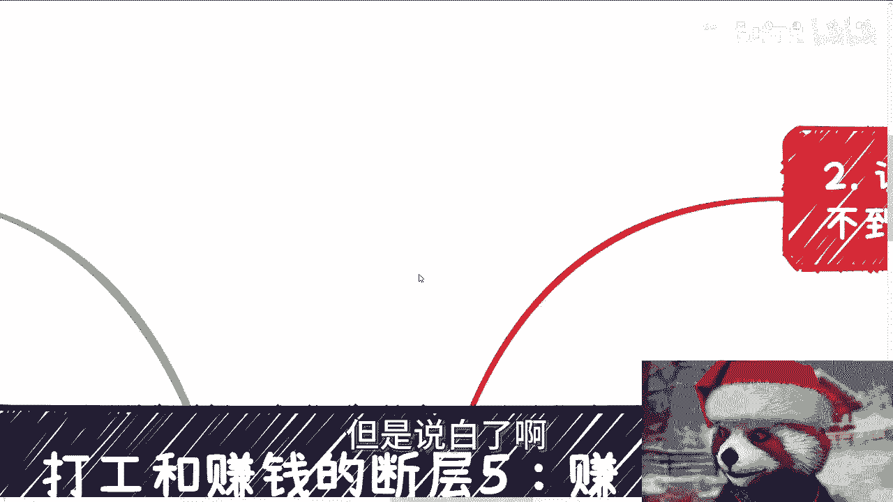
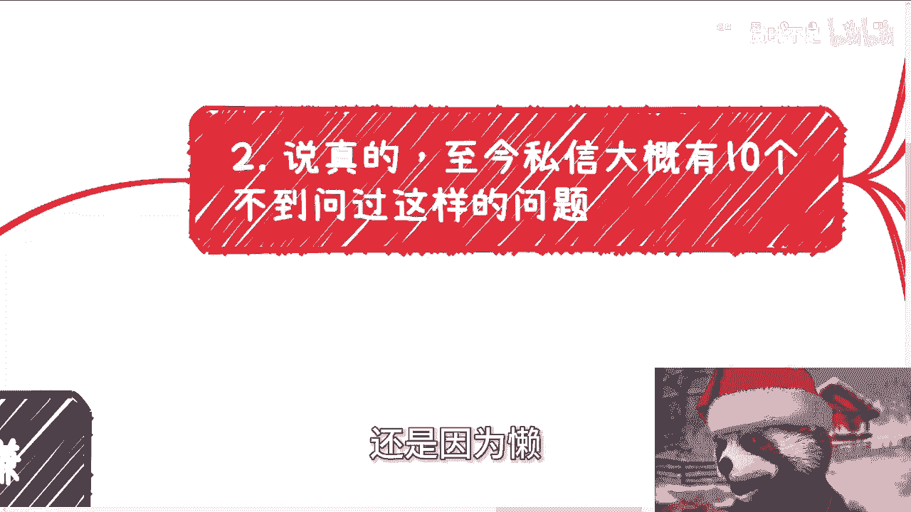
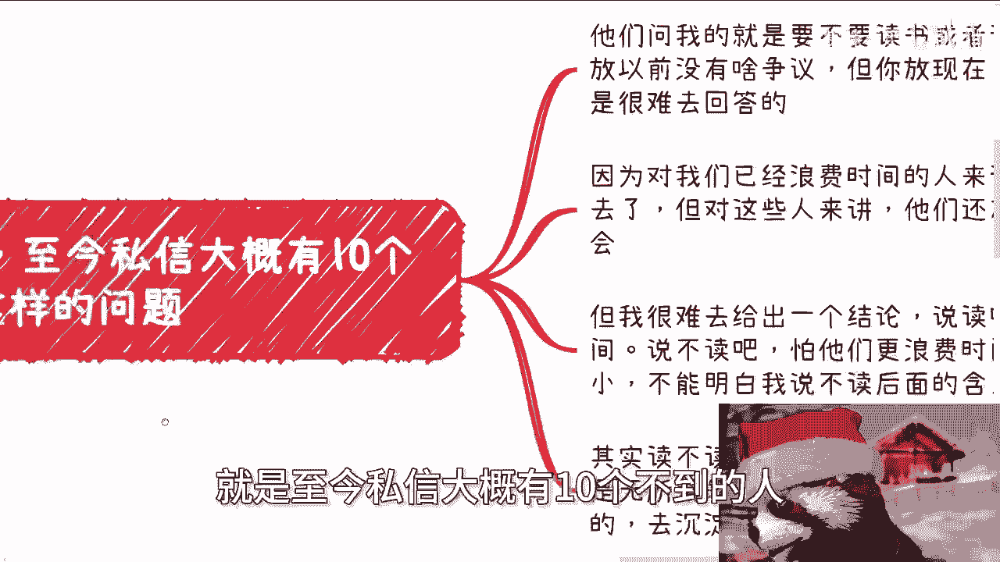
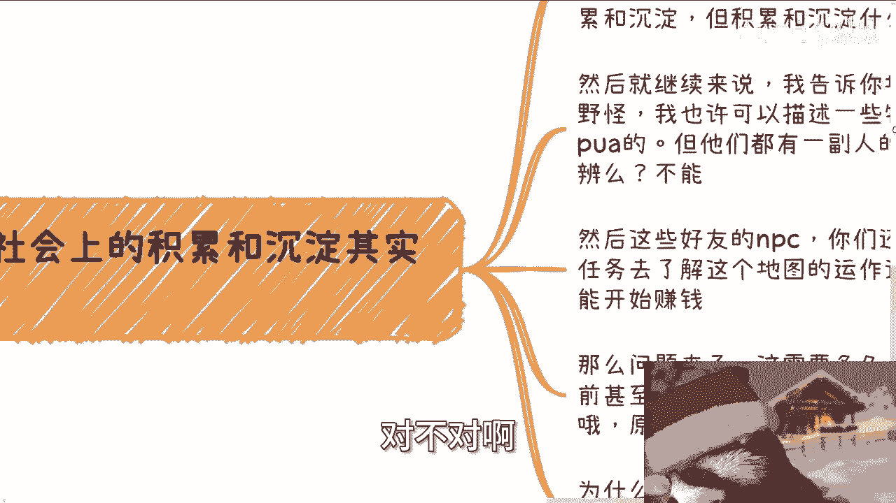
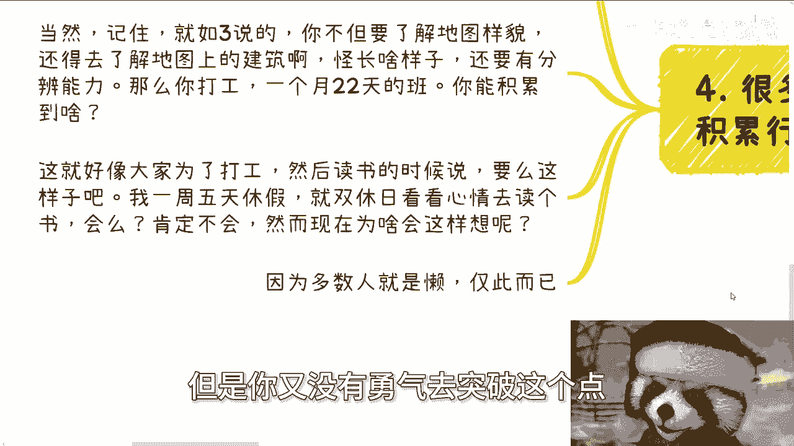
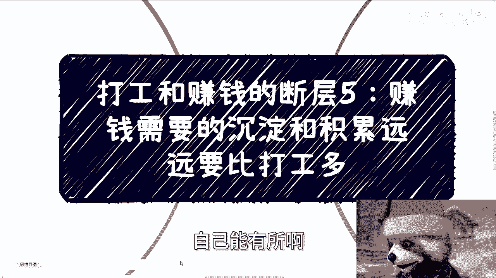

# 打工和赚钱的断层5：赚钱需要的沉淀和积累远远要比打工多 - P1 - 赏味不足 - BV11z421a7AE

好我们今天继续来讲呃，这个打工跟赚钱的断层舞啊，这个赚钱需要的沉淀跟积累啊，远远要比打工多啊，那这句话也许你们能了解，但是我觉得嗯怎么说呢。

就是字面上能了解，但是我觉得这个背后的意思可能啊，很多人也不是很清楚啊，呃首先第一点啊，我知道大家很着急。

但着急没有用，为什么，因为你看哦最近沟通下来就有个很有趣的对话，就是大家呢都会觉得啊现在很难对吧，貌似赚钱很难去积累，很难很难对吧，去去社交很难去，怎么样很难啊，但问题是你们仔细想想看两个问题啊。

第一个就是说都到2024年了，什么东西不难对吧，你你你你甭管是不是你所在领域，比如说有些人跟我说，他电子工程啊，电气对吧，然后建土木对吧，怎么样，我说你们不要说自己行业难，因为大家都难对吧。

你何况所有的里面自主赚钱，自然是所有逻辑当中最难的，那第二个呢就大家觉得容易的是什么，你们想想看，我跟你们说啊，我们往前追溯啊，真的对我们来讲有怎么说呢，就是说有有有影响啊。

有影响的事情里面最容易的应该是什么，就是读书啊，其次是打工，那么大家觉得打工有啥门槛呢，其实我跟你讲没有，因为很多人觉得门槛很高，你觉得门槛高，只不过是因为跟自己的预期不一样，对吧好，那么问题来了。

打工大家准备了多少时间，付出了多少时间，你们打工从几岁开始，你们想想看对吧，那既然大家都觉得打工很难，那为什么会错误的认为赚钱这件事情，好像自己什么一两年34年，甚至有人什么觉得一两个月。

一两次就能沉淀或积累啊，这种误误误，就是误解或者错误的认知怎么来的呢，我就不明白了对吧，那往往原因是什么原因。

我觉得呢可能一部分人其实明白，但实在是现在这个时间很紧迫，也不可能再像以前读书那样去积累跟沉淀啊，也没有那么多时间，但是说白了啊。

很多人呃为自己找借口的核心原因还是什么，还是因为懒啊，还是因为懒。

那么第二啊，说真的啊，就是至今私信大概有十个不到的人。

问过我这么一个问题，他们问我要不要读书或者要不要读大学，这话啊其实放以前我觉得没啥争议，为什么，因为你肯定要赌啊，又有什么好好问的呢，对不对啊，但你放现在我说真的，我内心是很难去回答的，为什么。

因为你对我们来讲，我们已经是浪费时间的人，你从我来讲，我就不希望别人再去浪费时间，那我们的时间已经回不去了，但是对那些人来讲，他们还有未来还有机会对吧，但我呢我很难给出结论，为什么，因为我说读吧。

怕他们又浪费时间啊，就是读了，那肯定就是我走我们老路嘛对吧，但是你说不读吧，你说他们在这种环境，在这种家庭对吧，在这种高就是初中高中对吧，这种地方他妈的呃灌输的这个思想，你我就怕他们更浪费时间。

因为他们的年龄还小，他们不能明白我说不读的这两个字，背后的这个含义是什么，那当然有人要说了，他说陈老师你可以跟他们解释，大哥你仔细想想看，你跟他们解释解释的通吗，啊我说不好听点。

我跟这么多18岁到35岁，40岁的人都解释不通，跟他们解释怎么解释啊，啊你你倒跟我说看对吧啊，我觉得其实读不读啊，真的是看自己的决心跟驱动力，你不读是无所谓的，说真的无所谓。

但如果你没有正确的利用这4年去积累，也就是说你不知道去积累应该积累的。

你不知道去沉淀应该沉淀的，那还不如去读，对不对啊。

那么第三就我们说核心的，就是你在社会上的积累和沉淀很难，为什么你仔细想想看啊，大部分人在出这个高校，就是大学毕业的时候，对于整个社会这张地图的探知就是0%哦，我可以毫不客气的说，就0%啊。

那么你比如说今天你要探索这张地图，你至少先要知道这张地图上面大概有什么建筑，什么资源，什么野怪对吧，对于大部分人来讲，社会这张地图就是全黑的呃，就是对于他们来讲，他们都知道沉淀跟积累。

但是沉淀跟积累什么东西他不知道，因为这张地图是黑的，他知道个P对吧，所以说他讲出来的话都是模棱两可的啊，就是说我们要积累关系呢，什么关系呢，不知道你说我要积累资源，什么资源呢，也不知道对吧。

你在他他再说啊，甲甲方乙方，那什么甲方乙方资源，那到底干嘛的呢，他不知道为什么，因为他不知道里面有哪些东西，你让他怎么说呢对吧，然后我们就继续来说，我告诉你地地图上有好的生物，也有快的生物。

我也许可以描述一些特征，比如说画饼啊，PUA啊，但是他们都有一副人的皮囊，你怎么分辨呢，你根本就不知道怎么分辨，你唯一要学习分辨的一个过程是什么，就是不停的去实践对吧，然后这些友好的APC呃。

NPC你们还是要沟通，通过不同的任务去了解这个地图上的运作逻，辑跟规则，然后才有可能赚钱啊，记住这个时候还是可能因为他没有因果关系啊，那么问题来了，这需要多久，这就好像大家在读书的之前。

甚至都不知道要读书啊，然后开始慢慢摸索，摸索了很长时间才知道哦，原来有读书这条路，那我问你如果这么做的话难吗，难啊对吧，那你们现在所有人包括我一路走过来，所有人不都面临这个问题吗。

那为什么我说读书都容易啊，因为对于大部分人来讲啊，只要不是得诺贝尔奖的，只要不是那种纯天才，对于大部分人来讲，读书是不用动脑子的，或者说读书相对你之后做打工，读书相对你后面到社会上赚钱。

他都是死的东西啊，因为你知道做哪些事情能得出什么结果对吧，只不过你有没有这个能力而已，但是问题是你到了社会上之后，你知道做什么吗，你不知道，你知道全部都是模棱两可的啊，全部都是宏观概念，那么第四啊。

就有很多人跟我说，他说一边打工一边出去积累，行不行行啊，我跟你讲，在我看来没啥不行的都行啊，说难听点，本来就是一个很小概率的事情，本来就是一个大家为了自己去拼搏的事情，然后很多人不愿意冒风险。

又想积累这种既要又要你问我行不行，我能说啥，那我能说啥呢，我说不行，你你听吗，你不听你呀，对不对，那我只能说行了，我能说什么啊，当然记住啊，就如三说的，你不但要了解地图的样貌，你还得去了解地图上的建筑。

你还得了解每种怪长什么样子，或者还说每种怪身上有什么特性，还要用让自己有分辨能力，那么你想想看，打工一个月22天的班，你能积累到个屁对吧，我换而言之啊，就像你们为了打工，你们要会读书嘛，对不对好。

那么我就这么跟你讲，你有没有我就这么跟你讲啊，你有没有可能比如说在大一开始一周五天休假，然后双休日说哎我看看心情啊，去读个书啊会吗，我问你会吗，你肯定不会啊，对不对，那然而你为什么现在这么想啊。

我告诉你为什么这么想，就是因为你懒，以及你是被PUA出来的，为什么，因为你认为读书跟打工吃是你人生唯一的出路，但不好意思，并不是对吧，但是你又没有勇气去突破这个点。

那无非就这样子呀，还能说什么呢，对不对，那当然啊。

我觉得人活着对吧，就是要不停的去突破，不停的要去了解这个社会，不停的要去了解本质，而不是说循规蹈矩走一条路啊，你不要，其实我说实话，你不要来跟我讲说，你是你你你你说要先活下去，要先怎么样子，我是我。

还是那句话，人终有一死，人也终会变老，对不对，那你觉得是你探索有价值，还是一路循规蹈矩的，像一个僵尸一样往后走有价值呢，对不对，真的有时候我觉得就是想明白一点啊，就就你就能明白，不要自己PUA。

自己也不要就是说既要又要没有用的，你最终不还是就是原地打转啊，行好吧，就这么着啊，嗯然后职业规划商业规划啊，然后分红啊，分啊，分红啊，丰润啊，商业计划书啊啊合同啊啊，包括就是说你们手上有什么牌。

你们手上没有什么牌啊，你们希望通过沟跟我的沟通，自己能有所啊。

这个有也能有所，就是思考，或者说希望通过我的视角或者视野，或者说啊认知，能够给能够结合你们当下的手上的一些情况啊，给你们更贴近于这个社会发展的一些建议的话，那么你们可以啊再整理好问题。

