# 打工和赚钱的断层6-打工永远盯着短期利益-赚钱则要明白轻重缓急---P1---赏味不足---BV1K

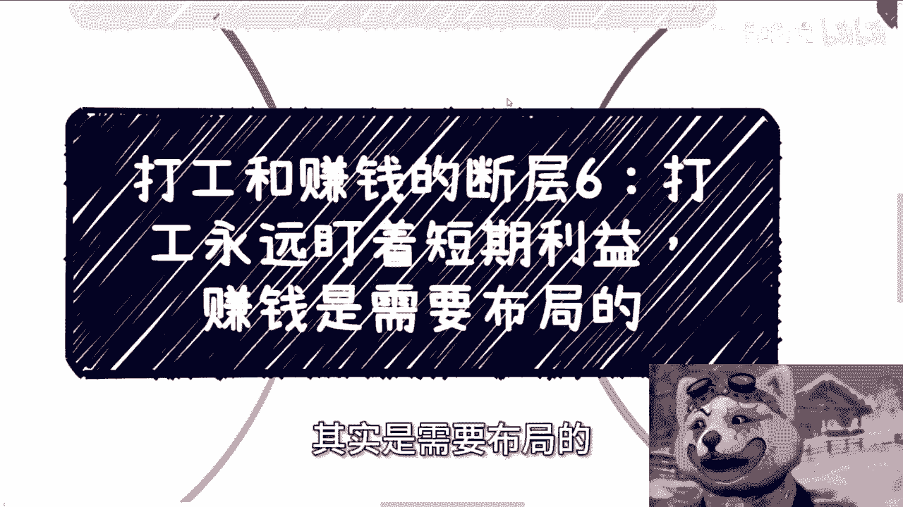

在本节课中，我们将探讨打工思维与赚钱思维的核心断层之一：对短期利益的执着与对长远布局的忽视。我们将分析短视思维的表现、危害，并学习如何建立分清轻重缓急、进行有效积累的格局。

---

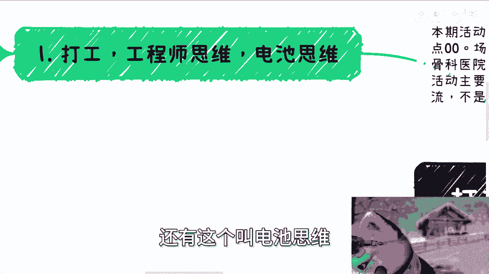

## 概述：短视思维的根源与表现

打工思维、工程师思维或电池思维的根本问题在于**短视**。这种短视会衍生出多种行为模式，阻碍个人的长期发展。

以下是短视思维常见的几种表现：

*   **只关注眼前**：对当前的问题或机遇感到焦虑或纠结，但不会考虑未来的发展趋势。
*   **无法分清主次**：难以判断事情的轻重缓急，不知道何时应该抓住，何时应该为了未来更大的机会而放弃。
*   **滋生“白嫖”心态**：容易成为伸手党，总想占便宜，一旦无法得逞反而会抱怨他人。
*   **情绪难以自控**：因为视野狭窄，容易将小事放大，感到烦躁或认为大难临头，缺乏担当和耐心。

从社会运作规律看，多数打工人经过长期的服从性训练，其角色并不要求格局和情绪管理。如同可更换的**电池**，个体的情绪波动不影响系统运行。但这正是我们需要突破的思维局限。

---

## 第一节：为何必须“向上社交” 👥

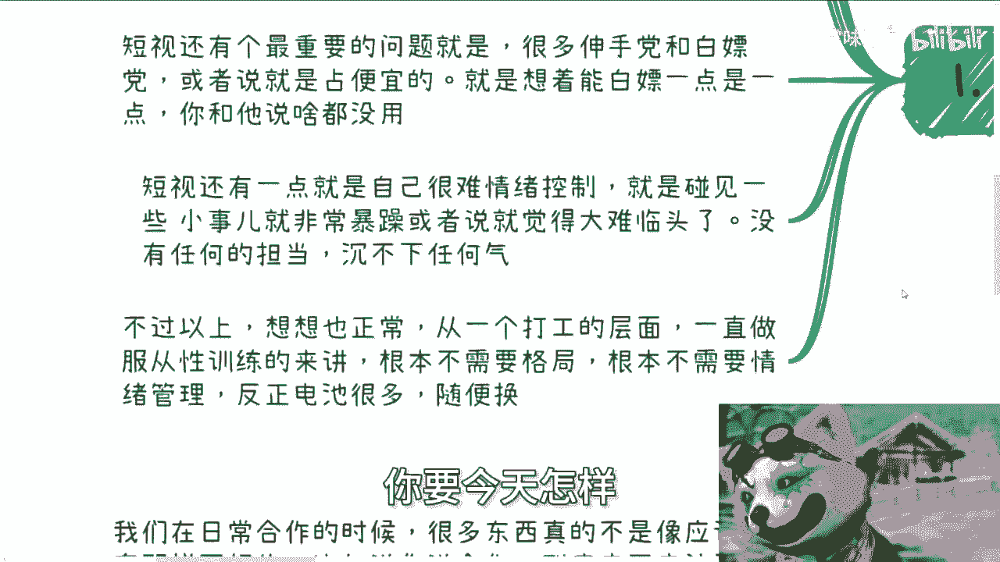

上一节我们分析了短视的危害，本节我们来看看如何破局。一个关键方法是进行“向上社交”。

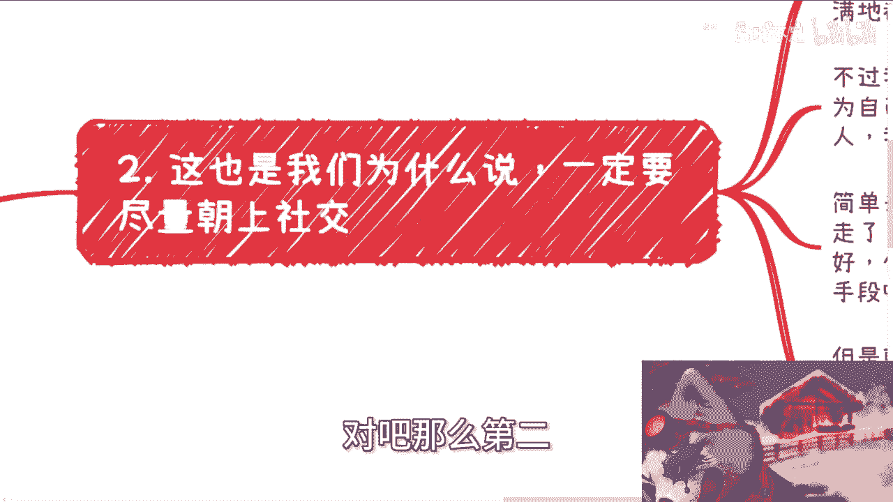

很多人开始独立社交或做事时，会陷入自我怀疑，觉得周围都是骗子，或怀疑自己交友不慎、层次太低。实际上，这通常不是个人问题。

我们的圈层决定了社交对象和信息获取方式，这是一个难以轻易打破的循环。因此，不要陷入自我怀疑，唯一的方法是主动“向上蹭”。

**即使向上社交可能遇到坑骗，其价值也远大于在底层徘徊**。原因在于：
*   **高级战争**：在更高层次的交往中，你能接触到更复杂的商业手段、政治博弈和项目运作，这些都是值得学习的高级“战争”。
*   **低效消耗**：在底层社交，你同样会吃亏、被坑、浪费时间和金钱，但留下的只有恶心，而**没有任何实质性的成长**。

只有亲身实践，才能深刻体会向上社交的必要性。

---

## 第二节：快钱也需要布局 💡

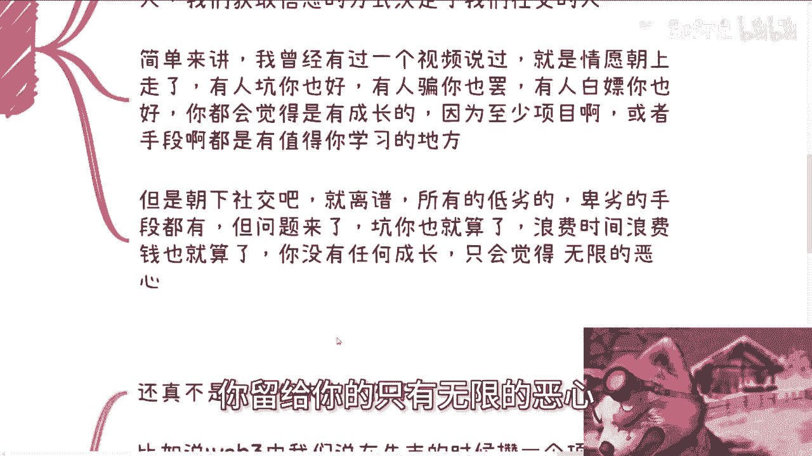

有人可能会问：赚快钱是不是就不需要布局了？我们以Web3牛市攒项目为例来分析。

攒一个项目听起来简单：找开发团队、交易所、海外营销运营团队、资金盘。但核心问题是：**你去哪里找这些资源？**

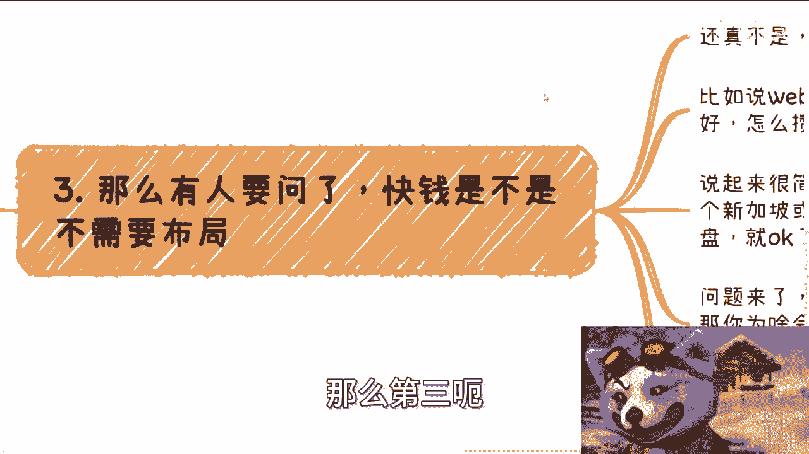

答案在于**平时的积累**。你之所以会积累，是因为：
1.  你拥有强烈的赚钱欲望和自驱力。
2.  你懂得进行**长线发展**，而非满足于打工和休息。

因此，天时、地利、人和乃至运气，都建立在个人努力与积累之上。这里的努力不是无意义的吃苦，而是**有策略地提升自己和积累资源**。

如果每天下班后只剩疲惫，没有精力进行任何积累和规划，那么谈论机遇和运气就毫无意义。

---

## 第三节：掌握轻重缓急的艺术 ⚖️

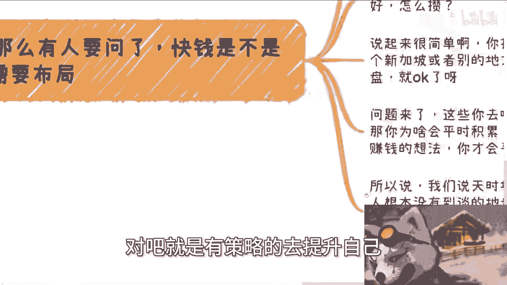

在真实的社会合作中，事情不像应试教育有标准答案。分清轻重缓急至关重要。

例如，合作中是否收费、收多少，并没有固定答案。这需要根据具体情况判断。

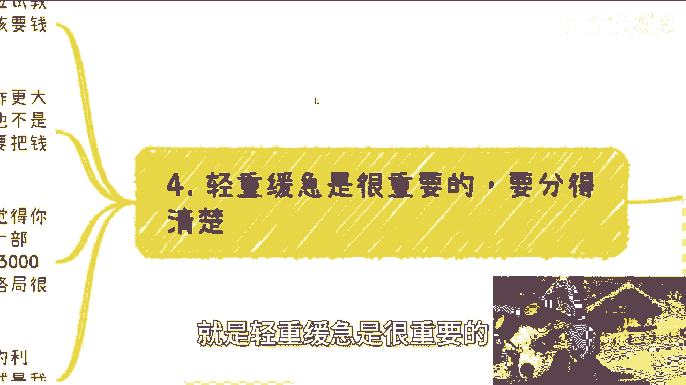

假设你的目标是未来更大的合作项目，那么本次合作可能不应该收费。但“不收费”不等于直接说“我不要钱”，这可能会让你被视为软柿子。

更优的策略是：
1.  **争取你应得的部分**（例如3000元）。
2.  **再将这笔钱以另一种形式回馈给对方**（例如购买礼物、宴请对方）。

公式可以概括为：**`收取应得报酬 -> 战略性回馈 -> 建立信任与格局`**。

这样对方会认为你既有原则，又有格局，值得长期合作。许多短视的人会陷入二极管思维，要么全要，要么全不要，甚至用卑劣手段坑钱，这完全是打工人思维，难以成就大事。

---

## 第四节：现实社交的挑战 🚧

一旦你开始实践积累和社交，会发现现实中充满了思维极端、难以沟通的人。与他们讲道理通常是徒劳的，因为他们的三观和处事方式已经扭曲。

这正是当下社会的现实：找到一个思维正常、能顺畅合作的伙伴并不容易。理解这一点，能让你更平和地面对社交中的挫折，并更坚定地筛选和寻找优质的合作伙伴。

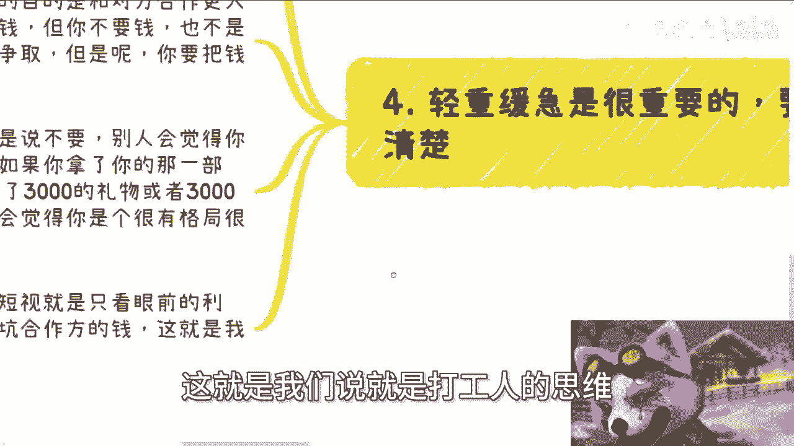

---

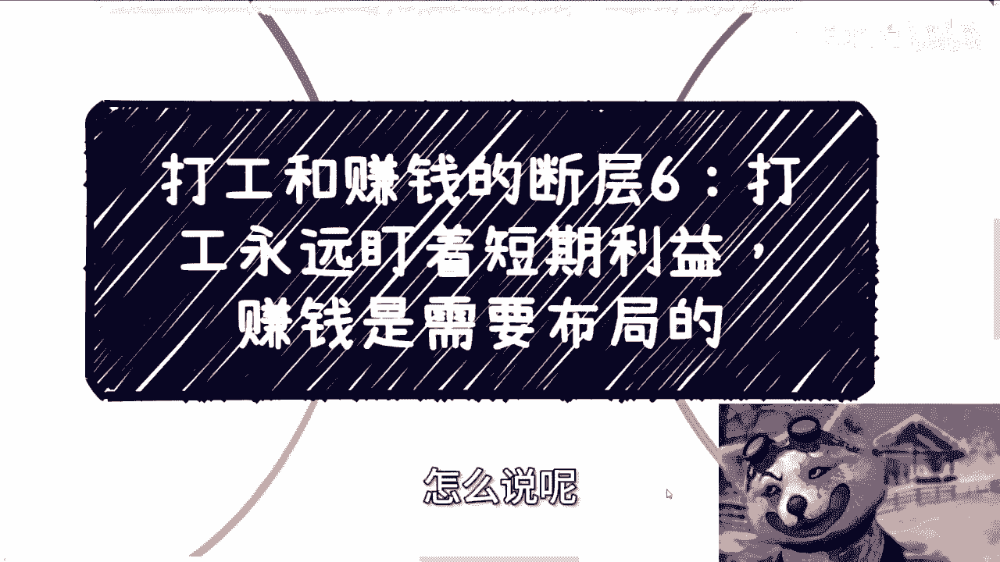

## 总结与行动指南 📝

本节课我们一起学习了打工思维与赚钱思维在时间维度上的核心差异。

**核心总结如下：**
1.  **识别短视**：警惕只盯眼前利益、不分轻重、情绪化、爱占便宜的心态。
2.  **坚决向上**：主动进行向上社交，即使有风险，其学习价值也远高于底层无效消耗。
3.  **布局积累**：任何机会（包括快钱）都依赖于平时的资源积累，这源于你的欲望和长线思维。
4.  **分清缓急**：在合作中灵活运用策略，通过 `收取->回馈` 的方式展现格局，建立长期信任。
5.  **直面现实**：理解现实社交的复杂性，对他人保持合理预期，重点筛选优质伙伴。

要跨越断层，就必须用**长远的眼光**替代短视，用**有策略的积累**替代即时满足，用**分清主次的智慧**替代非黑即白的判断。

---

**附：成都活动通知**
*   时间：6月16日 下午1:30 - 6:00
*   地点：青羊区省骨科医院附近
*   详情咨询请私信。

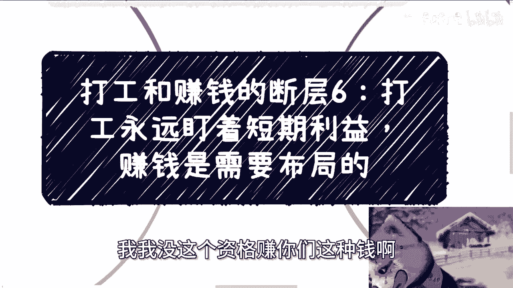

**咨询服务说明**
提供职业规划、商业规划、合同、股权、分红、商业计划书、白皮书等相关咨询。请先整理好个人背景与具体问题再私信预约。请注意，咨询旨在提供分析与思路，无法保证直接带来财富结果，抱有此类瞬时成功幻想者请勿联系。