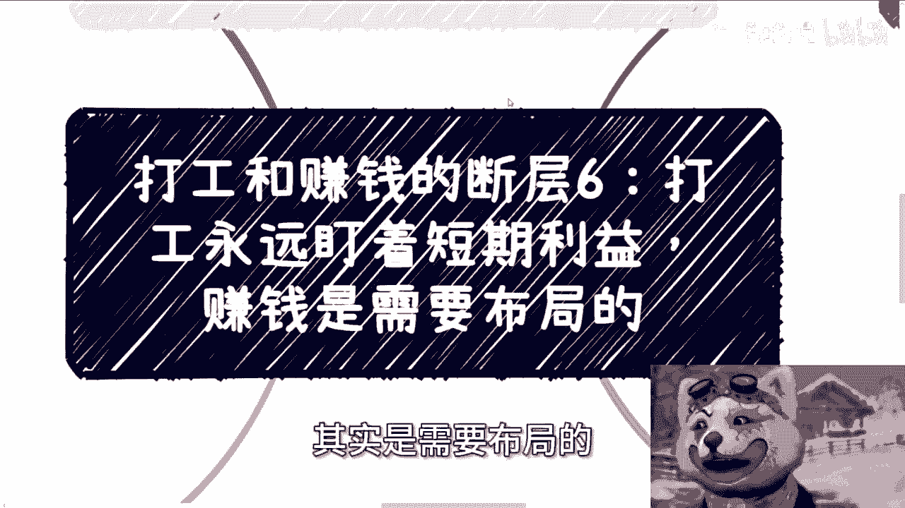
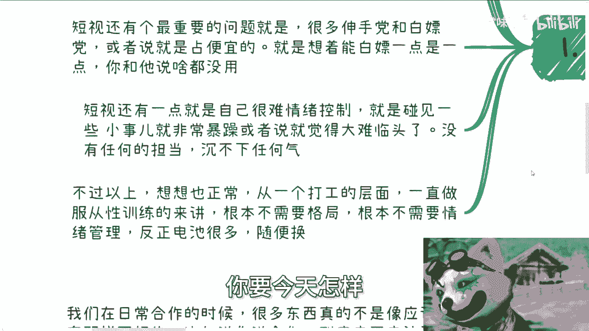
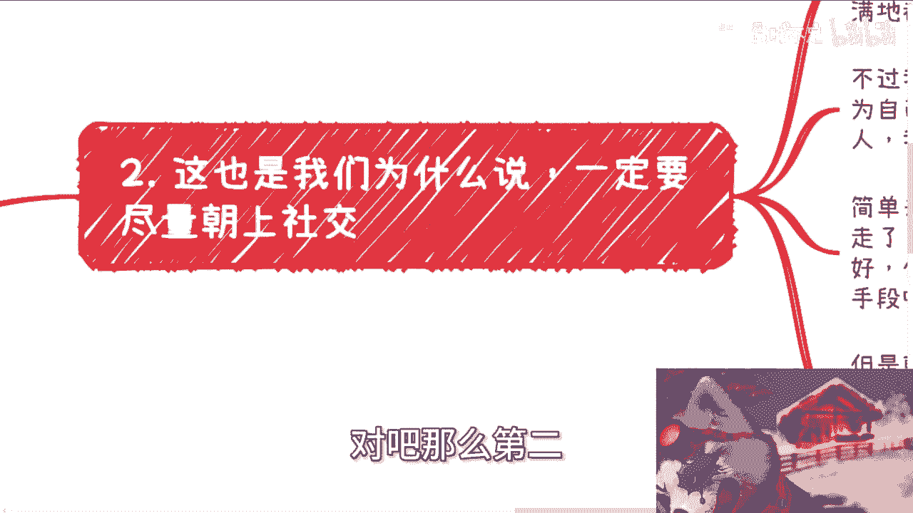

# 打工和赚钱的断层6：打工永远盯着短期利益，赚钱则要明白轻重缓急 - P1 - 赏味不足 - BV1Kr421A7fq

啊大家好，那今天我们来讲打工跟赚钱的断层六啊，呃我大概环视了一下啊，这个点也的确没有讲过，就是打工永远盯着是短期的利益啊，然后赚钱呢其实是需要布局的，或者说需要这个更大的一个格局啊。

呃首先成都活动已经定了好吧，6月16号下午01：30到六点啊，场地也经场地已经定了，在青羊区省骨科医院附近好吧，让大家报名或者了解详情的，你们可以私信我啊，然后第一个呢就是就是我们说的几个关键字。

打工啊，工程师思维，还有这个叫电池思维对吧。

那么我觉得这些呢最根本的问题呢，就是你会发现电池思维，打工思维，工程师思维最大的问题在哪，在于短视，就短视呢它会衍生出非常多的分支，你比如说只看眼前的，对眼前的问题或者机遇呃，很焦虑啊，或者说很纠结。

但不会去考虑，就是说未来的发展，或者说他不会去分得清楚，就是孰优孰劣呃，孰孰轻孰重对吧，或者说是呃轻重缓急，他分不清楚，他只能看到眼前的啊，他不知道，就是说啊我到底是抓住还是放弃，或者说我放弃是为。

是不是为了更未来更大的抓住，他不知道啊，那么短视还有个最重要的问题，就是很多伸手党，会造成非常多的伸手党和白嫖党，或者说就占便宜的啊，就是说想着呢能白嫖一点是一点，你跟他说啥都没用啊。

就是你不让他白嫖了，他还要说你啊，然后呃短视呢，还有一点就是自己很难控制情情绪，就是碰到一些小事呢就非常暴躁啊，或者说觉得大难临头，因为什么呢，就是因为他短视嘛对吧，他他没法看到。

或者没有办法去去用一些更长的时间线，更大的一些眼光去看这个问题，那么他就会觉得卧槽每件事情都他妈很烦啊，很怎么样子，然后呢他就会没有任何担当，也沉不出任何的气，不过以上啊，你要想想也正常。

因为本来我们就说，90%多的人都是普通人，90%多的人也都是打工人，那么从一个打工人的层面来讲，一般来讲啊，你说这么多年做服从性的训练，就我们上一期充电视频来讲的，就是服从性的这个训训练来讲。

他根本不需要格局，根本不需要情绪管理，反正电池多了，是你要说今天情绪暴躁，你要今天怎么样。

你给我滚，对不对，我换个电池，就是这不就是社会的运作规律吗，对吧。

那么第二，这也是我们为什么说一定要朝上社交啊，因为很多人其实一旦开始自己社交，一旦开始做事情的时候啊，你可能会深深的陷入自我怀疑，为什么，因为你真的会发现满地都是骗子跟，然后呢你就会陷入一种自我怀疑。

什么怀疑呢，就是是不是我交友不慎，是不是说我自己太low啊，是不是怎么样子，我跟你讲啊，你不用自我怀疑，因为这个大概率不是你的问题，因为我们所有的人的这个作为一个普通人，作为一个打工人。

我们所有人的圈层决定了我们社交的人，我们获取信息的方式也决定了我们社交的人，我们的圈层也决决定了我们的获取信息的方式，所以说这些东西就是死循环，你不要去怀疑，你要做的就是不停的去想办法往朝上去蹭。

你没有别的方式对吧，那简单来讲，就是说我曾经其实大概去年也蛮早的时候吧，我记得有个视频我说过，就是你情愿朝上走了吧，有人坑你也好，有人骗你也好，有人白嫖你也好，你其实是有成长的，因为为什么。

因为我们称之为那种叫什么叫做高级战争对吧，比如说有政治战争对吧，有一些商业的战争对吧，有些什么手段，就包括就是说项目也好，包括一些手段也好，其实值得你学习的，但是你老是在底层啊，一直在那边游荡。

或者说社交或者是做事情，我跟你讲就很离谱，因为你会碰见非所有的事情都会碰到，比比如说很多低劣的啊卑劣的手段，但是问题来了，你可以吃亏，你可以被坑，你可以浪费时间，你也可以被坑钱。

但是你会发现你没有任何成长，你留给你的只有无限的恶心。

这就是最大的问题啊，我跟你们讲，你们只要不出来折腾，你们不会对我说的这个话感同身受的，但是但凡出来折腾，真的卧槽就要多正确有多正确，因为每个人都要走这条路啊，那么第三呃。

有人就要问了，快钱是不是不需要布局啊，我跟你讲啊，我们来举个例子，你比如说web3当中啊，我们说牛市的时候攒一个项目对吧啊，攒一个项目，比如说来集资啊对吧，来来来，比如说赚钱啊，来怎么样子啊。

好那我就问你怎么攒，说起来很简单，你找个开发团队，找个交易所，找个新加坡或者别的地方的营销团队，运营团队找，再找个资金盘，OK了都OK啊，那么问题来了，问题来了，你去哪找呢，你找这些东西不得平时积累啊。

你不得把关系积累下来啊对吧，那么你为什么会平时积累，你为什么不是说平时就在那边做做就打工人，然后双休日出去玩玩对吧，然后每天回到家就跟自己说，哎呀好累啊，我今天就不不要不要再做了，怎么样子。

你为什么会积累，一定是因为你有赚钱的欲望，一定是因为你有自驱力，一定是因为你是一个懂得长线去发展的人，你才会去发展啊，才会去积累，所以说我们说天时地利，人和我们说的运气，很多人他没有到谈这个东西的地步。

因为他自己根本没有努力，也没有积累，当然啊我这边要提一点，不是李佳琦说的那种努力对吧，我说的努力不是说你们要吃苦，吃苦是没有用的啊，你要有策略的去努力对吧，就是有策略的去提升自己。

有策略的去积累，这个才是有未来的对吧，你否则你你你跟我说，爱川说我每天这个打工很累啊，我这个到了家对吧，可能90点了啊，我我我就一摊对吧，一摊摊到个10。12点了对吧，那那你跟我讲啥呢，你还说啥呢对吧。

那么第四点是什么，就是轻重缓急是很重要的。

你得分得清楚，你得有这个意识，你知道吗，就是我们在日常合作当中啊，很多的东西真的不像应试教育那么死板了，我给你们举个例子，比如说你合作，你今天一个合作到底要不要钱呢，要多少呢，这没有一个固定答案的。

你比如说很多人就问我，他说我们跟协会去合作，我们跟企业去合作，我们跟别人去合作，要不要钱要多少，你我跟你们讲，你们要明白，哪怕这个问题你里面有很多的分支，所以我才会跟你们讲，不是应试教育。

你们所有的问题都得一个一个案例来讲，你通用来讲，我跟你们讲好，要钱对吗，也不一定对对吧，你就像我们以前说，如果你的目的跟对方合作，你的目的是跟对方合作未来更大的项目，那么你就不应该要钱，但是你不要钱呢。

也不是说自己不要，你懂吗，你不要很直白的，就我不要哦，而是说你争取应该争取的，但是呢你又要把钱还给别人，什么意思，这就是你的格局，因为你要是说不要，别人就会觉得你是个，你是个软柿子，你懂吗。

但如果你拿了你那部分的钱，比如说你拿了3000，然后你可以反过来拿这3000去买礼物，或者拿这3000去请别人吃个饭，或者说去是去买更贵的，那对方就会觉得你是个很有格局，很聪明。

能够孺子可教也的这么一个人，你明白这个道理吗，哦不是说我们一根肠子，我跟你讲说啊，你不要钱好，我要超市说不要钱，我们就免费，你懂，不是这样子的，但是你我就这么跟你们讲，我跟你们讲的这些东西啊。

这我跟你们说，你们虽然看的是同一个视频，但是1000个人里面有1000个哈姆雷特对吧，你我跟你们讲，我我我虽然不能说1000个人啊，呃但是就是说你你你会发现很多人他听不懂，我讲的东西，你懂吗。

就是很多短视的，他看到你这个东西就是二极管哦，陈老师说不要钱啊，上来就不要钱，还他妈我他妈什么时候这么说过啊对吧，你甚至可能他会用更卑劣的手段，去坑合作方的钱对吧，这就是我们说就是打工人的思维。

或者说哎就是我们说的那种这种这种怎么说呢，就是我们说可怜之人必有可恨之处的。

那些人的钱啊，那些人的这种做事方式，就是我跟你们讲，你们一旦出来社交，一旦出来积累之后，你会发现满地都是这样的人，真的你你跟你到时候你就会发现，你跟别人去讲讲不通的，你跟身边朋友说。

他们也不理解你为什么，因为他们都没接触过，但是真的就是满地都是这样的人啊，就是我们为什么说当下这个社会，你要你要碰到一个正常人很难，就是因为往往这些人都是一些，就是说啊精神扭曲的，或者说就是三观扭曲的。

或者说就是某些就做事情很极端的人，你怎么沟通，你告诉我啊，好吧行，那我们这个就说到这儿啊，嗯成都啊，成都6月16号报名，好像继续报啊，咨询呃，不是咨询啊，那个详情的话，你们也可以私信我啊。

然后呃职业规划商业规划啊，合同啊，股权啊，丰润啊，商业计划书啊，白皮书啊啊包括你们的这个职业规划，商业规划啊，你们自己有什么牌，你们可以整理好背景，整理好叫什么，就是个人的问题好吧，然后再私信我。

我们再来走走这个咨询啊，当然啊就是如果想通过这种一个小时对吧，甚至更短的这种时间的这种咨询啊，说啊咨询完了我就要赚到钱啊，咨询完了我就一定要飞黄腾达，或者怎么样子的啊，你们去找别人，不要找我啊。

你们想把这个钱送给谁，送给谁啊，不要给我啊。

