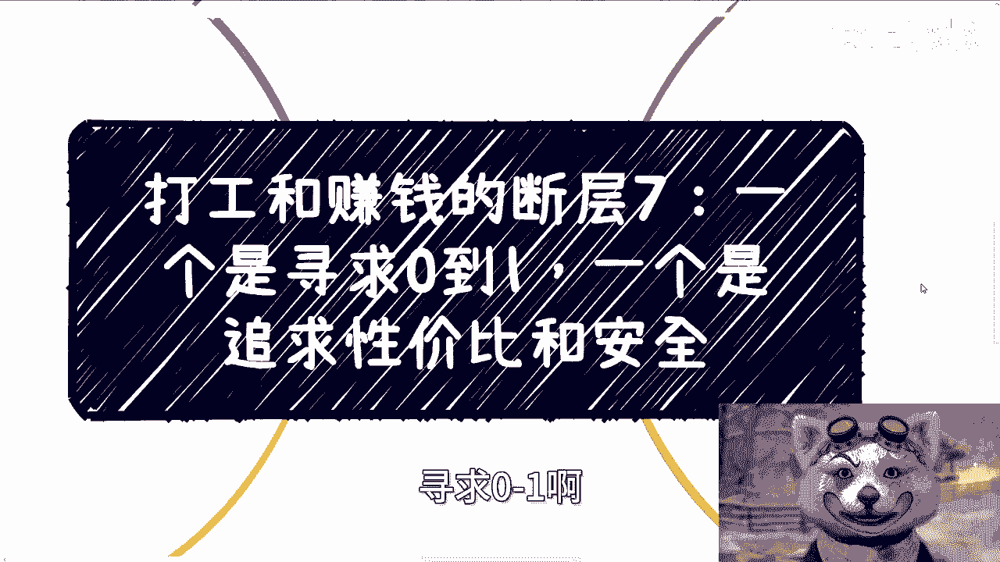
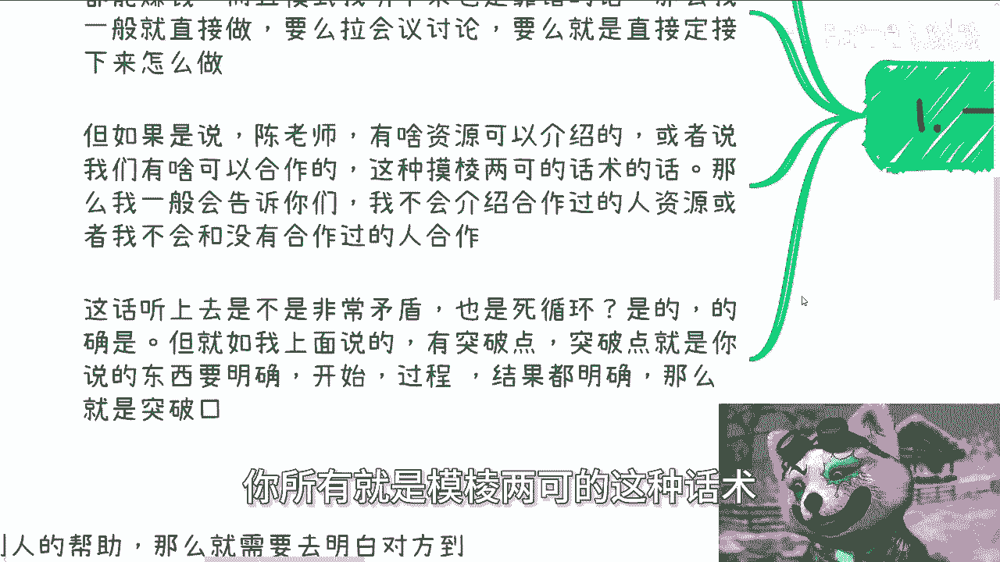
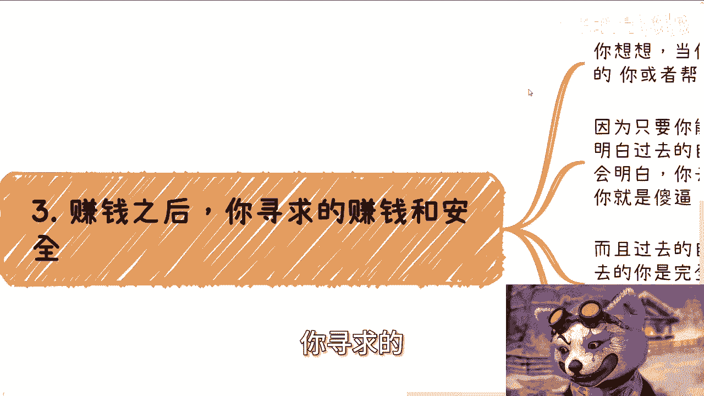
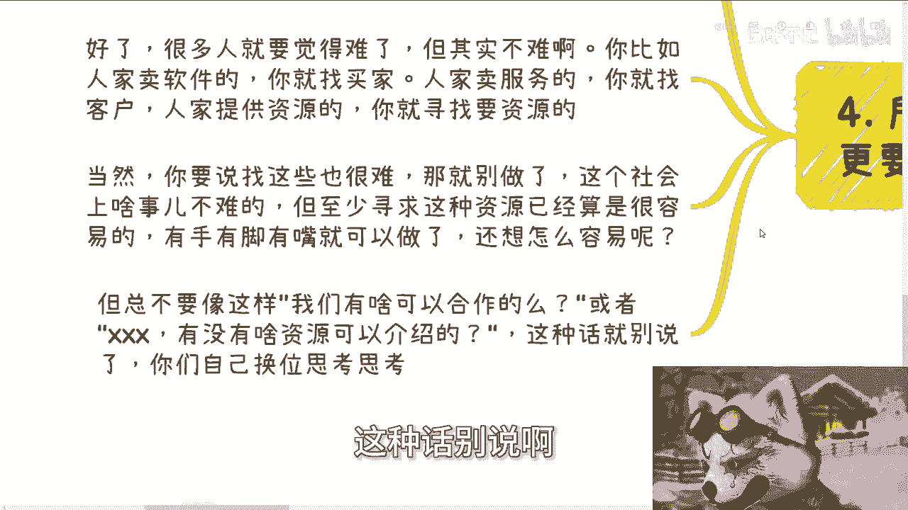
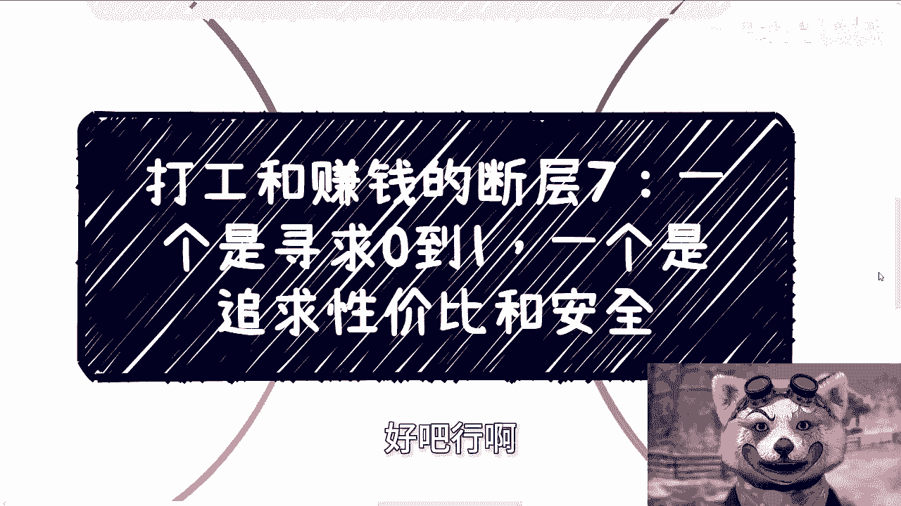

# 课程07：打工与赚钱的断层：从0到1的突破与性价比安全追求 🧱💰



在本节课中，我们将探讨一个核心的认知断层：打工者（或起步者）追求从0到1的突破，而已经赚钱的人则更看重性价比与安全性。理解这一断层，是跨越资源与关系鸿沟的关键。


---

上一节我们介绍了断层的基本概念，本节中我们来看看这一现象的具体表现和深层原因。

## 1. 合作模式的明确性：从“模棱两可”到“直接行动”

当寻求合作时，清晰的模式是成功的前提。模糊的请求通常无法获得有效回应。

以下是两种典型的沟通方式及其结果：




*   **有效合作模式**：提出一个**大家都能赚钱**且逻辑清晰的方案。例如：“我有一个项目，需要您的XX资源，我们可以按XX比例分润，预计流程是A->B->C。” 这种明确性会直接推动行动。
*   **无效沟通方式**：使用诸如“有什么可以合作的吗？”或“有什么资源可以介绍吗？”这类开放式、模糊的话术。这种提问缺乏具体突破口，往往被视为无效社交。

**核心公式**：
`有效合作 = 明确方案 + 共同利益 + 清晰路径`

---

理解了合作需要明确性后，我们进入下一个更深刻的矛盾点。

## 2. 0到1的悖论：为何“过去的你”难以获得帮助

打工者积累资源和关系，是一个从**0到1**的艰难过程。我们总希望有人给予机会或提携。


但一个割裂的现实是：当你自己完成0到1的突破后，回顾“过去的自己”，你很可能也不愿意提供帮助。这形成了一个看似无解的死循环。



**根本原因在于价值认知**：
*   **完成突破前**：“过去的你”缺乏经验、资源和不稳定性，在合作中风险高、价值不明确。
*   **完成突破后**：“现在的你”追求安全与性价比，与“过去的你”合作近乎慈善，且充满不可控因素。

**核心洞察**：只有亲身经历从0到1，你才能真正理解“过去的自己”为何缺乏合作价值。这是一个必须经历的认知悖论。

---

那么，已经完成突破的人在想什么？他们的逻辑有何不同？

## 3. 赚钱后的逻辑转变：追求安全与性价比

完成原始积累后，思维重心从“创造机会”转向“规避风险”和“放大收益”。

*   **安全优先**：合作时首要评估风险。如果判断对方在项目中可能扮演“被白嫖”或“慈善”角色，合作意愿会急剧降低。
*   **价值匹配**：寻求与自身能力、资源对等的合作。过去的自己因价值不足、风险过高，自然被排除在合作名单之外。


**关键点**：这不是冷漠，而是商业理性。理解这一点，才能明白为何你的模糊请求得不到回应。

---

既然明确了问题所在，我们该如何行动，才能打破这个断层？

## 4. 如何实现0到1的突破：换位思考与提供价值

要实现突破，必须站在对方（资源方）的角度思考，提供明确的、有价值的切入点。

以下是行动的关键步骤：

1.  **研究对方需求**：对方是卖软件、服务还是资源？他的客户或需要什么？
2.  **成为解决方案的一部分**：你可以帮他找买家、介绍客户、对接他需要的资源。
3.  **提出具体方案**：将你的价值嵌入到一个清晰的合作蓝图里，而不是空泛地提问。



**行动代码**：
```plaintext
错误示范：print(“请问有什么可以合作的吗？”) # 输出：无响应
正确示范：print(“我手头有3个潜在客户需要您的XX软件，这是客户画像。我们可以谈谈推荐分润吗？”) # 输出：开始对话
```

**最后提醒**：世上没有容易的事。对接资源“动嘴皮子”看似简单，实则考验你的洞察力、执行力和耐力。觉得难是正常的，但这是实现突破必须付出的努力。



---

### 课程总结

本节课我们一起学习了打工与赚钱之间的核心断层：
1.  **思维差异**：起步者求“突破”（0->1），成功者求“安全”（性价比）。
2.  **沟通关键**：摒弃模糊请求，提供**明确、互利、可执行**的合作方案。
3.  **破局之道**：深刻理解对方追求安全与价值的心理，通过**换位思考**和**提供具体价值**来撬动机会。
4.  **认知升级**：接受从0到1过程的艰难性，这是理解整个商业合作逻辑的必经之路。


记住，所有稳固的关系和资源，最终都源于实实在在的、价值明确的**社交与合作**，而非线上的泛泛之交。