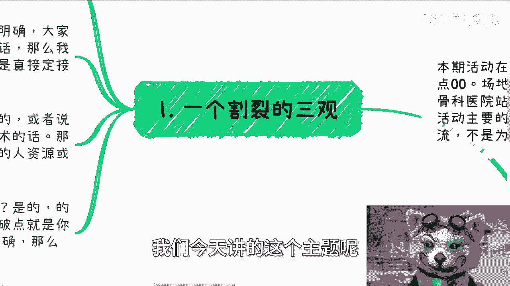
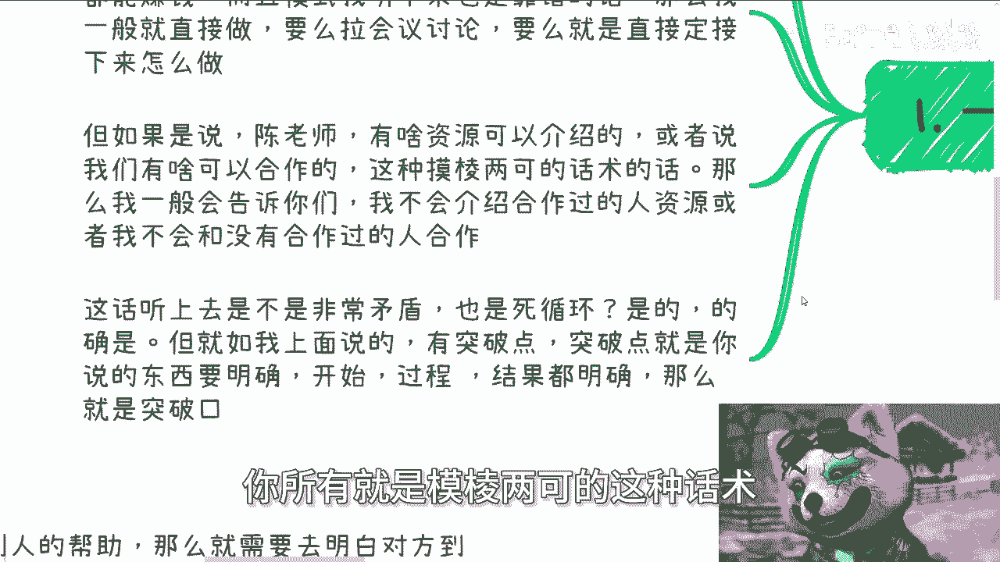
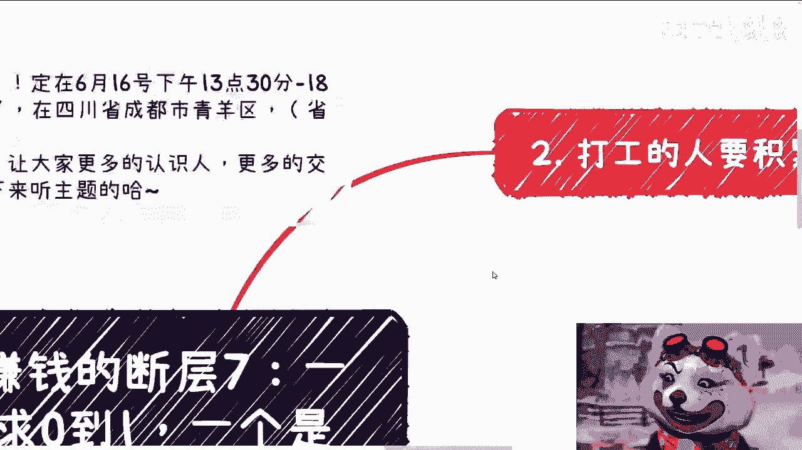
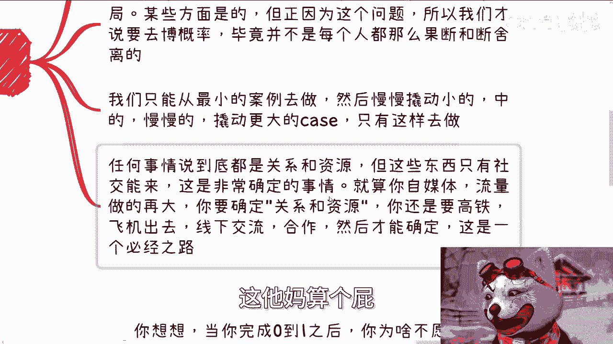
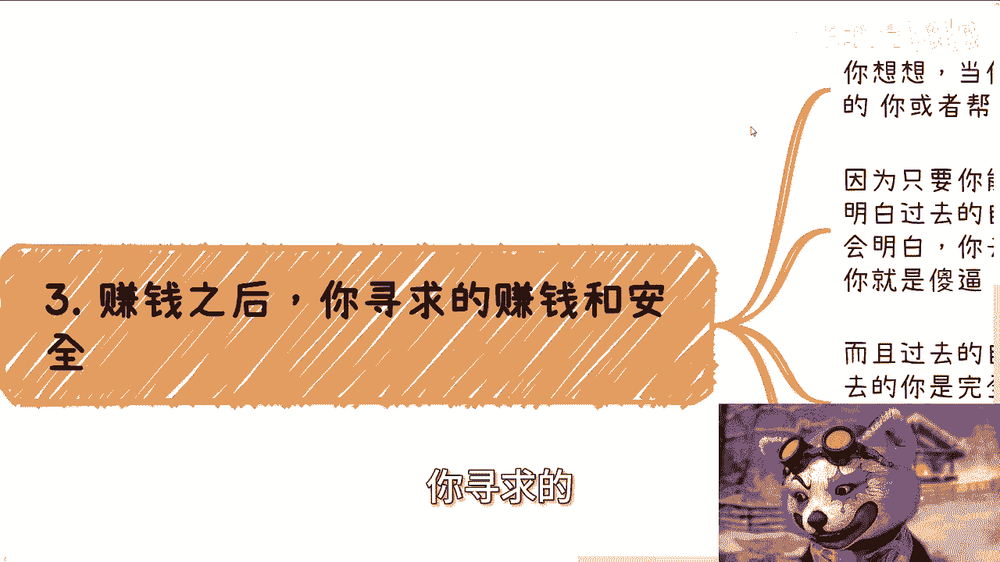
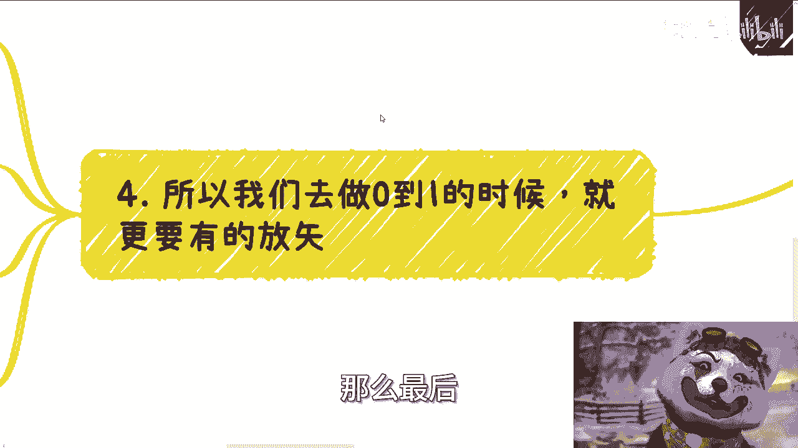
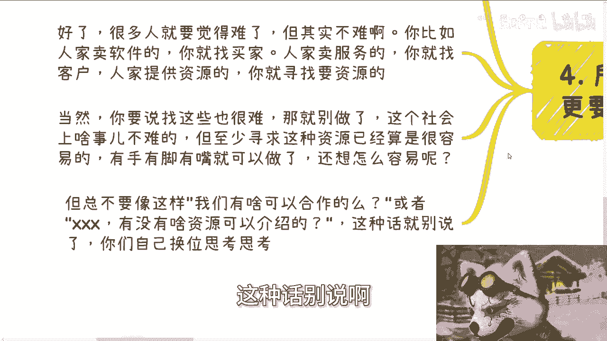
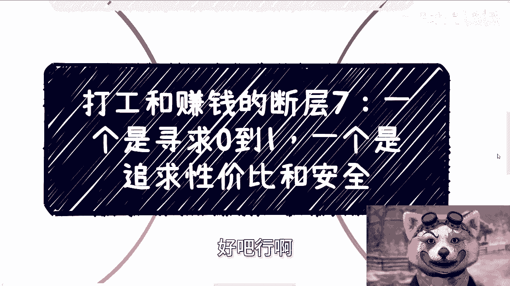
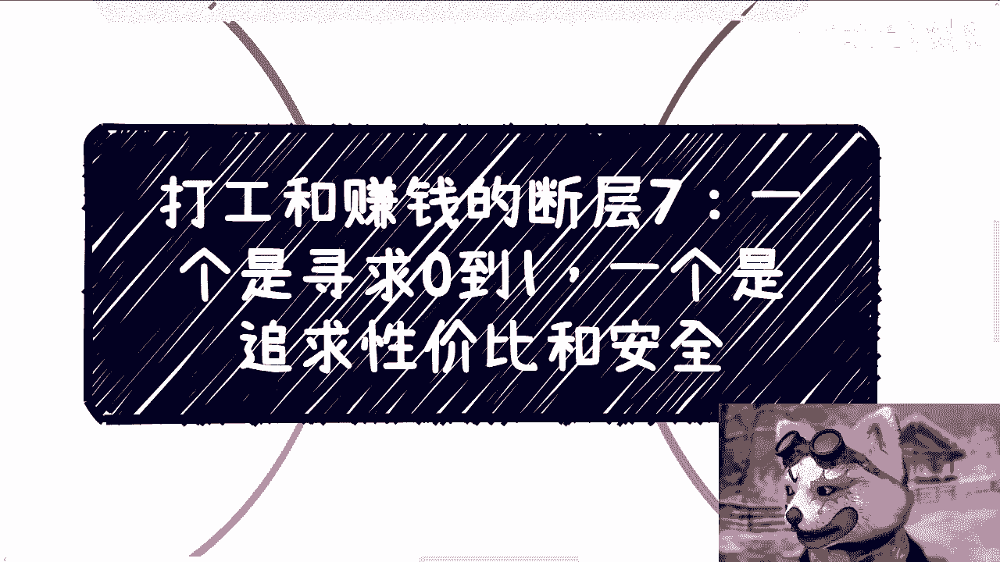

# 打工和赚钱的断层7：一个是寻求0到1，一个是追求性价比和安全 - P1 - 赏味不足 - BV1PS411N7U7

好大家好，今天我们来讲的是这个断层漆啊，就是一个呢是寻求0~1啊。

一个是寻求性价比更安全啊，那么额活动还是6月16号啊，6月16号，然后下午01：30到六点，活动场地已经定了，在成都啊，在成都呃，青羊区好吧，然后古神骨科医院附近好吧。

然后有那个了解详情或者报名的可以私信我啊，那么首先呢我们今天讲的这个主题呢，其实是一个非常割裂的一个三观啊。

呃为什么，因为你想啊，你们只要找我寻求过合作或者寻求过资源的，一般我就两种回复，如果你找我寻求合作，合作的模式都非常明确，比如说大家都能赚钱，当然能不能赚，后话啊，你的模式当中大家都能赚钱。

而且模式听下来也靠谱的话，那么一般就直接做了，就不用屁话对吧，就直接比如说该拉会议拉会议，那该直接定下来怎么做就怎么做啊，但如果说你说啊陈老师有啥资源可以介绍啊，或者说我们有啥可以合作的。

就这种模式来问的，模棱两可的话术，那我跟你讲，我一般就直接会跟你们讲，我说因为我跟你们没有合作过，所以我不会跟没有合作过的人合作，或者我不会给没有合作过的人去对接对接资源，对吧好。

那么这个话从对方听起来就非常的矛盾啊，他认为你说这个话就是死循环啊，对没有错，但是正如我上面说的，不是因为我不想给你们介绍，是因为本身你们这种话就没有意义对吧，你就像像像我上面说的，有突破点吗。

有突破点的，但有突破点就是你说的东西要明确啊对吧，怎么开始过程是什么，结果是什么，你都得明确，那么这叫突破口哦，你所有就是模棱两可的这种话术。

对外你你还想找到突破口啊，他妈不是做梦嘛。

对吧哦，那第二打工人啊，他要积累的这个资源跟关系，那这就是一个零，我们标题当中所说的0~1的过程，但这个过程呢，我们总是希望更多的人能给我们机会，或者说带我们对吧，但是呢你仔细想想看。

当你们完成0~1之后，如果过去的你们啊让你现在的你们给他们机会，或者带你带他们的时候，你们反而就不愿意了，这就是个割裂的地方，当然有的人觉得啊，这就是个死局啊，我跟你们讲某些角度对的的确是个死局啊。

但正因为这个问题，所以我们才要去博弈啊对吧，才才要去搏概率啊，那你否则的话每个人都能都能往前走，那整个这个世界就不会发展成，发展成今天这个样子对吧，哦那么我们只能说从最小的案例去做。

然后慢慢撬动小的案例，中的案例，大的案例对吧，然后只能这么去做任何一件事情，说到底其实都是关系跟资源对吧，这个东西我提了很多遍，但这些东西只有社交能带来，这是一件非常明确的事情啊，说退1万步来讲。

就算你今天自媒体流量做的再大，你要确定我这边所指的关系跟资源，你还是要高铁还是要飞机，还是要线下交流，还是要合作对吧，你才能确定你不是说今天我做自媒体啊，大家网上哎呀这个才拍你拍你几个彩虹屁对吧。

你说哎这个人蛮牛逼的啊，我们才能我我们就这个关系跟资源积累了，这他妈算个屁对吧啊。

这第二点第三点赚钱之后啊，你寻求的你寻求的是赚钱更安全。

你想想看啊，当你完成0~1之后，你为什么不愿意带过去的自己，或者说帮助帮助过去的自己，因为只有你，只要当你能完成E的时候，你就能会明白很多事情，这就是你会明白过去的自己是没有价值。

以及也没有带来赚钱的这个机会的，那么你现在的你就会明白，你就算去合作，你就你就是慈善，换句话来讲，现在的你如果去合作，你就是对吧，而且你但凡去合作，不但你是，你在别人的同等level的合作方言里。

你也是对吧，我什么意思，这就好像比如说今天你跟我说，爱创老师，我们这边合作了一个项目，然后你你说你你把这个项目介绍了一下对吧，我能够判断的出来你在这件事情里面，你的商业逻辑跟商业思维是什么的。

但凡你是在里面会扮演一个慈善的角色，或者说被白嫖的角色，我跟你讲，我心里就会有数，你合作不了的，就你这样的人没法合作对吧，而且过去的自己由于没有现在的你的这个经验，所以过去的你是完全不稳定。

也是不安全的，而且简单来讲就是风险性很高啊，那么容易在合作当中出现很多不可控的因素啊，所以现在的你是不会冒风险，跟过去的你去合作的，那虽然同样都是你，但是你的想法一定是割裂的啊。

但是你必须要经历过这个过程，你才会明白，过去的自己跟现在的自己到底有什么差别啊，如果你不就是我跟你讲，这就是个悖论，就这就是一个就是说怎么说呢，这是一个因果论的一个关系，就是如果你不明白。

那你不可能完成0~1，但凡你完成了，你必然会明白，你知道吗，就是这么个情况啊，当然不是说你要把自己的就过，过去的自己就抛弃掉或者怎么样子啊，那么有的人可能就已经忘记自己的过去，自己什么样子了。

那这个我们叫做脱离群众对吧，但是有的人就可以两者兼顾啊，那么这样子的话，他就能更明白这两者之间的差距是什么啊，那么最后所以啊我们去做0~1的时候呢。

就就必须要明白对方是怎么样的，就比如说回到第一点，我们希望得到别人的帮助，那么就需要去明白对方到底要什么，就如我一里面说的，你只要合作，你只要能赚到钱，只要能做，怎么可能不愿意呢。

或者说就算大家这个这个最终没有做成，那至少有一个讨论的空间吧，啊好了，很多人就会觉得很难啊，但其实不难，为什么，你比如说啊人家卖软件，你就找买家，人家卖服务，你就找客户，人家提供资源。

你就寻求对方要的资源，当然啊有的人听到这还是觉得这个东西很难，那我跟你讲，你就别做了，为什么不你活在社会上，哪件事情有非常容易的，你说有没有，你就比如说跟我说摆摊，你摆摊两个字是很容易，我跟你们讲。

我小时候是摆过摊的，我我小学一年级到5年级摆过摊，我告诉你们摆摊什么概念，就是四点钟，我们早上出去到菜场就得去弄牛肉，弄羊肉啊，羊肉没有弄牛肉对吧，弄猪肉就是你要去，你要去进货，你要去做前期的准备。

你得怎么样子，然后到了05：30左右就已经买早饭，卖早饭了对吧，你难你你说难不难，它难可能跟解数学题不一样，的确不是那种难，但是你能够坚持吗，这就是很难啊，你说什么事情不难呢，对吧哦，你从我一个摆。

比如说你从我一个摆地摊的角度来讲，你去寻找资源，动动嘴皮子很容易啊对吧，但是你反而觉得很难，那你你各有各的难处，你只能说你没有办法说哦，我拿一个对接资源跟一个摆摊的去对比，谁难谁容易。

那么有什么好对比的呢，对吧你你你要这么想，但至少寻求这种资源，从很多某种角度来讲，他已经算是容易的了，就是有手有脚，有嘴就可以做，你还想怎么容易呢啊，你就想他妈躺赚，对不对啊，但是呢就归根结底啊。

就是不要像这样，就是说啊我们有什么可以合作的吗，或者说某某某啊有没有什么资源可以介绍的，这种话别说啊。

为什么，因为你你们换换位思考，想想看别人跟你们讲中国话，你怎么想的，你但凡心里面第一个想法说哦，我我有什么资源，我介绍介绍你是个，对不对，那就说明什么，说明你没有价值，你的资源也没有价值。

而说介绍就介绍的，那么对方是谁，你都不知道对方干嘛，你都不知道对方做过什么，你都不知道就介绍，对不啦，好吧行啊。

那么这个主题就这样子，那么呃成都好吧，成都这个活动报名继续报名，然后的话呃呃职业规划，商业规划，合同分润分红啊，直接呃商业计划书啊，白皮书啊，包括你其他的有什么呃牌或者没有什么牌的，希望通过跟我的沟通。

能够去啊寻找到一些更接近当下中国发展，更接近地气的这么一些职业规划，或者说未来的一个发展道路的话，那么你们可以整理好个人问题跟个人背景，我们再来走咨询啊，呃另外就是说所有啊所有你们的期期望啊。

通过咨询就能够赚到很大的钱，财务自由的什么期，期待就能解决掉你们当下所有的问题的，你们就别来找我，找别人去啊，你们这个这个韭菜该该该冤种，该给谁交钱，给谁交钱。

