# 打工与赚钱的断层8：被动投喂与主动驱动 🍽️➡️🚀

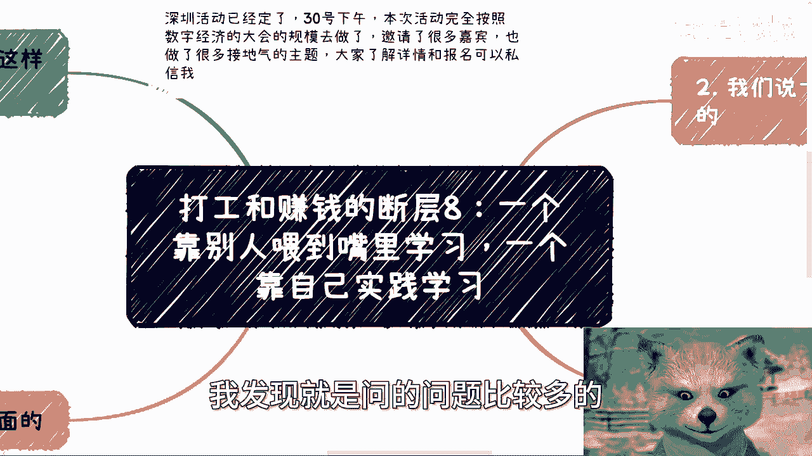

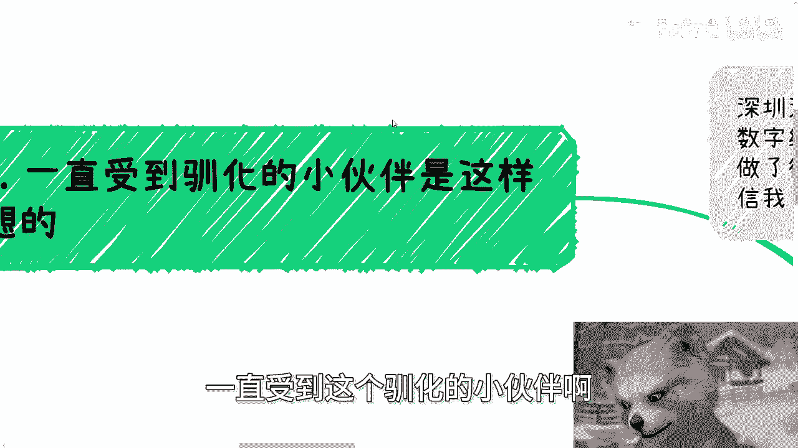

在本节课中，我们将探讨两种截然不同的学习与成长模式：一种是等待他人将知识“喂到嘴里”的被动接受，另一种是源于内心驱动的主动探索与实践。理解这两种模式的差异，是跨越从“打工者思维”到“创造者思维”鸿沟的关键。

## 概述：两种学习模式的本质区别

我们首先需要明确一个核心概念：真正的学习与成长，其动力来源和行动方式存在根本性差异。被动学习依赖于外部指令和现成答案，而主动学习则源于内在的好奇心与实践需求。

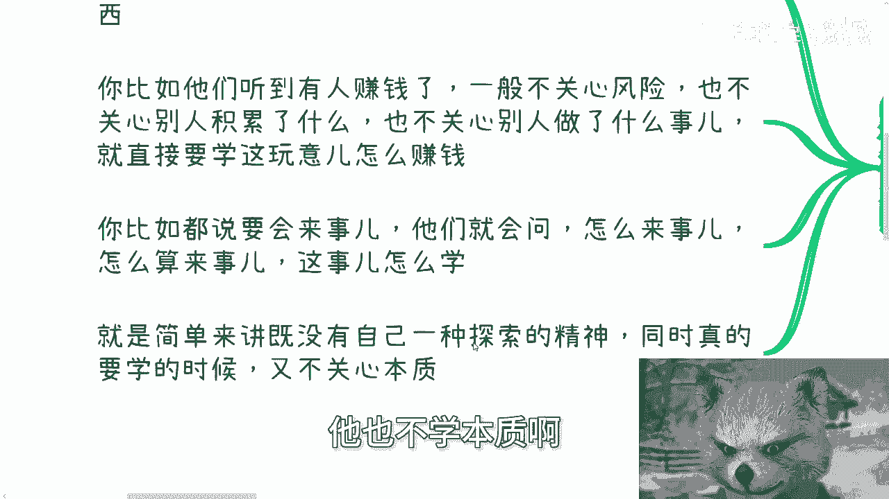

上一节我们讨论了思维模式的差异，本节中我们来看看这种差异在学习行为上的具体体现。

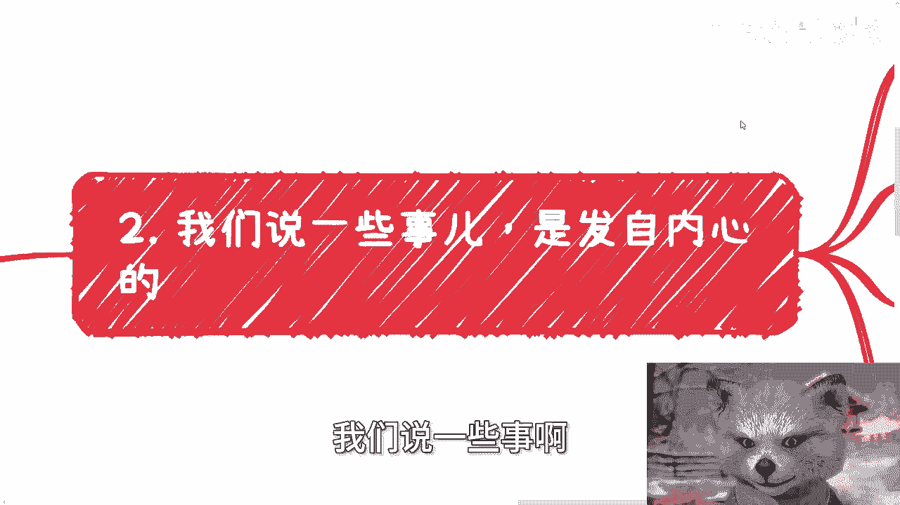

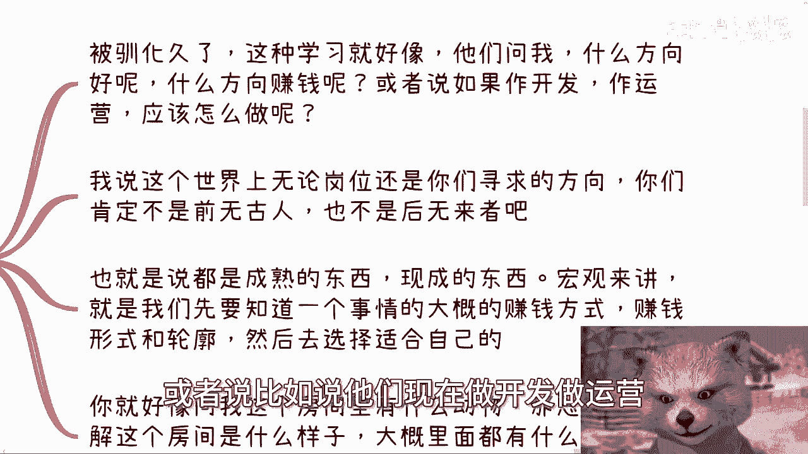

## 被驯化的被动学习者 🤖

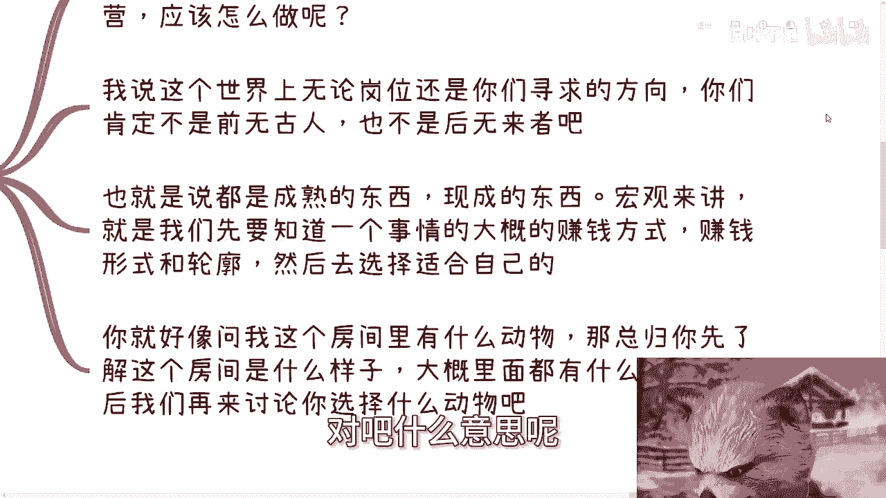

长期处于“打工”环境的人，其学习模式常常表现出一种被驯化的特征。他们习惯于等待指令、寻求确定的“方法论”，并期望获得可以直接套用的表面解决方案。

以下是这类学习者常见的思维特征：

*   **追求表面方法**：他们更关心“怎么做”的具体步骤，而非事情背后的本质逻辑。其思维模式可以概括为：`寻求解决方案 = 获取可复制的方法论`。
*   **忽视本质与风险**：当看到他人成功时，他们通常只关注结果（“怎么赚钱”），而忽略了他人的长期积累、过程中的风险以及关键的细节。
*   **询问无效问题**：他们会提出诸如“怎么才算会来事？”、“这个怎么学？”之类的问题。这本身就是一个悖论：**能问出这种问题，恰恰说明不具备这种能力**。因为真正的“会来事”源于实践中的感知与总结，无法通过一个抽象答案获得。

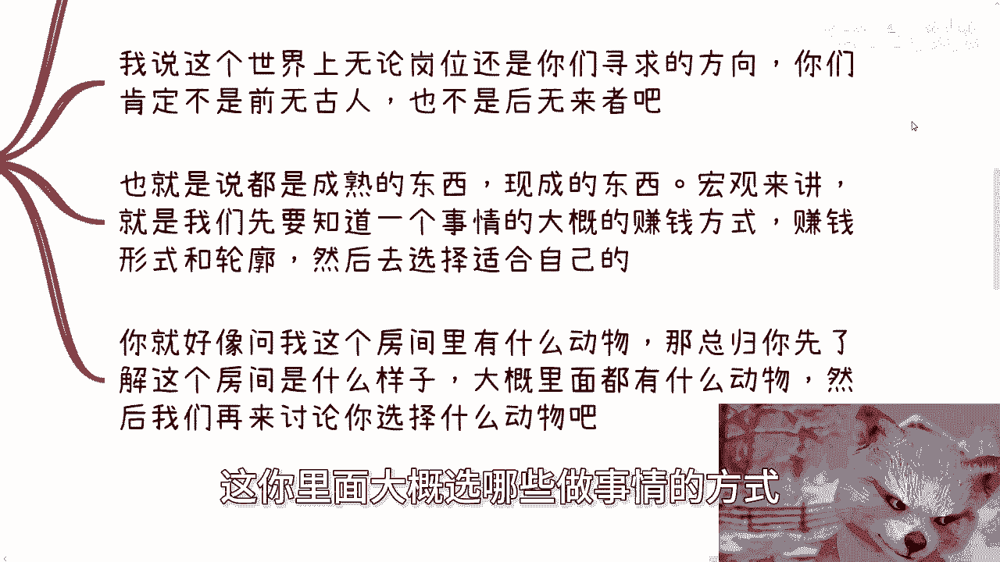

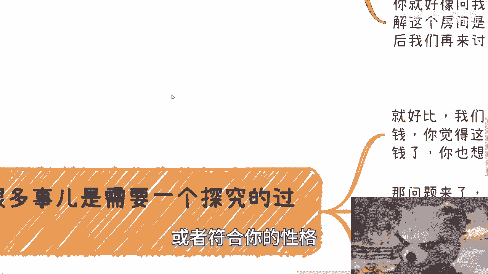

简单来说，这种模式既缺乏自我探索的精神，在学习时也回避触及本质，只满足于获取“面子上的东西”。

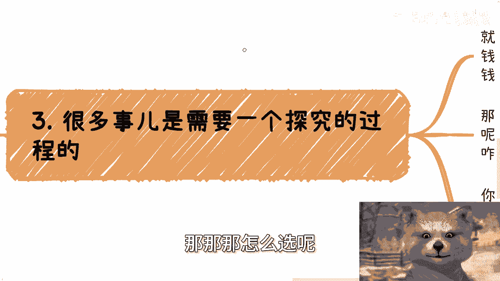

## 发自内心的主动探索者 🔍

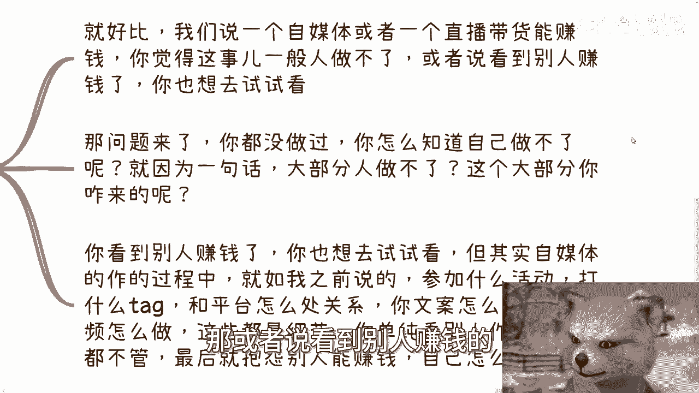

与被动接受相反，主动驱动型的学习者明白，世界上绝大多数问题都有成熟的解决方案或参考案例。他们的任务不是从零发明，而是主动去发现、研究并选择适合自己的路径。

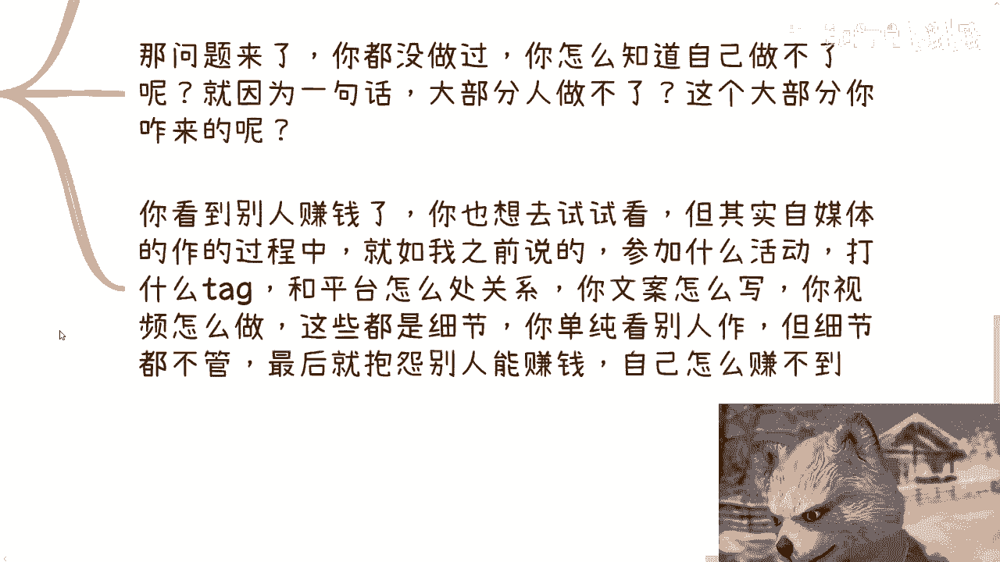

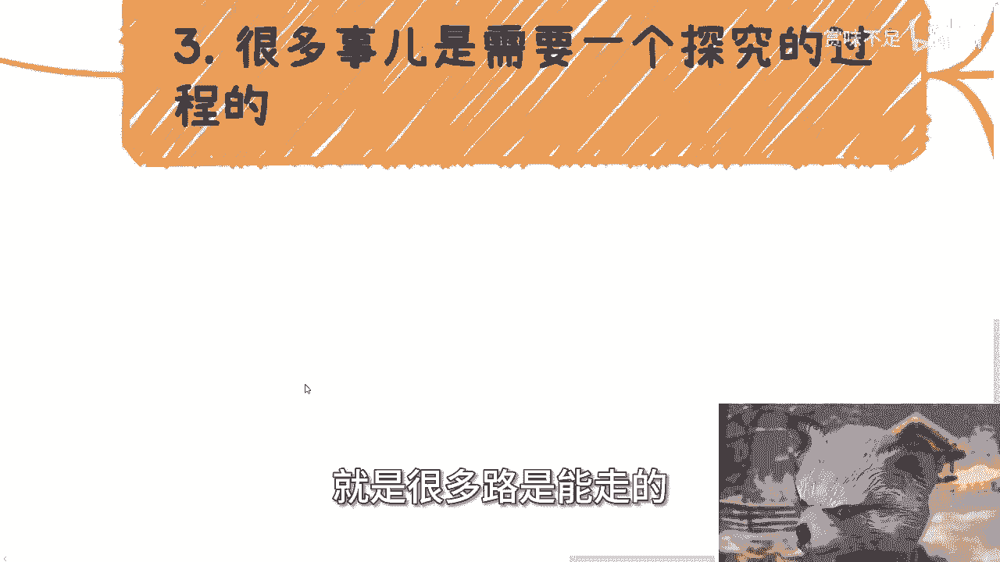

以下是主动探索者的核心行动逻辑：

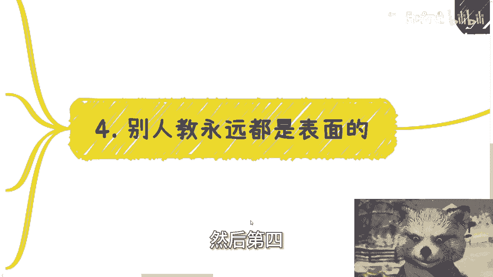

1.  **承认已有解决方案存在**：无论是职业发展还是赚钱业务，你所面对的问题很可能早有前人探索并形成了成熟模式。核心任务是去**发现**它们，而非空想。例如，想知道互联网行业的真实情况，应去查阅官方统计报告（如互联网从业人员占比约13%），而非仅凭身边个例判断。
2.  **先了解“房间”，再选择“动物”**：这就像一个比喻。如果你想在房间里选择一个合适的动物伙伴，正确步骤是：
    *   先了解房间的整体环境（宏观行业/领域）。
    *   再调查房间里有哪些动物，它们的习性和轮廓如何（领域内各种商业模式、赚钱逻辑）。
    *   最后结合自身特点（个性、特长），选择与之匹配的动物（做事方式）。
3.  **实践是唯一的验证途径**：很多人尚未尝试就断言“一般人做不了”（如自媒体、直播）。或者看到别人赚钱后只想简单复制。但成功取决于对细节的把握：平台规则、内容创作、用户互动等。不关心细节、不学习本质，仅进行表面模仿（`CTRL+C` / `CTRL+V`），结果必然是失败，然后反过来加固“此路不通”的错误偏见。
4.  **理解“别人教的永远是表面的”**：商业实践中的沟通、谈判、合作高度依赖具体情境（产品、客户、时机、地方政策等）。不存在一套放之四海而皆准的“万能话术”。真正的成长来自于：`实践 -> 遇到具体问题 -> 结合上下文分析 -> 获得经验`。试图直接获取抽象方法论，就像学习“玄学”。
5.  **建立判断力而非依赖合同**：我们强调合同的重要性，其根本目的在于培养和锻炼你的**商业判断力**。在有能力判断合作方或项目可信度之前，合同是必要的保障。判断力来自于实践中的多次试错与修正，即“被骗多了自然就明白了”。没有判断力，即使有合同，也可能无法识别关键风险。

## 核心断层：索取答案 vs 探索逻辑

总结来说，打工思维与赚钱思维在学习上的断层体现在：

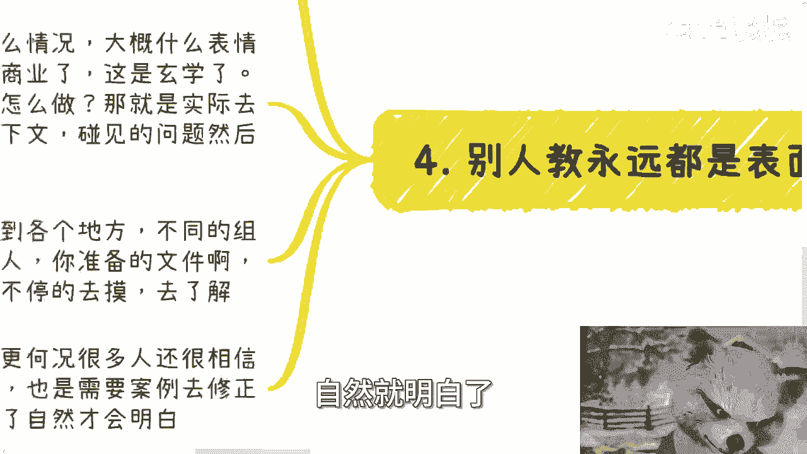

*   **打工思维**：倾向于“伸手”，索取一套现成的、表面的方法论，希望直接套用，不关心底层逻辑。其驱动力是完成外部任务。
*   **赚钱思维**：清楚无人能教给自己一切，核心在于通过主动沟通和实践，去挖掘和理解那“水下80%”的做事逻辑与本质。其驱动力是解决自己面临的真实问题。

## 总结

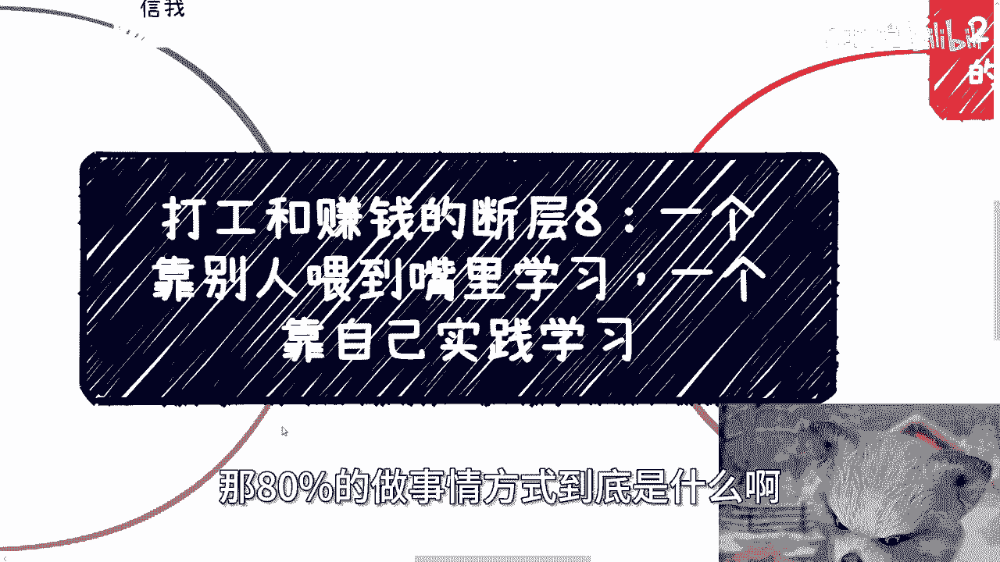

本节课我们一起学习了两种学习模式：“被动投喂”与“主动驱动”。前者等待被给予确定答案，追求捷径和表面方法；后者发自内心，通过主动探索、实践和具体案例分析来获取真知，关注本质与逻辑。要跨越从执行者到创造者的断层，关键在于将学习模式从前者转向后者，在实践中培养独立的判断力和解决问题的能力。

> **行动提示**：深圳线下活动已定于30号下午举行，融合了数字经济大会的规模与接地气的主题。如需了解详情或报名，请私信。此外，若需在商业规划、合同股权、商业计划书等方面获得结合个人情况的针对性咨询，请整理好具体问题与背景后再进行沟通。