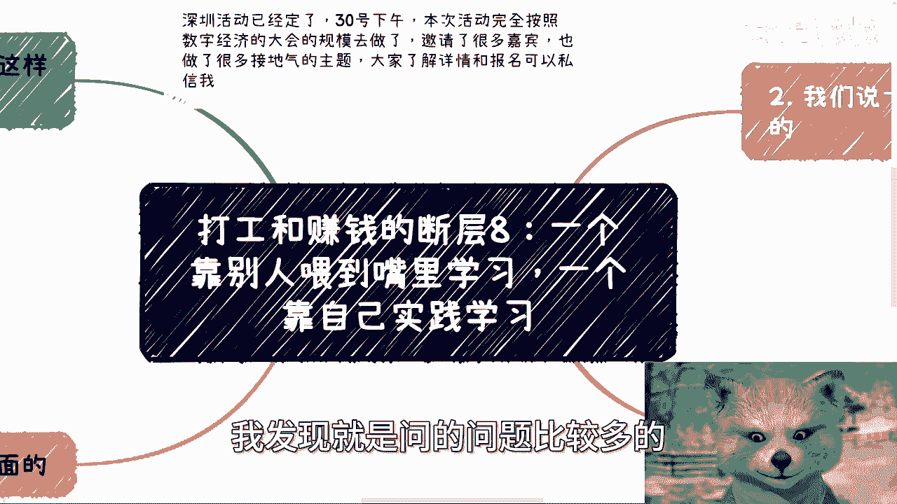
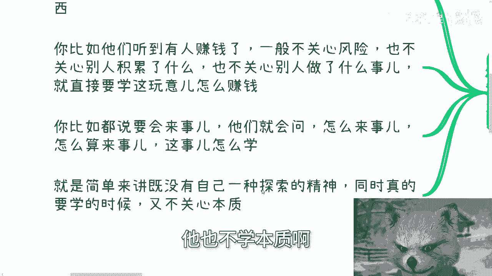
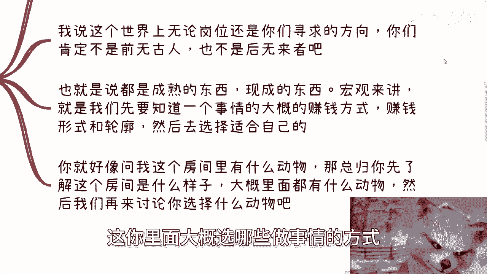
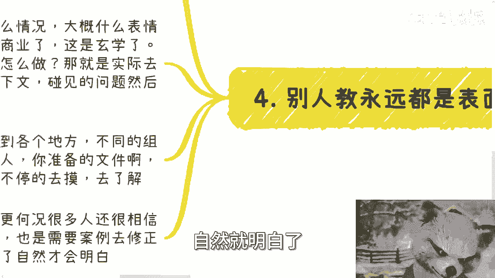
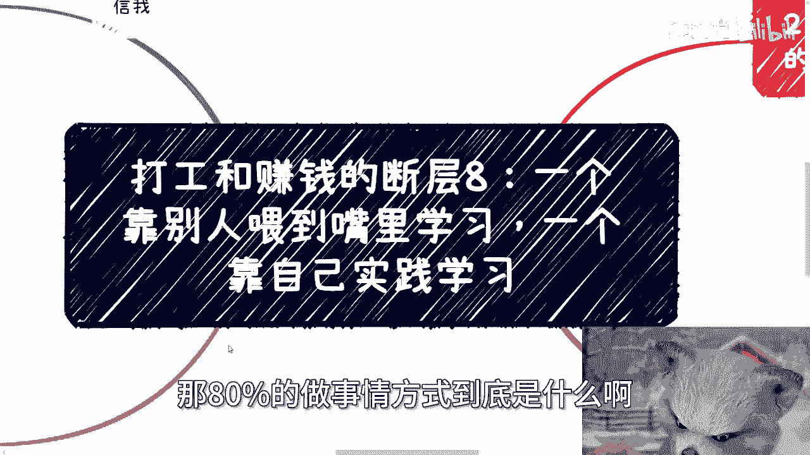

# 打工和赚钱的断层8：一个靠别人喂到嘴里，一个靠发自内心的驱动 - P1 - 赏味不足 - BV1EH4y1w7ui

好啊，我们今天继续来讲啊，今天讲的是打工跟赚钱的断层八啊，呃这个东西呢也今天这个主题啊，叫做一个是靠别人喂到嘴里学习啊，一个是靠自己实践学习，呃，这个也是最近呢就是问我问题里面啊。

我发现就是问的问题比较多的一个问。

1111种类型啊，我给你们归类出来呃，首先啊先再说一下啊，深圳那个活动已经定了30号下午好吧，然后本次活动完全按照数字经济大会规模去做，好吧，邀请了很多嘉宾啊，也做了很多接地气的主题啊。

大家要是了解详情或者报名可以私信我啊，那么首先呢就先说第一个啊，一直受到这个驯化的小伙伴啊。

是这么想的，就他们啊比如说碰到别人说个事啊，就想着去学啊，当然我说学是好事啊，我从来就是支持是学的啊，但是你会发现他们所说的学更多的是什么呢，就是啊就是你最好告诉他方法论啊，你最好告诉他这东西怎么做。

但是本质上是你们有没有想过，就是很多东西表面上的事情去做了，你就算完全去模仿，做了，你也做不出来，为什么，因为他本来就不是一个只有表面的东西的，这么一个事情哦，所以说你会发现很多他就我这边主题写的嘛。

叫做一直受到驯化的小伙伴啊，他们就算是想学，但他们脑子里面是没有这个意识，去学本质东西的哦，包括就是说这个这个，他们也也就是你跟他讲本质的，他也不愿意去学，他更要的是呃捷径，那他更要的是一些表面的东西。

那么还有你比如说他们听到有人赚钱，他一般呢也不来关心你有什么风险，也不来关心别人到底积累了什么，也不来关心别人在这里面到底做了哪些事情，他都不关心，那他要的就是说你就告诉我，这玩意怎么赚钱对吧。

但问题是，但问题是不存在这种事情啊，你再比如说啊，这两天咨询也好啊，包括那个视频下面也好啊，就提到就说啊这个问我说陈老师怎么算会来事，我跟你讲啊，这就是个悖论，就是我可以这么跟你讲。

你但凡问出来怎么算会来事，或者这件事情我怎么学，那就说明你不会来事，你懂吗，你但凡会来事，你肯定不会这么问哦，你肯定不会这么问，你心里面多多少少通过实践，你已经有杆秤了，你你懂吗。

所以说我觉得这个东西就说你说怎么来事，我怎么学这东西，学不学不来呀，你你你明白学不来，他他得他得从你内心去去，发自内心的有这种想法哦，那么也就是说你需要的是什么呢，就是说呃啊在我我先把这个主题讲掉。

就是说简单来讲，就是很多小伙伴啊，做问这个学一个东西的时候呢，他是既没有自己的一种探索精神啊，同时呢就是说真的要去学呢，他也不学本质啊。

学一些面面子上的东西，那么第二啊我们说一些事啊。

他是发自内心的，那首先你看啊被驯化久了，他这种学习就好像什么呢，比如说他们问我啊，什么方向好呢，什么方向赚钱呢对吧，或者说比如说他们现在做开发。

做运营，做设计对吧，就问我开发设计运营应该怎么做，我说这个世界上的岗位，无论是你们现在去应聘的岗位，还是你们这个业这个要做的这个赚钱的业务，那一定不是前无古人，也不是后无来者吧对吧。

什么意思呢，意思就是说你们所追求的任何一个东西，在这个世界上早就已经有成熟的东西在那边了，只是你们不知道啊，你包括什么，你包括今天还还有小伙伴跟我讨论什么啊，中国这个互联网对吧。

还还能发展多久或者怎么样子，我说我说我说大哥，这互联网，2017年16年年底就走下坡路了对吧，然后他就问他说，那那为什么我觉得身边人很多都做互联网，我说大哥你你去看一下，就是国家的官方的这个报告。

我虽然不是说这个报告一定信，但是他有一定的参考价值对吧，中国的互联网从业人员，14亿人里面就占13%，那你说个DER儿对吧，你说个DER儿呵，就是就你不能说哦，因为我身边人都在做互联网。

所以我觉得互联网的从业从业基数很大，你不没有这样判断的呀，对不对啊，所以说也就是说我们很多东西，一个成熟的现成东西，那宏观来讲，就是说如果你们想要去知道一件事情，比如说做开发啊，做设计啊，做土木啊。

做什么东西啊，你你要知道某一件事情，或者某一个领域里面的大概的赚钱方式啊，这个赚钱的行为跟赚钱的逻辑，然后你要从这些已经成熟的方式，形式轮廓逻辑里面去选择若干个适合你自己的，是这么一个做事情的方式。

不是说我今天就在那边想啊，然后来来来或者问我问别人，你问我问别人，我是能给你若干个方向，但是你你你本身是就是你本身问了我之后，你还是不知道怎么去接下来去做事情啊对吧。

你就好像比如说问我这房间里面有什么动物，或者选什么动物，那你真正做实验方式应该是，你先了解这个房间是什么样子的，然后再去了解这个房间里面大概有哪些生物，对吧，那它就像我们刚刚说的哎。

他可能是有哪些习性啊，它有哪些轮廓啊对吧，就像我们说的诶，这个房间里面这些动物，就意味着你可能每个领域做事像方式对吧，那么它方式有哪些啊，赚钱的又有哪些啊，然后对吧，我们再来讨论诶。

这你里面大概选哪些做事情的方式。

选哪些动物是比较符合你的这个个性，或者符合你的性格，符合你的这个这个特长的。

是这么个逻辑啊，他不是说你说啊，我们大部分人问问这个问题的时候啊，就是他是属于对整个的这个房间，对整个的房间里面任何东西一无所知，然后他就问你哎我应该选什么，那那那怎么选呢。

对吧啊，然后很多事是需要一个探究的过程，这就好比什么，我们说一个自媒体或者一个直播带货能赚钱，你觉得这事一般人做不了，那或者说看到别人赚钱了。

你也想试试看，那问题来了，你连做都没做过，你怎么就知道一般人做不了呢，哦就因为大家都在说一般人做不了，所以你也觉得一般人做不了，那那你还做个屁，对不对，那另外一方面，你看到别人赚钱了。

你可能就比较酸对吧，或者眼红，你也想去试试看，但其实我们随便打个比方，你比如说自媒体的这个做的过程当中，就如我以前说过的，你参加什么活，参加什么网络上的自媒体的活动啊，打什么标签啊，和平台怎么处关系啊。

你文案怎么写啊，视频怎么做，这些都是细节，你单纯看别人去做，你完全就像我一开始开篇说的，你完全CTRLCCTRLV没有用，你不关心那些细节，不去学习那些本质，你最终就抱怨哦，为什么别人能赚钱。

自己赚不到钱，然后最终又套用那句话哦，哦一般人赚不到钱，这这就哎就你知道吗。

就是很多路是能走的。

能不能走，取决于你自己啊，然后第四别人教的永远是表面的。

这就是我也一直想说的一句话，就是说你看啊，我之前其实也跟很多咨询过我的人，我说过一句话是什么，我说我不是不想教你们怎么沟通，我也不是不想教你们怎么去介绍，但这个东西我我怎么教，我都我自己也没想明白啊。

对不对，我怎么教呢，因为你你你你所有人做的业务，所有人卖的产品，所有人所面对的客户，所有人当下的上下文都不一样，我怎么知道应该怎么弄呢，对吧，那比如说我跟你讲哦，我说这个人面部表情是什么样子的对吧。

大概什么情况，大概什么表情，做什么样的反应，我们应该做什么，那这不是商业，这他妈叫玄学对吧，所以说你真的增长经验应该怎么做，就是实际的去做，然后根据实际的不同的业务，你到底有什么。

然后今天碰到了什么困难，比如说你讲了你你怎么介绍的，你大概怎么跟别人沟，别人大概怎么回你的对吧，你要把这些东西上下文获取到了之后，然后我们再来具体问题具体分析，这是一个做事情的方式啊。

但不是说你说啊啊陈老师，我们有一套方法论对吧，我们怎么怎么跟政府合作，怎么跟高校合作，它不存在呀，哦因为你这些细节问题怎么教，你想想看中国从中央各地到地方，不同的组织，不同的部门，不同的政府呃。

不同的地方政府碰碰你碰见不一样的人，你甚至碰见不一样的level的人，你准备的文件啊，话术啊，PPT啊，可能都不一样，我靠这怎么教啊，我我怎么教我我也不明白，对不对啊，这就是大部分人碰到的问题。

更何况很多人还还很相信别人说的，卧槽你们知道吗，今天哎今天真的又有又有个就是私信的，就很好玩，就跟我说哎我是不是说过哎，无所谓，就就不说了吧，就是说反正就是说真的说啥是啥啊，然后就是说你你你你。

你其实就是需要不不停的案例去修正，你这个相信，那么说白了是什么，就是你被骗多了自然就明白了啊。

我跟你们讲，就是我一直跟你们强调合同这个东西，不是说我们要较真哦，也不是说很多时候一定要合同才能往下做，不是这么一个因果关系，而是说就是说你面对一些问题的时候，你可以不要，你可以没有合同。

但是你得在有合同之前，你得去有这个能力判别对吧，你的合作方啊，你的这个对方这么一个人啊，或者大概怎么样的一个项目啊，是不是可信对吧，那你在没有判断能力之前，那你肯定只能套合同对吧。

你像我另外一个这个视频跟你们讲的，我说私信说那个呃转正不转正的，那你要么跟我签合同，你你你这个公司不跟我签合同，你口头上跟我说哦，我能转正，我凭什么相信你啊啊那那那当然了，现在这个很多人相信对吧。

你包括私信我那个那个大大大四的那个小伙伴，也是的对吧，他就觉得他能转正，那你凭什么呢，你又不签合同，哪哪来的转折，对不对啊，所以我觉得就是说打工跟赚钱这边，他的一个很大的一个断层是什么呢。

就是打工一直想着是他是要去学，没有错，但是我我我我真的，我不是说你们啊就说的不好听点，打工的很多所谓的学其实就是希望伸手，就是希望别人跟他讲一套方法论，拿拿过来直接用他，他根本就不关心里面的逻辑。

而真正的就是赚钱的那些人，他其实是很清楚的，就是我不是要你教，我，不是要去看表面，我更多要去跟你沟通，你的这个这个这个水下，那80%的做事件方式到底是什么哦。

行好吧，那就这么着啊，然后深圳活动好吧，30号下午好，你们要报名的抓紧，反正优惠就这两天，然后剩下的话就直接规划商业规划啊，合同股权分润，分红额是那个商业计划书白皮书啊，或者你们呃觉得需要跟我沟通啊。

希望通过我的这个视角，或者我的一些呃这个这个经验啊，能够给你一些结合你们的个人情况，能够给你们一些更接地气的一些建议，或者规划的话，那么你们整理好个人的问题跟背景好吧，我们再来做咨询啊，行啊。

