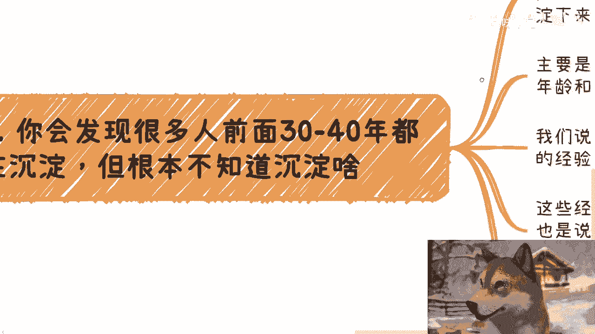

# 打工与赚钱的断层 第9课：沉淀与积累的本质区别 📚💡

在本节课中，我们将探讨“沉淀”与“积累”在打工思维和赚钱思维中的根本不同。我们将分析为何看似相同的概念，却导向了截然不同的结果，并帮助你理解如何通过“有结果的行动”实现真正的进步。

---

## 概述：两种不同的“积累”路径

很多人都在谈论“沉淀”和“积累”，但打工者与赚钱者对这两个词的理解和实践方式完全不同。本节课程将揭示这种差异的核心，并解释为何“有结果的行动”才是有效积累的关键。

---

## 打工者的“沉淀”：无结果的准备

上一节我们概述了两种路径的区别，本节中我们来看看打工者通常如何理解“沉淀”。

打工者口中的“沉淀”或“积累”，通常指的是一些宏观的、缺乏具体结果导向的行为。他们认为这些行为是为未来做的准备。

以下是打工者常见的“沉淀”方式列表：
*   读书、提升学历。
*   出国留学。
*   寻找实习。
*   做一份工作。
*   进行投资。
*   找人创业或利用身边的关系。

这些行为听起来都正确，但存在一个根本问题：它们缺乏**明确、具体的结果**。例如，读完一本书、获得一个学位、完成一段实习，其本身并不能直接推导出一个清晰的、可验证的结论或产出。这些行为的颗粒度太粗，无法构成有效的积累。

---

## 核心区别：有结果 vs. 无结果

理解了打工者的“沉淀”模式后，我们来看看它与赚钱者思维的本质区别。

两者的核心区别在于：**一个是有结果的积累，一个是无结果的积累**。

我们可以用一个公式来理解这个过程。假设从起点（0）到成功或赚钱的目标（1000）有1000步。

*   **打工者的定义**：从第0步到第999步，都是沉淀、准备、铺垫。他们认为只有走完这999步，才能抵达最终赚钱的第1000步。他们的路径可以概括为：
    `0 -> 1 -> 2 -> ... -> 999 (全是“沉淀”) -> 1000 (赚钱)`
*   **赚钱者的定义**：从第1步开始，每一步都要产生价值、接近赚钱的目标，只是每一步的收益和性价比不同。他们的路径是：
    `0 -> 赚钱1 -> 赚钱2 -> ... -> 赚钱999 -> 赚钱1000`

赚钱者的每一步都在探索信息、打破信息差、了解上下游，并且每一步行动都力求形成一个**闭环**，产生一个可验证的结果。这个结果可能赚钱，也可能不赚钱，但行动本身是围绕“创造价值并获取回报”这个目标展开的。

---

## “沉淀”的悖论与陷阱

基于上述区别，我们可以发现打工思维中关于“沉淀”的一个巨大悖论。

许多人花费数年甚至数十年的时间进行所谓的“沉淀”，例如进入大厂工作、积累人脉。但如果你追问：“你具体沉淀了什么？磨练后有什么明确的结果？”他们往往无法回答。

这种“沉淀”容易陷入自我麻痹。人们误以为随着年龄和资历增长，结果自然会来。但事实上，**真正的经验来自于完成一个个有闭环、有结果的案例**。对社会运作、组织管理的理解，必须通过具体实践来获得。

仅仅“认识一些人”或“拥有一个头衔”并不是有效的积累。如果没有基于共同目标的实质性交集与合作，这些人脉和经历无法转化为真正的能力与资源。当需要独立赚钱时，很多人会发现之前的“沉淀”并未赋予他们真正的开端能力。

---

## 如何实现有效的积累？

那么，如何打破无效沉淀的循环，实现真正的进步呢？关键在于将“沉淀”具象化、结果化。

你需要不断追问自己：我所谓的积累和沉淀，其**细节**是什么？**具体**要做什么？能带来什么**明确的结果**？

以下是实现有效积累的行动建议：
*   **以结果为导向**：任何学习或行动，都应设定一个微小但明确的目标或产出。
*   **追求闭环**：确保你的行动能形成一个完整的“计划-执行-验证-调整”循环。
*   **具象化过程**：将模糊的“提升能力”转化为具体的“学会某项技能并完成一个小项目”。

如果你的“沉淀”无法回答上述问题，那么这种思考就需要打上问号。真正的进步来自于有结果的行动，而非自我感动的准备。

---

## 总结与下期预告

本节课中，我们一起学习了“沉淀”与“积累”在打工思维和赚钱思维中的本质区别。

**核心要点总结**：
1.  打工者的“沉淀”常是**无结果**的宏观准备。
2.  赚钱者的“积累”是**每一步都追求价值闭环**的实践。
3.  有效的进步来自于**具象化**的行动和**可验证**的结果。
4.  要警惕陷入“为沉淀而沉淀”的自我麻痹循环。

只有通过不断完成有结果的小事，才能积累起真正能用于赚钱的经验、认知和能力。停止用“准备”拖延，开始用“行动”积累。

---

**下期活动预告**：7月13日，南京。主题将涵盖低空经济、各类型企业（民企、国央企、大厂、外企）的入职优劣势与发展分析，以及企业数字化改造中的机会。详情请私信。

**个人咨询**：如需进行商业规划、股权设计、商业计划书撰写或针对个人情况的战略梳理，请整理好详细背景与问题后私信接洽。