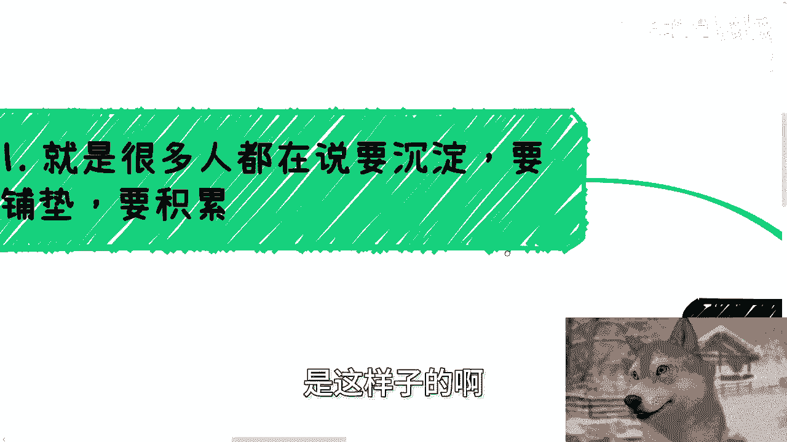
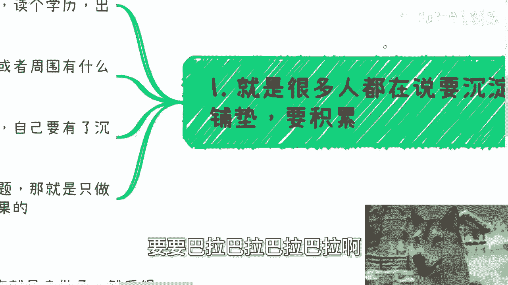
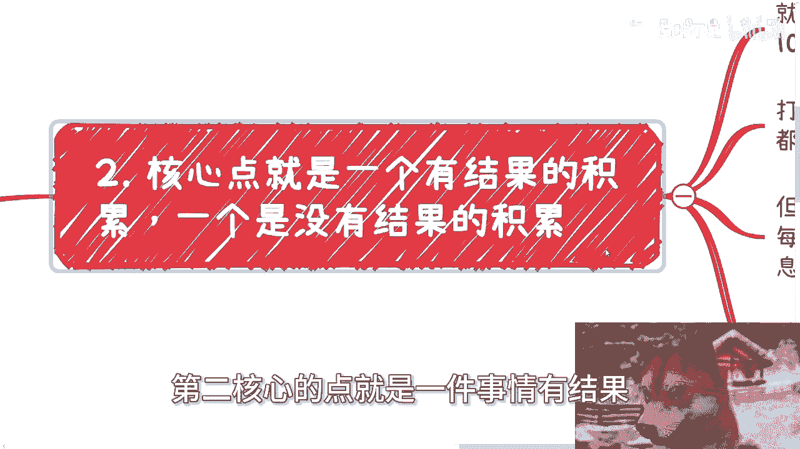
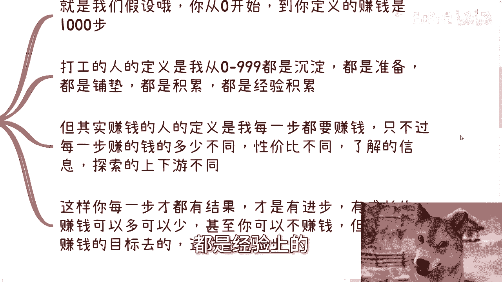
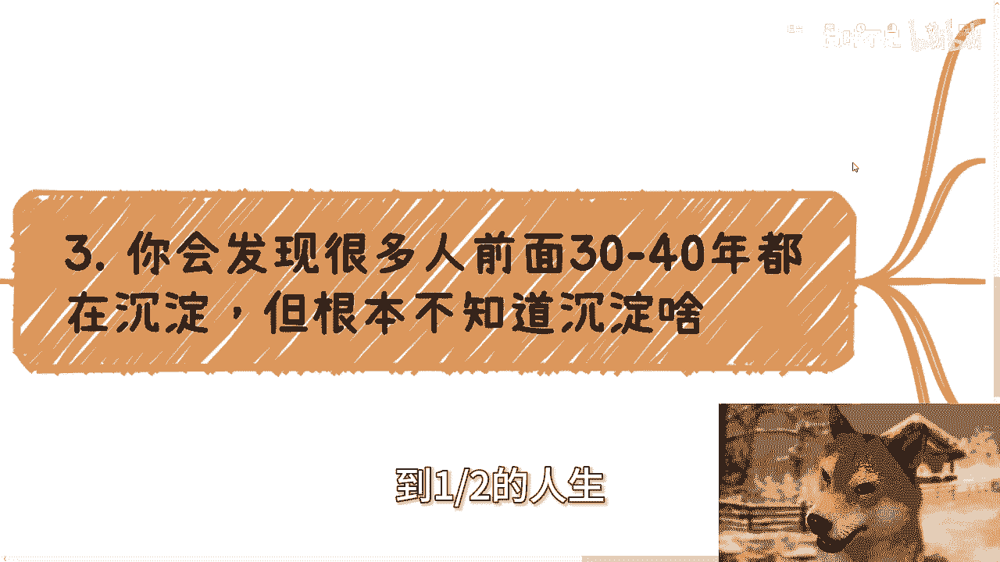
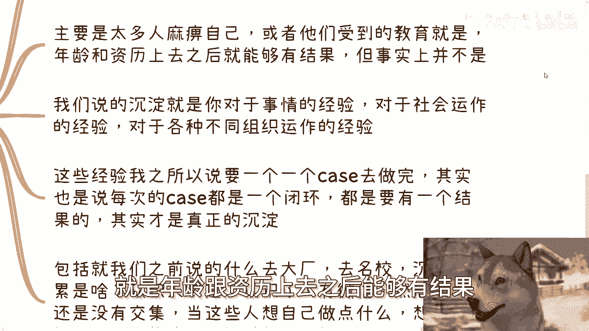
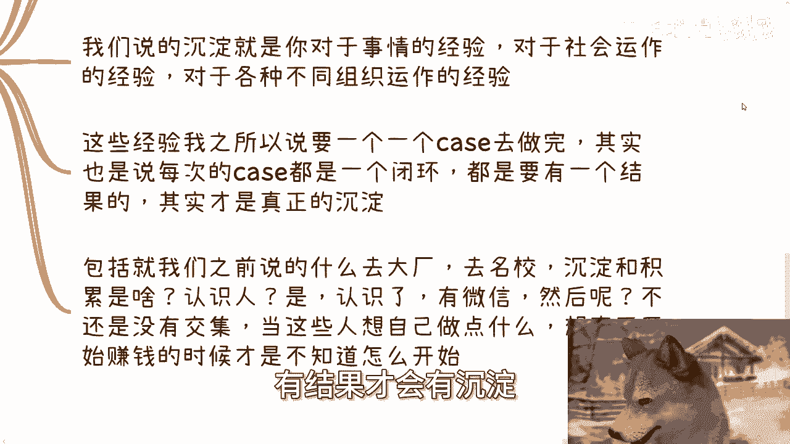
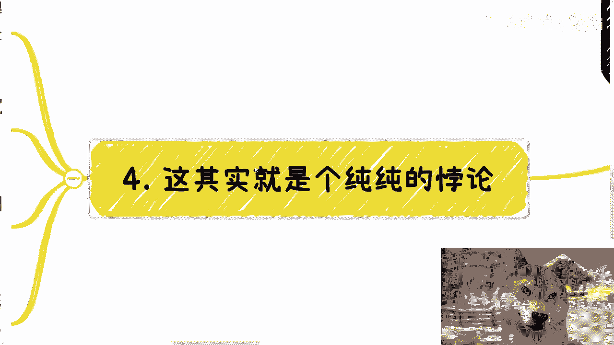

# 打工和赚钱的断层9：一个永远在沉淀积累，一个是通过结果去进步 - P1 - 赏味不足 - BV1hH4y1w7Bm

好大家好啊，我们今天来讲打工跟赚钱的断层九啊，呃关于沉淀跟积累的一个问题呃，然后首先下一期活动我也定了好吧，7月13号在南京，下午一点到八呃，一点到六点啊，然后内容主题的话一个是低空经济啊。

一个是我会给大家分析一下民企啊，国央企大厂外企当下就是入职的一些优缺点，以及未来的一些发展，然后最后呢会聊一下就各个企业当下数字化呃，改造或者说数字经济这边发展的一些机会好吧。

然后详情跟报名也可以私信我啊，呃然后今天这个东西呢是这样子的啊。

就是说很多人呢都在说要沉淀啊，要积累，要对吧，要要巴拉巴拉巴拉巴拉啊。

那么然后呢你就会发现你跟打工人沟通啊，就是他的所谓的沉淀铺垫积累是什么呢，就他们会告诉你，比如说读个书啊，比如说读个学历啊，比如说出个国，比如说找个实习，比如说做做个工作，比如说啊这个去投资啦对吧。

包括我下面写的什么找人创业啦，或者周围有什么各种各样他父母有什么关系，朋友有什么关系，找他们一起做啦，巴拉巴拉巴拉啊，反正就是说他们认为这种是沉淀式铺垫，是是啊，包括就是说去个什么学校啊。

去个大厂去积累一些人脉对吧，怎么样子，他们认为这些是铺垫，他们认为这些是沉淀啊，然后他们就会告诉你，为什么呢，因为现在没有经验，自己要有沉淀，自己要有铺垫，自己要有准备吧啦一大堆啊，但是本质上你会发现。

就是就这些东西听上去对不对对，但是本质上你我们就问啊，以上所有我们说的这些东西，我就问你，你准备了能得出个什么结论呢，能不能有没有任何明确的结果有吗，比如说你读了个书，有什么明确结果吗。

没有你读了个学历能得出一个什么明确结论吗，没有你出过国能有明确结论吗，也没有，你找个实习有吗，做个工作有吗，都没有，为什么，因为这些东西都是非常宏观，非常的就是就是粗的颗粒度的一些东西。

你任何细的颗粒度的东西都没有，你你你做个屁铺垫，你你沉个P级沉淀，你做个P积累，对不对，就是本质上你会发现这些人做的事情都是所谓，只是做一件事情。

没有结果啊，这就是最的一个地方，第二核心的点就是一件事情有结果。

也就是一个是有结果的积累，一个是没有结果的积累，就我们假设你从零开始到你定义赚钱，或者到你定义的成功是有1000步。

假假设啊，0~1000对吧啊，那么打工人的定义是我0~999，都是沉淀，都是准备，都是铺垫，都是积累，都是经验上的。

这个这个这个这个这个叫什么铺垫啊，但其实赚钱的人的定义是什么，是我每一步都要赚钱，只不过每一步赚的钱的多少不同，性价比不同，我每一步沉淀的东西，我每一步要去就是打破的信息差不一样。

了解的信息探索的上下游不一样。

这是两者的本质上的区别哦，那么你每一步都要赚钱才会有结果，才有进步，才有成长对吧，你赚钱可以多可以少，甚至你可能最终不赚钱，因为赚不赚钱不是你说了算的，但是你必须是奔着赚钱的目标去的。

因为这样你才是一个有结果。

有闭环的过程，这样才有进步，而不是我们一天到晚就在那边说啊，我要读个书，我要出个国，我要投个资，我要去跟别人创个业，然后什么很多人呃。

什么我身边有些人有关系对吧，有屁用对吧。

所以你才会发现很多人前面三四十年，就他相当于1/3的人参，到1/2的人参都在沉淀。

但他妈的他根本就不知道沉淀什么叉叉玩意儿，对吧，就很多人其实你会你问他，你诶你在干嘛，我沉淀啊，我要积累啊，我我在阿里，我在字节，我在拼多多啊，我要去，我要去大厂磨练一下。

我每次都会问你磨练磨练个什么呢，你磨练什么，你告诉我，你磨练之后有什么结果吗，有明确结果吗，没有明确结果，你就是赌博，你有什么好磨练的啊，他妈扯什么淡啊，在对不对，打工也是人际关系，也是实习。

也是读书，也是你问他们到底沉淀了什么，到底能干嘛，不都不知道。

都不知道，你包括我问他们，我说那你们成天干嘛呢，哦我们要能跳到更好的公司，什么公司，不知道你能我能干嘛哦，能赚到更多的钱，赚到多少钱稳定吗。

不知道，那在干嘛对吧，那主要太多人去麻痹自己，或者他们觉得受到教育，他们受到教育就是什么，就是年龄跟资历上去之后能够有结果。

但事实上并不是啊，啊我跟你讲，你年龄跟资历上去了，只会让你觉得你在浪费时间，你知道吗啊，我们说的沉淀就是你对于事情的经验，对于社会运作的经验，对于各种不同组织的运作经验。

这种经验是必须通过一个一个case去完成，去经历，你才会去学习到的，这你每个case都要有闭环，有结果才会有沉淀。

而不是说什么一天到晚说啊，呃就是说我们去什么大厂啊，去什么名校，然后我们我们什么什么认识一些人，你认识一些富二代有用吗，没有用的呀对吧，你沉淀和积累是什么，认识人是认识了有微信，然后呢，然后呢有交集吗。

还不是没有交集吗对吧，当这些所谓的名校的人出来，当这些所谓的大厂人出来，当自己想做点什么东西，想真正开始赚钱的时候，他知道怎么开始吗，他知道个屁对吧，他只能去做资本家的一条狗啊。

甚至他还不配做资本家的一条狗啊。

有什么用啊对吧，我跟你们讲。

这其实就是一个纯纯的悖论，就是真正能赚到钱的，做事的人其实就去做了，然后每次做了就会得到一个结果，然后根据这个结果来做调整，他们知道做事本身得到，结果本身其实就是准备得到结果本身就是积累。

得到结果本身就是沉淀，他要的就是个完整的过程，而没有赚到过钱的呢，就是不停的去恐吓自己，去去让自己产生恐惧，说啊我现在不行，我要沉淀，我要积累，然后自己什么经验都没有，然后等等等，有了才要去做。

才有积累，然后开始死循环，永远都不会有对吧，而且这两类人其实相互是沟通不了的，因为赚到钱的人，他不屑于去跟那些去沟通，而没有赚到钱的人呢，别人说什么，他们都听不进去，都觉得自己不行啊。

都觉得别人在骗他们，其实大家你你我还是那句话，你们可以多问问自己，你们自己如果现在就在积累，正在沉淀，那你们多问问自己，你们所谓的积累和沉淀到底是什么，就细节是什么，具体是什么，具象化是什么。

到底能带来什么明确结果，如果不能。

那么你们这个沉淀跟思考是需要打问号的，你明白吧，不是说你们沉淀跟思考不对，而是说你们得要具象化这个沉淀和思考，那么这样的话才会有真正的进步。

你否则你每每天在干嘛呢，你你就PUA自己说，哎我们在沉淀，我们在积累，你积累什么东西，到最后不还是什么都不会吗。

对不对啊好吧，然后7月13号好吧，南京活动我已经定了啊，然后就是了解详情的，或者还说要报名的，你们都可以私信我好吧，剩下的话就直接规划商业规划，股权期权分红分润啊，商业计划书和额，包括合同。

包括嗯白皮书，包括你们手上有什么牌，你们没有什么牌，你们希望通过跟我的沟通啊，希望通过我的视野，通过我的视角，能给你们一些更接近于地区的规划跟计划的话，那么你们可以整理好自己的问题和详细的背景。

