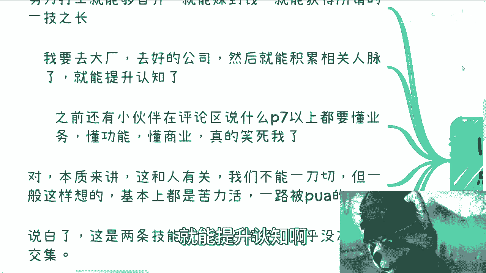
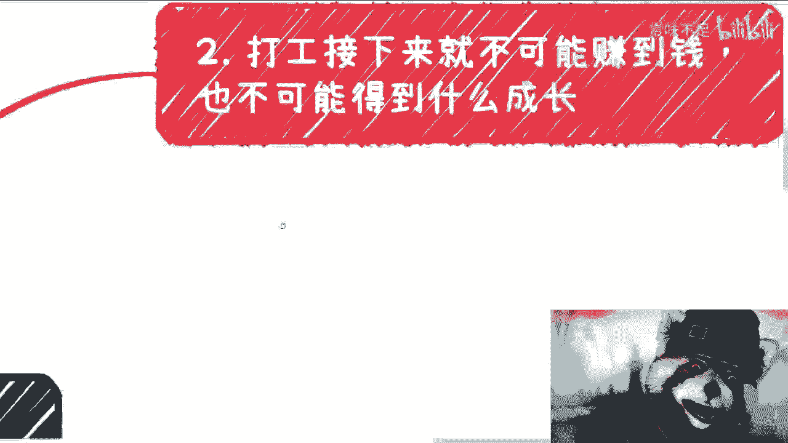
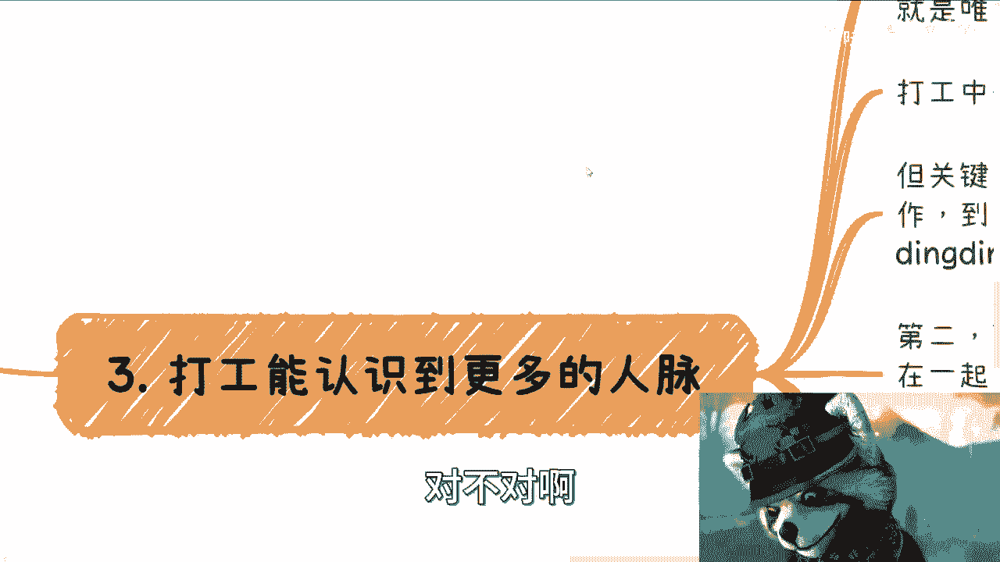

# 打工赚不到钱，也积累不了人脉 - P1 - 赏味不足 - BV1hr4y1f78A

哈喽大家好啊，我这个看到没有，这个美瞳，帅不帅，哈哈哈啊，这个最近咨询啊。

咨询有好多小伙伴跟我提到了什么呢，就是啊找工作啊，这个工作要不就是要不要找啊，然后找的是怎么样的一份工作对吧，然后那所有人都想稳定嘛啊也没毛病啊，那么在这个当中呢，沟通当中啊，我们就说啊。

就是呃打工啊能不能学习到赚钱的知识对吧，或者说打工能不能赚到钱，不能啊，还有很多小伙伴跟我说，打工能不能积累到相关的人脉啊，也不知道认识吧，积累啊，对吧，既然相关人们我告诉你也不能很简单啊。

呃我先在这地方提一点啊，你别拿个例来杠啊，这个其实本质上没什么很大意思对吧，因为所有地方都是有个例的啊，稍等啊，我这个小熊猫好。

我们先来看啊。

好多人这样的观点，第一呢努力打工就能近身啊，就能赚到钱，就能获得所谓的一技之长，不可能啊，你没有什么一技之长，你最多的一级之上就是拍马屁哈，就这么简单，你所谓的一技之长更多的要么拍马屁。

要么就是拧螺丝啊，剩下的你的这些已知智商根本换不来钱啊，就这么简单，第二我要去大厂，去好的公司，然后就能积累相关的人脉，就能提升认知啊。

也不可能啊，也不可能，第三之前还有小伙伴在评论区啊，在我这边就说什么啊，P7以上啊都要懂业务啊，懂功能，懂商业啊，我跟你讲，这个真的是笑死我了，这个往后再来说啊，对本质来讲呢。

我跟你讲这个东西跟人有关，我们也的确不能切，也不能一刀切对吧。

就你说有没有人啊，这个在大公司里面能懂得懂得有啊啊，有没有人能够这个在里面，比如说积累到一定人脉的也有啊对吧，但是问题是这能占多少比例啊，啊一般这么想的基本上都是苦力活，我跟你讲，就你会这么想。

就说明你基本上就是苦力活，一路都是被PUA过来的，不存在的，我跟你讲啊，因为为什么，因为说白了就是说你打工拧螺丝。

这条路跟你要去赚钱，这两条路所要的技能，所要的关系链所要的很多东西，他们几乎没有交集，这就是两条路啊，两条平行线啊，然后还有很多小伙伴跟我说啊，就是说他们小伙他们的朋友啊，朋友圈啊，一直在被人炫耀对吧。

拿到什么offer啦，怎么样子了啊，其实我跟你讲大部分的offer啊，大部分我不说那种特别牛逼的对吧，大部分的offer孰高孰低，它都在一个内部上，你明白吧，没什么区别的。

有啥可炫耀的人，50步笑百步干嘛呢对吧，实在我也搞不懂，就这些炫耀的人他妈意义在什么地方。

就你只不过就是个高级打工仔，你有啥好炫耀的是吧啊。

那么我们一个个来看啊，你说打工好，接下来就是不可能赚到钱，我跟你讲打工在接下来2023年往后，你别拿以前的东西来跟我讲，以前的东西已经一去不复返了啊，没有任何意义的好吧，你明白吧，就这么个简单的事情。

对吧那也不可能得到什么成长啊。

我们来看啊，首先你别拿2000年到2018年。

或者二零甚至2020年的事情来说啊，这是第一点，第二点，现在大厂是以前大厂吗，现在P7P8是以前的PPP7P八吗，对吧，你笑死人了，你但凡真的去了解过，就知道他妈现在水的多么水啊，这水的一塌糊涂啊。

啊要多水有多水啊，然后资本家现在什么情况，自顾不暇，打工人作为电池，你只能作为电池，你但凡有什么要求，薪资也好，或者所谓的成长也好，那我跟你讲，你作为电池，你就有点没有逼数，你懂吗，你那我跟你讲。

不好意思，对于资本家来讲，对于hr来讲，他嘴上可能不会这么说，但是本质上外面排队的人多了去了，你不问你不问问自己，你有啥资格提这些要求对吧，然后赚钱，什么叫赚钱，赚钱讲究一个性价比，而不是苦力哦。

你和我说，你你是一个年薪拿两，你你有一个年薪拿200万的package，可以啊，没问题啊，那请问一年你工作多久呢，请问这一年两百两百万的package，你能稳定多久呢，工作多久稳定多久，是你说了算的吗。

都不是对吧，你只不过就是个高级电池，你有啥可骄傲的呢，对吧，我觉得有人跟你们炫耀，你就跟他说，你有啥可骄傲的呢，都莫名其妙的，真的是说啊，明天太阳升起来，说让你滚，还不让你滚吗，是不是。

你别说2000分，那两个亿也得让你滚啊对吧，那以前经济好，已然就已经996007了，什么意思啊，意思就是说接下来只会变本加厉，你要连这个都看不出来，你还出来炫耀，那不是我跟你讲，不是傻就是坏啊。

就是故意的，啊还有另外一点呢，就别再来说努力这个事儿了，你就像之前李佳琦这个这件事情对吧，说难听点，你看啊普罗大众为什么会去冲李佳琦，就是因为普罗大众不是不努力啊，已经很努力了对吧，而且不但是努力。

而且还很苦，这才是你普罗大众会去冲李佳琪的原因对吧，但是问题是结果呢，我觉得就是个脑子的人都能明白，你如果努力和赚钱可以有因果关系，那现在早就均富了啊，会这样的啦。

不会的呀，为什么一定要自己PUA自己呢，对不对啊。

第三点关于打工能不能认识到更多的人脉啊，好我跟你讲哦，不好意思，这只是因为你不会自己去社交，你不会总结自己的优势，你不知道有别的方式，所以你PUA自己说，只有打工这一条唯一的选择的道路。

那如果你要这么说，那我跟你讲就没什么好讨论的了，那大家也别说了，你就按你自己想法去呗，对吧啊，打工中你能不能认识优秀的人，我跟你讲，或者说打工当中你能不能碰到优秀的人。

肯定能，那必然呢对吧，人家的确很优秀，但问题是这个地方有三点，第一你懂得如何跟别人认识，从认识到合作，懂得如何一起赚钱吗，你还是不懂啊，你要是只是加个微信，加个钉钉，很骄傲吗，没有用的对吧。

第二这些优秀的人懂得怎么赚钱吗，他们是懂得怎么赚钱呢，还是说大家只不过是在一起卷，只不过做了为了竞争，做一个更高级的电池呢，还是说一起去学习怎么拍老板马屁呢，如果这种人对你们来讲是优秀的人。

那我也无话可说对吧，第三在你真正明白怎么去识别人之前，你大概率会认为很多人都很优秀，但是我告诉你，当你慢慢慢慢去合作过，慢慢慢慢去做过商业之后，你就会发现那些真正你认为优秀的人。

到最后不过只会是变成一个让你厌恶，甚至拉黑的这么一个角色，为什么，因为他们跟你想的很不一样，而这些所谓的优秀只是存在于你脑补当中，就跟很多人谈恋爱是一样的，对方真的很你喜欢吗，不一定。

但你为什么要跟他谈呢，哦或者说对方真的是很优秀嘛，也不一定都是你脑补出来的，等了你等你不上头了，等你等你过了这么一个叫什么，就是就是甜蜜期了，你自然就会明白哦，这个人原来是这样子，不就这个原因吗。

哪里来这么多优秀的人，是吧，所以总结来讲能赚钱吗，不能那不能赚钱提啥起呢，大家有啥好炫耀的，没啥好炫耀的啊，对不对哦，一大群人，一大群人非要去挤着做高级电池干嘛呢是吧。

那关于P7P8以上懂商业这个事，我跟你讲，真的是可笑的，不能再可笑的，这就好像一个什么，你知道吗，关在一个现象坛里的人或者团队啊，你他怎么可能懂商业模式呢，怎么可能懂呢，所谓懂只不过是自己认为的懂啊。

你就拿以前的我就随便举啊，本地生活也好对吧，包括那个外卖也好，滴滴也好对吧，我们就拿以前所有的这些，已经有了大家熟悉的业务来讲，我就问你业务团队懂啥好，单纯业务产品可能懂什么东西啊，你无论给我拿开发。

拿产品，拿项目，拿，拿销售，拿商务单独拿出来，他懂个屁呀对吧，我就问如果单单独把这些人拎出来做个项目，他懂公司怎么开吗，他懂股份怎么分配吗，他懂客户怎么拓展吗，他懂合同怎么签吗，他懂利润怎么分吗。

他懂这个市场跟别人应该怎么竞争吗，他知道啥，他只知道他妈的给上面拍马屁，他懂个屁啊，这是莫名其妙的对吧，什么叫懂，什么叫懂商业，他得真正的自己从0~1做过一遍了对吧，而不是在里面。

就是他妈的上面给任务好，下面开始做，然后里面开始天马行空，开始开始自己给自己画饼，画了饼之后，最终还是要上面做决策，这懂什么东西啊对吧，他们认为轻松做很多的业务，业务很轻松。

他只不过是因为公司的BD跟sales，辛辛苦苦打下来，或者说公司公司的以前的很多业务，很多的关系积累下来，他是因为有公司的光环，有整个天时地利人和的红利对吧，是因为有很多的附加价值。

甚至我就说大公司对很多产业还有很多威胁，你跳出来试试看，你懂个屁，你懂唉，我他妈服了，真的是，我跟你讲，这就像钢铁侠跟美国队长说的对吧，你要么就拿着反应堆找个山洞躲起来，假装很和平，你要么就冲出去干啊。

别最后跟一些家专家一样，就是寄不出去干，既不冲出去干，又躲在山洞里面，狐假虎威，还嘲笑老百姓说，哎这个你们怎么这么对吧，哎这个东西你们都不懂，哎呀我们都很懂哈，那我跟你讲，这就不能忍了啊，还是那句话。

你只要在大公司里面啊，你只要在象牙塔里面，请你自己刻客观的评价你自己的定位，无论你多苦，也无论你多牛逼，赚多少多的钱，就个人能力来讲，你只不过就是躲在向量，向量塔里的一个电池而已，好吗啊。

然后如果有人跟你们炫耀，你们就这么跟他跟他讲啊，就这么简单啊，有啥好骄傲的，妈绝了，绝逼了，真的是。

啊好第五点啊，个例有没有有多不多，当然也可能很多啊。

但是我们来说这一点啊，我做事情原则一直以来都是如此的，就是我可以赌博，但是做任何事情，虽然啊做任何事情都有运气一说，但是你方向要对。

什么叫方向也对，就是我可以去博，我能不能赚到更多的钱，但是我不可能在打工的职场上去搏啊对吧，因为你在打工职场上直播最多的比例就是打工，你反而说你想赚钱，这方向本身就不对，你赌什么东西呢，对不对啊。

然后永远都会被别人用个例来PUA跟你说，哎这个某某人赚了多少钱，某某人怎么样怎么样怎么样，然后你说好，我也要充有意思了，没有意义的呀，或者你拿这些按个例来反驳我，有意义了也没有意义的呀。

你除了对自己影响你自己以外，你影响到我吗，你也影响不到我，跟我有什么关系呢，对不对啊。

所以说本期视频要告诉大家是什么，经济下行，资本家不可能去在意打工人，他不可能去care你啊，也更别去妄想赚钱或者成长了，因为只不过都是干电池罢了，用完换就是了，大家都是标品，你明白吧啊。

这就好像很多人跟我说，哎我现在去学夹板怎么样，我现在去学什么东西怎么样，没有什么怎么样，你学出来就是个标品，我管你性别是什么，个人擅长什么，喜好是什么，你想怎么成长，关资本家屁事啊，对不了。

同时你要不要赚钱，就是看个人选择，而不是说随波逐流的去碰运气，你要是想赚钱，你就好好去赚，好好去探究怎么赚钱对吧，你别跟我说，爱吕老师，我想赚钱的，但是我又要去打工，那你就好好打工，你好好去卷。

卷不动以后别来找我，你也别后悔，就这么招来无解，对不对。

啊然后同样的啊，我咨询当中也碰到过很多人跟我说，他说我其实是会折腾的啊，我其实是会来事的，我都是这么说的，我说你会不会真的跟来顺，不是靠你说的，也不是靠你感觉的，我就这么说，你如果是一个二十七八岁的人。

你会不会折腾，会不会来事，我从你现在做的事情上面，我就能知道你会来，这早就会来了，你会折腾也早就会了，你不会因为跟我聊过或者看过我的视频，才会不会的，你懂吗，哦那么反过来说，你说你以前不会。

是不是未来就不会，那当然也不是，但是你要明白一点，就是说你可能没这个天赋，你如果真的要去做，你就得付出，你就得选对方向，就往下面付出足够多的努力，或者说你得付出足够多的努力去博，你能不能选对方向啊。

但是千万不要自己去PUA，自己说，因为我足够努力，所以我就一定能得到某个结果，没有的哦，你最后只会越来越抑郁，越来越三观崩塌，我就这么告诉你好吧，哎呀行，大家就当娱乐了啊，我反正没啥事。

我待会儿准备出去吃饭，好吧行了，就这么着吧好吧，然后反正一样的，大家看看叫什么，这个有什么副业对吧，或者自己有什么牌可以打的啊，或者说需要我帮你们整理怎么打的，或者说想要知道。

想要从我这里了解更多的这个商业的运作逻辑，或者这个世界的运作逻辑，你们可以整理好问题，然后私信我好吧，我们可以走咨询好，一切随缘啊，随缘啊。

