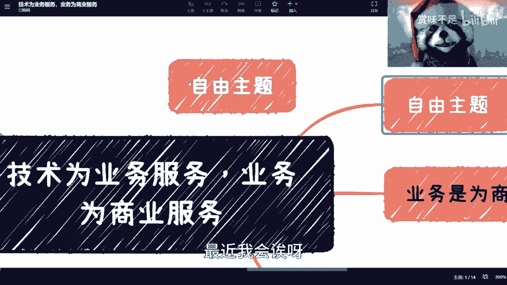
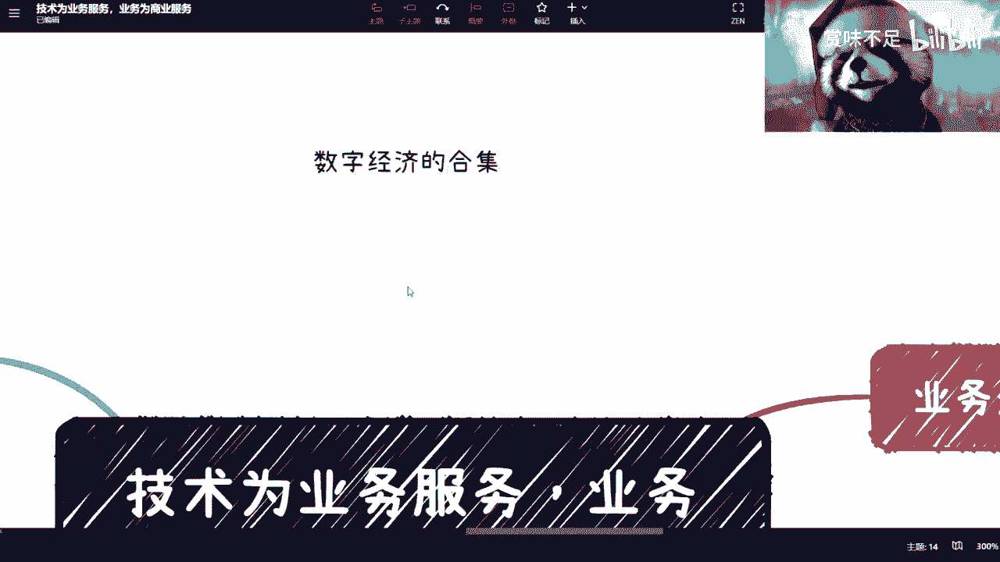
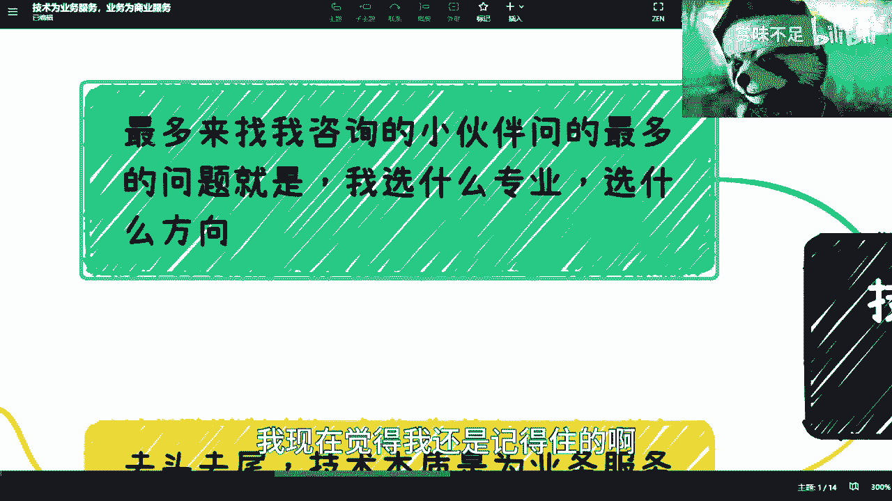
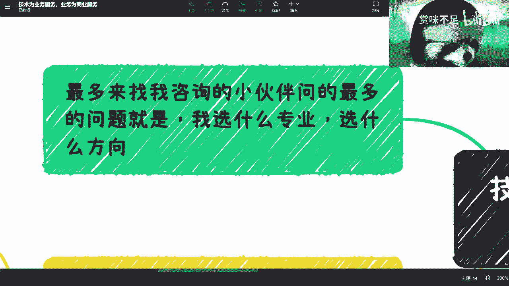
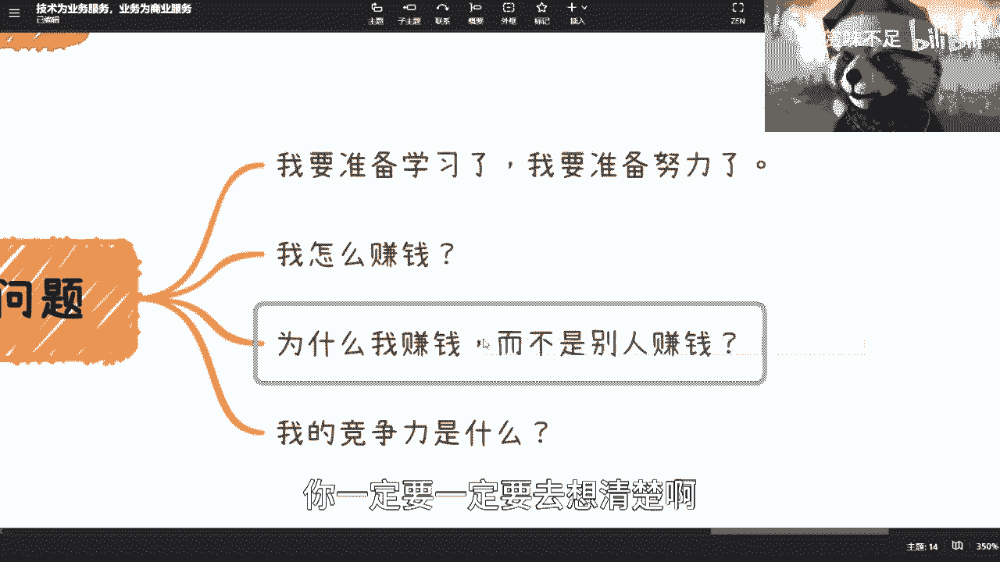
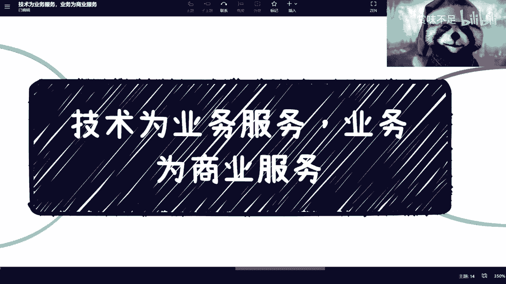

# 课程 P1：技术、业务与商业的关系 🎯

在本节课中，我们将要学习一个核心的商业认知框架：技术如何服务于业务，而业务又如何服务于商业。理解这三者之间的关系，对于规划个人职业发展、评估商业机会至关重要。我们将通过简单的概念和例子，帮助你建立清晰的思考路径。

## 概述：金字塔式的服务关系

上一节我们介绍了课程的主题，本节中我们来看看其核心结构。技术、业务与商业三者构成一个自上而下的服务金字塔。

*   **技术为业务服务**：技术是实现业务目标的工具和手段。
*   **业务为商业服务**：业务是一套逻辑和流程，其成功最终需要通过商业（盈利）来验证。

这个关系可以概括为一个简单的公式：**技术 → 业务 → 商业（盈利验证）**。理解这一点，能帮助你在做任何决策时，抓住问题的本质。

## 第一部分：技术是业务的工具 🛠️

首先，我们需要明确“技术”的定义。技术并非单指编程写代码，它是一个宏观概念。所有那些能够讲出方法论、有具体操作体系的技能，都可以称为技术。

技术的核心价值在于为具体的业务服务。它本身不是目的，而是实现业务目标的“USB接口”——即插即用，按需选择。

以下是关于技术学习的三个关键点：

1.  **专业选择并非决定性因素**：选择计算机、金融或医疗等专业各有优势，但这并非成功的唯一路径。技术的本质是工具，关键在于你如何运用它服务于业务。
2.  **技术提升理解力与学习效率**：学习技术（如计算机基础）的主要目的，是构建一个理解世界的底层逻辑。这能帮助你更快地学习新事物（如GPT、AI），并透过现象看本质，识别其能解决的实际问题。公式表示为：**技术底子 → 更强的学习能力与洞察力**。
3.  **技术与业务需同步了解**：要想具备竞争力，不能只懂技术。你必须同时了解业务，这样才能判断在特定场景下，应采用何种技术最为合适。这要求你具备双向的认知：**懂技术，也懂业务场景**。

## 第二部分：业务需要商业验证 💰

上一部分我们明确了技术的定位，现在我们来探讨业务的下一环。业务本身是一套逻辑和流程，但它是否成立，必须接受商业世界的检验。

我们可以用一个比喻来理解：拥有顶尖的刷墙技术（屠龙之技）是基础，但你必须找到需要这项高端服务的装修业务（龙）。如果市场上没有足够多愿意为此付费的客户（屠龙之技无龙可屠），那么这项技术和业务逻辑就无法形成闭环。

因此，业务的最终目的是服务于商业，即创造并验证可盈利的模式。**商业上的成功（赚钱）是验证业务逻辑正确与否的核心标准。**

## 第三部分：给决策者的三个自问清单 ❓

在理解了“技术→业务→商业”的框架后，无论你是在规划学习、求职还是创业，都可以通过以下三个问题来审视自己的方向。

以下是你在做任何重要决定前，应该反复问自己的问题：

1.  **我如何赚钱？** 你必须能用清晰的逻辑说服自己盈利模式是什么，不能自我欺骗。
2.  **为什么是我赚钱，而不是别人？** 你需要思考自己独特的优势或商业逻辑所在。
3.  **我的核心竞争力是什么？** 注意，核心竞争力必须是能在商业中直接创造价值的点（例如：独特的解决方案、稀缺的资源），而非单纯的学历背景（如“我是清华毕业的”）。因为商业逻辑不会仅仅因为你的毕业院校而成立。

## 总结与建议

本节课中，我们一起学习了技术、业务与商业之间的服务关系。记住这个核心链条：**技术是实现业务的工具，业务需要通过商业盈利来验证其有效性**。

在做任何规划时，请务必用“如何赚钱”、“为什么是我”、“核心竞争力是什么”这三个问题来拷问自己的计划，确保思考落脚于可验证的商业现实。避免陷入空泛的技术学习或业务构想，时刻以最终的商业价值为导向。

希望这个框架能帮助你更清晰地进行职业与商业决策。每个人的具体情况千差万别，关键在于将这一普适逻辑与自身的独特经历和资源相结合。