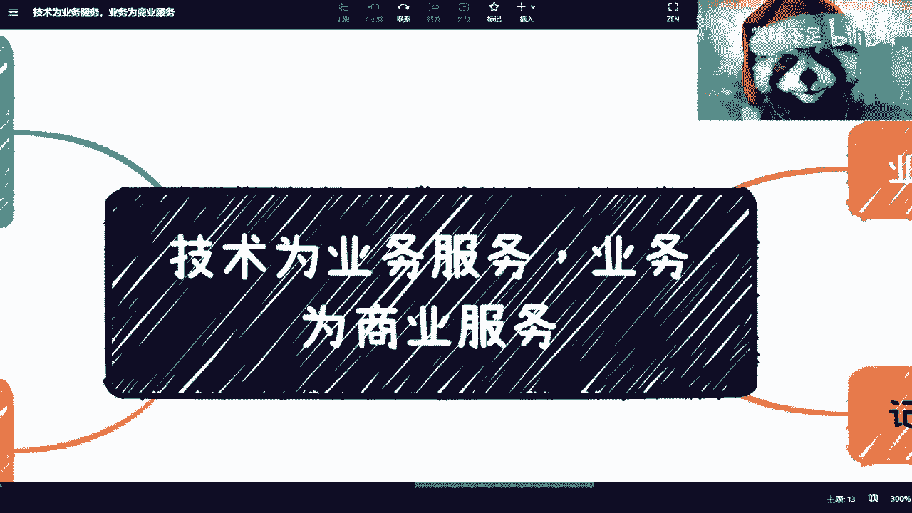
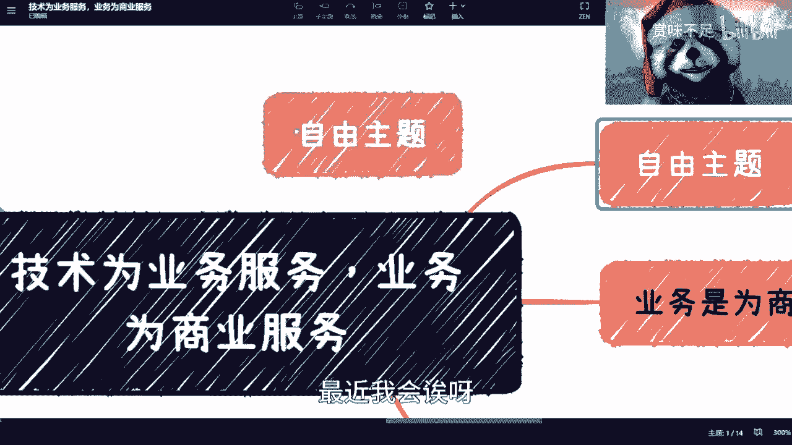
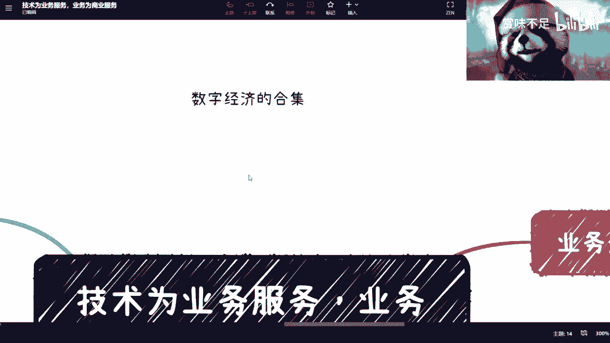
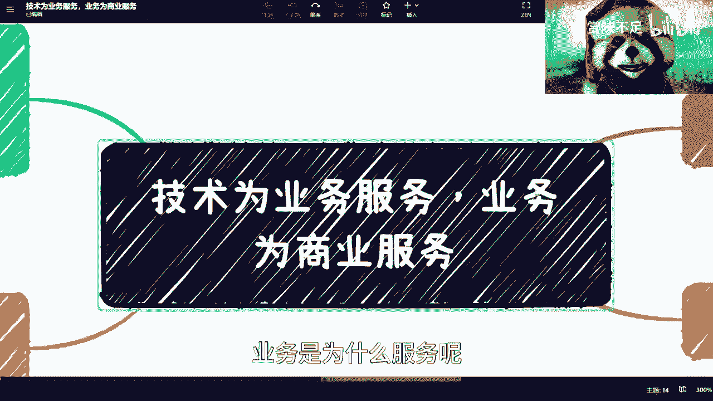
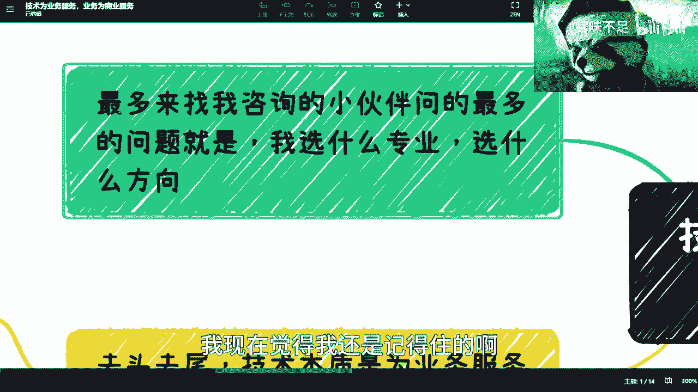
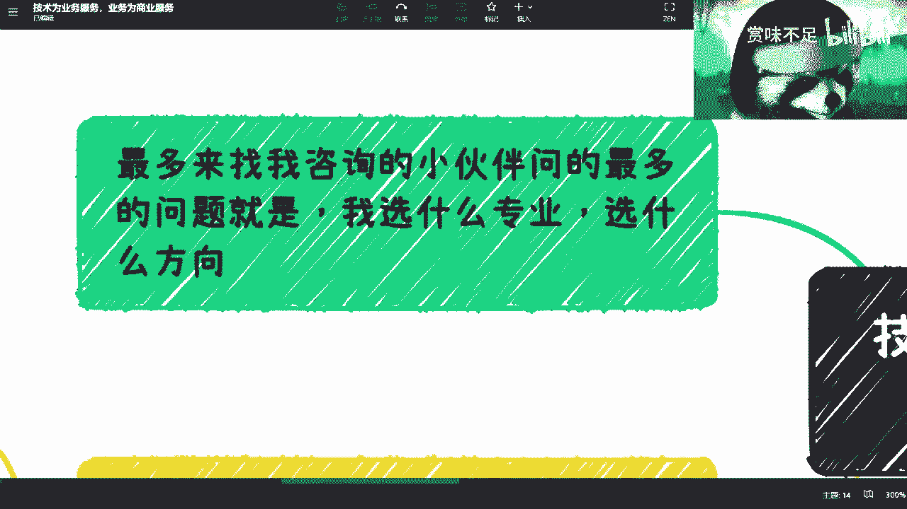
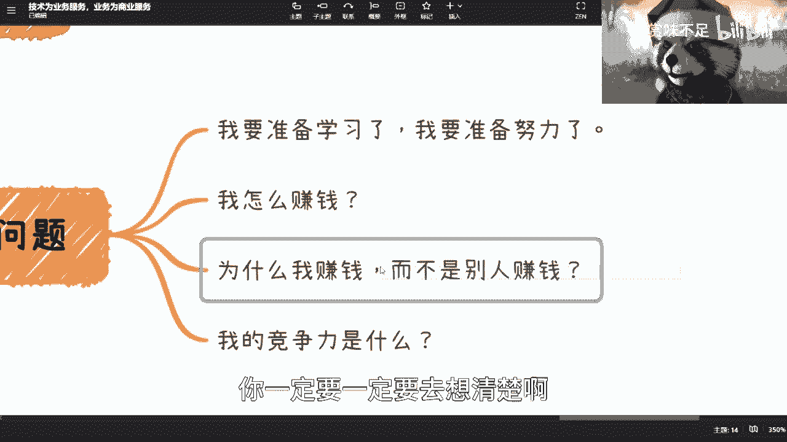
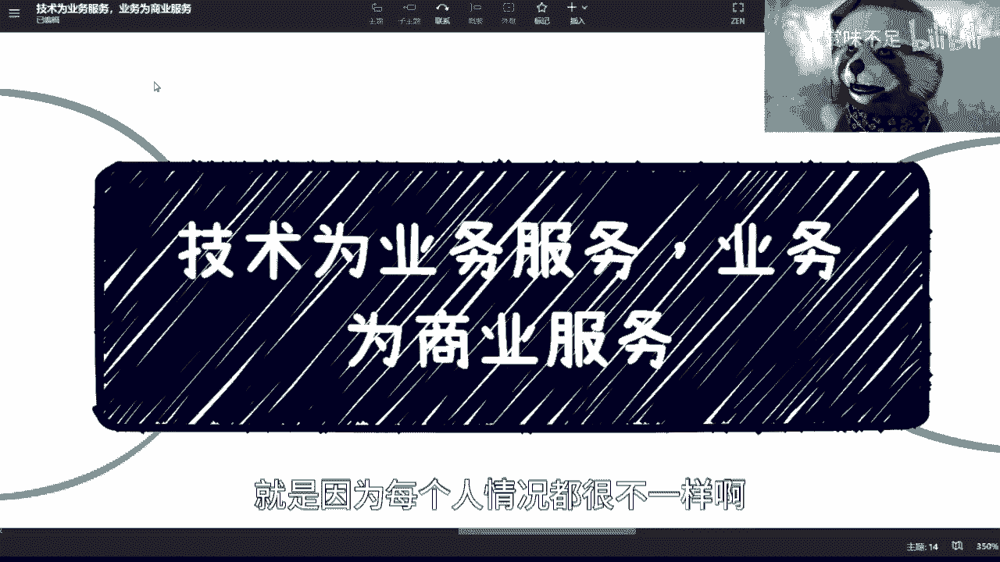
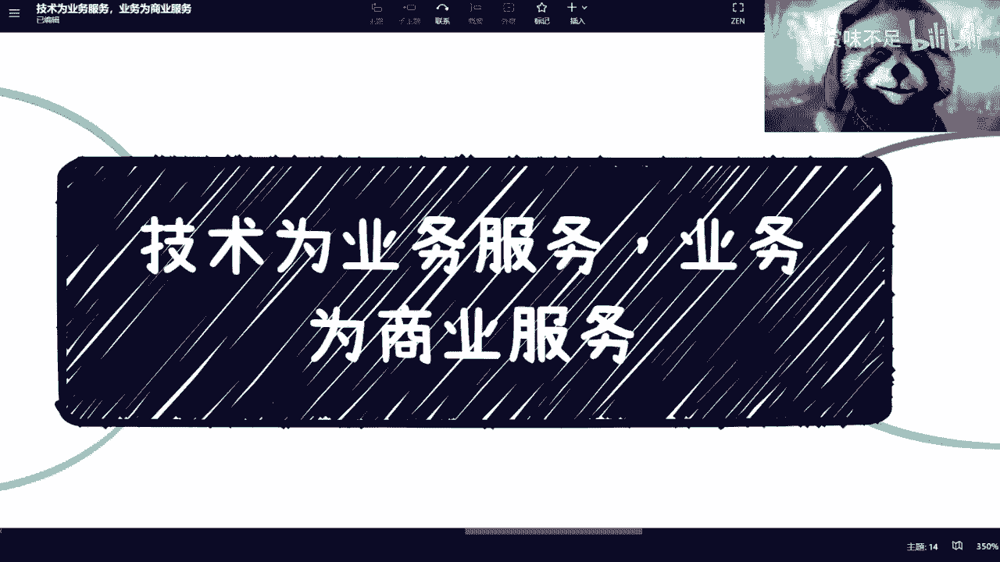

# 技术为业务服务，业务为商业服务 - P1 - 赏味不足 - BV1z24y1E75U

好大家好啊啊，最近我会诶呀。

最近我会那个持续更新那个，数字经济的那个合集啊，嗯数字经济的合集对吧，就大家可以多关注关注，因为嗯怎么说呢，就是说我们去讲现在的情况，就更多的让大家明白，现在的情况和一些商业上的认知。

我觉得的确是很必要的啊，但是就是说我们也得了解下一代的这个情况嘛，对吧，下一代互联网啊，包括发展啊，所以说这个数字经济是很重要的。

这个呢这一期呢我主要是来讲一下，就是这个观点啊，这个东西呢我觉得是大家必然一定要明白的啊，当然你们可能现在不明白，或者我讲了呢，你们也不明白，但是我觉得并不重要，这个毕竟整个社会金字塔还是要往上。

从上往下走的嘛对吧，那我是觉得反正能明白多少人算多少人吧对吧，呃核心是什么呢，就是你们一定要记住啊，首先技术这个东西啊，它是个宏观的东西，它不是说只有开发写代码才叫技术对吧好。

那么呃你们想想看这个网上也好，或者线下的很多业务也好，所有那些能够讲出点道道的对吧，讲出点东西来的，其实我们可以统称为技术对吧，也不是说只有代码啊，那么但是不管是什么东西的技术呢。

我们这个核心点啊来讲就是技术为什么服务呢，是为业务服务的，一定要明白啊，业务是为什么服务呢。

为商业服务的啊，什么意思呢，我们来看啊啊首先哎我这个一写的有点多余啊，我本来以为我这个脑子记不住对吧，我现在觉得我还是记得住的啊。

还没有老年痴呆呃，这个首先呢最近找我咨询的小伙伴啊，问的最多的是什么呢，就是我选什么专业，选什么方向，我跟你们说没有用啊，有什么意义呢，没有意义，随便你们选啊，随便你们选关系不大啊。

当然就是说呃我还是偏向于选这个互联网啊，计算机相关的啊，但是你说卷吧也是卷嗯，嗯但是哎优势嘛总归还是有一定优势的啊，当然了你也可以选一些硬专业对吧，比如说什么金融啊，医疗啊对吧，也也也可以啊。

但我觉得这个不是重点啊，不是重点，重点是什么呢，就是从金字塔上下来讲啊，我们去掉最优秀的啊，最最顶最顶端的对吧，反正我是做不到最顶端啊，我做个尾巴可以啊，就去头去尾是什么呢。

就是技术的本质是为业务服务的工具啊，也就是说技术本身啊，技术本身就是说啊这个它就是一个usb对吧，usb那么这个时候呢我们说啊，你比如说你比如说你说未来啊，你你这个工作了一段时间啊，那么你想去做业务啊。

那么我们说你到时候去选择，你说我要我要用什么技术，那么很简单，你要用什么对吧，你到时候就对应的去找，比如说你你说招什么人对吧，用什么样的服务公司对吧，用什么样的外包公司对吧，这个是你的商业逻辑呃。

这个是你的业务逻辑对吧，这不是说呃你的业务逻辑绝对不是说好，我今天想要去做ai了对吧，好我要去学习ai，我明天要去做这个这个大数据了，我要去学大数据，我真不认为说大家能够学这么多啊，首先这第一点。

第二点是你学的多了，其实你也不精对吧，没有意义的啊，就是呃这是一方面，第二方面呢就是说技术的重点，我为什么一开始说，我可能还是比较偏向于，大家可以去学点计算机啊。

是因为技术的重点是在于能增加你的理解力啊，就是说你不见得要多精，但是你有拥有你的技术底子之后呢，你能够去增加你去学习新东西的一些效率对吧，就比如说今天因为时代是变化的嘛对吧。

你比如说你要去学习gp t对吧，回来或者你要去学习这个matter啊，会学习别的东西，那么你拥有技术底子去看一个东西，你是可以就是透过表面去看一些本质的，但如果你没有技术底子，你可能很难理解这个东西。

你也很难发现它的这个这个这个比如说痛点啊，或者到底能解决什么问题啊，我觉得这个是核心啊，那么第三点呢就是说业务的重点是什么呢，就是你你我为什么会跟很多人说，我说你学了技术以以后呢。

你还得去学更多的业务对吧，你也得去了解业务，为什么呢，因为业务的了解性，是为了最终让你去知道用什么样的技术核实，对吧，就是就是你但凡想要说我跟就是大部队，不不跟大部队一起卷。

你想有一定的这个这个叫什么就是竞争力，那么你就必须技术跟业务两头一起抓，当然我说抓的意思是说你得去了解，不是说你就很精通对吧，你不可能每个人对所有的技术，所有的业务都很精通啊，但是你了解之后。

你就会明白，就是说哦，我到底当下用什么样的技术是最合适的，或者这个技术在当下是不是最合适，就是说去发展对你会有一个自己的判断，那你总不能什么都问我吧是吧，我就发现我现在就是个gt，你知道吗。

我jpd我稍微jpd还比我稚嫩一点是吧啊，然后这是第一个啊，然后第二个呢就是呃业务是为商业服务的，什么意思呢，就是说我们不是考虑了刚刚那些问题啊，好那么业务本身呢，其实你会发现它是一套逻辑关系对吧。

你比如说你说好，我觉得洗脚城啊特别好啊，这个这个我昨天给别人举例子，我昨天这个咨询啊，跟别人举例子，我说我怎么说来着，我说啊对他说油漆工啊，他说油漆工装修对吧好我说这样子的，我说你想啊。

技术就好像什么呢，是就好像对于这个油漆和油漆工对吧，你用了什么化学材料啊对吧，怎么样才能这个这个更好的去去环保啊对吧，怎么样这个油漆刷了能够不，你看上去很平顺啊对吧，我说这个是你的技术啊。

你记住这个是你的技术，但是呢就是说技术是为了业务服务的，什么叫业务服务的，就是说你一定要有这个对应的业务对吧，还是说是做这种精装修呢，还是说是做什么呢，就是说你在业务层面你得有一定区分。

因为你一套好的技术，不是所有人，就是我们说屠龙之技啊，你手上有一个屠龙之技，比如说全球就你一个人啊，比如说有十个人刷墙，刷的特别好啊，非常的平顺，没有第11个人的，但是问题是你的价格肯定很高啊对吧。

你说你说啊一个有打个比方，一个油漆工，打个比方，一个小时是这个100块钱对吧，你说好，我一个小时1万块钱，那问题就来了，全球是所有人都付得起一个小时1万块钱吗，那肯定不是吧对吧。

但是问题是总有人会为了你这个技术去付钱的，对不对，好，那么我们称之为这种叫屠龙之技，但是问题是你的屠龙之技，世界上有这么多龙吗对吧，这是我最大的问题，而且我们从事实角度来讲，世界上没有这么多龙，对吧好。

那么这个时候你就会发现你需要有一套业务，那个逻辑关系支撑，你用什么样的技术，但是问题是你知道逻辑关系怎么去验证呢，你总不能说啊，我说的很有道理啊，你听上去也很有道理，这就是一个很有道理的东西。

肯定不是对吧，你要去验证怎么验证呢，你的逻辑关系验证就是需要通过，你看你赚不赚钱对吧，就好像我今天跟你说，我说好，你的屠龙之技很有用，那你肯定要去试对吧，愿不愿意买单，如果愿意买单好。

整个业务逻辑是成立啊，又逻辑成立的，如果不愿意买单，那就是渣渣对吧，所以说我觉得这个呢是本身核心啊，所以说呢就是说你的技术为业务服务，业务为商业服务，技术跟业务你都了解之后，你最终需要用商业去验证啊。

当然了，就是说有很多人说，他说你不能所有东西都朝前看啊，我跟你们讲，不是说你们的这个这个思想都要朝前看，是因为赚不赚钱，本身是验证你的思路正确与否的一个结果对吧，好那么我们往后往后。

你比如说你们所有的这个人，去考虑一个问题的时候呢，你们就记得问自己几个问题好吧，问自己几个问题啊，第一个呢就是说你说我现在准备努力了啊，我要考研了啊，我要出国了啊，我要准备努力学习了啊，你就问几个问题。

无论你们做什么，第一点就是你怎么赚钱，好记住你怎么赚钱，你一定要事先说服你自己啊，你不能这个p u a自己的，就我就说你得逻辑上说服你自己啊，你怎么赚钱对吧，第二就是说你第一个问题说服你了好。

第二为什么是你赚钱，而不是别人赚钱，而不是我赚钱，你要想清楚啊，为什么是你对吧好，那这个背后肯定有一定的商业逻辑对吧，这个我就不多说了啊，你们肯定自己也不会跟我讲对吧，这你们的商业秘密啊。

第三就是说你的竞争力是什么，对吧好，但是这个东西考虑的时候，我你记住啊，一定不要pua自己，也一定不要去框自己，什么意思呢，我给你们举个例子啊，就是说你说有很多人会说你的竞争是什么。

你说我的竞争是985211啊，你的竞争力是清华北大，这个不叫竞争力，因为这个商业逻辑是不成立的，为什么，因为没有一个业务逻辑和赚钱逻辑，是因为你是清华北大毕业的，所以你赚钱了，哪里有这种逻辑啊，对吧啊。

然后为什么是你赚钱，不是别人赚钱，你一定要一定要去想清楚啊。

所以说呢就是说呃你如果但凡想清楚了，你就会明白今天的这个主旨啊，你就会明白今天这个主旨啊，ok那我觉得反正这个东西呢，就是说还是给大家提个醒，反正如果你们有，我还是回到那个问题，你们有任何细节的啊。

就是个嗯我觉得不一定要直接发展，就可能更多的细节符合，就贴合你们自己发展和自己的这个，这个历史上的一些积累的，你们想要问我的，我觉得就是还是走这个呃咨询会比较好一点，因为基本上我这两天做的咨询呢。

就是聊的话都聊了一个多小时，两个小时，就是因为每个人情况都很不一样啊。

都很不一样，好吧行。

