# 技术人员在当下互联网大环境下的发展方向 - P1 - 赏味不足 - BV1H24y147dp

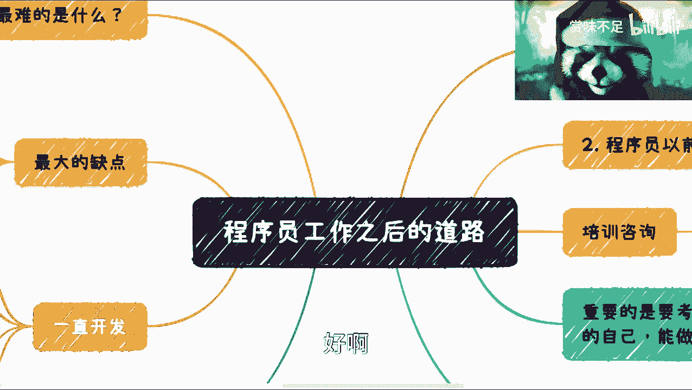

好啊，那这一期的话呢，来讲一下这个程序员后面的这个事啊，因为我看到呼声比较高，所以我把它优先之间提上来呃，然后呢就是我说先之前在今天讲之前，我先说几个事啊，因为大家看到今天这个图特别复杂是吧。

我很久没想没做这么复杂的图了，首先这几个问题，第一个问题是前两天我们说互联网这个事对吧，然后呢有朋友评论是这么说的，他说互联网呢电动车的确增加了效率啊，也也也节省了这个大众的这个叫什么。

就是啊这个成本对吧，对没有错啊，你单从结果上来讲是这样子的，但是我一定要让你明白一件事情是什么呢，就是我要表达的点是在于说你的这个说法，就好像说今天我们古代出现了疫情对吧，你跟我说你救了100万人。

然后呢你就跟我炫耀这100万人对吧，却不告诉我你在背后到底花了多少的成本对吧，其实就这么个点对吧，你跟我讲的是一个结果，OK这结果我认同对吧，但是你后面其实破坏了非常多的资源对吧，甚至是叫做得不偿失。

那你跟我讲这么多，何必呢对吧。

我觉得但凡有点脑子的人，应该都能明白这个道理的啊，首先这是第一点，第二呢我说就是大家这个评论呢我都记着了，好吧，就是所有的这个呃点我都会一个，到时候再放出来说，但是呢就是有一些东西呃。

可能B站上也不是说非常方便啊，回头大家要是有兴趣的话啊，聊的话，你们也可以私信我对吧，就我们可以约个腾讯会议啊，聊会怎么样啊。

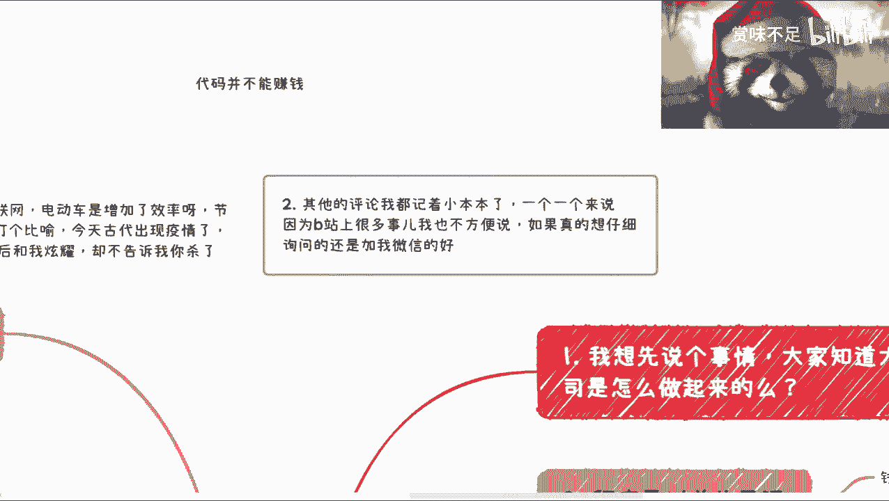

啊然后第三个呢就是说一下这个那个那个代码，就是之前呢我在我那个群里面当时有这么说过，我觉得大家每天都在讨论怎么赚钱嘛，然后呢我就跟他们说，我说你们别讨论了，代码并不能赚钱，然后就破防了。

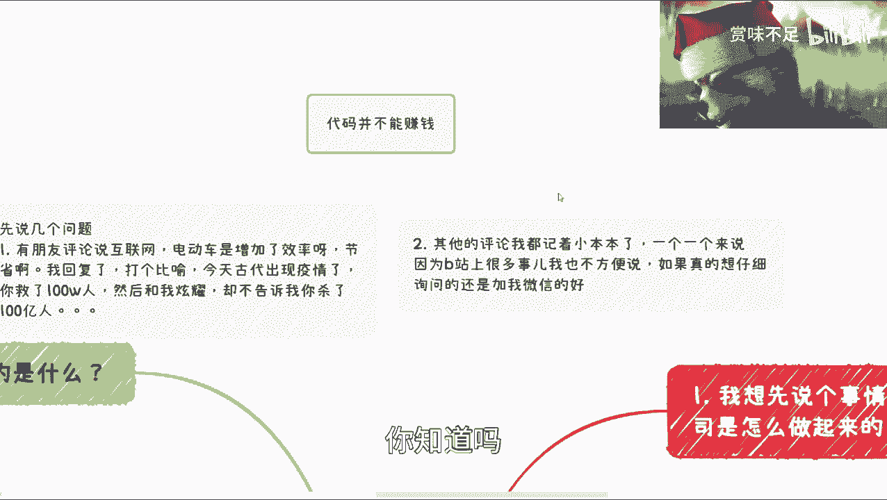

你知道吗，然后还好我是群主，否则他们就要把我踢走了啊。

然后是这样子的啊，就是呃我们因为太多了，我今天还标了序号是吧，我不知道今天这个录多久啊，就是呃我们看看有一个说嗯对我们一个说。

首先呃我要先说一个事，大家知道大的公司怎么做起来的吗，什么意思呢，我们举个例子，比如说BAT也好，京东也好，自己也好，你们应该知道大公司是怎么做起来的吗，就是我们说本质啊，本质对吧。

我们这边写两个，一个是大资本投入对吧，就是烧钱啊，我们这毫无疑问啊，第二个是什么无数的尸体对吧。

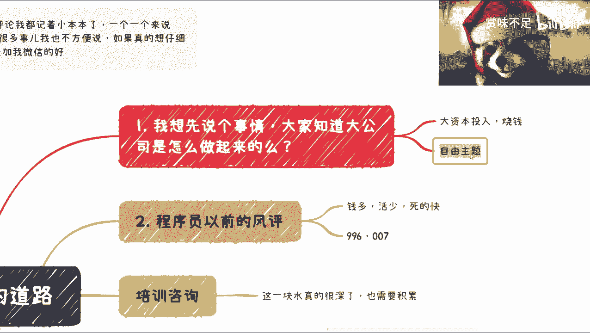

那很多人就慌了。

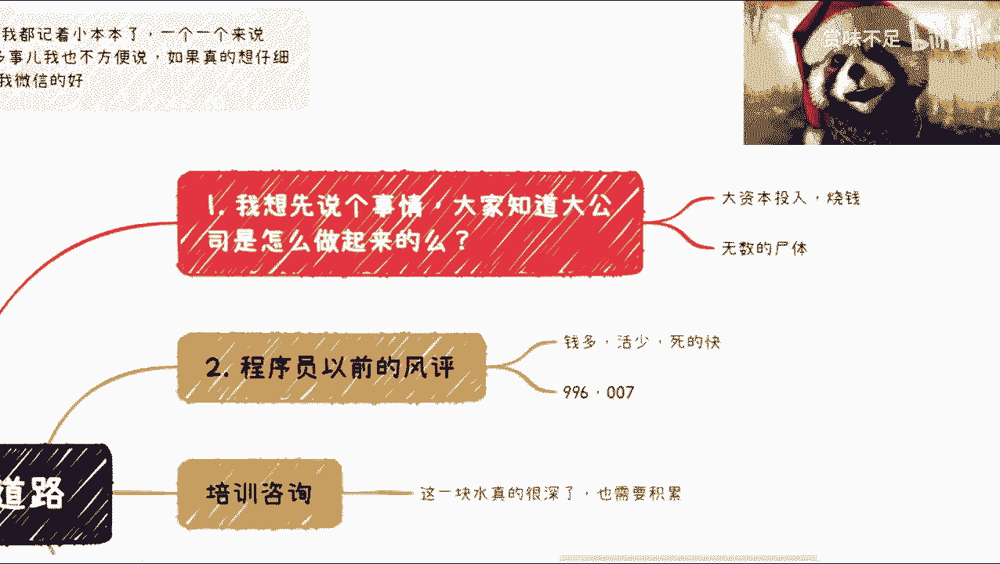

他说对吧，那你这个过分了是吧是吧，就是首先这个我觉得大家都应该明白，这个呢我觉得是这样子的，成就是本质上面的，我觉得是建立在大部分早期员工，或者大面积这种人海战术的这种健康上面啊。

无论是时就包括大部分的成本，无论是时间成本，身体的成本，精力成本，各个成本对吧，其实它背后是失存变，尸骸遍野的，这点100%的，否则他是不可能有这个帝国起来的，而无论哪家公司都是这样子的。

所以说呢我觉得我们看任何东西的时候，一定要去明白，就是说无论他今天多么光鲜亮丽，他背后永远是这样子的，对，这也是为什么我们都会说，资本家怎么样怎么样怎么样，这个是有道理的啊，好吧。

所以说我觉得大家得要辩证的去看，不是说啊不要说啊，这个陈老师说这样子，好像他就这个对大公司很不满啊，对吧就好吧，不是说只有零和一这么两个，就不是即黑非就非非黑即白的这么一个世界啊。

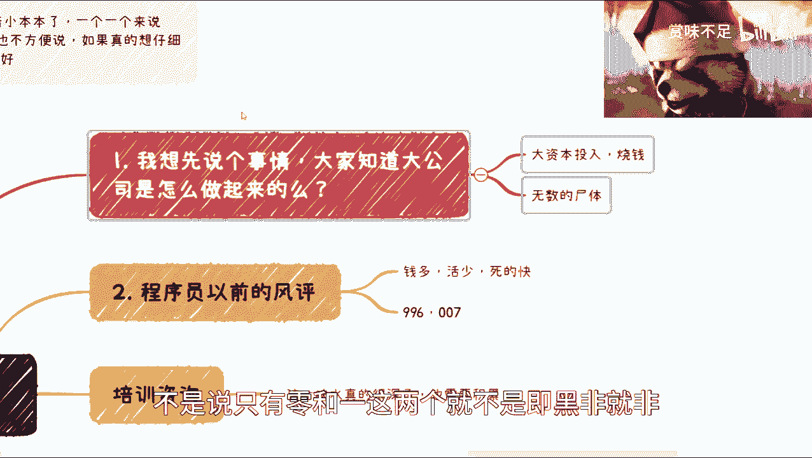

那这是第一点，第二点呢，我们来说一下这个程序员本身的风评啊，以前对吧，大家对程序员这个理解啊，其实大家也能看到对吧，钱多活少死得快，那我真不是诅咒大家，这个就大家都知道行业里面都这么讲是吧。

然后996007，然后呢，我觉得这个其实也代表着，就是说其实一方面呢，大众对于程序员本身的理解认知并不透彻。

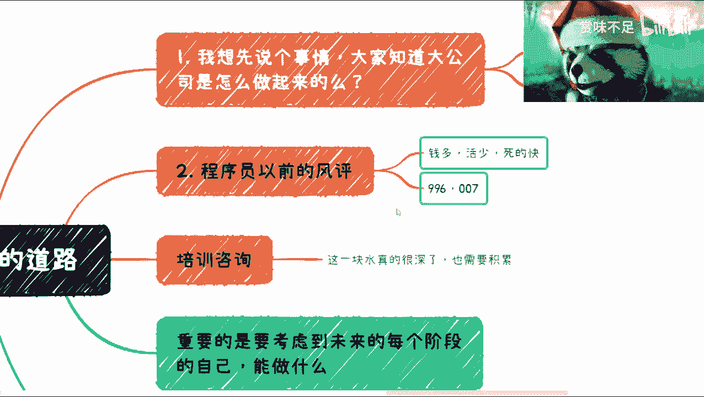

这就好像大家我刚刚说，就是有很多朋友看这个问题是一样的。

就是大家只看到了程序员的这个，20%的这个水上的东西，但是大家并不知道，那80%水下的情况对吧，人这首先这是第一点，第二点是什么呢，就是互联网发展到现在啊，啊我们说老一代程序员有吗，有他。

但是大部分的程序员两就算2000年开始，他到现在也就工作了，那么20多年，我们再往前算，他工作30年吧对吧，聊不起来，那么那么也就是说，其实大部分的程序员他并不知道，就是说在他的整个工作。

这个职业生规划规划当中到底会面临哪些情况，他也没有一个就是历史可参照的，这么一个好的这个规律啊，去做参考，那么这也是为什么当下其实到现在为止，比如说呃其实嗯就我昨天也跟我朋友说。

我说现在贩卖焦虑是没有意义的，为什么呢，因为大家现在就事实就很焦虑对吧，你但凡贩卖焦虑给他，他就会喷你，因为他已经很焦虑了，他其实知道哪些地方是真的焦虑对吧，所以说呢。

我觉得这个也是目前大部分程序员面临的一，个问题哦。

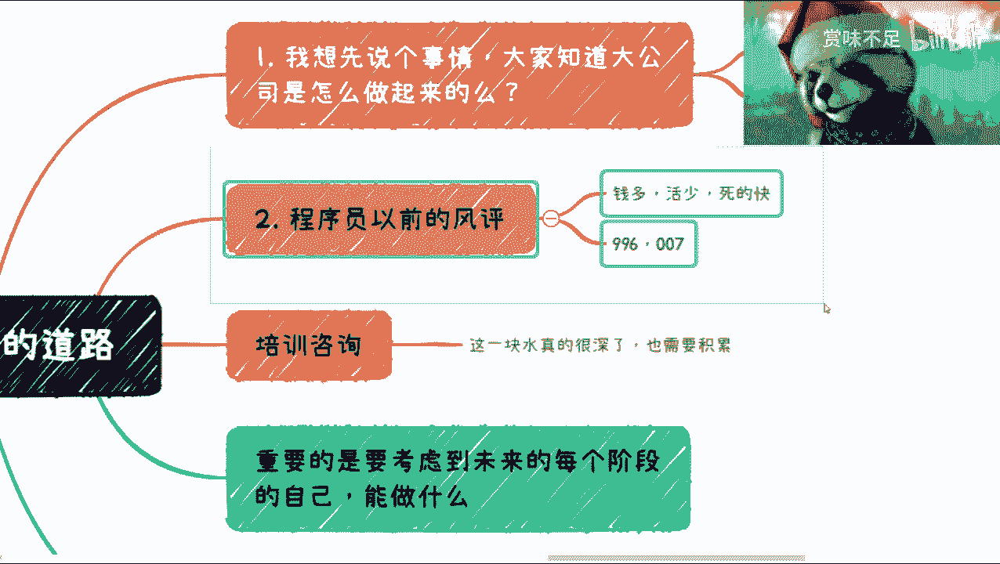

那么这是一个，那么我们来看第三点，那么关于程序员这边呢，其实还有很大的一个点是什么呢，就是我们都会说啊，就是说啊这个收入很高对吧，我们举个例子啊，比如说我之前跟别人讨论问题，他动不动就跟我说。

哎这个阿里怎么样怎么样对吧，百度怎么样怎么样是吧，呃这个这个什么一个岗位是七八十万的，七八十万算少的了是吧，我现在我现在这边有一些web3的岗位，他可以年薪两三百万呢，这算什么呢，你说是吧啊。

那我跟你们这么说啊，这些其实没有意义啊，包括之前还有个aw bs的朋友，就是亚马逊嘛对吧，AWS的朋友跟我提了一嘴，他说他说哎呀，我之前有个朋友跳槽啊，前年年底吧跳槽。

他说是double double package，跳到了好像也是另外一家云云云公司吧，应该是反正差不多跳过去之后，大概在200多万到300万之间啊，一个销售啊，一个销售，然后呢。

我觉得其实这些其实都不是什么很大问题，为什么呢，因为我回头我到时候会跟你们再出一期啊，就是什么东西呢，我会跟你们讲，我说你一个月普通人，比如说当下一个月你要去赚10万块钱，难不难不难，我跟你说。

你一个月赚20万都不难，那当然赚50万有点难啊对吧，20万都不难对吧，但是你知道难在什么地方难，再说，你要明白普通人什么叫普通人，普通人难是难，在说你跟我讲的这些数据，他要可持续性，可稳定性。

对你不要跟我说，你今天拿了个offer，什么100万，卧槽很牛逼是吗，没有用啊，你明白吧，就是你把你的职业规划拉长对吧，你你我说不好听点，你又不是只活30年是吧，你你说你在一家公司做做。

从25岁做到30岁，你拿5年，我算你一年100万好了对吧，所以打个比方，税后大概六七十万，六六十多万吧，对吧呃可能还不止哦，可能还没有，可能五十五五十五万到60万之间对吧。

那你那你比如说5年我算你300万好了，又怎么样呢，上海房都买不起是吧啊，那所以我觉得这个不是重点，重点还是你要有持续性稳定性对吧，那很多人你要说程序员钱很多，要求他的整个package很多，但没有用。

你知道吧，其实这个是最大关键点，而不在于你的package是多少，你知道吧，呃当然了，这个事情，我觉得就是大家这个每个人都年轻过嘛，所以说呃可能看待事情的这么一个角度，都都是一个循序渐进的过程嘛。

就是你一开始拿到这么一个高的派克，就你肯定很开心，对这也没错，那你肯定在，在当时你肯定是考虑不到这些事情的啊。

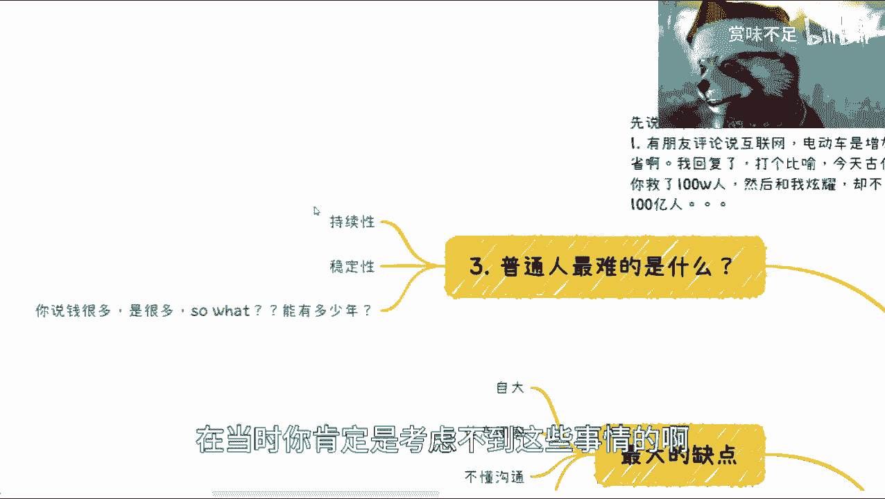

然后呢呃我看看四啊。

后面就无所谓了，我就随便说了啊，就是在这个地方我再提一点，就是也有很多人会说啊，他说他说啊，我来说一下我的职业职业规划啊，我比如说一年赚多少钱对吧，怎么样怎么样，但是啊就是我觉得是这样子的。

你一定要考虑普通人，还有一点要考虑什么呢。

你得考虑你未来的这个人生当中的发展，就是在这个地方啊。

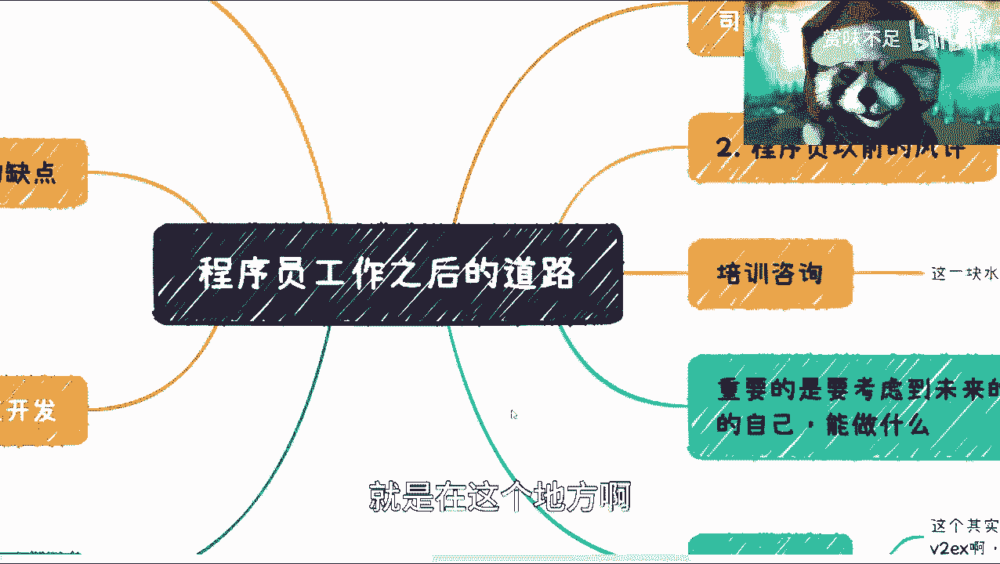

就是你得考虑的是你你未来的每个阶段的自己，你到底是什么发展，你能做什么对吧，因为你你我们这么说吧，你就算这一辈子不谈恋爱，不结婚，不生孩子对吧，好你的人人的这个身体的机能，你的学习能力也是有曲线的。

你总不能说啊，你七八十岁跟你20岁一样，那不可能的嘛，对不对，所以说其实你就是一开始年轻的时候，你拿着很大的package，我觉得没有问题，但是你得考虑的是你未来对吧，生老病死对吧，这个结婚对吧。

生孩子，买房子，买车等各种各样未来的事情，你得去考虑各个阶段你到底去做什么对吧，因为你的曲线不是一个一一个平的线，没有人能做到平的线啊，对不对。

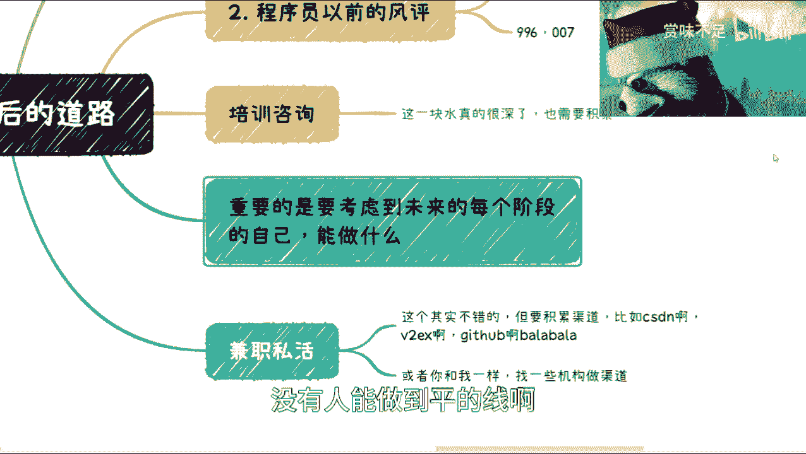

所以说我觉得这个可能是当下一个，也是最大的问题，那我们说这个程序员后面啊。

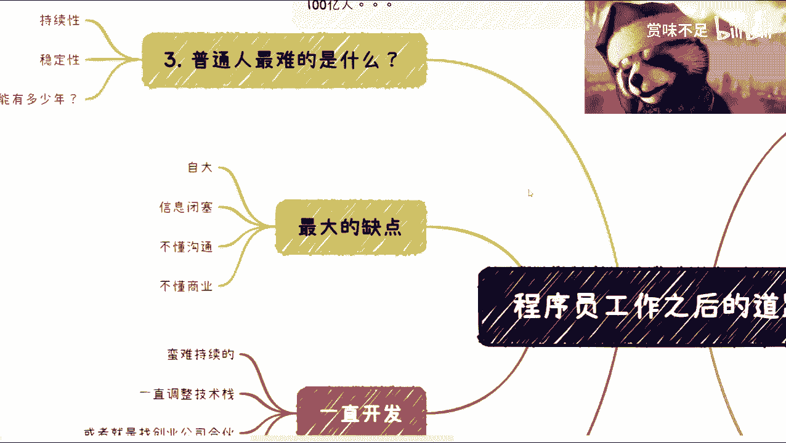

就是程序员本身呢，我觉得最大的一个缺点，客观的说啊，不是不是喷大家自大，毫无疑问对吧，卧槽我技术最牛逼啊，反正就是自己最牛逼对吧，我也曾经这样哈，呃我顺便提一点，我也写了778年代码了啊，这是第一点。

第二点呢这个信息闭塞对吧，我觉我觉得这个是所有人通病啊，没办法的，第三呢不懂沟通啊，这个呢我觉得主要还是工作原因，就除了这个呃公司里面的这个项目以外啊，可能别的也就不沟通了对吧。

这也是为什么很多人网上还黑程序员是吧，格子衫是吧啊，然后第四个就不懂商业，不懂商业，我觉得这件事情嘛，呃为什么在程序这边我特别提出来呢，是因为你要说有些呃运营市场呃，商务对吧，包括那个可能做咨询的。

就是别的某些工种啊，它可能还是能够接触到点，商业这个边缘和商业本质的，但是大部分做互联网项目的，比如说项目经理啊，产品经理啊，开发测试运维啊，这些它是连皮毛都接触不到，所以说这个事情就很尴尬，为什么呢。

因为你但凡能稳定作量没问题，但凡你要说现在大家想着说，就是在赚钱，那你说啊我完全不懂商业对吧，就跑出来，虽然你看着这个世界蛮好的，但是你并不知道这个世界真正的运作规律，那那那那就废了。

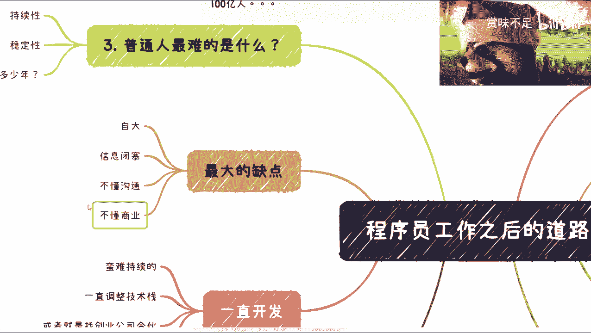

你知道吧，那这个是第四个啊，然后看看啊啊那么我接下来就来说几个，我想到了几个啊，哦对我可能还漏了一个。

就创业是吧，创业啊，我这边先写一下啊，待会儿再来说啊。

呃一个呢是开发，你可以一直做，但是呢一直做呢，就我目前因为我身边现在最大的是50多岁，50多岁啊，当然我没有这么大啊，我我毕竟是一个九零假假装九零后，哈哈啊，88888啊。

然后就说那个呃你你看啊一直开发对吧，你比如说蛮难持续的，这个肯定的对吧，我身边就没几个持续的啊，这第一个第二个呢你也就一直持续的难也很难，他就是一直要求挑战调整它的基础上。

就说白了本质就是他一直得要去学，但是你要说，你真的是不是有这么大的精力跟别人去卷，因为现在越来越卷了嘛，对吧，我倒不是质疑大家的能力啊，这是第一第二点，第三点呢就是说也是也有。

就是他不停的找那种创业公司合伙，可以的，但是找创业公司合伙呢，他就有个问题就是不稳定，就是很有可能比如说三四个月对吧，就黄了对吧，或者三四个月就大家面临一个很尴尬的境地，哦对对对，然后我顺便提一嘴啊。

就是那个我我当时还小的时候，我当时还小的时候呃，我问过一些这个微软，还有这个百度啊，阿里的这个高管啊，我当时就这么问，我说我说我一直不明白，我说你们做着好好的总结跟CTO不足，我为什么要出来折腾呢。

我说你们这个package看上去也很，因为当时八九十万package对我来讲已经是天价了，对吧，我这辈子都到不了这个package啊对吧，然后我就我就很疑惑啊，我当时这么问，然后呢。

我当时呢这么问的情况，下面，我说实话我其实就没想到，我刚刚跟你们说的那那种种的问题吗，那时还小嘛是吧，然后呢他们就跟我说，他说呃他说年纪大了之后呢，你追求的其实是一种这个要求，衡量一个成本，什么成本呢。

就是你自己的时间成本对吧，他说你他说我们衡量下来呢，就觉得自由还是比这个这个，这个这个上班会重要，那为什么呢，因为他说你别看我八九十万的package，我也是忙成狗啊对吧，我不带萌宠狗。

我24小时昂扣是吧，那他说我年纪大了，我就不想这样，我觉得没有意义，哎我后来现在回想说哎呀真的是有道理啊，真真理啊，我当时不太理解啊对吧。

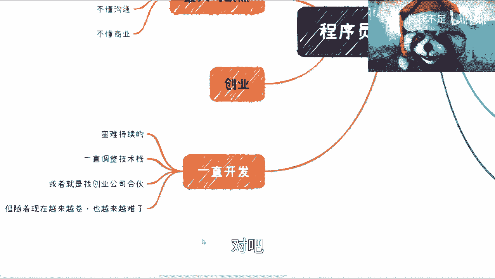

然后现在还有一个点呢，就是现在毕竟跟我当年不一样啊，现在就越来越卷，越来越难了。

这是第一块吧，第二块就是说你可以做外包，当然这是下下策啊，用外包什么意思呢，外包是按人头来讲话的对吧，外包是什么意思呢，就是谁便宜算谁的，能完成工作，因为外包其实是属于这种交互性工作嘛。

就他负责的就是交付啊。

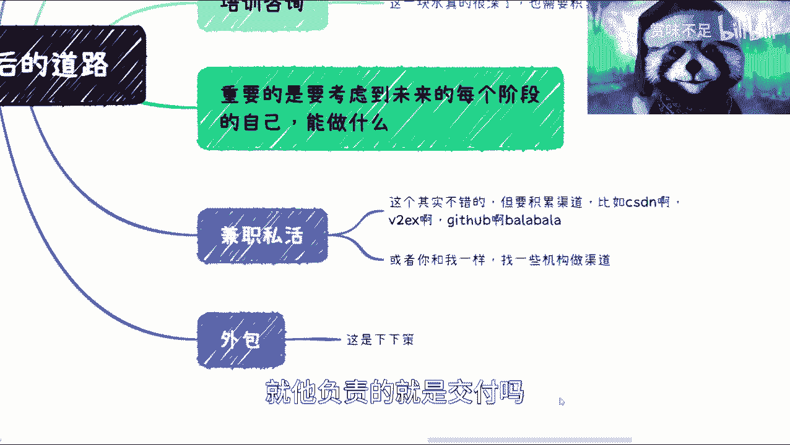

这有点像什么，这我跟你讲，这这就有点像哎哎这就有点像这个问题，就是就是外包是什么，就是我就负责我们交付甲方的要求，你不用管我怎么怎么怎么怎么去做的对吧，这就这，你你你我我里面找了一些这个很便宜的人对吧。

就是实习生也好，怎么也好，反正能完成就好了。

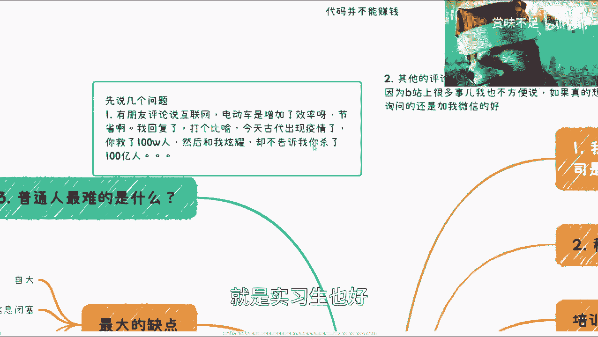

你别管我对吧，就是我只要交付了钱，打给我就结束了对吧，所以说你不要去跟外包去谈什么技术啊对吧，谈什么性价比，人家不管你的，人家只管就是说啊对，不要不要跟他去谈什么什么什么招，你一个人能顶几个人。

没有用了啊，人家只关心说，我怎么这个这个以最低成本完成任务就好了，你要么跟我跟别人去卷价格对吧，那你也不会啊，然后这是一款那么兼职呢。

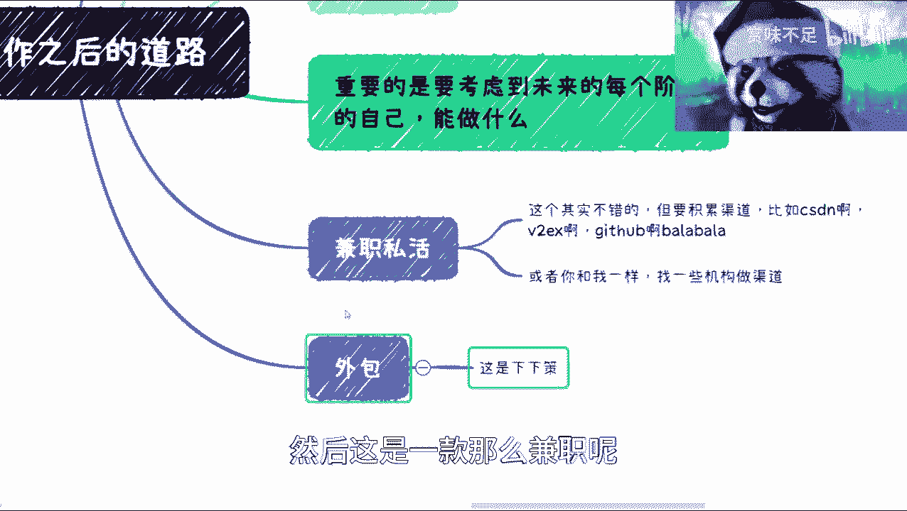

我觉得这款其实开发的优势啊，有有艺术也开发优势嗯。

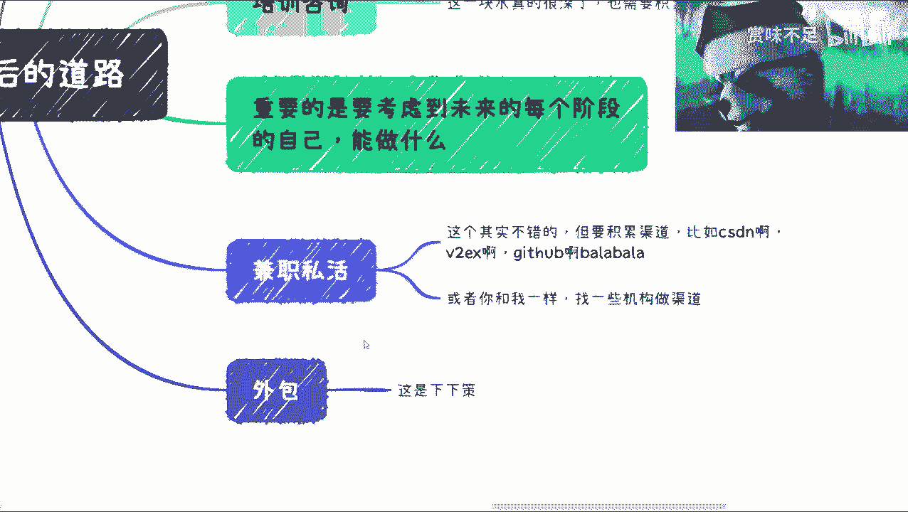

但是可能近两年也比较难，因为就像我们说的互联网缩水了之后呢，其实整个要求也没这么多啊，就是你要真正封包出来呢，我们这么说吧，就是大家但凡做过这个懂得国家运作模式呢，都会明白，就是不管是总包还是分包。

它其实都是有供应商的对吧，那你供应商再往下找，真的能找到个人头上还是比较少的啊，有一说一还是比较少的啊，那当然了，这个也是有机会的啊，就是啊但是你你可能需要一些积累。

比如说cs DNA v two ex啊，给他HAB对吧，你你你你你你你得去宣传自己对吧，否则也没别人，我一直说一句话，你说中国14亿人对吧，但凡有个机会，他为什么落到你头上来对吧。

那你比如说B站也是一样的对吧，这个这么多up主对吧，几千千千千万万up主，你们为什么要来看我的视频，也有也有道理，我头上不长角是吧，你们头上不长角是吧，哦那么或者就是说还有一点呢。

你跟我一样找一些机构做渠道，但是这个也一样，就是你得去认识那些机构，比如说51CTO啊，对吧对吧对吧，INFQ啊对吧，那话又说回来，那你找那些机构，那些机构为什么要愿意来推你呢对吧。

这个东西你得你都得去想，它都是一个相辅相成的，你总不能跟他说好，我懂VUE对吧，我懂这个这个这个这个叫什么微微呃，微服务对吧，我懂云计算没有用。

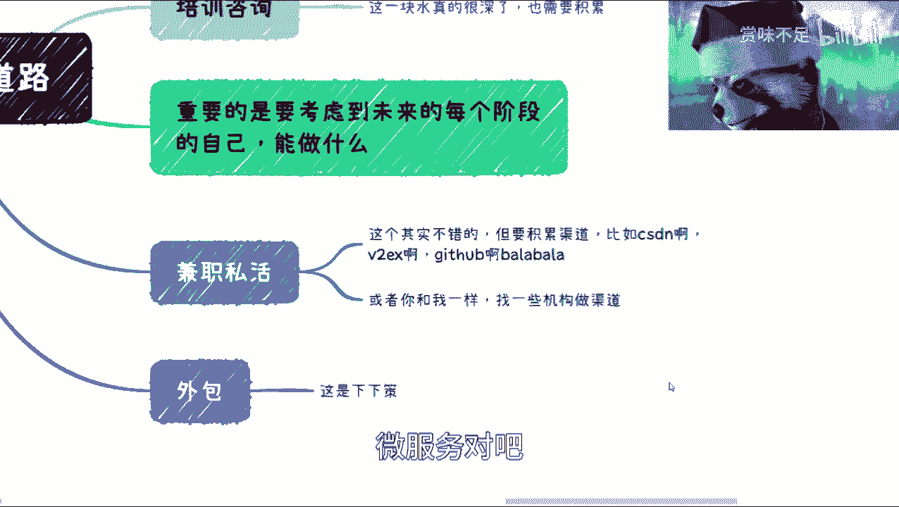

不好意思，懂的人太多了啊。

哎我我看看啊，对还有一块呢，就是说那个这个培训咨询可以做啊，你像我相信大家都知道嘛。

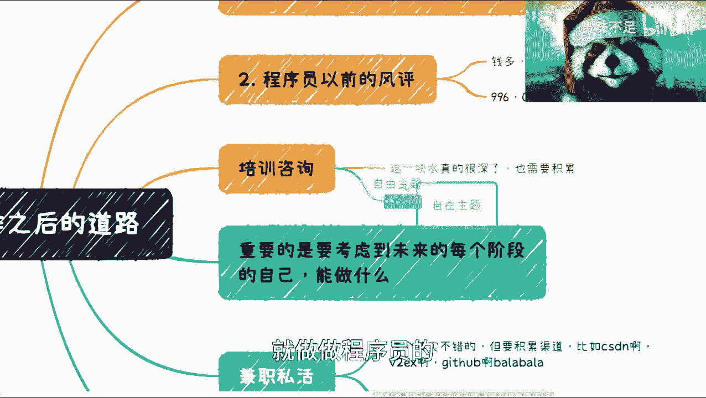

就做做程序员的，我觉得都知道一个公司叫SWORKS对吧，thought works对吧，培训咨询也可以做，但培训咨询这两年可能也不太好做对吧，因为软件层面就缩水嘛，大家也懂啊，越来越虚嗯。

而且这块水很深啊，这块水很深，就是我说嘛第一块呢就是说你头上不长角，那你如何脱颖而出对吧，这是你要考虑的，第二就是说别人找你合作，打个比方啊，因为我这边这个平均咨询很多对吧，你比如说我要找你。

那我就问你了，我为什么找你，你的优势是什么对吧，然后你报价多少对吧，你讲课怎么样，你面对这些人怎么样对吧，应该因为这种东西呢很看人，你比如说我当时最早毕业的时候吧，我去面试别人，我面试别人的时候。

我手都抖对吧，你说我我我去讲课，我怎么讲啊对吧，那你说我现在隔三差五，政府让我去对吧，企业让我去，那我妈我就算不看PPT，我他妈一天都能讲八个小时，你知道吗，但是这个东西你得要去积累，你得要去锻炼。

你知道吗，这个东西里面很深的，而且而且另外一方面，就是说这个你碰到的这个人和机构，是不是个骗子，他有他很有可能把你人卖了，你知道吗，就动不动跟你说啊，因为你都是要出差的嘛对吧。

但是你又去一个人生地不熟的地方，你愿不愿意去，哎对吧，我跟你讲，这里面都是问题啊。

因为毕竟你们不可能在网上找得到，都像我这样的人是吧。

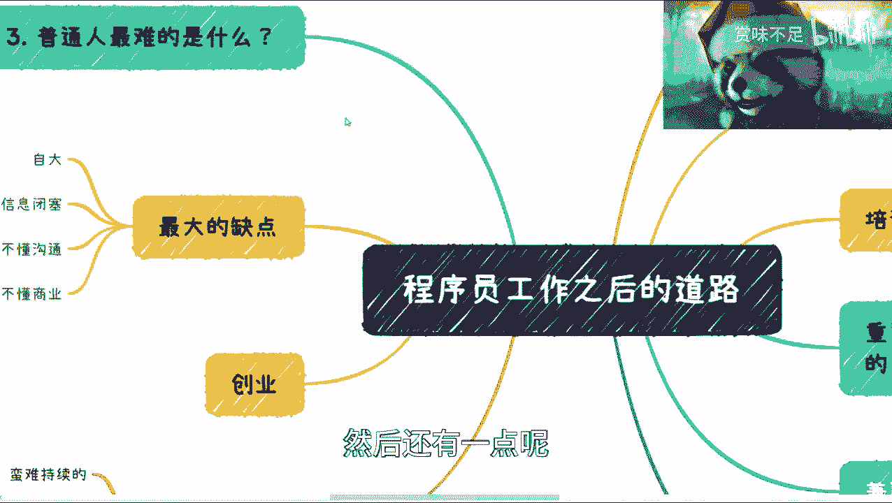

然后还有一点呢，最后来来说创业啊，这个事吧，我觉得吧，首先呢呃能能能能能能不唱就不唱好吧啊，首先这个这个这个是最最核心的啊，我这个话是我跟你们说强调三遍啊，能不充就不充嗯，创业这个东西呢。

如果你作为一个程序员去创呢，我说实话啊呃你唱什么我觉得都不太不太行，当然不是因为你这个人能力不太行，而是说你的经验，你的各个方面的确不太行啊，你们没有办法好吧，没有办法，这个是第一点嗯。

我觉得目前我看下来，程序员创业比较好的是什么呢，就是进入供应链白名单。

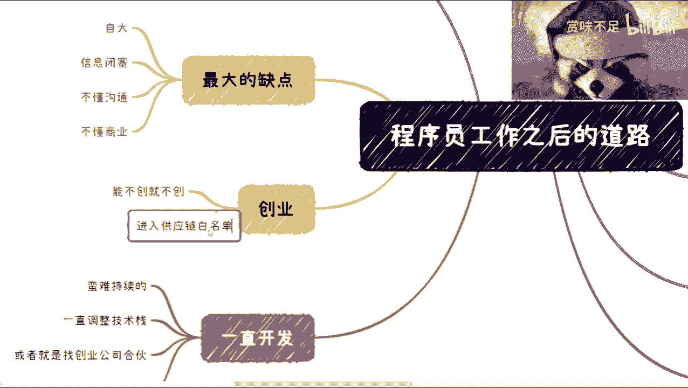

这个我大概提一下啊，这个意思是什么意思呢，就是说我不管你服务的甲方是谁，对你到底是比如说跟我，比如说个人合作，还是跟某家企业合作，还是跟政府园区合作，还是跟那个区政府合作，还是和省政府合作。

市政府合作不重要啊，重要的是，你的企业是不是某一个产品的供应链的白名单，为什么叫白名单呢，就是说他不需要招投标啊，他不需要招投标，或者来说他就是但凡需要招投标，他也是一个这个内部中标的。

他别人会来陪标的，那当然我相信很多人没有做过，他也不懂我在说什么对吧，但这个并不重要啊，你们可以先了解一下啊，那么简单来讲，从结果来讲就是什么呢，就是说你可以每年有固定的kiss，有固定的单子给你去吃。

然后呢，你可以做这些固定的单子来养活你的团队，然后同时再去拓展你的业务啊，那么我觉得这个是合理的，在我身边我看到这样的话呃，有但是很少啊，但是很少，剩下的话哎呀没有了。

我也想不出来，真的想不出来了。

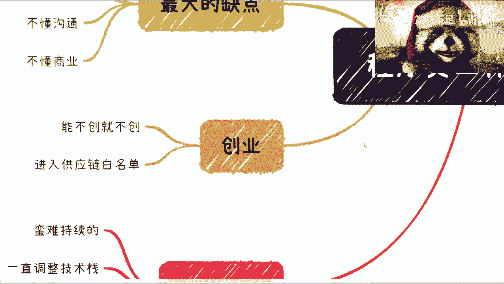

好吧，OK我看看我讲了多久了，20分钟了。

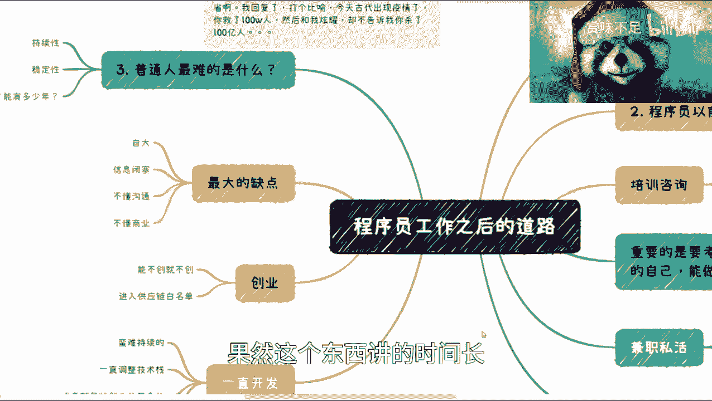

果然这个东西讲的时间长，所以呢我觉得就是说核心就是这么一个情况，我能把我想到列的呢，我都已经列出来了，当然有人开玩笑啊，他说他说他说你还没列个下岗是吧，下岗也是出路啊，也对也对，这不用我列。

反正回头大家一起下岗好吧，其他的我当也没想出来啥啊，没想出来啥啊，当然也有很多人会问我，他说那你说问题你得说解决方案是吧，呃啊对这个就像我说的。

就是说那个呃这个这个东西啊，我都记在那啊，但是你要说解决方案这个东西吧，每一块都很复杂啊，每一块都很复杂，而且有很多东西我也不能说说了，可能就动别人蛋糕是吧。

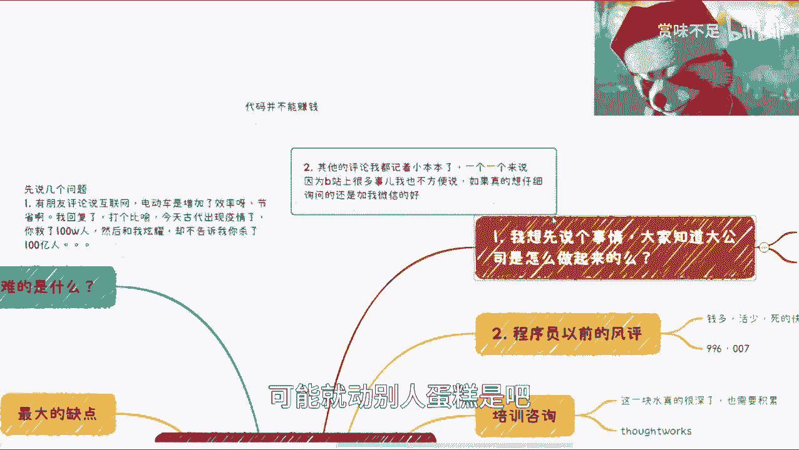

或者怎么样也很麻烦啊好吧，然后我最后总结一下吧。

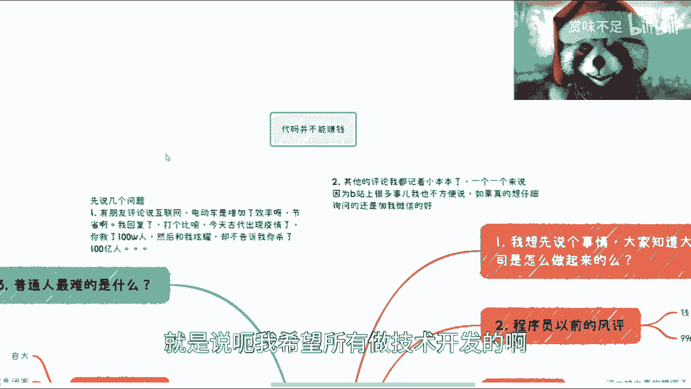

就是说呃我希望所有做技术开发的啊，就是除非啊除非你们是顶尖人员啊，就像我第一家公司同事呃，他叫那个你们可以去搜一下道教l y m panda啊，就是我那个朋友，我那个同事吧，跟我一起合作的做一个项目。

他是google code jam，就全球差不多前40前20吧，那个时候你知道吧，就是清华清华就前无古人，后无来者的啊，当然后有来者就是娄教授，不是教授，楼教主是吧，楼教主啊，然后那个那个除此之外啊。

我觉得大部分技术呢一定要明白一点，就是代码是不能赚钱的，赚钱的，一定是商业模式和商业闭环和商业链路啊，这个是唯一能赚钱的代码，并不能赚钱，所以说这也是为什么很多的这个这个，这个我们说啊。

就是说团队创始人之间讨论的时候都会说，其实呃这个开发并不重要啊，就这个人其实也不是很重要，反正不行，我们就换一个对吧，因为这个开发市场上多的是啊。

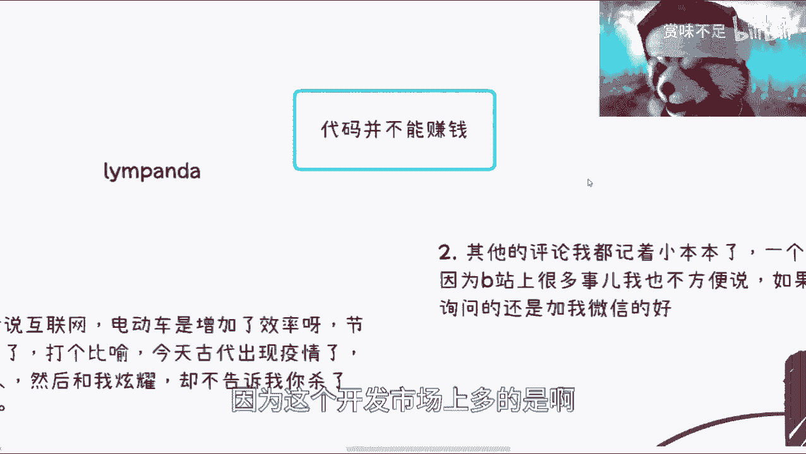

所以我觉得大家一定就是说做任何抉择的时候，得要认清楚自己嘛对吧。

就你你你只有客观的认清楚自己跟行业对吧，你才能说对这个这个未来的这个规划，能做客观的判断，你但凡盲目自大，你肯定是做不了这个客观的规划，好吧，那反正我先说这么多吧。

好像已经蛮长时间了啊，有什么问题你们反正评论或者私信再跟我讲吧，好吧好吧。