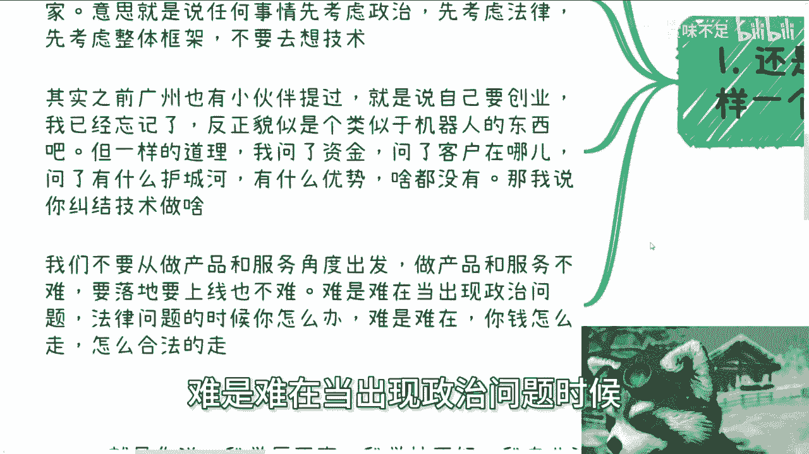
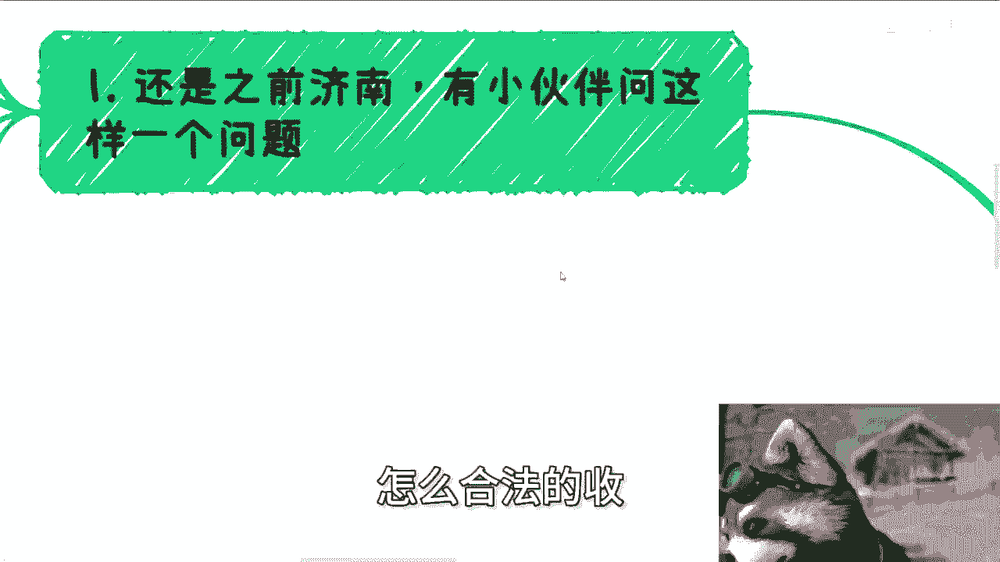
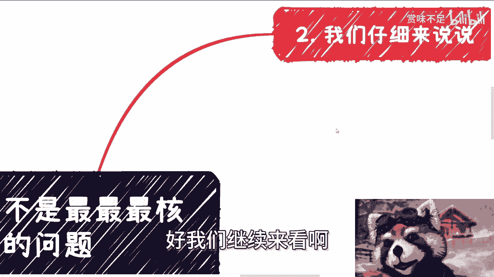
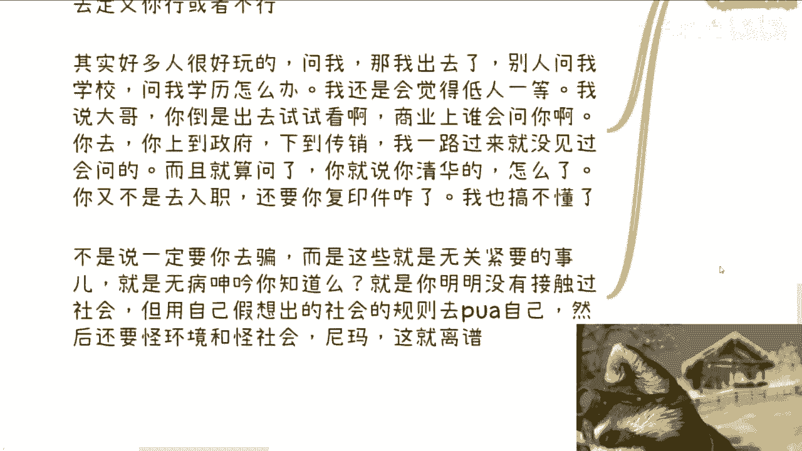

# 技术永远不是最最最最最核心的问题 - P1 - 赏味不足 - BV17t421A7WW

哈喽大家好，现在已经12。35了，我妈我今天忙的没空，没空来搞，我们今天来讲的呢是技术，永远不是最最最最最最最核心的问题啊。

呃为什么，因为之前济南呢这个小伙伴啊。

有小伙伴问这么一个问题，他说小伙伴说的是这么个事，他说我想做个平台，呃，这个平台呢就是能够帮助大家更多的教你交易，虚拟物品啊，当然这个物品可能是类似于像CSGO里面的，这种道具啊。

或者说别人的个人创作啊，呃我记得我之前有做过一期说UGC的问题啊，大家有空可以去翻一翻，就咱们就是说啊记住啊，就是我们所在的地方是一个什么地方呢，是一个呃我知我前两天也强调过对吧。

是一个政治第一稳定安全第二的一个地方对吧，什么意思呢，意思就是说你做任何事情，你要先考虑政治，先考虑法律，先考虑社会的整体框架，而不是说考虑实现，这个是社会本身的大框架和大的这个叫什么。

就是游戏规则所导致的啊，这不是我们能控制的对吧，你包括之前广州也有小伙伴提过，他说就是说它类似于自己要创业啊，然后我也已经忘了大概是个什么问题，反正就是可能是跟机器人有关的，还是跟什么有关的啊。

那么一样的道理，我说我问了他，我说资金呢，客户在哪呢对吧，问了我说你有什么护城河，有什么优势啊对吧，然后我说你里面有些什么问题啊，什么都没有啊，那我说你纠结技术干嘛呢，我说你所有的跟框架有关的。

跟你赚钱有关的东西，你都不知道，你在那边纠结技术，技术人带来钱吗，不能啊对吧，就是说我们不要从做产品跟服务的角度出发，做产品跟服务不难啊，不难要落地，要上线也不难，难是难，在当出现政治问题的时候。

法律问题的时候，你怎么办，难是难在你这个钱怎么走，怎么合法的走，怎么合法的收对吧。

这些才是最重要的问题，好我们继续来看啊。

我们仔细来说啊，首先你就拿刚刚我们说UGC的这个例子来讲，很简单，你要做平台，你要做一个用户可以交易自己原创作品的平台，行啊啊，那我先来跟你说政治风险，上传了你平台怎么办对吧，你说你平台可以审核。

可以人工审核，OK可以AI审核，可以好，我就是阴阳怪气了，你怎么办呢，你没有办法，你只能吃瘪对吧，同时如果我就说你被举报了怎么办，这是第一点，第二点，如果一个用户创造了一个A。

我去抄袭的这个A结果这个A大卖了，我赚了很多钱，那么请问平台怎么处理对吧，或者说你整个平台上面，如果是有几次抄袭会很多，那我就问平台又是如何通过什么技术对吧，怎么去判断原创或者抄袭的，你怎么弄呢对吧。

我更别说你企业资质上面，比如说你需要ICP，对不起啊，你需要文文网文的资质，你有吗，你没有对吧，另外你给用户分钱是什么逻辑，用户在平台创作的又是什么权利对吧，那我就问是版权使用权。

创作权呢还是什么权呢对吧，而且用户创造的东西什么权利，不是你平台说了算的，你又是跟哪个政治部门或者政府部门对接的呢，你都你也不知道，那你考虑技术考虑个屁啊对吧，你就说当时那个小伙伴啊。

就是说他问我就说陈老师，你觉得这个方向怎么样，你自己想想看，你整个关键问题都不想通，你问我方向怎么样，这方向怎么样，跟的吊关系对吧啊，再来说走正你肯定要接三方，甚至是借四方支付，不是我说什么。

你能有几个人懂三方四方支付是什么，能有几个人接过三方四方支付的，对哦，你所有东西什么都不知道，你就说啊这个东西我要做做了能解决问题，你能解决什么问题啊，然后第三你比如我们去给企业跟政府端落地啊。

我们就问基础重要吗，技术就是我们提交项目计划书，里面的一个很小的环节，用什么技术，用什么框架，大概什么架构图，就是写在里面就那么一两页对吧，那我说白了这个图会有人看吗，或者说就算有人看了。

你觉得政府这边，或者说企业这边能有几个人看得懂的啊，或者说这个东西看得懂，看不懂，影响这个项目的推进，或者这个项目落在谁头上吗，根本不影响你明白吗，很多人做事他就看自己懂不懂，不懂就觉得做不了项目。

那我就跟你讲，你不需要懂，因为懂不懂和你能不能赚到钱，没有任何的因果关系，没有半毛钱的因果关系，你不要觉得因为自己不懂而没有赚到钱，或者没有拿到单子，你这句话好像就搞得你懂了就有单子一样有吗，对不对。

我就说你比如说你今天你是懂unity的对吧，你是你是懂这个虚幻五的，你是懂怎么样的，你懂呗，有单子吗，没有啊，因为为什么没有因果关系啊对吧，你去落地项目，就是要看你项目计划书写的好不好，完不完整。

领导这边关系到不到位，你有没有以前的案例，你公司是不是有一定的资质，或者有没有领导喜欢的背书对吧，和你会不会和你什么学校毕业，和你什么专业没有半毛钱关系啊，所以我在这个地方再提一点啊。

不要去想你会什么生根什么，因为你会什么生根，什么带不来钱，你明白吗啊，第四也是最重要的，就是这里的技术是泛指啊，不是说只只只是只说开发或者怎么样，什么意思呢，就是说比如说你跟我说，陈老师，我学历不高。

我学校不好，我专业冷门，我性格不好，我家庭不好，我出身不好，我不擅长写PPT行，以此类推若干个，你们自己举一反三，你问我这些这些你说有关系吗，我就告诉你有有吗，一定有关系大吗，不大就这么简单。

而且你要说不大到什么程度，我可以告诉你不大到非常不大对吧，就是说这些东西只是你觉得有影响，你觉得让你自卑，你觉得不如别人，但真的影响赚钱吗，你不知道你甚至都他妈没有接触过社会，你只接触过职场。

只接触过PUA，然后你就说自己不行，自己不如别人，那我就不明白为什么了对吧，你要明白你活在世界上，你就是你，你你就是一个独立独立的个体，你就是一个独立的个人，以上我们刚刚说的那些东西能定义你吗。

不能啊对吧，跟你有什么关系呢，你说啊我我我因为没有考上好的学校，所以我学校不好，我学历不好，然后呢跟你这个人有什么关系呢，能证明什么吗，不能啊对吧，以上这些东西都是人类社会所制定出来的，一些枷锁和框框。

它无法去定义你行或者不行啊对吧，包括就是其实很多人很好玩的，他问我，他说那啥事，那我出去别人问我学校，问我学历怎么办，我还是会觉得低人一等，我说大哥，你倒是出去试试啊对吧，我就这么跟你们讲。

商业上谁会问啊，你去啊，你上到政府，下到传销，我一路过来，我就没见过有几个会问的，比如说1000个里面有一个会问的，了不起了啊，当然我指的是你要去做商业啊，不是说你你什么，你说我要去讲个课。

我要去做工具人，你你明白啊，你越是讲就是做执行层，别人对你的要求越高，你越是作为一个老板，作为一个主导者去谈商业，没人会问你这个问题的啊，而且就算问了，你说你是清华的，怎么了呢，你又不是去入职的。

你又不是去去签劳务合同的，他妈还要你复印件，咋滴啊，我也搞不懂啊对吧，那当然啊，我在这个地方退1万步来讲，不是说一定要让你去骗啊，而是告诉你这件事情无关紧要，你这种想法就是无病呻吟，你知道吗，你你懂吗。

就是你明明没有接触过社会，但用自己假想出来的社会的规则去PUA自己，然后还要怪社会，怪环境，然后就觉得自己不行，我就觉得离谱，就他妈离大谱。

对不对对吧。

就是说你想想看啊，大部分的人都是学校出来就去工作，接触过社会吗，没有做过商业吗，没有自己主导过业务吗，没有对吧，你你你真的就是说拿过分红，做过股东对吧，做过多少项目吗，没有。

那你怎么就知道我们刚刚说的那些东西，有的没的东西对你很重要的，或者影响你赚钱呢，我不明白对吧，你你你给出的逻辑就是因为我爸妈这么说，因为我身边的人这么说，因为我这么觉得有用的啦，对不对，你们去看看历史。

你们去看看，真的有很多的东西，哪件事情不是要靠实践出真知的，你不实践，你靠你自己没有用的对吧，所以就是我跟你们讲啊。

你们做任何事情不要再去，就是说单纯的去想哦，这个东西能不能做，这个东西，做了能不能解决问题，这都不是重点，你明白吗，重点就是你这里面有没有政治风险，你这里面有没有稳定安全性的风险。

你这个东西到底能不能赚到钱，赚谁的钱，别的以后再说，就这么简单对吧，你要是说你不了解，你说陈老师，你说这些问题我想不明白，没问题啊，你想不明白，因为你懂得不够多，你了解不够多，你先去了解啊，啊行好吧。

那今天就讲这么多嗯好吧，然后那个职业规划商业规划好吧，融资股权合同啊，股份分红包括其他各个方面，你们要是觉得包括就是说你们手上有什么牌啊，希望我通过我的视野，通过我的视角能够帮你们更好的去理清楚。

来你们整理好问题啊。

