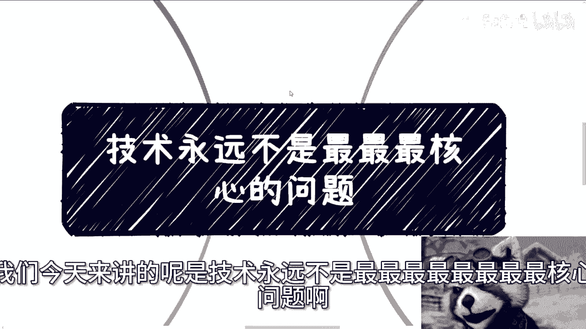
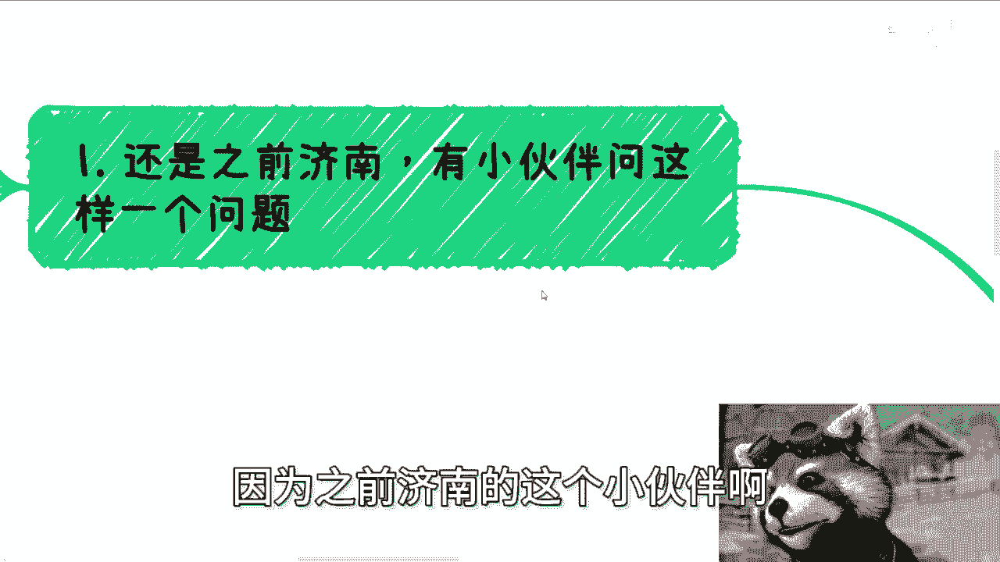
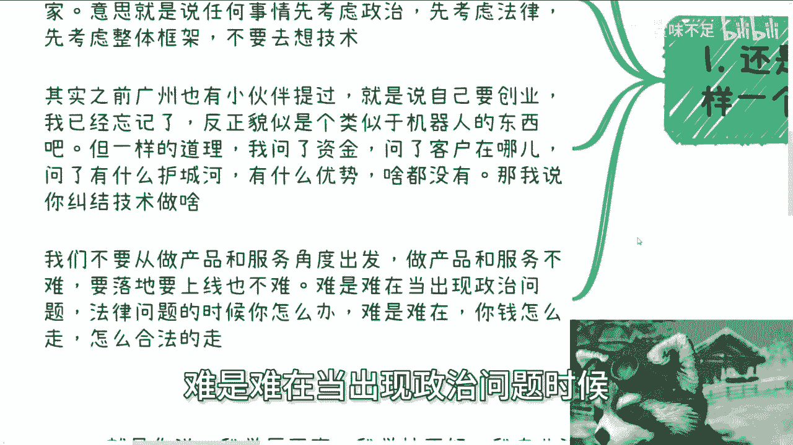
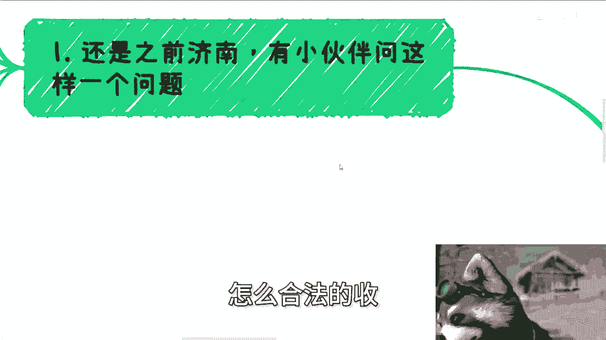
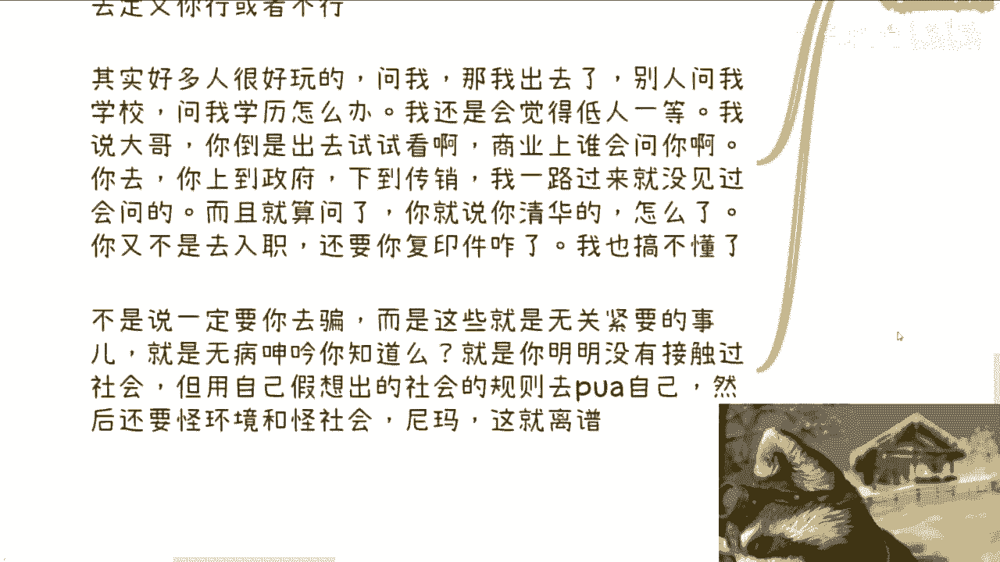
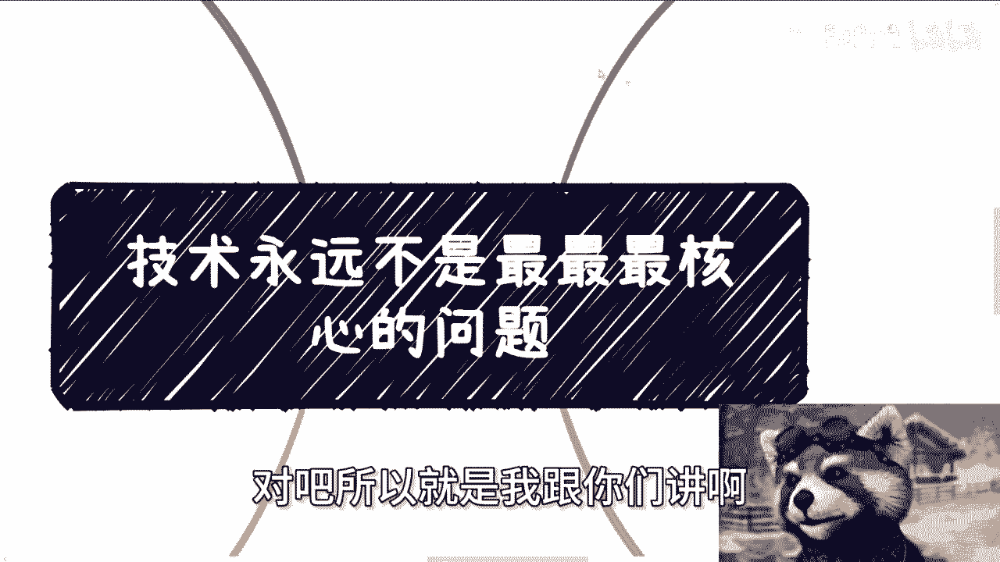

# 课程一：技术永远不是最核心的问题 🧠

在本节课中，我们将探讨一个在商业和项目实践中至关重要的观念：技术能力并非决定成败的最核心要素。我们将通过具体案例，分析在启动项目或创业时，比技术实现更应优先考虑的关键问题。

---

上一节我们点明了课程主题，本节中我们来看看为何技术并非首要问题。核心原因在于，任何项目都运行在特定的社会与法律框架之下。这里的“框架”指的是**政治、法律、稳定与安全**的优先顺序。一个项目能否存活与发展，首先取决于它是否符合这个大框架，而非其技术是否先进。

以下是在评估一个项目时，比技术更应优先考虑的四个关键维度：

1.  **政治与法律合规性**
    项目必须首先确保不触碰政治红线与法律底线。例如，涉及用户生成内容（UGC）或虚拟物品交易的平台，需考虑内容审核、版权纠纷、举报处理以及所需的特定经营资质（如ICP许可证、文网文许可证）。技术无法解决资质缺失或根本性的合规风险。

2.  **商业模式与支付闭环**
    项目如何赚钱、钱从哪里来、如何合法地收款与分账，是生存的根本。这涉及到与第三方/四方支付渠道的对接、资金流设计以及税务合规。许多技术开发者对此流程并不熟悉，但它却是项目能否运转的关键。

3.  **项目落地与资源整合**
    在面向企业或政府的项目中，技术方案仅是项目计划书中的一小部分。项目能否中标或推进，更取决于计划书的完整性、过往案例、公司资质、领导关系以及背书资源。技术实现能力与能否获得项目没有直接的因果关系。关系可以表示为：**项目成功 ≠ f(技术能力)**。

4.  **个人条件与自我设限**
    这里的“技术”是泛指的，包括个人学历、专业、出身、性格等条件。许多人将这些视为无法成功的枷锁。然而，在商业合作与主导业务时，这些因素极少被关注，更不构成决定性障碍。自我设限的想法（如“因为我XX不好，所以我做不了”）是基于想象而非实践的无谓担忧。

---

本节课中我们一起学习了“技术非核心”这一核心观念。我们分析了在实战中，政治法律风险、商业模式、资源整合以及突破自我设限，远比单纯的技术实现更为重要和优先。真正的难点在于识别并解决这些非技术性的框架问题。行动前，请务必先思考：项目是否存在政治风险？是否安全稳定？到底如何赚到钱？从这些问题出发，才能走向正确的方向。