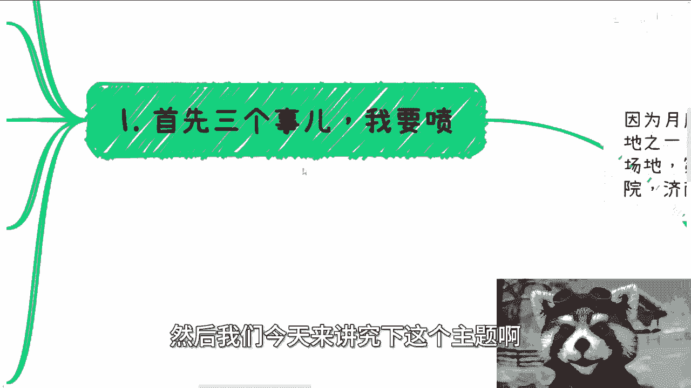

# 课程一：投资与投机的本质辨析 💰

在本节课中，我们将深入探讨“投资”与“投机”这两个常被混淆的概念，并分析其在现实应用中的真正含义。我们将摒弃空泛的理论，从实际角度出发，帮助初学者建立清晰的认知。

## 概述

许多人习惯性地认为“投资是长期的，投机是短期的”，并将长期主义视为成功的唯一路径。本节课将挑战这一观点，通过逻辑分析和现实案例，阐明对于普通人而言，关注短期机会与务实行动的重要性。

## 核心观点解析

上一节我们概述了课程主题，本节中我们来具体分析几个核心观点。

### 1. 远离格局小的人

在合作与交往中，需要果断筛选对象。与格局小、斤斤计较的人产生交集，不仅无法获得帮助或赚取收益，即使暂时获利，后续也会带来更多麻烦和消耗。果断的“断舍离”是保护自身精力和资源的基础。

以下是识别与处理此类关系的要点：
*   不要对这类人抱有合作幻想。
*   从他们身上难以获得有效帮助或可持续的收益。
*   若已产生交集并出现问题，应果断切断联系，避免后续更大的消耗。

### 2. 质疑“长期投资”对普通人的意义

“投资是长期的”这句话对普通大众而言，往往是一句空洞的鸡汤。真正的长期战略方向（如电车出海、双碳产业）通常由大型机构主导，与普通个体的关联度很低。对于普通人，奢谈看不清、摸不着的“长期”，是不切实际的。

我们可以用以下公式来思考普通人的机会：
**普通人的可行机会 ≈ 自身能接触到的资源 + 明确的短期需求**

在宏观经济充满不确定性的时代，要求普通人进行长期投资，是一种不切实际的期望。

### 3. 成功源于连续的“投机”

所谓的长期成功，很可能由一系列成功的短期决策（或称为“投机”）累积而成。成功并非一蹴而就，而是通过不断抓住小机遇、积累认知和资源而实现的。

其过程可以描述为：
1.  抓住一个短期机会（投机A） -> 获得小额成功与认知提升。
2.  利用新的认知，抓住下一个机会（投机B） -> 获得更大成功。
3.  如此循环，形成复利效应，最终从外部看像是一次“长期投资”的成功。

因此，贬低“投机”而空谈“长期投资”，是本末倒置。

### 4. 摒弃空话，目标具体化

许多人在设定目标时喜欢使用模糊的“空话”和“屁话”，例如“我要积累人脉”、“我要提升自己”。这种目标因缺乏具体定义和衡量标准而毫无执行力。

有效的目标设定应遵循 **SMART原则** 的简化版：
*   **具体**：要做什么？
*   **可衡量**：达到什么结果算完成？
*   **可行动**：第一步做什么？

如果不知道目标具体是什么，那么第一要务是“去了解”，而不是用空泛的目标来自我安慰或就此停滞。

### 5. 避免目标与行动的矛盾

一个普遍存在的矛盾现象是：许多人声称自己“急需短期赚钱”，但实际采取的行动和计划却是“长期且不确定能否赚钱”的。这种目标与手段的错配，是导致焦虑和无法取得进展的主要原因。

解决这一矛盾需要自省：
*   你的真实需求是 **短期现金流** 还是 **长期事业**？
*   你当前的计划是否直接服务于你的首要需求？
*   如果计划无效，是否愿意立即调整，寻找更直接、更快速的方法？

## 总结

本节课我们一起学习了如何重新审视“投资”与“投机”。关键结论是：对于资源有限的普通人而言，相较于空谈遥不可及的“长期投资”，专注于识别和抓住力所能及的短期机会更为务实。真正的长期价值，往往是通过一系列务实的、成功的短期决策累积而成的。同时，我们必须设定清晰具体的目标，并确保行动与目标高度一致，避免陷入空想与矛盾的泥潭。

---
**行动提示**：审视你当前最重要的一个目标，用一句话写下它，并检查这句话是否足够具体、可衡量、可立即行动。如果不是，请重新修改它。