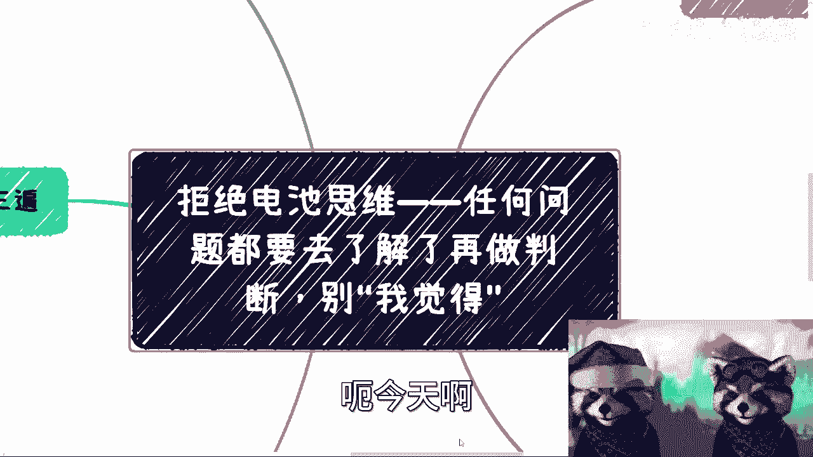
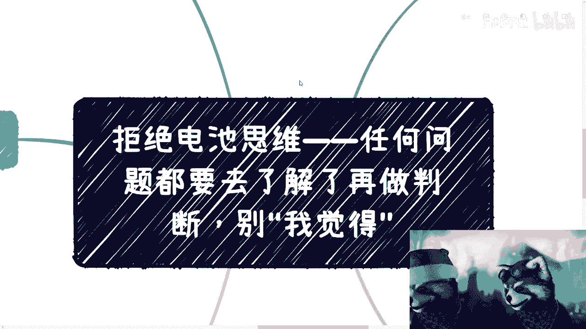
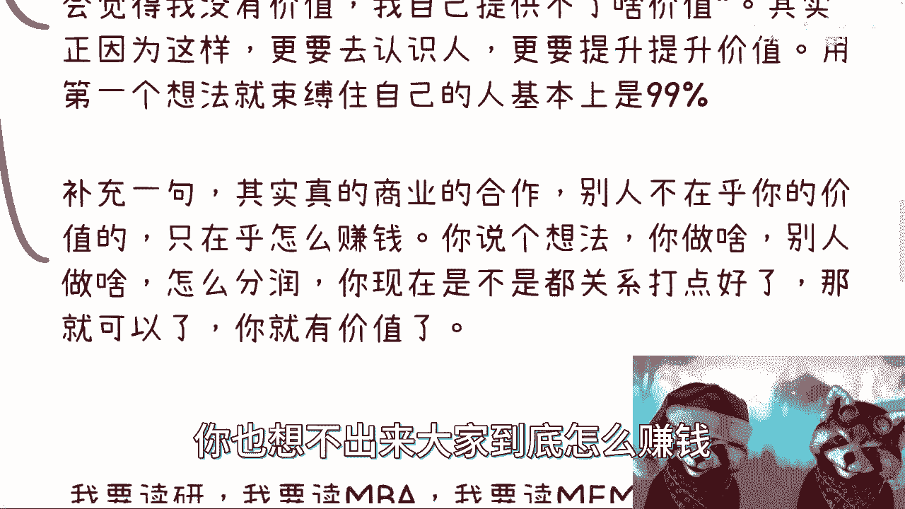
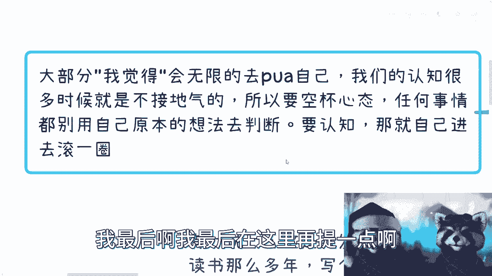

# 课程一：拒绝“我觉得”思维，避免自我设限 🚫

在本节课中，我们将探讨一种常见的思维陷阱——“我觉得”思维。这种思维模式会阻碍我们获取新认知、采取行动和实现成长。我们将通过分析具体的故事和案例，理解其危害，并学习如何通过实践和空杯心态来打破这种自我设限。

## 概述：什么是“我觉得”思维？

“我觉得”思维是指在缺乏足够认知和实践经验的情况下，仅凭主观感觉或固有观念对事物做出判断和结论的思维方式。这种思维模式是阻碍大部分人迈出第一步、尝试新事物的首要障碍。

## 故事一：被“我觉得”扼杀的机会

上一节我们介绍了“我觉得”思维的概念，本节中我们来看看它是如何在实际生活中扼杀机会的。

我曾向朋友介绍“国家职业技能等级”相关的项目，认为其中存在机会。然而，对方的典型反应是以“我觉得”开头，迅速否定。

以下是几种常见的“我觉得”式回应：
*   我觉得这个东西不好做。
*   我觉得可能需要先有关系。
*   我觉得我切不进去。

关键在于，当人们说完“我觉得……”之后，行动往往就停止了。这就像下载了资料却从不阅读，购买了游戏却从不游玩。**“我觉得”这句话本身，成了一种自我PUA（自我否定和设限）的工具**，它扼杀了进一步了解和尝试的可能性。

这种思维不仅影响对新机会的判断，也影响对信息的获取。例如，当被问及政策信息从哪里看时，很多人会抱怨信息不透明、存在信息差。但当你反问“你看过政府网站吗？”，答案通常是否定的。**公式：信息差 = 未知领域 - 主动探索**。如果不愿花时间去官方网站（如 `www.gov.cn`）研究，却抱怨信息差大，这本身就是“我觉得”思维在作祟——我觉得很难找，所以我不找。

在社交和提供价值方面也是如此。很多人困在“我觉得自己提供不了价值”的想法里，从而拒绝迈出第一步。但逻辑应该是：正因为想提供价值，才需要先去接触人、参与事，在过程中提升能力，从而创造价值。用最初的“我觉得不行”束缚自己，就等于放弃了所有可能性。

## 故事二：“我觉得”带来的认知错觉

在认识到“我觉得”思维如何阻碍行动后，我们再来看看它如何扭曲我们的认知和判断。

在规划提升路径时，例如考虑读研或读MBA，很多人目的模糊，仅停留在“我觉得”层面。

以下是几种基于“我觉得”的常见理由：
*   我觉得这能提升学历。
*   我觉得可以接触更多人脉。
*   我觉得能有更多合作机会。

要验证这些“觉得”是否正确，正确的方法是**实践前调研**：去找到读过MBA的人、研究生毕业工作几年的人，多问几个，了解真实情况——所谓人脉有多少转化？投资回报如何？而不是让“我觉得”给自己挖坑。

另一种普遍的认知错觉是：**“我知道的别人都知道，别人知道的我却不知道”**。这导致在讨论商业想法时，有人担心“我说的别人都懂怎么办？”或“包装被揭穿怎么办？”。这完全是多余的焦虑。你的目标受众恰恰是那些“不知道”的人。**代码逻辑：if 受众.知识 == 我的知识: 不是目标受众 else: 是潜在客户**。商业的目的是找到市场并盈利，而不是担心被所有人认可。

更危险的“我觉得”是，在明明知道某人或某项目不靠谱、可能赚不到钱的情况下，依然因为“我觉得他可能会改变”或“我觉得我最终能赚到钱”的错觉而坚持。请记住一个原则：**你可以相信事，但不要轻易相信人**。人是多变的，可靠的合作需要建立在契约和事实上，而非感觉上。

## 故事三：破除幻觉，聚焦实质

前面我们看到了“我觉得”在认知上造成的误区，本节我们将学习如何破除这些幻觉，抓住事物的核心。

当遇到看似“大佬”或听起来天花乱坠的机会时，人们容易产生“我觉得这人很牛所以很靠谱”的错觉。然而，真正的判断标准不应是对方的光环，而是实质。

判断合作是否靠谱，关键在于以下几点：
1.  **落袋为安**：一切合作以**合同**为准。不见兔子不撒鹰，钱款支付方式（如`343`、`361`分期）需明确写入合同，并争取首付款到位。**公式：可靠合作 = 有效合同 + 资金到位**。
2.  **警惕画饼**：无论对方头衔多耀眼，故事多动听，只要没有给你带来过实际收益（赚到钱），就与你无关。不要被“我觉得马上就要成功了”的感觉所欺骗。
3.  **理性评估概率**：通过普通社交能接触到“真大佬”并达成深度合作的概率极低。不要因为“我觉得运气好”而投入过度信任和资源。

## 核心方法：空杯心态与实践出真知

通过以上故事，我们认识到“我觉得”思维的危害。那么，如何克服它呢？答案就是：**空杯心态**与**亲身实践**。

我们的很多认知是被灌输的，未必接地气。因此，面对新事物，要清空旧有观念（空杯），通过亲身实践去获得第一手认知。

以下是践行这一理念的具体建议：
*   **All in状态**：无论是全职还是兼职尝试一件事，都要以“项目主导者”的心态**全身心投入**。你需要关心所有细节，而不仅仅是旁观或执行碎片任务。
*   **亲手滚一遍**：真正掌握硬本事，必须双手双脚跳进“池子”里体验、摸索。听来的永远是隔岸观火，只有自己做过，才明白其中的门道、投入产出比和真实逻辑。
*   **动态规划人生**：切忌将毕业初期或前几份工作的顺利认知，**复制粘贴**到整个职业生涯。社会是变化的，个人的发展是阶段化的。不能用过去的“我觉得”来规划未来几十年，否则容易走弯路。要用发展的、实践的眼光不断更新自己的认知地图。

## 总结

本节课中，我们一起学习了“我觉得”思维如何成为自我设限和成长阻碍的元凶。它让我们在机会面前却步，在认知上产生错觉，在判断时偏离实质。

要打破这种思维，我们需要：
1.  警惕以“我觉得”开头的、未经证实的结论。
2.  用主动调研（问多人、查一手信息）代替主观臆断。
3.  在合作中聚焦实质（合同、款项），而非感觉（对方光环、自我幻想）。
4.  培养空杯心态，通过亲身实践和All in的投入去获取真知，并以此为基础进行动态的人生和职业规划。

记住，改变始于停止用“我觉得”自我PUA，迈出实践的第一步。