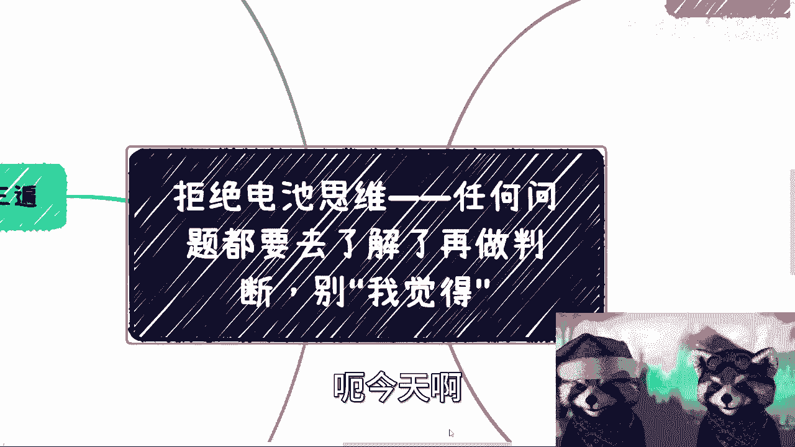
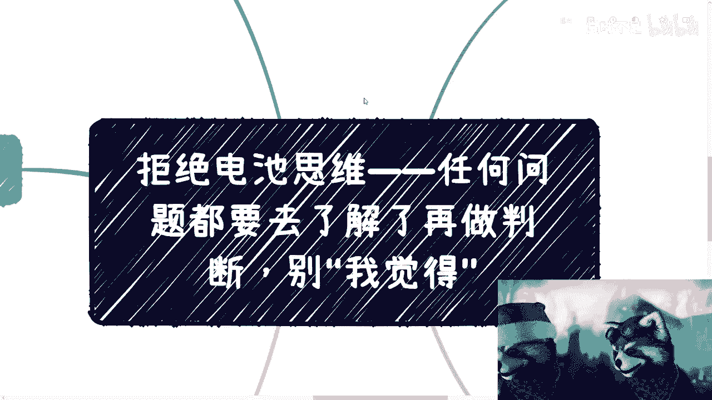
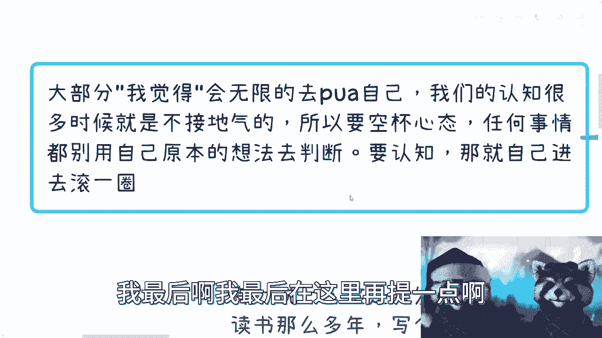

# 拒绝一切“我觉得”思维，这是最大自我的PUA - P1 - 赏味不足 - BV1mW4y1f79D

哈喽大家好啊，这个礼拜三是吧。

今天啊，今天我来给大家说一个非常有趣的事情啊，这个事情的确很有趣啊，这个经常发生，我也想不起来跟大家讲啊，这个问题叫什么呢，叫任何问题呢，你都要先去了解啊，然后去实践啊，自己去进去滚一圈哦，你在做判断。

你别就是以我觉得啊这个东西开头啊，本期呢所有的内容啊。

全部都是这个以讲故事的形式啊，大家很开心啊，首先呢重要的事情说说三遍啊，就有一说一啊，这是我发现最大的通病，就是我认为吧就是至少读书那么多年对吧，比如说这个社会上大家写个论文啊，你你怎么地参考的东西。

你也得写个出处吧对吧，写个参考文献吧，你总不能写本写写个论文，写本书对吧，你上面全部写，我觉得啊这个这个怎么样怎么样怎么样对吧，你也要去找对应的依据吧，啊也就是说在没有任何认知跟实践之前。

你一直要用我觉得去开头，我发现了这个就是阻止大部分人啊，绝大部分人这个往前走的啊，这个第一走出第一步的这个首要的杀手啊，就这么简单啊，嗯然后呢我们接下来就来讲这个故事啊，故事这可多了去了，实在是。

你比如说对吧，你看我为什么现在有两个小熊猫，就是因为我裂开了对吧，那裂开才有两个对吧，你比如说啊我前两天跟小伙伴线下吃饭的时候，我说是我我也提到什么呢，我说我提到了这个国家职业技能等级对吧。

我说啊蛮好做的啊，然后合肥啊对吧，上海啊，杭州啊，反正我说我各个地方了解下来呢，反正就是呃天时地利人和对吧，钱嘛也很好赚啊，而且钱也不少对吧，然后呢就是我发现啊，我不单单跟他讲，我可能很多人我都会讲。

但是呢就大部分人他这个一上来啊，他是这么说的，他说他当然就不不假思索对吧，脱口而出，就是说哎我觉得这个东西不好做啊，我觉得这个东西可能需要先关系对吧，我觉得这个东西我切不进去对吧。

反正就是就是我觉得开头可能有很多很多东西，然后呢就是这个事啊，你说我觉得怎么样怎么样怎么样对吧对吧，这个你脱口而出没问题，包括我跟别人说，我也会说的，哎我觉得怎么样怎么样怎么样，对不对。

但是呢你觉得怎么样这个说法O都无所谓啊，你想怎么说怎么说，但是你其实大部分人说这句话的时候，他的想法会被这句话直接扼杀掉，也就是说你你会发现就是他说哎，我觉得怎么样怎么样怎么样怎么样的时候啊。

这句话说完啊，就是我的想法是你回头对吧，有机会你可以自己去了解了解吧，去接触接触去试试看对吧，去怎么样子，对不对，他不是啊，他不是的，就是你你说完当他说完这句话的时候，我跟你讲，后面就没后续了。

你知道吗，就大概率就这样子，就跟什么就跟什么，哎我下载个PDF啊，下载完就算看过了对吧，就像我我我我就像我买，就像我我在steam上面买游戏的，买完就算打过了，就这种感觉你知道吗。

就是其实这个话说或不说无所谓，关键是我觉得对大部分人来讲，这句话说了之后呢，他其实是自己在PUA自己，你知道吧，而且你们没有感觉其实都是这样PUA的啊，然后我包括我敢打赌啊。

包括就是说就是说啊这个你们听我视频的对吧，或者说跟我已经咨询过的对吧，怎么样子的，我敢打赌，我说的很多东西你们不一定会去做的，为什么，因为你们在一边听的时候，其实自己已经在那边说了。

哎呦我觉得啊这个吕老师说的不对啊，我觉得这个就扯淡对吧，我觉得就怎么样有意味了，没有意义的呀，你觉得怎么样，你就这么想，你觉得怎么样对吧，对我有影响吗，没有对吧，那真实有影响是对你自己啊，是不是啊。

然后还有比如说什么呀，他说哎呀很多人就会问我嘛，他说啊这个政策信息哪里看，对不对啊，然后呢我在这个地方提一点啊，就是我说啊，就是为什么我做视频从来不会做一些，这个这个这么cc是cc啊。

对cc相关的解读对吧，我跟你讲，为什么，因为B站不让我不是没做过，我做过的，然后无论我怎么改都发不出来啊，所以你们就嗯懂吗啊，那么说正事啊，其实呢就是说这个政策信息啊。

基本上呢你们在那个government对吧，这个网站上都能搜得到，说白了啊，其实很多信息都是透明的，不是不透明啊，只不过呢就是说政府网站啊，这些信息比较的散啊，不是说不透明，不是说啊不是说大家就想了。

就说哎呀好像这个信息差很大是吧，怎么样子，你不看信息上是大的呀，那你看了中国信息上能缩小啊，对不对，但问题不看呀，你知道吗，就所有跟我说这句话的人，我都会反问他的，我说那你看过吗啊。

你你比如说你人在武汉对吧，人在成都对吧，人在上海，那你看过吗，你上海这边这个政府网站，你进去，比如说我别人不多啊，别人不说，你就踏踏实实对吧，花三个小时进去研究一下，有吗，也没有啊，你看都不看。

你就说哎这个东西可能做不了，这个东西可能信息差很大对吧，我我怎么不知道对吧，那那那屁话吗，你不看怎么能知道呢，对不对啊，我觉得真的就是就是我我跟你讲，我也有种错觉，我的错觉就是我觉得啊。

就至少这个9年制义务教育到高等教育，就咱不说数理啊，语数外这个啊这个叫什么物理，化学对吧等等等这种啊，我就说最基本的逻辑应该有吧，我就发现好像大家读完书最基本逻辑都没有，我也不知道为什么，你知道吗。

哦然后还有什么呢，你比如说啊参与活动对吧，嗯大家说的最多的就是什么说哎，我觉得别人觉得我们有价值对吧，我觉得自己提供不了价值，对你觉得是提供不了价值，但是问题是你想不想提供价值吗，你想提供价值。

你只能先从这第一步开始走啊对吧，你你不能永远循环在哦，到底先有鸡先有蛋对吧，我不知道先有鸡先有蛋，但我就不走了，不走了，我就停在原地对吧，原地踏步，那那更更没有一脸，你说对不对，就是正因为你要提供价值。

所以你才要去认识更多的人，你知道吗，正因为你可能认识更多人，所以在这些人里面，你可能会找到一些靠谱的，从而提升你自己价值，提升你自己的价值，对不对，你用第一个想法就去束缚住你自己，那那你还往后怎么走呢。

没法走了呀，对不对，那我我跟你说也好，或者你在这个工作上面对吧，你哪怕做电池好了，怎么样子，你永远都可以这么PUA自己，你就说哎我觉得不行，哎我觉得这个东西我做不了，哎，我觉得我这个价值不行，哎呀。

那那那你还说啥呢，你就安安心做电池呗，你就结束了呗对吧，我跟你讲啊，真的就是别又既要又要你知道吗，就是就是很多人啊，你迈不出第一步，你就安安心做，也别去抱怨啊，这个这个哎呀我怎么不能近身对吧。

我怎么不能赚更多的钱，那么屁话嘛是吧，这就像我刚刚说的这个你不是看政府网站，你还要抱怨说哎呀，政府信息不透明，真的我有时候想想真的太苦也蛮苦的啊，或者那句话我一直说哦。

我最近一直说的就是可怜之人必有可恨之处啊，你知道吗，那补充一句啊，其实真的商业合作呢，别人也不在乎你价值，为什么呢，因为别人只在乎赚钱，你价值价值不重要啊，这跟谁来跟你讨论你有什么价值，对不对啊。

就好像今天比如说你们来找我对吧，哦我现在跟你们见个面，大家吃个饭，然后我非要跟你们争执，哎我就问你我有没有价值对吧，你也要跟我争执，唉你就问我吕老师，你问要不我有没有价值，有用不啦，大家是什么大。

大家是这个钱太多对吧，花不完啊，还是说生活太过美好，对吧，这就开始纠结这个玄学上的问题，有意味了，没有意义的呀，对不对，我跟你讲，你最大的你最大的核心点在哪里，就是你对吧，说一个解决方案。

这解决方案成不成熟不重要啊，你说的解决方案你就告诉我你做什么，我做什么，怎么分润，对不对，好，然后在整个这个解决方案里面，有哪些路是你已经打通了，你已经联系过的，有哪些路你打不通，需要我去打通的对吧。

你说清楚啊啊然后呢你就说啊，这个东西大概周期多久对吧，大概我们怎么赚钱啊，这个钱可能从哪些人的口袋里来不就好了吗，结束了，对不对，那就算退1万步来讲，就算我跟你说，我说哎你这想法不靠谱对吧。

你这想法太过幼稚，但是你你也是有想法的，你知道吗，这都是你这个想法幼稚，而不是你这个人不靠谱，而不是说你这个人没有价值，这是两码事情，对不对，那最大没有价值是什么，最没有价值是你没有对吧，你也想不出来。

你可能做什么，你也想不出来，我能帮你做什么，你也想不出来大家怎么分润，你也想不出来大家到底怎么赚钱。

你也想不出来，讲不出来你自己怎么赚钱，那的确没有价值，对不对啊，这个是故事一啊啊还有故事二啊，故事二呢，你看啊我们换个角度啊，比如说啊很多人觉得啊我要读研啊，我要读MMB啊，我要读MM啊。

那么我每次问呢问目的是什么，那回答都是说哎我觉得啊这能看你看对吧，这个逻辑啊，我觉得可以接触更多的人对吧，我觉得可以提升自己的人脉对吧，我觉得可以有更多的合作对吧，有意义吗，没有意义啊。

为什么我就跟你讲，你读之前你去找一些读MBA的人，你去找一些读MM的人，你去找那些读已经那个考完研对吧，出来工作两年的人，你去找他们呀，你去问问看对不对，行不行行不行，你一问就知道了。

而不是你觉得你觉得有用了，你觉得只会给你自己挖坑，你知道吗啊，你问问他们啊，所谓的人脉有多少，你问问他们所谓的投资比例有多少，你问问他们在这些人身上赚没赚到钱过，对不对，你去了解了解，而且我跟你们讲啊。

你问就要多问啊，因为很多人是给你画饼的，你不知道他跟你什么关系，你就给他给你画饼的，你别听一面之词，没有用啊，啊你至少整个这个叫什么，就参考数据你得大对吧啊，你你你就算没学过统计学吧，你就算学过数学。

你也应该知道嘛对吧，你参考样本你就找那么一两个，那那有啥参考样本对吧，你就像很多昨天那个那个那个叫什么相互宝，也是的对吧，有很多人跟我说，哎相互宝哎我受益了对吧，我觉得很好的。

那你受益不代表这个东西好对吧，你要这么想的，一个不监管的东西，到最后如果真的出问题了，有多少家庭支离破碎，有多少家庭要毁灭啊，只不过今天没毁到你头上，你觉得好是不是没有用的呀。

啊再比如啊一个很神奇的想法，就是我跟你讲这个想法真的很神奇，就是我觉得啊我知道的可能别人都知道，而别人知道的我可能都不知道，我也不知道，我就不知道怎么会出现这种情况呢，你知道吗，就诶这个我我我国。

我国大学教育是这么PUA的吗，我就不明白了，这大家是被PUA的时间太长了嘛，啊就是就是怎么样的一个环境会让大家觉得诶，我知道的可能别人都知道，而别人知道我不知道，我也不知道为什么啊。

就是我跟大家去讨论这个商业逻辑的时候，一般都会有这样的问题，就是你会发现，比如说我跟他说商业变现对不对，那么他就会说哎呀，我说的一些东西可能别人都懂怎么办是吧，然后还有人跟我说呢，哎呀这个吕老师。

我们包装啊，要是包装别人被人揭穿怎么办，唉我又来说了啊，哥哥们，姐姐们，姥姥们，姥爷们对吧，爷爷们奶奶们啊，就是你懂的东西别人懂意味着什么，意味着他不是你的受众，意味着他不是你要割的韭菜，对不对啊。

你说你包装了被别人揭穿怎么样，那ok next，好吧啦，有什么好想的啦，妈的中国这么多人，有什么好想的，我也不明白了，对不对，有啥好想的呢，你的目的就是赚钱，你的目的就是把商业逻辑走通。

这些东西是你该去想的吗，不是你该去想的，OK对吧啊，那还有一种还有一种我跟你讲啊，还有种人上面的这个错觉呢，就是这种啊，我觉得就毫无意义什么呢，就比如说你今天打工啊，或者说你找人合作项目啊，打个比方。

你就跟我吧合作，然后呢我他妈就PUA你啊，我就骂你对吧，然后我跟你还吵啊，然后我说你不靠谱，你骂你对吧，哦好我就他妈不听骂你，然后呢哎我跟你讲就很神奇，我跟你讲很多人是这样的，他说就是你觉得其实就说哎。

你觉得啊吕老师不靠谱啊，吕老师就这个样子对吧，但是呢你会发现就有种很神奇的感觉，就是很多人依然就是，当他知道这个人是整什么个吊样子的时候，他还会抱有就是我觉得他可能会改变。

或者我觉得我能够在这人身上赚到钱，钱的这种错觉，卧槽我就你知道吗，就是就是我就惊了，你知道吗，就我觉得有这种那么王王牌特工对吧，王牌特工甲哦，二诶一号二忘记，就王牌特工里面那个脑子炸掉的那种特效。

你知道吗，就我感觉我的脑子升华了，就是就是明明你知道吗，很多人心里面知道这人不靠谱，也知道可能赚不到钱，诶，他还会去相信他，我靠牛逼啊，就是啊我跟你讲结论很简单，你可以相信任何事情啊。

但是你别相信人人是最不可靠的，就这么简单就这么简单啊，就这个就是所有踩过无数坑出来的结果，你们就算你们要是以后去踩坑，你们也会得出这个结果，就这么简单好，还有什么呢，那就是故事三对吧啊故事三啊。

比如说能碰到一些大佬啊，比如说像吕老师这种对吧啊哈好吧，我不算大佬，我是好吧，碰见吹得天花乱坠的，就是会有种我觉得这种人很牛逼，或者说这个人很牛知，就因为很牛逼，所以很靠谱。

但是呢关键是你也不知道他牛逼在什么地方，对吧，就是他也没有，就是就比如说说出来，让你能够幸福的一些观点对吧，他也没有自己的一些护城河，比如说他就懂得某些东西对吧，他也没有怎么样，他除了是虚的态度。

什么都没有对吧，然后很多人就会觉得哇很牛逼对吧，所以很靠谱是吧，我跟你讲没有用的啊，因为你你像对我呃，我早就说了，对我来讲，只要没有合作过，只要你没有给我赚个钱啊，我管你是谁。

今天这个title能他妈写五六张A4纸，跟我也没关系，跟我有什么关系呢，你跟我说，你一天赚一个亿跟我也没关系啊，我能赚到，我又赚不到，跟我有什么关系，对不对，我管你多靠谱啊，你不要给我画饼。

你也不要想PUA，我不可能的，对不对，你只有给我赚到钱，你才有可能PUA我就这么简单啊，我前面我比你，我比你PUA的真的怎么样了呢，对不对啊，这种一般啊，如果没有真正靠谱的人引荐我们，通过自己的社交。

也就是说以你们以我的这个level啊，这个水平啊，碰见真正大的概率是微乎其微的啊，你们就明白记住这件事情啊，没有概率的啊，不要在那边想着哦，牛逼了，我好像我好像今天运气很好啊对吧，怎么样。

你们不存在的啊，还有呢那种合作什么意思呢，就是无论是用户就散户，企业端，政府端合作，就是那种什么，就是我觉得啊我马上就要赚到钱了啊，我感觉我马上就要脱离电池了，我马上就能上个台阶了。

我跟你讲这种错觉都是错觉啊，就无论跟谁合作，无论钱多钱少，无论对方多靠谱，无论对方多不靠谱啊，你一切东西都是落合同，你录完合同，所谓不见兔子不撒鹰啊，一切就落合同，不落合同，你什么都没做啊，觉得很简单。

你不落合作不要转，我管你是谁，对不对，你哪怕今天是他妈的省省省厅领导在我面前，我也不管你的，不落合同，你你跟我讲什么东西了，对不对，你就是垃圾，对不对啊，钱一定要落口袋，什么意思呢。

就是说你要有要今天投资的对吧，要今天有合作的钱先打过来，不打也不是不行啊，那么你就说合同上面写清楚几月几号多少钱，或者说分批对吧，三比如说啊343对吧，或者说361都可以，你先付啊，钱不落到口袋。

没有落，合同什么都没做，一切都是假的哦，不要被PUA，不要自己感觉说哦，我觉得这事情靠谱，我觉得这件可以先做，我觉得我可能要先付出付出，你叉叉，你知道吗啊，一切都在被白嫖，仅此而已，唉呀真的对吧。

然后呢还有一点呢就是哎我这个是死吗，我感觉不是死啊，12345啊，五啊对吧，所以我才说呢任何事情都要去做，什么意思呢，就是说大部分啊就是我我我现在看下来啊，就是就是跟大家沟通下来。

就是我觉得这个开头啊会无限的去PUA自己，而且是就自己不会自知的，你知道吗，这这这有种像什么，有种像已经深入DNA的这种，这种这种很神奇的思维一样，就是我们的认知，就这个我们指的是普罗大众啊。

就老百姓啊，就我们的认知很多时候是不接地气的，你知道吗，就是这种不接地气，是因为我们的认知是被灌输的，所以我一直说要空杯，要空杯，要空杯，为什么要空杯，就是任何事情，别用你原本的想法。

或者别人灌输给你的想法去判断，你要有认知，那就得自己进去滚一圈，我跟你说，我我跟所有咨询过我的人，我都会补充一句，就是你们如果真的想要了解东西，你们必须双手双脚踏进这个池子里面，而不是隔岸观火。

你知道吗，无论是任何的东西，你但凡只是听别人说的，你但凡只是无论跟你多好的朋友，多好的关系，也无论家人多么牛逼啊，就你但凡只要听别人说的，都是隔岸观火，你只有双手双脚进去躺过一遍，滚过一圈了。

你才能明白这里面的东西，所以你看为什么我在回复很多人说，我都会说那句话，就是你们要真的掌握真的东西，就就硬本事对吧，要有真东西，你们就我不管你们全职兼职都无所谓啊，什么什么创不创业不重要，你知道吗。

就从形式上面，你们得进去all in，就是你可以今天以兼职的方式做，你今天也可以全职的方式做，但是你的状态是all in的，也就是说你一定需要以做项目的这种方式啊，或者说做做这种叫做啊。

你比如说要做个活动啊对吧，要做个培训啊，或者要做个什么什么什么供应商啊对吧，或者什么东西你就必须是做的这个模式去了解，你知道吗，而不是说就是说哎，我可能这个这个换个方式打打工对吧。

我比如说我跟跟吕老师合作对吧，你在我这边只能看到整个供应链，整个产业链的一个冰山一角，那其实你会发现你能不能赚钱可能可以，但是你对整个逻辑还是不了解的对吧，也就是说随着时间推移，你还是没有成长。

你知道吗，你要真正的自己进去主导一件事情，所有的细节你都得去看到对吧，都得去关心，你才能明白这里面的事情到底是什么样子，你才能明白真正的投入产出比是什么哦好吧，包括其实包括读书啊，包括培训啊。

包括考研啊对吧，包括所谓的体制内，体制外其实都一样的啊，都一样的，就是嗯好吧，我最后啊我最后在这里再提一点啊。

再提一点就是呃，我觉得大部分人啊有一个很大的一个误区，因为我聊下来也是这么个情况，就是大部分人一个误区是什么呢，就是呃你们很有可能一毕业工作是不错的，薪资也是不错的，但是一定要明白一件事情。

就是这个事情都是节点化的，就是都是一个阶段化的，千万不要把你们毕业的时候跟你们第一份工作，第二份工作的认知，把他就直接CTRLCCTRLV到30岁，35岁，40岁，因为后面绝对不会这么一帆风顺的。

而且后面绝对社会多变多样化的啊，千万不能以一开始的认知去做规划，那么这个规划很有可能会怎么说呢，就是让你走很多弯路啊，就这样子好吧行，那就这么着吧，然后那个好吧，大家有什么职业规划的。

或者说有未来这个副业想法的，或者怎么商业模式，或者就现在有一些这个有些东西对吧，就是商业模式不清晰的好吧。

