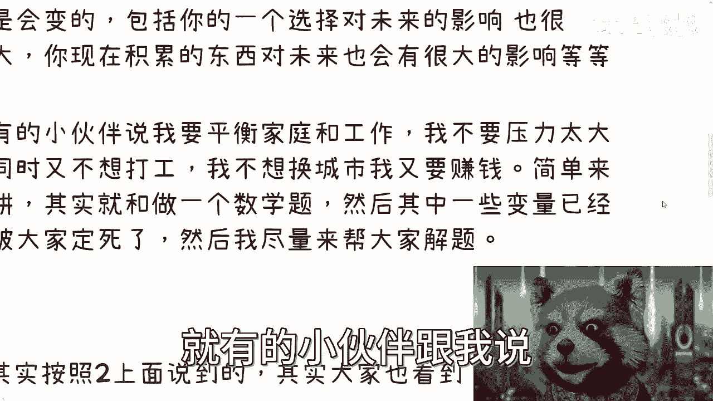
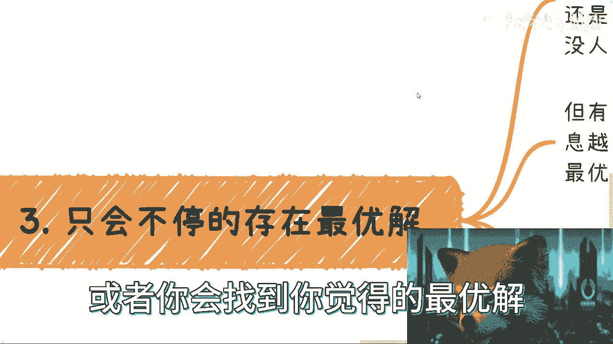
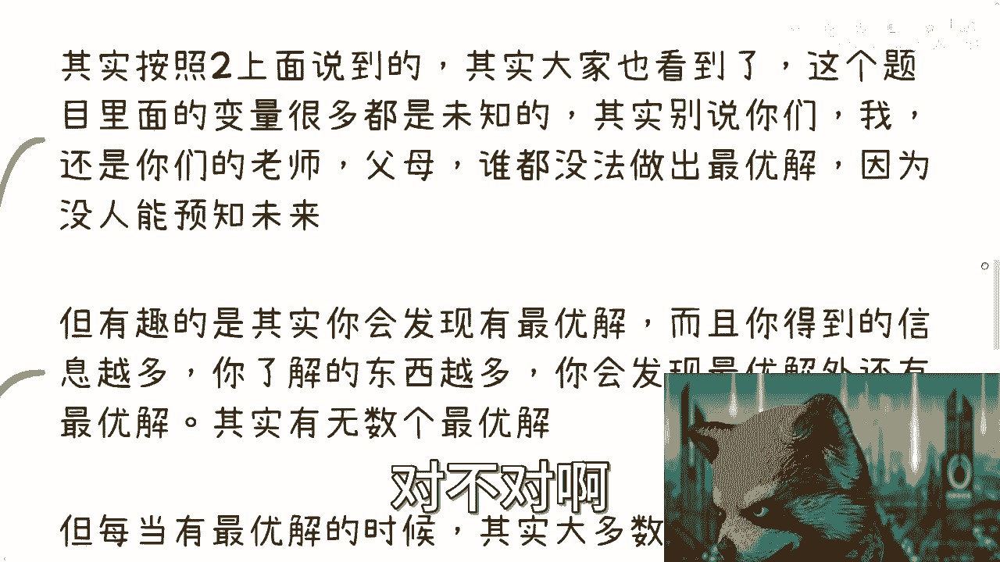
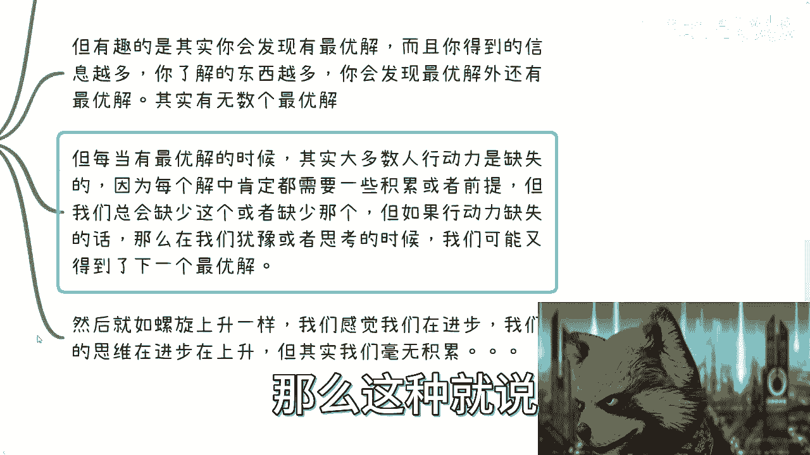
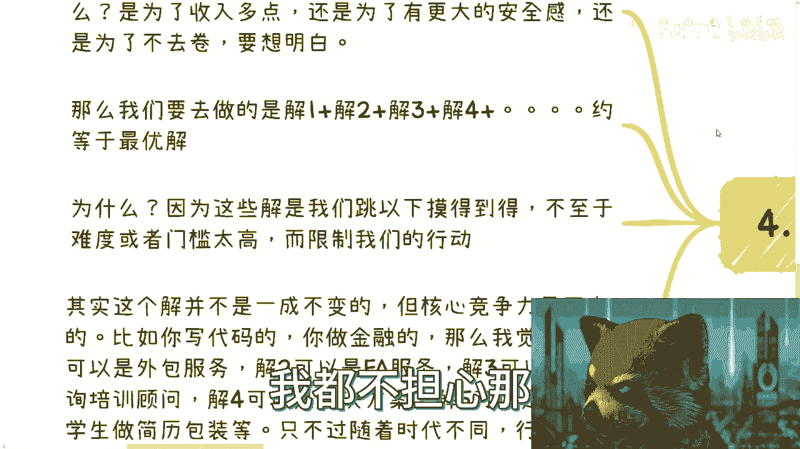
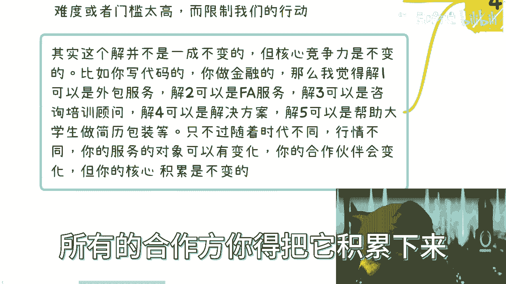
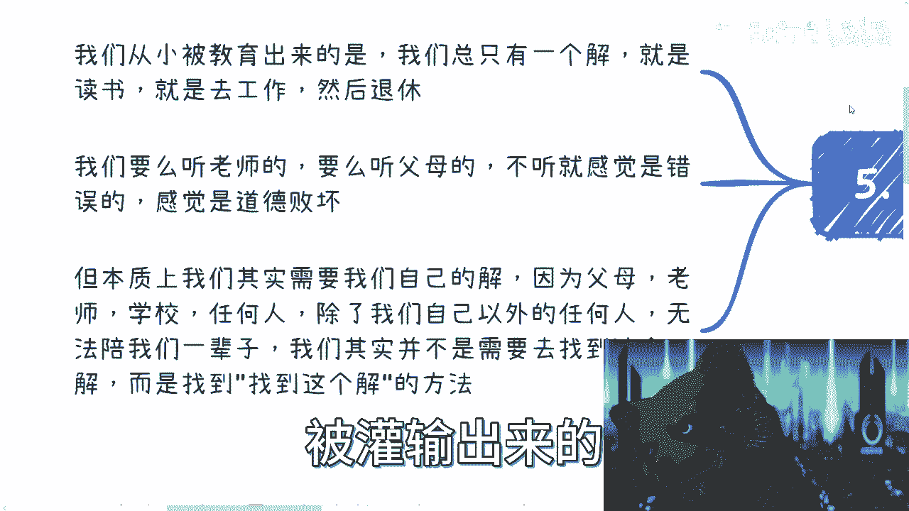
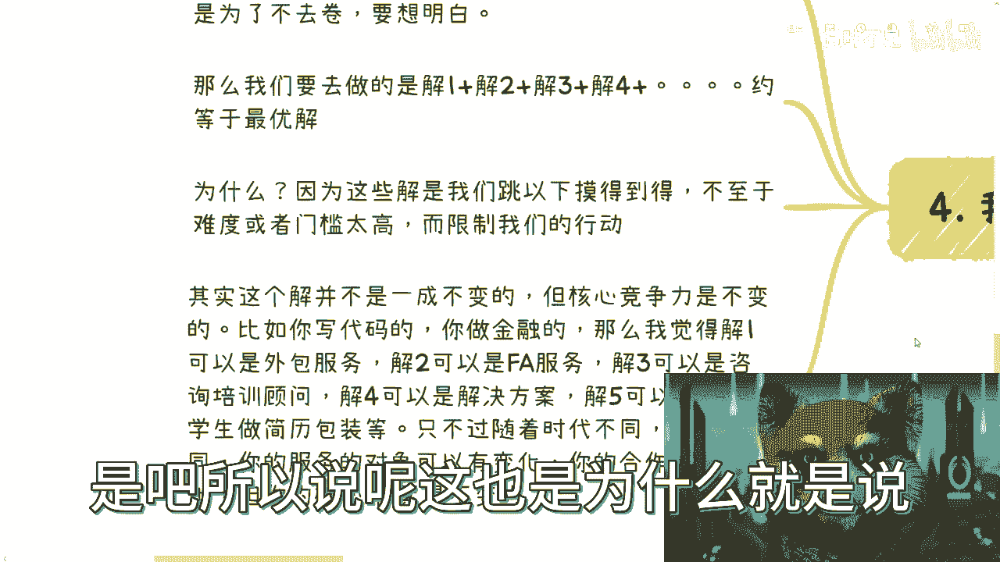
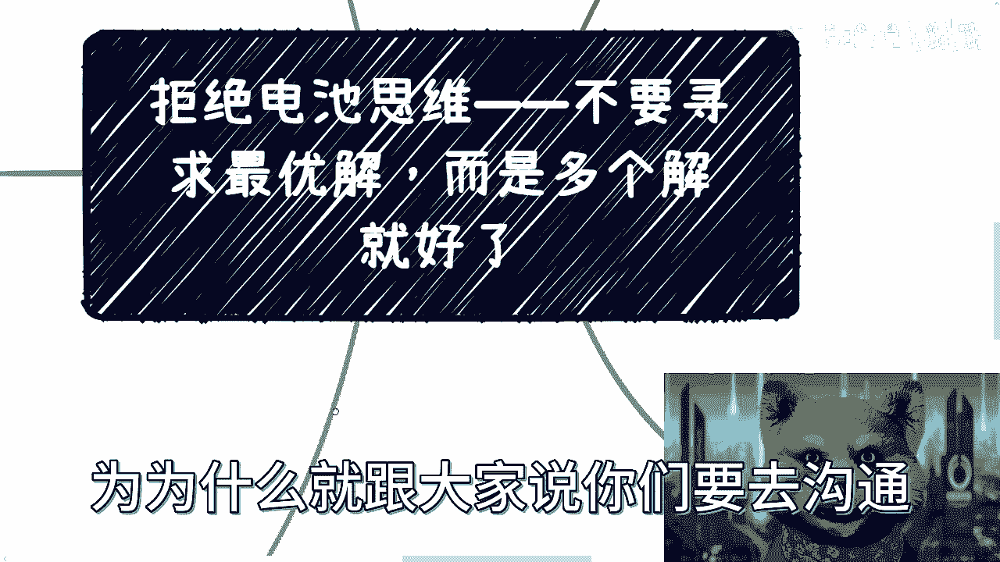

# 课程 P1：拒绝电池思维——不要寻找最优解，而是寻找多个可执行的解 🔋

在本节课中，我们将探讨一种重要的思维模式：放弃对单一“最优解”的执着追求，转而构建并执行多个可行的解决方案。我们将分析为何“最优解”难以捉摸，以及如何通过“多个解”的策略来应对职业与生活中的复杂问题。

---

## 概述：为何要放弃“最优解”？

在咨询过程中，我发现许多背景优秀的人，包括博士和硕士，都面临一个共同问题：他们都在竭力寻找一个完美的“最优解”。然而，这种追求往往导致行动力缺失、持续内耗，甚至陷入原地踏步的困境。

本节我们将深入分析“最优解”思维的局限性，并介绍一种更务实、更具操作性的“多个解”思维模型。

---

## 第一部分：“最优解”思维的陷阱

上一节我们概述了问题的普遍性，本节中我们来看看“最优解”这个概念本身为何充满陷阱。

“最优解”通常指在特定条件下，能最大化满足所有期望的解决方案。但在现实中，它受到诸多因素制约，往往难以实现。

以下是影响“最优解”判断的几个关键因素：

1.  **个人认知局限**：我们无法思考自己认知范围之外的事情。所有对“优”的判断都基于现有知识和信息。公式可以表示为：`可行解集合 ⊆ 认知范围`。
2.  **家庭与关系约束**：个人决策无法脱离家庭背景、责任（如赡养父母、抚养子女）以及对未来生活的规划（如是否结婚、定居何处）。
3.  **动态的时间跨度**：人的想法、目标和环境会随时间变化。当下看似最优的决策，未来可能带来未曾预料的负面影响（Debuff）。
4.  **变量的不确定性**：现实问题如同一个多变量方程，许多变量（如行业趋势、政策变化）是未知或不可控的，无人能精准预测未来。

因此，执着于寻找一个静态的、完美的“最优解”，很容易走入思维死胡同，导致不断寻找却无法行动的“螺旋上升”模型——感觉在进步，实则无积累。

---

## 第二部分：从“最优解”到“多个解”

既然“最优解”难以企及且充满变数，我们该如何应对？核心在于转换思维：从寻找唯一答案，变为构建一个可执行的解决方案组合。

我们可以将目标设定为：`解1 + 解2 + 解3 + ... ≈ 最优解`。

这里的“解1、解2、解3”代表那些低于你理想中“最优解”，但通过努力可以触及的可行方案。它们就像拼图的碎片，先从手边的小块拼起，最终组合成完整的画面。

以下是构建“多个解”策略的一个示例框架（以技术人员为例）：

*   **解1（主业）**：一份稳定的全职工作，提供基本收入和行业经验。
*   **解2（副业/外包）**：利用专业技能承接外部项目，增加收入渠道。
*   **解3（知识服务）**：提供咨询、培训或解决方案设计等服务。
*   **解4（内容/社群）**：通过写作、分享经验，帮助同行或学生，建立个人品牌。

**关键点在于**：这些具体的“解”并非一成不变。随着时间、机遇和市场需求的变化，你的服务对象、合作伙伴和业务形态都可能调整。例如，从服务企业转向服务个人用户，或与不同类型的机构合作。

然而，**不变的是你的核心积累**。无论具体业务如何变化，你在专业领域积累的项目经验、服务过的客户、解决的问题、建立的合作网络，这些才是你真正的资产和达成长期目标的基石。

---

## 第三部分：克服惯性思维，掌握方法

我们从小接受的教育往往倾向于“单一目标论”，即必须达成某个特定结果（如考上好大学、进入名企），否则就是失败。这是一种需要克服的惯性思维。

你需要明白，最终面对问题、解决问题、承担后果的人是你自己。外界的建议、父母的期望都无法替代你的人生。因此，寻找属于自己的“解”及其方法，比盲目跟随一个外界定义的“最优解”更重要。

那么，如何找到这些“解”呢？关键在于**持续沟通与信息获取**。

如果你刚进入社会，对行业运作模式“两眼一抹黑”，自然难以构想出具体的“解1、解2”。这时，主动与他人沟通至关重要。你可以：

*   请教行业内的前辈。
*   与不同背景的朋友交流。
*   有选择地进行知识付费咨询。
*   甚至通过“请人吃饭”等方式，低成本地获取信息和不同视角。

目的是让他人用他们的认知，帮你“翻译”你手中已有的牌（你的技能、背景、资源），看看可以如何组合、打出。这远比一个人闭门苦思“最优解”要高效和务实。

---

## 总结

本节课中，我们一起学习了“拒绝电池思维”的核心要义。

我们首先剖析了追求单一“最优解”的弊端，它受限于认知、家庭、时间等多重变量，容易导致犹豫和内耗。接着，我们提出了更可行的“多个解”策略，即通过组合多个可执行的、次优的解决方案，来逼近理想状态。最后，我们强调了克服寻找“唯一正确答案”的惯性思维，并通过持续沟通和学习来动态调整自己的解决方案组合。

记住，核心竞争力（你的经验和能力积累）是稳定的，而实现它的路径（具体的“解”）可以是灵活多变的。掌握寻找和组合“多个解”的方法，比找到那个虚幻的“最优解”更重要。