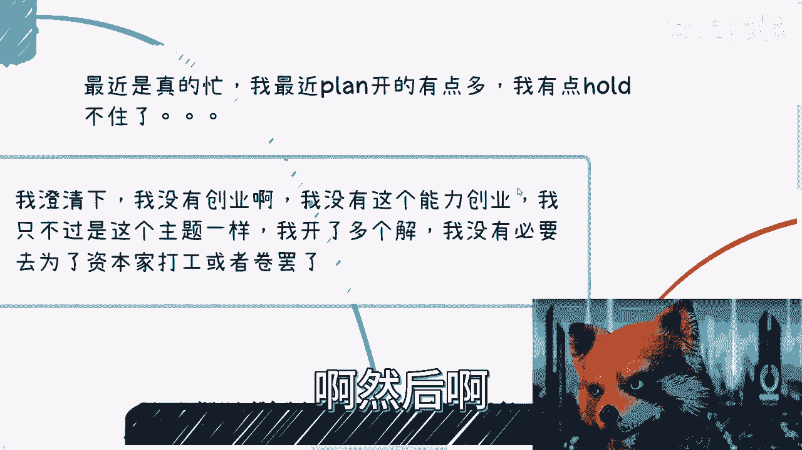
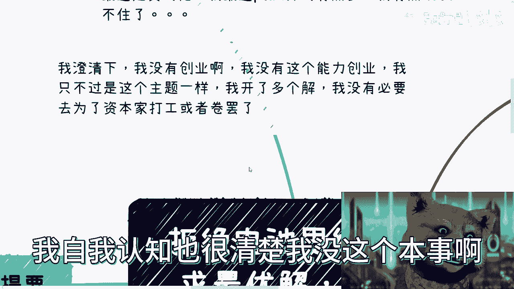
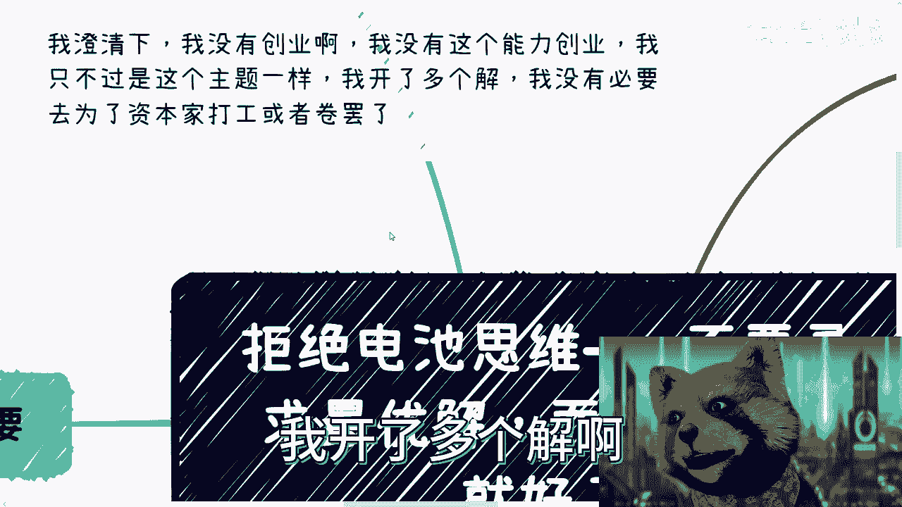
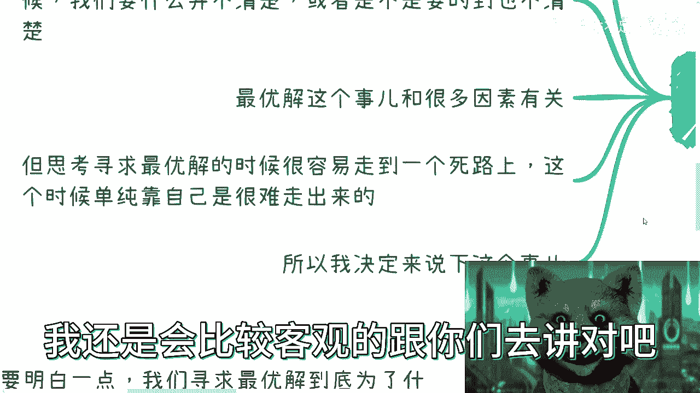
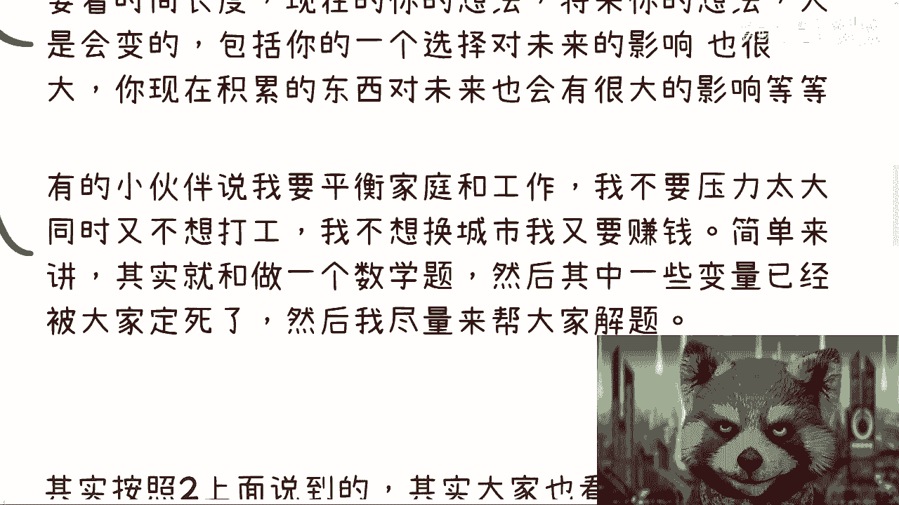
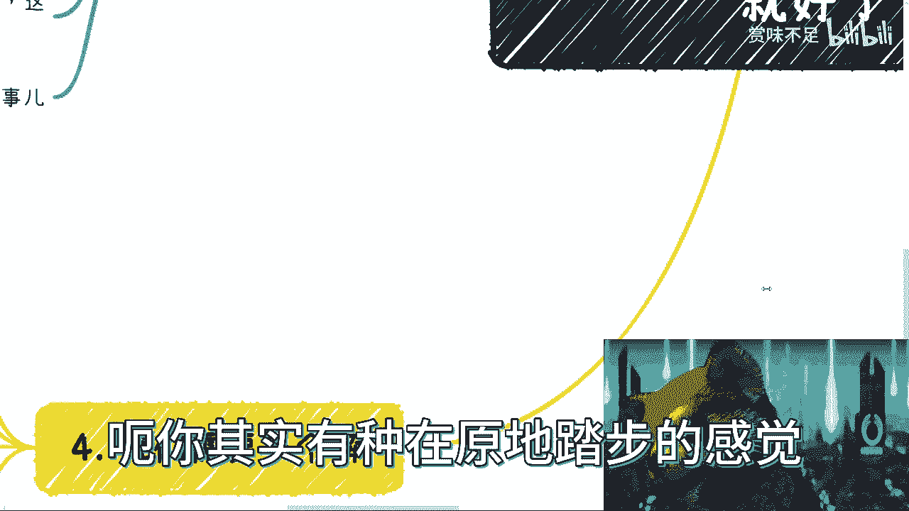
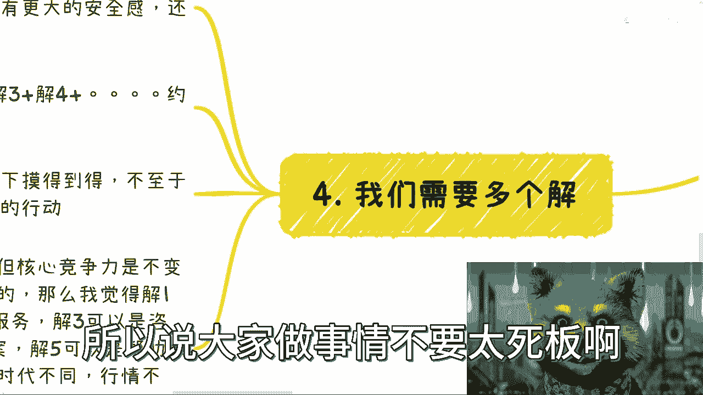

# 拒绝电池思维——不要寻找最优解，而是寻找多个可执行的解 - P1 - 赏味不足 - BV1AM4y1E7zQ

哈喽大家好啊，今天礼拜几啊，我都忘了这个最近哎太忙，真的太忙了，我跟你们讲，今天还有人来催更，我说我真的忙成狗了啊，呃我最近排练开的有点多，我真的hold不住，这个这个月啊。

这个月我这周人社部这边可能搞一下，提交了一些材料，然后下周的话是给那个广州那边出版社，然后得要讲一下那个数字经济，然后22 23在杭州那边有个ai体系的，这个课程，我得去讲一下。

然后28号上海这边给重庆人文学院，等下去上述的经济嗯，然后下个月我还要去北京人社部啊，我炸了炸了炸了，反正就是我炸了啊。

然后啊我澄清一下，就关于上次那个主题里面呢，有人提到创业这个事，就是我没有创业，我也没有这个创业的能力啊，我说的很清楚，我自我认知也很清楚。

我没这个本事啊，我只不过就跟今天这个主题一样，我开了多个解啊。

我没有，我也不想为资本家而去打工或者去卷啊，没什么太大必要好，那么本期这个主题呢是这样子的啊，叫做不要寻求最最优解，而是多个解就好了啊，什么意思呢，前情提要就我咨询下来啊。

我发现其实最近啊咨询来的人博士硕士啊啊，有26岁的博士对吧，有22岁的硕士啊，反正就很牛逼啊，反正就很牛逼，各种各样牛逼，然后有很多人问我嘛，就是就可能我朋友啊，他就会问我。

他说那那这些人有什么好咨询的呢，是不是，其实我觉得每一个人都有每个人的问题啊，我咨询下来呢，我觉得就不管背景怎么样啊，就是大家都一个问题，就是说所有的人都在寻求最优解，但是呢就是我跟他们聊下来啊。

我就会发现一个什么问题呢，就是说呃我倒不能说他们既要又要，就是因为感觉他是有些区别的，什么区别呢，就是说很多时候就是所谓既要又要，就是我们得知道我们要什么东西啊对吧，但其实我们在寻求最优解的时候呢。

其实就感觉并不是说一定要什么是很清楚的，或者说是不是要得到也不清楚，你知道吗，但是这个最优解是什么呢，就是啊比如说a找我对吧，a里面其实会列出来很多解决方案，他觉得哎比如说有a b c d e啊。

这么一些这个这个方案我已经想过了对吧，然后呢但是总感觉啊，就是说这个呃，每一个解里面总有一些东西是达不到的啊，如果达不到，那么它就是最优解对吧。

那么我们说最优解这个事儿呢，跟很多因素是有关系的，这个但是啊我们说结果是什么呢，就是寻求最优解的时候呢，我们是很容易走到一条死路上的，就是有时候其实你会发现，就是因为我咨询的人多了，我就清楚了。

就是就是并不是说我一定啊，就比如说大家给我一个题目啊，你说让我给给你们一个解，对不对，不是说我一定能给出你们一个解，而是说很多时候这个解是需要沟通，是需要去交流的，而且啊我倒不是说我一定认知。

或者在很多当当中比大家高啊对吧，但是就是说你得需要找一个，就是说得要对商业啊，对工作啊，对很多东西他得有个正常认知，他不得有，他不能很有偏见，你说对吧，你就好像我我跟大家说说公务员我不考虑的啊。

我不推荐的对吧，你比如说什么什么那个读研我也不推荐的，就虽然我不推荐是不推荐，但是我绝对不会跟任何一个人说，你不能你不能做啊，我死活不能做，做了你就垃圾，我不会这么说的对吧，我会客观的。

你比如说今天评论区还有评论跟我说，他说啊，我软件测试跟考公哪个选怎么选，我说如果你只是二选一，撇开你所有的这种客观因素，撇开你所有的变量，但凡二选一，你必须考公，就这么简单对吧，就是我不会说。

因为我个人的一些这个判断啊，跟大家说啊，我戴有色眼镜，虽然我现在戴的确是个有色眼镜，是不是啊，就是戴着这个有色眼镜啊，跟大家去说，我不会啊，我还是比较客观的跟你们去讲对吧。

所以呢总体来讲我觉得我得就跟大家说一下，这个事情嗯最优解跟哪些因素有关呢，是这样子的，就第一呢我们说跟自己的认知是很有关系的，因为一切的解所谓的优啊，我们都是局限在自己的认知里面的，你们也好，我也好。

都一样啊，我们毕竟不可能思考出来自己不知道的事情，所以说才需要不停的去交流沟通对吧，包括其实呃就是找我咨询的人，有一些我不确定的对吧，我会跟他们讲，我说我可能比如说结束之后，我会去找专业的人对吧。

就有些东西我的确不知道，那我会去问一下他们的意见，然后呢我再反馈给我们咨询的小伙伴对吧，这是第一个，第二个就是说最优解，其实跟你父母跟你家庭也很有关系，为什么，因为你我们每个人的家庭不一样。

每个人跟家庭的关系也不一样，那么你当下做出这个最最优解的时候，你一定要考虑到未来你跟你家庭的这个关系哦，包括就是说你要你是不是要顾家啊，你父母是不是年纪大了，你父母身体好不好呀对吧，包括你自己的家庭。

比如说你你还有没有孩子啊，对吧，你要不要未来要不要结婚啊对吧等等等，很多东西你都得考虑进去，你不能说啊，我是我头脑一热啊，我要考虑一个最优解，就是我当下就感觉啊我就要赚钱，我就要找工作。

我就要什么样子没问题，但是你考虑问题，你得把全局考虑进去，包括是什么呢，包括就是说啊我我找我咨询啊，我一般一开始我其实都会问一个问题，我说你要不要你愿不愿意换城市，为什么呢，因为对我来讲。

我不是说大家一定要去换一个贝斯贝斯蒂对吧，你说啊我现在在杭州，我非要让你换来上海对吧，我非要让你换到北京，不是的，而是说我们其实要去换一个城市也好，怎么样也好，我们其实是为了拿那个城市的信息差。

我们是为了积累那个城市的资源，我们是为了开拓更多的眼界，而不是说我们一定要去换一个贝斯d对吧，你说啊我老家在这，我非要跑到什么地方，没必要对吧，不过就是一个曲线救国的方法罢了啊，那么这是第二第一点啊。

那么还有就是说要看整个的这个时间跨度啊，呃这个问题其实我说了很多遍了，就是你现在的想法并不代表你将来想法对吧，同时人是会变的，你现在呃就是可能觉得我很佛系对吧，我我很躺平对吧。

但是很不不代表你以后也这样哦，很有可能你经过了一段时间，经过了几年之后，哎你现在是不是那种很会折腾的，哎，你可能到了25，26 27啊，到到了30哎，你就觉得我不行啊，我觉悟了，我打通任督二脉了对吧。

我就必须要干啊干好，那么你就会发现其实你的想法实在不停的变，所以说从这个角度来讲，你当下解你没有所谓的最优解对吧，而且你甚至也有很多人会说啊，他说我不要那种这个影响很大的，我只要当下最优解。

其实你甚至不知道当下最优解是什么，因为你所有的决定也会对未来造成影响，你当下所谓的最优解，很有可能在未来给你带来很多的debuff，你只是不知道啊，我也不知道，没有人能知道对不对，所以说所以说你看啊。

就有的小伙伴跟我说。

他说我要平衡家庭跟工作对吧，我不要，而且还有的是说他说我不想压力太大，同时又也也不想打工对吧，他说我也不想换城市，但是我要赚钱对吧，简单来讲是什么呢，就是其实所有的咨询，在我看来它就是一个数学题。

就是你们给我他的一个背景，你们给我一个公式，同时呢，这些公式里面的变量有部分已经被你们定死了，就是你们就比如说就说，就说我就是不想要太大压力，我就不想心理上有太大的负担，我就不想换城市。

但是我又想赚钱对吧，就是说在很多这种这个变量确定的情况下面啊，然后需要我来给大家去解这个题，或者说我跟大家沟通之后能找到一个对吧，就是即在当下能够是一个最相对优的解。

同时又就是为未来的各种分支情况考虑进去的，这个这个这个这个前提之下啊，能够对未来不管你走哪条分支，能有一定的帮助的终结对吧，其实是这么一个逻辑。

那么我们来看啊，其实你会发现在你找最优解的时候呢，你只会找到云，就是你会找到最优解，或者你会找到你觉得的最优解。

但是呢你会不停的找到你觉得最优解，为什么啊，因为你按照刚刚我们上面的逻辑来讲啊，其实你们看到了这个题目里面有非常多的变量。

都是未知的，也别说你们也别说我别说你们老师，别说你们父母谁都没有办法做出最优解，因为没有人能够预知这个未来，对不对啊。

但是非常有趣的是什么呢，就是你会发现随着你的沟通，随着你的这个我不管是这个有用的沟通，还是为为外面的噪音啊，还是说比如说你今天看了几个抖音的短视频，对吧，我看了几个不不不b站的短视频对吧，你会发现诶。

我昨天认为的最优解在今天我觉得不是最优解，我今天可能找到一个新的最优解，而我明天可能找到个比今天还要最优解的，最优解，你知道吗，那么你会发现这些最优解外面还有最优解，其实有无数个最优解啊。

只不过就是说这些最优解，很有可能不是最优的啊，嗯但是你现在不知道啊，我们假设它都是最优解啊，但是当每当有最优解出现的时候呢，其实大部分人的行动力去缺失的，为什么，因为这个就又回到我们说的。

那个那个那个每个人的思考方式上面，因为你觉得最优解的时候，你其实是抱有怀疑的，抱有质疑的，你会去思考对吧，而且呢你会去思考的是在这个解当中。

我们缺什么对吧，就好像我跟你们讲，我说好，打个比方啊，未来割韭菜就是你们的最优最优解啊，那么这个时候你就会发现诶，我要去割没问题啊，但是我现在缺什么，我可能缺少是流量对吧，我可能缺少的是我的这个产品呃。

割韭菜的镰刀对吧，我可能缺少的是能够帮助我一起去割的，那个小伙伴对吧，你总归会缺少这个缺少那个，那么由于行动力的缺失，那么我们就会进行犹豫，我们就会进行思考，就是我们所谓的犹豫和思考。

就是他到底是不是最优解，这个解当中还有哪些东西是我没有的，那么我到底通过什么方式能够去积累这些题啊，这些因素对吧，那么这个时候你就会发现，随着时间的推移，我们很有可能在还没有执行这个最优解的时候。

我们有可能会得到下一个最优解啊，只不过我们刚刚说了，这些最优解不是最优的，只是你觉得最优对吧，那么然后呢，这一切就像一个螺旋上升的一个，一个一个模型一样，也就是说我们感觉其实我们在进步。

我们感觉我们的思维在上升，但其实我们毫无积累，就是大部分人面临的一个问题，就是我们就说啊，这件事情很有可能是几个月内发生的啊，这个事情也有可能是几年内发生的，都有可能哦，或者来说就是这么说。

就是你行动了一部分，你做了一部分，但是呢你行动到一半啊，你又被另外一个最优解吸引了，也是有可能哦，那么这种就是说。

我们称之为一个螺旋上升的一个模型，但是呢呃你其实有种在原地踏步的感觉。

那么这个时候呢我们需要多个解，什么意思啊，就是我们首先得要明白一点啊，我们寻求的最优解，最优解到底是为了什么啊，就是我们到底是为了收入多一点，还是为了有更大的安全感，还是为了不去卷啊。

还是因为别的一些原因，你得想明白啊，不是说不是说我今天找到一个最优解，我只是为了找这个最优解对吧，你得想好，那么这个时候呢其实对于大众来讲啊，我觉得最好的方式是什么，就是去做一个东西。

叫做减一加减二加减三加减四加等等等等等，约等于最优解，因为为什么，因为这些解就是剩下的这些解，它一定是那个列于最优解的，低于最优解的，或者差于最优解的对吧，但是这些解对我们来讲。

我们是稍微跳一下就够得到的，就摸得到的，不至于像最优解一样说，哎我们要通过什么12年去做准备以后吧对吧，或者说哦好像就是说我们可能当家哎，感觉门槛太高对吧，由于这个这个这个这个心里害怕对吧。

或者因为别的一些原因限制了我们的行动，不至于对吧，这个就像我们今天做一个什么拼图一样的，就是我们要的就是最后这张图，但是呢我们总得先从一个小平板去拼，而不是说我今天啊，我今天非要啊找到一张完整的对吧。

我说一个1000块的拼图，你今天就给我出去找啊，这个翻遍所有的垃圾桶对吧，翻遍所有的地方，你就给我找好，我必须要找到一张一张1000块啊，拼在一起的对吧，一个不缺的，这你难度太高了，对不对啊。

那么所以说呢就是你会发现嗯，我们上面的这个减1-2-3，你可以把它理解为减一，可能就是你的一个主主主主页对吧，然后减2-3-4是你的副业，你也可以把它理解为跟我一样，比如说没有主页对吧。

减1-2-3-4都是-1，但是约等于一个主页，然而这个主要就是最优解，所谓最优解就是我不会做的不开心，我也不会做的情绪很差，我也不会被道德绑架，我也不可能担心，第二天有人跟我说好，陈老师，你别干了。

你明天就滚吧，我都不担心。

那不是蛮好啊，那么所以说呢这个解并不是一成不变的啊，但核心竞争力是不变的，什么意思呢，我们打个比方，比如说你今天是转码的，你今天是做金融的，那么我觉得解一你是可以去打工对吧，减二你可以做外包服务。

减三你可以做金融的f a解释，你可以做咨询培训顾问，解五你可以做解决方案，解六，你可以帮助帮助你对应的这个专业的大学生，做简历包装等等等，很多东西可以做对吧，不止啊，只不过呢随着时间的推移。

随着时代的不同，随着行情的不同，你的服务对象可能有变化，就比如说你本来这些东西服务的是企业对吧，那么可能随着时间的变化，随着机缘巧合对吧，你要去服务那个用户啊，就是普罗大众，你也有可能去服务政府对吧。

或者说你的合作伙伴伙伴会变对吧，有的你一开始合作伙伴可能是一些，比如说什么什么渠道对吧，或者协会，那么你可能随着时间推移呢，哎你的合作伙伴变成了银行啊，变成了什么什么别t变成字节对吧。

你要变成了什么咨询公司对吧，什么thought works这种对吧好，那么但是不管你怎么变，不管你的业务怎么变，你的核心积累是不变的，比如说你得积累你写代码或者做技术的，在这里面的这个经验。

就是你你做过哪些项目啊对吧，你做过哪些服务啊对吧，你服务过哪些客户啊对吧，这些东西是你要积累下来的，你做金融也是一样啊，我不管你现在银行做，在证券做，在哪里做，那么你做的所有的经验，所有的服务的客户。

所有的合作方，你得把它积累下来。

这个是核心，这个是达成最终最优解的那些条件，至于你说这里面的解一解二解三，是是不是说哎这个一成不变，我跟你讲，绝对不可能一成不变的，没有东西是一成不变的啊，所以说大家做事情不要太死板哦。

不要太死板，那么我们在这个地方呢。

还有提一点，就是所谓的惯性思维，我们从小被教育出来的是，我们总可能只有一个解，可能啊，就是说并不是说只有一个解，而是说我们只有一个目标，我们一定要冲到这个目标，我们的家长。

我们的老师给我们的感觉是什么呢，就是你不到这个目标，你你你就是错误的，你就是道德败坏的啊，也不叫道德败坏吧，就是你你就不行啊，就是他永远会告诉你啊，不那个人，别人家的孩子怎么样怎么样怎么样对吧。

包括就是说我们以前说什么结婚，谈恋爱是一样的对吧，你必须谈，你必须结，你必须生孩子，你哪怕结了之后，生孩子之后离婚也是对的是吧，你不结，你不谈你就是不行的，就这种感觉对吧，但是这种呢都是被灌输出来的。

所以说呢我觉得本质上啊，我们需要的是我们自己的一个解，因为父母我们要明白一点，就是无论怎么样，大部分情况啊，父母老师学校任何人，包括我除了我们自己以外的任何人，没有办法陪我们一辈子对吧。

也就是说你前面可以follow别人，就跟着别人的想法对吧，我不管因为你是被道德绑架了，还是因为你从小被灌输了很多想法，还是说你可能道理都明白，但是你感性上不能接受对吧等等等等，有很多种原因。

但是你得明白一点，最终解决问题，面对问题，生存都是我们自己的对吧，你要靠父母，你不可能靠一辈子，你要靠老师，靠学校，你要靠别人，你也不可能靠一辈子哦，你要说哎你父母是什么公务员，是省厅的领导对吧。

我还是那句话，你也不见得能靠一辈子对吧，你无论要多少钱，你要要真的说不好听点，你要被骗，你要被你要亏掉，你要让你要去折腾，其实也很快啊，你其实也很快，因为毕竟社会太卷了，你不去折腾就有人会来折腾。

你不去拼就有人会来拼，一样的道理，所以说呢我觉得啊，我们不是一定一定要去找到下面这些减1-2，减3-4，而是说我们要去找到找到这个解的这个方法啊，你说是不是找到这个解，我觉得并不重要啊。

但是我们寻找到这个方法啊，所以说呢就是嗯我们回到再回到这个地方来啊，就是这些东西跟你的认知跟你的关系，跟你对我们说的这个这个所有的这些，就是企业啊，学校啊，社会啊，政府啊，他的一些运作面运作。

运作模式其实都有关系对吧，你说我现在什么都不知道对吧，我现在就考研刚出来，比如说大学刚出来或考研刚出来，我两眼一摸黑，你让我去想解一解二，解三解四，想不出来的对吧，那么你跟别人去沟通。

你也怕被别人骗是吧，所以说呢这也是为什么就是说从头到尾啊。

我其实为为什么就跟大家说，你们要去沟通。

你们要去，包括我之前也说过吗，就是说你们可以不去花钱去，就说什么做什么呃，知识付费对吧，或者怎么样子，你们可以不花这个钱啊，但是你们可以选择花钱去，这个叫什么请人吃饭对吧，就是就是大家沟通嘛对吧。

就沟通嘛，想办法把把更多的东西就是你现在手上的牌，通过别人的认知来给你翻译一下，看看你这些牌怎么打对吧，而不是说非要去想最有钱，因为很多时候真的我碰到过太多的人，就是可能从十几岁就开始想最优解。

然后呢每个阶段大学毕业啊，工作啊，然后每个时间点，比如说21岁，22岁，23岁都在想最有钱，一直在那边想，一直找不到，一直在想，一直找不到，然后时间过去，然后自己又很内耗。

然后心里又又又又又觉得我很焦虑，很抑郁对吧，没有没有，其实没有意义对吧啊，所以说嗯，所以说我会把这一期放到电池思维里面，因为我觉得这个惯性的想法太大啊，惯性他们想法太大，好吧行好吧，就这么着。

那个反正有什么你们整理好问题。