# 拒绝电池思维——千万别着急公开的去自证有几碗粉 - P1 - 赏味不足 - BV13h4y137yM

好啊大家好呃，九点钟待会儿正好有个咨询，我趁这个时间之前，然后再给大家补一个补一个，就是我今天游戏也录了嘛，是吧啊，首先是这样子的，我先说一下对吧，我动态里面说了这个，大概十几20多个吧。

来自于各行各业，各个国家啊，然后我会让他们来介绍一下他们的所见所闻，同事也会跟大家说一下，就是因为跟我都很好的朋友，都很交心的，我会让他们分享一下，就自己的一些成长经历，反正对大家肯定会有帮助的啊。

然后这一期呢我们来讲的是说啊，电池思维里面有一点是很重要的，是什么呢，就是千万别想着公开公开的去自证清白，我本来啊写的是自证清白，但我后来想了一想，自证清白还是要的啊。

但是又不能不要想着公开的去自证清白，而且另外一方面就是说千万也别去内耗啊，那么在这个地方呢。

我首先说一个大的前提，就是很多时候我们面对困难和质疑啊，这件事情是跟你的影响力，跟你的欲望，跟你要做的事情的大小是成正比的，因为很多人他会说啊，他说这跟我没什么关系对吧，我平时也这个生命线比较平对吧。

没什么波动的呃，你之所以生命线比较平稳，不波动，就是因为你现在要的少啊，你出去折腾的少，你但凡折腾的多了。

你碰到困难跟质疑，自然而然就会变多啊，这毫无疑问的事情。

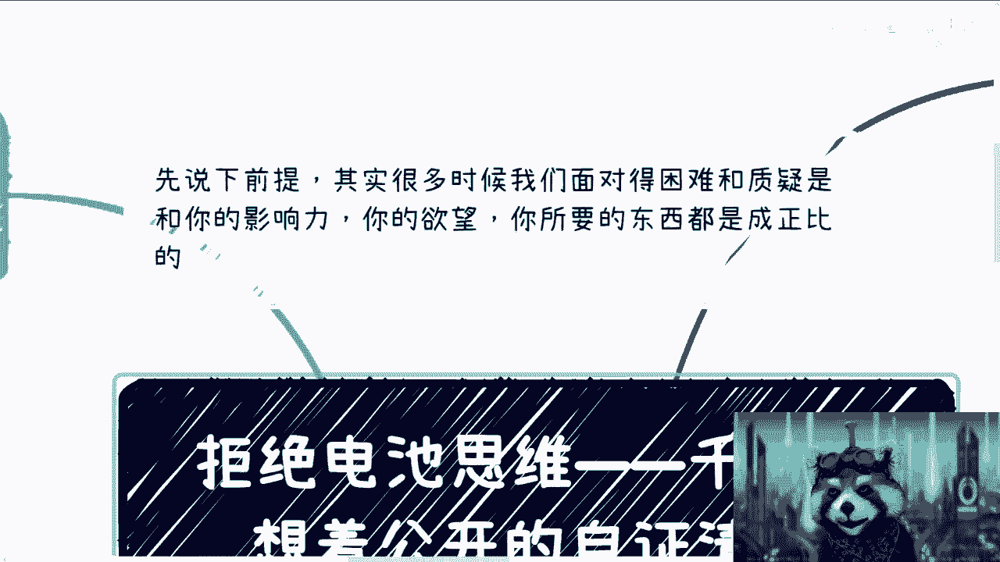

然后呢我们来看啊，首先第一个第一个这个事儿吧。

我觉得无论什么场合，什么上下文啊，脑子一定要清楚。

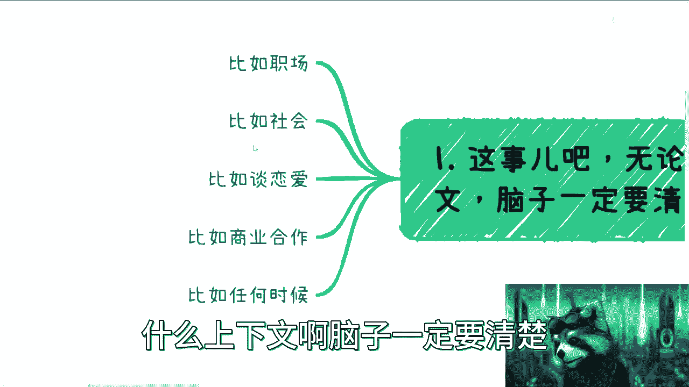

比如说啊这些事所有地方都会碰到，比如说在职场，在社会上在谈恋爱对吧。

商业合作就是几乎任何时候，因为嗯还是那句话，就是这要看你们的，就是说啊就是做的事情的一个大小，因为你就这么想嘛，你但凡事情折腾的越来越多对吧，你你社交的越来越多，你比如说应酬越来越多，你碰到的矛盾。

你被别人的这个嫉妒的点，别人要来攻击你的点也就会越来越多，这没有办法的事情嘛对吧，所以说就是你我跟你说，很多东西都是成正比的哦。

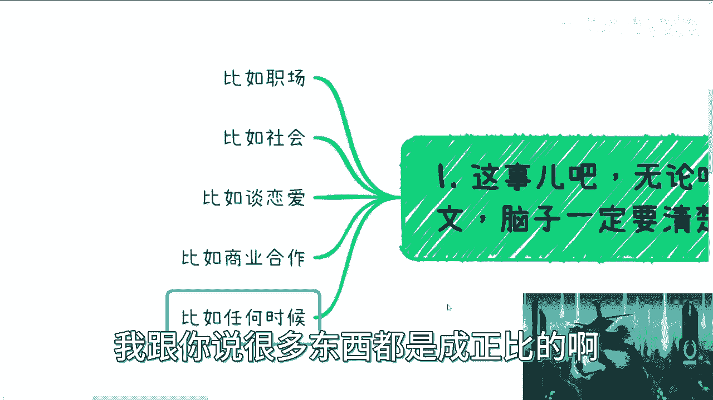

就是你现在没有，并不代表以后没有哦，而且就是说很多事情呢。

他是一个，就是说，就是你相当于就是在一个水里面扔下来了，一个石头，然后他不是有很多的涟漪嘛对吧，就是你你会发现你做的这件事情，虽然是一个石头对吧，你自己觉得哦我可能往这方面做，但是呢它所引起的这个涟漪。

是你现在可能想象不到的啊，但是这些事情对你未来都会造成很大的困扰。

那么我就这么说，为什么他会我会放在叫做拒绝电池思维，这个这个这个这个内容里面的，就是因为很多时候你受不了这个困扰，或者说你不知道如何面对，就是因为你还是具有很强的电池思维，你知道吗，这首先是第一个啊。

然后第二个我们一个个来说啊。

那么先说职场对吧，比如说啊嗯你不同。

就是你现在在做一件事情对吧，你但凡还是那句话，你但凡做的有点成绩，你但凡想啊有一定的表现欲啊。

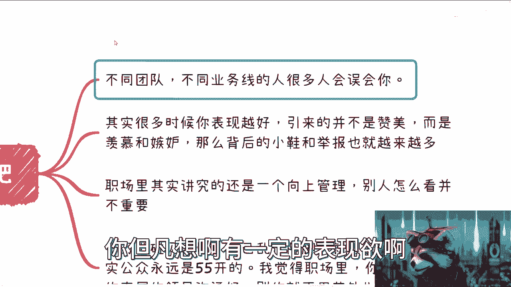

而且我们说不管是虚的还是实的啊，你不同的团队，不同的业务线，很多人其实都会误会。

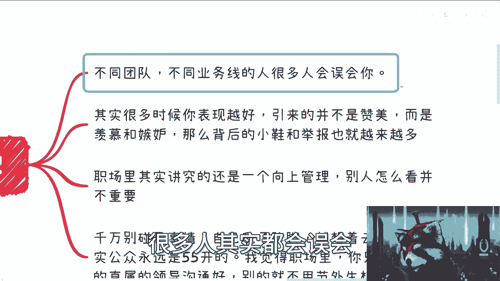

你好，就是没有办法的嘛，因为很多人他是不明白你在做什么的对吧，这就好像这就好像我们打个比方，这就好像啊，你在就是比如说你现在你因为每一个公司里面，每一个团队，每一个业务他总有分工的嘛对吧。

有的人可能是做现在的一些业务，有的可能是创新业务的探索对吧，那如果你现在在做一些创新业务的探索，那对于很多人来讲，你就在不务正业，因为他不知道你在做什么对吧，那有可能是他的这个这样吗，理解力不够。

也有可能是他的视野不够宽，也有可能是他觉得啊对吧，自己很苦，而你为什么在那边做一些创新的东西对吧，然后好像又不是很加班对吧，就是说他有很多种理由来嫉妒你，或者来说啊他故意去误会你对吧。

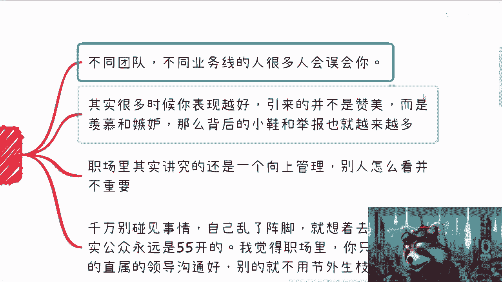

那所以你会发现很多时候尤其在职场里面，因为职场它是一个就比较封闭式的一个地方，对吧，它不像社会当中这么的就open，那相对来讲啊，这么多open就是有什么大家骂嘛对吧，你再再不济。

就是现在很多人动手嘛对吧，但职场你们不一样，职场里面就是那种小人特别多，哈哈啊，小人特别多，那么，然后呢就是说呃我们会发现就是在职场里面呢，你会你会发现就是说但凡你表现的越好啊。

引来的可能并不是什么赞美。

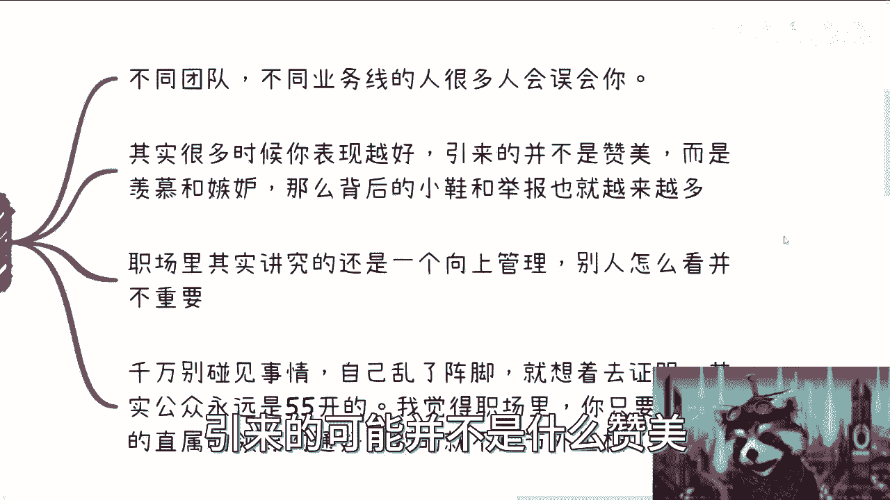

而是羡慕跟嫉妒啊，那么背后的小学和举报也就越来越多对吧，这是毫无疑问的啊，你们但凡就是想做点什么，一定是这样子的。

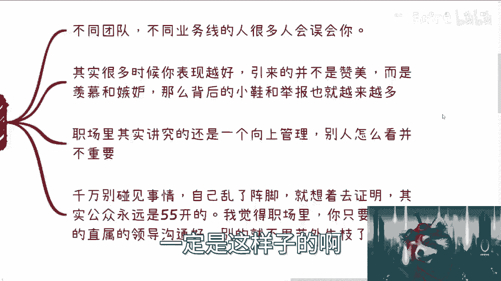

那么这第一个，第二个呢，就是职场里面其实讲究的还是个向上管理，就是我本来了觉得就是说啊，这个你只要自己脑子清楚对吧，也不用去自证清白，我后来想了想不对啊，就职场里面呢。

其实你最终还是讲究的一个向上管理哦。

别人怎么看不重要，为什么呢，因为就是说你如果碰到点事情对吧，第一你肯定有些风言风语传到你耳朵里对吧，我觉得这个你就当左耳进右耳出，就当没这回事，你知道吗，第二呢就是说千万别碰见是一些事情，就自己乱阵脚。

就比如说你很情绪化啦对吧，你你表现出来比如说啊这个工作不积极啦对吧，或者说什么影响你的KPI啦，我觉得都没必要，因为对于你的领导来讲，对于一个公司来讲，这些事情不重要啊。

重要的是你是不是很好的完成你的东西啊对吧，你首先我们先从你作为一个电池来讲对吧，就是说你的最主要的职责是，你能完成你手上的东西，而且很好的完成，对不对，这也是你的领导对你的这个要求对吧。

也是公司定的要求，那你在那边就是就是别人搞些有的没的，那是别人的事情，而你因为别人搞的有些没有那些有的没的，然后搞得自己对吧，什么东西都没做好对吧，怎么样子，那这个就是你的问题了，对不对，所以说呢。

这个你比如说在职场里面也是一样的啊，也是一样的，就是说呃你不要去想着去证明，因为如果就是不管是职场内还是职场外啊，你但凡向公众方向去证明一些东西，永远都是五五开的，也就是说你在职场里面。

你只要跟自己的直属领导沟通好。

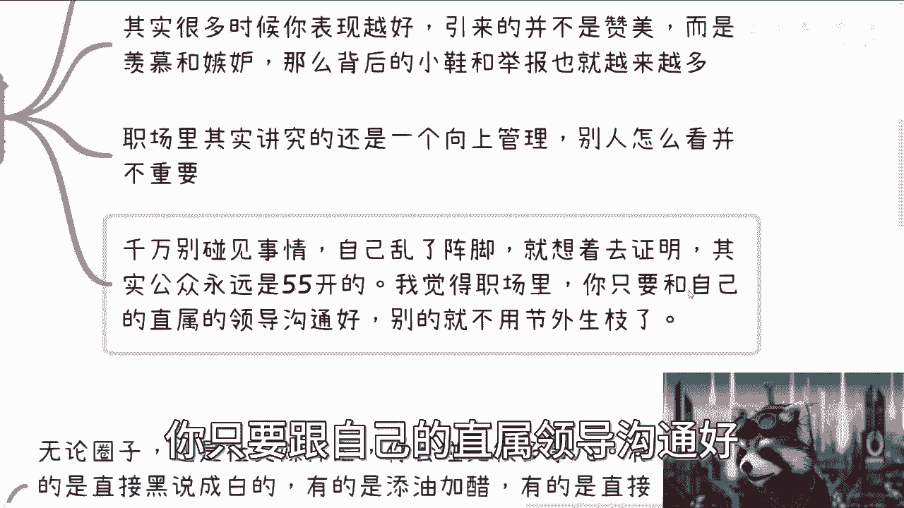

当然这一点就是我后面想加上去的，就是你还是要去沟通的啊，你该沟通要沟通对吧，就是说但是别的你就不用再去做了，别的你也不用再去过多的去做，也不用任何节外生枝，因为没有意义啊对吧。

就是我知道就是说你作为一个电池，你作为当事人，你肯定会觉得卧槽，他妈的，你凭什么误解我对吧，我这样对我引起了很大的就不好的影响，而不好的影响或者怎么样子，其实没有这么复杂，为什么对吧。

因为最终大家看的是你的工作，最终大家看的是你的一些事情，包括就是说你的直属领导，包括hr BP对吧，hr g他都会来找你沟通事情的怎么样，他只要是一些八卦，大家都过去了，如果涉及到一些别的。

那么该报警报警该怎么样怎么样就结束了对吧，就是你不要自己在那边，每天晚上啊想半天对吧，然后东想西想。

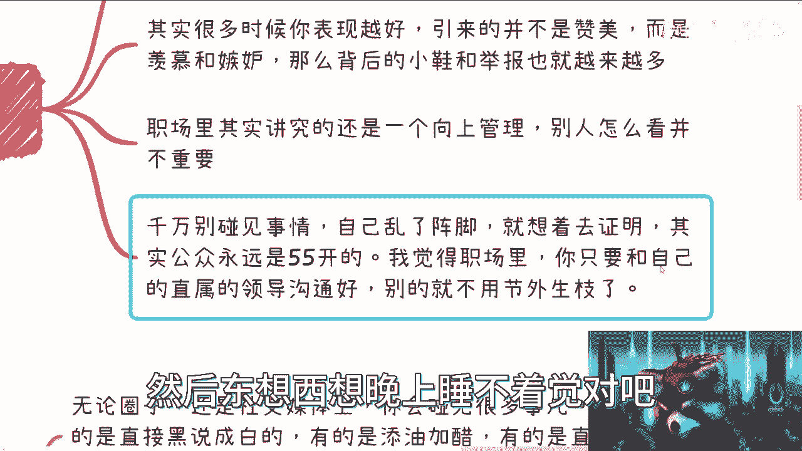

晚上睡不着觉去吧，没有任何意义啊，首先这是第一个，那么第二个还有一个呢就是在这个社会上啊。

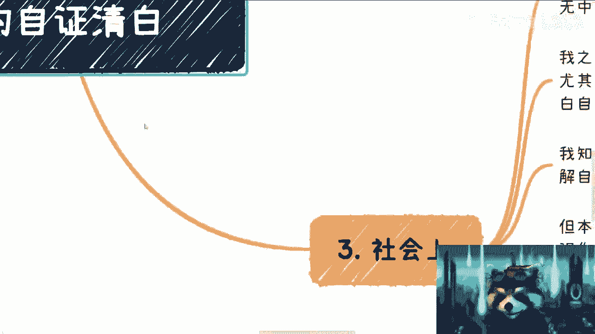

社会上我跟你讲这个事情呢就复杂了啊，无论圈子里面还是社交媒体上啊，你会碰到很多事啊。

有的呢就直接就是黑。

说成白啊，就是颠倒，然后呢有的呢就添油加醋，有的就直接是无中生有啊，就直接给你造谣很多很多。

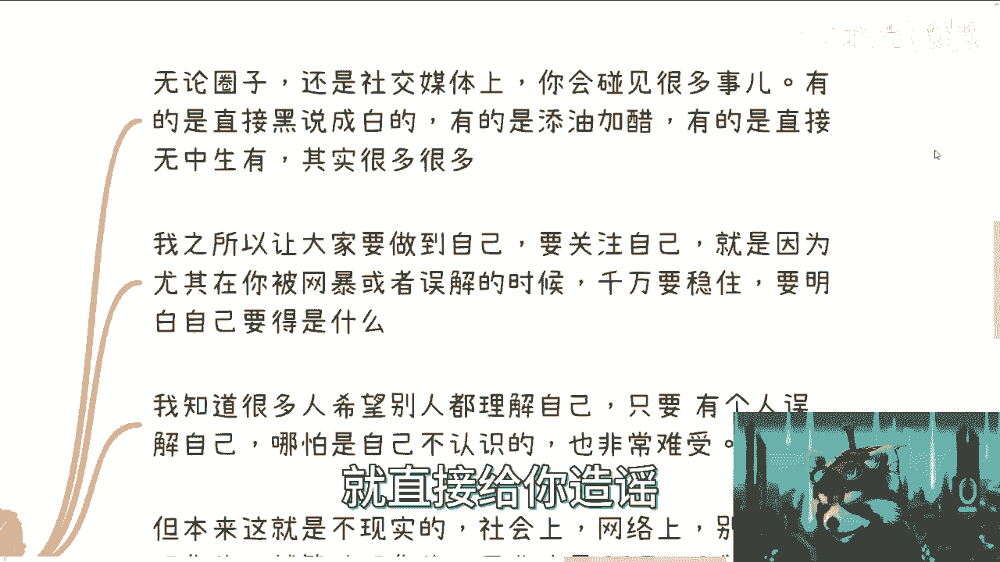

你知道吗，就是你别以为这些事情只会发生在明星啊，或者说一些这种所谓的这种什么，什么营销号身上，你知道吧，你但凡只要做出点成绩身，别人也一定会这样子，没有办法，我跟你讲现在的人的本性就这样。

然后第二个呢就是我之所以让大家要做到，就是老师关。

就一直关心自己，或者永远从自己出发呢，就是因为尤其你在网被网暴或者被误解的时候，可能还达不到网暴这个level啊，就是被身边的人造谣或者误解的时候。

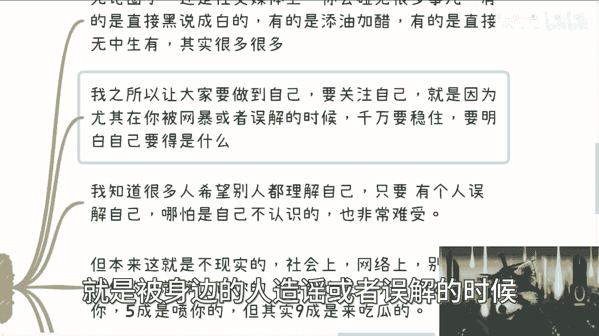

你千万要稳住，你要明白自己要的是什么，就是你不要去想那些有的没的，因为想那些有的没的都是你幻想出来的。

给你造成的恐惧，你知道吗，那第三个就是我知道很多人呢，其实我知道就是大家从内心当中，其实作为一个好人来讲，我要给你们发好人卡了是吧。

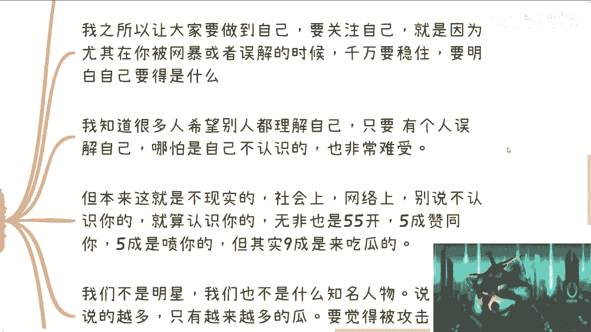

就是很多人希望别人都理解自己对吧，只要有个人误解自己，哪怕是不认识的，你也非常难受，我知道啊，但是他妈的没有卵用，你知道吗，因为本来啊本来这个比如说中国14亿人对吧。

地球上这么多人，你就不可能让每个人都认可你，对不对对吧，这这没有办法的事情嘛是吧，我以前也是这样子的，但是我现在就是你，比如像前两天我说那个结婚那个事情对吧，然后我说结婚不是交易，对不对。

那你下面肯定很多人你们看不到，就是因为被我拉黑了，对不对，下面很多人跟我说的，他说为什么结婚是交易啊，就是因为法律里面写了这个结婚，婚姻法里面写的都是交易。

对不对，都是一些这个资产分割，那他妈的我们说的是一件事情了，你上来杠这个东西有意义了，那你这样杠我也会说点，那他妈劳动法也有点，那他妈有谁遵守来了劳动法律来。

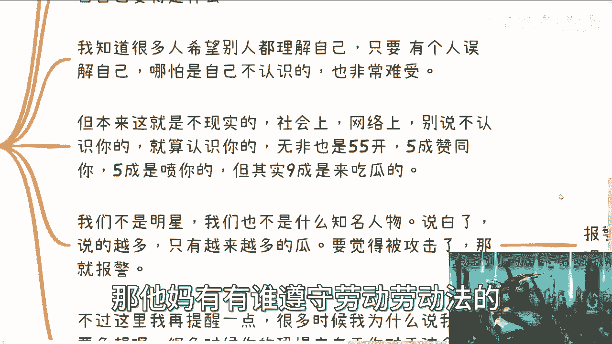

你们有什么意义呢，没有意义啊，就是这就是什么意思呢，就是说你去跟这些人去沟通，或者你指望这些人去理解它，就是个死循环，你知道吧，就无无解，毫无解，毫无任何意义的一个解，对吧。

然后呢就是你要认清楚一个现实。

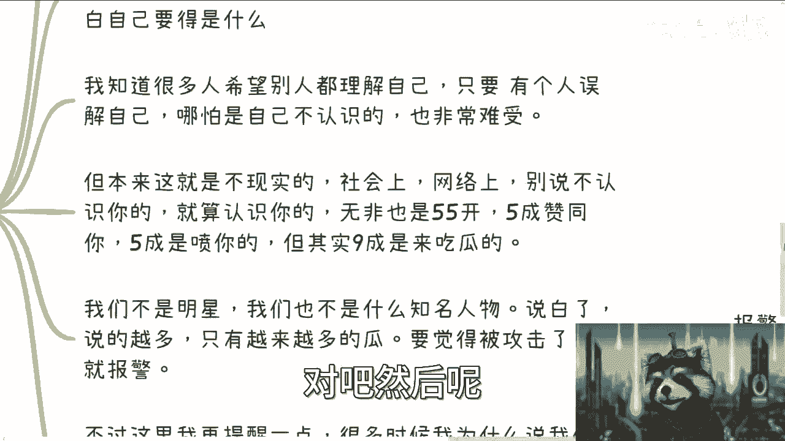

这个现实是什么呢，就是说社会上网络上别说认识你的啊，别说不认识你的，就算认识你的，无非也是五五开，什么叫五五开啊，就是五成里面是赞同你的言论，五成里面是喷你的。

然后这十成里面九成是来吃瓜的，就这么简单，你无论你说什么，我跟你讲，无论这件事情多么荒谬，无论你今天讲的东西多么有道理，永远都这样子，你去看好。

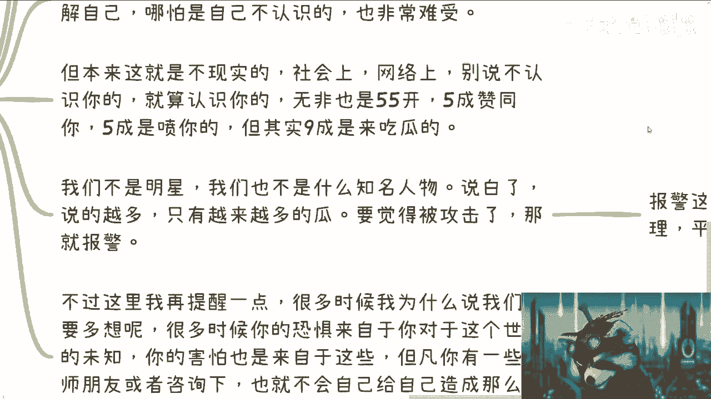

你知道吗，就有些东西我不方便在视频里面讲，讲了可能就就审核不过了对吧，但是我就告诉你们，今天哪怕有个很很极端的事情啊，很极端，你会发现这个人可能就是，宛平南路600号出来了对吧。

但是你会发现下面的评论你只要量足够大，依然是五五开的。

就这么回事，你知道吗，所以说我们不是明星对吧，我们虽然也不是什么知名人物，但是说白了你说的越就是你说得越多，做得越多对吧，只会有越来越多的瓜，而且这个瓜可能就是你回过头来一想，我的，我冲动了对吧。

我何必只有节外生枝对吧，去讲些有的没的对吧，干嘛干嘛对吧，但是你当时因为脑子不清楚对吧，你要觉得就是被攻击的，你要觉得真的被攻击，你就报警，报警这个事情网上有很多流程，我就不详细说了，就报警这事很简单。

你截好图对吧，然后被告是谁，被告就是你你他网暴你或者造谣你的那个平台，然后只要受理受理，一般都会受理的，受理平台本身就会就会就会去通知被告，或者说会给到警方对应的信息来通知被告，那么接下来就是要么和解。

要么你就继续起诉，结束了，没这么多BB的事情，你知道吗啊，而且这个地方呢就是我再提醒一点啊，就这个地方我再提醒一点，很多时候呢我为什么说我们不要多想呢，就是很多时候你的恐惧和你的这个这个害怕。

来自于你对这个世界的未知，来自于你来自于你对很多规则的未知，你知道吗，这就好像很多人觉得什么哎呀，我不知道出去应该干什么对吧，我出去就也不知道应该怎么认识人，或者怎么样子，关键是你还没有出去。

你还没有踏出第一步，你永远就是缩在自己那个圈子里，在害怕，那永远都在害怕对吧，你但凡有一些律师朋友，或者来说相对于你咨询一下，我跟你说，你其实也就明白了，就是这个事儿你要明白再大的事情。

你哪怕是一个一个全网的网暴对吧，你会发现互联网记忆就那么一点，就他妈的七天到14天了不起来对吧，更别说你这些小事情，对不对，你你要觉得真的有问题，就像我说的，你该报警报警对吧，你没有必要。

就是最后会发现你给自己造成的伤害，在心理上的伤害也好，或者别的伤害也好，很多都是你自己造成的，不是这个社会和别人给你造成的，因为为什么，因为别人你控制不了啊，就这些会来骂，你会来怎么样。

你怎么控制呢对吧，难道你说你说啊，因为这些吗，我我我要去这个走上绝路了，那那我就问你图啥呀，你你就就不明白了呀。

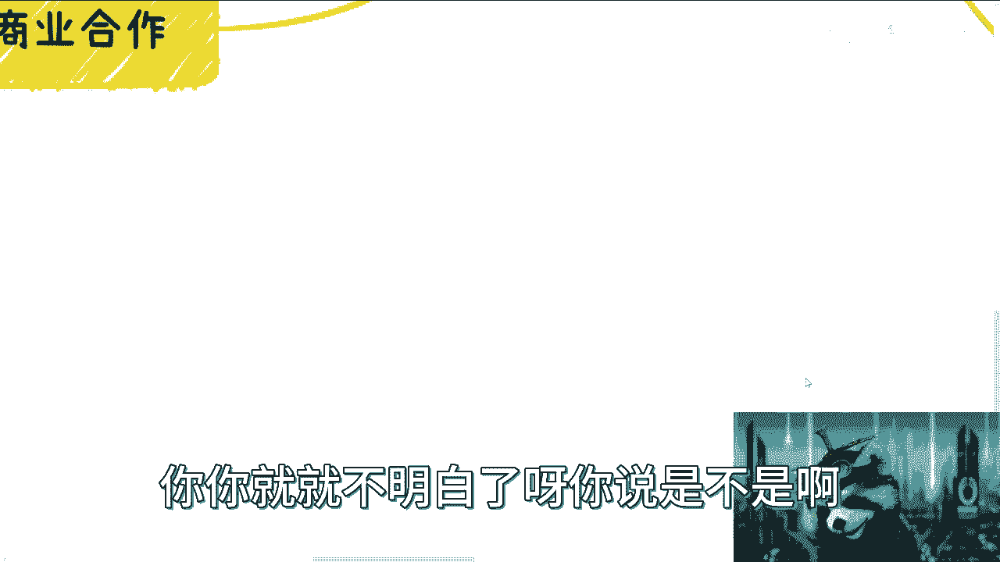

你说是吧啊，就就你说一直就不要去想着老师自证，说你有几碗粉对吧，你有几碗粉不重要啊。

对不对啊，然后还有就是第四个商业合作啊。

在这个地方呢，你看啊我的确跳过一个就是谈恋爱对吧。

我觉得谈恋爱就是嗯思想是一样的啊，我就不扩就不扩展开来了啊。

那商业上面是这样子的，商业合作呢，其实我跟你讲，无论你在什么圈子，无论你在什么行业，其实都很小，就是你越往上走，你会发现金字塔顶层的人就那么些，你知道就无论在哪个行业啊，虽然他可能有这种隔绝对吧。

有割裂，但是其实没什么区别的啊，我敢说你只要做商业，你就一定会不会被攻击，但是脱单我跟你讲就是大小的问题哦，做的越大攻击越多啊。

这就是我一开始提到的，就是你是不是把事情做的足够大啊，是不足够折腾。

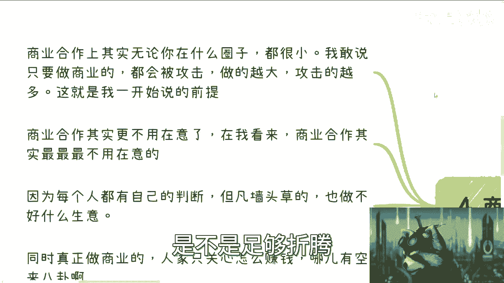

这是第一个，第二个呢就是商业合作呢，其实不用那么在意，因为在我看来。

商业合作其实最最最最最不用在意，因为为什么，因为商业合作里面人跟那些电池跟大家打工的。

跟那个叫什么谈恋爱不一样的，因为商业里面的人，每个人都有自己的判断，你但凡没有自己的判断，长途找的，那就说明这个人也做不了什么生意对吧，你就pass就算了。

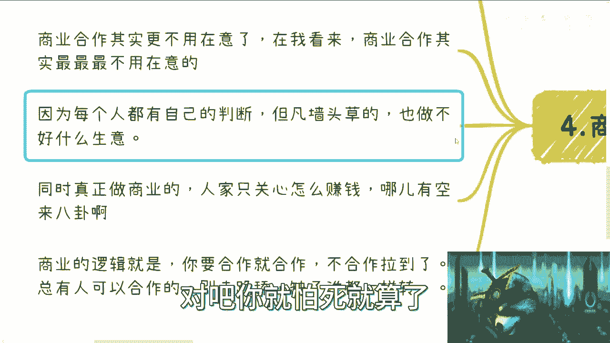

这他妈的跟你没什么交集，对不对，同事呢真正人家做生意的，人家只关心怎么赚钱，哪他妈有空来跟你八卦，没有空的对了，你就像我现在，我要不是说现在有有一些这个被动的收入对吧。

或者怎么样子，我也我要是忙成狗，我也没空来给你们做录视频，怎么一样的道理对吧，你商业的逻辑是什么呢，就是你你要明白啊，就是对你来讲，你要和对方要合作就合作，不合作就拉倒吧，尤其要是再来就是抹黑你的。

你就就就随他去吧，让拉拉倒吧，就多看你一眼，算我输，你知道该拉黑拉黑拉黑，你知道吧，该报警报警就这么简单，总有人是可以合作的，你也别去跪舔，你知道吗，舔了也没结果的啊，这个电池我以前说过的。

你舔了也没有结果的，这就跟你谈恋爱是一样的，强强扭的瓜不是不甜，强扭瓜你也吃不到啊。

啊这个缺了谁都一样转，所以呢就是在这个地方呢，对啊，所以说在这个地方呢，我就得要这个这个强调一下啊，就是说嗯让子弹飞里面写的很清楚是什么呢，就是你任何时候你别人想着不要想着去公开，跟别人去自证。

你肚子里有几碗粉，公众根本不关心这些事情，互联网其实也不关心这些事情啊，就是说白了不喜欢你的人终究不喜欢你，要造谣你的人终究也还会造谣你，抹黑你的人，终究也还会抹黑你对吧，就是要赞同你的人。

要认可你的人，终究也还会认可你，对不对，那我觉得你要这么想，就是第一你还是你这些人，赞美或赞同也好，不赞同也好，对你没有关系啊，不会影响你这个人怎么样，没有这么大的影响力，我们也不是明星。

我们也不是怎么样，我们也不吃流量的饭，对不对，那我觉得这是第一个，第二个是什么呢，就是你要这么想，你真正要关心的是那些真正认可你，真正关心你的人，你但凡对吧，说在那边自证清白，自乱阵脚。

或者来说很就是我刚刚说的，你要去正眼看那些对吧，这个一样的人对吧，那我就觉得你自己把你自己变得很low对吧，就也没有必要，所以就是说就是说我们活在这个世界上对吧，就是如果有问题该用正规的手段解决。

就是正规手段解决，如果来说，这个轻重还轮不到正规手段手段来解决的话，那你就无视他，很多时候我们作为当事人，我知道就是很多时候事情发生当下，你会觉得天要塌下来了，你会觉得这件事情无比的大。

但你回过头来看的时候，我如果再过个半年，过个一年，回过头来方向看的时候，这叫什么，这叫天上飘来五个字，这都不是事儿，对不对啊，就这么简单啊行吧，那个好吧，然后那个你们那个职业啊，职业发展啊。

这个呃个人的一些副业啊，或者说职业规划啊，反正有任何问题的，你们呃私信啊，私信把你们的问题整理好，然后私信我们在走正规的咨询，好吧行。

