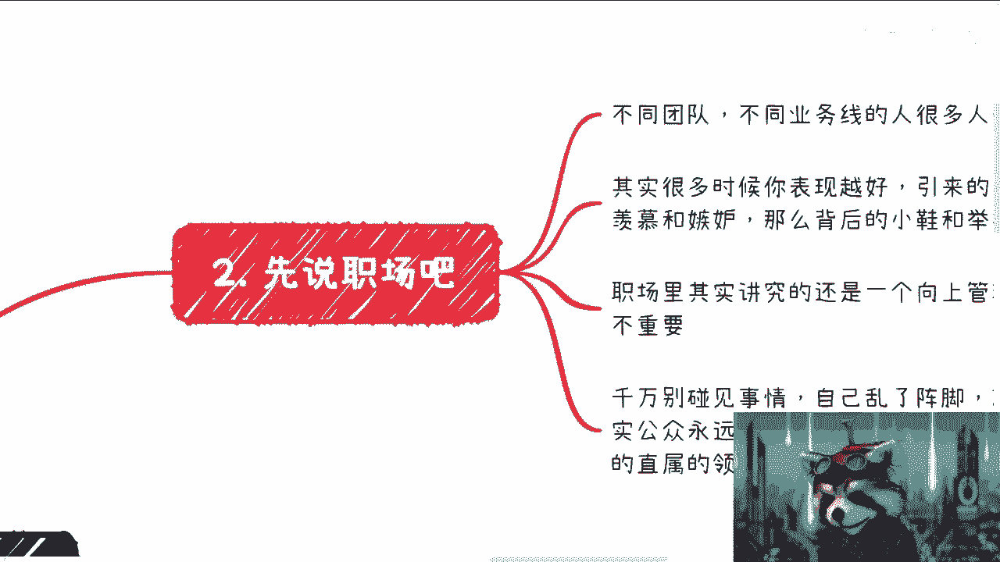
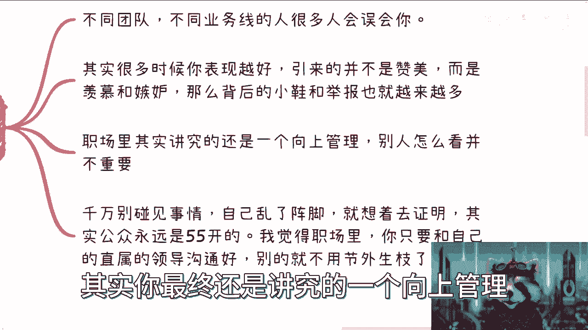

# 拒绝电池思维 P1：为何不应公开自证清白？🤔

在本节课中，我们将探讨“电池思维”中的一个核心陷阱：为何不应公开自证清白。我们将分析在职场、社会及商业合作等不同场景下，急于自证可能带来的问题，并提供清晰的应对思路。

---

## 课程概述 📋

我们常常会遇到被误解、质疑甚至攻击的情况。本节课的核心观点是：**公开自证清白往往是无效且有害的**。你的影响力、欲望和所做的事情的规模，与你会遇到的困难和质疑成正比。理解这一点，并学会正确的应对方式，是摆脱“电池思维”（即被动反应、被他人定义）的关键一步。

---

## 核心前提：质疑与你的影响力成正比 📈

在深入探讨具体场景前，我们需要建立一个核心认知：**你遇到的质疑和困难，通常与你自身的影响力、欲望和事业规模成正比**。

许多人认为自己生活平静，与这些麻烦无关。但这恰恰是因为你目前所求不多，折腾得少。一旦你开始追求更多、行动更多，你自然会遇到更多的困难和质疑。这是一个无法避免的客观规律。

我们可以用一个简单的公式来描述这种关系：
**`遇到的质疑 ∝ (个人影响力 + 事业野心)`**

这就像向水中投下一块石头，激起的涟漪（后续影响）可能远超你投石时的想象，并对未来造成困扰。你之所以会因这些困扰而痛苦或不知所措，往往是因为内心仍存有强烈的“电池思维”——即过于在意他人的看法和评价，试图让所有人满意。

---

## 场景一：职场中的误解与应对 🏢

上一节我们建立了质疑与影响力成正比的核心认知。现在，我们来看看在相对封闭的职场环境中，具体会遇到哪些情况。

在职场中，只要你做出一些成绩，或表现出一定的进取心，就很容易引来误解。不同团队、不同业务线的人，可能因为信息差、视野局限或单纯的嫉妒，而对你产生误会。

例如，如果你负责探索创新业务，在专注于现有业务的人看来，你可能是在“不务正业”。职场中“小人”不少，你的表现越好，引来的可能不是赞美，而是羡慕、嫉妒，甚至背后的诋毁和举报。

以下是应对职场误解的关键点：

*   **聚焦核心任务**：你的首要职责是出色完成本职工作。这是公司和领导对你的核心要求。不要因为外界的风言风语而自乱阵脚，影响工作表现和KPI。
*   **做好向上管理**：在职场中，最重要的是管理好与你直属领导的关系。如果遇到严重的误解或指控，**应与直属领导进行必要且清晰的沟通**。除此之外，无需向其他人过多解释或证明什么。
*   **避免情绪化与内耗**：听到流言蜚语，最好左耳进右耳出。不要花费大量时间东想西想，甚至失眠。你的情绪化和消极反应，反而会成为你的问题。

记住，在职场公开自证，效果永远是五五开。你的工作成果和与关键人物的沟通，远比向所有人辩解有效。

---

## 场景二：社会与网络上的复杂局面 🌐

处理完相对封闭的职场环境，我们再将视野扩大到开放的社会与网络世界。这里的局面更为复杂。

在社会上或社交媒体中，你可能会遇到各种情况：颠倒黑白、添油加醋，甚至无中生有的造谣。不要以为这些只发生在名人身上，只要你做出一点成绩，就可能面临这些。

以下是面对社会性质疑时需要牢记的几点：

*   **认清现实比例**：你必须接受一个现实：在任何公开言论或事件下，舆论反馈大致是 **`五五开`** 。即大约五成支持，五成反对，而其中九成的人是旁观吃瓜的。你不可能让所有人都理解你、认可你。
*   **明确自身目标**：在被误解或攻击时，一定要稳住心态，想清楚自己的核心目标是什么。很多恐惧和焦虑，其实源于你对未知规则的想象，而非事实本身。
*   **善用正规手段**：如果遭遇网暴或造谣，感到严重侵害，正确的做法是**固定证据（截图等），然后报警或通过法律途径解决**。互联网的记忆很短，很多风波在7到14天内就会平息。不要陷入与恶意攻击者无休止的争辩中。
*   **停止自我伤害**：很多时候，最大的心理伤害来源于自己不断的反刍和恐惧。你控制不了别人说什么，但可以控制自己如何反应。不要用别人的错误来惩罚自己。

永远不要想着向公众证明你“肚子里有几碗粉”。公众并不真正关心真相，而试图向所有人自证，只会让你精疲力尽，显得很被动。

---

## 场景三：商业合作中的淡然处之 💼

最后，我们来看看在商业合作领域如何处理类似问题。其核心逻辑与职场和社会有所不同。

商业世界其实很小，越往顶层走，圈子越窄。只要你从事商业活动，就一定会遇到竞争和攻击，事业做得越大，攻击通常也越多。

但在商业合作中，其实最不需要过分在意他人的误解或抹黑，原因如下：

*   **合作方自有判断**：真正的商业伙伴拥有独立的判断力。如果对方仅因流言就拒绝合作，说明其并非理想的合作伙伴，**`pass`** 掉即可。
*   **核心关注点是利益**：商业人士最关心的是如何赚钱和共赢，而非八卦。真正忙碌于事业的人，无暇参与无谓的抹黑。
*   **保持平等姿态**：合作的基础是互利。对于恶意抹黑者，最好的态度是“多看你一眼算我输”，该拉黑拉黑，该用法律手段就用法律手段。永远不要跪舔，商业世界中**`缺了谁都能转`**。

商业合作讲究的是价值互换和理性判断，而非情感认同。保持专业，聚焦于创造共同价值，才是正道。

---

## 总结与行动指南 🎯

本节课我们一起学习了为何不应公开自证清白，并探讨了在职场、社会和商业合作中的具体应对方法。

让我们最后梳理一下核心行动指南：

*   **接受现实**：质疑与你的影响力成正比，这是成长的代价。
*   **聚焦内在**：想清楚自己的核心目标，不要被外界噪音带偏。
*   **区分场合应对**：
    *   职场：做好向上管理，用工作成果说话。
    *   社会：认清五五开的舆论现实，对恶意攻击善用法律武器，而非口水战。
    *   商业：筛选有独立判断力的伙伴，无视抹黑，专注价值创造。
*   **拒绝内耗**：很多伤害源于自我的反复思虑。用正规手段解决真问题，对无关轻重的杂音，学会无视。时间会证明，大多数当时觉得天塌下来的事，后来看都“不是事儿”。

记住，你无需向所有人证明自己。把时间和精力留给真正重要的事和真正认可你的人。