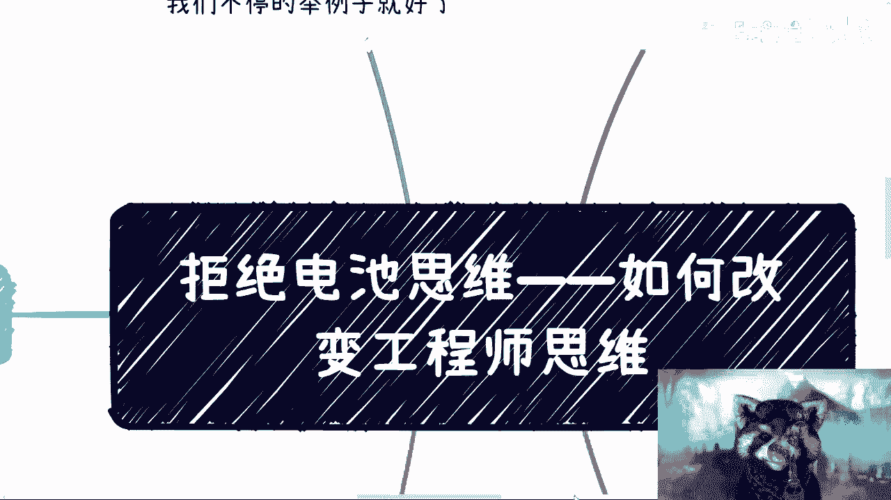
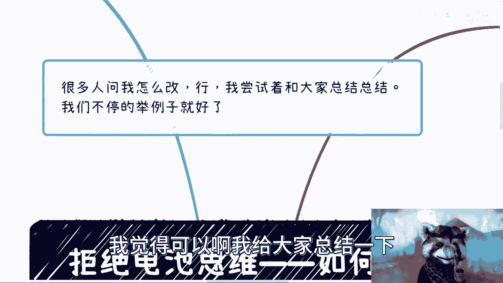
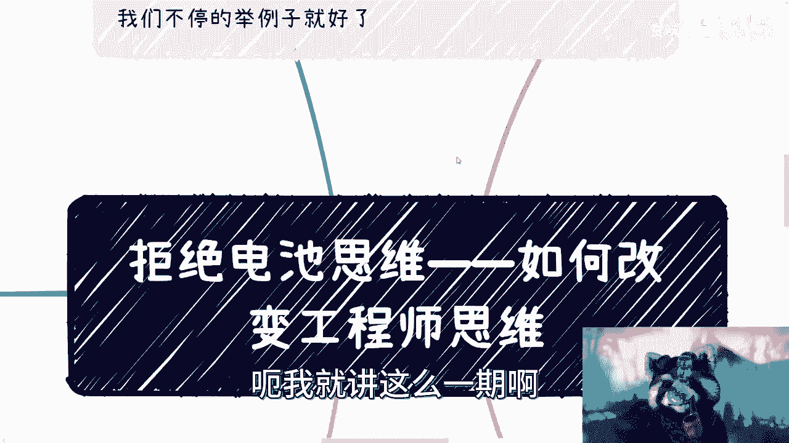
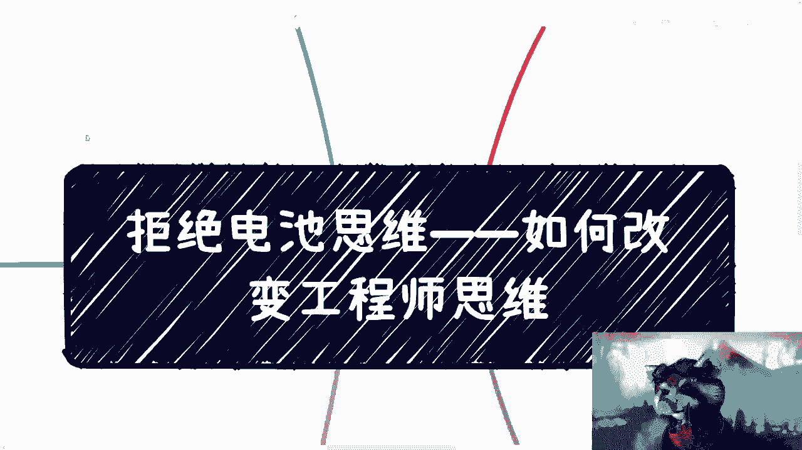
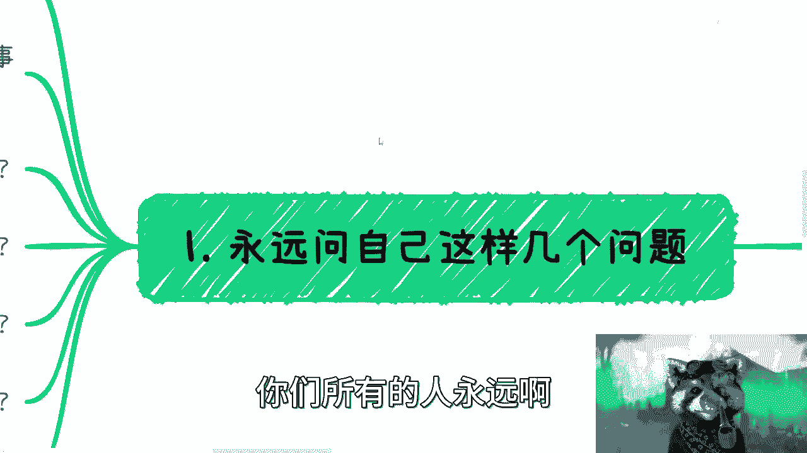
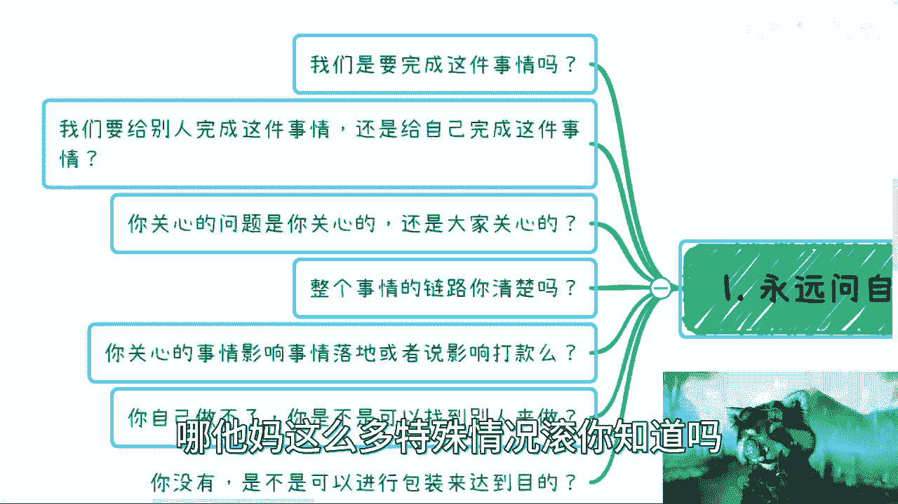
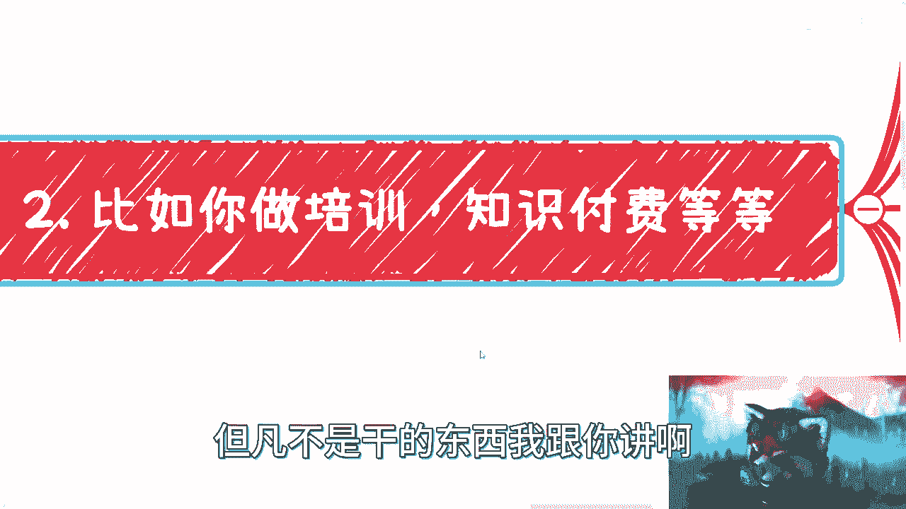
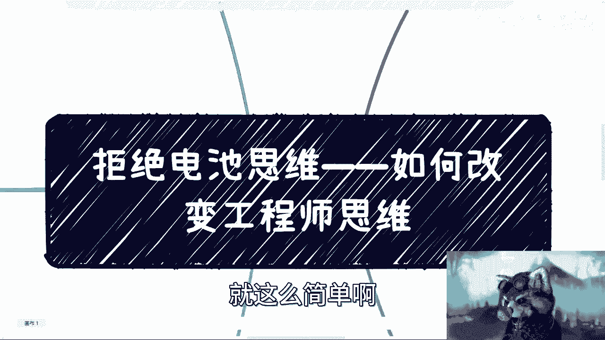

# 拒绝电池思维——如何从根源改变工程师思维 - P1 - 赏味不足 - BV1Us4y1e7Se

好大家好，礼拜一是吧，呃昨天啊我们讲了这个工程师思维啊。

这个很多小伙伴说要讲一下怎么改变是吧，我想了半天啊，我实在也想不出来有什么好说的，因为为什么呢，因为改编这个东西真的需要通过实践，但是呢我也是再三总结了一下啊。

我觉得可以啊，我给大家总结一下。

我觉得可能这样说呢，大家能够更明白一点啊，呃我就讲这么一期啊。

就讲这么一期这一期内容，反正大家自己想吧好吧。

首先呢是这样子的啊，所有的事情我们怎么改变呢，你们所有的人永远啊碰到任何问题。

就问自己这么几个点啊，第一这件事情我们要不要完成它，就不要去逼逼那些有的没的，你知道吧，就不要说哎这个当中有任何事情不要来跟我说，哎吕老师这个当中有很多细节我要考虑的，不要考虑考虑个屁，我跟你讲啊。

零和一我就问你们现在是不是要完成一件事，是否对不对啊，好第二呢，我们需要为别人完成这件事情，还是为自己完成这件事情，好想明白啊，想明白好，第三你关心的问题是你关心的问题，还是大家关心的问题。

还是用户关心问题，还是客户关心的问题，还是甲方爸爸关心的问题，对不对啊，好整个事情的链路，也就是所谓的大局观，全局观，你了不了解啊，好你关心的事情影响到这件事情的落地，或者影响到打卡没有对吧好。

你自己做不了这件事情，你是不是可以找别人来做对吧，以及你你没有是不是可以，你没有的东西是不是可以进行包装达到目的，我跟你讲所有东西你就问这么几个点啊，别去就你记住啊，所有考虑问题当中不要去想啊。

这个啊我吕老师，我这边有特殊情况啊，怎么没有，那他妈这么多特殊情况滚。

你知道吗啊好那么接下来我们来举例子举例子，比如说比如说你今天要去做培训，要去做知识付费，要去做自媒体，对不对，这个东西很多人说过对吧，很多人说我想做啊，我想做，好那么我们来一个个来说，首先，我们先问啊。

你最终的目的是什么，你最终目的是不是变现，你要不是变现好了，我们就打住，别讨论了啊，不用讨论这个问题，不在我今天讨论这个范围内啊，你你爱用爱发电，用爱发电，爱去救助别人，救助别人跟我没有关系啊。

好首先你是不是变现，是不是啊，你就问自己是不是达到这目标，是不是是就是不是就不是结束了，没这么多，当初这么多逼逼的事，你明白吧啊这是第一点，第二点我们是给谁完成这件事情啊，或者还说你做这件事情。

最终付款方是谁，你想明白啊，是C端用户，C端散户机构，政府企业对吧，但是我跟你说，不管是谁，肯定不是你自己付费，对不对，肯定不是你自己付钱对吧，你别跟我说啊，我到现在连谁付钱我都搞不清楚啊。

我钱还没赚到，我自己先付个35万，这个我觉得你就是韭菜，你脑子被枪打过了，对不对，对吧好，那么这第二点第三点，你现在想了一个问题对吧，比如说啊你说，啊比如说他说哎我到底做做什么领域啊，做什么方向对吧好。

那你做培训也好，做知识付费也好，做什么也好，你之前这么想，OK没问题，但是我们先来问啊，你想这些问题，是不是你的付费的金主爸爸考虑的啊，你是不是在自己闭门造车，你造出来的车真正用户要不要对吧。

你花了很多时间在里面纠结啊，我到底做什么东西啊，我到底应该怎么办啊，我应该怎么样子好，一一个月两个月过去，但是最终你想的这个问题是不是客户要的，不知道唉，不知道，I don't know。

那那你想个啥是不是啊，好整个事情付费的闭环你清不清楚，哎这个我跟你讲很重要，用户到底因为什么事情付费好，我们回过头来看啊，首先首先啊我们一个来说。

比如说培训对吧，知识付费我就问嘛，培训这个东西，C端用户啊，如果是C端用户，我跟你说培训这个东西，你要么就教他硬技能啊，比如说你说你培训完了，你能够学会学会java开发，学会电工对吧，学会面点师。

那没问题，而这个就是一个就非常干的一个东西，但凡不是干的东西。

我跟你讲啊，培训也好，知识付费也好，自媒体也好，对吧，你但凡要付费，我就我就问你啊，这个闭环是你的产品做得好不好吗，是你找的切入点，这个对不对嘛对吧，或者说是你就说你你产出的这么一个问题。

是不是对方的呃，或者说是不是你觉得能够给对方带来价值吗，都不是，你知道吗，用户在这些切入点付费，往往因为什么我跟你们讲一头脑发热，3分钟热度冲动懂吗，这是第一点，但是OK问题来了，用户怎么冲动了。

用户会自己莫名其妙上头吗，不会的，一定是你营销做得好，一定是你海报做得好，一定是你焦虑贩卖的好，你明白吗，这个是你要去考虑的哦，哦很多人在那边做事情，说哎呀，我考虑这事情怎么做对吧。

这事情怎么做得好对吧，这事情用户要不要你就算做得再好，用户不要这东西，不好意思，你知道吗，就是所有消费是冲动消费对吧，就就你们去想好了，什么留学啊对吧，什么考研啊，包括你们考公务员了。

我说不好经验不都是冲动消费吗，对不对，有什么区别了，有可能我跟你讲，大部分的人他都是左右摇摆的，什么意思，就是他今天想好好，我要干了哦，我要干好干好，昨天有个人跟他讲讲了这个，比如说讲了一个小时。

两个小时，他马上就动摇了，哎呀我到底要不要干，哎呀，我这个干了，对不对对吧，我怎么办，有用吗，没有用的呀，就是你在想这件事情的时候，你又回到这个问题，我就请问你的目标是什么，你就告诉我你是不是想赚钱。

想或不想想，你就去干对吧，不要说我又想又在那边左右摇摆，那你干不干嘛，对不对啊，好我们继续来看啊，有人还要讲了，他说哎我没有材料诶，我没有素材，你好，吕老师，我这个做自媒体做知识变现，做什么东西。

我什么都不会呀，那我之前都跟你们讲过了对吧，你去看那些做知识星球的，我就问你们他们会不会买啊，会个蛋蛋啊，会啊啊，这他能做的就是把那些这个这个什么PDF对吧，今天什么报告，明天什么报告往那边一扔。

我跟你们说，你们要是让我做知识做，做知识星球，我也这么干，为什么我没什么好说的呀，我啊我没事情做，每天在知识星球里面发一些文章，我请问我吃饱了撑的，你你们明白我意思吗，就是说哦我在那边发个文章。

我也不知道多少人是付费对吧，我在那边发个文章，对我来讲，这是一个投入产出比高的事情嘛，不是投入率，软件比高的事情是什么，我往那边每天就扔两个文件，反正这些文件我反正有700多个群，对不对。

你你每天总有些阿猫阿狗的文件，我就往那边一扔好了，我管他有没有价值，这叫投入产出比，哥哥们啊，姐姐们啊，奶奶们，爷爷们，对不对，就我不要求大家以资本家的方式去思考问题，但是至少别内耗，你说对不对啊。

你比如说你比如说你没有，你可以包装啊对吧，你可以借力打力啊对吧，那个昨天有人拉群对吧，然后下面一群人评论说嗯现学现用是吧，你们真的是，我我无力反驳哈哈，是不是啊对。

然后就是啊这个回答我这个问题就是培训对吧，知识付费啊，然后那个自媒体啊，好那么好，我们回过头来问问自己一些问题啊，你说大部分人会问什么呢，啊谁啊，大部分人问什么呢，我们来看啊。

第一啊这个我不会做自媒体啊，我没做过对吧，我也没做过知识变现啊，我其实也不懂啊，因为我也不会营销对吧，我课程怎么做算做的好难对吧，这个这里面这个东西你说我要做个什么，十个小时，我最多只能讲半个小时对吧。

那就剩下9。5个小时怎么办呢，对不对啊，我就那种做的人家也不知道好不好对吧，这万一被人喷怎么办对吧，我应该怎么做，别人不满意怎么办，退款怎么办，投入怎么办，我就问你们这一大堆的问题。

你们自己问自己那些有的没的问题，我就问啊，好这些问题跟你要的最终目的有关系吗对吧，我们再回到这边啊，我就问这些问题，跟你事情落地影响打卡有没有影响，有吗对吧，跟你要完成这件事情的最终目的有关系吗，有吗。

没有你自己想看对吧，你啊你在这里问自己的这些问题，在那边思考这些问题，跟你最终用户来变现，跟你最终赚到这笔钱有关系吗，有吗，没有啊，有没有人收了，他说啊，这个别人不满意啊，你怎么会没关系，退款怎么办呢。

退租怎么办，哥哥们奶奶们，这个爷爷们，这个叫什么，姐姐们对吧，我就问你们啊，今天你就算做出一个非常完美的东西，世界上是不是总有人会不满意，世界上是不是总有人会退款，世界上是不是总有人会投诉。

那么他总有人会来搞，你们怎么样了呢，对吧，就我们之前说过这个问题，就是你自己不能控制的问题，你别去思考，你去思考这些干嘛，有意义了，没有呀，就是或者说你思考这个问题能解决问题吗，不能呀，对不对啊。

就好像我今天一直说B站在那边也写啊，这个未经本人同意不能转载，有用了啊，昨天还有很多人说了，哎呀抖音上有很多人盗我的视频有用吗，没有用的呀，我能做什么，请问我能做什么，对不啦哦然后我每天都在想哎呀。

为什么我视频被盗了，哎为什么为什么人家能赚到钱，我赚不到人家这个钱，为什么人家拿我的视频去赚钱了对吧，我怎么不分到一点钱有用吗，那我就问没有用的呀，哦我每天在那边在那边想，除了自己不开心。

除了我内耗以外有用吧，他是不是就你要想清楚对吧啊，你比如说我们再来举第二个例子啊，项目对吧，好项目啊，好我就问你们，你们做一个项目，我们要是完成这个项目呢，还是说你要去做这个项目的落地呢。

还是说你要去赚这个项目的钱，你说你想清楚哦，你要今天做交付的，做技术支持的，你就做技术支持，别去想那些有的没的，你要想办法想来想要拿这个项目去赚钱的，那就别去想落地没有意义的呀，你明白吗，对吧好。

第二个问题我们来为谁完成这个项目对吧，你就我们打个比方说，比如说今天你要做一个医疗项目对吧，你有你的想法，你有病人，有病人的想法，你有你的想法，你有你的切入点，但我请问吗，付钱的是谁啊对吧。

你要去想的是付钱的那一个人，那一方要的是什么啊，又要又有人要来跟我说了啊，他这想的不对啊，这东西做出来没有用的，这东西做出来啊对吧，跟这个这个满足不了需求的，我就问你叙述谁提的对不对。

就有时候就是说你得你得明白，你知道吗，你你需求是客户，是你的用户吗，用户买单吗，不买单买单，那是你的甲方爸爸，那甲方爸爸当然说需求是什么就是什么了，对不对，那怎么办呢，我就问你怎么办，对吧。

那当然你说这个事情做得不对，我认可啊，你说这个事情你要未来改变，我也认可，那前提是你得先有钱，你得先有能力改变吧，我早就说过了，你但凡没能力改变，在这里逼逼什么呢，对不对，你还你打不过，不是只能加入吗。

是不是这个意思啊，对吧好，你接下来再说你关心的问题，大家关心啊，是你自己关心的问题，你要关心的是甲方爸爸要什么，你懂吗，你要关心的是你要包装的，怎么让甲方爸爸开心啊，怎么让甲方爸爸能够买单，是不是啊。

整个项目电路也是一样的项目，接下来项目到底是怎么接下来的对吧，销售是怎么做的，到底我们跟他们是什么关系，甲方是谁，有没有中间方对吧，甲方是怎么付钱的，怎么验收的，这些你都要去知道。

你这些东西不知道在那边纠结哎呀，这个项目细节怎么做，用什么框架的吗，用什么语言有意味了，没有任何意义，因为这些东西跟对方买不买单，这个人根本不关心的不是一件事儿，对不对，是不是啊。

那影响打款的事有哪些是你能做的对吧，你不能做的，有没有别人可以做高级，比如说要什么资质啊，要什么背书啊，要什么背景啊，要谁来站台呀对吧，你去找啊对吧，所谓工程师思维在这里面有一点我跟你们讲啊。

所谓工程师思维在这里面有一点是什么，就是很自大，就觉得哎这些东西都太虚了，没有用的啊，还有别搞这些虚的对吧，哼有用了，你搞这些十的，我就问有人买单了，有人付钱了，不是我不我不是我想搞，对不了。

我跟你们讲，你们但凡去做过业务，做过商业，做过项目，你就你们就会发现，真正的门槛都是在这些虚头巴脑的东西上面，十的东西有多少门槛啊，有多少门槛你能做，别人不能做，有不啦不存在的呀，对不啦。

好我们继续来问一下问题啊，这个项目我们有没有能力做啊，我们会不会做，哎我们怎么落地，哎，我们怎么交付对吧，项目解决方案很多细节我们不知道哎，这个项目链业务链路也不通对吧。

这当中哎呀这个当中你比如说谁跟谁对接对吧，你这个方案当中明显不对对吧，这个方案明显是走不通的，落不了地的，对吧啊，然后回未未呃，这个还有未来，比如说申报不通过怎么办，交付不通过怎么办。

这是你要去考虑的吗，啊这是你要去考虑的吗，这是付钱的甲方爸爸需要去考虑的吗，不是付钱的，甲方爸爸要考虑的是，你的东西有没有满足我们的需求，能不能我们能不能demo，我们能不能拿出去展示对吧。

我们能不能满足基本的需求，而不是说里面的这些细节我们都要满足，没有的，你们去做过项目，你们就知道了，没有的，哪儿来呀啊，我跟你说啊，但凡你们去纠结细节的，你们只是分包房，你们不是总包方。

总包方不会关心这件事情的啊，就真正要去做商业，要去做项目的，要去做这种叫做叫做呃这个整个供应链顶层的，或者说偏上层的，没人关心这些东西，关心细节都是下层，是不是呢，咳咳第一个好，比如说啊。

现在大家都说很难啊，找工作很难好，我们就拿这个事情来讲啊，首先你要不要找到工作，我就问你要不要要还是不要对吧，没有当中状态啊，要还有要就要不要就不要，对不对，好这第一点，第二点是你要找工作。

请问你是自己决定找工作呢，还是说别人hr来决定的，还是老板来决定的对吧，那么你要去看hr跟老板以及公司看重的是什么，别你自己看重的是什么，有用的没有用的，对不啦，对吧哦，然后你关心的问题，你关心啥。

你关心是啊，可能这个招聘啊，这个平台怎么没有人回复我对吧，这个平台怎么都丢进去，石沉大海，我就问你别人关心吗啊，真正决定你这个工作要不要人呢，关心不关心这个时间，不关心你，在那边纠结半天，哎呀。

怎么没人回复我，人家会关心人，人家这人家惯性就是我靠，为什么今天我一个岗位拉出去有四五百封简历，怎么怎么这么多对吧，我筛选不过来，对不对，你们两边关键问题都不一样，你你去纠结它干嘛呢，对不对。

整个事情链路怎么样，比如说啊每个公司不同的国企，央企，大企业，小企业，中企业外企，每个公司怎么分级别的，每个公司招聘模式怎么样的，当下他们关心到底是什么，你要去了解的呀，对不对。

招聘其实就跟你去追一个对象，这是一样的，你得去了解哦，你什么这都不了解，你只关心自己叫什么，这叫什么，这叫普信对吧，这叫这个自私啊，大叉叉主义，对不对啊，闭门造车，对吧，那你再往下想啊。

你说哎呀我能力不够对吧，背景也不够，那么我就问嘛，是不是在不造假的情况下，你可以多包装呢，是不是说根据根据公司不同的公司，比如说他今天是医疗的，你今天是要这个，有的是做销售的，有的是做开发的。

有的是做运维的，那你是不是说根据这些公司的特性，进行针对性的简历的改进呢对吧，无论是细节描述上还是个人性格上，还是说各个职业的方面有没有呢，你你你没有做改进对吧，你统一你你就清一色简历在那边海投有用吗。

没有用的呀，对不对啦，那么我们最后来看啊，你说所以说找不到工作，你每天想的啥，为什么行业这么差，为什么简历没有反馈在我，我应该怎么去修改简历对吧，我跟你说啊，本质上找工作这件事情，你只要在平台上找。

在一个public的平台上找，你就已经卷不过别人了，因为真正找工作人家都是线下想办法啊，我去找猎头，我去找hr，我去找企业的高管，我去承托关系，都这种经济情况了，谁还在平台上找啊，平台上都找不到。

而且平台上你一找，大家就开始对比薪资，对比一些东西就开始卷这些事情，你不是不知道对吧，但是你依然这么选择，为什么，是因为你没有把事情想明白，或者在我看来，你就压根不是那么想去找工作，你的驱动力不那么强。

你没有被逼到一个绝境，就这么简单，你有后路，对不对，当然了，我不是说大家这个这个这个叫什么，改编工程师思维，就一定要把自己逼到绝路上，没有意义的，我的意思是说你要果断对，你要断舍离。

就像前两天我说你要么就用爱发电，你要么就通常往死里割对吧，为什么，是因为你只有让自己往死里搁的时候，你才能去明白你的思考方式是不对的，对吧，啊那么第五个，所以我们来看一下，比如说啊你想那么多啊。

我就说啊，你想那么多，不是说不应该想，你想的都是对的，没毛病啊，但是不是不是要去判断对不对或错不错，也不是判断虚不虚，实不实，你要判断的是你的目的是什么，还是那个问题，你要跟我说目的是赚钱，你就去赚。

你要说你要去做用爱发电就用爱发电，结束了，对不对，就结束，简简简单明了，哪有这么多当中的问题，对不对，好，那么你先你先想想看啊，我们再来想几个问题，考研出国，那我就问问你考研也好，出国也好，那回到这里。

你考研出国考研也好，出国也好，你的目的是什么对吧，就是你最终的目的是赚钱，还是说只要一个这个学历，那你要是告诉我，你只要个学历，那我就问嘛，你花了这么多钱出去，你花了这么多精力去读，你只要一个学历。

用爱发电可以，你要回到我用爱发电可以，我认了对吧，你别到时候再跟我说，哎呀我要这个学历，要这个学历，我要出去卷的，我要出去找工作的，我要赚钱的，那你还是要赚钱，对不对，何必自欺欺人呢对吧。

那你如果要赚钱，那么你就把下面事情都想清楚，对不对，就是哦我有这个学历跟没有这个学历，到底本质上有多大差别对吧，我有了之后，到底能就是给我带来多大的商业价值，到底应该怎么赚钱。

比不要老是说赚钱两个字对吧，大部分的人这些问题是没有想清楚的对吧，他就在那边说我要去考研，我要去出国，有义务了没有呀，对不对，然后还要自己PUA自己，哎我我不是那么想赚钱的，我就是要这个学历对吧。

我就想我就想出国看看吧，唉我跟你们说啊，但凡不是财务自由，但凡不是说这个生活那么的，这个这个家里有矿的话对吧，我跟你们说，这些话都没有意义的，因为你活在现在这个世界上，你就是很有压力的，没有办法的事情。

对不对啊，那么幼儿园最后我跟你讲，这两天评论区还有人说了，哎呀吕老师太进攻这个急功近利了，你怎么能这样子呢，对不对，我在这里统一说一下，不好意思，这个世界的背后核心就是急功近利的，所谓不急功近利。

都是你们所看到的，表面都是别人所做出来的营销，也都是别人给你们的PUA，这跟我有什么关系，我不关心这些，我不想关心任何表面的东西对吧。

就好像很多人在拿以前让我看项目，你知道吗，看项目，然后给我看这个什么公司的什么视频号啊，什么解决方案啊，PPT啊，什么东西，我说我不想看，没什么好看的，都是假的，都他妈吹出来的，有什么好看的了，对不对。

我说我要看的是核心，是本质，本质是什么，就是这个公司到底以前做过哪些东西对吧，到底路过哪些地对吧，然后你去检查查上面看看到底有多少全职员工，交过多少税，交过多少社保，对不对啊，什么时候注册的股东是谁。

这是我关心的，的给我看这些业务，这些业务他妈的谁做不出来啊，这PPT他妈的第一，哪个人两天吹不出来，有什么不能吹的，没有用的呀，对不对，真的就是很多时候啊，这个最后我再提一点。

很多时候如果你们真的想要去改变思维，你们就是要去走这个赚钱的极端的啊，别去PUA自己，也别让别人PUA，你们啊说技术很重要啊，说你们要有一技之长，说你们学历要很高啊，说你们要怎么样怎么样。

你们仔细想想看这些东西不是本质啊对吧，你去问他哦，我有一技之长，我技术很好，我怎么样诶，我问你啊，我怎么变现，你要么跟我说出来，我怎么变现，你就问他对吧，那他要是跟你说，哎这个你以后能找到好的工作对吧。

你以后这个不缺工作的哦是吗，那你要么保我20年工作，那我以后缺了怎么办，真的好吧，我就讲这么一期，你们要能明白就明白，不能明白就算啊，我我尽力了，真的尽力了好吧，就这么着吧好吧呃，有细节问题的啊。

你们要是想咨询的怎么样的，然后付费在咨询我啊，我也别来这个也别来诟病我咨询的问题了，好吧，我是一个资本家啊，这个赚钱天经地义对吧，呃收费非常良心。

