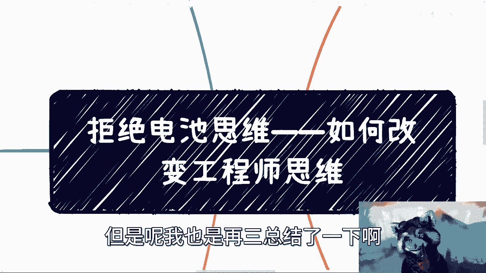

# 拒绝电池思维--如何从根源改变工程师思维---P1---赏味不足---BV1Us4y1e7Se_no

在本节课中，我们将学习如何从根本上转变工程师的思维模式，从纠结细节转向聚焦目标与结果。我们将通过一系列核心问题来引导思考，并结合具体案例进行分析，帮助你摆脱内耗，实现高效行动。

---

## 概述

工程师思维常常陷入对技术细节和完美方案的过度追求，而忽略了达成目标的本质路径。改变这种思维，需要建立一套以目标为导向、关注核心价值的思考框架。

上一节我们介绍了工程师思维的特点，本节中我们来看看如何通过提问来改变它。

## 核心思考框架

要改变思维，在面对任何问题时，都应依次问自己以下几个核心问题：

以下是需要自问的五个关键点：
1.  **这件事是否要完成？** 只需回答“是”或“否”，无需纠结中间过程。
2.  **为谁完成这件事？** 明确最终的受益者或付款方是谁。
3.  **你关心的问题是谁关心的问题？** 区分这是你的困惑，还是客户、用户或付款方真正在意的问题。
4.  **是否了解整个事情的链路（大局观）？** 清楚从开始到结束的全流程。
5.  **自己做不了或没有的东西，是否可以找人合作或进行包装？** 关注整合资源与达成目的的可能性。

思考这些问题时，应避免被“特殊情况”干扰，直接聚焦于目标本身。

---

## 案例分析

接下来，我们通过几个常见场景，应用上述框架进行分析。

### 案例一：知识付费/自媒体创业

假设你想从事培训、知识付费或自媒体。首先应用框架进行自问。

**第一，目的是否为变现？** 如果答案是否定的，后续讨论不再有意义。如果答案是肯定的，则继续。

**第二，付款方是谁？** 可能是C端用户、企业或机构，但肯定不是你自己。不应在未赚钱时自己投入大量资金。

**第三，你纠结的问题（如选什么领域）是付款方关心的吗？** 很可能不是。用户付费常常源于冲动消费，而非对内容深度的极致追求。促使他们冲动消费的关键是营销、海报和焦虑贩卖，而非你纠结的细节。

**第四，了解闭环吗？** 你需要清楚用户因何付费、如何触达他们以及完整的变现路径。

**第五，没有素材怎么办？** 可以包装现有材料或借力。例如，运营知识星球初期，持续投入产出比高的动作（如每日分享行业报告）比纠结内容完美度更重要。

许多人会陷入“我不会做课程”、“被人喷怎么办”、“退款怎么办”等问题的内耗。请再次自问：**这些问题影响你达成“赚钱”这个最终目的吗？** 世界上总会有人不满意，思考无法控制的事情对达成目标无益。

上一节我们分析了知识创业的思维误区，本节中我们来看看项目交付中的常见问题。

### 案例二：项目交付

假设你需要完成一个项目。

**第一，要完成项目、落地项目还是赚项目的钱？** 目的不同，策略截然不同。做技术支持就专注交付，想赚钱就别过度纠结技术落地细节。

**第二，为谁完成项目？** 例如医疗项目，付钱的甲方爸爸的需求才是核心，而非你或最终用户认为的“正确”需求。在有能力改变规则前，满足付款方需求是首要任务。

**第三，你关心技术选型，甲方关心吗？** 甲方关心的是需求是否被满足、能否演示，而非你用什么框架实现。纠结技术细节在商业谈判中常不构成核心价值。

**第四，了解项目全链路吗？** 包括销售、甲方关系、中间方、付款和验收流程。不了解这些，埋头技术细节意义有限。

**第五，缺乏资质或能力怎么办？** 可以寻找合作伙伴、进行包装或借力。商业世界中，许多门槛在于“虚”的资质、背书和关系，而非“实”的技术。

许多人担心“项目不会做”、“方案不落地”、“未来申报不通过”。请判断：**这是你需要考虑的问题，还是付款方需要考虑的问题？** 总包方常不关心底层细节，关心细节的往往是分包方。

---

### 案例三：求职

当前求职环境艰难，如何应用框架？

**第一，是否要找到工作？** 只要“是”或“否”的答案。

**第二，工作由谁决定？** 是HR和老板。因此应关注他们看重什么，而非你自己看重什么。

**第三，你关心“简历没回复”，HR关心吗？** HR可能更烦恼一个职位收到几百份简历。双方关注点错位，你的纠结无效。

**第四，了解求职链路吗？** 不同公司（国企、外企、大中小企业）的招聘模式、当前痛点都不同。需要针对性了解。

**第五，背景能力不足怎么办？** 可以在不造假的前提下包装简历，针对不同公司、职位调整简历内容和描述重点。

在公共平台海投简历已竞争激烈。真正的机会可能来自线下人脉、猎头或内部推荐。如果仍只依赖平台，或许驱动力或决心还不够强。

---

### 案例四：考研/出国

对于考研或出国深造的选择。

**第一，最终目的是什么？** 是赚钱，还是单纯获取学历？如果目的是赚钱，那么整个决策应围绕投资回报率展开。

**第二，为谁深造？** 本质上是为了自己未来的变现能力。

**第三，纠结“学校排名”还是“专业前景”？哪个问题更关乎“赚钱”目的？** 应更关注该学历能带来的具体商业价值和变现路径。

**第四，了解深造后的职业链路吗？** 目标行业的真实门槛是什么？学历在其中占多大比重？

**第五，如果成绩或背景不足，能否通过其他方式（如提升实践经历、获取推荐信）进行包装？**

不要用“我只是想要学历”来自我安慰，除非已财务自由。在现实压力下，明确真实目的才能做出有效决策。

---

## 总结与核心观点

本节课我们一起学习了如何通过五个核心问题转变工程师思维：

1.  明确目标（是/否）。
2.  明确对象（为谁做）。
3.  对齐关注点（谁关心）。
4.  建立大局观（了解全链路）。
5.  善用资源（合作与包装）。

**核心在于：一切思考都应服务于最终目的（通常是变现）。** 与目的无关的内耗（如过度担心负面评价、纠结不可控细节）都应被剔除。这个世界的运行规则常常是“急功近利”的，关注本质（如合同、社保、股权）比关注表面（如华丽的PPT、解决方案视频）更重要。

要真正改变思维，有时需要走向“赚钱”这个极端，以此倒逼自己聚焦本质，避免被无关紧要的细节或他人的PUA所干扰。改变源于实践，而清晰的思考框架是实践的第一步。