# 拒绝电池思维--宇宙的尽头是关系-如果没有-尽头就是营销---P1---赏味不足---BV16N41

在本节课中，我们将探讨一个核心的商业认知：在商业世界中，成功的关键在于“关系”与“营销”。我们将深入理解这两个概念，并学习如何将它们应用于实践，从而摆脱“工具人”的困境。

## 核心观点概述

宇宙的尽头是关系。如果没有关系，宇宙的尽头就是营销，甚至可以说是传销。这并不是贬低营销，而是强调其重要性。许多人对“关系”存在误解，认为它必须是高大上的政府关系或人脉。实际上，这里的“关系”指的是：当别人有赚钱机会时，能第一个想到你。你需要让别人对你有一个清晰的认知，建立自己的“一亩三分地”。

## 第一节：重新理解“关系”与“学历” 🤝

上一节我们概述了核心观点，本节中我们来看看“关系”的具体含义以及“学历”在商业中的真实地位。

很多人误解了“关系”。它并非特指政府关系或高端人脉。这里的“关系”本质是：当存在商业机会时，他人能否优先想到你并与你合作。你需要做的是建立个人品牌，让别人在特定领域内对你形成认知。

在商业领域，懂商业、懂变现是核心能力。学历只是加分项。如果你不懂商业和变现，无论学历多高，在商业产业链中很可能只是“工具人”，处于下游而非上游。你付出努力获得应得的报酬，这不叫“赚钱”；你付出努力却获得了远超其价值的回报，这才叫“赚钱”。因此，对于不懂商业变现的人而言，盲目追求高学历意义不大。

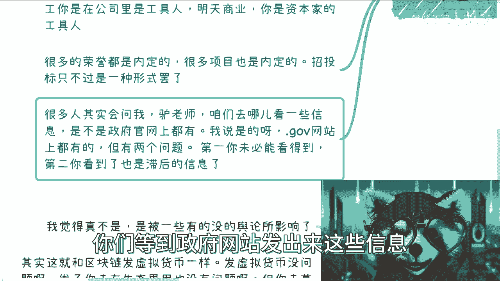

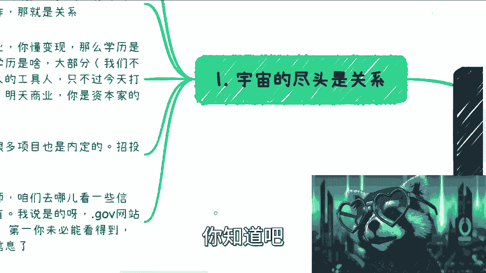

许多商业机会和荣誉项目实际上是内定的。公开的招投标等形式可能只是一种流程。如果只懂得从公开渠道寻找信息并参与竞标，很可能无法触及真正的核心机会。

## 第二节：获取信息的误区与正确路径 🔍

上一节我们讨论了商业中关系的本质，本节中我们来看看普通人获取商业信息的常见误区。

很多人询问如何获取政府项目等信息，并习惯性地去官方网站查找。这存在两个主要问题：
1.  政府网站信息繁杂，筛选有效信息需要大量时间。
2.  网站上发布的信息往往是滞后的。真正的商业合作在信息公布前，往往已通过线下关系完成对接。

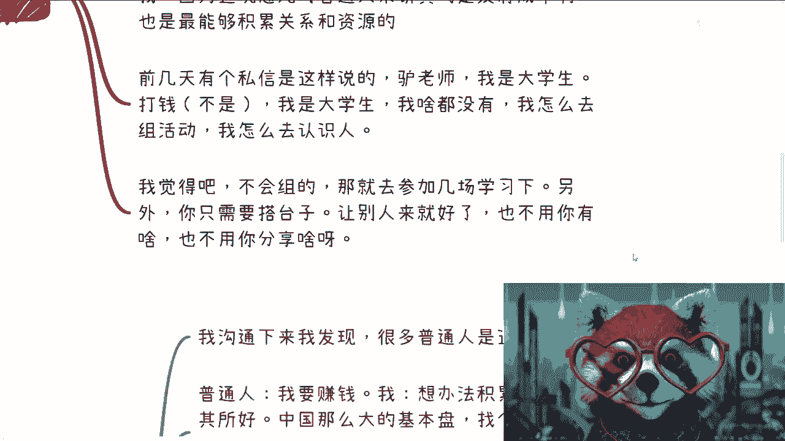

因此，依赖公开网络信息很难抓住第一手的商业机会。

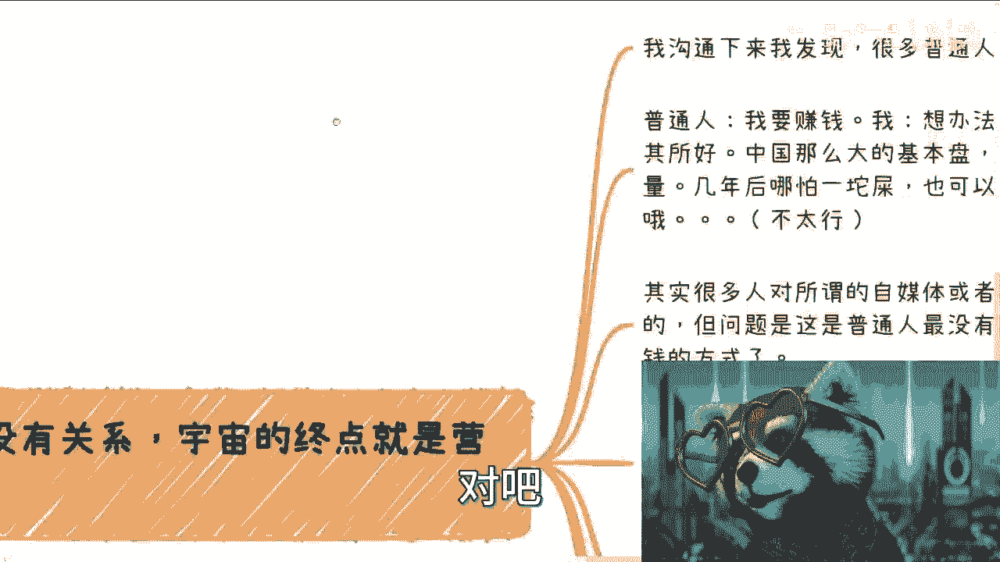

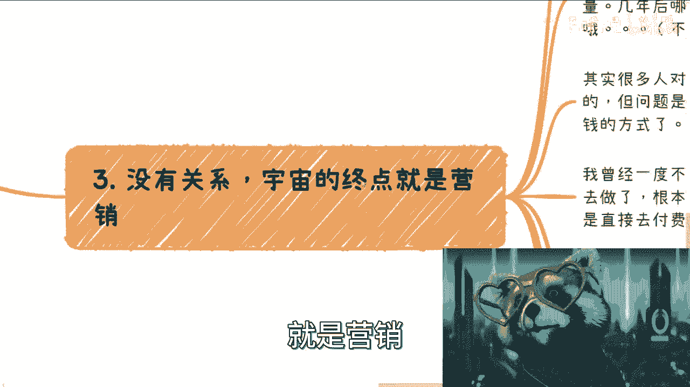

## 第三节：建立关系的低成本方法——组织活动 🎪

既然公开信息滞后，那么如何主动建立关系呢？本节介绍一个对普通人而言性价比极高的方法。

组织线下活动是积累关系和资源成本最低、效果最好的方式之一。对于普通人，这几乎没有金钱成本。

以下是组织活动的具体建议：
*   **不会组织怎么办？** 多去参加别人的活动，学习模仿（Ctrl+C, Ctrl+V）。
*   **自身没有分享内容怎么办？** 你的角色是“搭台者”，可以邀请他人来分享。初期可以坦诚说明情况，例如表示旨在搭建一个交流平台，供大家展示能力。
*   **关键在行动。** 许多人不愿迈出第一步，或是不愿主动结识其他“普通人”（臭皮匠）。执行力是区分想法与结果的关键。

## 第四节：如果没有关系，就必须掌握营销 📢

如果缺乏现成的关系网络，那么普通人逆袭的终极武器就是“营销”。

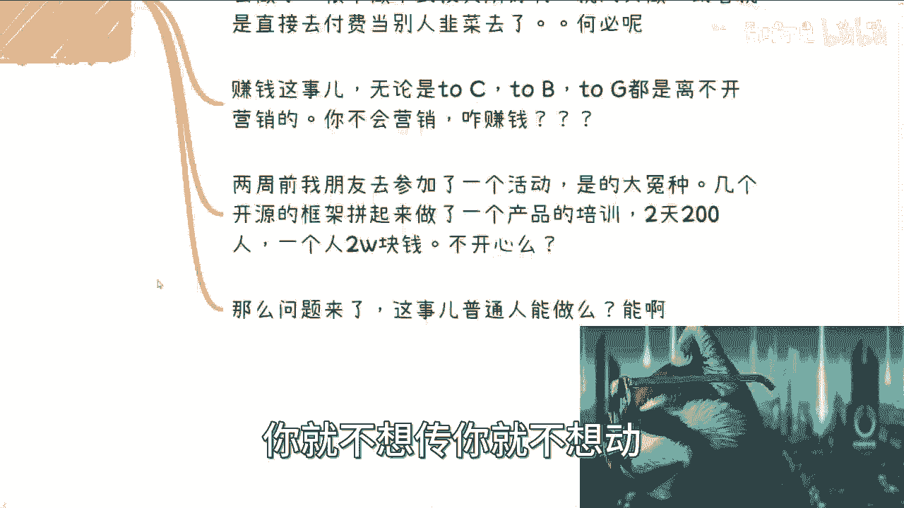

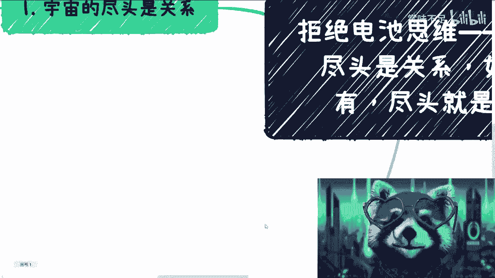

不要看不起营销乃至传销（此处指其传播和裂变的模式内核）。许多成功的商业合作和赚钱项目，其运作逻辑与高效的营销传播模式密切相关。赚钱，无论是面向个人（To C）、企业（To B）还是政府，都离不开营销。

对于普通人，打造自媒体、积累流量是几乎没有资金门槛的路径。核心在于“投其所好”，研究目标用户的焦虑和需求，而不是一味展示“我会什么”。如果内容无法贴合用户，只是自说自话或盲目付费学习，很难取得效果。

营销本身不是问题，问题是能否提供与价值匹配的产品或服务。普通人不应拒绝适合自身的、低成本的起步方式。

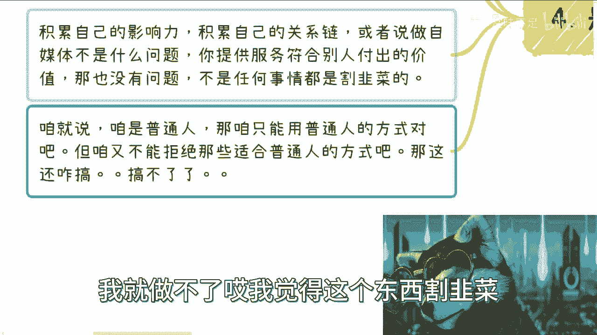

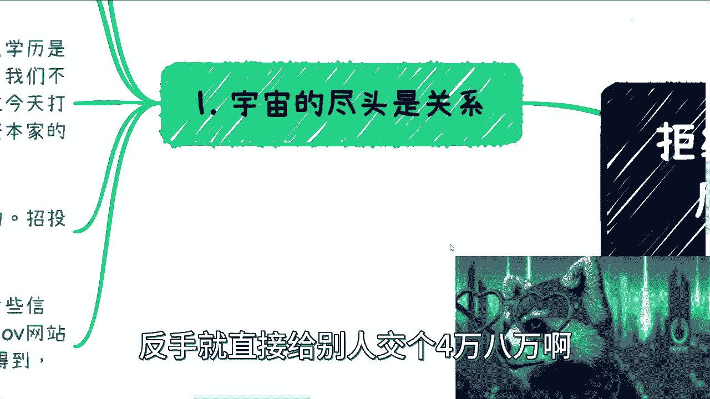

## 第五节：给普通人的最终建议 💡

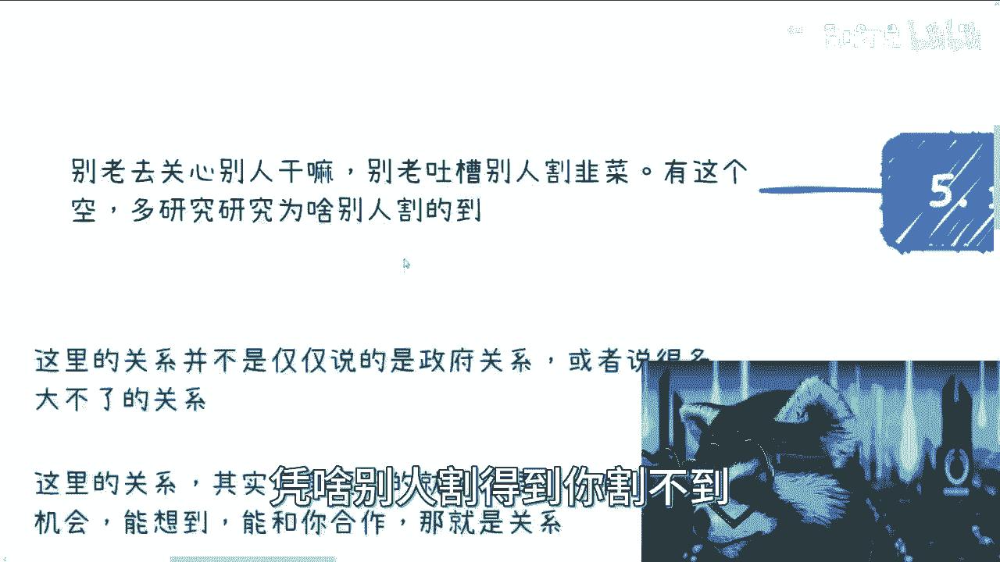

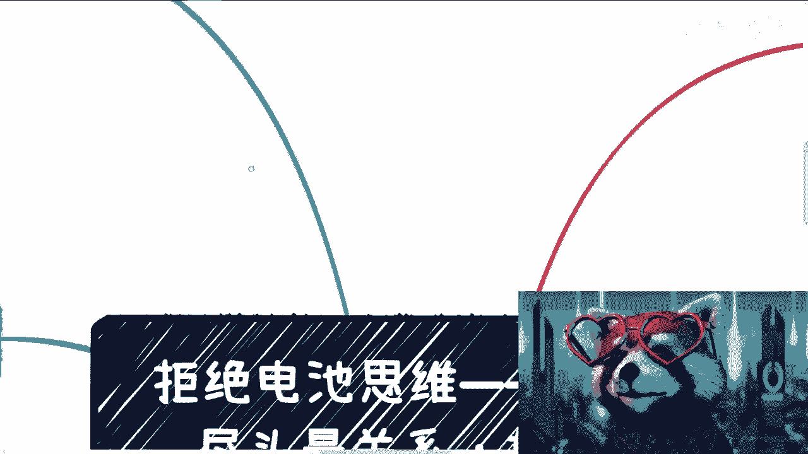

上一节我们强调了营销的重要性，本节我们将进行总结，并提供最后的行动建议。

1.  **聚焦自身，少管闲事。** 不要总是吐槽别人“割韭菜”。应该研究的是：为什么别人能成功，而我不能？将注意力放在提升自己上。
2.  **认清现实，打好手中的牌。** 无论你的背景如何（名校、双非、甚至无学历），最重要的是认清现实：商业世界的尽头是关系，其次是营销。学历和专业方向的重要性，对于追求“温饱”和追求“赚钱”是不同的维度。
3.  **核心在于行动。** 道理都懂，但阻碍很多人的是“不想动”。无论是去参加活动积累人脉，还是开始运营一个自媒体账号，迈出第一步至关重要。

## 总结

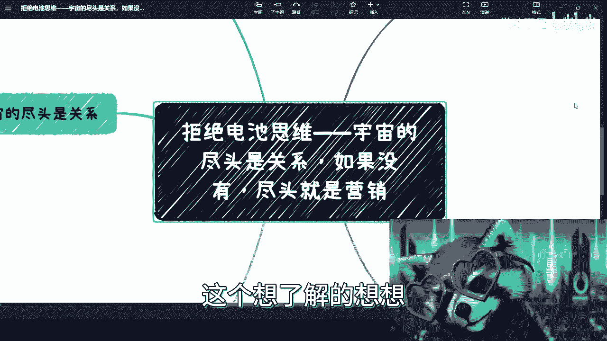

本节课中我们一起学习了商业世界的核心法则。我们明确了“关系”的本质是让他人在有机会时能想到你；我们指出了依赖公开信息的局限性，并提供了通过组织活动低成本建立关系的方法；我们强调了在缺乏关系时，“营销”能力是普通人必须掌握的武器；最后，我们建议聚焦自身行动，利用好现有资源。记住，无论是关系还是营销，最终都需要你主动迈出第一步去实践。