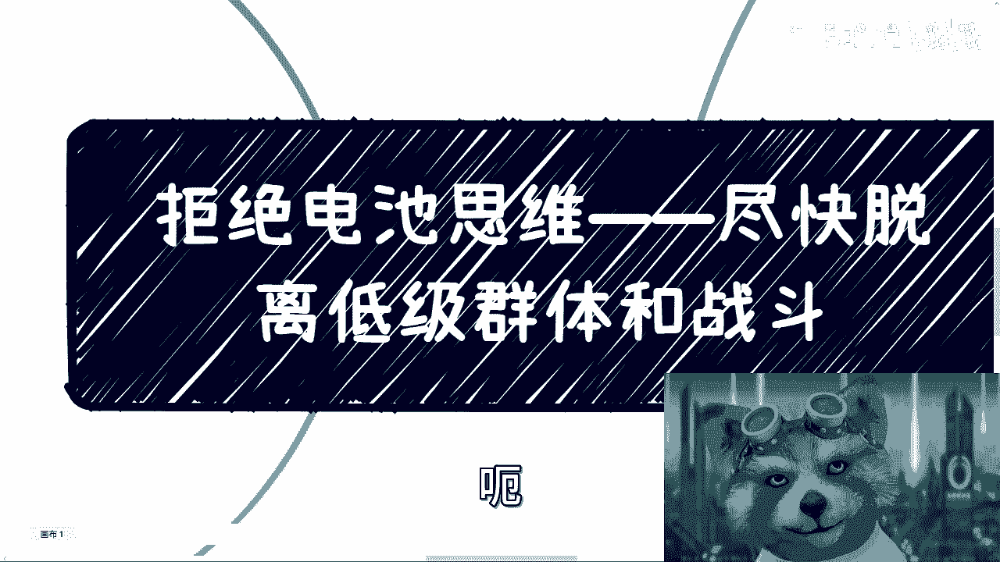
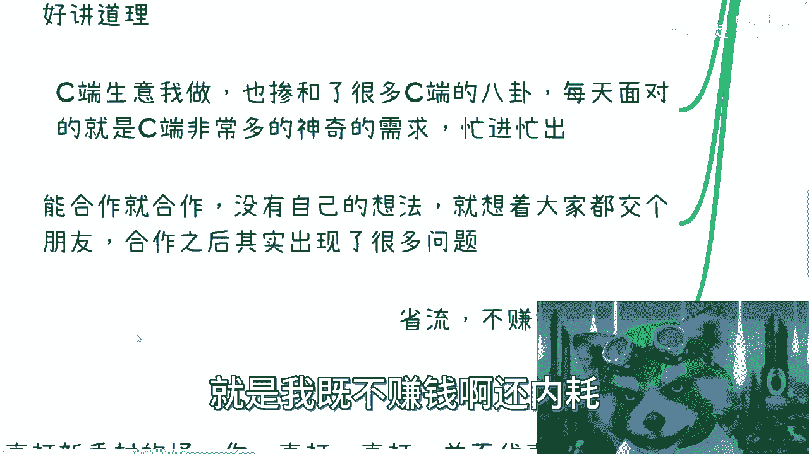
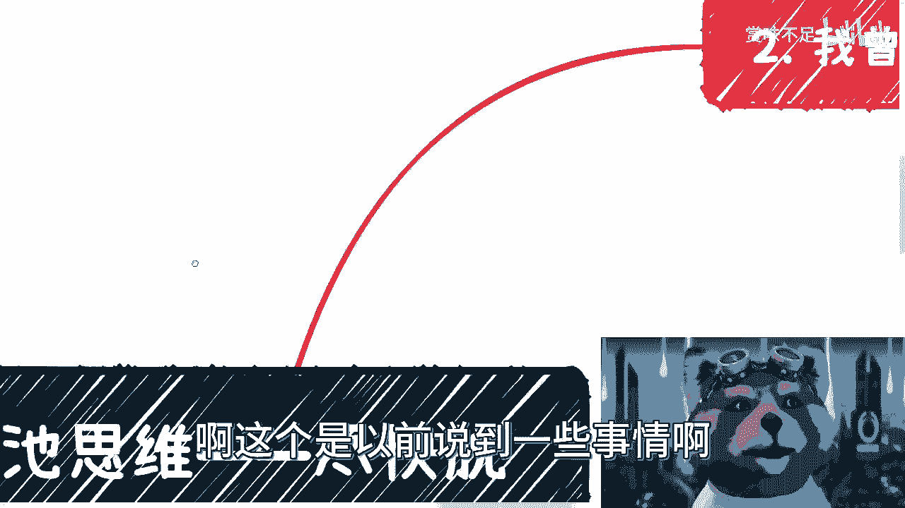
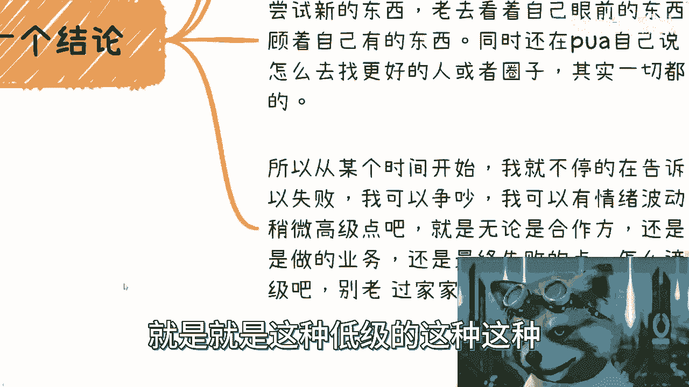
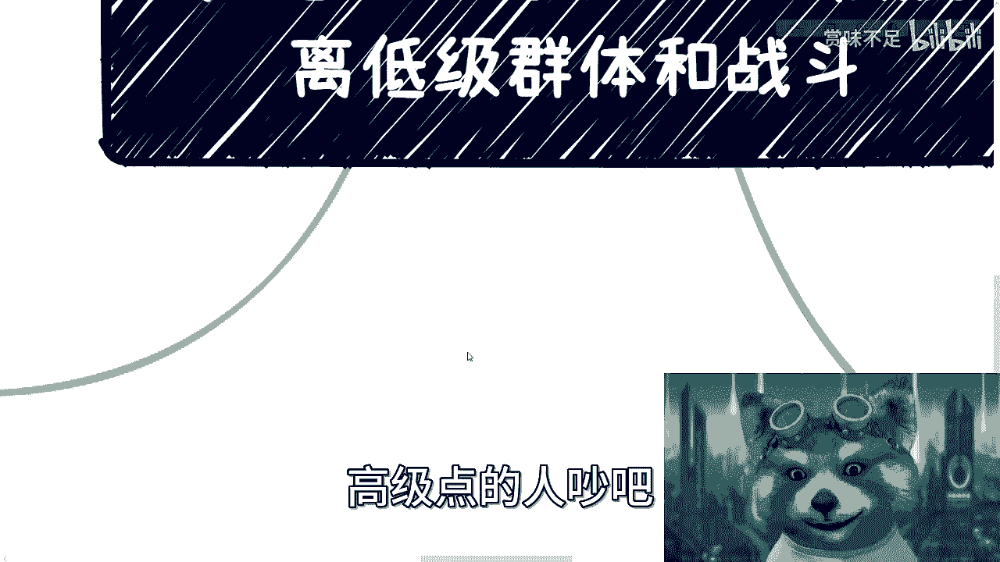
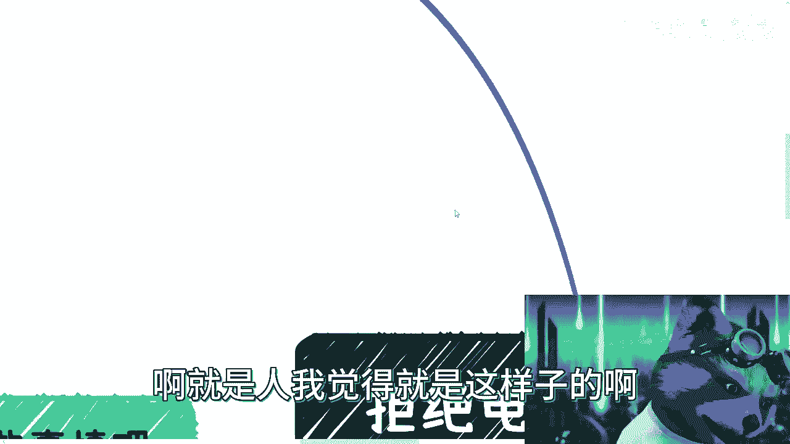

# 拒绝电池思维--尽快脱离低级群体和战斗---P1---赏味不足---BV1qg4y1N7Rd_not

在本节课中，我们将探讨一个核心成长理念：如何识别并脱离消耗性的“低级”环境与冲突，将精力聚焦于能带来真正成长和价值的人和事上。我们将通过分享一段个人心路历程，来剖析常见的思维陷阱，并探讨实现转变的关键。

---

## 概述：曾经的困境与反思

我曾经历过一段相当长的时期，陷入了一系列低效且内耗的行为模式中。

以下是当时几个典型的表现：

1.  **盲目崇拜权威**：我会对那些拥有光鲜头衔或背景的人产生崇拜，尽管并不清楚对方是否具备真正的技能或创新思想。
2.  **过度共情与助人**：我非常乐于帮助所有人，给出各种建议，这或许也与当时“不知天高地厚”的心态有关。
3.  **过度在意他人眼光**：我非常在乎别人的看法，也把工作视为一切，力求得到每个人的认可，甚至包括那些来抬杠的人。
4.  **陷入低价值业务**：我会承接面向普通消费者（To C）的生意，每天处理各种琐碎、奇怪甚至无意义的需求，忙于应付，想着“广交朋友”。

这些行为导致了一个直接的结果：**既不赚钱，还严重内耗**。

---

## 反思：问题出在哪里？

面对持续的挫败感，我曾进行深刻反思。主要思考了两个方向：

1.  是不是我自己做得不够好？例如，对人不够好、思考不够周全、不够接地气，才导致总有人质疑或合作出现问题？
2.  是我的想法本身有问题，还是我面对的受众、合作方或所在的圈子有问题？为什么付出了大量努力和时间，却看不到成长或结果，始终在原地踏步？

本质上，我和许多人一样，都是在摸索中前行，只是经历了更多的折腾。我也曾非常乐于分享，但结果往往是频繁被举报，最终不得不减少公开表达。

---

## 核心结论：问题在于自身与环境

最终我认识到，问题的根源在于我自己以及我所处的环境。

具体来说，我发现自己存在几个关键问题：
*   **不够果断**，不愿尝试新事物。
*   **视野局限**，总是盯着眼前已有的人、事、物。
*   **自我设限**，潜意识里认为自己找不到更好的人和圈子。

这些综合因素，导致我不断陷入低水平的重复：在低价值的业务中失败，与低效的群体争吵，为无意义的事情消耗情绪。这就像一直在游戏的新手村打怪：**你会受伤、会消耗，但经验值几乎不增长，等级永远无法提升**。

---

## 转变的关键：追求“高级”的战斗

因此，从某个时刻起，我开始告诉自己：失败、争吵、情绪波动都可以接受，但至少要让这些事发生在更高的层面上。

核心转变在于：
*   **升级你的战斗对象**：无论是合作方、合伙人，还是所从事的业务，乃至最终失败的原因，都应设法“升级”。
*   **脱离低级群体**：避免持续在低认知、低效率的群体中消耗精力。即使要争论，也应尝试与更高水平的人交流。

这并非为了逃避困难，而是为了确保每一次投入——哪怕是挫折——都能带来相应的经验值增长和认知提升。

---

## 如何改变？没有方法论，只有决心

很多人会问：那么，具体该如何改变？

我认为，这种根本性的转变**不存在标准的方法论**。它的核心在于 **“失去”** 和 **“重建”** 的勇气。

以下是两种可能的路径：

1.  **主动选择**：你需要真正认识到，当前所拥有的学历、工作、名誉等，可能并非不可舍弃。你需要有魄力接受“推倒重来”。
2.  **被动接受**：就像我的经历一样，在某一天被动地接受了“可以失去一切”的现实。

**关键公式是：改变 ≈ 魄力 (推倒重来的勇气)**  
大部分人不具备这种魄力。但一旦你敢于从零开始，无论最终成败，你都已经成功了。因为在这个过程中，你会剥离那些不重要的束缚，触达对你真正重要的核心，从而变得果断，思维方式也随之改变。

指望通过几次咨询、冥想或空想来实现这种深层转变，是不现实的。人的蜕变往往需要经历实质性的“置换”。

---

## 总结与期许

本节课我们一起回顾了一段从陷入低水平消耗到寻求“升级”战斗的心路历程。

我们学习了：
1.  识别了几种常见的、导致内耗的低效行为模式。
2.  理解了问题的根源往往在于自身思维局限与所处环境层级。
3.  明确了转变的方向是追求更有价值的“战斗”和群体。
4.  认识到实现根本改变的核心在于拥有“置之死地而后生”的勇气和魄力，而非具体的技术步骤。

我并非天生如此，而是在经历了许多事后，才强行转变至此。我希望大家能尽早向这种思维靠拢：**有意识地脱离低价值的群体和冲突，将精力投向能带来成长的高级战场**。时间越晚，转变的代价可能就越大。

希望这段分享，能对你在职业规划、副业探索或个人成长的思考上有所启发。