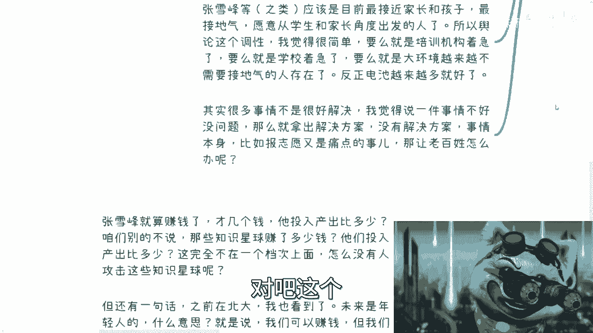

# 拒绝电池思维--我们一起来看看-张雪峰-事件带给我们的思考---P1---赏味不足---BV1EM4

在本节课中，我们将通过分析“张雪峰事件”这一社会热点，探讨舆论的形成机制、商业化的本质，以及如何避免成为被单一信息操控的“电池”。我们将从多个角度拆解这一事件，帮助你建立批判性思维，学会独立判断。


## 概述：事件背景与核心矛盾


近期，教育领域人士张雪峰成为舆论焦点。媒体使用了“网红”、“商业化”等词汇进行描述，引发了广泛讨论。这一事件表面上是关于个人言行的争议，实则反映了信息不透明、公众焦虑与商业利益之间的深层矛盾。

理解这一事件，关键在于不被表面词汇所迷惑，而是看清各方立场与背后的利益关系。

## 角度一：家长与学生的困境 🤔

上一节我们概述了事件的背景，本节中我们来看看处于事件中心的学生与家长群体。

对于大多数家庭而言，高考志愿填报是一个信息高度不对称的领域。家长和学生普遍缺乏有效的决策依据。

以下是他们面临的核心困境：

*   **信息不透明**：官方发布的历年录取数据、专业就业详情等关键信息往往不完整或难以获取，导致填报志愿如同“开盲盒”。
*   **刚需与无助**：填报志愿是刚性需求，但在缺乏透明信息的情况下，公众只能向外寻求帮助。
*   **机构的两面性**：市面上的教育咨询机构是主要的求助对象。它们作为商业组织，其服务质量良莠不齐。在经济压力下，部分机构可能以“包就业”等承诺为噱头，但其商业模式本质是：
    **公式：机构利润 = 学生缴纳的费用 + 从合作企业获取的服务费 - 基础运营成本**
    在这个过程中，学生可能同时为机构和用工企业创造价值，而自身获得的实际收益有限。

因此，当出现像张雪峰这样从学生和家长角度出发、提供相对接地气建议的个人或机构时，自然会受到欢迎。舆论对此的批评，可能源于其触动了某些传统机构或学校的利益。

## 角度二：被污名化的“网红”标签 🏷️

了解了学生与家长的处境后，我们再来审视舆论中频繁出现的“网红”一词。




“网红”在舆论语境中常被赋予负面含义，暗示其“不干正事”、“没有积累”、“像小丑”。这种标签化是一种有效的舆论引导手段。

以下是标签化带来的影响：

*   **预设偏见**：当一个人被冠以“网红”标签后，公众在了解其具体言行前，可能已经戴上了“不靠谱”的有色眼镜。
*   **转移焦点**：讨论从“他提供了什么价值”转向“他的身份是否正当”，这属于典型的**电池思维**——即不假思索地接受外界赋予的定义，缺乏独立判断。
*   **本质无关**：一个人是“网红”还是“专家”并不重要，关键在于其输出的内容是否真实、是否有益。技术领域的“区块链”概念也是如此，名称可以变化，但核心原理（去中心化、不可篡改的分布式账本）才是关键。

**代码示例：警惕标签化思维**
```python
# 错误的电池思维：根据标签直接判断
person_label = "网红"
if person_label == "网红":
    credibility = "低" # 未经思考，直接赋值
else:
    credibility = "需评估"


# 正确的独立思考：根据事实判断
person_actions = ["提供历年就业数据", "分析专业利弊", "揭露行业信息"]
if any("真实数据" in action for action in person_actions):
    credibility = "较高"
else:
    credibility = "存疑"
```

拒绝电池思维，就是要剥离这些煽动性的标签，直接审视事实与逻辑。

## 角度三：被批判的“商业化” 💰

当我们学会剥离标签后，另一个攻击点“商业化”就值得深入分析了。

批评张雪峰“商业化”的言论，其逻辑本身存在巨大漏洞。在市场经济环境下，几乎所有的服务和产品都带有商业属性。

以下是关于“商业化”的思考：

*   **普遍性**：学校（包括公立和私立）、媒体、培训机构本质上都是商业化运作的。单独指责个人“商业化”是双重标准。
*   **问题的核心**：关键不在于是否收费，而在于**服务是否货真价实**。如果一项服务本身价值2元，却收费2万元，这才是应该被批判的欺诈行为。不能因为收费就全盘否定其价值。
*   **舆论的动机**：攻击“商业化”可能源于两种心态：
    1.  **利益冲突**：A（如张雪峰）动了B（如传统机构、部分学校）的蛋糕，或B预感未来利益受损。
    2.  **嫉妒心理**：“我做不到/做不好，所以你也别想做”，这是利用大众的普遍心态进行攻击。


因此，我们需要分辨批评是针对“收费行为”本身，还是针对“不合理的收费标准与质量”。前者是立场问题，后者才是事实与法律问题。


## 角度四：事件发展的推演与启示 🧭

分析了各方立场和舆论手法后，我们可以尝试推演此类事件的常见发展路径，并思考其长远影响。

当前的环境是：公众有强烈需求（如择校咨询），但缺乏分辨能力；经济形势推动更多人进入该领域寻找机会。

以下是可能的发展阶段推演：


1.  **无序涌入期**：看到需求与成功案例，大量非专业人士入场。
2.  **乱象丛生期**：由于从业者水平参差，市场出现欺诈、服务质量低下等问题，用户投诉增多。
3.  **舆论恶化期**：媒体集中报道行业乱象，将个别问题扩大为行业整体污名。“一颗老鼠屎坏了一锅粥”的效应显现。
4.  **严格监管/垄断形成期**：舆论压力导致政策收紧，设置高准入门槛。最终，市场从“人人可参与”的分散状态，走向由少数拥有资质的“龙头”机构垄断的状态。

**公式：市场演变 → 分散化竞争 → 问题爆发 → 舆论批判 → 集中化/垄断化**


我们需要思考的是：垄断后的“龙头”机构，其服务是否会真正从用户角度出发？答案往往是否定的。垄断通常导致服务性价比下降和创新停滞。最终结果是，公众的选择更少，获取真诚建议的渠道更窄。


## 总结：如何实践“拒绝电池思维” 💡


本节课中，我们一起学习了如何通过“张雪峰事件”来锻炼独立思考能力。


拒绝电池思维，绝非反对一切或质疑一切，而是避免非黑即白的二极管思维。它要求我们：

1.  **探究需求本源**：看到家长学生的困境在于**信息不透明**，而非缺少批评的对象。
2.  **剥离煽动标签**：警惕“网红”、“商业化”等词汇带来的预设偏见，直接考察**事实与逻辑**。
3.  **分析利益立场**：思考舆论批评的背后，是谁的利益受到了触动，其动机是什么。
4.  **推演长远影响**：明白当下的舆论风波，可能会如何影响未来市场的形态与个人的选择空间。


社会的许多道路看似选择众多，实则可能越走越窄。保持独立思考，看清现象背后的结构与动力，是为了在变化的环境中，尽可能为自己保留清醒的判断力和选择权。