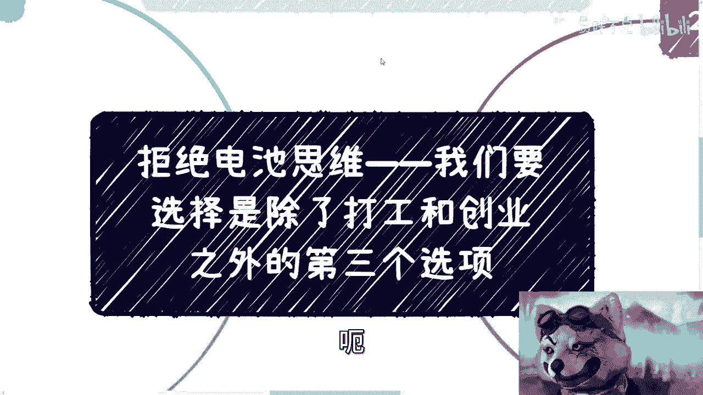
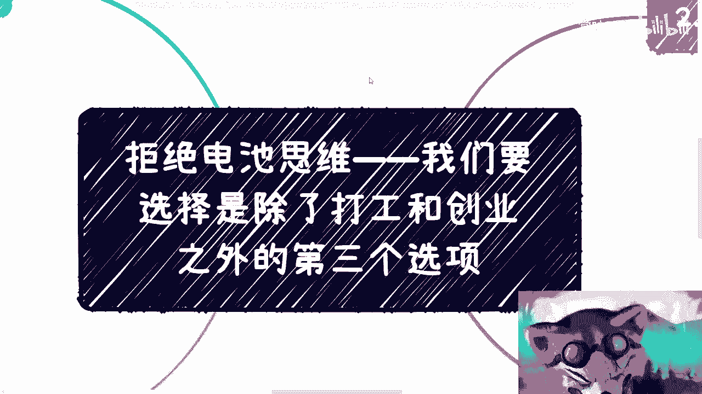
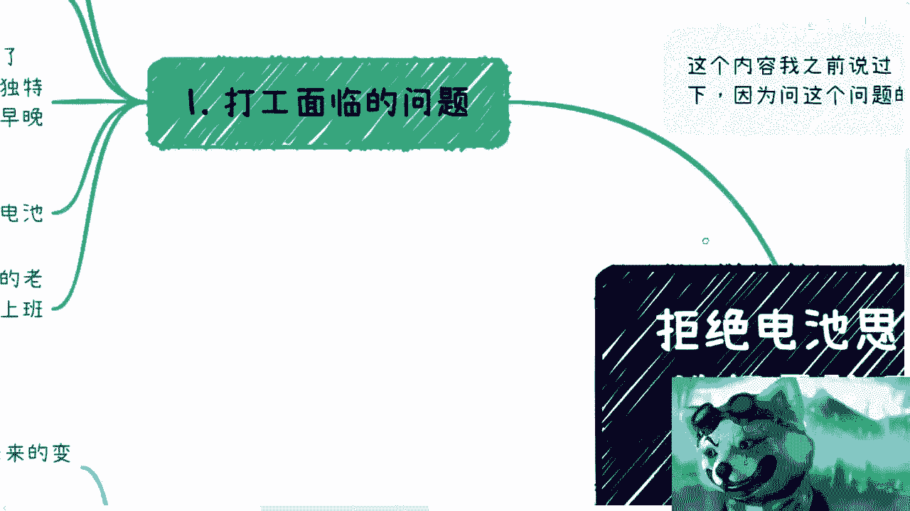
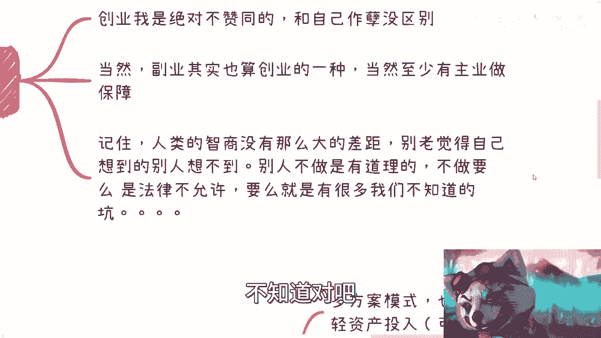
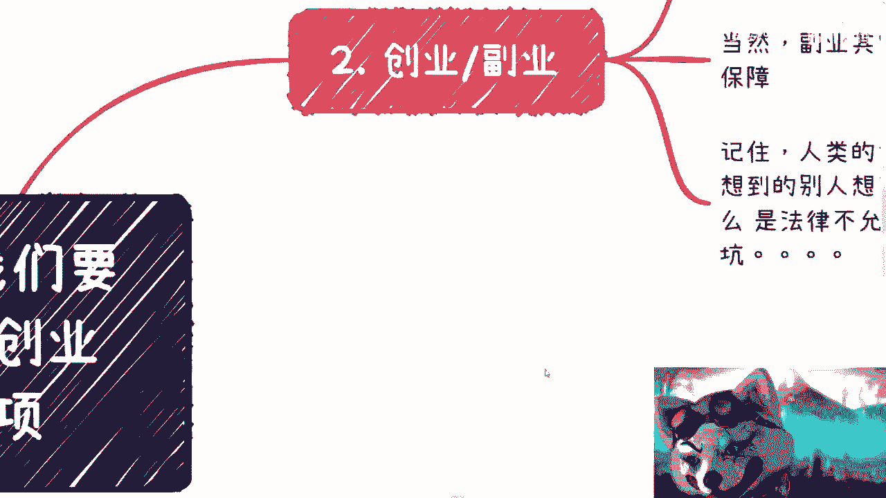
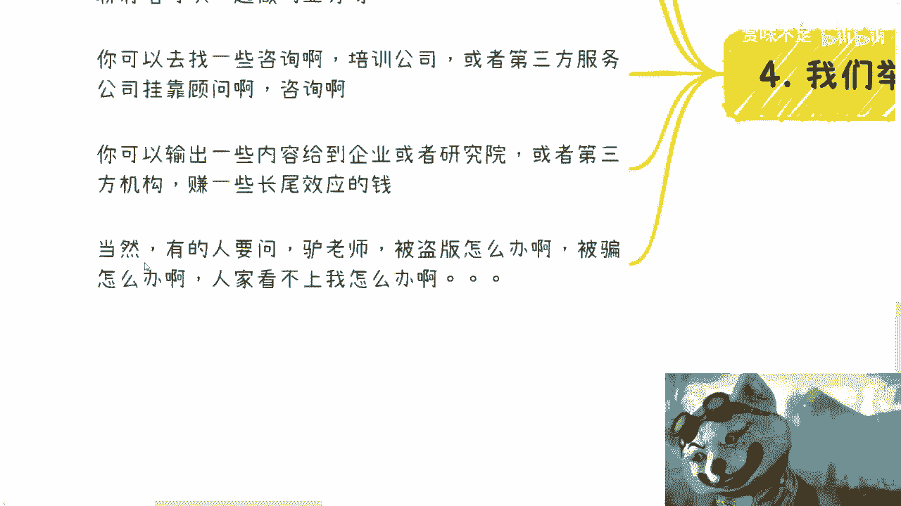
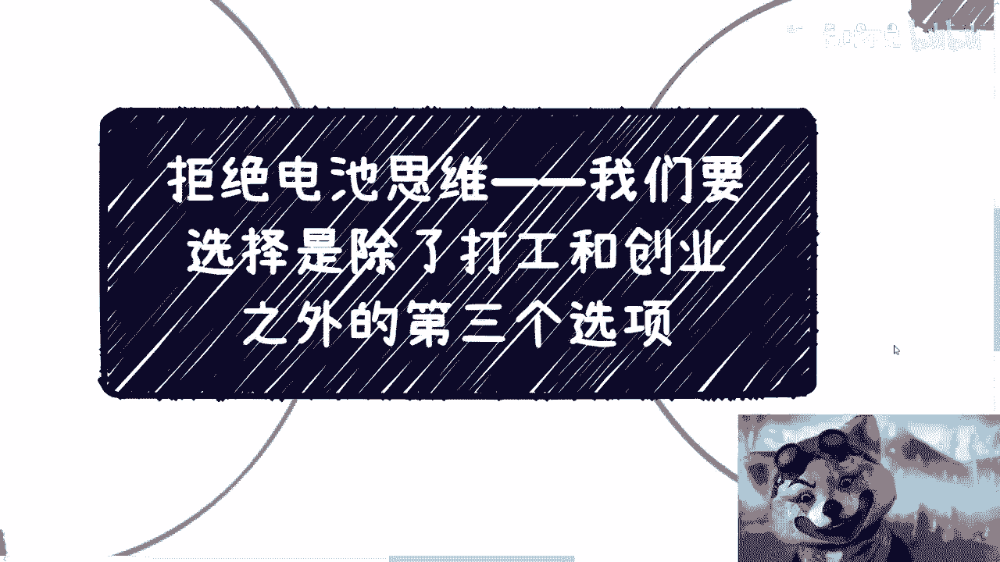
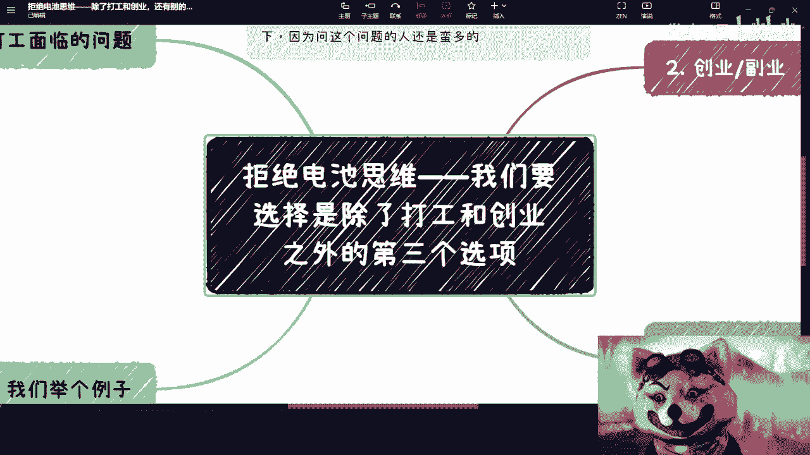

# 拒绝电池思维--我们要选择是除了打工和创业之外的第三个选项---P1---赏味不足---BV1Mh4

在本节课中，我们将探讨一种超越传统“打工”与“创业”二元对立的职业发展思路。我们将分析这两种常见路径的潜在风险与局限性，并详细介绍被称为“多方案模式”的第三种选项。无论你是职场新人还是寻求转变的资深人士，本课程都将为你提供一个全新的视角。

## 一、 对“打工”与“创业”的重新审视

上一节我们概述了课程目标，本节中我们来看看为什么需要重新思考“打工”和“创业”这两种主流路径。

首先，我从未支持过大家去创业。无论是经济形势好与坏，互联网上充斥的所谓成功案例，大多属于“幸存者偏差”。例如，宣称摆地摊月入9000的故事背后，是大量未被看见的失败者。即便给你资金，当你真正了解创业失败的普遍性后，很可能也会望而却步。

其次，我也不支持纯粹的“打工”。这一点从一开始就很明确。打工面临的核心问题是**不稳定**。这种不稳定是结构性的，随着年龄增长，被替代的风险会显著增加。在当前环境下，失业或存在职业空窗期将成为常态。除非你拥有极其特殊、不可替代的技能（屠龙之技），或身处极高管理层，否则作为一颗“电池”被替换只是时间问题。

“电池”的比喻意味着：在资本视角下，普通员工是可被随时替换的标准化零件。老板的想法很简单：给你一份薪水，你接受就做，不接受就离开，因为外面有大量替代者排队等候。许多人对“稳定工作到退休”的旧观念抱有幻想，但现实是，这种可能性已微乎其微。

## 二、 “创业”与“副业”的陷阱

上一节我们剖析了“打工”的不稳定性，本节我们来分析“创业”与“副业”的常见误区。

我将创业与副业归在一起讨论。我坚决不赞同在没有充分准备、独特优势或雄厚家底的情况下盲目创业。副业本质上是轻量级创业，虽然有主业作为保障，但它同样存在瓶颈。

核心问题在于：**任何你想深入了解并赚钱的领域，最终都需要你全身心投入**。总会存在一个时间分界点，让你考虑是否放弃主业来全职做副业。通过兼职方式，很难触及一个行业的真正门道和商业闭环。许多水下规则和精髓，只有全职投入才可能摸清。

此外，必须认清一个现实：**人类的智商差距没有想象中那么大**。不要认为自己能想到一个独一无二、别人都想不到的“好点子”（idea）。如果一个需求看似强烈但无人涉足，通常只有两种可能：1. 已经有人在做了，只是你不知道；2. 其中存在法律风险、资源壁垒或未知的复杂问题（如地头蛇垄断、特殊资质要求）。

因此，以“我有一个绝妙想法”开头的项目，大概率不靠谱。所有你能想到的，别人早已想到。如果这条路可行却无人走，背后必有原因。

## 三、 第三种选项：多方案模式 🎯

既然“打工”不稳，“创业”维艰，那么出路何在？本节我们介绍核心的解决方案：多方案模式。

我一直建议的是第三种选项：**多方案模式**。它既不是单纯的多主业，也不是传统的多副业，而是一种**轻资产投入、多线并行的业务探索方式**。其核心公式可以概括为：

**职业安全 = 方案A + 方案B + 方案C + … + 方案N**

这里的“方案”指一条独立的、可能产生收入的业务线或合作路径。我们需要的不是一条路走到黑，而是同时铺设**五条、十条甚至二十条线**。通过沟通、学习、积累，在这些线上进行尝试和跟进。

以下是实施多方案模式的关键步骤：

1.  **广泛尝试与筛选**：初期必然会有很多尝试无果而终，这是常态，无需有挫败感。多线并行的目的，正是在大量尝试中快速筛选出真正靠谱、有潜力的线路。
2.  **深度挖掘**：将筛选出的优质线路留下来，投入更多精力进行深挖和运营。
3.  **建立备份思维**：借鉴“蝙蝠侠”的处事哲学——永远为主方案准备备选方案（backup），并为备选方案再准备备选方案。世界充满不确定性，计划再周密也可能遭遇意外，多方案本身就是最好的风险对冲。
4.  **打破思维定式**：不要自我设限，认为所做之事必须与主业或所学专业相关。赚钱的逻辑在于理解**需求、关系、路径和产品**，而非特定技能本身。用打工的思维去理解赚钱，会错失大量机会。

## 四、 多方案模式实战案例 💡

理论需要实践来印证。本节我们通过几个具体案例，来看看多方案模式如何落地。

以下是几种可以并行开展的方案示例，它们共同的特点是**注重积累个人价值与资源，而非先期资金投入**：

*   **积累私域流量**：通过自媒体或线下活动，积累属于自己的粉丝或客户群体。未来可用于转化、商业合作或寻找合作伙伴。价值在于构建你自己的影响力和连接网络。
*   **连接投资人网络**：主动结识一些投资经理或投资人。目的并非寻求融资（我们不鼓励轻易创业），而是从他们那里获取行业前沿信息，并探索短平快的业务合作机会。很多赚钱的机会就藏在快速的资源对接中。
*   **对接第三方机构**：寻找咨询公司、培训公司或服务公司进行合作。了解他们缺乏什么资源或服务，然后利用你的专业技能去填补空缺。这是将个人技能市场化的有效途径。
*   **体系化内容输出**：像本课程一样，就你擅长的领域创作成体系的内容（课程、文章、报告）。可以授权给企业、研究院或教育机构，获取长尾收益。一次投入，持续产生价值。

**请注意**：以上所有方案，均不鼓励你先投入大量资金。核心在于投入你的**时间、精力和智力**，去积累和包装个人的价值。市场上许多所谓的“机会”以先收费为特征，需要高度警惕。

## 五、 常见顾虑与心态调整 🛡️

在行动之前，人们常有一些顾虑。本节我们来直面这些担忧，并调整好心态。

*   **担心成果被盗版**：盗版不是你能控制的，过度思考此事只会阻碍行动。核心是快速执行，在行动中建立壁垒。
*   **害怕被骗**：在商业世界中，“交学费”某种程度上是成长的必经之路。每一次受挫都是对认知的升级。关键是在可控成本（尤其是时间成本）内试错，并从中学习。
*   **害怕被拒绝或看不上**：商业世界重视的是“包装”和呈现的价值。你需要学会如何有效地展示自己的能力与资源。大部分合作始于一个看起来不错的“包装”，后续用实际交付来夯实。

最后，需要明确一点：在追求这种模式时，请暂时放下道德上的完美主义。在资本市场中，首要规则是**创造与获取价值**，而非简单区分“好”与“坏”。专注于如何合法、合规地提供价值并实现变现。

## 总结

本节课中，我们一起学习了“电池思维”的局限性，并深入探讨了“打工”与“创业”之外的全新路径——**多方案模式**。

我们认识到，将职业安全寄托于单一雇主或业务是危险的。取而代之的，应是主动构建一个由多条轻资产、可并行业务线组成的个人商业系统。这套系统的核心在于：**广泛测试、快速筛选、深度运营、备份思维**，并通过持续输出价值和整合资源来提升自身抗风险能力与盈利潜力。

记住，你的目标不是成为一颗优秀的电池，而是成为自己人生的CEO，设计并运营一个稳健的、多元化的价值创造体系。

