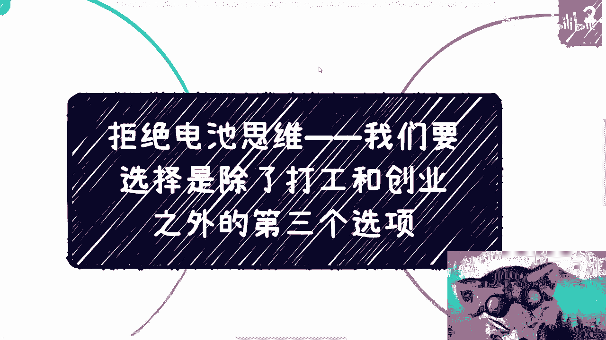
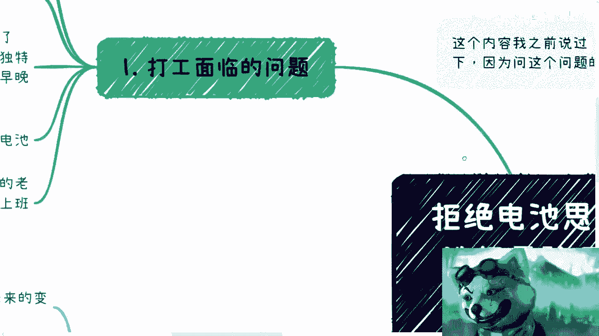
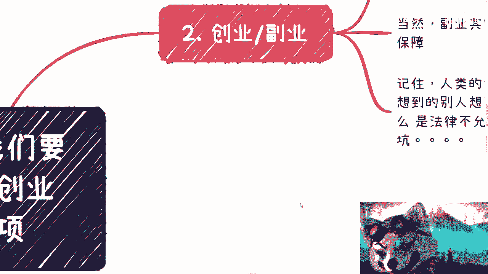

# 拒绝电池思维——我们要选择是除了打工和创业之外的第三个选项 - P1 - 赏味不足 - BV1Mh4y1d7kR

啊各位小伙伴大家好啊，这个哎我又是我是吧，卷王啊，卷王嗯。

嗯首先这一期内容呢就主题吧啊我以前说过，但是呢我想重新强调一下啊，同时我把里面的一些内容呢再细分一下，因为我最近聊下来呢，发现这个大家对这件事情误解蛮深的啊，呃第一啊我从来没有支持过大家创业啊。

不管是鼎盛时期还是不是鼎盛时期啊，还是那句话啊，就是大家从互联网以及其他地方看到的，都是幸存者偏差啊，就这么回事啊，什么什么摆地摊9000块钱一个月是吧，什么乱七八糟的，我跟你们说啊，你们大部分人啊。

是没有看到过这背后的尸体对吧，但凡能够看到背后的这个堆积如山的失败，失败者。

我就算给你们钱，你们去创业，你们都不会去创业啊，我就这么跟你们讲啊，这是第一点，第二点是什么呢，就是说呃我也不支持打工啊，这件事情从一开始我就说的很清楚，我就不支持，没什么好说的啊，所以说呢我就说了啊。

我所提倡的是打工和创业以外的第三种选项，当然也不是副业啊，也不是副业，我后面会说怎么说呢。

也不是完全的叫辅音啊，这个理解上不太对，首先第一个啊打工面临的问题对吧，我这个重要的事说三遍对吧，不稳定就是不稳定，没什么好说的啊，怎么不稳定呢，就是年龄到了就是不稳定，也就就这么简单啊。

没有这么多复杂的问题对吧啊，然后我觉得吧我现在交流下来呢，我觉得这个很多人对大局还不是很了解啊，就是别来老觉得说哎呀我们现在失业了，我们现在这个找不到工作对吧，或者来说这个空有一定的空窗期对吧。

get不了多久，我跟你讲，你接下来失业有空窗期gap，这才叫常态，你一个30多岁或者来说是个什么应届生对吧，能找到工作，你已经超越了百多少多少人了，你知道吧，当然在这个地方我也说得很清楚对吧，也别骄傲。

也别自满对吧，因为你找到只不过是当下一个情况，那并不代表你能做很久对吧，有可能过几个月你就跟大家一样是吧，首先是第一点，第二点呢，就是说你只要啊不是说有什么特殊的技能对吧，什么屠龙之技啊对吧。

什么什么什么什么个人的很牛逼的技能对吧，你只要不是非常高的高管，你作为一个电池被替换是早晚的事情，我觉得大家得要有正确的认知啊，别再用八九十年代对吧，这个很多的什么人告诉你们啊，这个工作对吧。

要做到退休是吧，是哎你可以退休，但是是不是能工作到退休啊，我跟你讲啊，大概率不可能啊，别想了是吧，呃很多人还在问啊，他说什么是电池，你现在明白什么叫电池了是吧，哦所以就是我跟你说的很清楚。

如果你到我这里来打工，比如说对吧，你到我这里来打工，我就告诉你，我就是个资本家，你对我来讲nothing，你就是个电池，为什么你就别跟我逼逼，你明白吧，什么什么意思呢，就是说比如说我告诉你。

你就1万块钱一个月对吧，你爱不干，爱干不干不干，给我滚，外面排队的人多的是为什么，因为你是电池啊，换谁不是换，是不是，我跟你们讲，你们老板都是这种想法，哪个资本家不是这种想法是吧。

那只不过人家没这么露骨啊，然后说两句好话，这不就把你们忽悠了，是不是啊，我跟你讲，真的别自欺欺人，你知道，然后很多人又要说了，他说哎呀，不会的对吧，吕老师，你别瞎扯是吧，哎我们的老师，我们的父母。

我们的学校都告诉我们是吧，打工是才是最稳定的，上班才是最稳定的，我跟你讲，那你随意，你爱咋地咋地啊，反正我这句话早就说到现在了是吧，都他妈说了两个月了是吧，啊这是第一个。

第二个呢创业跟副业我就把它归在一起了啊，创业呢我是绝对不会赞同的，随便你们怎么讲啊，你就算这空天上掉下来500万，我也不赞同你们创业是吧，就真的就是没事情做，没有两把刷子，家里没有矿对吧，你别去创业。

别跟自己自作孽对吧，何必呢啊，呃当然副业其实也算创业的一种啊，这个也在说在修在这啊，当然它是由主业作为保障的啊，但是在这个地方呢，我之前也说过啊，就是大家一定要明白一点，就是你但凡要去做一件事情。

要去了解一件事情呢，你肯定是两只脚都要踏进去的，也就是说你当中总会有一个时间分界点，也就是说这个时间分界点就是你觉得啊，你可以放弃主业来全职做副业的这个时间点，也就是说我就这么跟你讲吧。

就是说但凡啊你们是坚持着去做的，可以赚到钱，不是不能赚到钱，但是你们这个就是摸不到啊，就是你们所做副业的，这个行业里面的一些门道啊，摸不到这个水下的一些精髓啊，但凡要摸到，你们就会全职的去做。

或者说必须全职才能可能摸到里面那些东西，因为商业的很多闭环，商业的很多东西，你们就是通过兼职方式是很难知道的啊，然后呢在这个地方呢，我觉得就是无论如何时时刻刻记住一件事情。

就是人类的智商没有这么大的差距，什么意思呢，就是说别老觉得自己想得到别人想不到的哦，也就是说不管你们今天是自己想，还是你们今天碰到一个很牛逼的大佬对吧，他跟你说，我有个id，我跟你讲。

但凡以重想法开头的，大概率不靠谱，为什么没有什么idea是别人想不到的哦，这个今天我有一个idea好，我是全世界第一个想到的可能吗，唉算了，你还不如去买彩票啊，你说是不是啊。

也就是说你一定要想明白一件事情，所有的想法你能想到的，别人早就想到了，但是如果这条路你觉得很有痛点对吧，很有需求，很有刚需，但别人不做，为什么只有两种可能性，一种是别人在做，你只是不知道。

第二种就是说别人不做，有可能，只是因为它里面有很多法律不允许的地方，因为现在法盲越来越多对吧，你们但凡去做业务，一定要明白法律是红线啊，这个东西你们一定要去了解的，不了解这个坑老多老多了是吧。

还有一种要么就是说这里面有非常多，我们不知道的问题对吧，有可能比如说地头蛇垄断啦对吧，有可能比如说里面有些条条框框我们不知道啊，有些资源可能有资质的对吧，不知道对吧。

但是并不代表你想的id也没人想得到。

这个是二三呢，所以我一直以来建议的呢就第三种选选项啊，什么叫第三种选项呢，叫做多方案模式，也就是说它是一个既你可以把它当成多主业，也可以当成多副业的这种模式，呃当然这种模式我在之前有说过。

就是轻资产投入，可以搜索轻资产对吧，这个关键字那一期啊，因为我觉得后面有很多小伙伴可能没看到对吧，呃租金轻资产呃，当然了，我最近聊一下，我发现大家这个对于副业跟大家当下情况，的确不了解嘛。

所以说我说的清楚一点啊，其实就是说呃，我所指的并不是一个单纯的一个副业，因为有很多人，我觉得脑子里面只有打工和副业这两个选项啊，就或者打工跟创业这两个选项，其实不是的啊，就是说是通过沟通，通过了解。

通过学习，通过积累，通过很多种方式，我们现在其实需要的是五条，十条甚至20条的这种线的去铺设，也就是说这种业务的跟进，当然你说没有没有就是需要你们去积累的，你知道吧，然后去想办法在这里面分一杯羹。

你说分到多少，咱就不去说他啊，因为所有的事情都是一步步来的对吧，你说我刚开始做的时候，我出来做些活动都是免费的，我什么时候赚过钱了对吧，都是倒贴的对吧，我可能一天就吃一顿饭，这不是很正常的事情啊。

你要做件事情总有取舍的，是不是啊，你当然事实说，事实上你做的时候你会发现很多线是不靠谱的，当然这也很正常对吧，因为我沟通下来有很多小伙伴说嘛，他说哎呀，我做的时候有些事情不靠谱，没有什么下文对吧。

然后好像也不赚钱，我就很有挫败感，我跟你讲，没有必要有挫败感，为什么，因为这是常态，这不是你的所有人事都都这样子，对吧，所以说我才跟你们讲，你们需要五条线，十条线甚至20条线的去铺设。

因为我们没有这么多时间去一个一个试，我们必须是同一时间去试，然后在这当中把那些真正靠谱的，能赚钱的线留下来，然后去深挖，这个才是我们目前当下应该做事情的方式，你知道吧，所以说呢你看我在之前提到的时候呢。

我也一直提的那个叫什么，就是蝙蝠侠是吧，你会发现就是但凡了解过DC的蝙蝠侠的人，你就会明白蝙蝠侠在整个联盟里面对吧，做事情，他是唯一一个会为所谓的，就主方案做备选方案的，他还会为备选方案做备选方案。

也就是back up，back up对啊，为什么，因为很多事情我们预料不到，很多事情我们根本就不知道会往哪个方向发展，我们计划的再好，我们计划的再周密，人算不如天算，很正常对吧。

更别说你们可能会碰到一些无，这个无良的导师对吧，猪一样的队友对吧，怎么样，这都太正常了，你说是不是是吧，所以说呢就是说这个地方我也说了，就是我们得需要多个不同的方案去做对吧，包括我现在也是一样的。

虽然我不上班，但是我日常就是有非常多的这个项目，在那边跟进，有的是能赚钱的，有的就是我只要付出一次努力，然后持续性的给我赚钱，对有的就是跟进到最后就没结果的，哎呀很正常啊，过于正常，你知道吧。

然后最后一点呢就是不要拘泥于啊，就是不要自己PUA自己，或者自己去束缚自己，说你要做的事情一定跟你的主业或学习有关，没有关系的，你知道吧，就我会发现很多人啊就是做东西，他可能对比如说计算机比较了解对吧。

或者或者什么电子商务啊对吧，或者说这个建筑啊对吧，什么对比较了解，他就觉得我就一定要往这上面偏，其实不是的，就是你会发现你越拘泥于这个东西，你会浪费很多的机会，你知道吧。

所以说呢就是赚钱这个东西你就往赚钱上去看，别用打工的思维去理解赚钱这件事情，否则的话你只会就是说既浪费了很多的机会，还自己不感觉到你浪费了很多机会啊，所以说赚钱这件事情跟你学什么东西。

本质上没有任何关系，他只跟你了解这个背后的赚钱的逻辑，需要哪些人，需要哪些关系对吧，需要哪些必经的路径，以及需要哪些产品，这个是你要去知道的，然后这个人为什么会愿意付钱，那你要去明白的，而不是说啊。

我今天这个甲板怎么写，Python怎么写对吧，建筑这个cad怎么画对吧，这这这这没有用的是吧，好第四点，我们举个例子啊，举个例子，比如说啊你现在要做了对吧，好一种，你可以说你积累自己的私域流量啊。

我不管你怎么积累，你做自媒体也好，你线下去做也好，随便你无所谓啊，你积累自己私域流量这一块思维流量，你可以在未来做变化啊，不是做变现，做转化，然后甚至商业合作从里面找一些合作伙伴。

因为你比如说到今天为止，B站上来找我咨询的，不是都找我咨询的，还是有找我商业合作的，也有政府里的，也有企业里的，我觉得都很好，真的只不过就是说这些东西大家私下合作嘛，就是就是各取所需对吧，我能提供我的。

他能提供他的，大家一起赚钱就结束了，是不是我觉得也蛮好的对吧，那么这是第一条，第二条就是并行啊，就是就是一起去做的对吧，你可以认识一些投资人啊，你别问我怎么才认识啊，这个这投资人太好认识了。

你随便去找一些投资经理，我怎么网上都是都是二维码，随便讲是吧，本质上呢你并不是未来要让他们投资，我跟你说了，创业不是我看好的，没有什么创业，本质上你知你还是在被别人割韭菜，没有区别的，你知道吧。

所以一方面呢，我觉得你可以从他们身上获取信息，另外一方面呢你可以多聊聊，看看有啥业务可以一起做的，因为很多业务呢它就是一个短平快的，没有这么多什么什么，有很多人想的一样，哎呀我们要做规划啊对吧。

做个什么长远的规划对吧，要缜密对吧，他呸我跟你说啊，这他妈的能赚钱就行，还哪他妈这么多逼逼的事是吧啊，然后第三个就是说你可以去找一些咨询公司啊，培训公司啊，第三方服务公司啊，去找他们合作啊对吧。

那当然不是说你一开始就能够去挂靠什么顾问，咨询对吧，你可以先合作看看他们缺什么是吧，当然了，你们每个人都有每个人的技能对吧，每个人都有每个人的专业，那就去找对应的这个培训公司，服务公司。

第三方这个这个咨询公司还多了去了是吧，你们可以先合作看看他们缺什么，你不是没方向嘛，对不对，那问呗，问了你总归只能知道他们缺什么，你再看看你能不能做嘛，对不对，好还有一个呢你可以说出一些内容啊。

就跟我一样对吧，输出一些内容啊，呃当然要成体系化的啊，成体系化给企业或者给研究院对吧，或者给第三方机构赚一些长尾效应的钱，你就比如现在当下啊，还有一些机构在卖我的课对吧，我都已经这个课可能3年前的课了。

还在卖，那么每卖一个都会给我百分之多少，那你也蛮开心的，有总比没有好吧，是不是，那你也可以做这这我你看啊，你看啊，我所给的方案你自己你们自己看啊，我所给的方案哪一个会跟你们说，要要让你们投钱。

那不没用的，我从来不不支持说大家做事情先投钱，我跟你讲先投钱，他妈的大部分都跟骗子没什么区别，你知道吧，你们要做的是投入你们的精力和时间成本，然后把你们这个人，把你们的价值整个的积累起来和包装起来。

这才是你们要做的，你知道吧，头衔没有用的，就是我跟你们讲，我靠这个最近咨询我的人我都懵了，你知道吗，就是那种你知道什么叫那吕老师，哎呀，我这个失业对吧，没工作啊，我怎么样怎么样，哎当时我报了个培训班。

卧槽我就懵了，我说我能拿多少钱哦，34万妈的失业是失业钱还是蛮有钱的，就我跟你讲，说实话，我跟你们说实话，我也这个直白一点对吧，我每次听到这种话，我心里面就他妈抽自己，你知道吗。

就是唉他妈的可怜之人必有可恨之处，哎我怎么他妈的就不能坑啊对吧，那么这种人有34万交给我不开心吗，真的是啊，我他妈唉底线还是太高是吧，啊当然了，有人就要问了，他说哎呀，吕老师啊，你提供了这么多方案啊。

但是呢我也不敢做，为什么呢，我做的时候呢，万一被盗版了怎么办，被骗了怎么办，人家看不上我怎么办，是不是唉呀，我这么说吧啊这个视频反正放到最后了，已经啊已经在最后来了，我最后也就说说点更直白的话啊。

首先被盗版不盗版，不是你能控制的，你别去想这个事情啊，做就完了，干就完了，对不对，好，这是第一点，第二点是被骗怎么办，没关系啊，所有人成长都是要被骗过来的，所谓交学费交学费就是被骗了才交学费的对吧。

那你不被骗怎么成长啊，是不是，那不被骗也没有今天这个局面啊，我说实话啊，这第二点第三点是人家看不上我怎么办，你骗了你包装啊是吧，我跟你说，大部分本来就是靠骗，就是靠包装的，哪里像我这么实在啊。

我说啊给高校打工做课程，我还真做课程啊，啊你们去看看有几个人他妈的做课程的，哎呦我的天呐，真的是啊哦能有几个人能像我一样从区块链上，从金融上面一出出30多个小时的课啊，我给我给人事部一出出80个小时。

可你们去看看有几个人有这个能力出来，为什么，画画饼，画一两个小时没问题，你让他体系化的，能给大学生讲课，讲八个80个小时的，你让他上上看，对比了。

对吧，所以我跟你们讲啊，别这个还有一些人我跟你讲，很搞笑的啊，还这个站在道德高地啊，还说我啊，吕老师，你你这个不教好是吧，教坏人家哈，我跟你讲什么搞笑也搞笑的，我告诉你在资本家的市场没有什么好和坏。

只有赚钱跟不赚钱啊，别来谈好和坏，谈好和坏的人是赚不到钱的啊，就这么回事。

好吧行。

