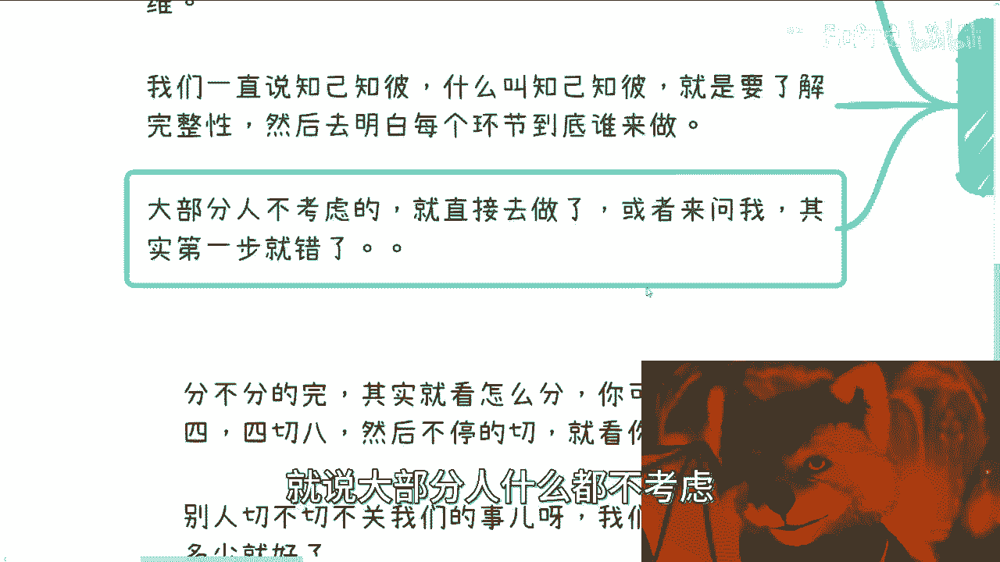
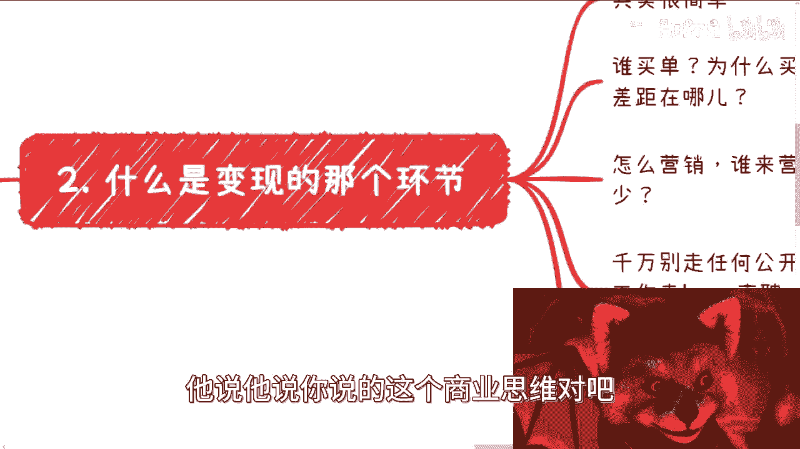
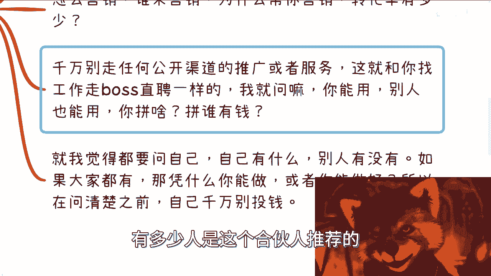
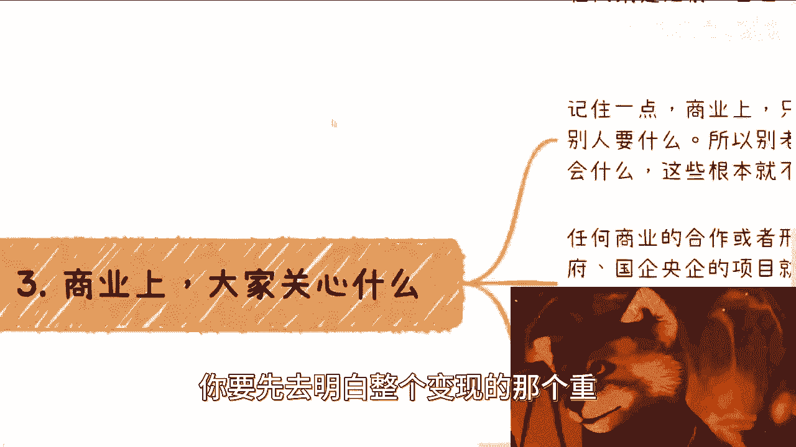
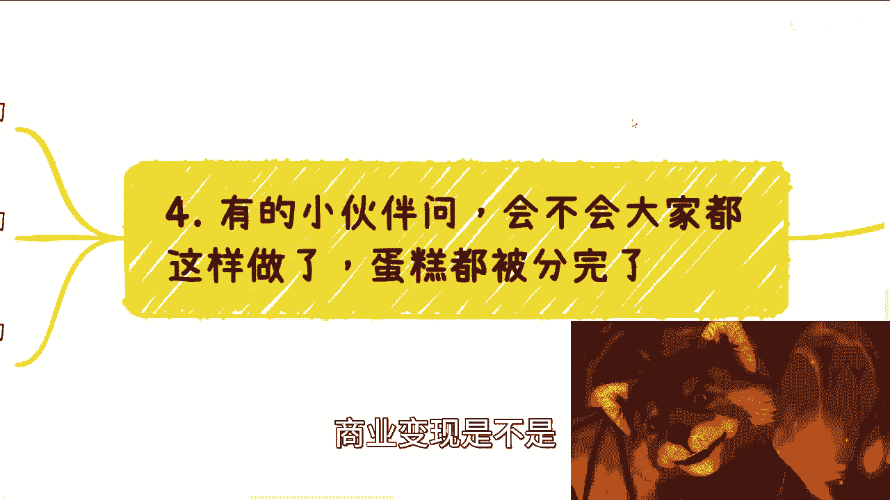
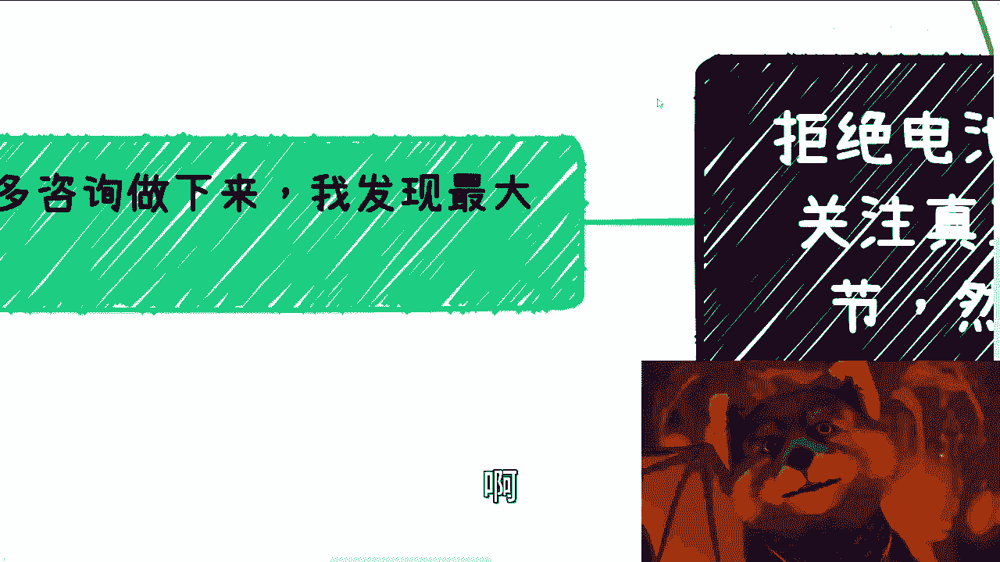
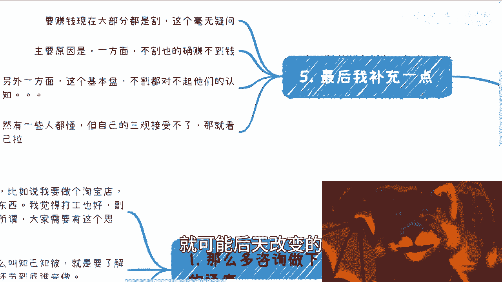

# 拒绝电池思维——我们需要关注真正变现的核心 - P1 - 赏味不足 - BV1wg4y1K78E

好哦大家好，这个对吧，我从杭州回来了啊，然后这个接下来我先跟大家说一下啊，就是忙成狗太多太多事情了啊，什么什么各种各种大纲啊，嗯各种课程啊都要出啊，然后这个很多东西都排着队好吧。

哎就累是真的累啊，然后呃我说一下这两天的事啊，评论区有小伙伴啊，然后还不是说是竞争对手对吧，这个还不是说最近可能嫉妒我的人多了啊，这个产生了很多质疑啊，我觉得也没什么好质疑的对吧，第一呢。

我觉得大部分的视频我在b站上做的对吧，也没有说问大家收费，所以也不用说太去觉得怎么样对吧，这是第一点，第二点呢就是你像我说，我下下周或下周去杭州师范啊，他们会上一个叫计算机与前沿，科技的这么一门课呃。

我会给他们托底啊，就是大概上个两三，我会负责两三天吧，反正啊这个也没什么好那个的，你们到时候去问问杭州师范的同学，有我有没有去不就知道了嘛，对不对，这没啥好质疑的，而且说不好听点。

这个东西我给你们吹吹牛逼。

也没什么好吹的对吧，到最后也就这两周是吧，这是要要吹也就吹破了，就是没啥太大意思好嗯，然后继续啊，我们来说这个电池思维的问题啊，嗯稍等啊，我把我的小熊猫校对一下，就是这问题是这样子的，首先呢我聊到现在。

聊了非常多的这个咨询的人对吧，我得出一个结论是什么呢，就是你看啊，首先这么多咨询下来，我发现有个巨大的通病，这个通病就是什么呢，就是大家虽然啊就是有主业对吧，大家也想去赚更多的钱。

但是从一开始的这个逻辑上啊，一开始的这个思考方式上面就不在点子上呃，比如说啊比如说我们说我想做个淘宝店吧，我想学个东西，或者我要做个任何东西呃，我觉得打工也好，副业也罢，创业也罢，其实无所谓。

但是呢大家得要有这个思维啊，什么思维呢，就是说我们一直说知己知彼是吧，那么什么叫知己知彼，就是你要对你做的这件事情，你要对你做的这个事情当中所涉及到的人，所涉及到的机构对吧。

所以涉涉及到任何东西都要有一定的认知对吧，就是说这件事情的完整性啊，啊包括每个环节到底谁来做啊，大家有没有发现我今天这个小熊猫对吧，哎我把他范围扩大了，感觉只要不挡住字就可以了啊。

那么大部分人呢我觉得不考虑的哦，他只考虑就是相当于整个这个环节的前面，一部分他不考虑为后面后面部分啊，或者来说就是说大部分人什么都不考虑。

就直接去干了啊，或者直接来问我，其实第一步就错了，你知道吧，所以我这个主题写的很清楚，叫什么呢，叫做我们要去关注真正变现的那个环节，就是真正交钱，你能够赚钱那个环节，然后去倒推唉，我本来这个推写错了。

还好我意识到我在被你们喷死啊，我跟你们说对吧，就肯定是要倒推再去准备的，而不而不是说一个正向的整，一个一个一个正过来的整整流方式啊，这个我们后面来说就什么是变现那个环节对吧，就很多人也都在问。

他说陈老师对吧啊吕老师是吧，他说他说你说的这个商业思维对吧。

商业变现到底什么意思对吧，你变现那个环节是什么东西呢，其实很简单，就是什么呢，就是你考虑任何一件事情，你做任何一件事情对吧，就是谁买单，为什么买单，为什么买你的单，你比别人这个不是不是差距啊。

叫做区别在哪，对不对，你就问你几个问题嘛对吧，那么我们就拿那个这个淘宝或者抖音，这种广告来讲，包括b站的这种广告来讲，就是你跟我说，你说好买单的是谁呢，b站上的用户对吧好，为什么买单呢。

那么可能有一部分的用户有这个需求，对不对，好，那为什么买你的单，我买你的蛋蛋，那你说好，由于他们看到你的视频，对不对好，那么他你你和别人的区别在哪呢，那么你就说啊，因为我投了广告，别人没有投对吧好。

那么你想想看啊，这几个逻辑说到底就是你能不你能做，别人也能做，没有门槛，对不对，当任何一件事情，你能做别人也能做，没有门槛的事情，那么你如何能说这个钱就一定你能赚呢，别人不能赚对吧，你要是这么想的话。

就好像这就好比就是说你今天非要去想着说，我买张彩票，我就能中奖，别人中不了，那这个没有意义的呀，对不对，好好我知道了，这个我记得小伙伴跟我说过了，他说他说刘老师，你以后你以后这个视频里面没有意义。

这个词要少出现哈，我不说好吧，然后这是第一个啊，第二个对吧，怎么营销，谁来营销，为什么帮你营销，转化率有多少对吧，你要去把这些东西搞清楚对吧，就像我们回到刚刚那个淘宝啊对吧，或者你要做电商啊，不对。

电商你要做直播啊对吧，你要做什么什么什么，咳咳咳，还有很多人跟我说什么，做医疗的对吧，做做做做做做生意的，做小商小零售的啊，就是你要你要把这东西想清楚啊，你你你说啊，我产品准备好了对吧。

但是这些问题都不知道的啊。

全部都是问号，那你做啥呀对吧，就是你会发现这个问题是离钱近的呀，你你做什么产品不重要啊，对不对啊，然后还有呢就是说千万别去走任何公开的渠道，推广或者服务对吧，这就跟你我就跟你讲，这就跟你找工作去走走。

boss boss直聘是一样的，就是说你要明白任何一个平台，只要你能用，别人也能用，那么你凭啥对吧，你是拼谁有钱吗，还是拼还是拼这个说你是他的vip，我敢打赌，今天你要是vip。

那就肯定有v v i p，你要v i p就有人是v v v i p，对不对，就这种东西对于所有人来讲，但凡你去一个公开的平台，你就是已经进入了一个卷的状态对吧，你卷是卷不动的呀。

你找工作有多少人是找猎头的，有多少人是直接找hr的，有多少人是这个合伙人推荐的。

有多少人是内推的，你所有已经筛筛光了，你到脖子基本上你能筛得出个屁来呀，对不对，那么还有就是说我觉得呢就是你都要问自己的，就是唉就自己有什么对吧，别人没有啊，如果来说大家都有。

那凭什么你能做或者你能做好对吧，所以呢就是你要在就是我们刚刚说啊，就在这一系列的这个这个问题之，你问清楚之前对吧，你不要先去想着说啊，这个我要去投钱了或者怎么样了，就没有意，我不说我不说啊。

就不要想要投钱啊，不要去被割啊，对吧好，那么第三点就是商业上对吧，大家关心什么啊，商业上大家关心什么呢，很简单就关心钱嘛，对不对，但是呢就是说商业上面呢就不是说你能做什么，是别人一定要记住。

不是你能做什么，而是别人要什么哦，就是做任何东西，别太去关注，说你会什么，你有什么资源，你一定要去市场化运营运营，也就是说你要找到对方的痛点，找到就是就是为什么买单，然后你再去倒推。

就像我们今天主题说的，你要先去明白整个变现的那个重。

这个核心点在哪里，然后你通过那个核心点去倒推啊，也就是说任何商业的合作，那任何商业的合作和这个形成，都是从上往下的啊，比如说你比如说政府国企央企对吧，我们比如说我给他们做做咨询合作培训啊。

他们的项目就是寻找供应商对吧，做技术就是寻找供应商，比如说做c端生意的对吧，就是先设计好产品，然后去咳咳找渠道，而且这个产品不是说这个细节啊，就是说把这个产品的这个轮廓对吧，就是最基本的。

比如说什么功能啊，大方向是什么啊对吧，大概这个demo的样子啊对吧，这个交互怎么样子，你就简单的做好，然后就去找渠道对解决什么问题，这个主要就又回到那个问题，就是ppt对吧，那么你比如说做政府端的。

那么先包装包装好产品，对吧，那么也就是说你会发现，没有任何一个商业逻辑的形成，在早期是关心细节的，而我发现大部分人跟我沟通下来，他们在就是我不管是创业还做别的东西，就是他们在沟通的。

就他们再去设计自己的这个副业，或者要去赚钱的这个逻辑当中，一开始是要去关心很多细节的，甚至是对于很多细节有精神内耗的对吧，你比如说用什么技术，你会什么，或者谁会什么对吧，或者谁在哪里，你是谁。

没有人关心，你明白吧，就是这就我以前给一个小伙伴咨询的时候，我跟他举过个例子啊，我说我说你跟别人打个比方，你今天跟我说，你说吕老师我们来合作对吧，好然后你跟我这么说。

你说刘老师我有10年的假外加外经验啊，我擅长这个解决这么多线程问题对吧，擅长解决这个这个这个安全问题对吧，怎么样怎么样，就你就算跟我讲两个小时，跟我讲三个小时，我肯定也是一个字都听不进去的，为什么。

因为你所有的技能，你所说的细节，你所说的那些问题对我来讲不能变现啊，对不对，没有用的呀，哦那如果说你说啊，那刘老师这个我不太懂啊，我需要你帮我包装包装的那哥哥姐姐，爷爷奶奶，我只想这么说啊。

商业层面没有人欠谁的，对不对，那你要去谈，就是你一定要包装好，你要想别人只想对吧，你要帮别人想想清楚，你要想在别人前面，别人才有意愿合作哦，你什么东西让别人帮你包装，那我说不好听的，我为什么找你合作。

我找别人合作不香吗，对吧，我去找别人合作不省力嘛，是不是，我看看啊，哎呀等一下哦，有人要找我。

好然后那个第四个对吧。

就是有小伙伴，有小伙伴其实也一直在问这个问题，他说罗老师啊，你一直跟我们说这个商业变现，商业变现是不是他说很多人去做对吧。

会不会大家都这样做了，蛋糕就被分完了啊，我跟你讲这个问题就很神奇啊，首先蛋糕分不分得完，看你怎么定义它，对不对，因为你跟1200，而且47 八对吧，就不停的切对吧，关键是这个蛋糕封不封得完。

我们也不用关心，关心的是你能切多少嗯，对不对，那我们都还没赚到钱呢，我们就来关心这蛋糕分不分的玩，我杞人忧天，你知道吗，这个叫，当然了啊，然后还有小伙伴问我，他说会不会就是他说我一直在说数字经济嘛。

对吧，那么会不会说这个行业有很多人进来之后，对我造成影响，我说实话我是真的希望大家对我造成影响啊，就是你们正确的去学习，正确的来到行业跟我卷，我不要太开心哦，为什么，因为现在没人跟我卷了，对啊。

这这真不是凡尔赛，就是没人跟我卷对吧，你大家来卷的话，这个行业才会好啊，没有卷，我一个人在这边对吧，那，可能也就那样对吧。

哎呀今天早上还有人哎呀，现在的这个基本盘啊，这个小伙伴真的是不行啊。

这个呵呵算了，就这么着吧啊，最后我补充一点啊，就是要赚钱的，当下这个情况大部分就是哥啊，我就很明确跟你们讲，大部分就是割你不割就赚不到钱的呃，当然从商业来讲没有什么割不割的啊。

所以我也建议大家就说不要这么的，就是二极管的去看这个问题，还是要辩证的去看待它啊，那么主要一方面原因呢就是说如果不割啊，那么也的确赚不到钱，我这个也明确跟大家讲啊，也的确是赚不到钱，没毛病嗯。

嗯第二另外一方面呢就是这个基本盘呢，我跟你们讲，你们但凡了解一下基本盘，你们但凡接触过足够多的人，你就会发现这个基本盘不割，都对不起他们的认知，你知道吗啊，然后哎呀这个事情我就跟你们讲这么说吧。

就是我曾经聊过很多人啊，然后呢我很为他们着想啊，我会跟他们说各种各样的环境前提啊对吧，然后各种各样的情况啊，各种各样的未来的发展啊，各种各样的你们要面临的问题啊，对吧好，然后呢我跟他们讲了这么多之后呢。

他们心里面我知道他们怎么想的，他们就会怎么觉得，他们觉得这个人不是很专业啊，这个人说了半天也没有给我什么建议对吧，那这个人明显就是来骗我的嘛，对不对，反而你知道吗，转过头去啊，就是跑到那边培训班啊。

交个4万 8万，然后一边教一边还要跟我说，哎呀卢老师，我没钱，你知道吗，就是那种4万 8万10万的，怎么办呢，我跟你讲，我也会的呀，我怎么不会啊，那我等我他妈发个视频也可以的，来大家跟着我做吧。

月入5000，月入1万，我管你们啊，真的是往死里割，对不对，就我跟你讲，很多人真的是贱啊，就是你越为他想吧，他不领情的，他要来骂你啊，你越是割他，他还要跟你说谢谢哦是吧，当然有一些人很懂。

一些人其实也是懂的，但是呢自己就是说这个三观啊，很多东西他接受不了啊，就是说他可能知道我应该怎么做营销，我应该怎么去赚钱，但是他就会觉得就是说自己的这个情商啊对吧，各个各个三观啊，他可能接受不了对吧。

那这个我跟你们讲这个就看自己啊，也不用勉强啊，因为本来嘛对吧，本来嘛就是说商业上面，就不是说大家所有人都很适合，大部分人不是那种天生适合的啊，就可能后天改变的。

你就跟我一样是吧，嗯所以呢就是我跟你们讲，不管你们做任何的事情，就是不管你们做任何事情，所有的这个事情的逻辑，那就应该是先去思考啊，这个变现的核心点到底在什么地方啊，我就跟你们讲啊。

嗯我回头可能再出一期叫做什么，叫做宇宙的尽头是关系，如果你没有关系，宇宙的尽头就是营销，就这两件事情你知道吗，核心点就这两个别的都不重要啊，所以就是说考虑任何问题，你你花了足够多的时间，甚至还花钱对吧。

去做你的产品，去比补足你的东西，到最后你为什么亏，为什么赚不到钱，就是因为整个核心点你没有把握，整个主次颠倒了，好吧哎呀行吧，就这么着吧，就蛮好的，哎呀我发现我自从去了杭州之后，是真的老老烦了。

嗯嗯好吧好吧，那就这样吧啊然后其他的就是细节的啊，如果对自己未来规划或者说已经有想法的对吧，然后自己吃不准的，或者说有些什么别的方向的，要找我这个细节咨询的。

