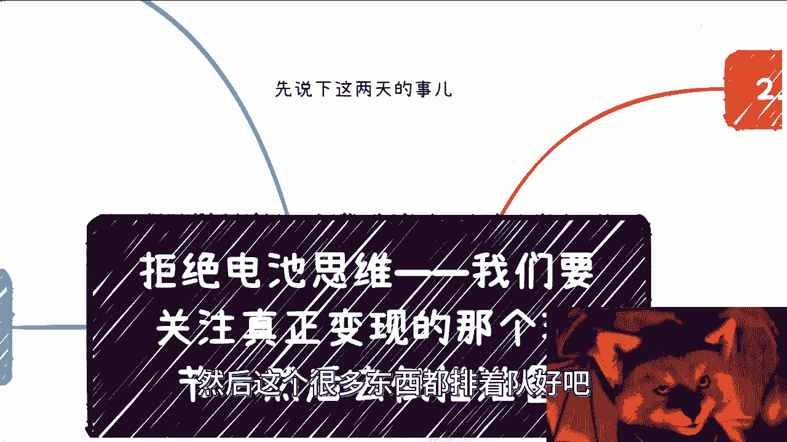
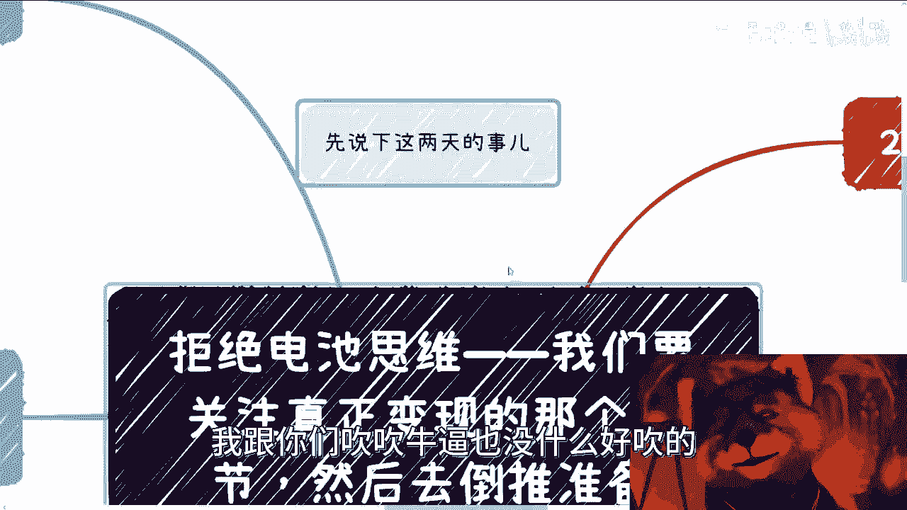
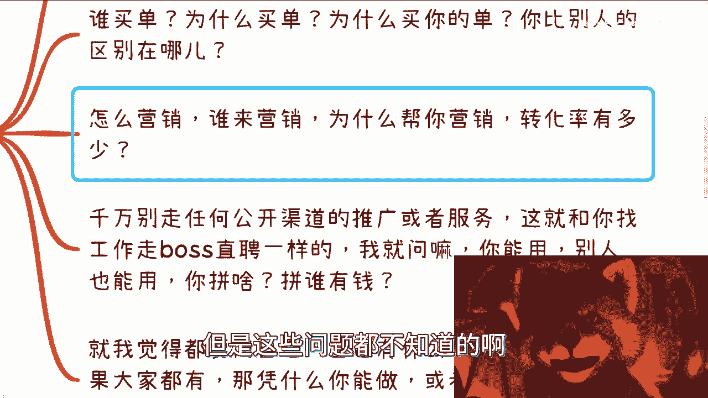
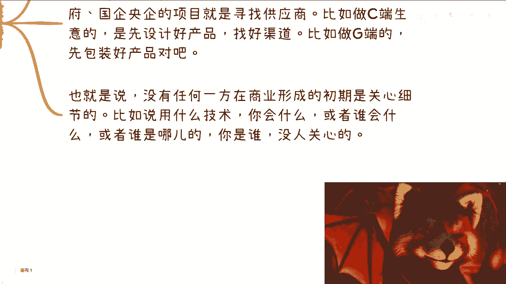
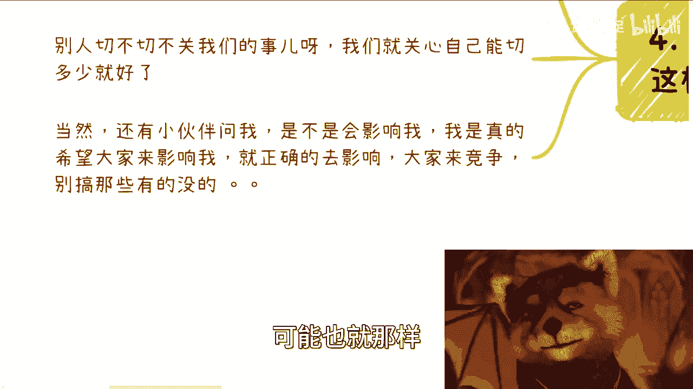
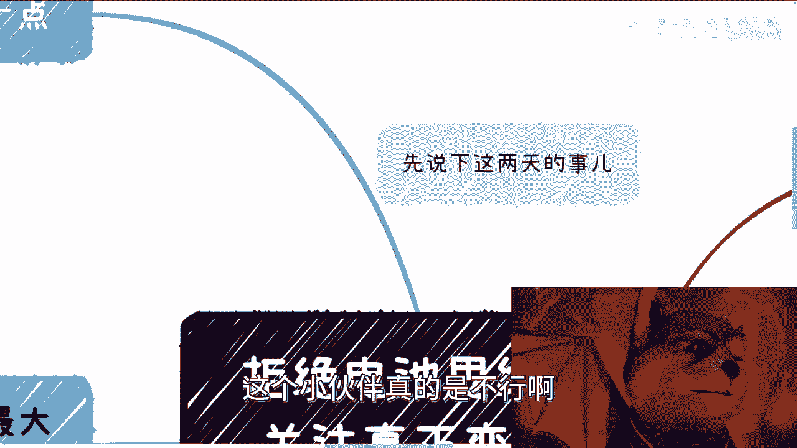

# 课程 P1：拒绝电池思维——我们需要关注真正变现的核心 🔋➡️💰



在本节课中，我们将学习一种关键的商业思维方式：如何避免“电池思维”，即避免盲目投入精力却无法获得回报。我们将重点探讨如何识别并聚焦于商业活动中真正能产生价值的核心环节，并通过“倒推”的方法来规划你的行动。

---



## 概述：什么是“电池思维”？

在与大量咨询者交流后，我发现一个普遍存在的通病。许多人虽然有主业，也想赚更多钱，但最初的思考逻辑就偏离了核心。他们往往只考虑整个商业链条的前端环节，或者干脆什么都不考虑就直接行动。这种盲目投入、不考虑最终回报的思维方式，就像一块“电池”，不断放电却无法为自己充电。

因此，我们需要转变思维，将注意力从“我能做什么”转移到“市场需要什么”以及“钱从哪里来”上。

---

## 核心一：关注变现环节，学会倒推思考


上一节我们提到了“电池思维”的问题，本节中我们来看看正确的思考起点应该是什么。

任何商业活动的核心都是“变现”，即最终谁为你付钱。你的所有准备和努力，都应该围绕这个最终环节展开，并由此进行倒推规划，而不是正向地、按部就班地推进。


以下是几个帮助你定位变现核心的问题：

*   **谁买单？** 明确你的客户或金主是谁。
*   **为什么买单？** 他们有什么需求或痛点？
*   **为什么买你的单？** 你提供了什么独特的价值？
*   **你和别人的区别在哪？** 你的核心竞争力是什么？

**公式：** `商业成功 = 识别买单方 + 满足其需求 + 建立独特优势`

如果一件事你能做，别人也能做，没有门槛，那么赚钱就充满了不确定性。这就好比指望买彩票中奖。

---

## 核心二：理清营销与转化的逻辑



明确了变现的核心问题后，接下来我们需要理清如何到达那个环节。这涉及到营销和转化的具体路径。

很多人产品准备好了，但对如何卖出去一无所知。你必须想清楚以下问题：

*   怎么营销？
*   谁来营销？
*   为什么别人愿意帮你营销？
*   预期的转化率有多少？


你会发现，思考这些问题比纠结产品细节更“离钱近”。产品本身很重要，但让产品触达并打动付费者，是更关键的一步。

---

## 核心三：避开公开渠道的内卷陷阱


在思考营销路径时，一个常见的误区是依赖所有人都能使用的公开渠道。

你需要明白，任何公开平台（如招聘网站、公开广告位）只要你能用，别人也能用。这会导致激烈的竞争，最终往往演变为拼资金、拼资源的“内卷”。对于资源有限的个人或小团队来说，这非常不利。

真正的机会往往存在于非公开渠道，例如：
*   猎头推荐
*   直接联系决策者（HR/合伙人）
*   行业内推
*   私人关系网络

在公开渠道中，优质机会早已被筛选过无数遍。

---

## 核心四：从“市场要什么”出发，而非“我会什么”

这是商业思维中最关键的转变。不要过分关注自己会什么技能、有什么资源。

商业的本质不是“你能做什么”，而是“别人需要什么”。你必须进行市场化思考，即找到目标客户的痛点，然后倒推出你需要提供什么产品或服务。




**代码逻辑类比：**
```python
# 错误思维：从自身资源出发
if i_have_skill_X:
    try_to_sell_X()
else:
    give_up()


# 正确思维：从市场需求出发
target_pain_point = identify_market_needs()
required_solution = design_for_pain_point(target_pain_point)
if not i_have_skills_for(required_solution):
    acquire_skills_or_partners()
execute_solution(required_solution)
```

在商业合作的早期，没有人关心你的技术细节或十年经验。他们只关心：你能帮我解决什么问题？能带来什么价值？因此，你需要先包装好一个能解决市场问题的“产品轮廓”或方案，再去寻找渠道和资源。

---



## 核心五：关于竞争与“割韭菜”的辩证看法




有同学担心，如果大家都学会这种思维，蛋糕会不会被分完？也有人对市场上“割韭菜”的行为感到困惑。

首先，蛋糕的大小是动态的，关键在于你能分到多少。在还没赚到钱时，就过度担忧竞争是杞人忧天。健康的竞争反而能促进行业发展和个人成长。

其次，对于“割韭菜”现象，需要辩证看待。从商业角度看，这本质上是供需关系和认知差价的体现。一方面，如果不采用一些高效的营销手段（可能被视作“割”），确实很难赚钱；另一方面，市场的基本盘决定了，存在大量为认知买单的需求。

这并不意味着你要去做违背价值观的事，而是需要理解这个现实。商业世界不是非黑即白，关键在于找到平衡点：既能有效触达客户、实现价值变现，又能保持自己的底线。

---

## 总结与终极心法

本节课中，我们一起学习了如何拒绝“电池思维”。


核心要点是：**做任何事之前，先花时间思考整个链条中变现的核心点在哪里，然后从这个终点倒推回来规划你的行动。**

商业成功的两大基石是：
1.  **关系**：强大的网络能为你打开非公开的渠道和机会。
2.  **营销**：如果没有现成的关系，那么打造强大的营销能力就是你的“宇宙尽头”。

许多人投入大量时间、金钱完善产品，最终却失败，根本原因就是主次颠倒，没有抓住“变现”这个核心。请记住：**离钱近的思考，比离钱近的行动更重要。**

---
*（注：本教程根据原视频内容整理，去除了口语化语气词，提炼并重组了核心逻辑，旨在为初学者提供清晰的商业思维入门指导。）*