# 拒绝电池思维——接受自己是个普通人（个人成长分享） - P1 - 赏味不足 - BV1wM4y1Y7ev

好啊大家好啊，这个看我，今天大家都说这个小熊猫越来越抽象了，我给你们看一下啊，是不是特别帅，来来来来放大一下，有没有，是不是帅帅成狗，看我这表情对吧啊，这个呀呀呀呀呀，帅的人都不行，好继续来说啊。

就是这个其实大家都比较关心，我是怎么这个一路走过来了是吧，怎么从开发走到今天，其实很多视频呢在拆的时候呢，我也都说过，就是没有一个完整的啊，我是觉得呢大家反正就看看了之后，多多少少也就都知道了。

那么结合我自己的经历啊，我觉得这个也可以讲一下，就是从工作啊，从毕业到现在为止呢，呃有一个过程就是我在不停的在接触，我是一个普通人，我就就这么回事，就是我觉得大家也得不停的接触。

因为你不接受你是没法前进的，你只有接触了才能前进，你知道吧，首先呢就比如说一开始对吧，我在毕业的时候，就我之前也说过，我再说一遍，我在毕业的时候对吧，呃进了第一第一个创业公司，我知道那个创业公司呢。

我的同事让我明白了对吧，一点就是人与人的差距是有天花板跟天赋的，就是我同事让我明白的点，就在于说，无论我多努力，也无论我天赋多高。

不是我这辈子，我可能是下辈子跟下下辈子我也追不上他，就这么简单啊，就大家可以去查对吧，这个id叫l l l y m panda对吧，他是我同事，然后呢我跟他共事了一年多对吧。

简单来讲就是说这个人让我明白了，人与人的差距比人与猪的差距，比人与任何东西差距都要大对吧，然后他会让它让我明白了，就是我是一个垃圾啊，我是一个渣渣，我是一个就是下辈子，哪怕我天赋技能点满。

我都追不上这种这个人的这种感觉，啊首先这是第一点嗯，第二点呢就是说同时从，因为我以前是学计算机的嘛，但是比较垃圾啊，比较垃圾，那从计算机领域角度来讲呢，我觉得我基本上也是卷不过的，就一般人我都卷不过。

很正常啊，我觉得很正常，就所有人都一样嘛，就一般人都卷不过，对吧，然后普通人嘛对吧，就就是普通人，就大家说我们这个各种各样有各种各样的问题，那么从工作一年角度，就工作一年左右呢。

我就开始寻求外部的切入点了，为什么呢，因为我知道我卷不过对吧，你要不是因为我在这家创业公司，我去别的公司根本没人要我，你知道吗，就我都试过的，然后就是我得去想啊，我得去做，就是选择一个细分点对吧。

细分领域我自己有护城河的，或者说我自己有一找到自己，处于一自己的一席之地对吧，我不是说要赚多少钱啊，而是说得要有一个方向嘛对吧，因为我知道工作这个方向，我在一年的时候我就知道我不行对吧，就这么简单。

那么第三个呢就是说呃，然后呢我就去做了各种活动，因为我也一直跟大家说嘛，就是我所分享给你们的，一定都是我自己经历过的。

也都是我自己做过的啊，我自己没有经历过，有没有做过，不会跟你们这么讲的啊，我做活动，做小活动差不多做了有半年大半年，应该说然后做了之后就变成做大会，然后你问我大会嘉宾哪里来呢，其实很简单。

就是我以前做活动积累下来的，就是很多阿猫阿狗对吧，这个三教九流很正常的，就我这么跟你们讲吧，就是因为你们对我不了解嘛，所以说我这么跟你们讲，就是我的上限没有你们想的那么高。

但我的底线也比你们想的要低的多对吧，就这么简单啊，那么各种活动积累下来，那就说名和利对吧，留给我自己对吧，也就是说我们得过去积累这些东西。

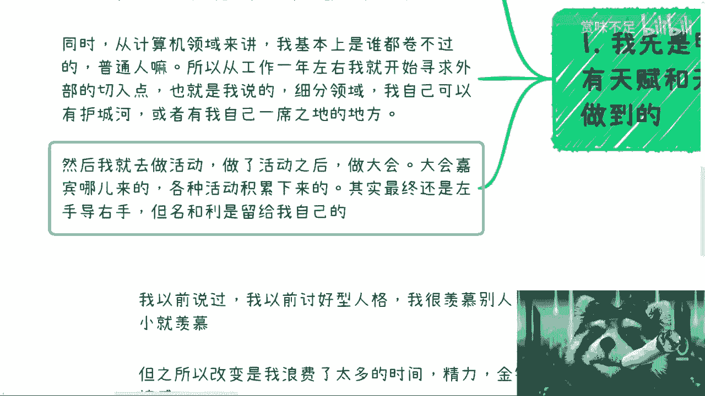

啊那么这个是第一点啊，第二点呢就是说呃我接着明白呢一点是什么呢，就是啊就又又又又开始自我，这个叫什么就反思，你知道吗，就让我意识到，就是说这个内容的包装比我是谁啊，比我技术如何要重要得多。

就这点上面我就又不得不承认我是个普通人，为什么呢，因为我的确没有这种天赋啊。

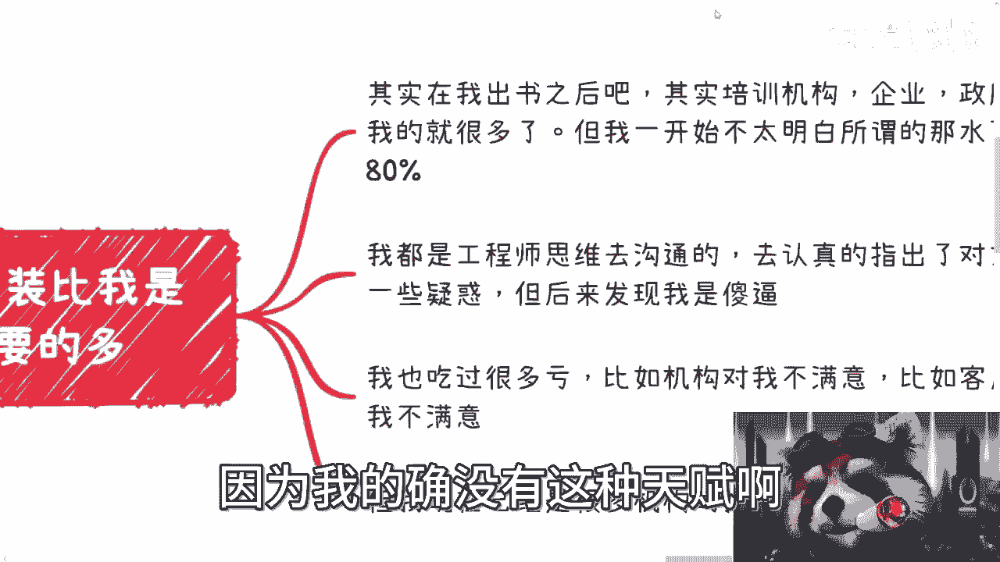

你但凡我有这种天赋，我也不可能就是说啊因因为踩了坑对吧，因为撞了南墙，然后再来改变，那我早就就如果我很聪明，我一开始就意识到来了，我还需要去撞墙干什么。

对不对啊，就是在我当时出书之后对吧，就是其实培训机构啊。

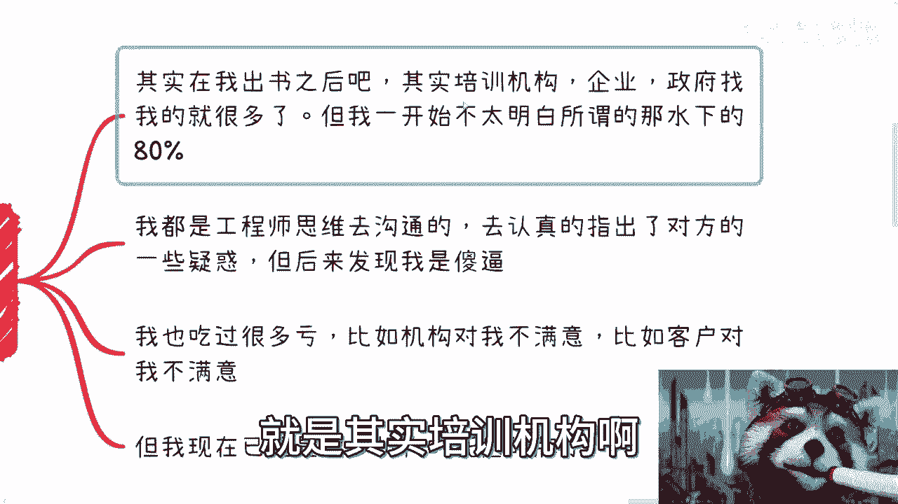

政府企业找我就很多了啊，但是一开始我的确不明白。

所谓的那水下80%什么意思呢，就是说很多当时机构跟企业找我的时候。

就大家一般，一般一开始会开一个这种电话会议啊，我跟你们讲，我就是工程师思维，就我很傻呀，就是说我会很认真的跟大家去说，比如说啊举个例子，他让我去培训这个计算机前端啊，然后呢我就会很傻的跟他说。

唉你们这个内容上面有哪些欠缺的啊，就是我大概能讲什么，我不能讲什么对吧，就是就是就跟我面试一样的，人家我玩这个东西，陈老师你懂不懂啊，哦我不太懂这个东西，我做过，但你让我懂吧，哎呀不是特别懂对吧。

这样然后呢我会去认真地指出对方的一些疑惑，我也会很如实的回答，就是说客户的一些问题，你知道吗，就是一般是三方会议嘛，就是客户机构，我嘛对吧好，然后啊我跟你们说，就是我这么跟你们讲吧。

就是商业这个逻辑上面人家不会来跟你讲的，就比如说啊就是今天我跟你们合作，你们但凡让我觉得你们是对吧，我也许会跟你们说你们是，但是大部分的商业战场上面，别人不会跟你们讲的，就是别人只有一个行为。

不合作就结束了，就就当自己就吃亏了，你知道吧，然后我其实当时就是的，就是有很多一些机构找我之后，就没有再找过我，第二次，为什么，因为我是啊，我的确是，为什么，因为我的这种沟通方式。

不是会让这件事情变得更好，只会让这个商业单子跳单，或者只会让这个单子miss掉，你们明白吗，因为机构之所以找我，是因为他们想赚这笔钱，而客户跟我沟通，其实只是只说白了只是走一个形式哦。

那么我这么真诚的去沟通，其实我就是，为什么，因为我好像在那边说，哎呀我这个事情我的确不懂，我也不想吹对吧，哎呀，我好像也觉得，我希望就是说我经常去给别人做培训了，我也希望别人能够得到。

真正的就是说啊这种这种学习到东西，你知道吗，到后来我发现并不是啊，但是人家都不关心的，就是企业，只不过是因为有这种有这笔费用要用掉对吧，机构只不过是想赚这笔费用，我只不过是个工具人，但是由于我的。

让这个单子最后不成，那我不是，是什么，对不对，但是这个事情别人不会跟我讲。

你知道吧，就没有人会未来指出，就我相当于是损失了很多的case，我相当于是唉我相当于是让别人觉得，让很多人觉得我是之后，我才意识到原来我是个。

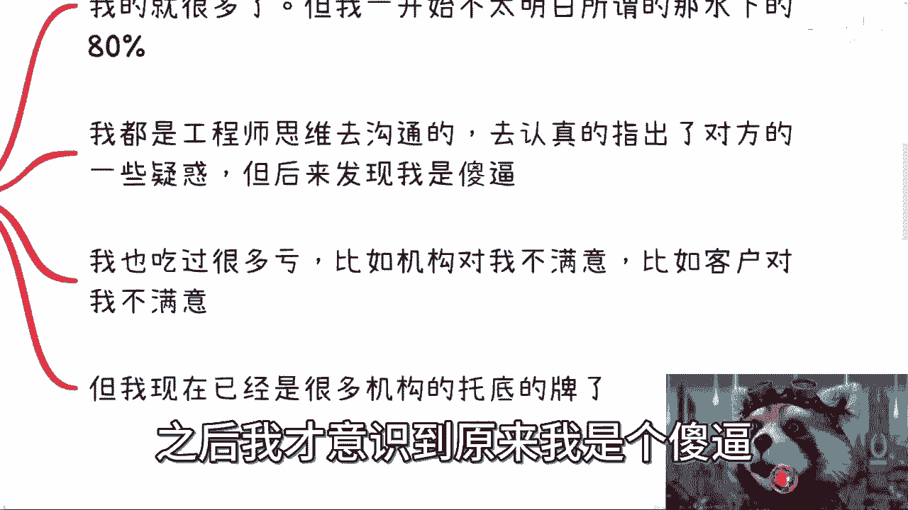

你知道吧，就是说我也是吃过很多亏哦，包括机构不对我不满意，包括客户对我不满意，很多很多，对吧，那你说你说我天生就是这样的吗，不是啊对吧，我为什么一直跟你们说，要改改变工程师思维，要改变细节思维。

就是这样子的，因为商业跟你的很多时候逻辑他完全是不同的，它完全就是两个平行世界，而且别人不会跟你讲，你知道吗啊。

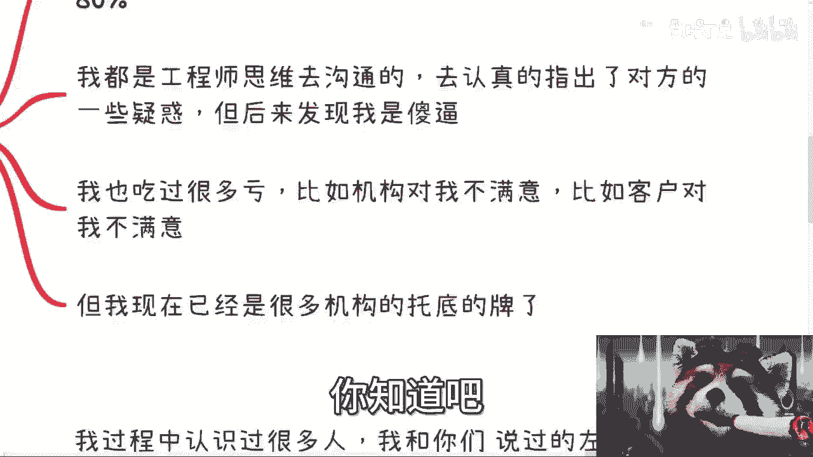

所以说呢就是说这个事情都是我经历过很多次。

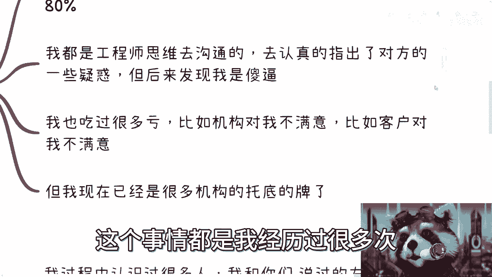

很多次之后啊，才那个，所以说呢我现在已经不一样，知道我现在就老牛逼了，我现在已经是很多机构都托底的了，你知道吧，就是就是曾经是这样子，大概220年还是201年，当时北京联通总部做过一次培训。

卧槽老牛逼了，你知道吗，就是当时是一个老师，现在那边讲了半天，到大概一共三天啊，到第一天中午人家领导就发话了，他说不行，要改，他说这个老师我们不满意，然后那机构就没办法了，你知道吗。

那机构就直接打电话给我，他说陈老师，你现在就坐高铁过来，你要么就坐飞机过来了，反正你现在怎么快怎么来，卧槽我都震惊了，你知道吗，就啊还能这样子的哦，那来呗，是不是就是我这么跟你们讲吧，就是说你要讲内容。

我绝对不是最好的啊，你要讲所谓的就是说技术核心，我绝对也不是最好的对吧，你要讲各个硬性条件，什么院士啊或者头衔啊，我也没有对吧，但是有一点我觉得我对于机构来讲是最好的，是什么，就是我随便去讲什么东西。

对方不可能对我不满意，为什么，因为我清楚对方要什么就这么简单，这跟是什么技术，这跟是什么方向完全没有关系，你们明白这个道理，就好像我记得有一次直播的时候，还有人问我，他说哎唱啥啊。

那你这个一般你这个就平时看什么书对吧，怎么准备的，我说准备啊，很简单的，你告诉我一个方向，你但凡只要给我3~5个小时，我立马就能给你做个PPT出来，不用我懂啊，我有什么我懂不懂不重要啊。

重要的是我知道怎么把这个东西讲出来，让对方觉得他们学到东西就可以了，结束了呀，这就是我的能力啊。

这就是我现在所学到的东西，就这么简单，对不对。

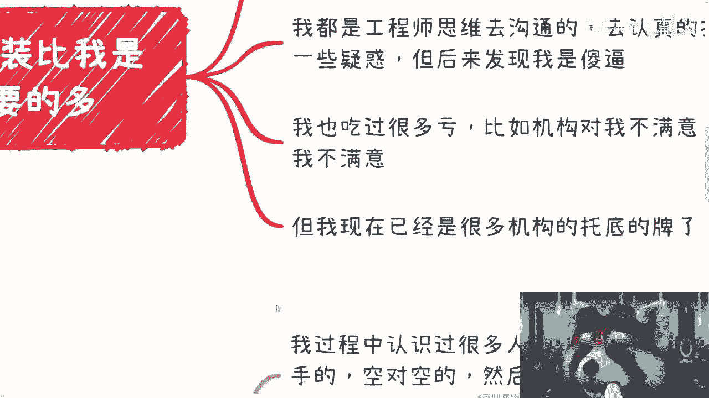

对吧，这第二点第三点，然后呢我又明白了啊。

就是我变不成某一类人，这就是我又再次跟自己妥协对吧。

明白了，我是个普通人，比如说什么呢，我在商业过程当中，我认识了很多人，我跟你们说，我跟你们说过的左手套右手空对空对吧，包括所谓的纯营销赚钱。

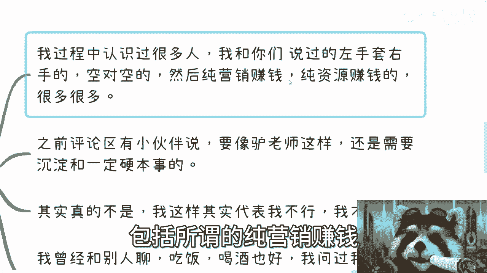

纯资源赚钱很多很多对吧，我跟你们说，你们很多人做不到也是很正常的，也很正常，因为这个东西的确是怎么说呢，跟人有关啊，而且就是说嗯你要去改变，你要去怎么样。

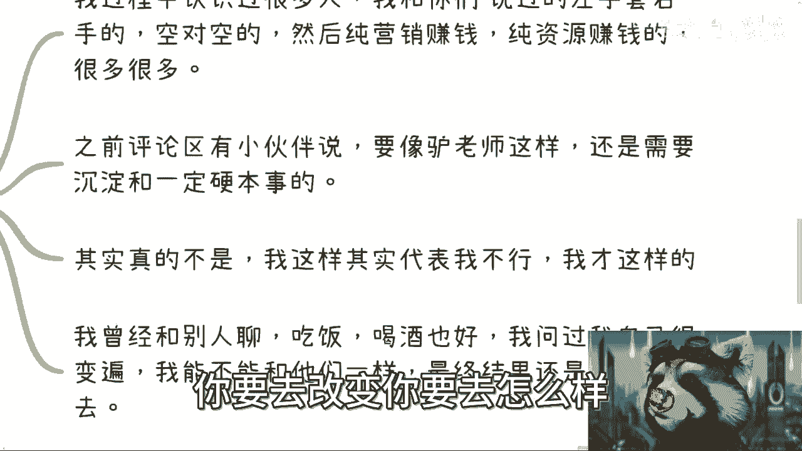

我觉得蛮难的，之前还有个评论区，有小伙伴当时我就这么说过，他说要像吕老师这样，还是需要有沉淀跟一定硬本事的，我跟你们说啊，这句话说的其实就说实话，我知道他什么意思，但是我听了有种就是说有点哭笑不得。

你知道为什么吗，因为其实真不是，你知道吧，就是我这样是代表我不行，我才这样，你们明白这个意思，就是但凡我行，我就不用这样了，我讲什么课啊，是不是我做什么教材啊，是不是啊，我我去做什么咨询啊。

就这么浪费时间吗，我他妈空对空赚钱不香吗。

是不是就代表我不行，你知道吗，不是说要有沉淀跟硬本事。

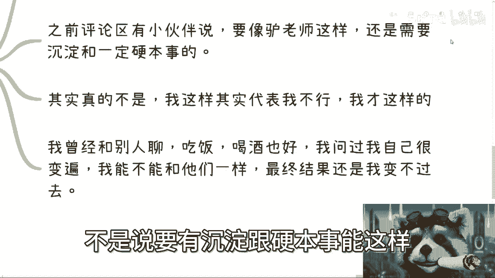

能这样，那只是代表我不行啊，就是我曾经跟这些纯吃资源的对吧。

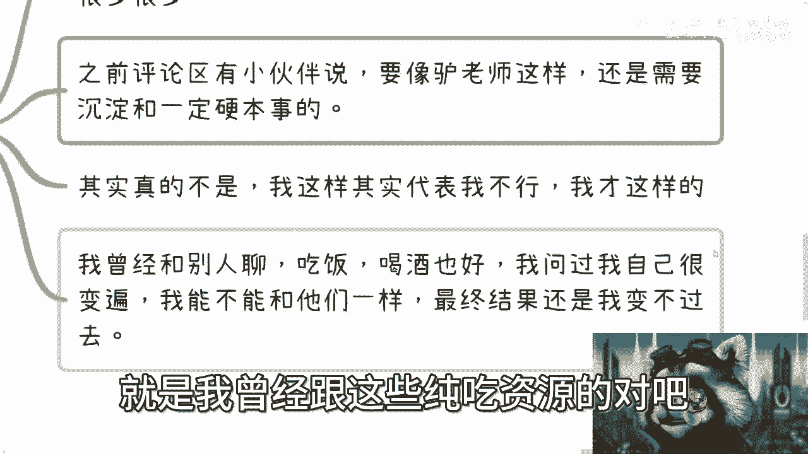

纯纯空对空的纯画饼的人，我是吃过无数次饭，喝过无数次酒对吧，我说过诶，这里写错了，对吧就是说我一边跟他们沟通，一边聊，我就一边在问自己，我能不能变成他们这样子对吧，就包括你说卖GBT的对吧。

就上来什么卖个两三千对吧，就直接卖或者做知识星球的，我就问我能不能跟他们一样，最终结果是我不我变不过去啊，我承认我不能变成他们这样子呀，对不对，你就像你们很多人也跟我说，爱陈老师开个知识星球。

我不开的原因是什么，我开了肯定要被骂对吧，但是我不想也不是我不想被骂，你被骂我被骂很正常，对不对，但是我不想做这种东西，被骂就做这个东西，我我对我来讲，我想这就是我想不出来对我的价值在什么地方。

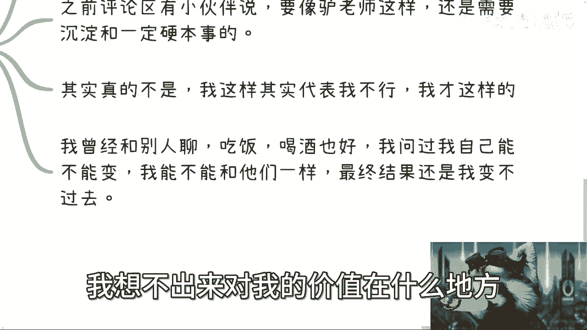

对吧是吧，就是说就是说我承认在这个事情当中啊。

我没法就变成他们这样子，也就是说我自我的和解，我也明白了，我是一个普通人对吧，或者说我我我没有办法变成一个纯纯的。

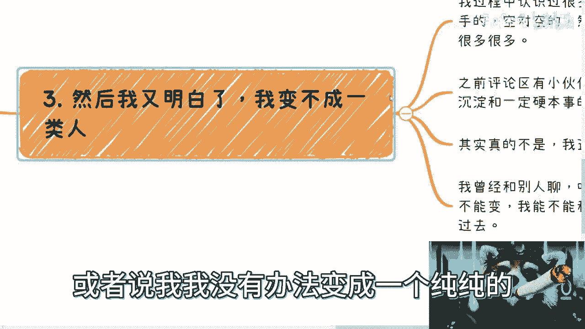

就是说商业化的对吧，或者黑化的这么一个人。

那没办法，否则我今天也不会给你们这边做视频，是不是啊，那么第四个呢就接接触就物不以物喜。

不以己悲，然后在以前视频里面我也说过，我以前是和一个很讨好型人格比，你们不知道讨好型多少多少未来啊，就就高情商叫做讨好型，低情商就是跪舔对吧，唉我从小羡慕别人很正常。

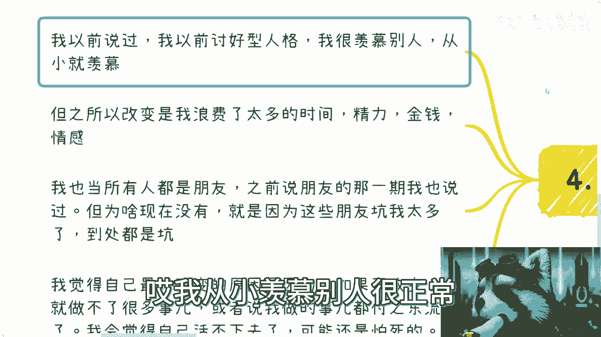

每个人谁没有这么这么一个过去，是不是啊，但我之所以改变，是因为我自己觉得我是在浪费太多时间了，就是我可能有我的很强的目的性，就是我希望能有成就，我希望能赚到钱，对啊，就是我肯定有很长的驱动力。

然后我就在那边想，就说我到底有哪些东西是我改的了的，就是我愿意去改的，你比如说像用知识星球，用别人去割对吧，我不愿意，对不对，啊别跟我来谈，就是说什么啊，什么叫做啊拖不拖长衫的问题，其实这个不是真不是。

这个就是从我的这个这个做人的底线和，做人的这个这个叫什么，就是感受上来讲，我不愿意我就不愿意。

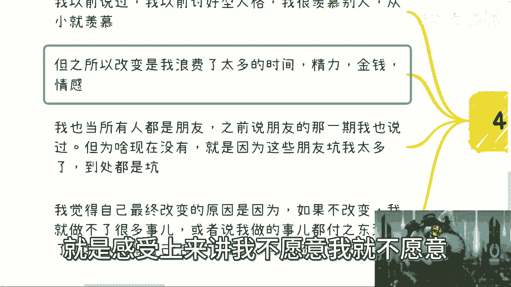

对不对，但是有些东西我是愿意的，你就比如说我为什么要去在乎别人的眼光，我为什么要去讨好别人，对吧，我为什么要去羡慕别人，别人有的又又不是我有的。

我去羡慕别人有什么用呢，没有用，对不对，但是这个事情不是一时半会能改变的对吧。

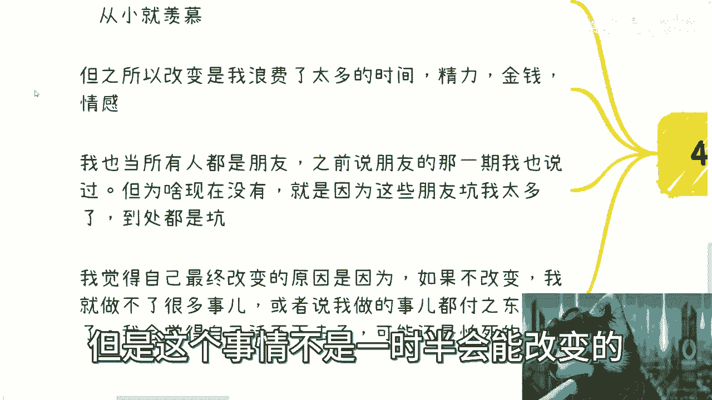

包括我的讨好型人格，也会让我就是就是觉得很多人都是朋友嘛，之前那你们去搜朋友这个关键字，之前有一期我也特别讲过对吧，但是为什么现在没有了，就是因为这些朋友坑我太多了，到处都是坑对吧，有造谣的，有坑钱的。

有有有有，还要想想办法把我送进去的多啦，都他妈是朋友，你知道吗，还有那种做安利的，想从我这边割的，做保险的，想从我哥那边割的多了去了对吧，你就是就是我把他们当朋友，他们只把我当韭菜，你就这么简单嘛。

是不是。

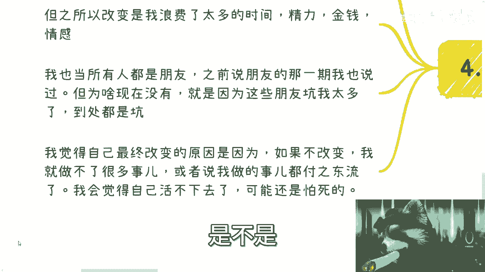

所以我觉得我最终改变的原因是什么呢，是因为如果我不改变对吧，我就做不了我想做的事情，或者我做不了，我做事情，我已经付出的努力就付就付之东流，付付之东流了，对就相当于我自己这个前面做了很多的铺垫。

做了很多努力，好到最后一文不值对吧，那我会觉得我对不起我自己，我会觉得我自己活不下去对吧，那那可能我还是我怕死，是不是就就我觉得这个东西改变不了，我没法往下做，没法往下走。

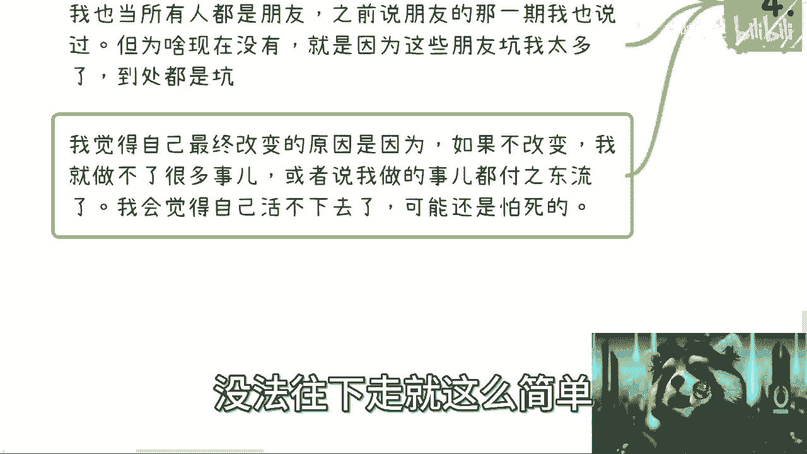

就这么简单，这不是说工不工作问题，就是就是无论做什么都做不下去。

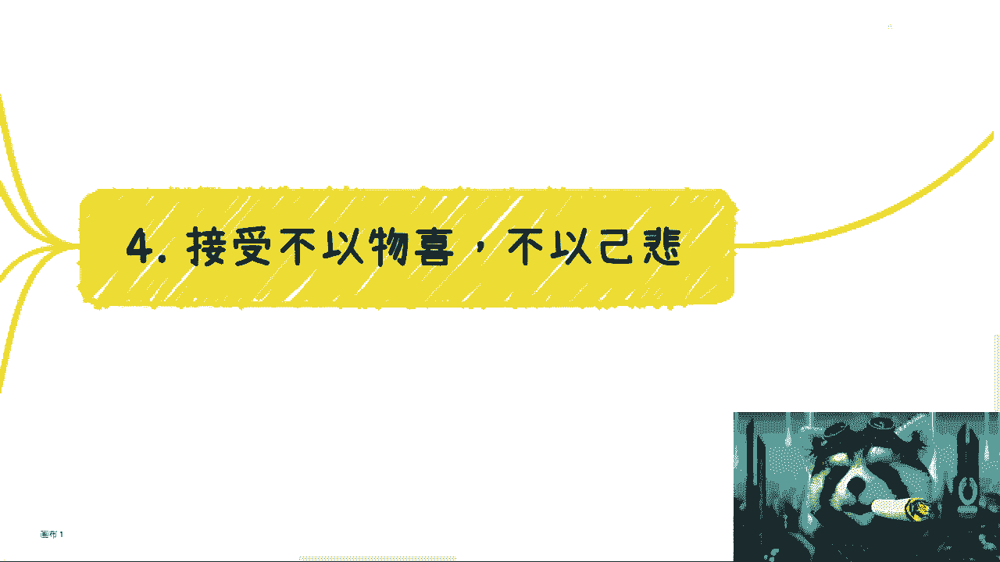

对吧，然后我们看看啊。

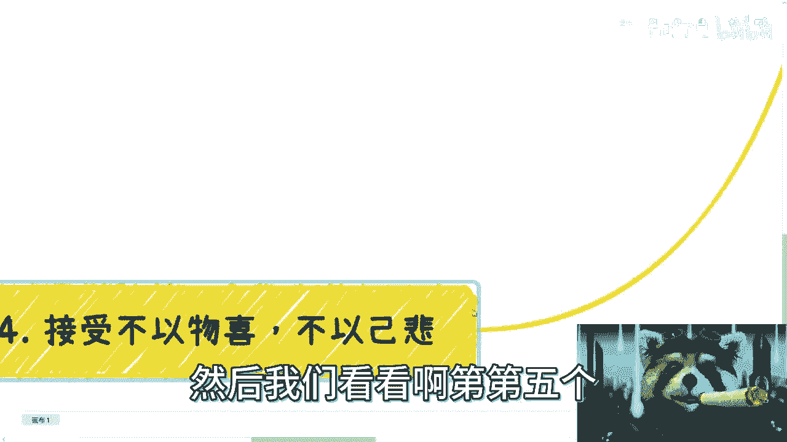

第第五个，所以呢我们来说说评论区啊，评论区呢其实到现在为止呢。

非常多的小伙伴啊说啊，我们有各种各样的问题，我跟你们讲，人类社会本来就这么分层的对吧，人家以前说八二开，说象牙塔，说说北京折叠对吧，我们很多人都会这样，就是都会说自己这样不行，那样不行。

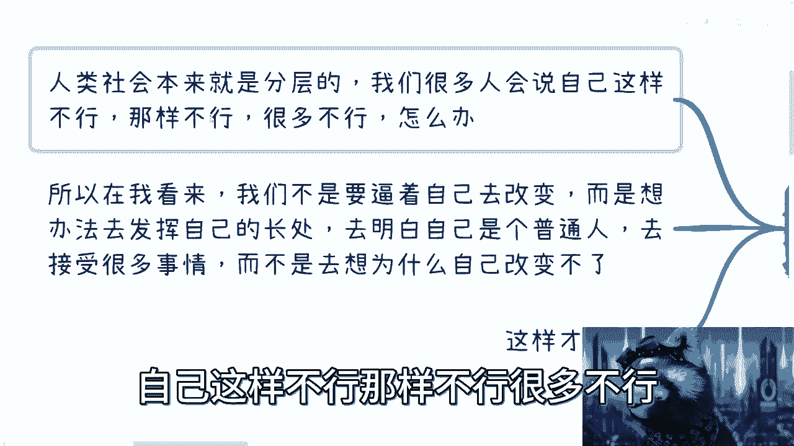

很多不行，怎么办，我跟你说啊，其实你接受自己是个普通人的。

这个最核心的点在哪里呢，就是你不是要去逼着你去改变，而是你要想办法去发挥你自己的长处，你就拿我来讲，我觉得我的长处在哪里，我觉得我第一我不是那种循规蹈矩的，我不是出生于那种什么呃什么很很牛逼的世家。

或者我很呃好像从小受到良好教育没有的，那就是我觉得我不是一个那种说啊，这个接受不了很很就是那种三教九流对吧，或者很低俗或者很很怎么样的手段东西，我没有接受不了，我能接受所有的东西对吧。

然后同样的我觉得我我性格也还OK，我不是非常内向对吧，那我就要去想办法发挥你这些长处，你把你的长处挖到极致对吧，然后你去明白自己是个普通人，去接触很多事情。

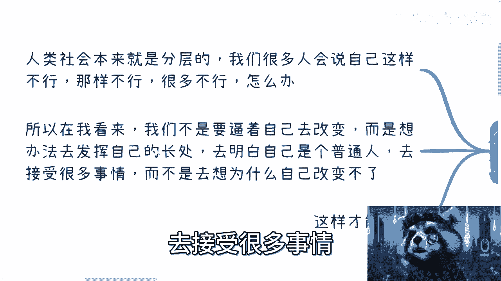

而不是在那边想着说为什么自己改变不了，因为我跟你们说。

我曾经因为这个事情，那我曾经因为这个事情。

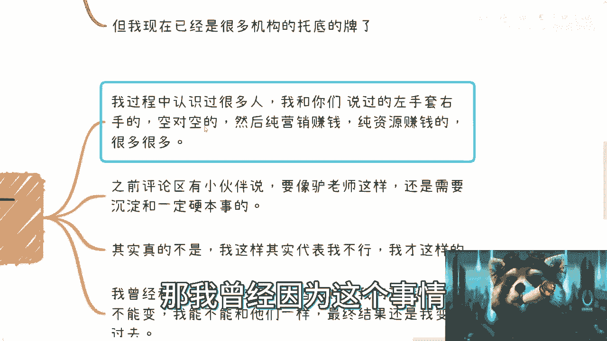

我其实内耗过很久，就是我就在那边想，就是我的努力有什么意义，就是我我再努力，我也这个赚钱的效率没他们快，我再努力，我也我设计的面有没有他们广，我再努力，我可能有没有他们，来了来了来来了，这么轻松对吧。

我曾经内耗很久，我就在那边想，我努力有什么意义，我干嘛要去做对吧，但是你后来想想没有意义啊，就是你去纠结这件事情没有意义啊，因为你在那边思考了，纠结了很久，内耗了很久，我你反过去。

你让我现在回过头去想想啊，我除了浪费我的时间，我除了在那边，就是你明明可以做很多事情，你在那边还否定自己的价值。

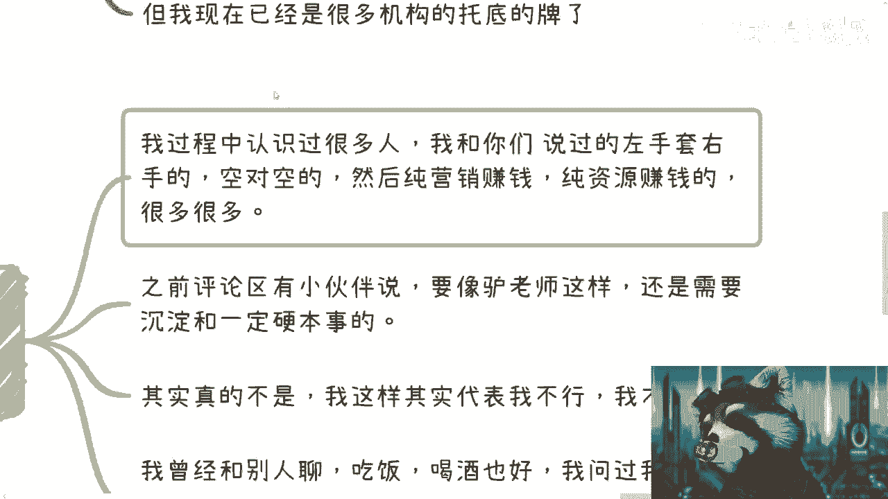

然后呢你得到了什么呢，没有nothing，对不对。

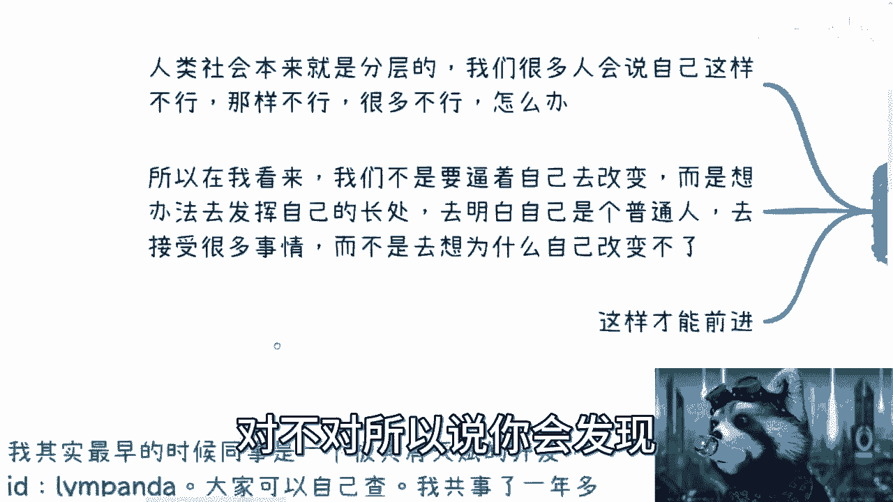

所以说你会发现，就是说我们只有接受自己是个普通人，然后不要去逼着硬逼着自己去抢改变，因为我跟你们说，但凡很多人咨询我过我的人，我都会补给他们补一句话的，我说我给你们的只是建议。

并不代表你们一定要往这方面走，因为很多时候你们不要硬把自己硬逼着，往这方面走，你们可以只是说去想着啊，世界上有这么一种方式，或者世界上有这些赚钱的模式或者事业上啊，很多人是这样的。

但是并不代表自己要变成这样对吧。

就你有一部分就像我更新给你们列的，有一部分我觉得我愿意改，是因为我觉得这个的确是我这个要改我的短板，但是有一些我不愿意改，为什么，就是因为我觉得这不是我，我就是做不了啊。

这就是DNA里面克制就是这个样子，对不对，所以我觉得是这样子的，为什么我放在拒绝电池思维里面，是因为我是觉得拒绝电池思维的最大前提，就是说你对自己要有个正确的认知对吧，因为很多人不知道往什么方向走。

是因为不知道自己要什么，但是你你你虽然不知道自己要什么，但是你肯定会知道自己欠缺什么对吧，或者说自己有哪些短板对吧，那么这个时候你要这么想，就是别老想着看外界，别老想着看自己，不对的，就是短短板的地方。

想办法把你们的长处发挥到极致，也不一定一定要有什么技术，很强的技术能力，或者怎么样对吧，你比如说今天我跟你们讲了过程就这个样子，有有什么很大不了的东西吗，也没有呀，而且我们在过程当中。

本来就是一边一边去摸商业，一边学习的，你说我到现在这个讲数字经济讲很多东西，我以前不懂的呀，那还不是一边做一边学吗，那学那你你说这种东西越性的东西，有网上资料给我们有没有呀，对了。

那还不是这边东找找西找找，然后自己总结不就这个样子的吗，对不来了行吧，嗯就这么着吧好吧。