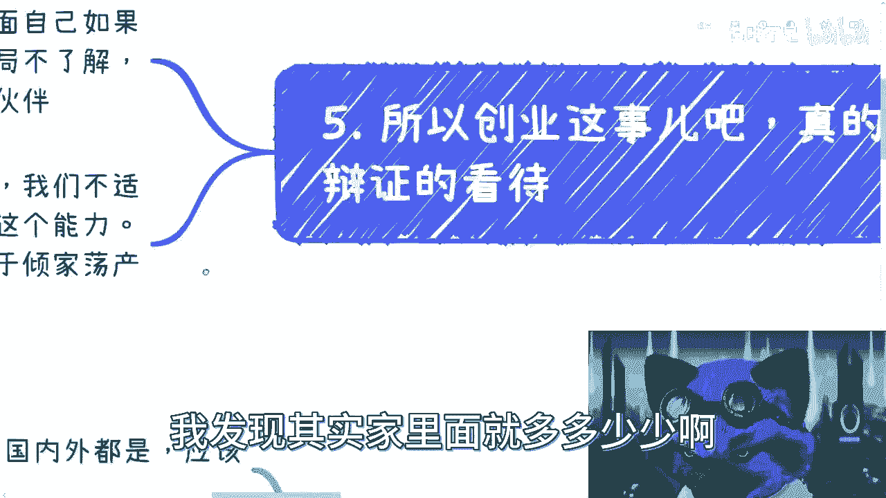

# 创业避坑指南：为什么普通人不要轻易创业？ - 课程01 🚫

在本节课中，我们将要学习当前环境下创业的真实面貌。我们将分析为什么对于大多数普通人而言，创业是一条高风险且不推荐的道路，并拆解创业成功背后的核心要素，帮助你建立更现实的商业认知。

## 概述：当前创业环境的严峻现实

我们一直强调“不要创业”，就像《三体》中的“不要回答”一样。但之前并未正面阐述原因。本节将明确说明：如果你家里没有雄厚的资本或过硬的关系，就不要去创业。无论别人把前景描述得多么美好，都不要去做，因为你大概率不具备相应的能力。

## 第一节：当前创业面临的三大核心困境

上一节我们概述了基本观点，本节中我们来看看当前创业环境具体面临哪些困难。

以下是当前创业者面临的三个主要困境：

1.  **融资极其困难**：近一两年，无论国内还是国外，寻找投资都变得异常艰难。这不是某个阶层或学历人群的特有问题，而是普遍现象。无论背景多么优秀，融资难度都一样大。

2.  **投资条款收紧，对赌协议失效**：前些年流行风险投资和对赌协议。对赌协议指投资方要求创业者在规定时间内达成特定目标（如营收、用户数），若未达成则需连本带利偿还投资。但近年来，连对赌协议都没人敢签了，因为投资方明白，即便签了，创业者失败后也无力偿还，法律诉讼意义不大。

3.  **互联网与实体经济双双遇冷**：互联网创业变得困难，这说明“虚”的、水分大的项目很难存活。当互联网都难做时，实体经济就更不用说了。实体创业一直都很艰难。目前，只有部分消费降级类或现金流短平快的项目尚有机会，但这些机会也严重依赖于你是否拥有资本或关系。

## 第二节：投资人的心态与评估逻辑

了解了宏观困境后，我们来看看微观层面——投资人是如何评估项目的。他们的思维逻辑发生了根本转变。

从投资人的角度看，评估创业项目的逻辑如下：

*   **核心是盈利能力**：过去看重团队背景、名人站台。现在这些都没用。核心问题是：项目能不能赚钱？能多快赚钱？投资人的诉求非常直接：投入100万，能否在半年内收回200万？如果不能，免谈。
*   **关注退出路径与资本运作**：投资人要么寻找热点或可炒作的项目，目的是进行资本运作。即通过早期投入（如天使轮），在后续轮次（如A轮、B轮）中高价退出。他们会评估你的关系网络中，是否有后续资本愿意接盘。如果没有清晰的退出路径，他们不会投资。
*   **要求确定性的商业关系**：商业世界只有0和1，没有中间状态。你必须拥有非常直接的政府关系或客户关系，并且这些关系必须能落实到**白纸黑字的合同**上。任何口头承诺、感觉良好的“关系”在投资人眼里都等于零。商业闭环的每个环节（客户来源、收入、成本）都需要合同确认。

**举例说明**：一个医疗创业项目需要背书。仅仅认识院长或卫健委的人不够。必须确认这些人能否带来具体的病例（Case），合同金额多少，回款周期多长，你的成本多少。所有这些都需要签订合同。否则，所谓的“关系”和“背书”毫无价值。

## 第三节：什么样的情况下可以考虑创业？

在认清现实和投资逻辑后，如果仍想尝试，那么只有在以下**极其确定**的情况下，才值得考虑全职创业。

以下是几种相对可行的创业方向前提：

1.  **降维打击的消费项目**：例如，在下沉市场提供单价极低（如三四元的咖啡、四五元的小吃）的产品或服务。但这需要大量初始投资来“烧钱”打开市场，没有投资做不了。
2.  **用户流量和付费方极度确定**：你非常清楚你的客户从哪里来，谁会付钱，回款周期也明确。在这种情况下，你甚至可能不需要外部投资，其收益确定性远高于打工。**公式：确定性收入 > 稳定工资 + 创业风险**。
3.  **拥有固定的政府（G）或企业（B）客户**：你拥有确定的、按季度/月度/年度签订的客户合同，回款金额和时间都明确无误。用几年时间服务好这些客户，积累经验和口碑，未来有望厚积薄发。
4.  **瞄准未来明确的趋势赛道**：需要你自己深入研究，找到未来有潜力的细分领域。

**重要提示**：网络上宣称“轻松月入过万”的自媒体、知识付费等项目，绝大多数不靠谱。因为它们无法解决你的核心问题：**不确定的流量来源和付费客户**。你的商业闭环无法形成。

## 第四节：关于创业的常见错觉与陷阱

除了客观条件，许多人在主观认知上也存在误区。本节我们来剖析这些错觉，避免掉入思维陷阱。

关于创业，人们常有以下几种错觉：

*   **轻信“小成本高回报”故事**：你可能对大额投资赚钱的故事不屑一顾，但容易相信“投入2万学习，之后月入2万”这类宣传。无论听起来多假，依然会有人心动。这是人性弱点。
*   **误将“秀肌肉”当实力**：商业中充满包装。别人展示的（尤其是社交媒体上）往往是最好的一面，甚至被放大五到十倍。例如，一个只有20人参加的活动，可能被宣传为“影响了上千人”。总看这些会让你焦虑和嫉妒，却对你的成功毫无帮助。
*   **高估“人脉”活动价值**：认为读MBA、参加行业大会、进入大公司就能积累优质人脉。这就像告诉你“买彩票有机会中五亿”——理论上有机会，但概率极低。这些商业活动本身的目的就是招生或营销。你认识的人大多只会躺在通讯录里，无法转化为实际商业价值。`花费数十万换来的可能只是一个“僵尸人脉库”`。
*   **用少数成功案例概括全局**：世界上95%的事件（尤其是失败案例）是不为人知的。我们不能用看到的5%的光鲜成功案例，来想象整个创业生态，并认为那是“接地气”的现实。

## 总结与行动建议

本节课中我们一起学习了当前创业环境的严峻性、投资人的现实逻辑、可行的创业前提以及常见的认知陷阱。

总结来说，创业绝非易事，它极度依赖资本、关系、确定的商业闭环以及个人天赋（往往来自家庭经商环境的耳濡目染）。对于绝大多数没有特殊背景和资源的普通人，创业失败是注定的结局。

**最后的建议**：
1.  认清自己：我们大多数人是普通人，不适合创业。
2.  盘点资源：请冷静盘点和梳理你手头真正的资源：**技能、确定的关系、可变现的资产**。
3.  寻求理性分析：你手中有些牌可能自己觉得没用实则珍贵，有些觉得有用实则不然。这需要借助外部视角进行理性分析。

（注：原文末尾提及的直播预约与咨询服务信息，与本教程核心内容无关，在此不予保留。）