# 拒绝电池思维--看书阅读到底有没有用---P1---赏味不足---BV1dk4y1H72s

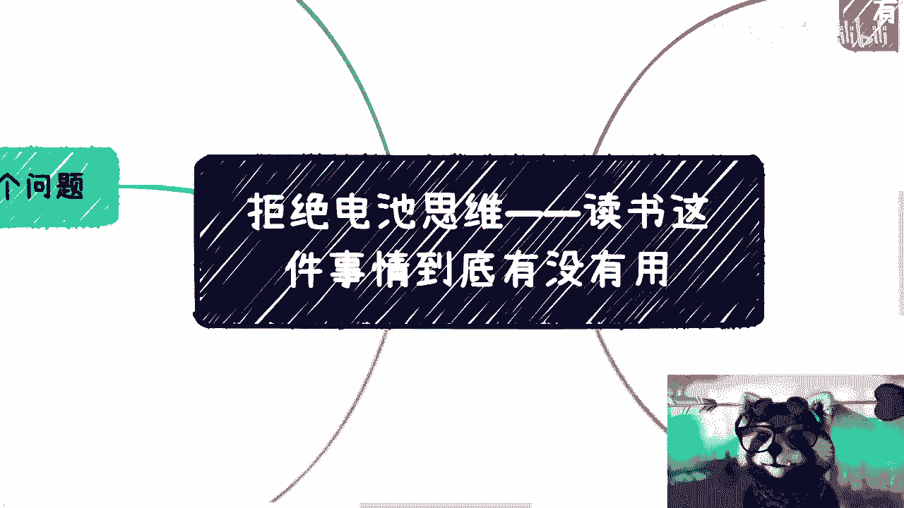

在本节课中，我们将探讨一个普遍的问题：毕业后的阅读（尤其是商业类书籍）究竟有没有用。我们将分析人们读书的动机、常见的误区，并揭示在商业社会中，阅读与变现之间的真实关系。

---

## 为什么我们想要读书？🤔

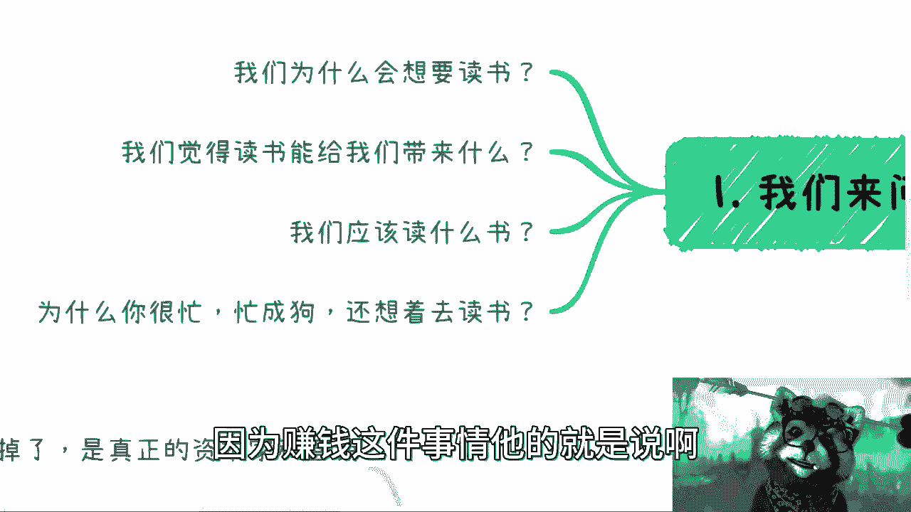

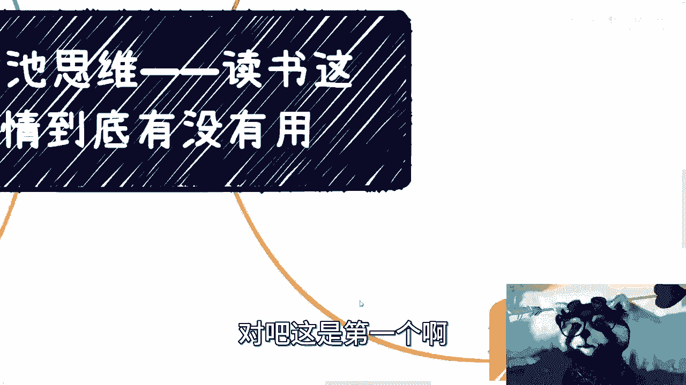

上一节我们提出了课程的核心问题，本节中我们来看看人们读书的初衷。毕业之后，许多人选择读书，通常出于以下几种原因：

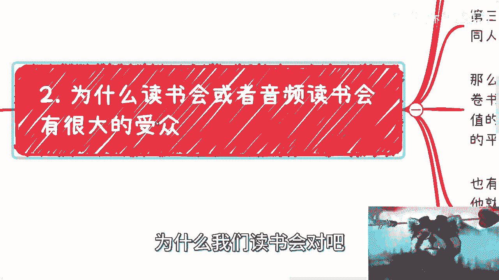

以下是几个关键问题：
1.  **为什么想要读书？** 很多人希望通过读书提升自己。
2.  **读书能带来什么？** 常见的期望是获取知识、获得内心平静或心理安慰。
3.  **应该读什么书？** 这是一个关于选择方向的问题。
4.  **为什么忙碌时还想读书？** 在996、007的工作节奏下，为何不选择娱乐，而是选择读书？

首先，我们需要尊重自己的时间，并认识到时间的价值。如果一个人总是在内耗，为无关紧要的事情烦恼，本质上就是不尊重自己的时间。没有这种尊重，就更难谈及赚钱，因为挣钱需要高度的自律性。

**核心公式：时间价值 = 自律性 × 目标导向**

---

## 读书会的商业逻辑与个人误区 💸

上一节我们探讨了读书的初衷，本节中我们来看看一种流行的读书形式——读书会或听书平台。为什么它们有巨大的市场？这背后反映了哪些个人和商业上的问题？

以下是三个主要原因：
1.  **自驱力不足**：许多人花钱报班或加入读书会，实质是购买一种“被督促”的感觉。他们需要外部力量来推动自己，但这往往无法带来实质性的成长或收益。
2.  **用“听过”代替“读过”**：因为忙碌，有些人选择听书或看别人的读后感，并认为这等同于自己读过了。这就像买了游戏却不玩，认为“拥有即体验”。
3.  **追求“大锅饭”式的集体感**：一些人享受在群体中学习的感觉，即使群里可能大部分是“托”。他们希望快速获取书籍精华，并看到不同人的观点。

然而，从商业角度看，这些行为对个人的价值存疑。读书的核心目的如果无法与**变现**或解决实际问题结合，其意义就大打折扣。在生存压力巨大的当下，精神追求对于尚未实现财务自由的普通人而言是奢侈的。

**核心逻辑：阅读价值 ∝ 变现能力 / 认知水平**

---

## 成年后阅读的真正难点与出版业的现实 🧐

上一节我们分析了读书会的误区，本节中我们深入探讨：成年后的阅读到底有没有用？难点在哪里？

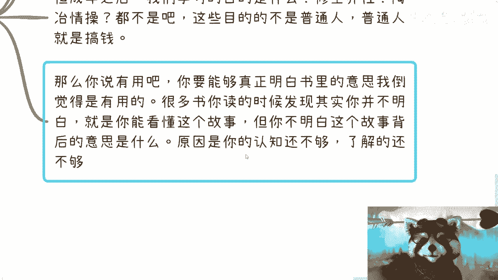

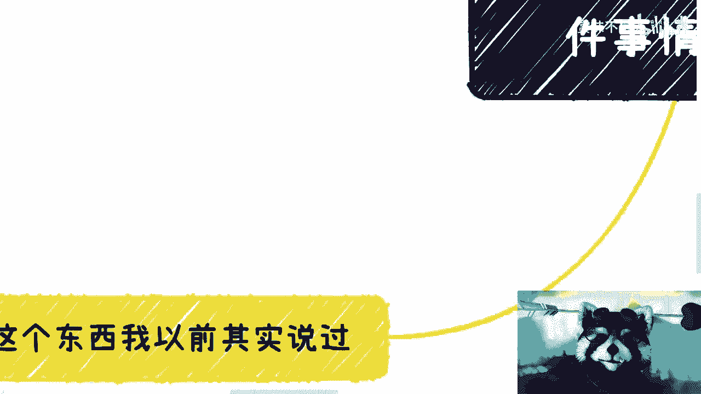

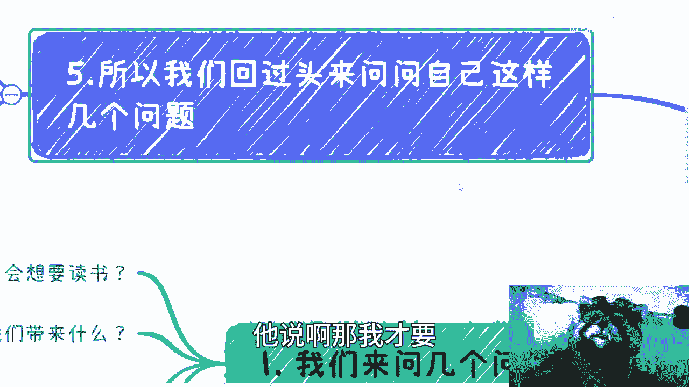

首先需要明确，这里讨论的不是义务教育或高等教育，而是毕业后的自我提升阅读，尤其是商业类书籍。

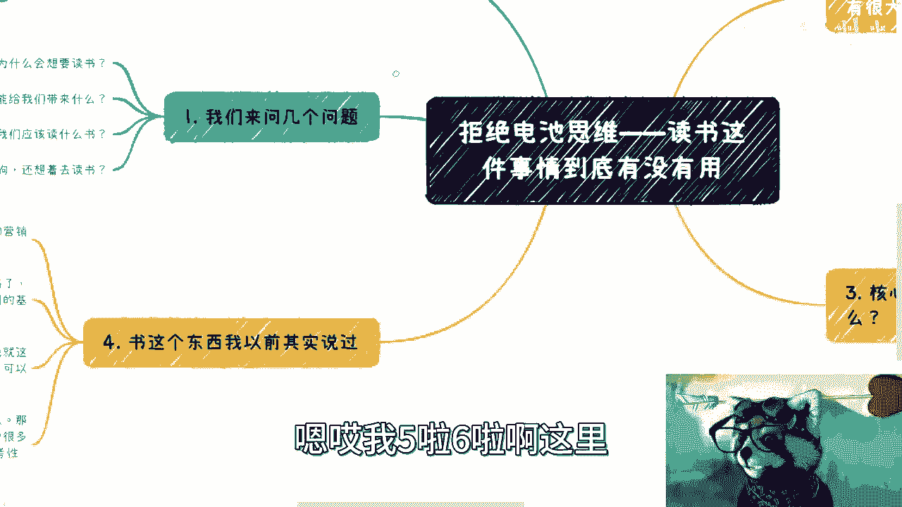

成年之前的教育属于技能和思维养成，无疑是有用的。但成年之后的学习，对于普通人而言，首要目的应该是**搞钱**（创造经济价值）。如果阅读不能服务于这个核心目的，其实际效用就很低。

读书的难点在于：
*   **认知门槛**：很多人能看懂书里的故事，却无法理解作者背后的深意和现实世界的运行逻辑。没有足够的阅历和认知，阅读只是浮于表面。
*   **出版物的商业化**：现代出版物是高度商业化的产品。审核严格导致真正有深度的内容难以面世，而能出版的书大多经过了营销包装，旨在实现商业价值。
*   **内容的时效性**：许多经典书籍的内容可能与快速发展的当下社会有所脱节，参考性减弱。

因此，阅读是一个需要结合自身经历进行深度思考的过程。单纯接收信息，而不加以批判、联系和实践，是无效的。

**核心观点：有效阅读 = 输入内容 × 个人认知 × 实践验证**

---

## 从“知道”到“做到”的鸿沟 🚀

上一节我们指出了阅读的难点，本节中我们来看看如何跨越从“知道”到“做到”的鸿沟。许多人读了很多书，听了很多道理，生活却依然没有改变。

问题在于：
*   **依赖二手信息**：听别人的读后感、刷短视频看成功案例，这些信息看似有道理，但与自身无关。你既无法验证其真实性（如银行流水），也无法直接复制其成功。
*   **情绪消耗**：过度关注与自己无关的信息，只会产生焦虑、嫉妒等情绪，消耗宝贵的精神能量，对实际进步毫无帮助。
*   **虚假的关联感**：例如，花钱加入“大佬群”并不意味着你建立了有效人脉或获得了能力。这就像买了书不读，却感觉自己已拥有知识一样，是一种自我安慰。

普通人进步的最大阻碍之一，就是不愿听真话，宁愿活在美好的童话世界里，用微薄的收入去为各种“幻觉”买单。

**核心警示：信息过载 × 零行动 = 零成长**

---

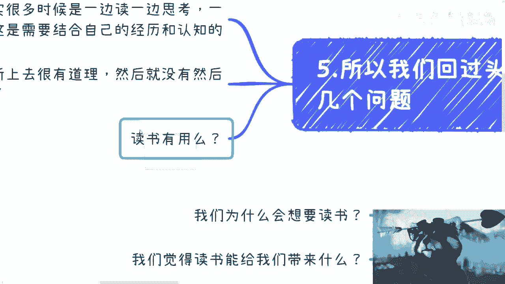

## 总结与核心建议 🎯

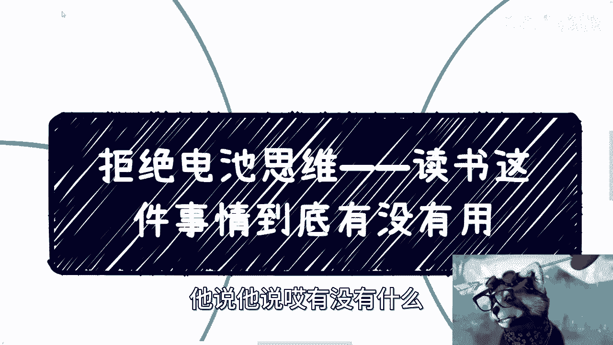

本节课我们一起探讨了“读书是否有用”这一话题。我们分析了常见的读书动机、读书会的商业本质、有效阅读的认知门槛以及从知到行的巨大鸿沟。

总结如下：
1.  **目的要明确**：对于普通人，成年后的阅读应紧密围绕提升**变现能力**和解决实际问题展开。
2.  **认知是前提**：没有足够的社会阅历和认知水平，很难从阅读中汲取真正有用的养分。阅读需要与个人经历结合思考。
3.  **警惕商业化内容**：对现代出版物要保持批判性思维，理解其背后的商业逻辑。多读经过时间检验的经典。
4.  **行动是关键**：远离那些消耗你情绪却无助于行动的二手信息。真正的成长来自于实践和验证，而非单纯的收集和阅读。
5.  **尊重时间价值**：将时间和金钱投资在能产生实际回报的事情上，无论是提升技能还是拓展真正有价值的社交。

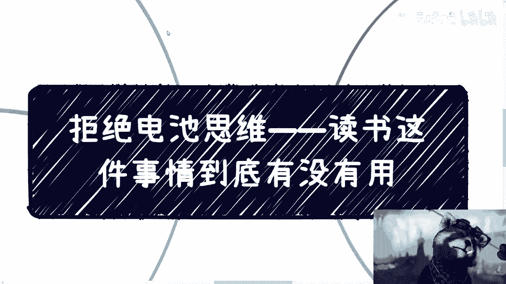

最终，一切都与**思维模式**有关。改变命运的关键不在于读了多少书，而在于是否建立了以目标为导向、尊重价值、专注行动的“资本家思维”。

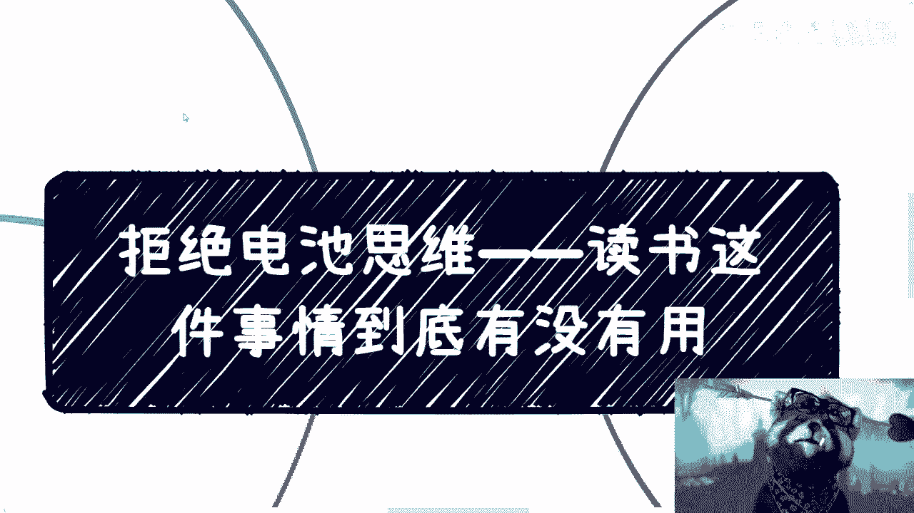

**最终公式：个人成长 = (明确目标 × 有效认知) / 情绪消耗 × 持续行动**