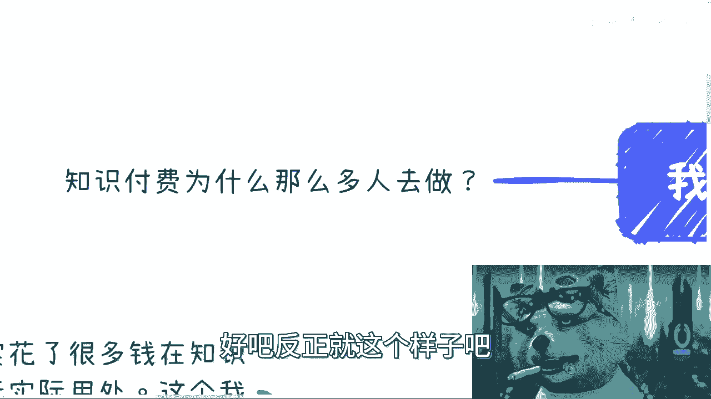

# 拒绝电池思维——知识付费会不会在下一个经济周期衰败？ - P1 - 赏味不足 - BV1hm4y1a75k

Hello，大家好啊，这个昨天是周一啊，前天是周一是吧，呃我想明白了啊，我已经摸清楚B站这个审核的路数啊，所以我打算越来越放肆啊，嗯前两天有小伙伴私信我说这么个事儿啊，他说啊知识付费啊。

这个东西会不会在下个经济周期衰败啊，什么意思呢，简单来讲就是说呃在下个经济的上升期，它会不会出现，比如说下滑，或者说价格经济在整个经济周期嗯，比如说这个迭代的时候，或者说进进步的时候，他会不会摔衰败啊。

啊我跟你们讲，首先真心啊，什么玩意儿，首先真心的这个是个非常好的问题啊，然后呢我就放在这个垃圾，就放在这个叫什么，这个拒绝电池思思维之下面啊，让我们从不同的角度来看一下这个问题啊。

呃今天这个内容我这个扩展的蛮多的，感觉写着写着就写了好多，首先啊为什么需要知识付费对吧。

好有一说一啊，最近咨询下来啊。

好多人其实花了很多钱在知识付费上面，但结果都是一样的，毫无卵用啊，这个呢我觉得我们可以单独说一期，为什么毫无卵用对吧。

为什么有的人有卵用是吧啊。

这第一个第二个呢就是说会知识付费的呢，一定是因为信息差啊，一定是由于自己的认知不足啊，导致对方的这个呃，导致感觉啊对方这个信息很牛逼啊，就好像啊今天这个警警警察叔叔对吧，都跟我们说不要网贷啊。

不不要不要网贷，不要裸贷是吧，哈哈啊，不要视频啊，什么意思呢，就是有很多人觉得对方是个美女对吧，但是对方是不是美女，你又不知道对吧，那对方是不是抠脚大汉，你也不知道对吧，反正你就觉得对方是个美女。

那怎么办呢，对不对啊，所以说呢本质上就是你觉得对方的很牛逼，但实际上对方信息牛不牛逼，反正你是没有判断力的啊，你就好像前两天这个这个我们咨询的时候，也有人问我嘛，他说他说这个呃培训也好，咨询也好对吧。

包括这个陈老师，你你给别人咨询对吧，就他说为什么这么多人还是就是那种培训咨询，为什么还是会去买对吧，那难道就是说整个商业逻辑不应该是利他吗。

对吧，就我说这是利他没毛病啊。

但是你要明白一点，所谓商业逻辑利他是什么，是让对方觉得利他就可以了，是不是利他，咱们先不去管他，对不对，这剧场好像刚刚我们说的，你只要让对方觉得你是个美女就可以了，你是不是个美女，这并不重要啊。

对不对啊，那当然我们说到这个我再稍微提一点，就是这就好像什么，这就好像你们现在加很多群啊，然后呢这加了很多什么什么什么什么什么，比如说什么啊优惠券啊对吧，什么群啊，你们会发现那些客服的这个微信头像。

都是很好看的小姐姐对吧，哎啊都都是这样子的啊，那你说是不是好看小姐姐，你怎么知道呢，对吧你不知道，但是你看到第一眼啊，你大部分人反正心里面还是会麻痹一下的，就是啊哎蛮好的蛮好看的对吧嗯。

我喜欢跟他聊天是吧，那么对对方都是抠脚大汉，是不是啊。

那所以呢就是说这一方面，第二方面呢就是自己的焦虑呢一定是必要条件，这个是逃不掉的啊，但是呢你话又说回来，从基本盘来讲，焦虑这件事情是无法避免的，就如果基本盘不焦虑。

那他妈就不叫基本盘了，你知道吗，就就如果基本盘不交流，那这个基本盘可能就翻过来了，你懂吗啊，所以说呢无论过去现在还是未来。

他肯定都是焦虑的，我觉得这个不是国家的国情问题啊，这个是人性的问题对吧。

没办法的事情啊，然后还有一点呢就是自己行动力不足啊，需要去通过金钱啊来驱使自己这个行动啊，就好像我今天行动是不足啊，我也缺钱，但是呢我就愿意花3万块钱，感觉自己肉痛了啊，然后我去学习，然而然并卵啊。

这个除了自我感动没什么卵用啊，我就明确跟你们讲啊，没有为什么啊，人性就是这样子的对吧，这个我觉得大家都懂啊是吧，这个叫什么嗯，这这这个买书籍看过是吧，买了电子书下载集看过是吧，不都一样的吗，啊。

呃或者呢大家也就是他，或者呢希望有一个大家一起去学习的氛围，这个就像什么，你知道吗，我都忘了哪个人跟我咨询跟我说的，他说他说我还我不是真的，我客观的说我没有嘲笑他啊，就他说他加了一个一起早睡早起的群。

我说妈的这他妈都能收费，我真的我我得反思我自己，我他妈是啊，呵呵是吧啊。

我嗯嗯然后呢这个简单来讲呢，这就是这是一个单向的，你要明白，这是一个单向的信息差加心理的碾压局，你知道吗，就是就是单向的性，这个要割的人跟韭菜的这个单向局啊。

就就这样子啊。

而且嗯是信息差加心理值再加PUA值啊，这样啊明白了没有啊。

明白了没有啊，那么很多人呢也会关心这个问题。

他说唉我会不会知识付费对吧，那吕老师你会不会知识付费啊对吧，你有没有被割过韭菜啊哈我肯定被割过韭菜。

他妈的学费怎么能不付呢。

是不是啊，当然啊，我这两天咨询说的最多一句话是什么呢，就是我不建议大家去花钱，知识付费，我倒是建议你们花钱请人吃饭，那当然了，这个受众得要明确啊对吧，你不能这么阿猫阿狗都去请啊，是不是啊啊我也是一样的。

就是说我现在呢就不可能再知识付费了啊，呃但是呢我会花几千块，几万块，就这个这个这个请人吃饭啊，这个是会的。

为什么，因为我觉得对于大众来讲呢，请人吃饭是一种沟通啊，是一种针对大家实际情况的沟通啊，也就是说你是可以点对点之沟通的，对不对，那你说能不能解决是一回事情，但至少比大锅饭好吧对吧。

大锅饭是真的就是扔水里就无无解的呀对吧，而且啊我就跟你们说，其实而且我就跟你们说，其实有一个逻辑，其实我是觉得大众但凡只要想一想都懂，他只不过不愿意想，你知道吧，懒得想，就是如果今天有一个通用的方法。

他又愿意对吧，让大家以这种999或1999，这种叫做走量的方式来参加，那如果你们每个人都能赚到钱，那早就均富卡了，是不是对吧，那大富翁还玩什么东西啊，全部每个人手上一张均富卡结束了呀，对不啦。

可能问了就世界是这么运作的了。

这是这这这我觉得这个随便对吧，你你你你随便找个这个读完初中的都能明白，你说是不是啊，所以呢你看啊B站早期呢其实有很多受众啊，这个当时跟我说的，他说你这个吕老师，你要不要在那个B站上面弄个课对吧。

我不用哎，死活都不用，为什么，因为我弄课这个东西我弄出来，我又不知道大家要什么，对不对，哦好了，十个人付费是吧，付完费15个人说我蛮好的，五个人把我骂成狗，那我怎么说啊，对不对，没有意义的呀。

就是你你从我角度来讲，我作为一个资本家对吧，哦我既赚不到钱，我还帮不帮不到大家，我还被骂我，我图什么啊，纯亏本买卖，我他妈有毛病啊。

要么是不是啊，然后还有我为什么现在不会知识付费，因为我逻辑很简单，就是如果你要给我知识对吧，OK你有什么知识啊，你有知识，我他妈姑姑不知道吗，啊我去看各种report，不知道吗。

我去找我那些PHD的同学，找那些教授不知道吗，啊就他妈你知道啊，我们那么奇了怪了，你说是不是啊，还还还需要文明啊，文明呵呵，如果你给我人脉，对不对，那我就跟你讲更奇怪了对吧。

就是你给我一个叫名字叫A的人，我不管他神通广大对吧，三头六臂，那他妈世界上跟你A这样的人类似的人，多了去了，又不是只他妈缺了你A这个人就他妈不赚了，我可以找别人问了，我非要花钱找你。

找这个A的人脑子有毛病吗，你说是不是啊，当然啊，其实我觉得呢，大众这个反向思维一下也就知道了，但凡你能花钱找到的人，人脉啊和知识，说明就不是什么很有价值的事情，为什么，因为所谓有价值的事情，那很简单。

我给你举个例子，比如说今天有人找我合作，对不对，好合作，我是不可能在B站上跟大家说，哎你看我们合作了对吧，我们赚了多少钱对吧，哎不可能的，但是你反过来说，今天有一个人找我合作，没问题。

卧槽今天他妈要500个人找我合作，哎我都去合作对吧。

你觉得可能不难，就是你从世界运作规律来讲，500个人找我合作，这理论上其中他妈起码450个人，都他妈是骗子，或者说都是不靠谱的对吧，那如果我他妈500分都去合作，意味着什么，意味着我是对吧。

意味着我根本没有做视线效果对吧哦，我花了500个人的沟通时间，我只赚了一个人的这个单子钱，为什么脑子有病啊，对不对，所以这不可能嘛是吧，所以说呢就是说你要去想，你认识一个人有没有意义，没有意义，对不对。

他不能给你带来提升，他也不能给你赚钱，那他妈都是，对不对，这人就算巴菲特又怎么地了怎么地呢，对不了，啊有一说一对吧。

幼儿园又要杠了啊，他说太绝对了啊，花大价钱总归有价值的，对不对啊。

我跟你讲，记住啊，我们所说的永远都是基本盘啊，你要去割所谓的精英家庭，或者所谓的高净值人群对吧，他和歌大众完全是两种不同的逻辑啊。

这个东西我们以后再说，哎我跟你讲，这里面水他妈不要太深了啊。

逻辑不要太多啊，啊那就很好玩，你知道吗，真的很好玩。

那我们来说三啊，三呢就是商业模式啊，我们一直说商业模式，商业模式啊。

商业模式当中呢，这个我们说啊商业模式这个东西呢众多的优势。

其中有一个优势叫什么，是这样子的嗯，大家可能都明白抽象的意思啊，不是说你要去抽一个象啊，这个也涉及到字母是吧啊，我解释一下，也就是说今天啊虽然大家背景不同，知识面不同，但是撇开啊。

比如说我跟你们讲了一个商业逻辑啊，我会把当中一些专业的人啊，专业的知识啊，专业的渠道，专业的逻辑啊，全部撇开啊，然后呢，我去用一个对方能听得懂的逻辑讲出来对吧，那个我们叫抽象的逻辑对吧。

这就好像我跟你们说啊，我今天要去跟政府合作对吧，那我怎么去认识他们的呢对吧，这当中和谁打交道呢对吧，你们肯定是搞不清楚里面关系的，我如果用里面的这个就是真正的那些名词，真正的这种称呼去代替。

没有人听得懂对吧，那我肯定得抽象，就告诉大家，你看啊ABCD对吧，这样解释啊，然后A和B什么关系，B和C什么关系对吧，这都差不多，反正就这个意思啊，那么大家肯定就能听得懂，对不对啊。

那么商业模式这个东西呢，其实最不需要去试错啊，就是就是大家一直听到一句话叫做，不要重复造轮子，我跟你讲商业模式，这个东西就他妈的只要重复造轮子，为什么，因为到了今天新的商业模式要不要摸索要。

但这个东西跟你们跟我都没关系，我们作为一个基本盘，我们没有这个能力去摸索新的商业模式，我们但凡有这个新的呃，那个能力摸索新鲜的商业模式，你们这么早就到纳斯达打call敲钟了，你知道吗啊。

那么最好的呢就是CTRLCCTRLV啊，就最简单就是怎么别人怎么做，我们怎么做，而就简单的简单明了，别去想这么多啊，那好，那么其实呢我我觉得啊啊，这个我们前两天也说嘛对吧，除了读完书啊，除了找工作以外。

还有没有别的路，有啊什么路呢，就是你只要去摸通一个商业模式的0~1啊，什么叫0~1，因为商业模式里面分成几块比较大的东西，一块是谁买单对吧，你怎么找到你的目标客户，第二就是怎么营销对吧，谁来营销。

谁负责营销，怎么去营销对吧，第三就是你怎么去认识这些人，你如何打通这个人脉关系，对不对，好无非3。0到一，但凡你能摸清楚，任何一个再小再小的商业模式的0~1，那么你会发现你做什么其实根本就操。

我他妈又写错啊，根本就不重要，什么意思呢，就是因为什么行业抽象之后都是大差不差的，你知道吗，就一部只有一部分的很小的出路，我相信根据你的聪明才智，马上就能明白怎么运作的，为什么意思呢。

就是你要摸索的是一个通用的一个模式，这个模式无论今天行业好坏，无论今嗯经济好坏，也无论你做什么没有关系，你今天卖一碗粉，你可以去赚到钱，你明天去卖大数据也可以赚到钱，你后天卖AI也可以赚到钱。

你大后天卖坨屎，他妈的一样能赚钱，没有区别的，你知道吗，一点区别都没有的啊，为什么抽象啊，抽象的通用模式很重要，是因为我跟你们讲，但凡正常人随便想想就能明白一个道理，就是所有人啊，所有人就是基本盘的。

所有人一辈子，真正的学习高峰期就那么几年对吧，真正的经历经历的旺盛期也就那么几年啊，我我跟你们说，说的不好听点，我觉得大部分人到我现在这个年龄对吧，能有我现在的这么一些想法。

能有我的这么做事情的这个热情和没就是就没，就像我一样，没有没有，就是很明显的小毛小病已经是他妈的奇迹了，对吧啊，某个行业，而且另外一方面，就是任何一个行业能不能经久不衰，你们自己心里其实都明白对吧。

其实大家都知道，但是我就问你们，大家基本盘其实都知道答案，为什么大家要去选择，就是就不停的往工作上去，不停的往学历上去，不停的去往上面去卷，为什么对吧，其实我觉得就是因为就是从我角度，我是想不通的。

但是从基本盘角度来讲，我觉得我能理解为什么，因为大家不知道有别的路对不对，但是你会发现选这个路的时候，大家为什么会焦虑，就是因为他知道我不可能，我今天是能够紧跟潮流对吧，我学生的框架。

学生的语言学习的技术，但是我能学多久呢对吧，我能保证35岁，40岁我都能学吗，不一定啊对吧，那大家也害怕换行业，害怕从零开始，我也知道我也害怕对吧，或者说我曾经害怕过对吧，但是你有没有想过。

对于基本盘来讲，大部分人早晚都是要从零开始的，这个不是说大家有野心啊。

这个是被迫无奈啊，生活所迫啊，你懂吗好了，所以说到这里呢又要出现那句话了对吧，总有人会来说，他说哎那总要有人去学习新知识吧，总要有人打工吧对吧，普通人不就是一直学习的吧。

一直被迫转转的嘛对吧呵呵你们自己想想看，你们现在在用你们的，就是就是我们叫做非电池的思维，去想想看这些话，你们什么感想，你们只会，我相信大家只会感受到浓浓的PUA的感觉对吧，就这么简单。

啊那么这个是三啊，那么我们说了这么半天啊。

来讲主题啊，就到底会不会衰败啊，其实说到现在我觉得大家心里也有数了啊，那么知识变现呢其实一直以来都是有需求的啊，从古至今啊，只不过互联网呢最早的公众号啊，或者别的方式去放大了这个模式，或者这么说。

就说以往的知识付费，可能更多的还是在刚需上面哦，所谓的比如说语数英语数英啊对吧，这个这个物理化学啊对吧，然后什么K12教育啊对吧，这些是所谓的刚需啊，那么他会有，但是他并没有走走到大众视角。

对这就好像今天如果放到20年前，我来跟你们讲这些东西，谁他妈我啊，这这这什么玩意儿，他妈的，你怎么不看呢，对吧，一定是这样的，但是随着时间的发展，随着互联网发展。

就出来了非常多的非我们以前认为刚需的东西，但是刚需这个词它并不是一成不变的对吧，因为没有什么东西是完全刚需，也没有什么东西是完全不刚需的，就说白了就像我们刚刚说的，所谓利他，只要让他觉得利他就好了。

没有什么东西是绝对利他，对不对，所以说又又回到了过去，所以说就说你今天卖坨屎给他，你只要让他觉得哎这坨屎是香的对吧，那不就可以了嘛，别的不重要，对不对啊，那么其实知识付费呢模式非常多样化，什么意思呢。

就是说大众现在所看到的什么知识星球啊，呃什么什么知识知识，那个叫什么公众号啊对吧，什么小恶童啊对吧，什么抖音啊，这些啊其实只不过真的只是冰山一角啊，就是说呃从知识付费角度来讲，我随便列给普罗大众的。

给中小企业家长，给土老板的，给政府基层的，给政府高层的，给企业的对吧，给培训机构的，给那些想要去割别人的知识付费的，给咨询的，给协会，商会的，给高校的，给老师的，什么都可以给，哎你知道吧。

就但而且另外一方面就是我跟你讲，你别看这些东西啊，每一个里面水都很深的，每个里面水这个模式都不一样，所以我跟你讲就真的很有趣啊，所以我为什么说了一大堆呢，就是因为知识付费这种模式是通用的。

无论时代怎么变化，无论内容怎么变化，无论热点怎么变化，它的模式永远是走得通的，你知道吧，那么经我们来说，经济不好的时候，我跟你们说，经济不好的时候，只有两个东西是深入人心的，一个是以小博大。

因为经济不好，大家只想以小博大啊，第二就是说呃知识付费，为什么呢，因为老百姓想要给自己安慰，想要抓住未来就是付费，但是你会发现他得到东西了吗，其实他没有得到东西，但是就像我们刚说的利。

他他自己觉得他得到东西，你知道吧，那么呃你会发现同样的钱你让他去吃一顿饭，他舍得吗，他不舍得，为什么，因为他对这顿饭的预期不一样，但是很可惜的是什么，其实这顿饭反而是对他有价值的。

而知识付费是完全没有价值的啊，那么经济好的时候呢，其实这就跟二级市场是一个道理，真的你们去对比一下一模一样，你知道吗，就经济好的时候绝对是会出现很多热点，到时候啊到那个时候岗位一多对吧，媒体再一放大啊。

媒体现在本市大也看到了，对不对，媒体再一放大啊，然后各种各样的什么牛鬼蛇神再出来一说对吧，一什么公众号每天给你刷屏啊，洗脑对吧，好这个时候基本盘就更头脑发热了，你知道吧，那他妈就更容易去付费了。

就是这个时候他妈的，比如说啊999，到那个时候给他他妈9999，都可以付，我跟你讲啊，本质你会发现其实就是二级市场的逻辑，对不对，就是那里面哦涨了涨了涨了涨了10%啊，不敢不敢涨20%，哎呦。

不敢不敢不敢算了算了，他要跌的涨50%，哎呀，不敢涨百分之百哦，哦耶哦耶梭哈。

不就是这样子的吗，对了这个有什么区别，没区别。

你知道吗，所以经济逻辑啊，经济逻辑真的是有道理的，经济逻辑。

哦好，然后我这个地方还提了一点。

啊啊提了一点。

就是我就说啊，我说个题外话，说个题外话，就是知识付费啊，为什么为什么那么多人去做。

你们有没有想过这个问题，为什么知识付费这么多人去做啊，就是你会发现其实各行各业。

不管他是做什么的，大家都说嘛，什么以前都说嘛，宇宙的尽头是带呃，是麦克对吧，宇宙尽头是带货，其实克也是货的一部分嘛，也可以称之为货嘛。

对不对，那为什么这么多人去做，我跟你们讲，其实是有道理的啊，因为你们真正去做商业了之后。

你们会发现很多路是很难走的，很多的叫什么，就是逻辑也很难走的，很多的这个关系也很难走的，但是从资本家角度来讲，就是我以前以前告诉大家嘛，从资本家角度来讲，其实只要赚钱，一定要投入产出比高的赚钱。

没有必要自己跟自己过不去，一定去，比如说寻找，就是你非要去找一条什么极尽坎坷的路，去去那个那个赚钱，其实没有必要，对不对，那为什么做人这么多人会去做这么多行业去做，是因为知识付费，从本质上来讲。

它是可以从各个角度去赚钱的，而且它其实是可以作为很多产品的，售前就是它的可插拔性很强，它的变多变多变，就是多样化很强，它的这个叫做叫做跟别的任何产品的，这种结合性很强，同时无论你怎么做啊，无论你怎么做。

你只要不是去卖金融产品，不卖p two p，从知识模式来讲啊，从知识付费来讲，前两天直播我也说得好，说得很清楚，他是不违法的，就法律你不要说你你别说违法了，他连擦边都擦不到，你知道吗。

所以说这个东西呢其实是就是说很容易去做的，或者说是相对来讲门槛非常低的一个东西哦，所以这也是为什么说到现在为止，会出现这么多的啊。

叫做这种这个知识付费东西啊，但是我们再往下想啊，其实知识付费这个东西谁都可以去做啊，但是啊就是说嗯如果真的从赚钱角度来讲，大家一定要明白啊，培训咨询是赚不到钱的啊，培训咨询是赚不到钱的。

呃这句话但凡你们去做过，你们就会明白，培训跟咨询，一定是要为背后的服务和产品去服务的啊，如果你没有背后的后手，就是所谓的就是说啊组合拳对吧，我们在商业层面叫组合拳，如果要说你没有后续的产品。

你单纯做培训咨询，你要你要能赚钱对吧，可以啊，只有一种可能性走量啊，就比如说你手下有1万个老师啊，然后就在那边干对吧，但是你会发现就算如此，你可能也赚不到钱啊，为什么，因为哎呀你的营销费用啊对吧。

各种各样的费用啊对吧，你这个算下来，你可能毛利也也不多啊，好吧，反正就这个样子吧。

我觉得今天讲的已经蛮多了啊，大家希望在这里面能够举一反三啊。

能够明白这个我想说的这个背后的逻辑，好吧啊行吧，那就这么着吧啊，有任何东西咨询的，反正你们在私信我，好吧啊。

